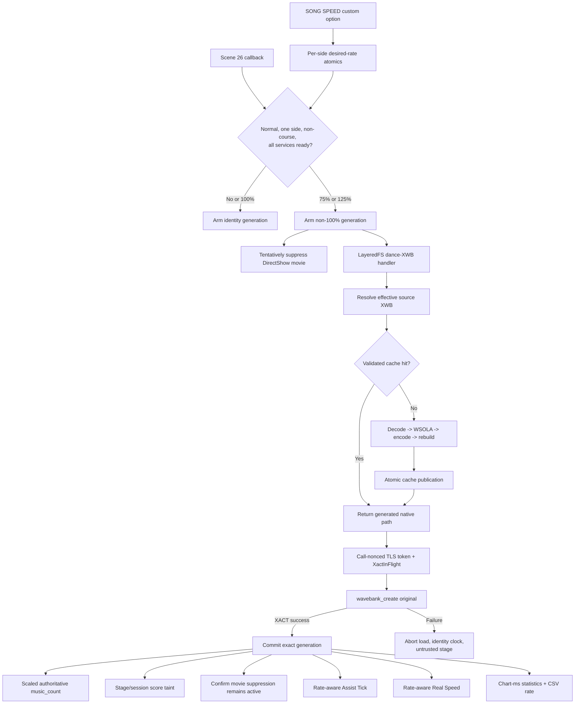
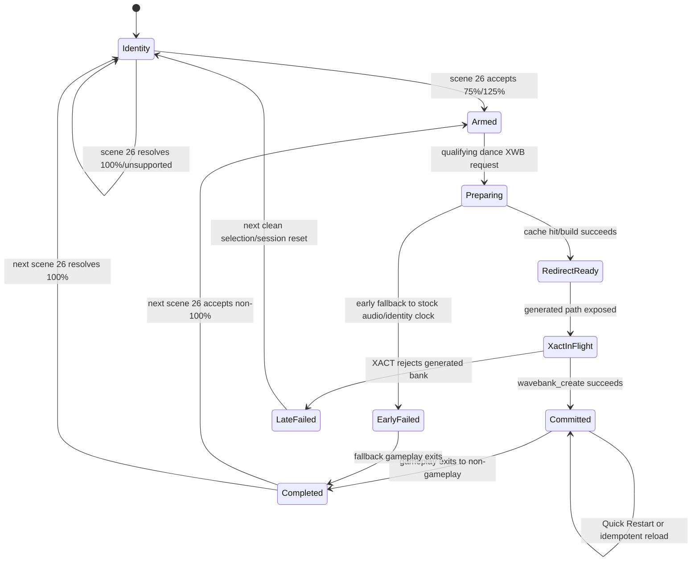

# Detailed Design: Song Playback Speed

Status: Approved 2026-08-05

Date: 2026-08-05

Revised: 2026-08-05 after six-aspect review and focused follow-up review

## Overview

Song Playback Speed adds a per-player `SONG SPEED` option that changes the next
song's tempo while preserving musical pitch. The first release exposes 75%,
100%, and 125%. A non-100% selection is supported for ordinary e-amusement-
connected solo and doubles play. Local versus, courses, matching/BPL, demo,
special-event, and unclassified flows remain at 100%.

The game continues to use its native XACT2 streaming path. For non-100% play,
the DLL reads the selected song's effective XWB source, decodes both stereo
MS-ADPCM entries, time-stretches them, re-encodes them, rebuilds a compatible
streaming XWB, and redirects XACT to a persistent cache file. It does not alter
the song's XSB or chart timestamps.

The generated audio duration defines an exact effective rate. A permanent
identity-controlled inline patch applies that rate to the game's authoritative
`music_count`, keeping native judgment, rendering, freezes, shocks, mines,
tempo changes, and sequence progression in the chart's existing content-time
domain. Dependent features consume the same committed rate.

Every non-100% stage is assisted play. Its stage score is suppressed and its
logout save is sanitized through the existing score guard. Ordinary profile,
option, and calorie updates remain eligible to persist.

### Scope

- Pitch-preserving 75%, 100%, and 125% playback.
- Per-player option persistence through the custom-options framework.
- Ordinary e-amusement-connected solo and doubles.
- Strict stock/custom-song XWB compatibility for the supported DDR World bank
  profile.
- Persistent, bounded, on-demand cache generation.
- Score, movie, Assist Tick, timing-statistics, and Real Speed integration.
- Native Windows and CrossOver support.

### Non-Goals

- Changing speed during a song.
- Independent simultaneous rates for P1 and P2.
- Local versus, courses, matching/BPL, demos, or special-event chains at
  non-100%.
- Pitch-changing XSB resampling as a user-facing fallback.
- Transforming unsupported XWB codecs or layouts.
- Synchronizing DirectShow movies at non-100%; movies are suppressed instead.
- Transparent same-attempt stock retry after XACT has rejected a generated XWB.

## Detailed Requirements

### User Behavior

1. The mod id is `song-playback-speed`; its custom-option id is `song_speed`.
2. `SONG SPEED` is registered once during mod initialization, before the
   one-time custom-option atlas flush and profile-load drain. The framework
   exposes it on the native MODS tab only while the mod and every required
   runtime integration are available.
3. Allowed values are 75%, 100%, and 125%; 100% is the default.
4. The raw percentage is the persisted wire/cache value. A `load_transform`
   normalizes unknown persisted values to 100% before the registry stores,
   displays, or later saves them; the callback mirror applies the same
   normalization defensively.
5. The option uses `PersistMode::Full`, so supporting servers can round-trip
   `mod_song_speed` and the existing offline per-side cache can restore it.
6. The editable value affects the next newly selected song. It never changes an
   active song.
7. Quick Restart retains the current audio, rate, generation, and score taint.
8. Disabling the mod during a song affects future selections only. The active
   song retains every integration until it exits gameplay.

### Eligibility

9. The rate is resolved only on entry to normal scene 26.
10. Exactly one entered player side must be identifiable. That side's option
    selects the shared song rate for both the audio stream and gameplay clock.
11. A nonzero course-mode field, zero entered sides, two entered sides, missing
    session pointers, or missing required services resolves to 100%.
12. Matching/BPL and special/event chains use separate scene ranges and never arm
    a normal scene-26 generation.
13. Ordinary e-amusement server connectivity, card use, profile loading, and
    profile saving do not disable the feature.

### Audio

14. At 100%, the rate handler has zero data footprint: it returns no dynamic
    replacement and preserves ordinary LayeredFS behavior.
15. At non-100%, the handler reads the effective XWB source, including an
    earlier static LayeredFS replacement when present.
16. The exact v1 profile is: `WBND` version 43, header version 42, bank flags
    `0x00090001`, non-compact format, five ordered/non-overlapping in-bounds
    segments, segment 0 length 96, segment 1 length 48, empty segment 2,
    segment 3 length 128, segment 4 ending at EOF, 24-byte entry metadata,
    64-byte null-terminated bank/entry names, 2048-byte streaming alignment,
    entry data ranges non-overlapping with every non-first offset aligned, and
    exactly two entries named `<code>` and `<code>_s` in either order.
17. Both entries must be stereo MS-ADPCM (`codec=2`, channels=2,
    `block_align_raw=48`, bits flag=0), have lower entry flags zero, a nonzero
    representable sample rate, a 28-bit logical duration, and satisfy the
    duration/loop rules below. Unsupported banks use 100% before any generated
    path is exposed.
18. Both entries are transformed independently while preserving bank name,
    entry order, entry names, sample rate, packed codec/channel profile,
    streaming flags, and XSB-visible wave indices. The exact `<code>` entry is
    the authoritative gameplay-rate entry.
19. Source compressed lengths may contain the corpus-proven stock tool remainder
    of 0, `block_align-1`, or `block_align-2`. The decoder consumes complete
    blocks only and requires
    `ceil(logical_duration / samples_per_block) == complete_blocks`; it then
    trims PCM to logical duration. Generated entries contain exact whole blocks
    with no partial tail.
20. For source logical frames `N`, samples per block `B`, and percentage `P`,
    output blocks are half-up-rounded `N * 100 / (B * P)` using checked `u128`
    integer arithmetic and clamped to at least one; output frames are
    `M = blocks * B` and must fit the XWB 28-bit duration field. The main exact
    rate is `N / M` reduced to lowest terms.
21. The time stretcher preserves sample rate and pitch, emits exactly `M`
    frames, jointly scores both stereo channels, uses one offset for both, and
    is deterministic for the same input and algorithm version. Each logical
    entry must be long enough for one synthesis window plus search radius;
    shorter entries are outside the v1 profile.
22. Loop regions are half-open `[start, start+length)`. Map each boundary with
    half-up `round(boundary * M / N)`, derive generated length as
    `mapped_end - mapped_start`, and allow at most a one-frame clamp to `[0,M]`;
    larger correction, reversed/zero mapped loops from a nonzero source loop, or
    overflow rejects the bank. Looped preview generation uses cyclic source
    context at the actual mapped loop boundary and must pass an explicit seam-
    continuity test.
23. Generated duration is exactly `M`. The diagnostic phase must establish that
    this duration/loop metadata is the XACT voice-termination contract before
    generalized runtime generation is released.
24. An uncached generation may pause or extend the stage-loading screen. DSP
    runs on the single generation worker with no game/service lock held; only
    the proven streaming `fs_convert_path` call waits, for at most 30 seconds.
    lstat/open probes may start or observe work but never wait. A diagnostic log
    records caller thread identity and whether render frames continue.

### Cache

25. Generated banks live under
    `data_mods/_cache/song_playback_speed/` and are never distributed as source
    assets.
26. Cache identity includes source-content digest and length, requested
    percentage, exact per-entry output frame counts, stretch/codec version, and
    cache-format version. The immutable manifest also records an output-content
    digest and output length.
27. Publication writes and validates a temporary XWB, atomically renames the
    immutable XWB, then atomically renames an immutable manifest last as the
    commit marker. Cache hits require both files and verify the output digest.
    Mutable last-used data lives only in a separate LRU index.
28. Concurrent probes for one key share one build. At most one CPU-heavy build
    runs at a time. Queued obsolete jobs are cancelled; an in-progress obsolete
    build cooperatively checks cancellation between entries, WSOLA windows, and
    ADPCM blocks and wakes every waiter on success, failure, timeout, or panic.
29. The default cache limit is 10 GiB and is configurable through
    `song_playback_speed.cache_limit_gib`.
30. Cache entries use leases under the same lock as build/eviction state.
    Eviction runs outside AVS hooks, claims an `Evicting` state, removes the
    manifest commit marker before the XWB, and never removes a Building, exposed,
    XACT-owned, late-failed, or otherwise leased entry.
31. Startup recovery removes orphan temporary files, XWBs without manifests,
    manifests with missing/corrupt outputs, and stale version entries. It can
    report size and supports an operator-safe cache purge while no entry is
    leased.

### Clock and Transaction Safety

32. The central clock patch installs once, starts at exact identity, and is
    never removed while the process is live.
33. The patch scales the complete signed `music_count`, including negative
    lead-in time, with deterministic symmetric rounding and saturates the final
    result to i32 bounds.
34. Scene 26 arms a generation but leaves the clock at identity. Once a
    generated path is exposed, that generation enters uncancellable
    `XactInFlight`; a later arm is deferred until the call commits or fails.
35. The `wavebank_create(file_id)` detour creates a thread-local call nonce/depth
    frame. LayeredFS fills it only when `avs_fs_convert_path` successfully
    exposes a generated path, including the exact normalized virtual-path hash,
    generated-native-path digest, cache-key digest, generated-output digest,
    generation, and rate.
36. The detour calls the original exactly once. Before path exposure, the full
    token is copied into a preallocated `XactInFlight` slot with owner thread/call
    nonce. Post-call code is allocation-free, lock-free, contains no panicking
    operation, and consumes only the matching TLS/in-flight record. If TLS state
    is unexpectedly unavailable, an owner-thread/nonce match recovers the exact
    in-flight record. If exact recovery still fails after generated exposure,
    the detour overrides its return to failure to abort loading; the original is
    never called again.
37. Non-100% commit is an infallible allocation-free, lock-free sequence:
    publish stage and session score protection first, confirm the already-
    tentative movie policy second,
    write the immutable rate snapshot through a seqlock third, and write the
    non-identity Q31 clock slot last. Reset writes Q31 identity first and never
    clears unconsumed score taint.
38. Unrelated wave banks, lstat/open probes, previews, stale generations,
    mismatched path/cache digests, and ordinary static LayeredFS replacements
    cannot commit a rate.

### Cross-Feature Behavior

39. Non-100% commit increments a per-side pending rate-tainted-stage counter
    exactly once per generation. A stage-save suppression consumes one pending
    count only after the save trampoline elects to suppress it; scene changes do
    not clear pending counts. Quick Restart/re-exposure of the same generation
    cannot increment twice.
40. The session logout save remains sanitized and forwarded so profile/options
    persist while result and league data are removed.
41. Before release, a field-level audit must account for result records, course
    records, grade/Dan, league, flare/skill, play counters, calories, and any
    other profile aggregate touched by a modified stage. Every competitive field
    must be proven contained in suppressed/sanitized data or added to sanitation.
42. DirectShow background movies are tentatively suppressed when a non-100%
    generation arms, before any possible `BuildGraph` call, leaving the static
    background. The policy remains suppressed through that attempt even if an
    early audio fallback occurs. The non-native-OS workaround and song rate share
    one movie hook.
43. Assist Tick converts content positions and restart skips to wall time with
    the exact committed rate. Its bank capacity increases from 300 to 400 wall
    seconds so 75% retains 300 seconds of chart-content coverage.
44. Native judgment windows remain content-time windows. At 75%, they are wider
    in wall time; no separate threshold scaling is applied.
45. Power User Statistics retains content-domain error values, labels them as
    chart milliseconds, and writes requested/effective rate data to CSV output.
46. At non-100%, Real Speed always keeps the player's selected target unchanged
    and derives its normalized multiplier from `Core BPM * effective_rate`,
    independent of the separate Real Speed Fix toggle. At 100%, the toggle still
    selects stock BPM-reference behavior versus the Core-BPM fix.
47. Calories and ordinary profile/custom-option changes remain eligible to
    persist. Competitive result/ranking data remains suppressed by the score
    guard.

### Failure and Release Gates

48. Unsupported mode, unavailable hooks, source-read failure, validation
    failure, generation failure, cache failure, or cancellation before path
    exposure falls back to stock 100% with a bounded warning.
49. If XACT rejects a generated path after native-handle bookkeeping begins,
    the original false return owns the loading abort. The service keeps identity
    clock state, quarantines and process-pins the cache key, preserves tentative
    movie suppression, and does not retry stock audio in the same attempt. If
    gameplay unexpectedly starts, gameplay-entry policy adds pending/session
    score taint before any score can be trusted.
50. A failure after modified audio begins retains score taint through the save
    lifecycle.
51. The option is not released until a developer-only pre-generated-bank test
    proves first/last-note alignment, natural song end, no drift, score
    suppression, and 100% restoration.
52. Release additionally requires 75% and 125% validation under native Windows
    and CrossOver, plus the repository's standard check/format/release build
    gates.
53. Quick Restart must either prove that every supported build reuses the slot-5
    bank or support idempotent re-exposure/recommit of the same cache entry. The
    latter is the required implementation; instrumentation remains a release
    gate.

## Architecture Overview



### Lifecycle State Machine



The clock may return to identity at an ordinary gameplay exit, but tentative
movie suppression lasts through the attempt and pending rate score taint remains
until the corresponding stage save consumes it. The existing one-shot
`STAGE_RESULT -> GAMEPLAY` redirect is resolved before scene publication, so the
expected Quick Restart callback is gameplay-to-gameplay; diagnostics must prove
that on each supported build. Even if the bank reloads, the same committed
generation re-exposes and recommits idempotently.

Definitive lifecycle rules are:

- `GAMEPLAY -> GAMEPLAY`: Quick Restart; retain generation, Q31, movie policy,
  cache lease, and pending score count.
- `GAMEPLAY -> any non-GAMEPLAY scene`: write Q31 identity first, mark the
  generation completed, clear the song-rate movie contributor, and retain
  pending/session score state until save consumption/session reset.
- entry to normal scene 26 after no XACT call is in flight: arm the next
  identity/non-identity generation; never clear pending score counts.
- title/attract/new-session reset with no XACT call in flight: force runtime
  identity and clear non-score generation state; card-in reset owns clearing
  consumed/obsolete session score state.
- mod disable: set future-policy disabled and option unavailable, but keep the
  permanent callback and current attempt state until a definitive boundary.

## Components and Interfaces

### `SongPlaybackSpeedMod`

Location: `src/mods/song_playback_speed.rs`.

Responsibilities:

- register the `song_speed` enum once in `init`, before atlas flush/profile
  drain, with a load transform and a framework availability gate;
- normalize option callbacks into per-side desired-rate atomics;
- register one permanent scene callback in `init`; disable changes an atomic
  policy flag but does not remove lifecycle observation for an active song;
- resolve scene-26 eligibility and call the service's arm API;
- preserve the active generation when disabled during gameplay;
- report inactive when the shared service cannot guarantee audio/clock/score/
  movie integration.

Registration uses bespoke label/value textures:

- `seop_item_song_speed`;
- `seop_op_song_speed_75`;
- `seop_op_song_speed_100`;
- `seop_op_song_speed_125`.

The option callback performs no I/O and calls no game API; it only normalizes
and stores the desired value.

The custom-options service gains `set_option_available(id, bool)`. Registration
and persistence remain stable while unavailable rows are omitted by the builder.
This allows a boot-disabled mod to be enabled later without missing atlas assets
or profile values.

The scene callback runs while the current `scene_manager` implementation holds
its callback-iteration lock. It may read atomics/raw session state and invoke
only the nonblocking atomic `try_arm_next_song`; it must not take a mutex, wait,
perform I/O, call a game function, or call/re-enter any scene-manager API. A busy
arm fails closed to identity with a bounded warning. No song-rate path may hold
its own lock while initiating a scene transition.

### Song Rate Service

Location: `src/services/song_rate/`.

Suggested modules:

| Module | Responsibility |
|---|---|
| `mod.rs` | Public API, coordinator state, generation lifecycle, committed-rate publication |
| `clock_patch.rs` | Verify/install the permanent `music_count` stub and write its multiplier slot |
| `wavebank_hook.rs` | Own the sole `wavebank_create` and wave-bank-unregister detours, call-nonced TLS frame, and cache lease transfer |
| `stretch.rs` | Deterministic stereo-coherent WSOLA-like time stretch |
| `cache.rs` | Content keys, atomic publication, build deduplication, LRU metadata/eviction |

The reusable XWB v43 and arbitrary-channel MS-ADPCM implementation lives under
`src/core/xact/`, not a second service-local codec copy. Assist Tick's fixed
container writer migrates to the shared ADPCM primitives after parity tests;
its fixed XSB writer remains service-specific.

Conceptual public API:

```rust
pub fn init(
    signatures: &SignatureStore,
    module: &GameModule,
    cache_limit_gib: u64,
) -> bool;

pub fn is_available() -> bool;
pub fn set_mod_enabled(enabled: bool);
pub fn try_arm_next_song(request: ArmRequest) -> ArmOutcome;
pub fn applied_rate() -> RateSnapshot;
pub fn on_gameplay_transition(prev: i32, next: i32);

// Called only by LayeredFS for qualifying dance XWB paths.
pub fn prepare_replacement(
    virtual_path: &str,
    effective_source: EffectiveSource,
) -> PrepareOutcome;

// Called only from the synchronous generated-path conversion nested inside the
// current wavebank-create TLS frame.
pub fn expose_thread_redirect(token: RedirectToken) -> Result<(), ExposeError>;
```

The service never reads the custom-options registry itself. The mod owns product
policy; the service owns one coherent applied generation.

### LayeredFS Integration

Ordinary `fs_open`/`fs_lstat` replacement lookup remains unchanged and never
waits for a song-rate build. `fs_convert_path_body` adds one streaming-XWB branch
after resolving the effective static source:

```rust
struct SongXwbConversion {
    generated_path: String,
    token: RedirectToken,
}
```

The lookup order for a qualifying dance XWB is:

1. resolve a static direct/expanded LayeredFS source;
2. ask `song_rate` whether a non-100% generation is armed;
3. if armed, transform the effective source and return `SongXwbConversion`;
4. otherwise return the ordinary direct replacement or stock path;
5. preserve existing ARC/XML/texture/AFP behavior for all other files.

Only the `fs_convert_path` call nested within `wavebank_create` may wait for the
build and expose a token. Earlier lstat/open probes continue against the
effective source. The conversion hook validates the active TLS call nonce/depth,
then sets its exact-path token only after the original AVS conversion succeeds
for the generated path.

For a stock source, generation resolves the unmodified native path through the
original AVS conversion function into a private path buffer, then reads it with
ordinary file I/O. For a direct LayeredFS source, it reads that host path.

LayeredFS initialization becomes transactional for the hook set: on any install
failure it disables every hook installed in that attempt, clears `available`,
and reports separate `conversion_ready`/source-read readiness. Song rate requires
that explicit readiness rather than the current broad `is_available()` flag.

### Clock Patch

The signature resolves the structural calculation anchor and derives the exact
eight-byte site. Installation requires exactly one match and the literal bytes:

```text
44 8D 34 18 4C 8D 67 58
```

The stub:

1. replays `LEA R14D,[RAX+RBX]`;
2. sign-extends `R14D`;
3. multiplies by an adjacent signed Q31 factor;
4. rounds symmetrically and shifts by 31;
5. saturates and writes the scaled i32 to `R14D`;
6. replays `LEA R12,[RDI+0x58]`;
7. jumps back to the following `MOVZX`.

The Q31 factor is `round(effective_rate * 2^31)`. Identity is exactly
`1 << 31`; the supported factors fit a signed 64-bit product for every i32 input.

The stub uses only scratch registers proven dead after the immediately preceding
indirect call; implementation validation compares its disassembly and register
effects with the Rust reference over boundary vectors.

This feature also adds checked code-patch helpers to `src/core/memory.rs` for
protection failure, instruction-cache flush, readback, and rollback before
readiness publication. Existing patches may adopt them later but are not part of
this feature's required migration.

### Wave-Bank Hook

The `wavebank_create` AOB resolves the complete function entry and is verified
across the supported builds. Its ABI is treated as:

```rust
type WavebankCreateFn = unsafe extern "C" fn(file_id: i32) -> u8;
```

The detour uses `core::hooks::install_enabled` and follows this exactly-once
protocol:

```text
create TLS frame {depth, nonce}; clear its token
result = original(file_id)               // exactly once
token = take exact TLS frame, or recover owner-matched atomic XactInFlight
if result != 0 and exact token exists: commit_no_panic(token)
if result == 0 and exact token exists: late_fail_no_panic(token)
if generated exposure is known but exact recovery fails: result = 0; quarantine
pop TLS frame
return result                             // never call original again
```

The token includes call nonce/depth, normalized virtual-path digest, cache-key
digest, generated-output digest, generation, participant mask, and exact rate.
Nested/reentrant calls use distinct frames; overflow rejects rate handling. The
token is valid because `wavebank_create` synchronously calls AVS conversion
before returning.

A nonallocating TLS `FrameGuard` clears the frame on every pre-original exit.
After path exposure, the preallocated slot rather than TLS owns recovery state.
After commit, every recovery path retains the audio-matching Q31/snapshot and
score taint until a definitive lifecycle reset; it never resets only the clock.

The same module owns the XWB unregister callback target. A successful generated
bank transfers its cache lease to the active-XACT table; unregister releases the
lease only after the original unload completes. A late-failed entry remains
quarantined and process-pinned because native bookkeeping ownership is unknown.

Neither audio detour allocates, locks, performs file I/O, or writes JSON.
`late_fail_no_panic` and post-unregister logic only CAS the preallocated slot and
enqueue a fixed-size maintenance record. The cache worker writes quarantine
markers/releases leases later. If the queue is full, the slot and lease remain
process-pinned, which leaks bounded cache eligibility rather than risking a
use-after-delete.

### XWB and ADPCM Format Layer

The focused XWB v43 and arbitrary-channel MS-ADPCM implementation is ported and adapted
from the sibling `ddr-chart-tools` repository rather than depending on its whole
CLI crate.

Required adaptations:

- parse entry compressed data as borrowed slices to reduce peak memory;
- enforce the exact two-entry profile in requirement 16 and every duration/loop
  invariant in requirements 17-23;
- process entries sequentially;
- encode exact block-aligned interleaved frames directly, without whole-song
  per-channel copies or silent padding, and stream encoded blocks to the
  temporary XWB;
- expose pure functions suitable for host validation.

The port records the source `ddr-chart-tools` revision and intentional deltas.
`scripts/validate_song_playback_speed.sh` cross-validates shared synthetic
fixtures and optional locally supplied stock banks against both repositories.
A bank outside the exact v1 profile remains unmodified at 100%.

### Time Stretch

The pure-Rust stretcher operates on interleaved PCM frames and takes an exact
output-frame count.

Fixed v1 parameters are derived with integer round-to-nearest from sample rate:

- raw window `W0 = max(32, half-up(sample_rate * 30 / 1000))`, then even
  synthesis window `W = W0 + (W0 & 1)` frames;
- synthesis hop `Hs = W / 2`;
- match length `L = max(8, half-up(sample_rate * 75 / 10000))` frames;
- search radius `S = L` around the fixed-point nominal analysis position;
- deterministic widened-integer SAD summed over both channels;
- one selected source offset applied to every channel;
- tie-break by smallest distance from nominal, then lower source index;
- fixed-point linear overlap using signed half-away-from-zero
  `(old*(Hs-i) + new*i) / Hs` in widened integer arithmetic.

The nominal analysis position is a Q32 rational accumulator advanced by
`Hs * source_frames / output_frames`; half-up conversion chooses its integer
center. Candidates are the inclusive valid starts within `nominal-S..nominal+S`
whose `L` comparison frames and `W` synthesis frames fit (or fit the defined
cyclic loop context). SAD compares exactly `L * channels` sample pairs in i64.
Frame zero is anchored to source frame zero; the terminal synthesis window start
is forced to `source_logical_frames-W` and its overlap is placed so the final
output frame corresponds to the final logical source frame. Boundaries never
index outside source, silence uses the same tie-break, and output is exactly the
target block-aligned frame count. Looped entries use cyclic source context at
their mapped loop boundary and fail validation when the generated seam exceeds
the test threshold.

An identity fast path is not used in production because 100% performs no dynamic
replacement. Tests may still exercise an identity stretch.

### Cache Manager

Each entry consists of:

- `<cache-key>.xwb`;
- `<cache-key>.json` manifest;
- optional `<cache-key>.rejected.json` XACT-quarantine marker;
- temporary files used only during atomic publication.

The immutable manifest records source/output digest and length, requested
percent, per-entry source/output frame counts, main effective ratio,
algorithm/codec/cache versions, and creation time. A separate mutable LRU index
stores last-used times.

A process-local table maps each key to `Queued`, `Building`, `Ready`, `Failed`,
`Evicting`, or `Quarantined` plus a lease count. A single worker serializes
builds. Every job is panic-contained by an RAII completion guard that records
failure and wakes all waiters. Queued obsolete work is dropped; active work
checks cancellation at safe boundaries. Once path exposure enters
`XactInFlight`, cancellation is deferred until XACT resolves.

Each job has a monotonically increasing build epoch. Hashing, source reads,
per-entry decode, every WSOLA window, every ADPCM block, output writes, and
output-digest validation check cancellation/epoch. A timed-out or superseded
epoch can finish cleanup but cannot rename or publish over newer state.

Before allocating, checked arithmetic estimates source, decoded, stretched,
encoded, serializer, and DSP workspace bytes. Estimates above 128 MiB reject the
bank; every large `Vec` uses `try_reserve_exact` and propagates allocation
failure instead of relying on unwind recovery. Entries are processed
sequentially and encoded blocks stream directly to the temporary XWB.

Publication renames XWB first and immutable manifest last. Startup treats the
manifest as the commit marker and cleans orphan XWBs/temp files. LRU maintenance
updates only the separate index, reserves `Evicting` under the cache lock, and
removes manifest before XWB. Prepare waits/retries around `Evicting`; leases
exclude entries from eviction.

A late XACT rejection writes an atomic `<cache-key>.rejected.json` marker keyed
by source/output digest, cache versions, game-module digest, and platform. That
key is not retried this boot or on a later boot with the same identities; a
source/implementation/game change or explicit stopped-game purge invalidates the
marker. The rejected XWB remains process-pinned until exit; on a later startup
the bulky XWB may be evicted while the small identity tombstone remains. Stale
tombstones whose source/version/game identities no longer match are removed.

Before a build, maintenance evicts inactive entries and requires free space for
the exact estimated final XWB plus temporary output and a 64 MiB safety margin;
temporary growth is accounted separately from committed-cache limit. If space
cannot be reserved, generation fails early to 100%. Startup logs cache
size/limit and recovery counts. An operator can purge through a documented
filesystem procedure only while the game is stopped; in-process maintenance
never deletes leased files.

All digests are full 128-bit MD5 values using the existing crate and lowercase
hex only at filesystem/JSON boundaries. Cache-key input is a canonical binary
sequence of fixed tags plus little-endian length-prefixed fields, never string
concatenation. Temporary files use same-directory
`.<key>.tmp.<process>.<nonce>` names. Under the cache lock, an existing valid
destination wins and the temp is discarded; a corrupt destination first loses
its manifest, enters `Evicting`, and is removed before rename. The versioned LRU
index is itself temp-plus-rename published, ignores duplicate records by keeping
the newest timestamp, and rebuilds from immutable manifest creation times when
missing or corrupt; it never participates in validity.

### Movie Policy Service

`src/services/movie_policy.rs` becomes the sole owner of
`DShowPlayer::BuildGraph`. It holds independent atomic contributors:

```rust
pub enum MovieSuppressor {
    NonNativeOs,
    SongRate,
}

pub fn set_suppressed(source: MovieSuppressor, suppressed: bool);
pub fn is_available() -> bool;
```

The detour fakes state 3 and returns success when any contributor is active;
otherwise it calls the original. Song-rate suppression starts tentatively at a
non-100% scene-26 arm, before stage construction can call `BuildGraph`, and lasts
through the attempt. A diagnostic trace proves ordering on native Windows. The
Non-Native OS Support mod sets only its own contributor and reports its own
policy state, not general hook installation.

### Score Guard

`src/services/score_guard.rs` adds per-side atomic pending rate-save counts and a
per-generation deduplication id. `is_stage_suppressed(side)` includes a nonzero
pending count. The existing Quick-Fail reset does not clear rate counts.

On committed non-100% audio, the allocation-free commit increments each
participating side's count once and marks session taint immediately. The save
trampoline consumes one count only after choosing to suppress a stage save. A
new scene-26 identity generation never clears pending counts; delayed ESS saves
therefore remain suppressed. Session reset clears counts only after the normal
card-in boundary.

Rate state does not reuse the existing broad `reset_session()` call. The load
receiver clears one side's pending/consumed ring and rate-session flag only after
a successful profile response has been positively matched to that side. Failed
or unidentified loads clear nothing, and a P2 load cannot erase P1 state.

Readiness for this mod is stronger than `score_guard::is_available()`: a new
`score_guard::is_full_sanitization_available()` requires the save detour, decoded
stage/course records, available scene manager, registered EAM_EXIT sanitizer
callback, and league-node removal. League removal distinguishes “node absent”
(safe), successful removal (safe), and removal failure (fail-closed suppression)
instead of ignoring the AVS return status. Without every prerequisite,
`SONG SPEED` stays unavailable because accepted behavior is sanitize-and-forward,
not full logout suppression.

Before release, the score work produces an audit table for every profile field
changed by a stage. Results, course records, grade/Dan, league, flare/skill,
play counters, calories, and any discovered aggregate are classified as
competitive or permitted; every competitive field maps to stage suppression or
an explicit logout sanitizer operation.

The committed audit is `docs/song_playback_speed_score_audit.md`. Each row names
the client source field, request node, backend destination, classification,
controlling suppression/sanitizer, and database sentinel test. Any uncovered
competitive field keeps full-sanitization readiness false and blocks release.

### Assist Tick

`SongState` snapshots `RateRatio` at gameplay entry. For committed rate
`r = source_frames / output_frames`:

```text
tick_wall_ms = round((note_content_ms + judgment_timing - m0_content) / r)
               - sound_offset

commit_skip_wall_ms = round((mc_content - m0_content) / r)
```

The identity path preserves existing arithmetic exactly. Non-100% synthesis is
disabled for that song if the committed ratio is unavailable or the rate-aware
host/live tests have not passed. The immortal bank capacity becomes 400 seconds.

### Power User Statistics

Timing values remain the game's content-domain values. User-facing text and CSV
headers identify them as chart milliseconds. CSV rows include requested percent
and an exact or decimal effective rate. Pacemaker threshold comparisons remain
in chart milliseconds and their option label/documentation says so.

### Real Speed Integration

The existing Real Speed Fix remains the sole owner of its current Core-BPM and
guarded-`logf` patches. Song Playback Speed does not install a competing patch.
At gameplay entry it uses the already-derived player Option pointers and performs
the native setter's documented derived-field calculation directly:

```text
effective_bpm = Option.core_bpm * applied_song_rate
normalized_hispeed = target_real_speed * 100 / effective_bpm
normalized_hispeed = clamp(normalized_hispeed, 25, 800)
```

The callback reads `target_real_speed`, cached Core BPM, and the exact committed
rate, then writes only the derived normalized field. It calls no game function
while scene-manager callback iteration is locked. The relevant Option layout and
clamps are byte-validated from the same `SetScrollSpeed` signature on every
supported build. At 100%, it performs no write and the separate Real Speed Fix
toggle retains its existing stock-versus-Core-BPM behavior. Missing or invalid
Option layout makes non-100% unavailable.

The Option pointer reuses the derived `player_option_table` path already consumed
by Assist Tick (`*(*(table + side*8)) + 0xE0`). The validator confirms target
`+0x14` and normalized multiplier `+0x10` from the setter body. It must derive
the Core-BPM cache source by tracing `SetScrollSpeedWithBpm` call-site arguments
and validating live values on a chart whose min/Core/max differ; project notes
currently disagree on the semantic label of `+0x88`, so that offset is not a
design invariant. Failure to prove the Core source keeps song rate unavailable.

### Configuration and Initialization

`src/mods/config.rs` adds:

```rust
pub struct SongPlaybackSpeedConfig {
    pub cache_limit_gib: u64, // default 10, clamp 1..=1024
}
```

The top-level key is `song_playback_speed`. Algorithm parameters are versioned
constants, not operator settings, so cache identity and audio quality remain
reproducible. Missing, zero, or out-of-range cache limits normalize to the
default/minimum/maximum with one startup warning; zero does not mean unlimited.

Initialization order is:

1. signature and derived-address resolution;
2. LayeredFS;
3. custom options and stage records;
4. score-save hook/readiness;
5. scene manager;
6. shared movie service and player-Option layout validation;
7. song-rate service, clock patch, and wave-bank hooks;
8. mod registration and enable;
9. option-atlas flush.

The song-rate mod registers its row once during `init`, before the atlas flush,
when static capability resolution succeeds. `set_option_available` hides it
while disabled or when runtime readiness is incomplete. Re-enable changes
availability and behavior only; it does not re-register.

`custom_options::row_injection_available()` is a new strict predicate covering
the row allocator, builder, tab filter, and required assets, not merely attempted
service initialization. Availability defaults false and changes only after full
initialization. An already-open options form is not mutated; visibility changes
on the next form rebuild.

### Backend Persistence

The sibling `bemani-buddy` backend adds `mod_song_speed` end to end:

- request/response schema field constrained to 75, 100, or 125 with default 100;
- per-player profile storage and database migration;
- stage/logout save handler ingestion;
- profile-load response emission;
- handler/model migration tests proving P1/P2 isolation and round-trip.

Without backend support, the existing JSON cache still restores a cabinet-local
value, but card portability is unavailable. Backend completion is part of the
release evidence for the accepted `PersistMode::Full` behavior.

Implementation deliverables also update `src/mods/mod.rs`,
`src/services/mod.rs`, the built-in `custom_options.row_order` example,
`mod-config.json`, option-label generation/assets, `README.md`, `AGENTS.md`, and
the durable song-rate RE note, plus the sibling backend schema/model/migration/
handler tests.

## Data Models

### Exact Rate

```rust
#[derive(Clone, Copy, Debug, PartialEq, Eq)]
pub struct RateRatio {
    pub source_frames: u64,
    pub output_frames: u64,
}

impl RateRatio {
    pub const IDENTITY: Self = Self {
        source_frames: 1,
        output_frames: 1,
    };

    pub fn q31(self) -> i64;
    pub fn as_f64(self) -> f64;
    pub fn content_to_wall_ms(self, content_ms: i64) -> i64;
}
```

The fraction is reduced before publication. `source_frames/output_frames` is the
rate; dividing content time by rate multiplies by `output_frames/source_frames`.
`q31` half-up rounds the positive rational
`source_frames * 2^31 / output_frames`; signed clock/content-time conversions use
half-away-from-zero division after checked widened multiplication. Zero
denominators and overflow are construction errors; clock output saturates only
at the final i32 conversion.

### Generation State

```rust
pub struct ArmRequest {
    pub requested_percent: i32,
    pub participant_mask: u8,
    pub stage_index: i32,
}

pub enum GenerationPhase {
    Identity,
    Armed,
    Preparing,
    RedirectReady,
    XactInFlight,
    Committed,
    Completed,
    EarlyFailed,
    LateFailed,
}

pub struct SongGeneration {
    pub id: u64,
    pub requested_percent: i32,
    pub participant_mask: u8,
    pub stage_index: i32,
    pub virtual_xwb_path: Option<String>,
    pub cache_key: Option<String>,
    pub effective_rate: RateRatio,
    pub phase: GenerationPhase,
}
```

Only one generation is authoritative. Every asynchronous result carries the id
and is discarded before exposure if it no longer matches. `XactInFlight` is
uncancellable: new arms queue until the exact native call resolves.

### Redirect Token

```rust
#[derive(Clone, Copy)]
pub struct RedirectToken {
    pub call_nonce: u64,
    pub call_depth: u8,
    pub generation: u64,
    pub requested_percent: i32,
    pub participant_mask: u8,
    pub stage_index: i32,
    pub effective_rate: RateRatio,
    pub normalized_path_digest: [u8; 16],
    pub generated_path_digest: [u8; 16],
    pub cache_key_digest: [u8; 16],
    pub output_digest: [u8; 16],
}
```

The token is first assembled in the matching thread-local call frame. Before the
generated path is returned, the complete token is copied into one authoritative
preallocated `XactInFlight` slot; TLS then holds only that slot index plus
nonce/depth. The slot survives TLS-integrity recovery and remains authoritative
through commit, release-pending, or quarantine.

Four fixed slots avoid allocation in audio callbacks and permit bounded nested/
concurrent calls:

```rust
pub enum XactSlotPhase {
    Free,
    Entered,
    Exposed,
    Committed,
    ReleasePending,
    Quarantined,
}

pub struct XactSlot {
    pub phase: AtomicU8,
    pub owner_thread_id: AtomicU64,
    pub call_nonce: AtomicU64,
    pub call_depth: AtomicU8,
    pub file_id: AtomicI32,
    pub lease_id: AtomicU32,
    // Fixed-size atomic token fields/digests follow.
}
```

The detour claims `Free -> Entered` by CAS before the original call. Generated
path exposure validates owner/nonce/depth/file id and moves
`Entered -> Exposed`; XACT success moves `Exposed -> Committed`; unload moves
`Committed -> ReleasePending` and enqueues worker cleanup; rejection moves
`Exposed -> Quarantined`. A full slot table disables rate redirection for that
call and executes stock behavior.

### Published Snapshot

Hot-path consumers read lock-free state:

```rust
pub struct RateSnapshot {
    pub generation: u64,
    pub requested_percent: i32,
    pub participant_mask: u8,
    pub effective_rate: RateRatio,
    pub committed: bool,
}
```

Snapshot fields sit behind an atomic sequence counter. Writers make the sequence
odd, write all fields, then publish the next even value; readers retry if the
counter changes or is odd. This prevents an old `committed=true` from pairing
with new fields. Safety policy is written before the snapshot and the machine-
code Q31 slot is written last. Identity reset writes Q31 identity first.

The sequence counter is also the writer lock: writers acquire an even value with
`compare_exchange(even, odd, AcqRel, Acquire)`. A reset that loses to
`XactInFlight` sets `RESET_PENDING` and returns without blocking; the XACT
completion writer performs commit/late-fail safety publication, then applies the
pending identity reset before releasing ownership. The Q31 slot is an aligned
`AtomicU64`; stores use Release and tests stress commit/exit overlap to prove a
late non-identity write cannot follow a definitive reset.

### Pending Rate Saves

Each side has a fixed eight-entry ring, above the game's six normal stage
records:

```rust
pub struct PendingRateSave {
    pub generation: AtomicU64,
    pub stage_index: AtomicI32,
    pub state: AtomicU8, // Free, Pending, Claimed, Consumed
}
```

Commit appends once per generation with the scene-26 stage index. The save
trampoline decodes side and stage identity, atomically claims the oldest matching
pending entry, elects suppression, then marks it consumed. Consumed tombstones
continue suppressing duplicate sender calls until a proven per-side card-in
reset. If side/stage decoding is unknown while any rate entry is pending, the
save fails closed without consuming an entry; it never defaults to P1.

### Cache Manifest

```rust
pub struct CacheManifest {
    pub cache_version: u32,
    pub algorithm_version: u32,
    pub codec_version: u32,
    pub source_digest: String,
    pub source_length: u64,
    pub output_digest: String,
    pub requested_percent: i32,
    pub entries: Vec<EntryTransform>,
    pub main_entry_index: usize,
    pub effective_rate: RateRatio,
    pub output_length: u64,
    pub created_unix_ms: u64,
}
```

Manifests are validated against both key inputs and the output file before a
cache hit is accepted.

Mutable recency is separate:

```rust
pub struct LruIndexEntry {
    pub cache_key: String,
    pub last_used_unix_ms: u64,
}

pub struct CacheLease {
    pub cache_key_digest: [u8; 16],
}
```

`CacheLease` is consuming/non-cloneable. A generated path owns a lease until
XACT unload confirms release; late-failed paths intentionally leak the lease for
the process lifetime.

## Threading and Synchronization

- Scene and gameplay-transition policy runs on the game/render thread.
- AVS open/lstat/path hooks and `wavebank_create` may run on worker or game
  threads and remain panic-contained. The diagnostic records actual affinity;
  the design permits the loading screen to pause while conversion waits.
- CPU-heavy generation runs on one background worker. Only the streaming path-
  conversion caller waits, through a condition variable/channel, without
  holding coordinator or LayeredFS locks and with a 30-second deadline.
- Every worker job is wrapped in `catch_unwind` plus an RAII completion guard
  that transitions `Building` to `Failed` and notifies all waiters on every exit.
- The service mutex protects lifecycle and build-table metadata only. No game
  API, AVS call, disk I/O, or DSP runs while it is held.
- Desired option values, readiness, pending stage-save taint, movie contributors,
  and the seqlock-published rate use atomics.
- Redirect tokens live in call-nonced/depth-checked TLS frames and are cleared
  before and after every original `wavebank_create` call.
- Generated files are immutable once published. Readers never observe partial
  content.
- LRU maintenance uses a separate worker/event queue and the same lease/state
  lock as prepare/build/eviction.
- The song-rate scene callback obeys the existing scene-manager lock order: it
  never waits, performs I/O, invokes game functions, or re-enters scene manager.

## Error Handling

| Failure | Detection | Behavior |
|---|---|---|
| Missing clock/wave/movie/player-Option/full-score-sanitization integration | Availability gate | Row hidden; stock behavior |
| Unsupported mode or ambiguous participant | Scene-26 classification | Identity generation |
| Unsupported persisted value | Option normalization | 100% |
| Missing/direct source unreadable | Source resolver | Log once per song/rate; stock 100% |
| Unsupported/malformed XWB | Strict parser/validator | Stock 100% |
| Cache hit invalid | Manifest/output validation | Rebuild; if rebuild fails, stock 100% |
| DSP/ADPCM/XWB generation failure or worker panic | RAII worker result | Mark failed, wake waiters, remove temp files; stock 100% |
| Build exceeds 30 seconds | Waiting conversion | Cancel cooperatively, wake waiters, stock 100% |
| Superseded generation before exposure | Generation-id check | Cancel queued/in-progress work; no redirect/commit |
| New arm during `XactInFlight` | Phase check | Defer arm until XACT resolves |
| Generated AVS conversion failure | Return code | Original stock conversion; identity |
| `wavebank_create` rejects generated XWB | Original returns false with exact token | LateFailed; identity; quarantine/process-pin cache; original false owns loading abort; no retry |
| Panic before original wave-bank call | Pre-call `catch_unwind` | Clear TLS and call original once without a generated redirect |
| Post-call TLS integrity anomaly | Owner thread/call nonce mismatch | Recover exact preallocated `XactInFlight` slot when owner/file-id/nonce match; if no exact recovery exists after known generated exposure, override return to failure, force identity, taint both sides/session conservatively, quarantine/pin every candidate slot, and never recall original |
| Failure after generated-path exposure but before XACT commit | Slot phase/RAII recovery | Preserve identity, quarantine/pin lease, keep movie suppression, fail load or use stock only if generated path was never returned |
| Failure after commit publication | Fault injection/invariant check | Retain committed rate, Q31, movie policy, and taint until definitive exit; log fatal diagnostic, never partially reset |
| Cache over limit | Maintenance scan | Evict inactive LRU entries |
| Cache publication interrupted | Startup/lookup validation | Manifest is commit marker; clean orphan/temp files |
| Cache eviction/delete failure | Filesystem error | Keep/restore lease state; warn with rate limiting |
| Assist Tick rate conversion unavailable | Missing committed snapshot | Silent tick track for that song |
| Real Speed recompute unavailable | Gameplay-entry gate | Non-100% stage does not proceed as trusted; diagnostic failure |

Warnings are bounded by boot, generation, or cache key. No per-frame warning is
allowed.

Developer mode additionally accepts a boot-only `DDR_SONG_RATE_FAULT` selector
for reproducible source-read, worker-panic, cache-write, rename, conversion,
post-XACT, and late-failure injection. It is ignored unless LayeredFS developer
mode is enabled and is logged prominently at startup.

## Testing Strategy

### Pure Host Validation

The mandatory host command is:

```bash
./scripts/validate_song_playback_speed.sh
```

It exercises CPU-only modules without loading the game DLL, cross-validates the
ported format layer against the recorded `ddr-chart-tools` source revision, and
writes a machine-readable summary. It is a release gate alongside the normal
build commands.

The script accepts `DDR_CHART_TOOLS_DIR` (default `../ddr-chart-tools`) and
`DDR_SONG_RATE_CORPUS_DIR` (required for release validation, optional for ordinary
synthetic development runs). It writes stable schema
`song-rate-validation/v1` to `target/song-rate-validation/report.json`, records
input digests without copying game data, exits 0 only when every required test
passes, and exits nonzero for failure or a missing release-required corpus.

#### XWB and ADPCM

- parse/write the exact two-entry v43 streaming profile;
- reject malformed magic, versions, segment bounds, compact banks, unsupported
  flags, metadata/name sizes, segment order, entry count/names,
  codec/channel/rate/block layouts, and impossible duration/loop extents;
- preserve bank and entry identity/order across transform;
- accept documented stock partial tails only when logical duration fits complete-
  block capacity, trim correctly, and emit exact full blocks;
- decode/encode mono and stereo blocks with deterministic output and no hidden
  padding;
- verify exact encoded block counts and at least 30 dB synthetic sine SNR;
- require a non-committed local corpus, supplied through environment paths and
  recorded by digest, covering both stock entry orders and a static custom-song
  bank. Validate parse/rebuild metadata and later XACT acceptance at both rates.

#### Time Stretch

- exact output frames at 75%, 100% test-only identity, and 125%;
- deterministic byte-for-byte PCM output;
- sine pitch error is at most 0.25% while duration changes;
- stereo-identical channels remain identical and use one match path;
- anti-phase and asymmetric stereo retain zero inter-channel sample offset;
- impulses, silence, short inputs, final partial windows, and boundary searches;
- looped preview seams remain below the fixed discontinuity threshold established
  by the source seam plus 2048 sample units and pass listening validation;
- exact frame-zero/final-logical-frame anchoring;
- no out-of-range reads, integer overflow, NaN, or newly clipped samples for a
  -6 dBFS corpus;
- cold generation completes within 15 seconds on cabinet-class native Windows
  and 25 seconds under CrossOver (leaving five seconds before the 30-second
  fallback deadline), with peak additional working set at or below 128 MiB.
  Missing either threshold blocks release.
- warm-cache path selection/validation is at most 100 ms native and 250 ms under
  CrossOver; 100% pass-through adds at most 1 ms p99 over baseline conversion.
- diagnostics classify the conversion caller: when rendering is on another
  thread, loading animation remains at least 30 fps; when conversion is on the
  game thread, frame continuity is not required but the 25-second CrossOver cold
  limit still applies.

#### Rate and Clock Math

- block-aligned frame target and reduced exact ratio;
- Q31 identity and 75%/125% approximation error;
- signed negative lead-in, zero, long songs, i32 extremes, monotonicity, and
  symmetric rounding/saturation;
- content-to-wall conversion for Assist Tick;
- Real Speed effective-BPM formula.

#### Cache and Coordinator

- source/rate/version changes produce different keys;
- cache hits validate immutable manifest, output length, and output digest;
- concurrent callers share one build;
- queued/in-progress cancellation wakes waiters; `XactInFlight` cannot be
  superseded;
- worker panic/timeout cannot leave `Building` stuck;
- temporary-file failure never publishes partial output; interrupted publication
  leaves a recoverable orphan, not a false hit;
- 10 GiB/configured limit and LRU order;
- lease/eviction races, `Evicting` retry, active-XACT protection, unload release,
  and process-pinned late failures;
- startup recovery for orphan temp/XWB/manifest files, corrupt/truncated output,
  version/digest mismatch, disk full, permissions loss, and deletion failure;
- identity, arm, prepare, redirect, commit, Quick Restart, completion, early
  failure, and late failure transitions;
- call-nonced TLS tokens cannot cross threads, depths, paths, cache keys, or
  survive the next hook call;
- unrelated wavebank conversions interleaved on reused worker threads cannot
  commit.

#### Score and Dependent Features

- pending rate counts suppress exactly their corresponding participating stage
  saves, survive Quick Restart/scene 26, and are consumed only by suppression;
- delayed saves after a later identity arm remain suppressed;
- Assist Tick positions/skip values at 75%, 100%, and 125%;
- CSV includes chart-time labeling and rate metadata;
- movie contributor OR semantics and suppression-before-BuildGraph ordering;
- Real Speed always uses Core BPM at non-100%, keeps the target constant, and
  recomputes on the game thread before gameplay construction;
- unknown persisted values store/display/save as 100%; boot-disabled runtime
  enable has its label and loaded value; disable-mid-song changes only future
  arms;
- 100% performs no song-rate generation/cache output and preserves static
  LayeredFS behavior;
- full competitive-aggregate audit maps every field to suppression/sanitization
  or an explicitly permitted profile effect.

#### Hook and Publication Validation

- record game-module digest, AOB match count/address, exact pre/post bytes, and
  emitted stub disassembly for every supported build;
- inject protection, allocation, readback, and instruction-cache-flush failure
  and prove rollback leaves stock bytes/readiness false;
- compare emitted clock-stub results and register preservation against the Rust
  reference over boundary vectors;
- prove `wavebank_create` original-call count is exactly one under normal,
  pre-call panic, post-call panic, unrelated XWB, nested/reused-thread, success,
  and late-failure cases;
- stress seqlock reads against commit/reset writers and assert no mixed snapshot;
- verify non-identity Q31 never becomes visible before score/movie/publication
  safety state.

### Diagnostic Implementation Gate

Before release UI/runtime cache work is considered proven:

1. generate one local 75% pitch-preserved XWB outside the game;
2. redirect one selected song with a developer-only build;
3. install the identity-controlled clock and score/movie policies;
4. verify pitch preservation within the 0.25% frequency limit and complete the
   representative-song listening checklist;
5. log generation id, source/output frame counts, exact ratio, Q31 value,
   `music_count`, chart landmarks, and scene-exit time at first/late/final notes;
6. require absolute audio/chart drift no greater than 2 ms at the first and final
   measured landmarks and no increasing trend on a long constant-BPM chart;
7. verify misses/judgments align with audible cues;
8. verify the backend receives no modified stage score;
9. verify the exact `75% -> 100% -> 75%` sequence: identity restoration, no 100%
   cache output, then warm-cache recommit of the original 75% artifact.

Failure at this gate stops implementation before player UI and generalized cache
generation.

### Observability and Evidence

Every boot/session log uses a generation id and emits bounded events for:

- eligibility decision/reason and participant mask;
- normalized path digest, source digest, cache key/hit/build duration, output
  digest, memory/latency measurements, and lease transitions;
- lifecycle phase changes, cancellation, redirect exposure nonce, XACT result,
  committed exact ratio/Q31, movie policy, Real Speed recompute, and identity
  restoration;
- pending score count creation/consumption, stage suppression, logout sanitation,
  competitive-field audit result, and cache eviction/recovery.

The release evidence bundle records game-module hashes, OS/runtime versions,
config, host-test output, diagnostic logs, backend payload captures, database
before/after snapshots, and one pass/fail row for every live-matrix item.

`docs/song_playback_speed_validation.md` is the committed traceability and
release-matrix record with one row per requirement 1-53: test id, oracle,
platform/build, retained artifact, owner, and status. The listening corpus and
criteria live in `docs/song_playback_speed_listening_checklist.md`; the
competitive-field closure lives in `docs/song_playback_speed_score_audit.md`.
Generated reports/evidence use
`target/song-rate-validation/evidence/<run-id>/` and are not committed when they
contain local paths, logs, or game-derived data.

Developer fault injection covers source read, worker panic, timeout, disk full,
write/rename/delete, AVS conversion, malformed output, XACT rejection,
cancellation before/after exposure, post-original panic, and post-commit failure.
Each injection asserts phase, Q31 identity/retention, TLS cleanup, cache/temp/
lease state, pending/session taint, loading outcome, and next-selection recovery.

### Live Release Matrix

Static AOB/byte/stub verification covers game builds 2026-03-24, 2026-04-21,
2026-06-16, and 2026-07-21. The full live matrix runs on the current production
game build under both the maintained native Windows cabinet environment and the
maintained CrossOver/spice2x environment. Evidence records exact OS/CrossOver,
spice2x, CPU architecture, game-module, XACT, and DLL hashes. Any additional game
build distributed as supported receives at least the complete critical-path
smoke matrix before release. If the Win7-compatible artifact remains supported,
`./build_win7.sh` and its native smoke test are additional gates.

- P1 solo, P2 solo, and P1/P2-started doubles.
- exact `75% -> 100% -> 75%` restoration/reuse sequence plus 125%.
- Constant BPM, BPM changes, stops, freezes, shocks, mines, and long songs.
- Quick Restart with instrumentation proving the published redirect sequence;
  both no-reload and idempotent-reload paths, Quick Fail, natural finish, and
  session logout.
- Local versus, course, matching/BPL where available, demo, and special mode all
  prove forced 100%.
- First uncached load, warm cache hit, timeout, queued/in-progress cancellation,
  and attempted supersession during `XactInFlight`.
- Cache at/over limit and active-entry protection.
- Static custom-song LayeredFS XWB source.
- Full critical path on native Windows and CrossOver: cold/warm cache, 75%/125%,
  stock/custom source, long-song drift, Quick Restart, score sanitation, cache
  permissions/publication, XACT failure, and movie behavior. Movie is static at
  non-100%; 100% is normal when the non-native workaround is off.
- Assist Tick at first/middle/final rows and with non-default timing offsets.
- Power User Statistics/CSV domain labels and rate values.
- Real Speed target preservation across all rates.
- Autoplay, Playfield Styling, Player Perspective, Premium Free, and score-save
  sanitization integration.
- Failure injection for malformed XWB, unwritable cache, missing hooks,
  generated XACT rejection, and late cancellation.
- Field-specific backend capture and database sentinels proving no non-100%
  result, grade/Dan, league, flare/skill, or other audited competitive data lands
  while permitted profile/custom-option/calorie fields persist for P1, P2,
  doubles, Quick Restart, Quick Fail, natural completion, and late failure.

### Requirement Evidence Map

| Requirements | Evidence and oracle | Retained artifact |
|---|---|---|
| 1-8 user behavior | Host normalization tests plus boot-disabled enable, next-song-only, disable-mid-song, persistence, and Quick Restart cabinet cases | Host report, option screenshots/logs, persisted request/cache samples |
| 9-13 eligibility | Scene/participant/course decision logs; each unsupported flow proves requested non-100% resolves to identity | Per-mode generation logs |
| 14-24 audio | Exact profile/unit tests, local corpus digests, duration/pitch/seam metrics, XACT success, first/final landmark drift | Host report, corpus manifest, diagnostic trace, listening checklist |
| 25-31 cache | Crash/fault/concurrency/lease/LRU tests and size/free-space checks | Temp-dir test report, startup recovery and eviction logs |
| 32-38 transaction | AOB/stub bytes and disassembly, reference vectors, seqlock stress, nonced TLS interleaving, exactly-once original-call counters | Build-address report and fault-injection logs |
| 39-47 integrations | Save-consumed taint tests, aggregate audit, movie ordering, Assist Tick timing, PUS CSV, Real Speed derived value | Backend captures/DB snapshots, audit table, CSV/audio logs |
| 48-53 failures/release | Fault matrix, exact `75 -> 100 -> 75`, 125%, full Windows/CrossOver critical paths | Completed release matrix with environment/module hashes |

### Build Gates

Every implementation step that changes code must finish with:

```bash
./scripts/validate_song_playback_speed.sh
cargo check --target x86_64-pc-windows-msvc
cargo fmt
./build.sh
```

Hook, signature, memory-layout, and audio behavior additionally require the
planned cabinet test. Release requires the completed evidence bundle and every
matrix row passing; compilation alone is not completion evidence.

## Alternatives Considered

### XSB Pitch Change

Changing the authored XSB pitch is much smaller and would reuse XACT's resampler,
but it changes musical pitch. It remains useful as research evidence but does not
meet the accepted user behavior and is not a production fallback.

### Rewrite Chart Timestamps

Rejected because notes, results, freezes, tempo maps, guidelines, mines, and
sequence timing store content time in multiple places. Scaling one authoritative
playhead preserves those relationships.

### Bind ITGmania C++ or FFmpeg

Rejected because the hook has no C++ build/runtime layer, and the useful local
prior art is a small time-domain algorithm rather than a standalone dependency.
A focused Rust implementation is easier to validate, cross-build, and integrate
with exact output-length requirements.

### Independent Per-Player Rates or P1-Wins

Rejected because one physical XACT song stream exists. Silently choosing P1's
preference changes P2's training conditions. v1 forces 100% whenever both sides
participate.

### Live Mid-Song Rate Changes

Rejected because the generated XWB has a fixed duration and XACT exposes no
proven seek/re-anchor transaction that could move audio and chart clock without a
discontinuity.

### Same-Attempt Retry After XACT Rejection

Rejected for v1 because the stock loader inserts native-handle bookkeeping
before `CreateStreamingWaveBank` and does not visibly unwind it on failure.
Retrying could duplicate stale audio-manager state. Strict prevalidation plus a
bounded load failure is safer.
