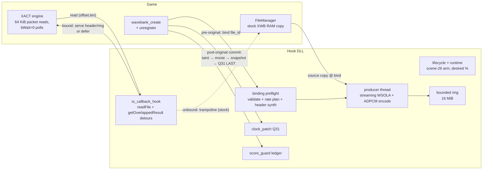
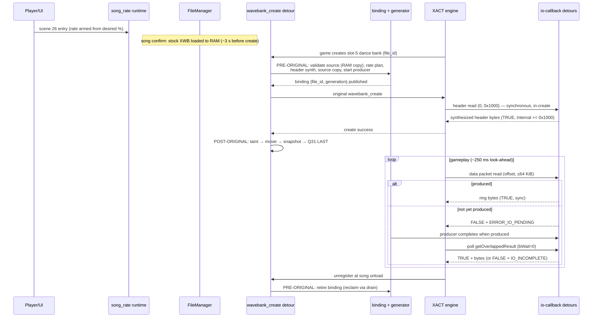
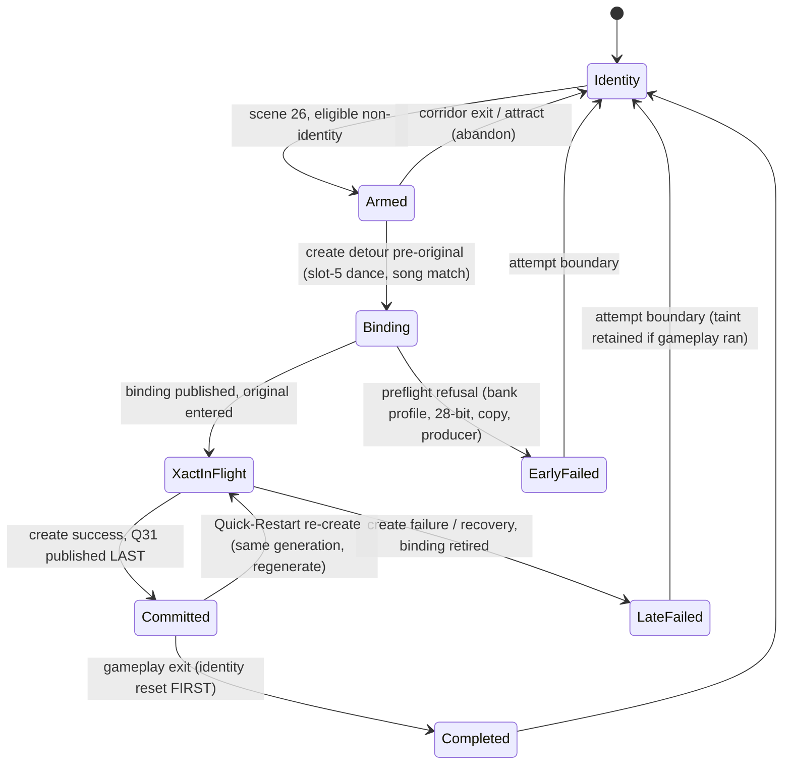

# Detailed Design: Song Playback Speed — Streaming Rate Engine

Date: 2026-08-08
Status: Approved 2026-08-08

## Overview

Song Playback Speed gives each player a `SONG SPEED` option (25–175 % in 5 % steps,
default 100) that plays the selected song rate-adjusted with everything in sync: the
music is time-stretched pitch-preserved (a 75 % song sounds like the same song played
slower, not lower), the gameplay clock (Q31 factor) is scaled to match, and any song
played at a rate other than 100 % is score-contained — its per-stage save is suppressed
and the card-out logout save is score-stripped, so no rate-assisted competitive result
can reach the server. 100 % plays are literally stock.

This document redesigns the feature's **audio delivery** as a **streaming-only
engine** and supersedes the audio-source, cache, and worker sections of the previous
design (2026-08-05). The previous model generated the entire stretched XWB up front at
the FileManager open and stored it in an on-disk LRU cache; it was rejected for release
(and as a fallback) on cabinet evidence: a 128 MiB transform admission ceiling refused
25 % on a ~129 s song, a 50 % cold build blocked the loading screen for 22.4 s on
hardware faster than real cabinets, and the on-disk cache was never a wanted design
element. The unchanged surfaces — the option row, backend persistence, scene-26
eligibility, the Q31 clock patch, and score containment — were cabinet-proven under the
old model and carry over verbatim.

The streaming redesign rests on a reverse-engineering result (full evidence chain in
`docs/xact_streaming_research.md`): for slot-5 per-song banks, the game's XACT engine
consumes audio through gamemdx's registered file-IO callbacks in small sequential
reads (one 0x1000 header read, then ≤ 64 KiB data packets, ~250 ms look-ahead), with a
natively supported asynchronous-deferral contract. By detouring that callback pair and
binding one file id per rate-armed song, the mod becomes the byte authority for the
bank: it serves a synthesized header (pure rate math, milliseconds) and
incrementally-generated stretched ADPCM data, with **no disk artifacts, no admission
ceilings, no generation deadline, and no loading-screen DSP stall** — cold start cost
is header synthesis plus a small pre-roll.

### Scope

- Replace the on-disk cache / whole-file generation pipeline with an incremental
  streaming generator behind the game's XACT file-IO callbacks.
- Remove: `src/services/song_rate/cache.rs`, `src/services/song_rate/worker.rs`, the
  cache data models in `src/services/song_rate/model.rs`, the two-stage
  open-redirect/exposure seam in `src/services/song_rate/conversion.rs` and
  `src/services/avs_layeredfs/file_hooks.rs`, `src/core/xact/transform.rs` (its
  reusable planning logic relocates), the `song_playback_speed.cache_limit_gib`
  config field, the 30 s worker deadline, and the 128 MiB memory admission.
- Reformulate the WSOLA stretcher (`src/core/xact/stretch.rs`) as a resumable
  streaming state machine, byte-equal to the existing whole-buffer implementation.
- Complete the dependent-feature integration this feature requires for delivery:
  Assist Tick content→wall conversion (slow rate + assist tick is the headline
  chart-practice use case), Real Speed × effective rate, Power User Statistics CSV
  rate columns.

### Non-Goals

- No changes to the option row, wire field, backend, eligibility policy, clock-patch
  mechanism, or score-containment semantics (all shipped and cabinet-proven).
- No server-side validation of `mod_song_speed` (stored verbatim; the DLL owns the
  domain).
- No latency knob for any audio feature.
- No support for versus/course sessions (fail closed to 100 %, as shipped).
- No mid-song rate changes.

## Detailed Requirements

Requirements marked **[kept]** are carried unchanged from the approved 2026-08-05
design (renumbered); the rest are new or reworked by this redesign.

### User Behavior

1. **[kept]** The mod id is `song-playback-speed`; its custom-option id is
   `song_speed`; the label texture is `seop_item_song_speed`; the network wire field
   is `mod_song_speed`.
2. **[kept]** `SONG SPEED` is a scalar row, 25..=175 step 5 (coarse 10), default 100,
   `PersistMode::Full`, with `snap_rate_percent` applied both as the persistence load
   transform and defensively in the change callback.
3. **[kept]** The edited value affects the next newly selected song only; per-side
   desired-percent atomics are read exactly once per attempt at scene-26 arming.
4. **[kept]** Disabling the mod hides the row and desires identity for future songs;
   an active attempt runs to its definitive lifecycle boundary untouched.
5. **[kept]** Quick Restart retains the session's rate, generation identity, and score
   taint. Under streaming, a bank re-create serves the same generation again from
   offset zero (regeneration, not cache reuse).
6. At 100 % the feature has zero runtime footprint beyond the permanently installed
   identity clock patch and idle detours: no producer thread, no buffers, no binding.

### Eligibility

7. **[kept]** The rate resolves only on entry to normal scene 26; exactly one entered
   side must be identifiable and selects the shared rate. Course mode, local versus,
   zero/two entered sides, missing session pointers, or missing services resolve to
   100 % (fail closed).
8. **[kept]** Arming is song-agnostic; whatever eligible song is selected commits at
   the armed rate. Tentative movie suppression at arm persists through a failed
   attempt.

### Audio Delivery (new)

9. The mod detours gamemdx's registered XACT file-IO callbacks **as a pair**: the
   readFile callback and the getOverlappedResult callback (on build 20260721:
   `FUN_1801aa250` and `FUN_1801aa350`). Both are resolved from ONE AOB on the
   audio-manager constructor's callback-registration region (the
   `lookAheadTime = 0xFA` immediate followed by three `LEA RAX, [rip+disp32]` /
   `MOV [RBP+disp8], RAX` pairs), RIP-decoding the second and third LEAs. The pair is
   mandatory: the stock getOverlappedResult callback reports instant completion for
   any tracked handle, which would corrupt a read deferral into a spurious 0-byte
   completion.
10. Every read for a file that is not the currently bound rate target passes through
    the original callbacks unchanged (trampoline) — byte-exact stock behavior for the
    song-select preview player, all other bank slots, and all non-audio users of the
    handles.
11. Binding identity is `{file_id, generation}`, published by the `wavebank_create`
    detour **before** the original runs (the engine's single 0x1000 header read is
    issued synchronously inside the original — pre-original binding makes the first
    read race-free). The read detour resolves handle→file_id with the same
    AVS-mutex-guarded sorted-vector walk the stock callback performs on every read,
    then compares against the bound file id.
12. For the bound file, reads are served against a **virtual bank**:
    - Offsets below the wave-data offset (2048) are served from a synthesized
      stock-shaped pre-data block: XWB v43 header, BANKDATA, entry metadata carrying
      the **stretched** durations/loops/data lengths, entry names, zero pad. The
      source bank's physical entry order, names, sample rate, packed ADPCM format,
      flags, and XSB-visible indices are preserved.
      *[Amended 2026-08-11: shipped as PREVIEW PASSTHROUGH — only the MAIN
      entry's metadata is stretched; the non-main `<code>_s` preview keeps its
      stock header values and its data region is served verbatim from the
      resident source copy. Maintainer-approved Step-5 deviation (WSOLA is only
      ~2.4× realtime at 47 kHz under CrossOver; stretching the preview cost
      23–25 s of loading). Record:
      `implementation/step05-fix-preview-side-buffer/progress.md`; durable note:
      `docs/xact_streaming_research.md` §8.]*
    - Offsets in the data region map through the virtual layout (entry 0 data at
      2048; entry 1 at the next 2048-aligned offset; inter-entry gap zero-filled) to
      generator output.
    - All reads clamp to `min(len, virtual_size − offset)` — the exact stock EOF
      contract, against the virtual size.
13. The virtual header must satisfy the engine's parse rules (magic, versions,
    segment table, pre-data region ≤ 0x1000) — guaranteed by emitting the same
    canonical layout `core::xact::xwb`'s streaming serializer produces for on-disk
    banks, which the engine already parses in the proven pipeline.
14. Stretched entry durations must fit the XWB 28-bit duration field; per-entry
    output frames and loop boundaries are computed with the shipped exact-rate math
    (`core::xact::rate::target_for_percent`, half-up loop boundary mapping). Overflow
    or unmappable loops refuse the bind (→ stock).
15. Completion accounting replicates the stock protocol exactly: synchronous serves
    accumulate `OVERLAPPED.Internal += copied` and return TRUE; the
    getOverlappedResult detour reports and zeroes `Internal` for completed requests.

### Generator (new)

16. Audio is produced by one **producer thread** per bound generation
    (generation-tokened; superseded generations stop at their next checkpoint). The
    producer decodes source ADPCM blocks on demand, runs the streaming WSOLA state,
    and encodes output blocks into a ring buffer. Detours never synthesize.
17. The generator's source is a **private copy** of the stock bank, memcpy'd out of
    the game's FileManager RAM buffer at bind time (the FileManager loads the whole
    stock XWB at song confirm, seconds before `wavebank_create`). No reads of
    game-owned memory occur after the bind returns; the copy's lifetime is owned by
    the binding.
18. Output is buffered in a **bounded ring** (default 16 MiB, an internal constant —
    no operator knob), holding encoded ADPCM ahead of the engine's read cursor.
    Memory is therefore independent of song length — arbitrary song length is a
    structural guarantee. Both entries' streams share one binding; only one wave is
    ever streamed during gameplay.
19. The streaming stretcher must be **byte-identical** to the existing whole-buffer
    `stretch_interleaved_with` for every (source, rate, loop-context) input — the
    equality is a host-tested property, preserving all shipped DSP evidence (pitch
    preservation, determinism, exact output length, seam behavior).
20. The WSOLA per-step state is checkpointed at the stretched loop start of a looped
    entry. Reads behind the ring window (loop restart, engine re-read, Quick-Restart
    re-create) regenerate deterministically from the nearest checkpoint (or zero)
    behind a deferral; identical bytes are reproduced.
21. If the requested range is not yet produced, the read detour defers: it returns
    `FALSE` with `ERROR_IO_PENDING` and records the request (engine buffer pointer,
    OVERLAPPED pointer, range) in a fixed pending slot. The producer completes the
    request (memcpy + `Internal` accumulation) when the range exists; the
    getOverlappedResult detour reports incomplete (`FALSE` + `ERROR_IO_INCOMPLETE`)
    until then. This is the engine's native polled-async contract (`bWait = 0`,
    single outstanding read per stream, ~250 ms look-ahead, 64 KiB packets ≈ 1.3 s of
    audio each).

### Clock and Transaction Safety

22. **[kept]** The central clock patch installs once at boot, starts at exact
    identity, and is never removed. It scales the complete signed music count with
    deterministic rounding and i32 saturation. The clock is wall-driven; none of its
    semantics change.
23. The `wavebank_create` detour transaction keeps its exactly-once shape with
    "expose" replaced by "bind":
    - **Pre-original** (panic-contained; failure ⇒ no bind, stock create): verify
      armed generation + slot-5 + dance-bank path (`sound/win/dance/<code>.xwb`) +
      song consistency (`bind_song` digest, set at first bind of the generation);
      read and validate the source from the FileManager RAM copy; compute the rate
      plan; synthesize the header; copy the source; start the producer; publish the
      binding and the redirect token into the in-flight slot.
    - **Original** runs exactly once; the engine reads and parses the virtual header
      through the bound callbacks.
    - **Post-original** (allocation-free, lock-free, no panicking operation, as
      shipped): on success commit in the shipped order — score taint → movie
      confirmation → rate snapshot → **Q31 last**; on failure retire the binding and
      mark LateFailed (Q31 never published). Recovery on token mismatch overrides the
      return to failure, retires all exposed state, and taints both sides —
      unchanged.
24. Bind-precondition failures (unsupported bank profile, 28-bit overflow, source
    copy failure, producer start failure) are EarlyFailed: the original runs
    unbound, the song plays stock at 100 %, one bounded WARN via the drain. Fail-open
    direction unchanged.
25. The two-stage open-redirect invariant is **deleted, not relocated**: the
    FileManager RAM copy stays stock (it is the generator's source), song-rate no
    longer touches `avs_fs_open`/`avs_fs_lstat`/`avs_fs_convert_path`, and the hazard
    it guarded (rate committed against stock audio) is structurally impossible —
    Q31 publishes only after a create whose bytes came from the bound callbacks.
26. The unregister detour retires the binding before the original destroys the bank
    and closes the handle; buffer reclamation is epoch-guarded and deferred to the
    maintenance drain (no free while any reader is inside a detour critical section).

### Failure Policy (new classes)

27. Transient producer lag is absorbed by deferral (req 21) — no audible effect while
    production stays ≥ 1× realtime.
28. A hard mid-song generator failure (producer panic or allocation failure) switches
    the binding to **silence-fill**: all further data reads complete instantly with
    encoded-silence ADPCM blocks; the committed clock, movie policy, and score taint
    are retained; one WARN via the drain. The song remains playable and judgeable
    (the clock is wall-driven and independent of audio delivery); score containment
    already covers the run.
29. A producer that is persistently slower than realtime degrades to deferral-paced
    audio (stutter) rather than crash or desync; the implementation records
    production throughput and maximum deferral latency for the release benchmark.

### Cross-Feature Behavior

30. **Assist Tick works at every supported rate — required for delivery** (the
    headline use case: slow the song down, enable assist tick, study the chart).
    Chart-derived content positions and restart skips convert to wall time with the
    exact committed `RateRatio` (`content_to_wall_ms`); the cabinet wall-domain sound
    offset applies unscaled; the judgment-timing term follows the clock stub's
    domain. Live oracle: claps align with judgment moments at 50 %/75 % exactly as
    they do at 100 %.
31. `TICK_CAPACITY_MS` rises from 300 s to **1200 s wall** (~28.8 MB, still lazily
    allocated only when Assist Tick is used), preserving 300 s of chart-content
    coverage at the slowest rate. Content beyond capacity truncates gracefully with
    one WARN (same contract as today).
32. Until the tick conversion step lands, tick synthesis is force-disabled for
    rate-committed songs (interim scaffolding gate, removed by that step) so
    wrongly-timed claps can never ship from an intermediate build.
33. **[kept]** At non-100 %, Real Speed derives its normalized multiplier from
    `Core BPM × effective_rate` regardless of the Real Speed Fix toggle; at 100 % the
    toggle keeps its stock-vs-fix meaning.
34. **[kept]** Power User Statistics keeps content-domain error values labeled as
    chart milliseconds and adds requested/effective rate columns to CSV export.
35. **[kept]** Native judgment windows remain content-time windows (wider in wall
    time at slow rates; no separate scaling).
36. **[kept]** Movie policy: tentative suppression at non-identity arm, confirmed at
    commit, shared `BuildGraph` hook with Non-Native OS support.

### Score Containment

37. **[kept]** Non-100 % commit appends exactly once per generation to the per-side
    pending rate-save ledger; per-stage saves of rate-played songs are suppressed;
    the card-out logout save is sanitised (scores stripped, profile forwarded);
    ledger reset is per-side positive-match on card-in. 100 % plays save normally.

### Configuration and Persistence

38. The `song_playback_speed.cache_limit_gib` config field is removed outright (no
    parse-but-ignore, no cleanup code; the maintainer removes the key from the only
    existing config). No new operator knobs: ring capacity, pre-roll, and pending-slot
    counts are internal constants.
39. **[kept]** Backend: `mod_song_speed` stored verbatim (nullable
    `opt_mod_song_speed`), no server-side validation; the sibling backend work is
    complete and untouched by this redesign.

### Failure and Release Gates

40. Boot readiness (`integration_ready()`) now additionally requires both file-IO
    callback detours installed; if the new AOB fails to resolve, the option row does
    not register (no inert UI), and everything else remains stock.
41. `DDR_SONG_RATE_FAULT` (dev-mode only, boot-time env selector) legs:
    `source-read`, `header-synth`, `generator-start`, `mid-song-failure` (kills the
    producer after N packets — exercises silence-fill live), `bind-refused`, plus the
    surviving transaction legs (pre/post-original, token mismatch).
42. Release requires: the host validator green (see Testing Strategy); a live
    throughput benchmark on the CrossOver cabinet (production ≥ 1× realtime with
    margin recorded); the maintainer's live matrix incl. slow (≤ 50 %), fast
    (> 100 %), Quick Restart, assist-tick alignment, score containment re-oracle, and
    100 % literal-stock verification; and the repository's standard
    check/format/release-build gates.

## Architecture Overview



Song-start sequence (non-identity rate):



### Lifecycle State Machine

`GenerationPhase` keeps its CAS-guarded shape; `RedirectReady` is deleted and
`Preparing` is renamed `Binding` (the bind is synchronous inside the create detour, so
no intermediate ready state exists between arm and create).



## Components and Interfaces

### `core::xact::stretch` — streaming WSOLA state machine

The existing `stretch_interleaved_with` (whole-buffer, output-driven, fixed endpoint
anchoring) becomes the reference implementation. New resumable core:

```rust
pub struct StretchState { /* phase: u128 (Q32.32), output_cursor: usize,
    previous: SourceWindow, params: StretchParameters, totals: StretchTotals */ }

impl StretchState {
    pub fn new(source_frames: u64, output_frames: u64, channels: u16,
               sample_rate: u32, loop_context: Option<LoopContext>) -> Result<Self, _>;
    /// Produce the next contiguous run of output frames into `out`
    /// (whole synthesis hops; the terminal anchor region is emitted as one
    /// final run). `source` is a random-access view of decoded source PCM.
    pub fn produce(&mut self, source: &impl SourcePcm, out: &mut [i16]) -> Produced;
    /// Snapshot/restore for loop-start checkpointing and regeneration.
    pub fn checkpoint(&self) -> StretchCheckpoint;   // ~5 words
    pub fn restore(chk: &StretchCheckpoint, ...) -> Self;
}
```

Key properties (host-tested):
- **Byte equality** with the whole-buffer reference for every input, including the
  identity shortcut, loop remapping/cyclic windows, and the terminal non-hop end
  anchor (the final `window` frames are emitted once the cursor reaches
  `output_frames − window`; the whole source is always available, so no special
  buffering is needed — only a distinct final-region code path).
- Bounded source access: any `produce` call touches only
  `[nominal − radius, nominal + radius + window)` (≈ 2160 frames at 48 kHz).
- `SourcePcm` decodes source ADPCM blocks on demand with a tiny block cache
  (blocks are self-contained; `core::xact::adpcm` gains a public
  `decode_block`/`encode_block` pair alongside the existing whole-buffer APIs).

### `core::xact::virtual_bank` — layout, plan, and header synthesis (new, pure)

Relocates the reusable planning logic from the deleted `transform.rs`:

```rust
pub struct EntryPlan { pub target: RateTarget, pub loop_out: Option<LoopContext>,
                       pub data_len: u64, pub data_offset: u64 }
pub struct VirtualBankLayout {
    pub entries: [EntryPlan; 2],          // source physical order preserved
    pub main_entry_index: usize,          // the `<code>` entry
    pub pre_data: PreDataBlock,           // synthesized bytes [0, 2048)
    pub virtual_size: u64,
}
pub fn plan_virtual_bank(source: &SongBank, percent: u32) -> Result<VirtualBankLayout, _>;
/// Map a virtual file offset to a serving region.
pub enum Region { PreData { off: usize }, EntryData { entry: usize, off: u64 },
                  Gap /* zero fill */, Eof }
impl VirtualBankLayout { pub fn resolve(&self, offset: u64, len: u32) -> ... }
```

Header emission reuses `core::xact::xwb`'s canonical streaming layout (52-byte header,
BANKDATA 96, 2×24 entry metadata carrying stretched `duration/loop/data_len`, empty
seek segment, 2×64 names, zero pad to 2048; entry 1 data at the next 2048-aligned
offset; segment 4 ends exactly at `virtual_size`). Both entries are stretched at the
same percent; loop boundaries map half-up with the shipped one-frame clamp rule.
*[Amended 2026-08-11: shipped as PREVIEW PASSTHROUGH — only the main entry is
stretched; the non-main entry keeps stock metadata and verbatim bytes (see the
req-12 amendment). The stream-layout emission also follows the PARSER's rule:
stock-shaped durations inside the final block are legal — required for the
verbatim preview.]*

### `services/song_rate/io_callback_hook.rs` — the two detours (new)

Owns the `GenericDetour` pair (one detour per target; if any future consumer needs
these callbacks, this module becomes the shared dispatcher per the `judge_hook`
pattern). Both detour bodies are strictly allocation-free, log-free, and panic-free.

- **readFile detour**: resolve handle→file_id (stock's sorted-vector walk under the
  same AVS-mutex gate); if ≠ bound file id → trampoline. Otherwise enter the binding
  epoch guard and serve per `VirtualBankLayout::resolve`:
  - `PreData`/`Gap`/`Eof` → memcpy/zero/clamp, `Internal += n`, return TRUE.
  - `EntryData` within produced ring window → memcpy, `Internal += n`, TRUE.
  - Not yet produced (or behind the window) → record in a pending slot, signal the
    producer (behind-window sets a regeneration target first), return FALSE +
    `SetLastError(ERROR_IO_PENDING)`.
  - Binding in `SilenceFill` → serve encoded-silence blocks immediately, TRUE.
- **getOverlappedResult detour**: if the OVERLAPPED matches a completed pending slot
  (or carries accumulated `Internal` from synchronous serves) → `*bytes = Internal`,
  zero it, TRUE. Pending-incomplete → FALSE + `SetLastError(ERROR_IO_INCOMPLETE)`.
  Unbound → trampoline.

### `services/song_rate/binding.rs` — preflight + binding state (replaces `conversion.rs`)

Pure-testable preflight (`prepare_binding`): dance-path parse
(`dance_bank_song_code`, kept), song-digest consistency (`bind_song`, kept), source
read from an injected `SourceView` (windows glue passes the FileManager row's
pointer/size; hosts pass buffers), Step-1 profile validation, `plan_virtual_bank`,
source copy, producer start. Returns a `BindingHandle` or a typed refusal
(→ EarlyFailed). Binding runtime state (one active slot):

```rust
pub struct Binding {
    file_id: i32, generation: u32, rate: RateRatio,
    layout: VirtualBankLayout,
    source: Box<[u8]>,                    // private stock-bank copy
    ring: Ring,                            // 16 MiB, atomics-cursored
    pending: [PendingSlot; 4],             // engine has 1 outstanding/stream
    state: AtomicU8,                       // Active | SilenceFill | Retired
    readers: AtomicU32,                    // epoch guard for reclamation
}
```

### `services/song_rate/generator.rs` — producer thread (replaces `worker.rs`)

One `std::thread` per bound generation (name `song-rate-generator`), generation-token
checked at every hop: decode-on-demand → `StretchState::produce` → per-block ADPCM
encode into the ring; maintains the loop-start `StretchCheckpoint`; completes pending
slots whose ranges become available; honors regeneration targets (restore checkpoint
or restart from zero); on panic/allocation failure flips the binding to `SilenceFill`
(caught via `catch_unwind`; the flip is the containment boundary). Records
frames-produced/wall metrics for the drain to log at generation end.

### `services/song_rate/wavebank_hook.rs` + `transaction.rs` — reworked transaction

`TransactionParts` drops the lease/cache fields; `call_create` keeps the exactly-once
frame/slot protocol with the bind performed pre-original via an injected
`bind: FnOnce(file_id) -> BindOutcome` (replacing the old nested-convert exposure).
`CreateOutcome` variants and the post-original commit order are unchanged. The
unregister detour retires the binding pre-original (state → Retired, pending slots
cancelled with 0-byte completions) and enqueues reclamation; the drain frees buffers
once `readers == 0`.

Rationale for the pre-original work profile: the create detour runs on the game
thread during the stage-loading screen — the same call window in which the retired
model performed its FileManager-open DSP builds (cabinet-proven at 22 s; this design's
preflight is milliseconds of parse/plan plus one 6–15 MB memcpy). Preflight runs
panic-contained; its diagnostics go through the bounded drain, never direct logging.

### `services/song_rate/lifecycle.rs`, `runtime.rs`, `xact_runtime.rs` — trimmed

- `lifecycle.rs`: `Preparing` → `Binding`; `RedirectReady` and
  `begin_exposing`/`mark_redirect_ready` deleted; everything else (eligibility,
  rate-domain helpers, `bind_song`, CAS guard) unchanged.
- `runtime.rs`: scene callback, desired-percent atomics, `integration_ready()`
  (now: clock ∧ both wave hooks ∧ both IO-callback hooks ∧ score-guard readiness),
  commit logging, LateFailed gameplay taint — kept. Deleted: coordinator/cache
  statics, `OPEN_REDIRECT` cache, lease/tombstone drain, `redirect_dance_bank_open`,
  `convert_streaming_xwb`. The 250 ms drain now: commit-visibility log poll, bank
  timeline drain, binding reclamation, generator diagnostics.
- `xact_runtime.rs`: slots lose `lease_id`; tokens carry `{generation, percent,
  rate, song_code_digest}`; `MaintenanceKind::ReleaseLease` → `ReclaimBinding`.
- `model.rs` and `cache.rs`, `worker.rs`, `transform.rs`: deleted (`FullDigest`
  moves next to its digest use or is dropped where identity digests no longer
  exist).

### `services/avs_layeredfs/file_hooks.rs` — song-rate seams removed

`song_rate_open_redirect` and the generated-path conversion seam are deleted; the
five AVS hooks revert to pure LayeredFS duty. Static LayeredFS custom-song
replacements keep working unchanged — the FileManager loads the replaced bank, and
the generator's source is whatever the game itself loaded.

### Dependent features

- **Assist Tick** (`src/mods/assist_tick.rs` + `src/services/se_bank_synth/`):
  synthesis reads `clock_patch::snapshot()` at its gameplay-start build; when a
  non-identity generation is committed, every chart-derived content position and
  restart skip converts through `content_to_wall_ms` with the committed `RateRatio`;
  the cabinet `sound_offset` (wall domain) applies unscaled; the judgment-timing term
  follows the clock stub's domain (verified by the live alignment oracle).
  `TICK_CAPACITY_MS` = 1200 s (lazy registration unchanged; graceful truncation +
  WARN beyond capacity). Interim scaffolding: until this step lands, synthesis is
  gated off when a rate is committed.
- **Real Speed** (`src/mods/real_speed_fix.rs` integration point): at non-identity
  commit, the normalized multiplier derives from `Core BPM × effective_rate`
  independent of the fix toggle.
- **Power User Statistics**: CSV export gains requested/effective rate columns;
  ms-error stays content-domain.

## Data Models

### Exact rate (unchanged, `core::xact::rate`)

```rust
pub struct RateRatio { source_frames: u64, output_frames: u64 } // GCD-reduced
// target_for_percent: output_blocks = round_half_up(N·100 / (B·P)).max(1),
// M = blocks·B, M ≤ 2^28−1;  q31 = round(N·2^31 / M);  content_to_wall_ms(c) = c·M/N
```

### Pending read slot (io_callback_hook)

```rust
struct PendingSlot {            // all fields atomics; SPSC per slot
    state: AtomicU8,            // Free | Armed | Complete
    overlapped: AtomicPtr<OVERLAPPED>,
    buffer: AtomicPtr<u8>, offset: AtomicU64, len: AtomicU32,
}
```

Deferral protocol: detour arms a slot (Release ordering) → producer observes, fills
`buffer`, adds to `OVERLAPPED.Internal`, marks Complete → getOverlappedResult detour
consumes (reports bytes, frees slot). Cancellation (unregister/silence-fill) completes
with the EOF-clamp semantics.

### Ring

```rust
struct Ring {
    buf: Box<[u8]>,                 // 16 MiB
    base: AtomicU64,                // virtual data offset of buf[ring_start]
    produced: AtomicU64,            // watermark (absolute virtual offset)
    consumed: AtomicU64,            // engine read high-water (advances base)
}
```

Single producer (generator), multi-reader (detours, read-only). The window
`[produced − capacity, produced)` is always serveable; reads below it trigger
regeneration.

### GenerationPhase (renamed)

`Identity, Armed, Binding, XactInFlight, Committed, Completed, EarlyFailed,
LateFailed` — transitions per the state diagram above; CAS discipline unchanged.

## Threading and Synchronization

| Context | Runs on | May allocate/log? | Touches |
|---|---|---|---|
| readFile / getOverlappedResult detours | game thread (in-create header read) + engine pump threads | NO / NO | binding epoch guard, ring (read), pending slots, trampolines |
| wavebank_create pre-original (preflight) | game thread, loading screen | yes (panic-contained; diagnostics via drain) | FileManager row (read-only, in-call), binding publish |
| wavebank_create post-original | game thread | NO / NO | slots, ledger, movie, publication (Q31 last) |
| producer thread | own thread | yes | source copy, StretchState, ring (write), pending completion |
| 250 ms maintenance drain | own thread | yes | logs, reclamation, timeline |
| scene callback | game thread | bounded logs | lifecycle, desired atomics |

Orderings: ring `produced` is Release-published, Acquire-read; pending slots are SPSC
handoffs; binding `state`/`readers` follow the epoch-guard pattern (readers
increment before validating `state == Active`, decrement after copy-out; reclamation
requires `Retired ∧ readers == 0`, checked on the drain). The AVS mutex is taken only
where stock takes it (the handle-vector walk).

## Error Handling

| Failure | When | Behavior |
|---|---|---|
| AOB unresolved (callback pair / clock / wave hooks) | boot | `integration_ready()` false → option row never registers; everything stock |
| Ineligible session (versus/course/unknown) | scene 26 | identity, no arm (fail closed) — unchanged |
| Source unparseable / unsupported profile / 28-bit overflow / loop unmappable | bind preflight | EarlyFailed → unbound stock create, 100 % audio, bounded WARN |
| Source copy or producer-start allocation failure | bind preflight | EarlyFailed → stock (same leg) |
| Engine create failure after bind | post-original | binding retired, LateFailed, Q31 never published — conservative taint rules unchanged |
| Transient producer lag | gameplay | deferral (native pending protocol); inaudible at ≥ 1× production |
| Producer panic / mid-song allocation failure | gameplay | SilenceFill: reads complete with encoded silence; clock/taint/movie retained; one WARN |
| Read behind ring window | loop restart / re-read / Quick-Restart | deferral + deterministic regeneration from checkpoint or zero |
| Unregister during pending read | song unload | pending slots cancelled with clamp semantics pre-original; reclamation deferred until reader-quiescent |
| Tick track exceeds 1200 s wall | extreme slow × long chart | graceful truncation + one WARN |

## Testing Strategy

Host validation extends `scripts/validate_song_playback_speed.sh` **in place** (no
schema versioning): the `cache` and `on_demand` sections and their ~60 tests are
removed with their machinery; Step-1 synthetic audio sections are kept; a new
`streaming` section is added. The `#[path]` source-mounting harness pattern is
unchanged. `./scripts/validate_se_bank_synth.sh`, `cargo check` (Windows target),
whole-crate `cargo fmt`, and `./build.sh` remain the standing gates.

### Pure host tests (same step as the functionality)

- **Streaming stretcher**: byte-equality vs the whole-buffer reference across rates
  (25/50/75/100/125/175), loop contexts (none, interior, boundary-clamped), channel
  counts, and short/boundary inputs; checkpoint/restore equality (restore at the
  loop start reproduces the identical suffix); produced-run granularity independence
  (any produce-call chunking yields identical bytes).
- **Virtual bank**: header bytes identical to `write_song_bank_streaming`'s pre-data
  emission for the same `StreamedEntry` values; `resolve` region mapping (pre-data /
  entry data / gap / EOF clamp) property-tested against the serializer's physical
  layout; 28-bit refusal; both physical entry orders.
- **Synthetic engine replay** (the RE-pinned pattern): 0x1000 header read at 0 →
  sequential 64 KiB block-aligned packets → EOF clamp → loop-restart jump; asserts
  the reassembled virtual file parses (`parse_song_bank`) and its decoded audio is
  byte-equal to the reference whole-buffer transform of the same source.
- **Deferral protocol**: reads ahead of the watermark defer and complete exactly
  once with correct `Internal` accounting; poll-before-complete reports incomplete;
  behind-window reads regenerate deterministically.
- **Silence-fill**: injected producer failure mid-stream completes all further reads
  with valid silent ADPCM blocks; the reassembled stream still parses and decodes.
- **Binding/transaction**: preflight refusal legs (profile, overflow, copy,
  producer-start) → EarlyFailed with no binding; bind→create-success→commit order;
  create-failure → retire + LateFailed; unregister-with-pending cancellation;
  epoch-guard reclamation only at reader quiescence; Quick-Restart re-create
  regeneration. Existing lifecycle/score/clock test suites carry over.
- **Throughput metric** (informational): synthetic frames/sec recorded in the
  `streaming` report section.
- **Dependent features**: tick placement conversion vectors (content→wall at exact
  ratios, restart skips, capacity truncation at 1200 s); Real Speed multiplier
  derivation; PUS CSV columns.

### Live validation (maintainer-run; the plan front-loads the riskiest)

1. **Benchmark/first-live gate**: instrumented build logs production throughput and
   max deferral latency on the CrossOver cabinet at 25 % and 175 % — validates the
   ≥ 1× realtime margin assumption on the slowest supported path before the rest of
   the delivery hardens.
2. Full matrix: 50 %/75 % slowed pitch-correct + arrows in sync; 125 %/175 %; Quick
   Restart; a 100 % literal-stock run (no binding, normal saves); score containment
   re-oracle (suppressed stage saves, sanitised logout, backend absence); assist-tick
   alignment at 50 % (post-conversion step); `DDR_SONG_RATE_FAULT=mid-song-failure`
   silence-fill run.
3. Cross-build AOB verification of the new callback-pair signature on 2026-03-24 /
   04-21 / 06-16 in Ghidra (same protocol as the shipped song-rate signatures).

## Alternatives Considered

- **Progressive whole-bank output buffer** (no ring): simpler, but memory grows with
  stretched length (~50 MB for a 129 s song at 25 %, > 100 MB for marathons) —
  re-imports the size pressure the pivot exists to remove. Rejected.
- **In-place source reads from the FileManager buffer** (no copy): saves 6–15 MB but
  couples producer shutdown to the unregister detour's timing and reintroduces a
  use-after-free class. Rejected for one memcpy.
- **Patching the engine's stored callback pointers** (engine object +0x190/+0x198)
  instead of detouring gamemdx's functions: no trampoline, engine-layout dependency,
  and it bypasses the one-detour-per-target discipline. Rejected.
- **Blocking in the read callback** when bytes aren't ready: stalls engine pump
  threads; the native pending protocol exists precisely for this. Rejected.
- **Assist-tick ring buffer** (loop-region rewrite or a streamed tick bank): saves
  ~21 MB but violates the tick feature's proven rewrite-only-after-Stop rule or
  couples a proven feature to the new streaming machinery, adding underrun surface to
  a sample-exact-by-design mechanism. Rejected in favor of the 1200 s capacity raise
  (revisit only if cabinet memory pressure ever materializes).
- **On-disk cache retention in any form**: explicitly rejected by the maintainer,
  including as a fallback.

## Appendix: Reverse-Engineering Basis

The design consumes these binary facts (evidence chains, addresses, and disassembly in
`docs/xact_streaming_research.md`; engine surface in `docs/xact_audio_research.md`):

- gamemdx registers readFile/getOverlappedResult/notification callbacks from the
  audio-manager constructor with `lookAheadTime = 250 ms`; the readFile callback
  completes synchronously from the FileManager RAM copy using
  `OVERLAPPED.u.Pointer` as a 64-bit offset and `OVERLAPPED.Internal` as the
  completion accumulator, clamping at `min(len, size − offset)`.
- `wavebank_create` (slot-5): path convert → `CreateFileA`
  (`FILE_FLAG_OVERLAPPED | FILE_FLAG_NO_BUFFERING`) → handle→file_id vector insert →
  engine `CreateStreamingWaveBank` (packetSize 0x20 sectors = 64 KiB, offset 0) →
  bank record append → immediate `DoWork`. Unregister: engine destroy → synchronous
  `CloseHandle` → record + vector removal.
- The engine issues one 0x1000 header read at offset 0 synchronously inside create;
  parses `WBND`/version 42/segment table from that buffer (re-read only if the
  pre-data region exceeds 0x1000 — stock layout is 2048); data reads are sequential
  block-align-rounded packets with one outstanding read per stream and loop-start as
  the only backward jump; completion is polled via the getOverlappedResult callback
  with `bWait = 0` from exactly one site; `FALSE + ERROR_IO_PENDING` is tolerated at
  issue time.
- Neither gamemdx nor the engine's XWB streaming path ever checks the real file's
  size (`GetFileSize` appears only in the engine's unused WAV path); the header's
  segment table is the sole size authority.
