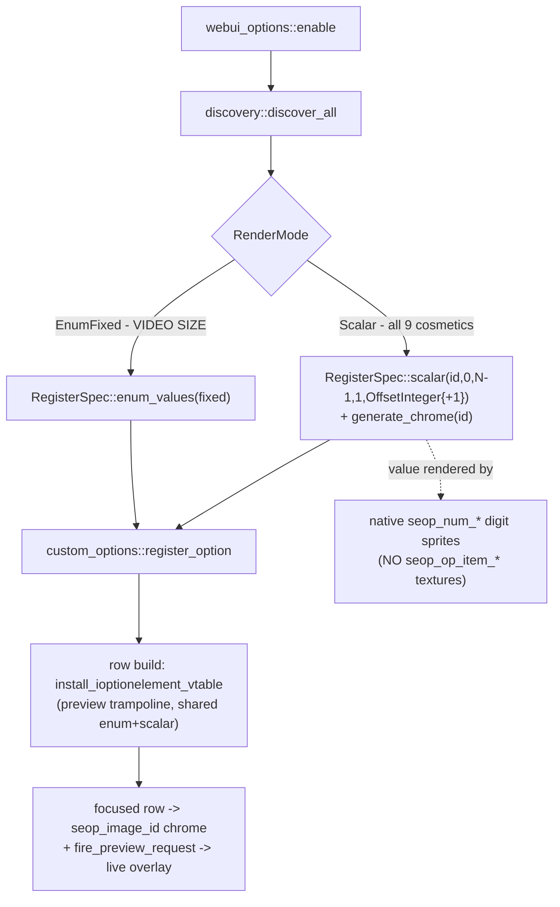
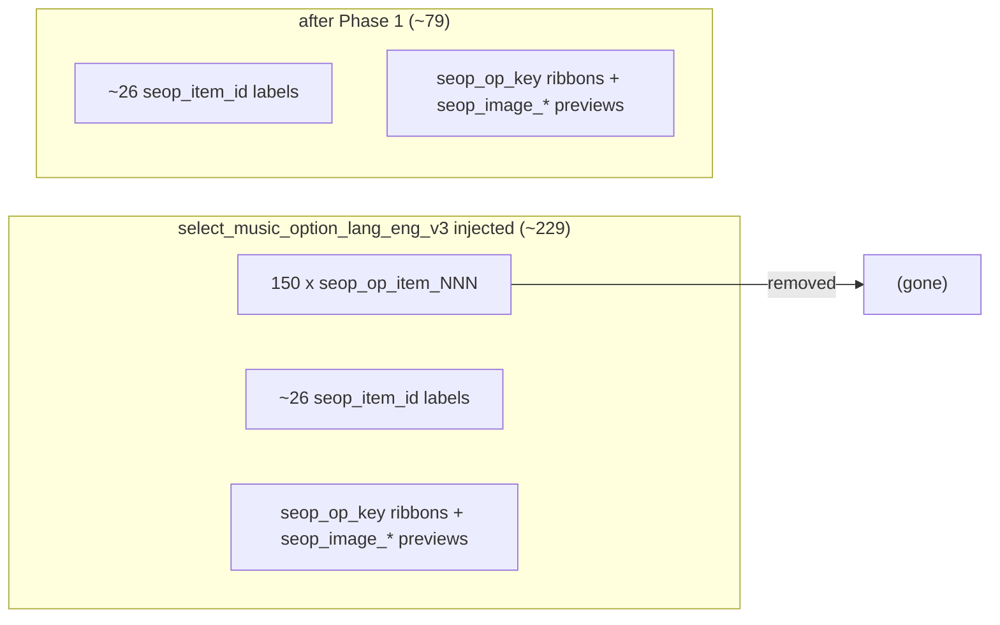

# Detailed Design — Loading-screen speedup

Status: Approved 2026-08-11

## Overview

The scene 18 (LANGUAGE_TO_MODE_INTERSTITIAL) and scene 21 (CAUTION) asset-preload
screens are slow in large part because the `select_music_option_lang_eng_v3`
package carries ~229 mod-injected `custom_options` textures served per-file from
`data_mods/_cache/` through the LayeredFS→Wine disk path (~9 ms/open) instead of
the engine's in-RAM ramfs. **150 of those 229 are the `seop_op_item_001..150`
value-ribbon chips** ("ITEM #001".."ITEM #150") used only to label the WebUI
cosmetic pickers, which are `EnumIndexed` rows.

This work has two phases:

- **Phase 1 (this design, fully specified):** convert the 9 `EnumIndexed` WebUI
  cosmetic categories to **scalar** rows — which render their value with the
  game's native `seop_num_*` digit sprites and need no per-value texture —
  eliminating all 150 item ribbons. Update the label-generation script to stop
  emitting them and delete the committed PNGs. Net effect: ~65% fewer injected
  textures in the hot package, at low risk, with no loss of the live-art preview.

- **Phase 2 (deferred, sketched):** preload the remaining `_cache/` texture files
  into an in-process RAM map at boot and serve `avs_fs_read` from memory,
  removing the per-file Wine data-transfer cost for whatever injected textures
  remain (and for every other mod's cache files). Pursued only if Phase 1's
  measured win is insufficient; its footprint should be re-measured against the
  post-Phase-1 texture set before it is fully specified.

## Detailed Requirements

### Phase 1 — enum→scalar (accepted decisions D7–D15)

- **R1 (D7):** All 9 `RenderMode::EnumIndexed` categories in
  `src/mods/webui_options/discovery.rs` become `RenderMode::Scalar`:
  `customize_appeal_board`, `customize_background`,
  `customize_background_gameplay`, `customize_character_p1`,
  `customize_character_p2`, `customize_lane_single`, `customize_lane_double`,
  `customize_lanecover_single`, `customize_lanecover_double`.
- **R2 (D8):** `RenderMode::EnumIndexed` and
  `webui_options::mod::build_indexed_enum_values` are removed. `RenderMode`
  retains `Scalar` and `EnumFixed`.
- **R3 (D9, overridden to 1-based):** Scalar cosmetics register as
  `RegisterSpec::scalar(option_id, 0, count-1, 1, …)` with a new **display-only**
  formatter variant `ScalarFormat::OffsetInteger { display_offset: 1 }`, so the
  selector reads **"1".."N"** — parity with the old "ITEM #001".."ITEM #NNN"
  ribbons. The internal value model stays the 0-based asset index everywhere
  (registry, `save_transform`, seeding, overlays).
- **R4 (D10):** The now-scalar cosmetic categories must still get their
  `seop_image_<id>` preview chrome, so `preview_gen::generate_chrome(option_id)`
  is invoked for them (moved into / added to the scalar registration path). The
  preview box and the live-art overlay (`preview_overlay` / `bg_preview_overlay`)
  must continue to work unchanged.
- **R5 (D11):** The 150 committed
  `data_mods/custom_options/select_music_option_lang_eng_v3_ifs/tex/seop_op_item_*.png`
  files are deleted from the repo.
- **R6 (D12):** `scripts/gen_option_labels.py` no longer generates the
  `seop_op_item_<NNN>` ribbon set: remove `ITEM_RIBBON_COUNT`, remove the
  `item_<NNN>` comprehension from `RIBBONS`, and update the stale docstring /
  comments that describe the item ribbons.
- **R7 (D13, assumed):** `customize_movie_size` (VIDEO SIZE) is untouched — it is
  `EnumFixed` with authored `seop_op_fullscreen/on/off` ribbons.
- **R8 (D14, assumed):** Persistence is unchanged. Both modes already use the
  0-based index value model with `PersistMode::SaveOnly` + `persist_save_transform`
  (index→asset id), so saved cosmetics and the bemani-buddy wire format are
  unaffected.
- **R9 (D15):** `AGENTS.md`, `README.md`, and a `docs/` note are updated to
  reflect scalar cosmetic rows.
- **R10 (non-regression):** Card-in seeding (`seed_registry_from_game`), on-change
  apply (`try_apply_all`), the row order (`custom_options.row_order`), and the
  MODS-tab layout must behave exactly as before for these rows — only the value
  presentation (digits vs ribbon) changes.

### Phase 2 — RAM cache preload (accepted decisions D1–D6, deferred)

- **R11 (D1):** Serve mechanism B — preload eligible `_cache/` files into an
  in-process RAM map at boot; keep the real `avs_fs_open` on the cache file; a new
  `avs_fs_read` fast path memcpys from RAM.
- **R12 (D2/D3):** Preload only texture-family cache files ≤ 2 MB, under a total
  cap (~24 MB default); anything skipped or over-cap falls through to today's disk
  redirect.
- **R13 (D4):** A new `avs_fs_close` hook retires `handle→buffer` entries.
- **R14 (D5):** Gated by `layeredfs.preload_cache` (default true), force-off when
  `developer_mode` is on.
- **R15 (D6):** No separate measurement spike; a timing log behind
  `diagnostics.profiling` records the open-vs-read split.

## Architecture Overview

### Phase 1 data flow (unchanged shape, fewer textures)

The only structural change is that the cosmetic branch now takes the scalar path
and calls `generate_chrome`. Everything downstream (preview trampoline, chrome,
overlay, persistence, seeding) is already mode-agnostic.

### Phase 1 injected-texture reduction

## Components and Interfaces

### Phase 1

**`src/mods/webui_options/discovery.rs`**
- Remove the `EnumIndexed` variant from `enum RenderMode` (keep `Scalar`,
  `EnumFixed`). Update the doc comment on `RenderMode` that describes the indexed
  ribbon scheme.
- Flip `render: RenderMode::EnumIndexed` → `render: RenderMode::Scalar` on the 9
  cosmetic `CategoryDef`s. Their `overlay_layers` / `bg_overlay` fields are
  unchanged (the overlays are what still show the art).

**`src/services/custom_options/api.rs` + `rows.rs` (D9 — 1-based display)**
- Add a `ScalarFormat` variant: `OffsetInteger { display_offset: i32 }` —
  documented as display-only (rendered as `value + display_offset`; the stored
  value, persistence, and callbacks are untouched).
- Extend `rows.rs::format_scalar_value` (pure function, single call site
  `push_scalar_value_text`) with the new arm:
  `OffsetInteger { display_offset } => (value + display_offset).to_string()`.
  No other scalar machinery (advance/clamp/steps) changes; existing options
  (`song_speed`, `weight`, styling scales, `pacemaker_threshold`) keep
  `Integer`/`FixedPoint` untouched.

**`src/mods/webui_options/mod.rs`**
- In the per-category registration `match &def.render`, delete the `EnumIndexed`
  arm and its `build_indexed_enum_values` call. The `Scalar` arm becomes
  `RegisterSpec::scalar(option_id, 0, count - 1, 1,
  ScalarFormat::OffsetInteger { display_offset: 1 })` so cosmetics display
  "1".."N".
- Ensure `preview_gen::generate_chrome(option_id)` runs for the cosmetic
  categories on the scalar path. Cleanest: call it in the `Scalar` arm (it only
  runs for webui categories, is idempotent, and is exactly the set that needs
  chrome). Keep the pre-registration ordering (chrome on disk before
  `register_option` records the base preview name / the atlas flush reads it).
- Delete `build_indexed_enum_values`. Update the `mode` log string mapping (drop
  `"enum-indexed"`).

**`scripts/gen_option_labels.py`**
- Remove `ITEM_RIBBON_COUNT` (line ~134) and the trailing
  `[(f"item_{i:03}", …) for i in range(…)]` comprehension appended to `RIBBONS`
  (lines ~142–144). Update the module docstring and the `RIBBONS`/`ITEM_*`
  comment block that describes indexed value ribbons.
- The four bespoke ribbons (`fullscreen`, `overhead`, `hallway`, `distant`) and
  all labels/previews are retained.

**Committed assets**
- Delete `data_mods/custom_options/select_music_option_lang_eng_v3_ifs/tex/seop_op_item_*.png`
  (150 files).

**Docs (R9)**
- `AGENTS.md` WebUI-options row + `README.md` WebUI Options entry: note the
  cosmetic pickers render as numeric selectors (native digits) with the live-art
  preview, no per-value ribbon textures.
- New `docs/` note capturing the scene 18/21 load analysis + the enum→scalar
  rationale (folds in the orientation findings).

### Phase 2 (sketch — interfaces to be finalized when picked up)

**`src/services/avs_layeredfs/` (new `cache_ram.rs` + hooks in `file_hooks.rs`)**
- `preload()` at init: reuse the `ifs_textures::build_cache_index` walk to
  enumerate `_cache/`; for each eligible file (texture-family, ≤2 MB, within the
  running total cap) read it into `HashMap<String /*normalized cache path*/,
  Arc<[u8]>>`. Gated by `layeredfs.preload_cache` and `!developer_mode`.
- `fs_open_body`: when the resolved replacement is a preloaded cache path, after
  the real `original.call` succeeds, record `handle → (Arc<[u8]>, cursor=0)` in a
  `HashMap<AvsFile, (Arc<[u8]>, usize)>`.
- `hook_avs_fs_read`: if `context` is a tracked handle, memcpy `min(nbytes,
  remaining)` from the buffer, advance the cursor, return the count — skipping
  `original.call`. Otherwise pass through (today's behavior).
- New `hook_avs_fs_close`: drop the handle entry, then call the original close.
- All new hook bodies follow the existing `catch_unwind` + fail-open discipline.

## Data Models

- **Value model (Phase 1):** cosmetic option value = 0-based index into the
  category's discovered `asset_ids` (unchanged). The scalar renderer displays
  `value + 1` ("1".."N", via `ScalarFormat::OffsetInteger { display_offset: 1 }`)
  using the native `seop_num_*` digit sprites. `save_transform` maps index→stable
  asset id for the server; `load` is game-native (`SaveOnly`).
- **RAM cache map (Phase 2):** `HashMap<String, Arc<[u8]>>` keyed by the
  normalized `./data_mods/_cache/<ifs>/<md5>` path (same string
  `ImageInfo::cache_file()` / the index produce); plus
  `HashMap<AvsFile, (Arc<[u8]>, usize)>` for in-flight handles. Both behind the
  existing LayeredFS `STATE`/dedicated mutex, resident for process life within the
  cap.

## Error Handling

- **Phase 1 is fail-safe by construction:** if `generate_chrome` fails for a
  category, that row's preview box is blank (same graceful degradation the
  framework already documents) — the row still works. A category that discovers 0
  assets is skipped as today. No new failure modes; no game-memory writes change.
- **Phase 2:** every new/modified hook body is `catch_unwind`-wrapped and
  falls through to the original AVS call on any panic (matching the existing
  hooks). A cache miss, an over-cap/skipped file, a disabled gate, or dev mode all
  fall through to today's disk-redirect path. The RAM serve is strictly an
  optimization layer over the unchanged redirect.

## Testing Strategy

No unit-test harness exists for the DLL (it hooks a live game); validation is
build + cabinet deploy + log observation, per repo convention.

- **Build gates:** `cargo check --target x86_64-pc-windows-msvc` clean →
  `cargo fmt` (whole crate) → `./build.sh` clean.
- **Script check (R6):** run `python3 scripts/gen_option_labels.py` on the host;
  confirm it no longer writes any `seop_op_item_*.png` and still writes the
  labels, the four bespoke ribbons, and the previews. Confirm the repo has no
  remaining `seop_op_item_*.png` after R5.
- **Cabinet validation (Phase 1):**
  - MODS tab: each converted cosmetic row shows a numeric selector reading
    "1".."N" (1-based; first asset displays "1"), left/right
    changes it, the preview box shows chrome + live art, and the selection applies
    (card-in seed, on-change apply) exactly as before.
  - Verbose LayeredFS log: the CAUTION-window `select_music_option_lang_eng_v3`
    open count drops by ~150; capture scene 18/21 durations vs the current healthy
    baseline (verbose ~11 s CAUTION / ~3 s scene 18) to quantify the win and
    decide whether Phase 2 is needed.
- **Cabinet validation (Phase 2, when built):** confirm scene 18/21 timings
  improve further; confirm no boot/scene crashes; toggle `layeredfs.preload_cache`
  off to verify clean fallback; verify dev-mode still forces the disk path.

## Appendix A — key facts (build `gamemdx_20260721`, base `0x180000000`)

- Scene loads get the once-per-frame `FileManager` pump (`FUN_1801fdbf0`); inner
  texture opens are synchronous decode+upload, not frame-paced — so there is no
  Fast-Bootup-style pacing hack for these screens; per-open cost is the only lever.
- Preview box works for scalar rows: `install_ioptionelement_vtable`
  (`rows.rs:1026`) installs `preview_image_name_trampoline` and is called by both
  the enum (`rows.rs:706`) and scalar (`rows.rs:827`) builders;
  `preview_image_name_for_value` returns base `seop_image_<id>` for non-enum kinds.
- `generate_chrome` is currently called only in the `EnumIndexed` arm
  (`mod.rs:188`) — the lone wiring dependency R4 addresses.

## Appendix B — alternatives considered

- **ARC-overlay repack of the injected textures** (pack them into the arc so they
  ride the engine's RAM mount): biggest single win but the most work; not chosen
  as the first lever.
- **Atlas-packing the labels/ribbons** into fewer sheets: reduces open count but
  keeps the per-open disk cost; superseded by removing the 150 outright (Phase 1)
  + the RAM map (Phase 2).
- **Phase 2 mechanism A (warm OS cache)** and **C (synthetic handle / AVS ramfs
  mount)**: A leaves every wineserver round-trip in place; C removes all FS calls
  but needs handle emulation or ramfs-ABI RE and is riskiest in a live FFI
  callback. B captures the dominant read cost at low risk and was chosen.
