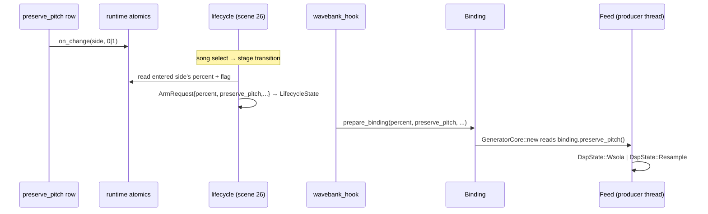

# Detailed Design: Preserve Song Pitch sub-option

Status: Approved 2026-08-12

## Overview

The Song Playback Speed mod plays songs at 25–175 % with the audio
time-stretched **pitch-preserved** (WSOLA): a 75 % song sounds like the same
song played slower. This feature adds a per-player boolean sub-option,
**PRESERVE SONG PITCH**, under the SONG SPEED row on the in-game MODS tab:

- **ON (default):** current behavior — pitch-preserved time-stretch.
- **OFF:** the song is **resampled** — pitch falls or rises with the playback
  speed, like a record player.

The sub-option row renders only while that player's SONG SPEED is set to a
non-100 % value; at 100 % there is no pitch alteration to preserve and the
row is hidden. The row appears/disappears live as the player scrolls the
speed value through 100, independently per side.

The work spans two repositories:

- **This repo (the hook DLL):** a new deterministic streaming resampler in
  the rate engine's DSP core, a mode flag threaded through the engine's
  latch/bind pipeline, one small custom-options framework addition
  (`ShowWhen::NotEquals`), the option row itself, and its label/preview
  textures.
- **bemani-buddy (sibling checkout):** the `mod_preserve_pitch` profile
  field, following the same JSON-model → codegen → Rust pipeline as the
  in-flight `mod_song_speed` / `mod_assist_tick_volume` changes.

## Detailed Requirements

Consolidated from the accepted decision register.

### Functional

- **FR-1 (row):** A boolean option row, id `preserve_pitch`, label texture
  "PRESERVE SONG PITCH", stock OFF/ON value ribbons, registered by the
  `song-playback-speed` mod immediately after its `song_speed` row.
  Default **ON** (1).
- **FR-2 (visibility):** The row is visible for a side iff that side's
  `song_speed` value ≠ 100. Visibility updates same-frame when the parent
  value changes while the options modal is open, per-side independently.
  Hiding never resets the stored value.
- **FR-3 (semantics):** With the flag OFF, the played song's audio is
  produced by plain resampling at the plan's exact effective ratio; with the
  flag ON, by the existing WSOLA stretch. Both modes emit byte-streams of
  identical length and framing — the gameplay clock, chart sync, assist
  ticks, Real Speed, and score containment behave identically in both modes.
- **FR-4 (latch):** The flag is latched once per song at the scene-26 arm,
  from the same single entered side whose SONG SPEED percent is latched.
  Mid-song edits apply to the next song. Quick Restart re-binds reuse the
  latched values. Sessions forced to identity (versus, course/Dan, 100 %)
  never consult the flag.
- **FR-5 (persistence):** `PersistMode::Full` — wire field
  `mod_preserve_pitch` (s32, 0/1), offline JSON cache under
  `custom_options.{p1,p2}.preserve_pitch`, automatic seeding on card-in via
  the framework's load path. Load values are clamped to {0, 1}.
- **FR-6 (backend):** bemani-buddy stores the field verbatim in a new
  nullable `opt_mod_preserve_pitch` column and echoes it on load only when
  present (never to un-hooked clients).
- **FR-7 (preview):** The preview panel copy opens with: "Decides whether
  the song's pitch should be preserved when the playback speed is adjusted."
  Per-value panels add one state line each (ON: pitch kept; OFF:
  record-player behavior).

### Non-functional

- **NFR-1 (determinism):** The resampler is integer/fixed-point and fully
  deterministic: any chunking of pulls yields the identical byte stream, and
  a mid-stream reconstruction at any block boundary reproduces the
  uninterrupted stream's suffix byte-identically (same bar the WSOLA
  implementation meets).
- **NFR-2 (fail-open):** Every failure — row registration, framework
  variant missing, resampler construction — degrades to current behavior
  (pitch-preserved or stock 100 %), never to a crash or a silent wrong-clock
  state. One bounded WARN per failure class.
- **NFR-3 (zero footprint at 100 %):** The identity path is untouched: at
  100 % no hooks engage and the flag is semantically inert (the hidden row
  is the UI expression of this).
- **NFR-4 (performance):** The resample path must not be slower than WSOLA.
  (It is orders of magnitude cheaper — no candidate search — so rate-adjusted
  loading gets faster with the flag OFF.)
- **NFR-5 (score integrity):** Unchanged — containment keys on "rate ≠ 100
  played", regardless of pitch mode.

### Explicitly out of scope

- Power User Statistics CSV changes (user-overridden).
- Resampling the song-select preview (the `<code>_s` entry stays verbatim
  stock in both modes).
- Windowed-sinc resampling (linear interpolation ships; sinc is a future
  upgrade if ever audibly needed).

## Architecture Overview

The rate engine's architecture makes this feature a **mode swap at one
seam**. The virtual-bank *plan* — not the DSP — is the contract: it fixes the
output stream's length (block-quantized) and the exact effective ratio
`source_frames / output_frames`. Any DSP that emits exactly the planned
frames keeps the entire downstream (ring serving, clock Q31, tick domain,
Real Speed, score guard, movie policy) byte-level indifferent to the mode.

```mermaid
flowchart LR
    subgraph UI [MODS tab]
        SS[song_speed row] -->|ShowWhen::NotEquals 100| PP[preserve_pitch row]
    end
    PP -->|on_change| AT["runtime: DESIRED_PRESERVE_PITCH[2]"]
    SS -->|on_change| DP["runtime: DESIRED_PERCENT[2]"]
    AT --> L[scene-26 arm: classify + latch\nentered side's percent + flag]
    DP --> L
    L -->|ArmRequest| LS[LifecycleState atomics]
    LS -->|bind_for_create| PB[prepare_binding\npercent + preserve_pitch]
    PB --> B[Binding\nrate + layout + preserve_pitch]
    B --> G[generator thread]
    subgraph G2 [Feed per song]
        direction LR
        DEC[BlockCachePcm\nADPCM decode] --> DSP{DspState}
        DSP -->|Wsola| W[StretchState]
        DSP -->|Resample| R[ResampleState  NEW]
        W --> ENC[encode_block\nMS-ADPCM]
        R --> ENC
    end
    G --> G2
    ENC --> RING[ring → engine serve]
```



Both DSP states sit behind the same pull contract (`produce` into a caller
buffer, finalized frames only, chunking-independent). The plan, the ring, the
pacing, the silence-fill fallback, and the serving dispatch are untouched.

### Why not the engine's native pitch mechanism

The game's XSB sound entries carry a pitch-cents field the engine could
resample with. It was rejected: never live-proven, cent-quantized (breaking
the exact-integer `RateRatio` machinery every consumer keys off), and it
bypasses the proven virtual-bank/score/lifecycle architecture. A CPU
resampler inside the existing `Feed` preserves every shipped guarantee.

## Components and Interfaces

### 1. `core/xact/resample.rs` — the resampler (new module)

Pure, host-testable, zero game dependencies (same discipline as
`stretch.rs`). Two forms:

**Reference oracle (frozen once landed, never modified):**

```rust
pub fn resample_interleaved(
    source: &[i16],
    channels: usize,
    output_frames: usize,
    loop_context: Option<LoopContext>,
) -> Result<Vec<i16>, ResampleError>;
```

**Streaming production form:**

```rust
pub struct ResampleState { /* positional only */ }

impl ResampleState {
    pub fn new(
        source_frames: usize,
        output_frames: usize,
        channels: usize,
        loop_context: Option<LoopContext>,
    ) -> Result<Self, ResampleError>;

    /// Fill `out` (interleaved, len = frames × channels) with the next
    /// finalized frames. Same pull contract as StretchState::produce:
    /// any chunking yields the identical stream.
    pub fn produce(
        &mut self,
        source: &impl SourcePcm,
        out: &mut [i16],
    ) -> Result<Produced, ResampleError>;

    /// O(1) seek: the state is purely positional.
    pub fn positioned_at(&mut self, output_frame: usize);

    pub fn position(&self) -> usize;
}
```

(`SourcePcm`, `Produced`, and `LoopContext` are the existing types from
`stretch.rs`; no `sample_rate` parameter — the resampler is a pure ratio map
and never sizes windows.)

**Position map** — piecewise Q32 fixed-point, mirroring the stretch's
`nominal_for_output` two-domain rule so loop seams align:

- Global segments (before `output_start`, and from `output_end` on):
  `pos_q32(i) = i × step_global`, with
  `step_global = round_half_up(source_frames × 2^32, output_frames)`.
- Loop segment (`output_start ≤ i < output_end`):
  `pos_q32(i) = source_start × 2^32 + (i − output_start) × step_loop`, with
  `step_loop = round_half_up((source_end − source_start) × 2^32,
  output_end − output_start)`.

The loop segment maps `output_start ↦ source_start` and approaches
`source_end` at `output_end`, so the engine's loop restart
(`output_end → output_start`) is source-continuous — the same seam guarantee
the stretch provides. The segment joins differ from the global map only by
the plan's own half-up rounding (sub-frame), inaudible with linear
interpolation.

**Interpolation** — linear, per channel, one shared phase for all channels
(inherent stereo coherence):

```
i0   = pos_q32 >> 32            (clamped to source_frames − 1)
i1   = min(i0 + 1, source_frames − 1)
frac = pos_q32 & (2^32 − 1)
out  = s0 + round_half_away((s1 − s0) × frac, 2^32)     // i64 intermediate
```

Integer-only; reuses the crate's `round_half_up_u128` /
`divide_half_away_i128` rounding primitives. Construction fails only on
arithmetic overflow at absurd lengths (same guards as the stretch) or
zero/invalid frame counts.

### 2. `services/song_rate/generator.rs` — the mode seam

`Feed` currently owns `state: StretchState`. It becomes:

```rust
enum DspState {
    Wsola(StretchState),
    Resample(ResampleState),
}
```

with `produce` delegating to the active variant (identical signatures).
Construction takes the mode:

- `Feed::new(entry, plan, mode)` — `DspMode::PitchPreserved` builds the
  `StretchState` exactly as today; `DspMode::Resampled` builds a
  `ResampleState` from the same `(entry.duration, plan.streamed.duration,
  channels, plan.loop_context)`.
- `Feed::positioned_at(...)` — the WSOLA arm keeps its
  checkpoint-restore + produce-and-discard mechanics; the resample arm is a
  direct `positioned_at(target_frame)` seek (no discard loop, no
  checkpoints).
- `Feed::try_capture` — WSOLA-only; a no-op for the resample arm
  (`checkpoints` stay `None`, which `positioned_at` already tolerates).

`GeneratorCore::new(binding)` reads `binding.preserve_pitch()` once and
passes the mode to every `Feed` construction. Everything else in the
producer — pacing, pending slots, ring append, block-encode drain
(`adpcm::encode_block`), silence-fill on panic — is byte-agnostic and
unchanged.

### 3. Flag carriage — runtime → lifecycle → binding

Mirrors the percent's path exactly:

| Layer | Addition |
|---|---|
| `services/song_rate/runtime.rs` | `static DESIRED_PRESERVE_PITCH: [AtomicI32; 2]` (default 1); `set_desired_preserve_pitch(side, value)` / `desired_preserve_pitch(side)`. |
| `services/song_rate/lifecycle.rs` | `EligibilityInputs` gains `desired_preserve: [bool; 2]` (plain — absence of the option means the atomics stay at their preserved default). `classify_scene26` copies the **entered side's** flag into `ArmRequest { preserve_pitch: bool, .. }`. The flag never affects the eligibility decision itself. `LifecycleState` gains a `preserve_pitch` atomic (default true) stored on arm, with a getter. |
| `services/song_rate/wavebank_hook.rs` | `bind_for_create` passes `ctx.lifecycle.preserve_pitch()` alongside the percent. |
| `services/song_rate/binding.rs` | `prepare_binding(file_id, generation, percent, preserve_pitch, source, fault)`; `Binding` gains `preserve_pitch: bool` + accessor. The plan, private source copy, ring, and serving are untouched. |

Quick Restart's re-bind re-runs `prepare_binding` from the lifecycle's
latched values, so the flag rides restarts with no extra code. `RateSnapshot`
is **not** extended — every rate consumer keys off `effective_rate` only.

### 4. `services/custom_options` — `ShowWhen::NotEquals`

New variant, symmetric with `Equals`:

```rust
pub enum ShowWhen {
    Always,
    Equals    { parent_id: String, value: i32 },
    NotEquals { parent_id: String, value: i32 },
}
```

Exactly four touch points (all existing `ShowWhen` pattern matches):

1. **`api.rs`** — the enum itself.
2. **`registry.rs` (`try_register`)** — parent-id extraction must cover both
   parented variants (same `RegisterError::UnknownParent` on a missing
   parent).
3. **`rows.rs` (`is_show_when_satisfied`)** — `NotEquals` evaluates
   `parent.values[side] != value`; an unresolvable parent stays fail-open
   visible, matching `Equals`.
4. **`rows.rs` (`update_children_visibility`)** — the child-detection
   `matches!` covers both parented variants, so a `song_speed` value press
   triggers the same-frame `reapply_mask_for_side` remask.

Everything else (row building, mask application, hidden-row list collapse,
per-side independence, value retention while hidden) is existing framework
behavior and needs no change.

### 5. `mods/song_playback_speed.rs` — row registration + latch feed

In `enable()`, immediately after the `song_speed` registration's
`Ok | Duplicate` handling (so the parent exists and default `row_order`
adjacency holds):

```rust
let spec = RegisterSpec::bool_toggle(OPT_PRESERVE_PITCH)   // "preserve_pitch"
    .default_value(1)
    .show_when(ShowWhen::NotEquals {
        parent_id: OPT_SONG_SPEED.into(),
        value: IDENTITY_PERCENT,
    })
    .persist_transform(|_id, v| v, clamp_bool)              // load → {0,1}
    .on_change(on_preserve_pitch_change);
```

- `on_preserve_pitch_change(side, value)` →
  `song_rate_runtime::set_desired_preserve_pitch(side, value)`.
- `Duplicate` (mod re-enable) is success; re-seed the runtime atomics from
  `custom_options::get_value` for both sides (the framework does not re-fire
  `on_change` on duplicate registration — same pattern as the existing
  percent re-seed).
- Mirror the mod's existing `set_option_available` calls for the child in
  `enable()`/`disable()` so a disabled mod leaves no orphan row.
- Registration is gated behind the same conditions as the parent row
  (option framework available + `song_rate` integration ready); if the
  parent row can't register, neither does the child.

The mod's user-facing docs (README feature table + option list, AGENTS.md
song-playback-speed entry) gain the sub-option.

### 6. Assets — `scripts/gen_option_labels.py`

Table additions (generation + injection are existing machinery — the
donor-clone atlas pipeline picks the PNGs up automatically at option
registration):

- `LABELS`: `("preserve_pitch", "PRESERVE SONG PITCH")` →
  `seop_item_preserve_pitch.png` (176×16).
- `PREVIEWS` (both WIDE, house voice, opening with the user-specified
  sentence):
  - `("preserve_pitch", "off")`: "Decides whether the song's pitch should be
    preserved when the playback speed is adjusted." / "OFF: The song's pitch
    falls or rises with the playback speed, like a record player." →
    `seop_image_preserve_pitch_off.png` (368×172).
  - `("preserve_pitch", "on")`: same opening sentence / "ON: The song keeps
    its original pitch at any playback speed." →
    `seop_image_preserve_pitch_on.png` (368×172).
- Opportunistic cleanup: the PREVIEWS table currently carries a duplicate
  `arrow_opacity` entry; drop the duplicate.

Value ribbons: none needed (stock `seop_op_off` / `seop_op_on`).

### 7. bemani-buddy backend (sibling repository)

Follows the exact pattern of the in-flight `mod_song_speed` /
`mod_assist_tick_volume` changes, stacked on top of them (do not renumber or
touch migrations 012/013):

1. `models/ddr_world/playdata_3.json`: add `"mod_preserve_pitch": "s32?"` to
   **both** the load `<option>` shape (`PlayerdataLoadOption`) and the save
   `<option>` shape (`PlayerdataSaveOption`).
2. Codegen (never hand-edit the generated file):
   `cargo run -p codegen -- models/ddr_world/ crates/bemani-protocol/src/ddr_world/`
3. `migrations/014_ddr_world_preserve_pitch.sql`:
   `ALTER TABLE ddr_world_profiles ADD COLUMN opt_mod_preserve_pitch INT
   NULL DEFAULT NULL;` with the house doc-comment: stored verbatim (the
   client DLL owns the value domain), column nullable with no default (stock
   clients never send the field; echoing a default `<option>` child could
   crash an un-hooked game).
4. `crates/db/src/models/ddr_world/profile.rs`: `pub
   opt_mod_preserve_pitch: Option<i32>` on `DdrWorldProfile`.
5. `crates/db/src/mysql/ddr_world/profile.rs`: `row_to_profile!` macro +
   `UPDATE` column list + bind parameters.
6. `crates/game-server/src/handlers/ddr_world/playdata.rs`:
   - load: `mod_preserve_pitch: profile.opt_mod_preserve_pitch`
   - new-player response: `mod_preserve_pitch: None`
   - save: `if let Some(v) = child_i32(option, "mod_preserve_pitch")
     { profile.opt_mod_preserve_pitch = Some(v); }`
   - tests: present-is-parsed / absent-is-None / malformed-is-None /
     None-skipped-on-load / Some-echoed-on-load (the shared
     `load_option_all_none()` helper gains the field).
7. Refresh the committed offline query cache:
   `sqlx migrate run --source migrations/` +
   `cargo sqlx prepare --workspace`.
8. Validate with `cargo build` + `cargo test`. Any widespread `cargo fmt`
   churn is left in the working tree per maintainer instruction (folded into
   one commit by the maintainer).

## Data Models

### Option value

| Property | Value |
|---|---|
| Option id | `preserve_pitch` |
| UI kind | bool toggle (enum 0 = OFF, 1 = ON; stock ribbons) |
| Default | 1 (ON — pitch preserved, today's behavior) |
| Wire field | `mod_preserve_pitch` (s32, only 0/1 emitted) |
| JSON cache | `custom_options.{p1,p2}.preserve_pitch` |
| Backend column | `ddr_world_profiles.opt_mod_preserve_pitch` (INT NULL) |
| Load transform | clamp to {0,1} (any nonzero → 1) |

### Engine-side flag flow



The flag is a construction parameter everywhere — never mutated after the
arm; a new song re-latches from the atomics.

### Resampler state (5 conceptual fields, all positional)

`ResampleState { source_frames, output_frames, channels, loop_context,
next_output_frame }` — the Q32 position of any output frame is directly
computable, which is what makes seeks O(1) and checkpoints unnecessary.

## Error Handling

All failures degrade toward current behavior; none can corrupt sync
(the plan fixes stream length regardless of mode).

| Failure | Handling | Result |
|---|---|---|
| Custom-options framework unavailable / parent row absent | child not registered | no row; atomics stay default ON → WSOLA (current behavior) |
| `ShowWhen::NotEquals` parent lookup fails at evaluation | fail-open visible (matches `Equals`) | row shown even at 100 % (harmless — flag inert at 100 %) |
| Row registration returns an error other than `Duplicate` | one WARN, continue | as above: default ON |
| `ResampleState::new` fails (overflow/invalid lengths) | `GeneratorError::Source`, existing producer-start / silence-fill path | identical to today's stretch-construction failure: bind refusal → fail-open stock 100 %, or mid-run silence-fill; one WARN |
| Hand-edited JSON / server value outside {0,1} | load transform clamps | nonzero → ON |
| Un-hooked client saves to a profile with the column set | save is only-when-present | stored value untouched |
| Stock client loads a profile with the column NULL | `skip_serializing_if` omits the child | no unknown `<option>` child sent (crash-safe, existing convention) |

Fault injection: the existing `DDR_SONG_RATE_FAULT` selectors apply
unchanged to the resample mode (they act on binding/producer machinery, not
the DSP).

## Testing Strategy

This repo has no cabinet-independent test harness for hook code; the pure
DSP layer is host-validated the same way the stretch is.

### Host tests (pure modules, run via the validation harness)

In `src/core/xact/tests.rs` (mirroring the stretch's suite):

1. **Reference correctness:** `resample_interleaved` on synthetic sines —
   output frequency tracks `f_source × source_frames/output_frames` within
   the harness tolerance; exact output length; edge clamps at both ends.
2. **Streaming equivalence:** `ResampleState` vs the reference across the
   percent matrix (25/50/75/125/175) — byte-identical.
3. **Chunk-size independence:** varied `produce` capacities (1-frame,
   prime-sized, large) — byte-identical streams.
4. **Seek identity:** `positioned_at(t)` output equals the uninterrupted
   stream's suffix for arbitrary block-aligned `t`.
5. **Loop seam:** with a `LoopContext`, the loop segment maps
   `output_start ↦ source_start`, and a simulated engine loop restart is
   source-continuous (same fixture style as the stretch's loop-restart
   byte-identity test).

In `src/services/song_rate/generator_tests.rs`:

6. **Generator pump in resample mode:** deterministic `GeneratorCore` run vs
   a whole-buffer oracle (reference resample + `encode_interleaved`) —
   byte-identical bank; behind-window regeneration (now a seek) reproduces
   identical bytes; side-entry passthrough untouched.

### Validation script (`scripts/validate_song_playback_speed.sh`)

New `resample` section in the report (additive; the report's tail verifier
is updated to expect it): per rate, synth → plan → resample → encode →
decode, asserting the **inverted pitch expectation**
`f_out ≈ f_source × S/O` via the existing `estimate_frequency` machinery,
plus codec SNR and throughput. The existing WSOLA sections are untouched
(the oracle discipline: landed reference implementations are never
modified).

### bemani-buddy

`cargo build` + `cargo test` (offline, `.sqlx/` committed). Handler tests as
listed in Components §7.

### Cabinet validation (the repo's real gate)

1. **Visibility:** at song select, scroll SONG SPEED away from/back to 100 —
   the PRESERVE SONG PITCH row appears/disappears live, per-side; label and
   both preview panels render.
2. **ON (default):** play at 75 % — behavior identical to today
   (pitch-preserved).
3. **OFF:** play at 75 % — audibly lower pitch, arrows/judging in sync,
   claps on time with Assist Tick enabled; play at 150 % — higher pitch;
   loading time no worse than ON (expected faster).
4. **Looping bank:** a song with a loop context at OFF — no click at the
   loop seam.
5. **Quick Restart** mid-song at OFF — restart keeps the resampled audio.
6. **Persistence:** toggle OFF, card out, card in — value restored (server
   round-trip); repeat with the server offline (JSON cache).
7. **Containment sanity:** rate-played song at OFF still suppresses the
   per-stage save (log check).
8. **100 %:** row hidden; log shows the identity path with zero engine
   footprint.

## Appendix A — Rationale highlights

- **Plan-driven, not rate-driven:** the virtual bank's output length is
  quantized to whole ADPCM blocks; `round(len/rate)` does *not* match it.
  Driving the resampler from `(source_frames, output_frames)` — like the
  stretch — is what makes the mode swap invisible to the clock and chart.
- **Linear interpolation:** determinism is the hard requirement, not
  audiophile quality; linear's artifact floor is comparable to the WSOLA's
  linear-crossfade OLA, and the no-search cost profile removes the one
  performance pressure point the stretch has (2.4× realtime under
  CrossOver).
- **Default ON:** enabling the feature changes nothing for existing players;
  OFF is the new opt-in behavior.
- **`NotEquals` over a predicate closure:** four mechanical touch points vs
  a new closure-carrying API nothing else needs; symmetric with `Equals`.

## Appendix B — Files touched

**This repo:**

| File | Change |
|---|---|
| `src/core/xact/resample.rs` | new: reference + streaming resampler |
| `src/core/xact/mod.rs` | module wiring |
| `src/core/xact/tests.rs` | resampler host tests |
| `src/services/song_rate/generator.rs` | `DspState` enum seam, mode-aware `Feed` |
| `src/services/song_rate/generator_tests.rs` | resample-mode generator tests |
| `src/services/song_rate/runtime.rs` | preserve-pitch desired atomics + accessors |
| `src/services/song_rate/lifecycle.rs` | `EligibilityInputs`/`ArmRequest`/`LifecycleState` flag |
| `src/services/song_rate/wavebank_hook.rs` | pass flag to `prepare_binding` |
| `src/services/song_rate/binding.rs` | `prepare_binding` param + `Binding` field |
| `src/services/custom_options/api.rs` | `ShowWhen::NotEquals` |
| `src/services/custom_options/registry.rs` | parent validation for both variants |
| `src/services/custom_options/rows.rs` | evaluator + child-detection arms |
| `src/mods/song_playback_speed.rs` | row registration, on_change, re-seed, availability |
| `scripts/gen_option_labels.py` | LABELS + PREVIEWS entries; duplicate cleanup |
| `data_mods/custom_options/select_music_option_lang_eng_v3_ifs/tex/` | 3 generated PNGs |
| `scripts/validate_song_playback_speed.sh` | `resample` report section |
| `README.md`, `AGENTS.md` | feature/table/row_order documentation |

**bemani-buddy (sibling):** `models/ddr_world/playdata_3.json`, generated
`crates/bemani-protocol/src/ddr_world/playdata_3.rs`,
`migrations/014_ddr_world_preserve_pitch.sql`,
`crates/db/src/models/ddr_world/profile.rs`,
`crates/db/src/mysql/ddr_world/profile.rs`,
`crates/game-server/src/handlers/ddr_world/playdata.rs` (+ tests),
regenerated `.sqlx/` cache.
