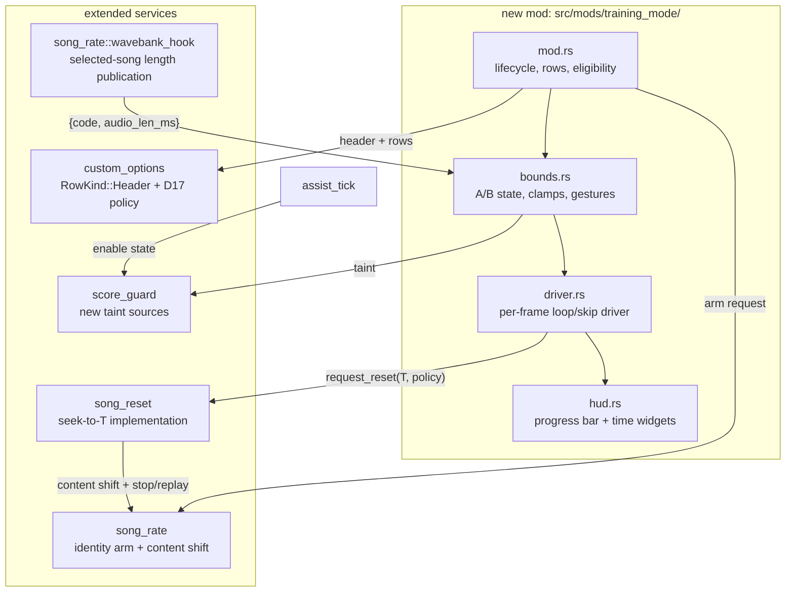

# Training Mode (v1: Section Practice) — Detailed Design

Status: Approved 2026-08-13
Date: 2026-08-13

## 1. Overview

A training mode for DDR World in the spirit of the console releases: isolate
a section of a song (skip the first Y seconds, omit the last X), optionally
loop it until quick-fail, watch a live content-time progress bar, and refine
the section bounds mid-play with pinpad gestures. Composes with the shipped
Song Playback Speed and Assist Tick mods; all training-related option rows
are visually grouped on the MODS tab under a non-selectable **TRAINING
OPTIONS** header row.

This design covers **v1 (section practice)** fully and sketches v2
(rewind/fast-forward gestures) and v3 (judgement-state rewind) as phase
extensions of the same primitives.

Foundational RE (all Ghidra-verified, cited throughout):
`docs/training_mode_research.md` (seek/loop/end-chain/audio/anchor),
`docs/option_header_rows_research.md` (header rows),
`docs/quick_restart_fail_speedup_research.md` §12 and the shipped in-place
song reset (`src/services/song_reset.rs`).

## 2. Detailed Requirements

R1 (scope) — v1 ships: section bounds, loop/early-end, HUD, A/B gestures,
TRAINING OPTIONS grouping, score containment. v2 = FF/RW gestures; v3 =
judgement-state rewind. v2/v3 are designed-for (sketches §12) but not built.

R2 (bounds UX) — Two per-player scalar rows: **SKIP FIRST (s)** and
**OMIT LAST (s)** (0–599, step 5 / coarse 30, default 0), plus live
refinement gestures. Row ranges are clamped at use time against the
selected song ("effective clamp"); the row may display a value the current
song truncates.

**Amendment (2026-08-14, maintainer decision at Step-3 validation): the
bound rows are absolute timestamps.** The rows are **SONG START TIME (s)**
(`training_start_time`) and **SONG END TIME (s)** (`training_end_time`),
0–200 s (the cap per the second amendment), step 5 / coarse 30,
defaults 0 and the cap — both plain timestamp
values, so no mental subtraction from the song length is needed to place
the section end. START 0 = natural start; END at/past the song's length =
natural end. Row-level coupling keeps the pair sane as it is edited:
raising START above END − 5 s nudges END up to START + 5 s (capped at
the row max); lowering END below START + 5 s bumps START down to END − 5 s
(floored at 0) — the play window stays at least `MIN_SECTION` (5 s)
wherever the range allows, and the runtime resolution (§4.2) remains the
authoritative enforcement. The nudged sibling row updates on screen the
same frame (the scalar render tick re-reads the registry per frame).

**Second amendment (2026-08-14, same session, extended after the Step-3
demo): the bound rows are SONG-SCOPED — the ROW RANGES themselves are
re-bounded per highlighted song, digest-stamped.** The abstract cap is
**200 s** (no DDR chart runs longer; maintainer decision). While at song
select, a per-frame highlight watcher (driver) compares the wavebank
publication's `code_digest` against the rows' song stamp; a NEW
highlighted song **re-bounds the rows to its own timeline** — END steps
over `[MIN_SECTION, seed_end]` and START over
`[0, seed_end − MIN_SECTION]`, where `seed_end` = the song's audio length
rounded UP to the 5 s step (`seed_end_seconds`: always at/above the real
end; ≥200 s songs use the cap, the natural-end sentinel) — and re-seeds
the values to START 0 / END = `seed_end`. The stepper can therefore not
even express a timestamp past the song (the maintainer's option-bound
clamp), the row's position marker scales to the song's real range, the
menu always opens showing the highlighted song's honest ending timestamp
(to within 5 s), and an untouched menu can never carry one song's bounds
into another — in either direction. The re-bounding rides a new
framework primitive (`custom_options::set_scalar_bounds` — live-mutable
scalar `min`/`max`; every consumer reads the registry per frame, and
out-of-range stored values clamp with deferred callback dispatch).
Editing a row keeps the current stamp; the card-in session reset (END
restored to the abstract cap default) clears the stamp so the watcher
re-seeds for the new player. **Digest coherence closes the fast-confirm
race** (confirming a song before its wheel-settle publication lands,
leaving rows/pre-shift describing the previous song): the bind-time
pre-shift is stamped with the rows' digest and the create detour
declines a mapping whose stamp doesn't match the bank being created
(write order mapping-then-digest so a torn pair can only decline, never
wrong-shift), the gameplay-entry resolution declines rows stamped for a
different song (resolving as defaults — the song plays whole), and the
silent-start driver skips the adjust on the same test. All three fail
OPEN when no publication exists (parse-failure cabinets keep the
pre-digest behavior with the baseline 0–200 ranges; the chart-derived
clamps still protect).

R3 (gestures, during eligible gameplay with the mod enabled) —
triple-**7** = set A at the current position; triple-**9** = set B at the
current position; triple-**5** = clear both. Pinpad **4/6 are reserved**
for v2 FF/RW. Shipped gestures: triple-**1** restarts **from A** when a
training session is active; triple-**3** (quick fail) unchanged.

R4 (loop) — **LOOP SONG** per-player boolean row, **default OFF**.
ON: reaching the section end resets the run in place to the section start,
indefinitely, until quick-fail/quick-restart. OFF: reaching the section end
triggers the game's own natural ending (banner → results) with the partial
play's stats. Accumulators (score/combo/gauge, PUS buffers) reset on every
loop iteration — identical semantics to the shipped instant restart.

R5 (score containment) — A play is never submitted as a competitive result
if the song was *meaningfully altered*: rate ≠ 100 % (shipped), Autoplay
(shipped), quick-fail (shipped), **Assist Tick enabled (new — a behavior
change to the shipped mod)**, a section bound engaged, or any seek fired.
Mechanism: the shipped `score_guard` per-stage suppression + sanitised
logout, fail-closed.

R6 (audio at 100 %) — Training seeks at identity rate arm a
**passthrough** song-rate binding (stock header values via
`passthrough_plan` — never `plan_entry(100)`, which block-quantizes).
Non-training sessions keep the literal-stock 100 % pin. Binding refusal ⇒
seeks unavailable; loop degrades to section-start = 0 with one WARN.

R7 (HUD) — One shared widget during an active training session: progress
bar + `m:ss / m:ss` content-time readout + A/B tick marks, updating on
seeks/loops. **Bottom-center default**; per-player **PROGRESS BAR
PLACEMENT** enum row (TOP / BOTTOM).

**R7 amendment (2026-08-14, maintainer-directed after Step 5; feasibility
in `docs/chart_strip_hud_research.md`):** the HUD is a **vertical
chart-strip timeline** on the LEFT/RIGHT screen edge (reference: the
maintainer's iOS chart-preview app), not a horizontal bar. The strip
renders the ACTUAL chart — noteskin-accurate arrow glyphs (the player's
chosen `2d_arrowNN` design, the game's own quantization coloring driven
through the live palette machinery, freeze bodies as elongated bars,
shocks/mines distinct) at their content-time positions — **pre-rendered
once per song** on a background thread into a single texture (ARC/DDS
extract → CPU rasterize → PNG → the mine-texture FileManager pipeline)
and displayed by ONE static ImageWidget. Per-frame cost is constant
w.r.t. chart density (performance is the binding constraint): only the
dynamic markers move — current-time cursor, A/B markers, loop window
(≤4 small widgets). The strip's axis is the CONTENT domain (raw ms 0..
chart_end) — rate-independent; seeks/loops (and the upcoming FF/RW
scrobble) are pure cursor moves. The placement row becomes **TIMELINE
PLACEMENT** LEFT/RIGHT (default RIGHT), still per-player
`PersistMode::Full` (`training_progress_pos`, wire
`mod_training_progress_pos`). Color sourcing must READ the game (sheet +
palette + row selector), never replicate its math — a planned
quantization-granularity hack must propagate into the strip for free.
The `m:ss / m:ss` readout survives the amendment as a small text element
beside the strip. Fail-open ladder: strip synthesis/load failure ⇒
cursor+markers on a plain track ⇒ no HUD (one WARN; never blocks the
session).

**R7 second amendment (2026-08-14, maintainer-directed after the task-02
cabinet probe):** the strip's NOTE LAYER renders as flat rectangles, not
noteskin glyphs — on real expert charts the glyph rendering is a solid
unreadable wall (cabinet finding; host-side A/B on the embedded casr
Single Expert fixture confirmed and dialed in the replacement). Shipped
style: taps and freeze heads = 1-px full-column-width bars in their
quantization colors; freeze bodies = solid rectangles spanning the hold
(dimmed head color; head bar reads as the block's top edge); shocks =
full-width and mines = per-panel bars in a fixed bright blue-white
(`strip_synth::SHOCK_MINE_RGBA`); guidelines/background unchanged. Bar
colors are still resolved from the game's LIVE palette rows
(`strip_synth::row_bar_color` over the evaluator-walk snapshot), so the
color-sourcing constraint (quantization hack propagates) holds; the
noteskin sheet is not read at all on the live path (one less failure
rung — the sheet/lightning extraction + the noteskin rasterizer remain
in the pure layer, tested, for future zoomed/alternate views).

R8 (eligibility) — Ordinary solo and doubles sessions only; local versus
and course/Dan are excluded (identical gate set to Song Playback Speed).

R9 (grouping) — A **TRAINING OPTIONS** header row: full-width art,
half-height slot, rendered + laid out but skipped by cursor navigation.
Grouping is expressed **only** through the existing `custom_options.row_order`
config mechanism — no hardcoded group lists in code. The shipped default
config and README place under it: the training rows (R2/R4/R7), assist
tick (+ volume child), song speed (+ preserve pitch child), timing stats,
pacemaker→ms-error (+ threshold child), and step-data export.

R10 (header render policy) — Decorative header rows render **only when
listed in `row_order`**. Unlike normal rows (unlisted ⇒ appended at the
end), an unlisted header is not injected at all — no orphaned headers.

R11 (persistence) — A/B markers and the bound/loop rows are session-scoped
(bound rows and LOOP SONG reset to defaults at card-in; markers clear at
song change). PROGRESS BAR PLACEMENT persists with the profile
(`PersistMode::Full`). Gesture refinements never write back into the rows.

R12 (config) — New `training_mode` mod-config block reserved for v2's
FF/RW skip increments; v1 defines no keys. Mod kill switch:
`mods["training-mode"]`. `assist-tick` and `song-playback-speed` remain
standalone top-level mods.

**R12 amendment (2026-08-14, with the R7 amendment):** FF/RW scrobbling
is pulled from v2 into v1 as its own plan step immediately after the
timeline step (the vertical strip is its visual feedback; the seek
machinery shipped in Step 2). Gestures: pinpad **7 = rewind, 9 =
fast-forward**, single-press per increment, GAMEPLAY-only (no conflict:
quick_logout's triple-9 is song-select-scoped). Config keys
`training_mode.ff_increment_ms` / `training_mode.rw_increment_ms`
(default 5000, the reserved R12 keys made real); seeks go through the
shipped `request_reset`/adjust transactions and carry Step 5's taint via
the existing `on_song_reset(t>0)` subscriber automatically.

R13 (select-time clamping) — The bound rows clamp against the highlighted
song's **audio length**, obtained by parsing the XWB header already
resident at every slot-5 dance-bank create (preview and gameplay),
published passively from the existing wavebank-create detour. No SSQ
parsing. The runtime *hard* clamp is chart-derived (§6.4).

R14 (seek semantics) — Notes before the seek target are consumed-neutral
(never missed, never scored); freezes spanning the target are neutralized;
shocks before the target are passed. The clock, assist-tick claps, and
audio stay mutually exact on the ADPCM block grid.

R15 (skip-first audibility) — When SKIP FIRST is pre-set, the song's true
beginning is **never audible**: the binding serves a silent approach lead
then content from A starting with the first byte ever decoded, and only
the clock anchor is adjusted post-start (no stop/replay). The audible-start
path exists only as the mid-song gesture flow (where it is moot).

Assumptions: slim headers still consume one scroll-window slot; loop
iteration costs the approach lead (2.5 s, deliberate) plus cue re-prepare
(~0.15–0.3 s) of section-start silence; background movies are not
re-seeked (cosmetic desync after a seek; movies are stubbed under
CrossOver anyway).

## 3. Architecture Overview



Game-side integration points (all existing or RE'd):

| Surface | Mechanism | Source |
|---|---|---|
| In-place rewind | msg `0x1043`/`0x1044` broadcast + accumulator/gauge reset | shipped (`song_reset`) |
| Mid-song cursor | record-rebuild trio (`clear`/`reserve`/`rebuild(T)`) — pre-T notes consumed-neutral | `docs/training_mode_research.md` §3 |
| Clock at T | back-dated anchor `now_tick − content_to_wall_ms(T_q)`, `T_q` block-quantized | §6 ibid. |
| Audio at T | fixed virtual-bank layout + content-shifted serving + silent tail; stop/replay per seek | §5 ibid. |
| Natural early end | ControlMessageActor threshold writes (`+0x94` display / `+0x98` raw) | §4 ibid. |
| Song length @ select | XWB header parse at slot-5 bank create (file resident in FileManager) | §8 ibid. |
| Header rows | `+0x28` selectability vtable swap + `+0xA8` half-height + label-only render | `docs/option_header_rows_research.md` |

## 4. Components and Interfaces

### 4.1 `src/mods/training_mode/mod.rs`

Mod id `training-mode`. Registration (all rows via `custom_options`):

| Row id | Kind | Range / values | Persist |
|---|---|---|---|
| `training_start_time` | scalar "SONG START TIME (s)" | 0–(end−5), step 5, coarse 30, default 0; range re-bounded per highlighted song | none (session) |
| `training_end_time` | scalar "SONG END TIME (s)" | 5–song end (cap 200), step 5, coarse 30, default = song end; range re-bounded per highlighted song | none (session) |
| `training_loop_song` | bool "LOOP SONG" | OFF/ON, default OFF | none (session) |
| `training_progress_pos` | enum "PROGRESS BAR PLACEMENT" | BOTTOM (default) / TOP | Full |
| `header_training_options` | header "TRAINING OPTIONS" | — (decorative) | — |

(Bound-row ids/labels/semantics per the R2 amendment of 2026-08-14 —
absolute timestamps with the mutual MIN_SECTION nudge; the original
SKIP FIRST / OMIT LAST relative rows shipped only within Step 3's
pre-demo build and serialized nothing, so no migration exists.)

Session-scoped rows use a new lightweight `PersistMode::Session` (registered
normally, excluded from both network fields and the JSON cache, reset to
defaults on card-in). Textures via the existing `scripts/gen_option_labels.py`
pipeline; the header's full-width half-height label art is a new
`seop_header_training_options` asset served through LayeredFS.

Eligibility latch (scene-26, identical predicate to song speed): ordinary
solo/doubles, no versus, no course/Dan, no event mode. When the mod is
enabled and the session is eligible, `mod.rs` requests a song-rate arm for
**every** song (identity passthrough at 100 %; the normal rate arm
otherwise) so that gestures can seek even on songs entered without bounds
pre-set. Arming alone does not taint (audio served is byte-identical).

**Training session active** (the predicate for R5's taint, the HUD, and
the driver) ⇔ at gameplay: `skip_first > 0 || omit_last > 0 || loop ON`,
or a gesture set a marker / a seek fired mid-song. Latched per song.

### 4.2 `src/mods/training_mode/bounds.rs`

Owns the resolved section `{a_ms, b_ms}` in the content (raw-ms) domain:

- At gameplay entry: `chart_end_raw` = ControlMessageActor `+0x98` (stock
  value, read before any truncation; the actor is found by RTTI vtable walk
  of the GamePlayActor's children — same `find_vtable_by_rtti` pattern as
  the gauge family). Per the R2 timestamp amendment (2026-08-14):
  `a_ms = min(start_time·1000, chart_end_raw − MARGIN)`;
  `b_ms = clamp(end_time·1000, a_ms + MIN_SECTION, chart_end_raw)`, with a
  `b` landing at/past `chart_end_raw` normalizing to "none" (natural end);
  both block-quantized (§6.2 of the research: the 2.90 ms ADPCM grid).
- Gestures rewrite `a_ms`/`b_ms` from the live music count (GamePlayActor
  `+0x178`); triple-5 restores the row-derived values.
- Select-time UI clamp: the wavebank-create publication (§4.6) provides
  `{code_digest, audio_length_ms}`; the scalar rows' `load_transform`-style
  effective clamp caps displayed seconds at `audio_length_ms/1000`.
- Display-domain conversion for the early-end threshold (`+0x94` is in the
  chart's display domain): replicate the game's converter — a binary search
  over the note vector (`actor+0x90`, stride 0x60) bracketing `raw` between
  consecutive notes' `+0x08` fields and linearly interpolating their
  `+0x04` fields. Pure reads; no new signatures.

LOOP OFF wiring: when a section end exists (`b_ms < chart_end_raw`), write
ControlMessageActor `+0x94 = display(b_ms)` and `+0x98 = b_ms` (both
sides). The game then runs its stock tail (0x104A/0x104B → GamePlayActor
step 6 → DPS 0x1053 → banner → results). LOOP ON: **never** write the
thresholds; the loop driver fires strictly below them. A gesture-set B
behind the current position under LOOP OFF ends the song on the next
frame's `0x1045` — accepted "end here" semantics.

**Amendment (2026-08-14, cabinet-driven — Step-4 validation):** LOOP ON
now PARKS the end cascade instead of merely staying below it: the apply
raises `+0x94` to the sane-max sentinel (stock pair stashed; `+0x98`
kept stock, so all other readers stay honest) because `0x104A` proved to
be one-way song-scoped state that strikes the lane furniture and breaks
freeze scoring on later passes — a loop must prevent it from EVER
firing while still letting every pass play and score the full section
(research §4.3 refinement). The raise is restored at song boundaries,
mod disable, AND loop disarm (mandatory — a parked cascade with no loop
means the song could never end). The loop fire bound simplifies to
`min(b_live, +0x98) − margin` on every reset path; if the raise itself
fails, the driver falls back to the original conservative
below-`+0x94` bound (WARN once). **Triple-5 semantics (same session,
maintainer decision):** clear the LIVE bounds to none — the rest of the
run plays the whole song (LOOP OFF restores the stock end; LOOP ON
grinds whole-song). The Step-3 restore-to-row-values behavior is
retired; rows still re-resolve on the next song.

### 4.3 `src/mods/training_mode/driver.rs`

Per-frame render-thread self-requeueing callback (the shipped restart-driver
pattern), active while a training session is armed:

- **Skip-first (silent pre-shift — the true beginning is never audible)**:
  when `skip_first > 0` is known at the bank create (rows are set at song
  select, before scene 26), the binding is created **already shifted**
  (§4.5): it serves `lead_ms` of silence, then content from A. The natural
  start sequence runs untouched (READY panel, cue play, DPS state 6's own
  `0x1044 {now}`); the driver detects the first anchored frame (actors at
  step 4, anchor nonzero) and fires ONE synchronous adjust block — no cue
  stop/replay: broadcast `0x1044 {now − wall(A) + lead_ms}` + record
  rebuild at `a_ms` + freeze neutralization. Result: silence while the
  section's notes make a natural approach, music starts exactly at A.
  Nothing of the song's real beginning is ever decoded into the output.
  The 1–2 frame window between the game's anchor and ours is silent and
  judge-inert (pre-A notes become consumed-neutral in the rebuild; no miss
  processing can fire within the window).
- **Approach lead**: `TRAINING_LEAD_MS` (code constant, **2500 ms** per maintainer; v1
  deliberately not configurable per R12) — the pre-A window that gives
  section-start notes scroll-in time, since sections (unlike chart starts)
  have notes immediately at A. Used by the first start (above) and by loop
  iterations (below, as the reset's existing `delay_ms` — the shipped v4
  future-dating mechanism, which already produces exactly this
  silent-approach behavior).
- **Loop**: when LOOP ON and music count ≥ `b_ms`:
  `song_reset::request_reset(a_ms, TRAINING_LEAD_MS, recovery)` with the
  loop accumulator policy (zero accums — restart semantics).
  Generation-tokened; one in-flight reset at a time.
- **Gesture-set A mid-song** (bounds not known at create): the seek uses
  the stop/replay path (§4.4) — the standard ~0.15–0.3 s re-prepare;
  no true-beginning audibility issue arises (the song is already past it).
- **Restart-from-A**: `quick_restart_or_fail::trigger_restart` consults
  `training_mode::active_section_start()` and passes `a_ms` (with the
  same lead) instead of 0.

### 4.4 `src/services/song_reset.rs` — seek-to-T (the `Unsupported` arm)

`request_reset(t_ms != 0, …)` becomes real. Deltas from the shipped
`t_ms == 0` path (research §5.4 transaction):

1. Gates: shipped Phase-0 set + seek clamp (`t_ms < chart_end_raw −
   MARGIN`, and both CMA thresholds unfired — StackStep < 3/4
   respectively).
2. Audio: `song_rate::runtime::set_content_mapping(shift = B(t_ms),
   lead = B(delay_ms))` (§4.5) between cue stop and replay. If no binding
   is live → `Refused` (caller falls back per R6).
3. Anchor: broadcast `0x1044 {now_tick − content_to_wall_ms(t_q)}`
   (identity ⇒ 1:1; the existing `tick_domain` conversion).
4. Post-broadcast, per GamePlayActor: re-run the record-rebuild trio with
   playhead `t_q` (the broadcast rebuilt at 0), then the spanning-freeze
   neutralization pass: for each freeze whose head < `t_q` < end, copy the
   per-panel durations into the head record's hold progress and mark the
   end record consumed (mirrors the engine's own pre-T treatment).
5. Accumulator policy parameter: `Zero` (loop/skip) — the shipped zeroing;
   `Keep` reserved for v2 FF/RW.
6. Subscribers receive `on_song_reset(t_q)`; assist_tick's existing
   rewind/rebuild handles nonzero T via its `restart_skip_ms` conversion
   unchanged.

### 4.5 `src/services/song_rate/` — identity arm + content shift

- `lifecycle`: a training-arm request (atomic set by `training_mode` before
  scene 26) makes an **identity percent armable**. The resulting binding
  plans the main entry with `passthrough_plan` (stock header) and marks
  `serve_mode = IdentityPassthrough`. The Q31 clock factor stays identity;
  no movie suppression for identity arms.
- `binding`: new content mapping pair `{shift_blocks, lead_blocks}`
  (atomics, block-aligned, default `{0, 0}`). Serving of the main entry:
  virtual block `v < lead_blocks` ⇒ pre-encoded silent block; else source
  block `v − lead_blocks + shift_blocks`, with silent tiling past the
  source end. `IdentityPassthrough` mode does this allocation-free from
  the resident source copy (no producer thread) — structurally the
  existing side-entry verbatim arm plus the mapping. Non-identity: the
  mapping feeds the generator's reposition path; a mapping change bumps
  the ring seqlock (existing `ring_rewind`) and production restarts at
  output 0 under the new mapping. The mapping may be set **at bind time**
  (skip-first pre-shift — the first byte ever served is already shifted)
  or between cue stop/replay (seeks).

  **Amendment (2026-08-13, maintainer decision at Step 2): O(1) seeded
  seeks in pitch-preserved mode.** At a non-identity rate, a mapping with
  `shift_blocks > 0` in WSOLA (preserve-pitch ON) mode is served by a
  **fresh stretch seeded at the shift-mapped source position** — NOT a
  slice of the canonical whole-song stretch, whose exact bytes at output
  P require the alignment-decision chain up to P (produce-and-discard;
  live-measured ~25 s for a 60 s pre-shift at 90 %). Frame count and
  duration stay exact by construction: the seeded run targets exactly
  `output_total − shift` frames and the virtual layout never changes.
  Byte-level alignment differs from the canonical stream — imperceptible
  across a seek's cue stop/replay discontinuity and maintainer-accepted
  (the stretch already alters the waveform by nature). Within one mapping
  epoch the fresh run is the deterministic byte authority (within-epoch
  regeneration reproduces IT; the generator's cross-epoch checkpoints
  must be INVALIDATED on every mapping change — they describe the
  previous epoch's bytes). Cross-epoch byte identity is not required —
  the engine reconsumes from scratch after every cue replay. Resample
  mode keeps its exact positional seeks (already O(1) and byte-stable);
  mapping `{0, 0}` remains the canonical stream, so Quick Restart and all
  shipped behavior are unchanged. Rolling checkpoints (considered as an
  alternative) are unnecessary under this model: every loop iteration and
  FF/RW seek opens a new epoch and seeds in O(1).
- The engine parses the virtual header once per bank, so the layout is
  fixed and only the content mapping shifts (research §5.1); each cue
  replay re-reads from entry offset 0 = content at T.

### 4.6 `song_rate::wavebank_hook` — selected-song publication (R13)

On every slot-5 dance-bank create (armed or not): parse the resident XWB
header (`xwb::parse_song_bank` on the FileManager row bytes, already
resolvable), publish `{song_code_digest, main_entry_duration_ms}` to a
static cell. `bounds.rs` consumes it at scene 25 for the UI clamp.
Parse failure ⇒ publish nothing (rows stay unclamped; runtime clamp still
protects).

### 4.7 `score_guard` — new taint sources (R5)

- `set_training_taint(side)` — called by `bounds.rs`/`driver.rs` when a
  section bound engages at entry, a marker is set, or a seek fires.
- Assist-tick taint: `assist_tick` reports its per-side enable latch at
  gameplay entry; `score_guard` treats it exactly like the existing
  autoplay taint (per-stage suppression + sanitised logout). This is a
  deliberate behavior change to the shipped mod, per R5.

### 4.8 `custom_options` — header rows (R9/R10)

- `UiKind::Header` in `api.rs` (no values, no persistence, label asset id).
- `rows.rs`: allocate via the existing donor ctor; then (a) swap `row+0x28`
  to a mod-owned 2-slot vtable `{return 0, no-op}` (non-selectable; the
  exact native mechanism — zero new signatures), (b) halve the y-extent at
  `row+0xA8` (per-row layout input, engine-honored), (c) `RowKind::Header`
  slot-7 render draws only the full-width label texture — no value box, no
  marker, no tri-arrows.
- `builder_hook`/`ordering.rs`: headers are injected **only if their id
  appears in `row_order`** (R10); normal rows keep the append-at-end
  policy. The README/default config gains the grouped ordering with
  `header_training_options` leading the training block.

## 5. Data Models

```rust
// training_mode::bounds
struct SectionState {
    chart_end_raw: i32,        // CMA +0x98 stock value, gameplay-entry latch
    a_ms: i32,                 // block-quantized section start (0 = none)
    b_ms: i32,                 // block-quantized section end (== chart_end_raw = none)
    engaged: bool,             // training-session-active latch (taint + HUD + driver)
    thresholds_written: bool,  // LOOP OFF early-end applied
}

// published by wavebank_hook (atomics, torn-read safe via generation)
struct SelectedSongInfo { code_digest: u64, audio_len_ms: u32, generation: u32 }

// song_rate::binding addition
serve_mode: IdentityPassthrough | Stretch,   // existing paths unchanged
shift_blocks: AtomicU64,                     // content start offset (0 = none)
lead_blocks: AtomicU64,                      // silent approach prefix (0 = none)
```

Config (`mod-config.json`): `mods["training-mode"]` (default true);
`training_mode: {}` block reserved (v2: `ff_increment_ms`,
`rw_increment_ms`). Wire fields: only `mod_training_progress_pos`
(placement row) — the session rows serialize nothing.

## 6. Error Handling

Fail-open ladder, one WARN each, never a crash (every game-memory read
range-validated, per repo convention):

| Failure | Degradation |
|---|---|
| Identity binding refused / io hooks unresolved | Seeks unavailable; loop works only with `skip_first == 0` (reset-to-0 is binding-free); LOOP OFF early end unaffected |
| CMA vtable unresolved / thresholds unwritable | LOOP OFF: section end ignored, song plays to natural end (bound rows still clamp seeks); WARN once |
| Seek `Refused`/`Unsupported` mid-loop | Iteration skipped; recovery = natural continue; next frame retries once, then loop disarms |
| Pre-shift missed (binding live but unshifted at start) | Fallback: stop/replay seek at the first gate frame — brief true-beginning audibility, one WARN (violates R15 only in this degraded path) |
| Reset recovery fires (started-but-failed) | Shipped natural-death restart path (fail-closed on a stopped song) |
| Header injection fails (vtable synth/alloc) | Header absent; rows render ungrouped — cosmetic only |
| XWB parse fails at select | Rows unclamped; runtime clamp still enforced |
| Taint machinery unavailable | Existing `score_guard` fail-closed policy: full suppression |

Threading: gestures + driver on the render thread; no locks across engine
calls; seek/loop generation-tokened (a newer request supersedes).

## 7. Testing Strategy

Repo model: host tests where pure logic permits, cabinet deploys for
everything engine-facing.

- **Host tests** (extend existing suites): `binding` — IdentityPassthrough
  serving byte-identity vs source at shift 0; shifted serving vs a
  reference slice + silent tail; shift-change seqlock behavior;
  `virtual_bank` passthrough-plan identity. `bounds` — clamp math, display
  -domain interpolation against synthetic note vectors, block quantization.
- **Fault injection**: the existing `DDR_SONG_RATE_FAULT` machinery gains
  one leg (bind-refused at identity arm) to prove the R6 degradation on
  host and cabinet alike. No dry-run mode — cabinet validation is live by
  maintainer preference.
- **Cabinet checklist** (per deploy): skip-first silent start (R15 — no
  audible true beginning, approach lead correct); loop at
  section end incl. accumulator reset and HUD; LOOP OFF early end → banner
  → results (partial stats; no submission — verify server side); gestures
  incl. B-behind-cursor; restart-from-A; rate-composed seek (75 %/125 %);
  assist tick claps after seek; freeze spanning A; versus/course refusal;
  header row render/skip/scroll behavior; placement row TOP/BOTTOM;
  score-suppression matrix (assist tick alone, bounds alone, seek alone).

## 8. Phase Sketches (v2/v3, not built in v1)

- **v2 FF/RW**: triple-7 / triple-9 seek −/+ `training_mode.rw_increment_ms`
  / `ff_increment_ms` (config, default 5000) via the same
  `request_reset(T, policy: Keep)`; accumulators untouched, judgements-only
  stats; taint via the existing flag. HUD already reflects seeks.
  (Buttons per the 2026-08-13 D3 amendment: the marker gestures took the
  middle row 4-5-6, freeing 7/9; note 9 is quick_logout's at SONG SELECT
  only — scene-disjoint from gameplay.)
- **v3 judgement rewind**: periodic snapshot ring of the judge-record
  vector (`totalNotes × 0x40`, note pointers stable across resets) +
  accumulator block + gauge values; rewind targets quantize to snapshot
  times. Explicitly out of v1.

## Appendix A — key RE citations

| Fact | Source |
|---|---|
| `0x1044` native rewind; rebuild worker playhead semantics; pre-T notes consumed-neutral | `docs/training_mode_research.md` §2.1, §3 |
| End cascade one-way; `+0x94`/`+0x98` thresholds; StackStep-6 unresettable | ibid. §4 |
| Header parsed once ⇒ fixed layout + shifted serving; identity `passthrough_plan` requirement; per-entry silent blocks | ibid. §5 |
| Anchor math `now − content_to_wall(T_q)`; block-grid quantization | ibid. §6 |
| Preview bank = same XWB; selection global `DAT_1806f2d50+0x1B0`; resident header at create | ibid. §8 |
| `+0x28` slot-0 selectability; `+0xA8` per-row height; cursor-path predicates | `docs/option_header_rows_research.md` |
