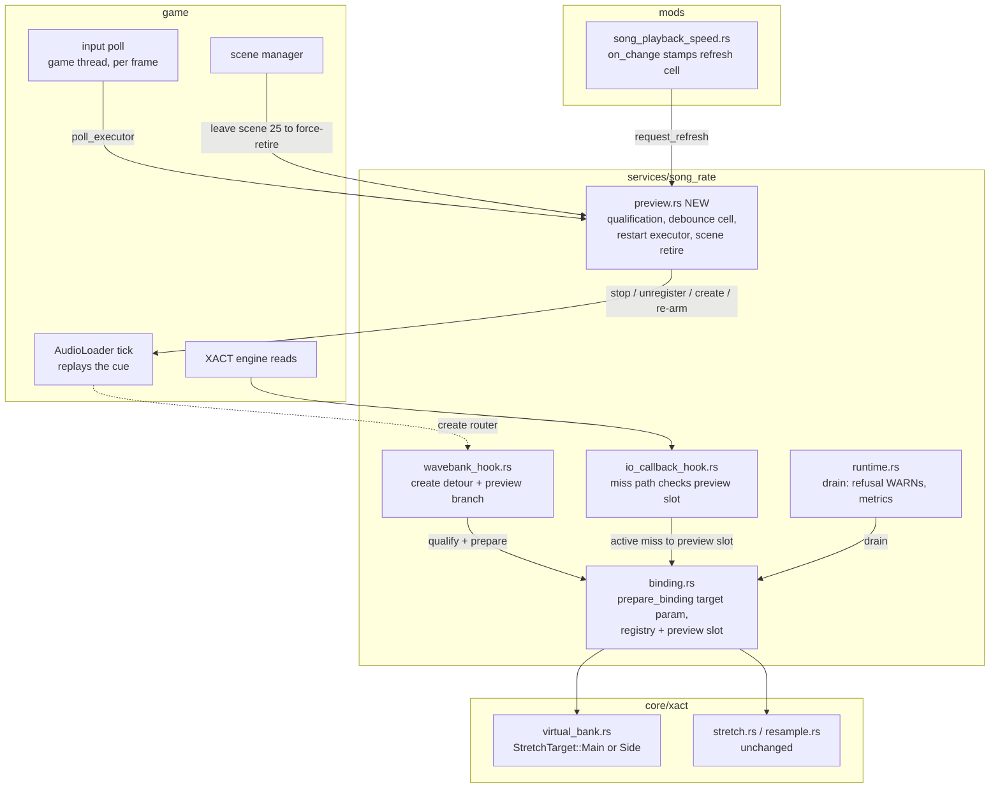
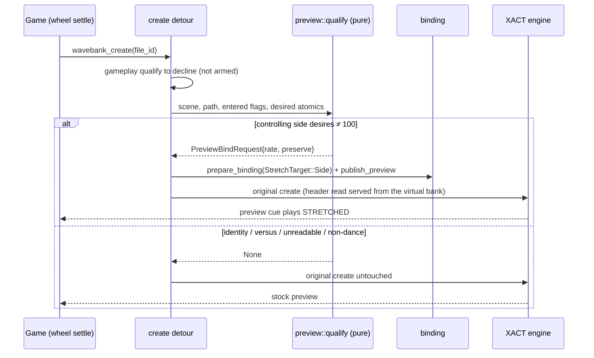
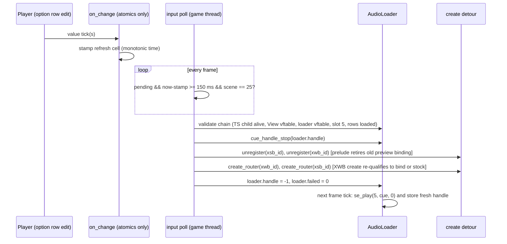

# Detailed Design: Real-Time Rate Preview at Song Select

Status: Approved 2026-08-15 (amendment approved 2026-08-16: deploy-#1
findings — the preview play watchdog added to the executor's duties, and
the accepted ~0.6 s first-audio latency for pitch-preserved previews;
maintainer decision "slightly late but reliable", after engine RE ruled
out short completions — see the watchdog paragraph in §Components 5)
Date: 2026-08-15 (amended on approval: made explicit that the wheel-settle
signal is the already-hooked wave-bank create path — the same event that
feeds the selected-song publication — and added the publication-generation
supersession check to the restart executor)

## Overview

The Song Playback Speed feature (mod `song-playback-speed`) lets a player
select a per-song playback rate (SONG SPEED, 25–175 % in 5 % steps) and a DSP
mode (PRESERVE SONG PITCH: WSOLA time-stretch vs. plain resample) through
injected custom-option rows. Today those rows only shape the *next* song: the
desired values are consumed once at the loading screen (scene 26), and the
song-select preview always plays at stock rate.

This feature makes the song-select preview itself obey the rows, live:

1. **Rate-bound previews.** While the controlling player's SONG SPEED is not
   100 %, every preview that starts on the music wheel plays at that rate in
   the selected DSP mode.
2. **Live re-trigger.** Editing SONG SPEED or PRESERVE SONG PITCH while a
   preview is playing restarts the preview from its beginning at the new
   settings, 150 ms (debounced) after the last edit tick — including edits
   back to 100 %, which restore the literal stock preview.

The implementation reuses the existing song-rate streaming engine end to end
(virtual bank synthesis, pull-driven WSOLA/resampler, ring buffer, XACT
file-IO interception) and re-drives the game's own preview player for the
restart. It adds **zero new hooks**: preview banks are already created
through the detoured `wavebank_create`, and the restart is performed by
calling five already-located stock functions and re-arming the game's own
per-frame preview loader tick.

Preview bindings are an audio-serving concern only. They never touch the
gameplay clock (Q31), the score guard, the movie policy, the lifecycle
generation machinery, or the XACT transaction slots. Any failure at any
stage falls open to a stock preview with one bounded WARN; song select can
never be blocked or corrupted by this feature.

## Detailed Requirements

Consolidated from the accepted decision register.

| # | Requirement |
|---|---|
| R1 | Mechanism: create-time **preview binding** (virtual bank with the preview entry stretched and the main entry verbatim — the inverse of the gameplay plan) plus an **in-place preview-loader restart** for live edits. No XACT pitch variables, no pre-synthesized banks. |
| R2 | While the controlling side desires ≠ 100 %, **every** preview-bank create at song select binds — not only after an edit. At 100 % the feature has zero footprint (no binds, no restarts, byte-stock previews). |
| R3 | Controlling side mirrors the gameplay eligibility policy: **exactly one entered side** controls (its `song_speed` + `preserve_pitch`); both sides entered (local versus), no side entered, or unreadable entered flags ⇒ stock preview, no restarts. When versus support ever lands for gameplay rate, the preview inherits gameplay's side-selection rule. |
| R4 | A change to `song_speed`, or to `preserve_pitch` while speed ≠ 100, requests a preview refresh. The refresh fires on the game thread **150 ms after the last change tick** (edits within the window coalesce), only while the scene is SONG_SELECT, and restarts the preview from its beginning at the newly desired settings. |
| R5 | A change **to** 100 % fires one final refresh whose re-created bank is unbound ⇒ the stock preview plays. |
| R6 | No preview-window compensation: the game's own preview stop/loop timing governs. At slow rates the player hears proportionally less of the song, slowed — a faithful preview of the rate. |
| R7 | Gameplay-header safety: a preview-stretched bank header must never serve gameplay. Guaranteed structurally (cabinet-proven: the preview bank is unregistered at song confirm and the gameplay create lands on a fresh file id — see Appendix A) and defensively (the preview binding is force-retired on any transition leaving SONG_SELECT). |
| R8 | Isolation: preview bindings never publish Q31, never touch the score ledger or session taint, never set movie suppression, never enter the lifecycle state machine or the transaction slot table. |
| R9 | Failure policy: fail open to a stock preview at every stage (missing derivation, qualification failure, bind refusal, restart precondition failure, create failure) with one bounded WARN per failure class. Never block or delay song select beyond the restart's own few-ms cost. |
| R10 | Scene scope: SONG_SELECT (0-indexed scene 25) only. |
| R11 | No config surface, no new option rows: the behavior is on whenever the `song-playback-speed` mod is enabled and the feature's derivations resolved. Disabling the mod disables it. |
| R12 | The restart is composed exclusively of stock functions the game itself uses for the same purpose (cue-handle stop, bank unregister, load-completion create router, the preview loader's own replay tick). |
| R13 | Streaming defaults (16 MiB ring, capacity/2 generator pacing) are reused unchanged. |
| R14 | Replayed cue fidelity: the game's own loader tick performs the replay (`se_play(slot 5, "<code>_s", pan 0)`) — pan and mute-filter behavior are inherently stock. |
| R15 | Preview bindings carry a separate monotonic identity counter (for logs/metrics); the gameplay generation counter is never consumed or advanced by previews. |

### Assumptions

- The `<code>_s` preview entry shares the main entry's format profile
  (stereo MS-ADPCM, same sample grid) — same file, same strict parser; a
  parse failure declines the bind (fail-open, R9).
- The wheel cannot move while the options modal is open. The design does not
  depend on this: any new preview create re-qualifies independently, and the
  restart executor re-validates the scene and loader identity at fire time.

## Architecture Overview

### The game's preview pipeline (reverse-engineered, build 20260721)

The song-select scene child (`sequence::selectmusic::SelectMusicSequence`,
reachable as `*(TransitionSequence + 0x58)` — the same accessor the DLL's
scene machinery already uses) owns a `sequence::selectmusic::View` at
`+0xB8`. The View embeds a `sequence::AudioPlayer` at `+0xC8`:

```
SelectMusicSequence            (= *(TS+0x58) at scene 25)
  └─ +0xB8 → View              (0x4A0 bytes; vftable identity gate)
       └─ +0xC8  AudioPlayer   (embedded)
            ├─ +0x08  unique_ptr<AudioLoader>   ← exactly ONE live request
            ├─ +0x18  path string (dedupe store)
            ├─ +0x40  cue  string (dedupe store)
            └─ +0x68  deferred-request timer list
```

When the wheel settles, an observer lambda requests
`AudioPlayer::request(slot 5, "data/sound/win/dance/<code>", "<code>_s",
delay 0.4 s)`. After the deferral, a new `sequence::AudioLoader` (0x70
bytes) is constructed — its ctor **acquires FileManager references** on
`<path>.xwb` / `<path>.xsb` (creating rows and queuing loads if absent) —
and swapped into the unique_ptr; the swap **releases the old loader**, which
stops its cue by stored handle and releases its file references (the
FileManager sweep then unloads the rows and unregisters the old banks).

`AudioLoader` layout (all offsets RE-confirmed on 20260721, structurally
identical on 20260616):

| Offset | Field |
|---|---|
| +0x00 | vftable (ONE virtual slot: the per-frame tick) |
| +0x08 / +0x0C | i32 XWB / XSB file id |
| +0x10 | i32 cue handle (−1 = not yet played) |
| +0x14 | u8 failed flag |
| +0x15 | u8 mode (1 = one-shot `se_play` — the preview path) |
| +0x18 | i32 slot (5) |
| +0x20 / +0x48 | path / cue std::strings |

The tick fires the cue **exactly once**: when both file rows are loaded
(row state ∈ {0, 5, 6, 8}), `handle == −1`, and `!failed`, it calls
`se_play(slot, cue, 0)` and stores the returned handle. **Setting the handle
back to −1 re-arms it** — this is the replay lever the restart uses.

Bank creation is load-completion-driven: the FileManager's "sound"-category
task callback routes each completed file through the **create router**
(`.xsb` ⇒ sound-bank create; anything else ⇒ `wavebank_create` — the
function the song-rate engine already detours). Calls into the router
therefore compose with the existing create detour for free.

### Component graph



### Flow 1 — wheel settle while armed (no restart involved)

The "wheel selection changed" event is already hooked: every wheel settle
loads the new song's XWB through the detoured `wavebank_create`, which is
where the selected-song publication (`song_rate::selected_song` — consumed
today by the training-mode bounds seeder) already fires. The preview
binding rides that same event/detour; no new selection hook is needed.
Whenever the create detour sees a slot-5 dance-bank create, after the
gameplay qualification declines (it always declines at scene 25 — arming
happens at scene 26), the preview branch qualifies:



### Flow 2 — live edit restart



The restart never calls the game's request façade (it dedupes on the cue
name and its loader swap acquires-before-release, so same-song requests can
never produce a fresh bank). Every step above is a stock function used in
its stock role; the loader's own bookkeeping (stored handle, teardown on
wheel move / scene exit) remains fully consistent because the game itself
performs the replay.

### Why a restart (not an in-place rate change) is required

XACT entry metadata (durations, data regions) is parsed once from the bank
header at create time; there is no seek path and no way to re-declare an
entry's length on a live bank. A different rate ⇒ different stretched
length ⇒ a fresh header ⇒ a fresh bank create. Restart-from-beginning is
the only semantic the engine supports.

## Components and Interfaces

### 1. `core/xact/virtual_bank.rs` — target-entry parameterization

```rust
#[derive(Clone, Copy, PartialEq, Eq, Debug)]
pub enum StretchTarget {
    /// Gameplay: main entry stretched, side entry verbatim (shipped behavior).
    Main,
    /// Preview: side (`_s`) entry stretched, main entry verbatim.
    Side,
}

pub fn plan_virtual_bank(
    source: &SongBank,
    rate: RateRatio,
    target: StretchTarget,          // NEW parameter
) -> Result<VirtualBankLayout, PlanError>
```

- The main-entry identity rule is unchanged (main = the entry named exactly
  like the bank); `target` selects which entry receives the stretched plan
  (duration/data-region/loop mapping through the existing `map_loop`) and
  which receives the verbatim plan (stock header values).
- `VirtualBankLayout` gains a `target_entry_index` (the stretched one);
  `main_entry_index` keeps its meaning. All existing callers pass
  `StretchTarget::Main` and must produce **byte-identical plans** to today
  (regression-pinned by tests).
- `plan_identity_bank` is untouched (identity has no target distinction).

### 2. `binding.rs` — target-aware bindings + the preview registry slot

- `prepare_binding(file_id, generation, percent, preserve_pitch, source,
  fault, target: StretchTarget)`:
  - ring coverage and generator regeneration ranges follow the TARGET
    entry's virtual range;
  - the verbatim entry's region serves directly from the binding's private
    source copy (offset arithmetic — the append-only side buffer is only
    produced when the verbatim region is the side entry, i.e. gameplay);
  - the private source copy (whole-XWB memcpy at preflight) is retained for
    both targets — it is the generator thread's lifetime guarantee against
    FileManager row reuse. Preview cost: one ~8–30 MiB memcpy per
    wheel-settle create while armed (the game's own 0.4 s request deferral
    bounds settles to ≲2.5/s); measured on cabinet.
- `BindingRegistry` gains an independent **preview slot**:
  - `publish_preview(Arc<Binding>)` — replaces any previous preview binding
    (retiring it);
  - `with_preview<R>(f) -> Option<R>` — mirror of `with_active`;
  - `retire_by_file(file_id)` now covers BOTH slots, so the existing
    unregister prelude retires preview bindings on every natural teardown
    (wheel move, song confirm, scene exit) and on the restart's forced
    unregister, with no new call sites;
  - `retire_preview() -> bool` — unconditional force-retire (scene-exit
    defense, mod disable);
  - retired preview bindings flow through the existing retired-list sweep
    (generator stop, ring reclamation) via the runtime drain.
- Preview bindings are constructed with `generation` from a separate
  `AtomicU64` preview counter (R15) — never the lifecycle generation.

### 3. `io_callback_hook.rs` — miss-path extension

`bound_verdict` checks the active slot first (unchanged hot path: one
Acquire when no binding exists), and on miss checks the preview slot. The
handle→file_id lookup result is computed once and compared against both
slots' file ids. Serve/poll dispatch is shared and unchanged.

### 4. `wavebank_hook.rs` — preview qualification branch

Inside the existing create detour, after the gameplay bind closure runs (or
declines):

```rust
// Pseudocode of the added branch (pre-original, same containment):
if outcome_was_stock && preview::feature_active() {
    if let Some(req) = preview::qualify(
        scene_manager::current_scene(),          // must be SONG_SELECT
        song_code.as_deref(),                    // dance banks only
        stage_records::entered_flags(),          // exactly one side
        runtime::desired_percent / preserve,     // that side's atomics
    ) {
        match prepare_binding(.., StretchTarget::Side, ..) {
            Ok(b)  => registry.publish_preview(b),
            Err(r) => registry.note_preview_refusal(r, file_id), // drain WARNs
        }
    }
}
```

- Ordering: gameplay qualification retains absolute precedence; the preview
  branch is reached only when the gameplay path produced a stock outcome.
  (Scenes make them mutually exclusive in practice — gameplay arms at 26,
  previews qualify at 25 — the precedence is belt-and-braces.)
- `qualify` is a pure function (host-tested): declines on wrong scene,
  non-dance path, zero or two entered sides, unreadable flags, identity
  percent, or unsupported percent.
- A new `file_table_state(file_id)` accessor (sibling of the existing
  `file_table_source`/`file_table_path`) exposes the row load-state dword
  (`row+0x20`) for the restart executor's preconditions.

### 5. `services/song_rate/preview.rs` — NEW module (the feature's policy home)

```rust
pub fn init(signatures: &SignatureStore) -> bool;   // resolve derivations,
                                                    // register scene callback + input-poll callback
pub fn set_feature_active(on: bool);                // driven by the mod enable/disable
pub fn feature_active() -> bool;                    // conjunction: mod on + derivations + services
pub fn request_refresh();                           // atomics-only; called from on_change
pub fn qualify(...) -> Option<PreviewBindRequest>;  // pure, host-tested
```

Internal responsibilities:

- **Debounce cell**: a seqlock-free pair `{requested: AtomicBool, stamp:
  AtomicU64 (QPC ticks)}`. `request_refresh` stores the stamp and sets the
  flag (two relaxed stores — legal under the option-callback contract).
- **Restart executor** (registered with the input manager's per-frame poll —
  game thread): one relaxed load per frame when idle; when
  `requested && now − stamp ≥ 150 ms`:
  0. Supersession check (reuses the existing wheel-settle signal): if the
     selected-song publication's monotonic `generation` advanced past the
     value latched when the refresh was stamped, a wheel move already
     produced a fresh create that qualified with the latest desired values —
     clear the request and stop (restarting would be redundant and would
     fight the game's own 0.4 s deferred request).
  1. Re-validate: scene == SONG_SELECT; TransitionSequence live; child at
     `+0x58` alive (`flags & 0x24 == 0`); `View = *(child+0xB8)` non-null
     with `*View == View::vftable` (the identity gate that makes the +0xB8
     offset fail-closed across builds); `loader = *(View+0xC8+0x8)`
     non-null with `*loader == AudioLoader::vftable`; `slot == 5`, `mode ==
     1`, both file ids ≥ 0, both rows in a loaded state, cue ends `_s`.
     Any failure ⇒ clear the request, WARN once per class, done (stock).
  2. `cue_handle_stop(loader.handle)` if the handle ≠ −1 (the game's own
     handle-table stop — dead/stale handles are a safe no-op inside it).
  3. `wavebank_unregister(xsb_id)`, then `(xwb_id)` — through the detoured
     entries; the existing prelude retires the live preview binding.
  4. `create_router(xwb_id)`, then `(xsb_id)` — the XWB create passes
     through the create detour and re-qualifies (binds at the new settings,
     or stays stock at 100 % — R5 for free). A create returning failure
     status ⇒ WARN; the preview stays silent for this song (fail-open).
  5. `loader.handle = −1; loader.failed = 0` — the game's tick replays the
     cue next frame and re-stores its own handle.
  The whole sequence is a handful of stock calls plus one binding preflight
  (~ms-scale, one frame at a menu scene).
- **Scene retire**: a scene-manager callback force-retires the preview slot
  and clears the debounce cell on any transition leaving SONG_SELECT (R7
  defense-in-depth; the natural unregister already covers the common path).
- **Preview play watchdog** (amendment 2026-08-16, from deploy #1): the
  game's preview loader fires `se_play` as soon as the file rows are
  resident, never waiting for XACT stream prepare. A WSOLA preview's first
  64 KiB packet takes ~580 ms to synthesize (~2.2× realtime under
  CrossOver, output-frame-bound), and a `Play` landing in that unprepared
  window can fail — the loader then latches its `failed` flag and never
  retries (the deploy-#1 silent previews). Engine RE ruled out short
  completions (the completion poll discards the byte count — the engine
  assumes full requests) and the 64 KiB initial read is engine-fixed, so
  the latency is irreducible; the accepted behavior is "slightly late but
  reliable". The watchdog runs on the same input-poll executor: while a
  live preview binding's produced watermark covers its initial packet
  range, if the resolved loader (same validated chain as the restart)
  shows `failed == 1` (or `handle == −1` with the rows loaded), clear
  `failed` and set `handle = −1` — the game's own tick retries the play.
  One retry per preview generation (a latch prevents retry storms);
  a failure beyond that stays silent-fail-open.
- All game-facing steps are wrapped in the module's own panic containment
  (`catch_unwind`) per the FFI rules.

### 6. `core/signatures.rs` — four new derivations

| Signature | Anchors (20260721 reference) | Yields |
|---|---|---|
| `selectmusic_view_ctor` | View ctor `0x18010b090` (distinctive vftable + `sequence::AudioPlayer` vftable stores) | `View::vftable` address (identity gate) |
| `audio_loader_ctor` | AudioLoader ctor `0x18002cb90` (`"/%s.xwb"` / `"/%s.xsb"` LEAs + field-store shape) | `AudioLoader::vftable` address (identity gate) |
| `cue_handle_stop` | `0x1801aa7c0` (handle-table indexing `(h+5)*0x20` against the audio-manager global) | the stop function |
| `sound_bank_create_router` | `0x1801aa520` (`strncmp(path_ext, "xsb", 3)` + two-way dispatch) | the router function |

All four are `required` for the preview feature only (declared through
`preview::init`, not the mod's `required_signatures`) — any miss disables
previews with one WARN while the gameplay rate feature runs untouched (R9,
R11). Struct offsets (`child+0xB8`, `View+0xC8`, loader fields) are
constants validated at runtime by the vftable identity gates and field
sanity checks (fail-closed decline on any mismatch). Cross-version: the
20260616 build is already confirmed structurally identical (same `+0xC8`,
same flow); the AOBs must match uniquely on all four supported builds at
implementation time.

### 7. `mods/song_playback_speed.rs` — wiring

- `on_song_speed_change`: unchanged store + `preview::request_refresh()`.
- `on_preserve_pitch_change`: unchanged store + `preview::request_refresh()`
  (the executor's qualification naturally ignores it at 100 %).
- `enable()`: after the existing readiness checks, `preview::init(..)` +
  `preview::set_feature_active(true)`; log availability (INFO when active,
  WARN naming the missing piece when degraded).
- `disable()`: `preview::set_feature_active(false)` + force-retire.

### 8. `runtime.rs` — reporting only

The 250 ms drain additionally reports: preview bind refusals (coalesced
WARN via the registry mailbox), preview binding reclamation (the existing
sweep already handles it), and a per-binding INFO metrics line (rate, DSP
mode, generation counter) on retire — mirroring the gameplay metrics style.

## Data Models

### PreviewBindRequest (internal, pure-qualification output)

```rust
pub struct PreviewBindRequest {
    pub side: u8,            // the controlling (single entered) side
    pub percent: i32,        // snapped desired rate, ≠ 100
    pub preserve_pitch: bool,
}
```

### Debounce cell

```rust
struct RefreshCell {
    requested: AtomicBool,
    stamp_qpc: AtomicU64,        // last on_change tick, QPC units
    settle_generation: AtomicU32, // selected-song publication generation
                                  // latched at stamp time (supersession check)
}
```

Single writer set (option callbacks, any thread the framework uses), single
consumer (input poll, game thread). Coalescing: every tick overwrites the
stamp; the executor fires once per quiet-150 ms window, and not at all when
a wheel-settle create superseded the request.

### Registry preview slot

`BindingRegistry` adds `preview: ArcSwapOption<Binding>`-equivalent (the
same atomic-slot pattern the active slot uses), plus a preview refusal
mailbox `(BindRefusal, file_id, count)` mirroring the existing one.

### Loader field map (constants in `preview.rs`, values in Architecture §)

Offsets are compile-time constants with runtime identity/sanity gates; no
AOB carries them. Any drift on a future build ⇒ identity gate fails ⇒
feature declines cleanly.

## Error Handling

| Failure | Detection | Behavior |
|---|---|---|
| Any of the 4 derivations missing | `preview::init` | Feature inactive; one WARN; gameplay rate unaffected |
| Scene/services unavailable (scene manager, stage records, input poll) | `preview::init` / `feature_active` | Same as above |
| Qualification declines (versus, no side, unreadable, non-dance, 100 %, unsupported) | create detour / executor | Stock create / no restart — silent (expected states, not errors) |
| `_s` parse or plan refusal (bad loop, rate out of range) | `prepare_binding` | Stock create; coalesced WARN via mailbox |
| Restart precondition failure (loader chain invalid, rows not loaded, cue mismatch) | executor step 1 | Request cleared; latched WARN per class; current preview keeps playing as-is |
| Bank create failure during restart | executor step 4 (status byte) | WARN; preview silent until the next wheel settle (which re-runs the stock pipeline) |
| Binding retired mid-read (wheel move during restart window) | existing serve `Refused` path | Byte authority returns to stock (existing semantics) |
| Panic anywhere in executor/detour branch | `catch_unwind` containment | Absorbed; request cleared; WARN |

Two invariants hold in every failure mode: gameplay audio/scoring behavior
is bit-identical to the shipped feature, and song select keeps running with
at worst a silent preview until the next wheel settle.

## Testing Strategy

Host tests (pure layers, `cargo test`):

1. **Planner**: `StretchTarget::Side` plans — stretched side entry
   (duration/data region/loop mapping, non-block-exact fixture durations per
   the "honest fixtures" rule), verbatim main entry; `StretchTarget::Main`
   plans byte-identical to today's output (regression pin).
2. **Binding**: side-target ring coverage and regeneration ranges; verbatim
   main-region serving straight from the source copy; serve dispatch
   byte-identity against a whole-buffer oracle in BOTH DSP modes at 50 % and
   175 %; retire-under-read semantics unchanged.
3. **Registry**: preview publish/replace/retire; `retire_by_file` covering
   both slots; miss-path routing order (active first); sweep reclamation of
   retired preview bindings; refusal mailbox coalescing.
4. **Qualification**: the pure `qualify` matrix — scene × entered-flags ×
   desired × path shape (including `custom_bgm_%04d` exclusion).
5. **Debounce**: stamp/coalesce/fire/clear semantics, including
   fire-suppression when the scene gate fails and when the selected-song
   publication generation advanced past the latched value (supersession).

Cabinet validation (the engine-facing gate — no host harness exists):

| # | Scenario | Expected |
|---|---|---|
| C1 | 100 % boot, browse wheel | Zero footprint: no bind/restart log lines, previews stock |
| C2 | Set 75 % at select | Preview restarts ~150 ms + 1 frame after the last tick, slowed, pitch-preserved; subsequent wheel settles play stretched previews with sub-second start |
| C3 | PRESERVE SONG PITCH OFF | Restart in record-player mode; ON restores WSOLA |
| C4 | Back to 100 % | One restart to the literal stock preview; later settles unbound |
| C5 | Confirm a song from a stretched preview | Gameplay bank on a fresh file id, gameplay rate/clock/score containment identical to shipped behavior (R7) |
| C6 | Local versus (both entered) | No binds, no restarts |
| C7 | 25 % and 175 % extremes | Start latency < ~1 s; long-session stability (bindings reclaimed, no leak growth in the drain metrics) |
| C8 | Rapid scroll through many values | Exactly one restart after the last tick (debounce) |
| C9 | Edit then immediately confirm the song (fast-confirm race) | Executor declines on the scene gate; no stray restart; gameplay unaffected |

## Appendix A — Gameplay-header safety evidence

Instrumented cabinet timeline (bank-event diagnostics, 2026-08-06/07, DDR
World 20260721): at song confirm the preview pair unregisters
(`t+91000ms UNREGISTER file_id=133` + `UNREGISTER file_id=132`) roughly
2.5 s before the gameplay create, which lands on a **fresh file id**
(`t+93580ms CREATE file_id=1638`) — the released preview row is invisible
to the FileManager path lookup, so the gameplay loader registers a new row
and `wavebank_create`'s duplicate guard can never bind gameplay to a
preview bank object. A preview-stretched header therefore cannot leak into
gameplay through the natural flow; the scene-exit force-retire covers
hypothetical redirected exits.

## Appendix B — Alternatives considered

- **XACT pitch variable on the live cue**: rejected — XACT pitch is bounded
  to ±1 octave (cannot reach 25–50 %), gives only record-player semantics
  (no pitch-preserved mode), and depends on XSB RPC wiring the DDR song
  profile does not expose.
- **Pre-synthesized in-memory preview bank** (tick-bank pattern): rejected —
  WSOLA runs ~2.4× realtime under CrossOver; whole-preview synthesis at slow
  rates costs 10–25 s per edit. Streaming starts in <1 s.
- **Re-driving the game's request façade** (`AudioPlayer::request`):
  rejected — it dedupes on the cue name, and its loader swap
  acquires-before-releases file references, so a same-song request can never
  drop the row's refcount to zero: the banks are never re-created and a new
  header can never be parsed.
- **Null-swap then re-request** (force the stock release → fresh-row path):
  workable but rejected — depends on the FileManager sweep's timing between
  the two steps and re-reads the whole XWB from disk; the in-place restart
  reuses the resident rows with no timing dependency.
