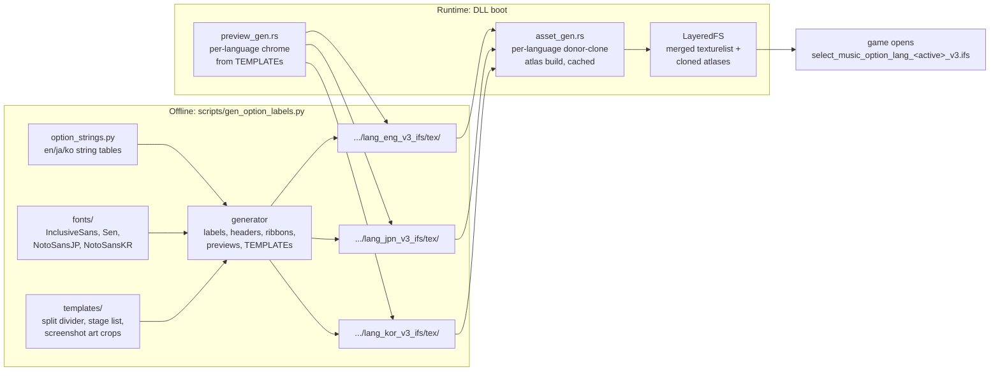

# Detailed Design: Options Texture Localization (JPN/KOR)

Status: Approved 2026-08-17 (maintainer). Translation tables in Appendix A
approved as-shipped content, with a native-speaker review pass planned as a
later follow-up — string edits after that pass are a regenerate-and-redeploy,
no design change.

## Overview

The DDR World Universal Modpack injects custom option rows into the game's
native options menu. Every visible piece of text on those rows is a pre-baked
PNG texture served through LayeredFS and composited into the game's
language-specific options IFS (`select_music_option_lang_<code>_v3.ifs`) by a
donor-clone atlas pipeline at boot. Today only English textures exist, and the
DLL's atlas pipeline is hardcoded to the `eng` IFS — a player who sets the
game to Japanese or Korean gets blank labels on the MODS tab.

This feature:

1. **Unifies texture generation.** A minority of the English textures were
   hand-authored in Photoshop and cannot currently be regenerated. Their baked
   image elements are extracted into committed template assets, and their text
   is taken over by the generation script, so every texture the modpack ships
   is produced by `scripts/gen_option_labels.py`.
2. **Localizes to Japanese and Korean.** The script grows per-language string
   tables (agent-authored translations, reviewed by the maintainer) and CJK
   fonts, and emits complete texture sets for `eng`, `jpn`, and `kor` into
   their per-language `data_mods` folders.
3. **Makes the DLL language-complete.** The donor-clone atlas build and the
   runtime preview-chrome generation are parameterized over the three
   languages, so whichever language a player selects, the injected rows render
   fully.

## Detailed Requirements

Consolidated from the accepted decision register:

- **R1 (D1):** The DLL builds injected-texture atlases for all three languages
  (`eng`, `jpn`, `kor`) unconditionally at init. The build for each language
  reads that language's stock ARC and mod folder. Runtime behavior is
  otherwise unchanged — the game itself decides which language IFS it opens.
- **R2 (D9):** Per-language failure is non-fatal: a missing stock ARC, donor
  texture, or mod folder for one language logs one WARN and skips that
  language; the other languages and all other mods are unaffected.
- **R3 (D5):** All hand-authored textures become script-generated. Baked
  image art (stage-list column, gameplay screenshots) is extracted once into
  committed template PNGs and composited by the script at the original
  coordinates. Regenerated English textures must reproduce the shipped
  originals' layout (same line breaks, same baselines); byte-identity is not
  required.
- **R4 (D6):** The nine `seop_image_customize_*_TEMPLATE.png` chrome templates
  are script-generated per language from one shared geometry table. Marker
  rectangles (solid green `#00FF00FF`, and red `#FF0000FF` where present) are
  byte-identical in position, size, and color across all three languages.
- **R5 (D4):** Translated: row labels, header labels, value ribbons, preview
  panels, customize templates. Copied verbatim into each language folder:
  `seop_return.png` (icon, no text) and `seop_tab_title_mods.png` (the Latin
  "Modpack" brand wordmark).
- **R6 (D3):** CJK text renders with Noto Sans JP / Noto Sans KR (SIL OFL 1.1,
  committed to the repo): weight 600 for labels, headers, and ribbons; weight
  500 for preview body copy. Latin text keeps the existing Inclusive Sans
  SemiBold / Sen SemiBold fonts.
- **R7 (D7):** All display strings live in a data-only module
  `scripts/option_strings.py`, keyed by texture id with `en`/`ja`/`ko`
  entries. The generator loops languages.
- **R8 (D8):** Translation style follows the stock game's own conventions
  (verified against the stock jpn/kor IFS art): labels fully translated,
  ON/OFF and technical terms (CSV, P1/P2, %, kg) kept Latin, Arabic numerals,
  polite です/ます Japanese and -ㅂ니다 Korean body copy.
- **R9 (D10):** Overlong rendered strings condense horizontally (existing
  LANCZOS x-squeeze), identical for all languages. Layout metrics (canvas
  sizes, baselines, line pitch) are shared across languages — verified
  against the stock game, which does the same.
- **R10 (D11):** All three generated texture sets are committed under
  `data_mods/custom_options/select_music_option_lang_{eng,jpn,kor}_v3_ifs/tex/`.
- **R11 (D12, scope):** Out of scope: folder/series expansion textures (their
  own lang constants), the DLL-rendered mod overlay menu text, any runtime
  language detection, and stock-texture replacements beyond `seop_return`.
- **R12:** Japanese line breaking must not split prohibited character
  sequences (kinsoku shori): lines may not start with closing punctuation
  (。、」』）ー small kana, etc.) nor end with opening brackets. Korean wraps
  on spaces like English.

Assumptions:

- The stock donors (`seop_item_appearance`, `seop_op_on`,
  `seop_image_scroll_speed`, `seop_tab_title_basic`) exist in all three
  language IFSes with identical dimensions — **verified** against the
  maintainer's game data.
- The game only ever opens the active language's options IFS, so tripling the
  injected languages does not change per-scene texture-open cost.

## Architecture Overview

Two halves: an **offline generation pipeline** (Python, developer-run) and the
**runtime injection pipeline** (DLL, boot-time). The runtime side already
exists and is parameterized over language; the offline side is where most of
the new work lives.



Key structural points:

- **Texture names are language-independent** (`seop_item_autoplay` is the same
  name in every language IFS — only the pixel content differs). Option
  registration in the DLL is untouched; only the atlas materialization loops.
- **The game picks the language.** The DLL never needs to know the active
  language: it prepares all three IFSes' injections, and the game's own
  package loading opens exactly one of them.
- **Marker-rect geometry is language-invariant** (R4), so the runtime marker
  parsing (`marker_rect_for`) can keep a single geometry source.

## Components and Interfaces

### 1. `scripts/option_strings.py` (new)

Data-only module; no Pillow imports. Structure:

```python
Lang = str  # "en" | "ja" | "ko"

LABELS: dict[str, dict[Lang, str]]        # option_id -> per-lang label text
HEADER_LABELS: dict[str, dict[Lang, str]] # header id -> per-lang text
RIBBONS: dict[str, dict[Lang, str]]       # ribbon key -> per-lang text
PREVIEWS: list[PreviewSpec]               # see Data Models
TEMPLATES: dict[str, TemplateSpec]        # customize id -> geometry + per-lang text
```

Ordering of the existing English lists is preserved (they move here
unchanged); the full translation content is in Appendix A.

### 2. `scripts/gen_option_labels.py` (reworked)

- **Language loop.** `LANGS = [("en", "eng"), ("ja", "jpn"), ("ko", "kor")]`
  (string-table key, IFS path code). `OUT_DIR` becomes
  `out_dir(ifs_code)` → `data_mods/custom_options/select_music_option_lang_{code}_v3_ifs/tex`.
  A `--lang` CLI flag optionally restricts generation to one language.
- **Font selection.** A `FontSet` per language:
  - `en`: Inclusive Sans SemiBold (labels/headers/ribbons), Sen SemiBold
    (preview body) — unchanged sizes.
  - `ja`: Noto Sans JP w600 @16 / w600 @11.2 (headers) / w500 @13.5 (body).
  - `ko`: Noto Sans KR, same weights/sizes.
  Noto files are the variable-font TTFs (`NotoSansJP[wght].ttf`,
  `NotoSansKR[wght].ttf`) committed to `scripts/fonts/`; weight applied via
  `ImageFont.set_variation_by_axes`.
- **CJK-aware wrapping** (R12). `wrap_paragraph` gains a tokenizer that emits
  break units: whitespace-delimited words for Latin/Korean, single characters
  for CJK runs, then merges units to respect kinsoku sets
  (`NO_BREAK_BEFORE = "。、）」』！？ーぁぃぅぇぉっゃゅょァィゥェォッャュョ…・：；％"`,
  `NO_BREAK_AFTER = "（「『"`). Greedy fill against the same pen/right-edge
  arithmetic as today; the first-line indent applies to `en` and both CJK
  languages alike (stock JP/KR panels indent the first line the same way).
- **New texture families generated:**
  - *Hand-authored preview take-overs* — `autoplay_{on,off}` (text only),
    `premium_free_{on,off}`, `center_arrows_1p_{on,off}`,
    `customize_movie_size_{on,off,fullscreen}` (SPLIT text + art composite).
    Art comes from `scripts/templates/` crops pasted at recorded coordinates
    (see Data Models); text renders per language.
  - *Customize TEMPLATEs* — all nine `seop_image_customize_*_TEMPLATE.png`,
    rendered per language: split divider base + translated text +
    marker rect(s) drawn as exact solid RGBA fills at shared coordinates.
  - *Verbatim copies* — `seop_return.png` and `seop_tab_title_mods.png`
    copied from `scripts/templates/` masters into each language dir.
- **Layout metrics unchanged** for every family (R9).

### 3. `scripts/templates/` (extended)

New committed assets, extracted once from the shipped hand-authored PNGs:

| Asset | Source crop | Used by |
|---|---|---|
| `premium_free_on_art.png`, `premium_free_off_art.png` | right-of-divider ink of the shipped panels | premium_free previews |
| `center_arrows_1p_on_art.png`, `center_arrows_1p_off_art.png` | screenshot region | center_arrows previews |
| `movie_size_on_art.png`, `movie_size_off_art.png`, `movie_size_fullscreen_art.png` | screenshot region | movie_size previews |
| `seop_return_master.png` | verbatim copy of shipped `seop_return.png` | per-lang copy |
| `seop_tab_title_mods_master.png` | verbatim copy of shipped wordmark | per-lang copy |
| `seop_image_split_divider.png` | (already exists) | SPLIT previews + TEMPLATEs |

The extraction is a one-time act performed during implementation (bounding-box
crop of ink right of the divider, x ≥ 186); each crop's paste position is
recorded in the geometry table. The extraction commands are kept as a comment
or small helper in the generator for provenance, but the committed PNGs are
the source of truth thereafter.

### 4. `src/services/custom_options/asset_gen.rs` (parameterized)

The four eng constants become a language table:

```rust
struct OptionLang {
    ifs_code: &'static str,      // "eng" | "jpn" | "kor"
    arc_path: &'static str,      // data/arc/bm2d/select_music_option_lang_<code>_v3.arc
    ifs_name: &'static str,      // select_music_option_lang_<code>_v3.ifs
    ifs_mod_path: &'static str,  // select_music_option_lang_<code>_v3_ifs
    atlas_prefix: &'static str,  // copt_mods_lang_<code>
}
const OPTION_LANGS: [OptionLang; 3] = [ /* eng, jpn, kor */ ];
```

`flush_label_atlas` iterates `OPTION_LANGS`; each iteration is the existing
body with the constants swapped: load that language's stock texturelist from
its ARC, source PNGs from that language's mod folder, clone donors, emit that
language's `texturelist.merged.xml` + cached atlases. The fresh preview-atlas
prefix also becomes language-distinct (`copt_prev_<code>_NNN`) so atlas
texture names can never collide across language packages.

Failure isolation (R2): each language iteration runs to completion or logs one
`log_warn!` and continues to the next; `eng` failing does not stop `jpn`/`kor`
and vice versa. The existing atlas disk cache keys on content hashes and gains
the language code in its cache filenames (via the distinct atlas prefixes),
so warm boots stay cheap.

`generate_static_tab_assets` (base, non-language IFS) is untouched.

### 5. `src/mods/webui_options/preview_gen.rs` (parameterized)

- `PREVIEW_OUT_DIR` → `preview_dir(ifs_code)`.
- `generate_chrome(option_id)` loops the three language dirs: for each, load
  that language's `seop_image_<id>_TEMPLATE.png`, clear markers, write that
  language's `seop_image_<id>.png` (existing skip-if-exists per file).
  A missing template in one language dir logs once and skips that language
  (fail-open, R2).
- `marker_rect_for(option_id)` keeps a single geometry source: it reads the
  `eng` template first and falls back to `jpn`/`kor` if `eng` is missing.
  Geometry is language-invariant by construction (R4), so any hit is
  authoritative.

`preview_overlay.rs` / `bg_preview_overlay.rs` consume `marker_rect_for` and
are unchanged.

### 6. Unchanged surfaces

- Option registration (`custom_options/mod.rs`, `api.rs`) — names only.
- `filter_hook.rs` — binds `seop_tab_title_mods` / `seop_return` by name;
  works in any language once the names exist in the loaded atlas.
- LayeredFS — already language-generic.
- `generate_static_tab_assets` (tab icon in the base IFS).

## Data Models

### String-table entry (option_strings.py)

```python
class PreviewSpec(NamedTuple):
    option: str                  # option id
    value: Optional[str]         # value key or None (fallback panel)
    layout: str                  # WIDE | SPLIT
    art: Optional[str]           # templates/ art filename for SPLIT panels
    art_pos: Optional[tuple]     # (x, y) paste position
    paragraphs: dict[Lang, list[str]]   # per-language body copy

class TemplateSpec(NamedTuple):
    option: str                  # customize option id
    markers: list[Marker]        # [(x, y, w, h, rgba)] — green box; appeal_board also has a red box
    paragraphs: dict[Lang, list[str]]   # baked chrome copy (text-left region)
```

Marker coordinates are measured once from the shipped English templates during
implementation and become the single source for all three languages.

### Generated file inventory (per language dir)

| Family | Count | Name pattern | Canvas |
|---|---|---|---|
| Row labels | 33 | `seop_item_<id>.png` | 176x16 |
| Header labels | 4 | `seop_item_header_*.png` | 352x16 |
| Value ribbons | 4 | `seop_op_<key>.png` | 132x24 |
| Preview panels | 39 | `seop_image_<id>[_<value>].png` | 368x172 |
| Customize TEMPLATEs | 9 | `seop_image_customize_*_TEMPLATE.png` | 368x172 |
| Verbatim copies | 2 | `seop_return.png`, `seop_tab_title_mods.png` | 72x36, 124x30 |

Total ≈ 91 files × 3 languages. The 39 preview panels are the current 30
script-generated ones plus the 9 hand-authored take-overs.

### DLL language table

See `OptionLang` above. All five per-language strings derive mechanically from
the ifs code; the table is written out longhand (three const entries) rather
than string-formatted at runtime, keeping the constants greppable.

## Error Handling

| Failure | Behavior |
|---|---|
| Stock ARC for a language missing on the cabinet | `flush_label_atlas` logs one WARN for that language, skips it; other languages proceed. The game in that language shows the pre-existing (blank-label) behavior. |
| Donor texture missing from a language's stock texturelist | Same per-language WARN + skip. |
| Mod folder for a language missing from `data_mods` | Same per-language WARN + skip (operator deleted a folder). |
| A single PNG missing within a language folder | Existing per-texture behavior: that entry is skipped with a log line; the rest of the language's atlas builds. |
| `_TEMPLATE.png` missing for a language in `generate_chrome` | Chrome for that language skipped with one log line; `marker_rect_for` falls back across languages. |
| Script: translation entry missing for a language | Generator fails that texture with a printed error and continues (exit code non-zero at the end), so a partial table can't silently ship a blank texture. |
| Script: rendered line overflows panel | Existing warning path (printed per line), unchanged. |
| Script: CJK text condensed | Existing `(condensed)` console note per file, unchanged. |

## Testing Strategy

1. **English regression (script).** Regenerate `eng` and compare against the
   shipped textures: for the take-over panels, assert identical text-line
   band structure (ink-row bands per line, as measured during research) and
   identical art bounding boxes; for already-generated families, diffs should
   be limited to antialiasing noise. Visual side-by-side sheet for the
   maintainer.
2. **Marker invariance (script).** Automated check: for each customize
   template, the marker pixels are exactly equal across the three generated
   language files.
3. **Wrap correctness (script).** Unit-style asserts in the generator run:
   no JA line starts with a `NO_BREAK_BEFORE` character; no line overflows
   its right edge (existing warning becomes a hard failure for CJK).
4. **DLL build.** `cargo check` → `cargo fmt` → `./build.sh` per the repo's
   readiness gates.
5. **Cabinet validation** (the project's real test harness):
   - English session first — full MODS tab regression (labels, ribbons,
     previews, WebUI preview overlays, tab title, return icon).
   - Japanese and Korean sessions (per-user language selection): every row
     label, header, ribbon, preview panel, and the customize preview chrome
     render; WebUI art overlays land inside the preview boxes (marker
     parsing); boot log shows three atlas builds (and cache hits on warm
     boot).
   - Boot-time check: cold-boot atlas regeneration time acceptable; warm
     boot unchanged.

## Appendix A — Translation Tables

Latin terms deliberately retained everywhere: ON / OFF / CSV / P1 / P2 / %,
kg, s(econds are translated to 秒/초), STEP ZONE (stock DDR keeps it Latin in
JP; Korean stock uses 스텝존 — followed here), product-ish mode names
(OVERHEAD/HALLWAY/DISTANT transliterated as katakana/hangul).

### A.1 Row labels (`seop_item_<id>`)

| id | en | ja | ko |
|---|---|---|---|
| autoplay | AUTOPLAY | オートプレイ | 자동 플레이 |
| premium_free | PREMIUM FREE | プレミアムフリー | 프리미엄 프리 |
| center_arrows_1p | CENTER ARROWS (1P ONLY) | 矢印を中央に表示 (1P専用) | 화살표 중앙 표시 (1P 전용) |
| assist_tick | ASSIST TICK | アシストティック | 어시스트 틱 |
| assist_tick_volume | TICK EFFECT VOLUME (%) | ティック音量 (%) | 틱 효과음 볼륨 (%) |
| announcer_mute | ANNOUNCER MUTE | アナウンスミュート | 아나운서 음소거 |
| timing_stats | REALTIME GAMEPLAY STATISTICS | リアルタイムプレイ統計 | 실시간 플레이 통계 |
| pacemaker_to_mserror | PACEMAKER -> MS ERROR | ペースメーカー→ms誤差 | 페이스메이커 → ms 오차 |
| pacemaker_threshold | WHITE THRESHOLD | 白表示のしきい値 | 흰색 표시 임계값 |
| step_data_export | EXPORT STEP DATA (CSV) | ステップデータ出力 (CSV) | 스텝 데이터 내보내기 (CSV) |
| customize_appeal_board | APPEAL BOARD | アピールボード | 어필 보드 |
| customize_background | BACKGROUND | 背景 | 배경 |
| customize_background_gameplay | BACKGROUND (GAMEPLAY) | 背景 (プレイ中) | 배경 (게임 플레이) |
| customize_character_p1 | CHARACTER (P1) | キャラクター (P1) | 캐릭터 (P1) |
| customize_character_p2 | CHARACTER (P2) | キャラクター (P2) | 캐릭터 (P2) |
| customize_lane_single | LANE (SINGLE) | レーン (シングル) | 레인 (싱글) |
| customize_lane_double | LANE (DOUBLE) | レーン (ダブル) | 레인 (더블) |
| customize_lanecover_single | LANE COVER (SINGLE) | レーンカバー (シングル) | 레인 커버 (싱글) |
| customize_lanecover_double | LANE COVER (DOUBLE) | レーンカバー (ダブル) | 레인 커버 (더블) |
| customize_movie_size | VIDEO SIZE | ムービーサイズ | 동영상 크기 |
| is_disp_weight | DISPLAY BURNED CALORIES | 消費カロリー表示 | 소모 칼로리 표시 |
| weight | PLAYER WEIGHT (KG) | 体重 (kg) | 체중 (kg) |
| overlay_scale | OVERLAY SCALE | オーバーレイサイズ | 오버레이 크기 |
| overlay_opacity | OVERLAY OPACITY | オーバーレイ不透明度 | 오버레이 불투명도 |
| arrow_scale | ARROW SCALE | 矢印サイズ | 화살표 크기 |
| arrow_opacity | ARROW OPACITY | 矢印不透明度 | 화살표 불투명도 |
| perspective | PERSPECTIVE | 視点 | 시점 |
| song_speed | SONG PLAYBACK SPEED (%) | 曲の再生速度 (%) | 곡 재생 속도 (%) |
| preserve_pitch | PRESERVE SONG PITCH | 曲のピッチを保持 | 곡 피치 유지 |
| training_start_time | SONG START TIME (s) | 曲の開始時間 (秒) | 곡 시작 시간 (초) |
| training_end_time | SONG END TIME (s) | 曲の終了時間 (秒) | 곡 종료 시간 (초) |
| training_loop_song | LOOP SONG | 曲をループ | 곡 반복 |
| training_progress_pos | TIMELINE PLACEMENT | タイムライン表示位置 | 타임라인 표시 위치 |

### A.2 Header labels (`seop_item_header_*`)

| id | en | ja | ko |
|---|---|---|---|
| header_power_user_options | POWER USER OPTIONS | パワーユーザー設定 | 파워 유저 설정 |
| header_playfield_styling_options | PLAYFIELD STYLING OPTIONS | プレイフィールド表示設定 | 플레이필드 표시 설정 |
| header_training_options | TRAINING OPTIONS | トレーニング設定 | 트레이닝 설정 |
| header_profile_customization_options | PROFILE CUSTOMIZATION OPTIONS | プロフィールカスタマイズ設定 | 프로필 커스터마이즈 설정 |

### A.3 Value ribbons (`seop_op_<key>`)

| key | en | ja | ko |
|---|---|---|---|
| fullscreen | FULL SCREEN | フルスクリーン | 전체 화면 |
| overhead | OVERHEAD | オーバーヘッド | 오버헤드 |
| hallway | HALLWAY | ホールウェイ | 홀웨이 |
| distant | DISTANT | ディスタント | 디스턴트 |

### A.4 Preview panels (`seop_image_*`) — body copy

Each cell lists the paragraphs (¶-separated). ON:/OFF: value prefixes stay
Latin.

**Hand-authored take-overs**

| panel | en | ja | ko |
|---|---|---|---|
| autoplay_on | Every arrow reaches the STEP ZONE with a rating of MARVELOUS, regardless of player input. ¶ But, resulting scores will not be saved while this option is ON. | プレイヤーの入力に関係なく、すべての矢印がMARVELOUS判定でSTEP ZONEに到達します。 ¶ ただし、この設定がONの間はスコアが保存されません。 | 플레이어의 입력과 관계없이 모든 화살표가 MARVELOUS 판정으로 스텝존에 도달합니다. ¶ 단, 이 설정이 ON인 동안에는 스코어가 저장되지 않습니다. |
| autoplay_off | Standard gameplay. | 通常のプレイです。 | 일반 플레이입니다. |
| premium_free_on | Changes the play stage progression. ¶ ON: Play stage does not progress after every song played. | プレイステージの進行を変更します。 ¶ ON: 曲をプレイしてもステージが進みません。 | 플레이 스테이지 진행을 변경합니다. ¶ ON: 곡을 플레이해도 스테이지가 진행되지 않습니다. |
| premium_free_off | Changes the play stage progression. ¶ OFF: Play stage progresses after every song played, up to FINAL STAGE (EXTRA STAGE if requirements met). | プレイステージの進行を変更します。 ¶ OFF: 曲をプレイするたびにステージが進み、FINAL STAGEまで続きます (条件を満たすとEXTRA STAGE)。 | 플레이 스테이지 진행을 변경합니다. ¶ OFF: 곡을 플레이할 때마다 스테이지가 진행되어 FINAL STAGE까지 이어집니다 (조건 충족 시 EXTRA STAGE). |
| center_arrows_1p_on | ON: During SINGLE STYLE play, lane appears in the center of the screen. | ON: シングルプレイ時、レーンが画面中央に表示されます。 | ON: 싱글 플레이 시 레인이 화면 중앙에 표시됩니다. |
| center_arrows_1p_off | OFF: During SINGLE STYLE play, lane appears in default position. | OFF: シングルプレイ時、レーンが通常の位置に表示されます。 | OFF: 싱글 플레이 시 레인이 기본 위치에 표시됩니다. |
| customize_movie_size_on | Changes the display of song movies. ¶ ON: Song movies appear in a window during play. | 曲のムービー表示を変更します。 ¶ ON: プレイ中、ムービーがウィンドウ表示されます。 | 곡 동영상 표시를 변경합니다. ¶ ON: 플레이 중 동영상이 창 크기로 표시됩니다. |
| customize_movie_size_off | Changes the display of song movies. ¶ OFF: Song movies are not shown. | 曲のムービー表示を変更します。 ¶ OFF: ムービーは表示されません。 | 곡 동영상 표시를 변경합니다. ¶ OFF: 동영상이 표시되지 않습니다. |
| customize_movie_size_fullscreen | Changes the display of song movies. ¶ FULL SCREEN: Song movies fill entire background during play. Certain customization is not shown. | 曲のムービー表示を変更します。 ¶ FULL SCREEN: プレイ中、ムービーが背景全体に表示されます。一部のカスタマイズは表示されません。 | 곡 동영상 표시를 변경합니다. ¶ FULL SCREEN: 플레이 중 동영상이 배경 전체에 표시됩니다. 일부 커스터마이즈는 표시되지 않습니다. |

**Script-generated panels**

| panel | en (abridged — unchanged from current script) | ja | ko |
|---|---|---|---|
| assist_tick_off | No assist sound is played during gameplay. | プレイ中、アシスト音は再生されません。 | 플레이 중 어시스트 사운드가 재생되지 않습니다. |
| assist_tick_on | A clap is played at every arrow in the chart… ¶ The clap follows the chart, not your steps… | 譜面のすべての矢印のタイミングに合わせてクラップ音を再生します。 ¶ クラップは譜面に追従するため、ミスをしても正確なタイミングを保ちます。 | 채보의 모든 화살표 타이밍에 맞춰 클랩 사운드를 재생합니다. ¶ 클랩은 채보를 따라가므로 스텝을 놓쳐도 정확한 박자를 유지합니다. |
| assist_tick_volume | Adjusts the volume of the clap sound… ¶ Less than 100% makes the clap quieter… | アシストティックのクラップ音量を調整します。 ¶ 100%未満で小さく、100%超で大きくなります。 | 어시스트 틱의 클랩 음량을 조정합니다. ¶ 100% 미만이면 작아지고, 100%를 넘으면 커집니다. |
| announcer_mute_off | Mutes the announcer voice during gameplay. ¶ OFF: Combo callouts, accolades and cheers play as usual. | プレイ中のアナウンス音声をミュートします。 ¶ OFF: コンボの掛け声や歓声は通常どおり再生されます。 | 플레이 중 아나운서 음성을 음소거합니다. ¶ OFF: 콤보 콜과 환호성이 평소대로 재생됩니다. |
| announcer_mute_on | Mutes the announcer voice during gameplay. ¶ ON: Combo callouts, accolades and cheers are silenced. In versus play, P1's choice wins. | プレイ中のアナウンス音声をミュートします。 ¶ ON: コンボの掛け声や歓声が消音されます。対戦プレイではP1の設定が優先されます。 | 플레이 중 아나운서 음성을 음소거합니다. ¶ ON: 콤보 콜과 환호성이 음소거됩니다. 대전 플레이에서는 P1의 설정이 우선됩니다. |
| timing_stats_off | Changes the display of realtime timing statistics. ¶ OFF: No statistics are shown during play. | リアルタイム統計の表示を変更します。 ¶ OFF: プレイ中に統計は表示されません。 | 실시간 통계 표시를 변경합니다. ¶ OFF: 플레이 중 통계가 표시되지 않습니다. |
| timing_stats_on | …ON: Timing error, EX loss and calories burned are shown beside each lane. | リアルタイム統計の表示を変更します。 ¶ ON: タイミング誤差・EXロス・消費カロリーがレーン横に表示されます。 | 실시간 통계 표시를 변경합니다. ¶ ON: 타이밍 오차, EX 손실, 소모 칼로리가 레인 옆에 표시됩니다. |
| pacemaker_to_mserror_off | Changes what the pacemaker displays. ¶ OFF: The pacemaker shows the usual score difference. | ペースメーカーの表示内容を変更します。 ¶ OFF: 通常どおりスコア差を表示します。 | 페이스메이커 표시 내용을 변경합니다. ¶ OFF: 평소대로 스코어 차이를 표시합니다. |
| pacemaker_to_mserror_on | …ON: The pacemaker shows how early or late your last step was, in milliseconds. | ペースメーカーの表示内容を変更します。 ¶ ON: 直前のステップの早い/遅いをミリ秒で表示します。 | 페이스메이커 표시 내용을 변경합니다. ¶ ON: 마지막 스텝이 얼마나 빠르거나 늦었는지 밀리초로 표시합니다. |
| pacemaker_threshold | Sets how close to perfect a step must be for the pacemaker reading to turn white. ¶ Larger values widen the white zone. | ペースメーカーの表示が白くなる判定精度を設定します。 ¶ 値を大きくすると白表示の範囲が広がります。 | 페이스메이커 표시가 흰색이 되는 판정 정밀도를 설정합니다. ¶ 값이 클수록 흰색 표시 범위가 넓어집니다. |
| step_data_export_off | Changes whether the timing of every step is saved to disk after each song. ¶ OFF: No file is written. | 各ステップのタイミングを曲ごとに保存するかを変更します。 ¶ OFF: ファイルは作成されません。 | 매 스텝의 타이밍을 곡마다 저장할지 변경합니다. ¶ OFF: 파일이 생성되지 않습니다. |
| step_data_export_on | …ON: A CSV file is written to the step_data_exports folder at the end of each song. | 各ステップのタイミングを曲ごとに保存するかを変更します。 ¶ ON: 曲の終了時にCSVファイルがstep_data_exportsフォルダに保存されます。 | 매 스텝의 타이밍을 곡마다 저장할지 변경합니다. ¶ ON: 곡이 끝나면 CSV 파일이 step_data_exports 폴더에 저장됩니다. |
| is_disp_weight_off | Changes the display of calories burned. ¶ OFF: Calories are not shown. | 消費カロリーの表示を変更します。 ¶ OFF: カロリーは表示されません。 | 소모 칼로리 표시를 변경합니다. ¶ OFF: 칼로리가 표시되지 않습니다. |
| is_disp_weight_on | …ON: Calories are shown, estimated from the weight set below. | 消費カロリーの表示を変更します。 ¶ ON: 下で設定した体重をもとに推定したカロリーを表示します。 | 소모 칼로리 표시를 변경합니다. ¶ ON: 아래에서 설정한 체중을 바탕으로 추정한 칼로리를 표시합니다. |
| weight | Sets your body weight, in kilograms. ¶ Used to estimate the calories burned while you play. This is saved to your profile. | 体重をkg単位で設定します。 ¶ プレイ中の消費カロリーの推定に使用され、プロフィールに保存されます。 | 체중을 kg 단위로 설정합니다. ¶ 플레이 중 소모 칼로리 추정에 사용되며 프로필에 저장됩니다. |
| overlay_scale | Changes the size of the combo counter, judgement text and pacemaker. ¶ Applies from the next song. | コンボ数・判定表示・ペースメーカーのサイズを変更します。 ¶ 次の曲から適用されます。 | 콤보 카운터, 판정 표시, 페이스메이커의 크기를 변경합니다. ¶ 다음 곡부터 적용됩니다. |
| overlay_opacity | Changes how solid the combo counter, judgement text and pacemaker appear. ¶ 0% hides them entirely. | コンボ数・判定表示・ペースメーカーの不透明度を変更します。 ¶ 0%で完全に非表示になります。 | 콤보 카운터, 판정 표시, 페이스메이커의 불투명도를 변경합니다. ¶ 0%로 설정하면 완전히 숨겨집니다. |
| arrow_scale | Changes the size of the arrows, STEP ZONE and guidelines. ¶ The lane shrinks around the STEP ZONE. Timing and scoring are not affected. | 矢印・STEP ZONE・ガイドラインのサイズを変更します。 ¶ レーンはSTEP ZONEを中心に縮小されます。判定やスコアには影響しません。 | 화살표, 스텝존, 가이드라인의 크기를 변경합니다. ¶ 레인은 스텝존을 중심으로 축소됩니다. 판정과 스코어에는 영향이 없습니다. |
| arrow_opacity | Changes how solid the arrows, STEP ZONE and guidelines appear. ¶ 0% hides them entirely. Timing and scoring are not affected. | 矢印・STEP ZONE・ガイドラインの不透明度を変更します。 ¶ 0%で完全に非表示になります。判定やスコアには影響しません。 | 화살표, 스텝존, 가이드라인의 불투명도를 변경합니다. ¶ 0%로 설정하면 완전히 숨겨집니다. 판정과 스코어에는 영향이 없습니다. |
| perspective_overhead | Arrows scroll at a constant size, in the standard flat view. | 矢印は一定のサイズのまま、標準の平面ビューでスクロールします。 | 화살표가 일정한 크기로 표준 평면 뷰에서 스크롤됩니다. |
| perspective_hallway | Arrows scroll in from a vanishing point, growing as they approach the STEP ZONE. | 矢印は消失点から現れ、STEP ZONEに近づくにつれて大きくなります。 | 화살표가 소실점에서 나타나 스텝존에 가까워질수록 커집니다. |
| perspective_distant | Arrows start large and shrink as they approach the STEP ZONE, which sits toward the horizon. | 矢印は大きく現れ、奥にあるSTEP ZONEに近づくにつれて小さくなります。 | 화살표가 크게 나타나 안쪽에 있는 스텝존에 가까워질수록 작아집니다. |
| song_speed | Adjusts the rate at which the song will be played during gameplay. ¶ Less than 100% slows the song down. Greater than 100% speeds the song up. | プレイ中の曲の再生速度を調整します。 ¶ 100%未満で遅く、100%超で速くなります。 | 플레이 중 곡의 재생 속도를 조정합니다. ¶ 100% 미만이면 느려지고, 100%를 넘으면 빨라집니다. |
| preserve_pitch_off | Decides whether the song's pitch should be preserved when the playback speed is adjusted. ¶ OFF: The song's pitch falls or rises with the playback speed, like a record player. | 再生速度を変更したときに曲のピッチを保持するかを設定します。 ¶ OFF: レコードのように、再生速度に合わせてピッチが上下します。 | 재생 속도를 변경할 때 곡의 피치를 유지할지 설정합니다. ¶ OFF: 레코드판처럼 재생 속도에 따라 피치가 오르내립니다. |
| preserve_pitch_on | …ON: The song keeps its original pitch at any playback speed. | 再生速度を変更したときに曲のピッチを保持するかを設定します。 ¶ ON: どの再生速度でも元のピッチを保ちます。 | 재생 속도를 변경할 때 곡의 피치를 유지할지 설정합니다. ¶ ON: 어떤 재생 속도에서도 원래 피치를 유지합니다. |
| training_start_time | Starts the song at the chosen timestamp, in seconds… ¶ Practice a later section without playing through the beginning. Resets when you card in. | 指定した時間 (秒) から曲を開始します。矢印は自然にスクロールインします。 ¶ 序盤をプレイせずに後半を練習できます。カードイン時にリセットされます。 | 지정한 시간 (초) 부터 곡을 시작합니다. 화살표는 자연스럽게 스크롤되어 들어옵니다. ¶ 앞부분을 플레이하지 않고 뒷부분을 연습할 수 있습니다. 카드 인 시 초기화됩니다. |
| training_end_time | Ends the song at the chosen timestamp, in seconds… ¶ Practice a section without playing through the ending. Resets when you card in. | 指定した時間 (秒) で曲を終了します。曲の長さ以上の値では最後までプレイします。 ¶ 終盤をプレイせずに途中の区間を練習できます。カードイン時にリセットされます。 | 지정한 시간 (초) 에서 곡을 종료합니다. 곡 길이 이상의 값이면 끝까지 플레이합니다. ¶ 뒷부분을 플레이하지 않고 구간을 연습할 수 있습니다. 카드 인 시 초기화됩니다. |
| training_loop_song_off | Decides whether the chosen song section repeats until you stop playing. ¶ OFF: Reaching the section end finishes the song normally, with results for the part you played. | 選択した区間を繰り返すかを設定します。 ¶ OFF: 区間の終わりに達すると通常どおり曲が終了し、プレイした部分のリザルトが表示されます。 | 선택한 구간을 반복할지 설정합니다. ¶ OFF: 구간 끝에 도달하면 곡이 정상적으로 종료되고, 플레이한 부분의 결과가 표시됩니다. |
| training_loop_song_on | …ON: The section restarts each time its end is reached. Press 3 three times to give up, or 1 three times to restart. | 選択した区間を繰り返すかを設定します。 ¶ ON: 区間の終わりに達するたびに再スタートします。3を3回押すと終了、1を3回押すとリスタートします。 | 선택한 구간을 반복할지 설정합니다. ¶ ON: 구간 끝에 도달할 때마다 다시 시작됩니다. 3을 세 번 누르면 포기, 1을 세 번 누르면 재시작합니다. |
| training_progress_pos | Shows the song timeline during play on the chosen edge of the screen. OFF hides it. ¶ The timeline draws the whole chart with your position, section markers, and per-measure lines. Follows your card. | プレイ中、画面の選択した端にタイムラインを表示します。OFFで非表示になります。 ¶ タイムラインには譜面全体・現在位置・区間マーカー・小節線が表示されます。カードに保存されます。 | 플레이 중 화면의 선택한 가장자리에 타임라인을 표시합니다. OFF면 숨겨집니다. ¶ 타임라인에는 전체 채보, 현재 위치, 구간 마커, 마디선이 표시됩니다. 카드에 저장됩니다. |

### A.5 Customize TEMPLATE chrome copy

| template | en | ja | ko |
|---|---|---|---|
| customize_appeal_board | Sets the appeal board appearance. | アピールボードの外観を設定します。 | 어필 보드의 모양을 설정합니다. |
| customize_background | Changes the background of menus. | メニュー画面の背景を変更します。 | 메뉴 화면의 배경을 변경합니다. |
| customize_background_gameplay | Changes the background during gameplay. | プレイ中の背景を変更します。 | 플레이 중 배경을 변경합니다. |
| customize_character_p1 | Changes the character illustration on the left side of the screen. | 画面左側のキャラクターイラストを変更します。 | 화면 왼쪽의 캐릭터 일러스트를 변경합니다. |
| customize_character_p2 | Changes the character illustration on the right side of the screen. *(shipped English says "left" — a pre-existing copy typo, corrected in all three languages during take-over)* | 画面右側のキャラクターイラストを変更します。 | 화면 오른쪽의 캐릭터 일러스트를 변경합니다. |
| customize_lane_single | Changes the appearance of the lane, for SINGLE STYLE. | レーンの外観を変更します (シングルプレイ用)。 | 레인의 모양을 변경합니다 (싱글 플레이용). |
| customize_lane_double | Changes the appearance of the lane, for DOUBLE STYLE. | レーンの外観を変更します (ダブルプレイ用)。 | 레인의 모양을 변경합니다 (더블 플레이용). |
| customize_lanecover_single | Changes the illustration used as the lane cover during gameplay, for SINGLE STYLE. | プレイ中のレーンカバーのイラストを変更します (シングルプレイ用)。 | 플레이 중 레인 커버 일러스트를 변경합니다 (싱글 플레이용). |
| customize_lanecover_double | Changes the illustration used as the lane cover during gameplay, for DOUBLE STYLE. | プレイ中のレーンカバーのイラストを変更します (ダブルプレイ用)。 | 플레이 중 레인 커버 일러스트를 변경합니다 (더블 플레이용). |

## Appendix B — Key research findings (inlined)

- **Game fonts carry no Hangul.** All 7 dumped Konami KBF fonts were parsed:
  ASCII + kana + ~6.7k kanji + fullwidth forms; zero Hangul glyphs in any
  block. The stock kor IFS instead ships an extra pre-rendered `seop_text`
  sheet. Noto Sans KR is the only viable Korean path; Noto Sans JP is used
  for Japanese for consistency (maintainer-approved after visual comparison).
- **Stock donors verified.** `seop_item_appearance` (176x16), `seop_op_on`
  (132x24), `seop_image_scroll_speed` (368x172), `seop_tab_title_basic`
  (124x30), `seop_return` (72x36) exist with identical dimensions in the
  stock eng/jpn/kor options IFSes of the maintainer's install; each IFS
  carries its own `texturelist.xml`.
- **Stock uses one layout metric set for all languages.** Measured text-band
  pitch in the stock `seop_image_scroll_speed` panel: 16 px line pitch in all
  three languages (paragraph gaps 25-26 px). CJK ink runs ~11 px tall within
  the same pitch as Latin caps.
- **Stock localization conventions** (basis for R8): labels fully translated
  (ARROW VISIBILITY → 矢印の見え方 / 화살표 표시 방식); ON/OFF ribbons stay
  Latin; Arabic numerals inline; polite body copy (です/ます, -ㅂ니다).
- **Scene-preload cost.** Scenes 18/21 preload only the active language's
  options package, so per-language injection does not multiply runtime
  texture-open cost; the boot-time atlas build is disk-cached.
