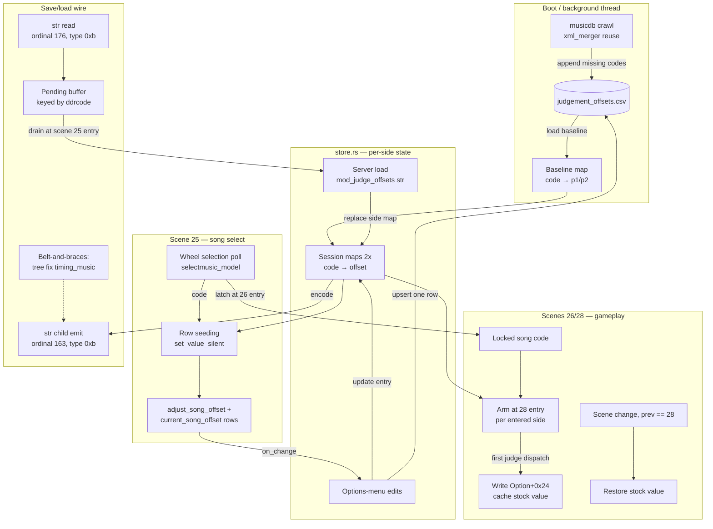
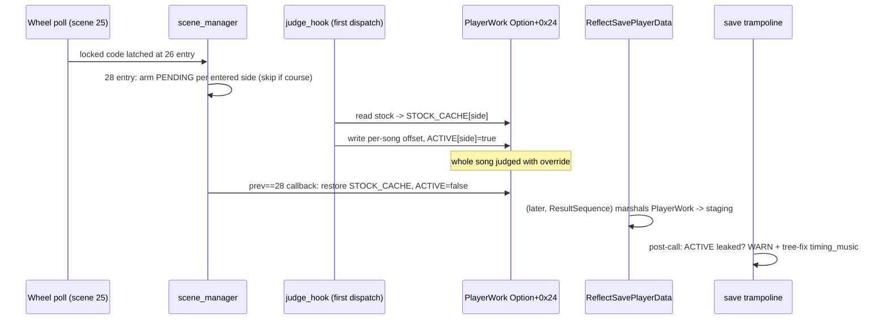

# Detailed Design: Per-Song Judgement Offsets

Status: Approved 2026-08-17 (amended 2026-08-18: requirement 8 superseded by D21 — maintainer-directed at deploy #3)

## Overview

DDR World's stock **JUDGEMENT OFFSET** option (`timing_music`) shifts the moment
notes are judged, but it is a single global value per profile. Songs are not
uniformly synced between chart and audio, so players maintain private per-song
offset lists and re-adjust the stock option between songs by hand.

This feature adds a new top-level mod, **Per-Song Judgement Offsets**
(mod id `per-song-judgement-offsets`), that:

- adds two rows to the in-game options menu — a parent toggle **ADJUST OFFSET
  FOR CURRENT SONG** and, when it is ON, a child scalar **CURRENT SONG OFFSET**
  (−100..+100 ms) — whose values track the song currently highlighted on the
  song wheel, per player side;
- during gameplay, overrides the player's stock judgement offset with the
  per-song value (when one is set for the played song), and **guarantees the
  override is never persisted** to the player's profile;
- persists offsets locally in a `judgement_offsets.csv` next to
  `mod-config.json`, and per-profile on the bemani-buddy server as a single
  encoded string field `mod_judge_offsets`;
- self-seeds the CSV at boot by crawling the game's merged musicdb (custom
  LayeredFS-injected songs included), appending newly-installed songs without
  touching existing rows;
- ships a one-time script that converts a community-maintained, mcode-keyed
  sync-offset list into a pre-seeded CSV committed to the repository.

## Detailed Requirements

### Functional

1. **Override semantics.** For each player side, if the played song has a
   stored offset, that value **replaces** the stock JUDGEMENT OFFSET for the
   duration of the song. A stored value of 0 is a valid override (distinct
   from "no override"). Songs without a stored offset use the stock value
   untouched.
2. **UI.** Two custom-options rows per side in the song-select options menu:
   - `adjust_song_offset` — bool toggle, label "ADJUST OFFSET FOR CURRENT
     SONG". ON iff the highlighted song has a stored offset for that side.
   - `current_song_offset` — scalar, label "CURRENT SONG OFFSET", range
     −100..+100, fine step 1, coarse step 10, visible only while the parent is
     ON (`ShowWhen::Equals`). Shows the stored value (default 0 when newly
     enabled).
   - As the wheel selection changes, both rows re-seed to the newly highlighted
     song's state without firing change callbacks.
   - Toggling the parent ON creates an entry (child's current value); toggling
     it OFF deletes the entry; editing the child updates the entry.
3. **Profile purity.** The stock JUDGEMENT OFFSET value as seen by the game's
   options menu and as persisted in every save (per-stage and logout) must
   always be the player's true stock value. The override may exist in game
   memory only between gameplay start and gameplay exit.
4. **Local persistence.** `judgement_offsets.csv` (CWD-relative, beside
   `mod-config.json`), three columns: `code,p1_offset,p2_offset`. Empty offset
   cell = no override for that side. Values clamped to ±100 on read.
5. **Boot-time seeding.** On each boot, crawl the merged musicdb (the same
   bytes the game parses, including custom songs merged in by LayeredFS) and
   append any basenames missing from the CSV with blank offsets. Existing rows
   are never modified or removed. If the CSV does not exist, it is created.
6. **Server persistence.** Each side's full offset map is saved to the player's
   profile as wire field `mod_judge_offsets`, a kbin `str` child of
   `/data/option` in every player-data save, encoded
   `code|offset|code|offset|...`. On profile load, the string replaces that
   side's in-memory map. Codes unknown to the local cabinet are preserved and
   round-tripped.
7. **Merge semantics (CSV vs server).** Per side:
   - Boot: in-memory *session map* = CSV column (the *baseline*).
   - Card-in with server data: session map **replaced** by the decoded server
     string. CSV untouched.
   - Card-in without server data (field absent) or offline/guest play: session
     map stays at CSV baseline.
   - Explicit edit in the options menu: updates session map **and** upserts
     that one song's CSV cell.
   - Card-out / new card-in: session map resets to CSV baseline before any new
     server data is applied.
8. **Course/nonstop mode:** no override (the wheel code identifies the course,
   not its songs); stock behavior applies.
9. **UI is mandatory:** if the option rows cannot be injected (row-injection /
   scalar machinery unavailable), the mod goes **fully inert** — no override,
   no persistence traffic, no crawl side effects beyond leaving the CSV as-is.
   One WARN explains why.
10. **One-time pre-seed tooling.** `scripts/gen_judgement_offsets_csv.py`
    reads a game install and a friend-provided mcode-keyed offsets file, maps
    mcode → basename via musicdb, and emits the CSV with P1 = P2 values.
    Lines with more than two fields use the first value and are reported.

### Non-functional

- All hook-path code panic-free; every failure degrades to stock behavior with
  a one-shot WARN.
- Zero new detours. Zero new AOB signatures (reuses `player_option_table`
  derivation and `selectmusic_model`).
- Client-side cap of 2000 encoded entries (≈26 KB, well under the server's
  64 KiB TEXT column).
- No new config keys; the mod is controlled by the `mods` enable map.

### Assumptions

- Song identity key is the musicdb `basename` (the same code string the
  song-wheel model exposes and `chart_length` keys on).
- The options-menu digit compositor renders `-` (the stock JUDGE TIMING row is
  ±100 through the same pipeline); verified on first cabinet deploy.
- Wheel selection cannot change while the options modal is open; the per-frame
  re-seed makes this a non-assumption in practice.

## Architecture Overview



### The override lifecycle (the safety-critical path)

The stock judgement offset lives at `ddr::player::Option+0x24`, and the Option
struct is inlined into PlayerWork at `+0xE0` (so the field is
`PlayerWork+0x104`). The game consumes it at judge-compare time inside
`judgeNotes` — not baked into note timestamps — so a write before the first
judge applies to the whole song.

The hazard: the game's save marshal (`ReflectSavePlayerData`) copies PlayerWork
— including this field — into ess's per-side staging buffer, and ess's
`sys_playerdata_save_sender` emits it as `<timing_music>` under `/data/option`
on **every** save kind (card-in, per-stage after every song, and logout). The
bemani-buddy server parses and stores it on all three. An override left in
memory at marshal time would permanently overwrite the player's stock setting.

Critically, the marshal runs **before** the DLL's save-sender trampoline (the
staging buffer is already populated when the trampoline reads `savekind` from
it), so a memory restore inside the trampoline is too late. The design
therefore uses two independent layers:

1. **Primary — scene-timed memory restore.** The per-stage save actor fires in
   ResultSequence (two scene transitions after gameplay). A `scene_manager`
   callback gated on **`prev == GAMEPLAY (28)`** — callbacks fire synchronously
   inside `createNextSequence`, before the next scene is even constructed —
   restores the cached stock value for any side with an active override. Gating
   on `prev` (not `next`) covers every exit shape: natural 28→29, quick-restart
   fast path 28→27, quick-fail fast path 28→24, and the redirected fallbacks
   (which rewrite `next` before callbacks fire). In-place restarts
   (`song_reset`) never leave scene 28 and correctly keep the override. A
   redundant sweep at SONG_SELECT entry restores-and-WARNs if an override
   somehow survived.
2. **Belt-and-braces — save-tree fix.** In the save-sender trampoline, after
   `original.call` builds the request tree: if any override is still marked
   active for the saving side (which layer 1 should have made impossible), WARN
   and rewrite `<timing_music>` in the built tree with the cached stock value
   using the already-resolved libavs property ordinals: find (162) → remove
   (164) → re-add (163, kbin type 6). This is the same mechanism the shipped
   `strip_league_node` uses. Fail-closed detail: if the fix itself fails, WARN
   loudly; the primary layer makes reaching this code a bug, not a data-loss
   event by design.



## Components and Interfaces

### DLL: new mod `src/mods/per_song_judgement_offsets/`

| File | Responsibility |
|------|----------------|
| `mod.rs` | `Mod` trait impl, lifecycle, option-row registration, scene callbacks (latch at 26 entry, arm at 28 entry, restore on `prev == 28`, sweep + pending-load drain notifications at 25 entry), judge_hook registration, wheel-selection poll via `input_manager::on_frame` |
| `store.rs` | Baseline map + two session maps behind a `Mutex`; merge operations (`reset_to_baseline(side)`, `apply_server_string(side, &str)`, `set_entry`, `clear_entry`, `lookup`), wire encode/decode, entry cap. Pure logic, host-testable |
| `csv.rs` | Hand-rolled CSV parse/serialize (`code,p1_offset,p2_offset`, CRLF-tolerant), whole-file read, ordered rewrite preserving unknown lines' order; append-only merge of new codes. Pure, host-testable |
| `bootstrap.rs` | Background thread: obtain merged musicdb → scan `<basename>` tags → append-merge into the CSV → load baseline into `store` → publish ready. Also hosts the coalesced background CSV writer (mpsc, latest-wins) used for edit upserts |

Key mechanics:

- **Wheel poll** (per frame, scene 25 only): the `selectmusic_model` global
  holds a pointer to the model; the highlighted-song weak_ptr lives at
  `*(model)+0x1B0` with its control block at `+0x1B8` (liveness = strong count
  ≠ 0). Selection change = raw pointer comparison; the song code comes from the
  inner object's vtable getter, with every pointer and vtable bounds-checked
  against the game module (this is the shipped music-wheel-song-length pattern,
  reimplemented locally, not shared code).
- **Row seeding**: on selection change (and on retry frames while the code is
  not yet readable), for each entered side: `set_value_silent("adjust_song_offset",
  side, has_entry as i32)` and `set_value_silent("current_song_offset", side,
  entry_or_0)`. `set_value_silent` fires no callbacks and repaints an open menu
  same-frame.
- **Edit capture**: `on_change` fn-pointer callbacks consult a shared
  `CURRENT_CODE` cell (one cell — the wheel is shared by both sides). Callbacks
  fired before a code is known (registration prime) are ignored via an armed
  flag. Parent ON → `set_entry(side, code, child_value)`; parent OFF →
  `clear_entry`; child change → `set_entry`. Each edit also enqueues a CSV
  upsert on the background writer and the next save's emit picks up the map
  automatically.
- **Override write**: at GAMEPLAY entry, per entered side (via
  `stage_records::side_entered`), skip if course/event mode (same
  `stage_records` accessors the quick-restart predicate uses), else set
  `PENDING[side] = offset` when the locked code has an entry. The side's first
  judge dispatch (`judge_hook::register_pre`; actor side at `actor+0x84`)
  consumes PENDING: read stock from
  `*(*(player_option_table + side*8)) + 0xE0 + 0x24`, cache it, write the
  override, set ACTIVE. Sanity: refuse (and warn once) if the stock read is
  outside ±100.
- **Registration**: the whole mod is gated on
  `custom_options::row_injection_available()` at enable time — if the scalar
  row machinery is unavailable, `enable()` logs one WARN and returns without
  registering rows, hooks, callbacks, or the bootstrap thread (fully inert).
  Otherwise both rows register (`RegisterSpec::bool_toggle` parent, scalar
  child with `ShowWhen::Equals`), both `PersistMode::None` (persistence is
  mod-owned). `required_signatures()` declares
  `player_option_table` and `selectmusic_model`.

### DLL: string-field extension in `src/services/custom_options_persistence.rs`

A minimal registry for string-valued wire fields, alongside the existing
s32 `mod_*` channel:

```rust
pub fn register_string_field(
    wire_name: &'static str,               // "mod_judge_offsets"
    save: fn(side: u8) -> Option<String>,  // None = omit this save
    load: fn(side: u8, value: &str),
);
```

- **Emit** (save trampoline, post-`original.call`, same gate as
  `emit_network_children`): for each registered field with `Some(value)`,
  create a kbin **str** child under `/data/option` via a second typed transmute
  of the already-resolved ordinal 163:
  `fn(ctx, parent, 11 /*str*/, name: *const i8, value: *const i8) -> *mut u8` —
  the value slot carries a pointer to the NUL-terminated string (confirmed in
  ess.dll's own `ghost` emission, which calls the identical function with
  type `0xb` and `LEA` of the string buffer into the value slot).
- **Read** (load-receiver trampoline): for each registered field, call the
  already-resolved ordinal 176 as
  `(ctx, option_node, name, 11, buf.as_mut_ptr(), buf_len)` with a 64 KiB
  buffer; negative return = absent (confirmed shape from ess.dll's
  `sys_ghostdata_load_receiver`: `XCnbrep70000af(ctx, node, "ghost", 0xb, dest,
  capacity)`). Side is not resolvable at receive time, so values are buffered in
  a parallel `PENDING_STRING_LOADS` keyed by ddrcode (`*(job+0x18)+0x48`) —
  mirroring the existing `PENDING_RATE_RESETS` pattern — and drained by the
  existing SONG_SELECT-entry callback via `side_from_ddrcode`, **after** the
  card-in session-reset notification below.
- **Card-in notification**: a small callback registry
  (`register_card_in_callback(fn(side))`) invoked where the framework performs
  its `PersistMode::Session` card-in resets, so the mod can reset the side's
  session map to the CSV baseline before server data (if any) is applied.
- **Tree fix helper**: `pub fn replace_option_s32(tree, name, value)`
  implementing find(162) → remove(164) → re-add(163, type 6), used by the mod's
  belt-and-braces `<timing_music>` fix. (The re-added node lands at the end of
  `<option>`'s children; the server reads by name, so ordering is immaterial.)

### DLL: musicdb crawl (inside `bootstrap.rs`)

Hook-free; **fully disk-based** (revised after deploy #1, 2026-08-18 — the
original design reused `xml_merger::merge_xmls` / `load_xml_from_avs_path`,
but the AVS trampoline reads only work for in-hook game-thread callers; from
the crawl's own background thread `avs_fs_open` fails while the game itself
reads musicdb fine):

1. Base document: `mod_paths::find_first_modfile("gamedata/musicdb.xml")`
   (whole-file mod override, first mod wins — same order as the open hook),
   else the stock musicdb extracted from `./data/arc/startup.arc` on disk via
   `core::arc::parse/extract` (AVSLZ decompression included), with a
   binary-kbin decode guard.
2. Fragment files: every mod's `gamedata/musicdb.merged.xml`
   (`mod_paths::find_all_modfile`) — the custom-song entries the LayeredFS
   merger would append.
3. String-level scan of base + fragments for `<basename>…</basename>` (flat
   tags; no XML parser dependency), ordered union with first-occurrence
   dedupe, then append-merge into the CSV.
4. Runs on a background thread started at mod enable; a short retry loop
   covers only a pathological mod-folder-index race (the disk reads have no
   game dependency).

### Tooling: `scripts/gen_judgement_offsets_csv.py`

One-time generator. Inputs: a DDR World install dir and the friend's offsets
file (`mcode<TAB>offset` lines). Reuses `scripts/arc_tool.py` (as
`validate_musicdb.py` does) to extract `data/gamedata/musicdb.xml` from
`data/arc/startup.arc`, builds the mcode → basename map, and writes
`judgement_offsets.csv` (committed at the repository root next to
`mod-config.json`) with P1 = P2 = the friend's value for mapped songs and blank
cells for the rest. Lines with ≠2 fields take the first value and are printed
as warnings. Unmapped mcodes are printed and skipped.

### Labels and textures

`scripts/option_strings.py` gains `LABELS` entries (en/ja/ko) for
`adjust_song_offset` and `current_song_offset`, plus `PreviewSpec` entries
(parent: `off`/`on` panels; child: single panel). Running
`scripts/gen_option_labels.py` regenerates the three language texture dirs; the
bool row's value ribbons (`seop_op_on`/`seop_op_off`) and the scalar's digits
(`seop_num_*`) are stock. Atlas injection is automatic at init.

### Backend: bemani-buddy

Standard add-a-field change set (nine files), with one deviation — the column
is TEXT, not INT:

| Change | Location |
|--------|----------|
| Migration 016: `ALTER TABLE ddr_world_profiles ADD COLUMN opt_mod_judge_offsets TEXT NULL DEFAULT NULL;` with the standard header comment (stored verbatim; nullable, no default, omitted-when-NULL for un-hooked-client safety) | `migrations/016_ddr_world_judge_offsets.sql` |
| Model field `pub opt_mod_judge_offsets: Option<String>` | `crates/db/src/models/ddr_world/profile.rs` |
| DAO: `row_to_profile!` macro entry, UPDATE SET list, bind list; regenerate `.sqlx` offline metadata | `crates/db/src/mysql/ddr_world/profile.rs` |
| Protocol: `"mod_judge_offsets": "str?"` in the load-option shape and save-request shape; **also backfill the missing `mod_training_progress_pos` (`s32?`) field** to fix the known JSON ↔ generated-code desync | `models/ddr_world/playdata_3.json` |
| `PlayerdataLoadOption` field with `#[serde(skip_serializing_if = "Option::is_none")]` | `crates/bemani-protocol/src/ddr_world/playdata_3.rs` |
| Save parse: `if let Some(v) = option.child("mod_judge_offsets").and_then(|e| e.text()) { profile.opt_mod_judge_offsets = Some(v); }` in the `mod_*` block (string analog of `child_i32`; stored verbatim, no validation, per convention); load emit; new-player `None` | `crates/game-server/src/handlers/ddr_world/playdata.rs` |
| Tests mirroring the `mod_song_speed` family: present-is-parsed, absent-is-none, none-is-skipped-on-load, plus empty-string round-trip | same file |

The server never validates or decodes the string (client owns the domain); the
kbin `str` type is u32-length-prefixed with no protocol-level size limit, and
the client's 2000-entry cap keeps the value far below the TEXT column's 64 KiB.

## Data Models

### CSV (`judgement_offsets.csv`, CWD-relative)

```
code,p1_offset,p2_offset
puty,11,11
aaaa,2,2
newsong,,
```

- Header row required (written by the mod; tolerated if absent on read).
- `code`: musicdb basename (≤ ~8 ASCII chars observed; treated as opaque).
- Offsets: optional integers −100..+100; blank = unset. Out-of-range values are
  clamped on read with a one-shot WARN.
- Unparseable lines are skipped (WARN once, with count), never rewritten —
  except that a full rewrite (edit upsert / bootstrap append) re-serializes
  only lines that parsed; the parse-error WARN tells the operator before
  anything is dropped.

### In-memory (`store.rs`)

```rust
struct Store {
    baseline: HashMap<String, [Option<i8>; 2]>, // CSV image, code → [p1, p2]
    session:  [HashMap<String, i8>; 2],         // per-side active maps
    armed:    bool,                              // baseline loaded
}
```

- `i8` suffices for ±100; wire/CSV parse clamps into range.
- Session maps may contain codes absent from `baseline` (server data from
  another cabinet) — preserved for round-trip, never written to CSV unless the
  player edits that song locally.

### Wire string (`mod_judge_offsets`)

- `code|offset|code|offset|...`, entries sorted by code (deterministic
  serialization), offsets as decimal integers with optional `-`.
- Empty map encodes as the empty string (still emitted — this is how "player
  deleted all offsets" reaches the server). Field omitted entirely only when
  the mod is disabled or the store is not armed.
- Decode: iterate pairs; a pair with a non-integer or out-of-range offset, or a
  dangling trailing code, is skipped (one aggregated WARN). Entry cap 2000 on
  both encode and decode.

### Override state (per side)

```rust
static PENDING:     [AtomicI32; 2]; // i32::MIN = none, else offset to apply
static ACTIVE:      [AtomicBool; 2];
static STOCK_CACHE: [AtomicI32; 2]; // valid while ACTIVE
static LOCKED_CODE: Mutex<Option<String>>; // latched at scene-26 entry
```

### Game-memory contract (all previously attested in the codebase)

| Item | Value |
|------|-------|
| Judgement offset field | `ddr::player::Option+0x24` (`timing_music`), i32 ms, positive = judged later, domain ±100 |
| Option struct location | inlined at `PlayerWork+0xE0` → field at `PlayerWork+0x104` |
| Per-side access | `*(*(player_option_table + side*8)) + 0xE0 + 0x24` (derived `player_option_table`, all four builds) |
| Consumption | judge-compare time in `judgeNotes`; per-song write-before-first-judge is sufficient |
| Save marshal | `ReflectSavePlayerData` copies PlayerWork → ess staging buffer **before** the DLL save trampoline runs; `<timing_music>` rides every savekind |
| kbin type ids | s32 = 6, str = 11 (0xb) |
| libavs ordinals | 162 find, 163 add-with-value (str: value slot = `*const i8`), 164 remove, 175 context, 176 read (str: byte buffer + capacity, <0 = absent) |

## Error Handling

Fail-open at every layer; the worst case is always "stock game behavior":

| Failure | Behavior |
|---------|----------|
| `player_option_table` or `selectmusic_model` missing | Mod declared absent via `required_signatures()`; registry skips it cleanly |
| Row injection / scalar machinery unavailable | Mod fully inert (no override, no persistence, no bootstrap writes); one WARN |
| CSV missing | Created by bootstrap (crawl output, or header-only if the crawl also failed) |
| CSV parse errors | Bad lines skipped, one aggregated WARN; good lines used |
| musicdb crawl failure (merge, AVS, scan) | One WARN; existing CSV used as-is; retried next boot |
| Stock value read outside ±100 at arm time | Refuse to override that side for the song; WARN once |
| Course/event mode | No arm; stock behavior |
| Override leaked past scene restore | SONG_SELECT-entry sweep restores + WARN; trampoline tree-fix rewrites `<timing_music>` + WARN — two independent recoveries |
| str emit ordinal call fails / returns null | Skip network persistence this save; WARN once; CSV persistence unaffected |
| str read absent or malformed | Absent → session map stays at CSV baseline; malformed pairs skipped with aggregated WARN |
| Entry cap exceeded | Encode truncates deterministically (sorted order) + WARN once |
| CSV write failure | WARN once; in-memory state unaffected; retried on next edit |
| Callback panics | All hook-path closures wrapped per the codebase's `catch_unwind` conventions |

Threading: the store `Mutex` is never held across a `run_on_render_thread`
schedule or an `original.call`; CSV writes happen only on the background
writer thread; per-frame poll work is bounded (pointer reads + one map lookup
on selection change only).

## Testing Strategy

### Host tests (`cargo test`, pure layers)

- `csv.rs`: parse/serialize round-trip; blank cells; clamping; malformed-line
  tolerance; append-merge preserves existing rows and order; header handling.
- `store.rs`: wire encode/decode round-trip (incl. empty string, negative
  values, malformed pairs, cap truncation, deterministic ordering);
  baseline/session merge semantics (server replace, card-in reset, edit upsert,
  unknown-code preservation).
- `bootstrap.rs`: basename scan against fixture XML (stock-shaped and
  merged-with-fragment shapes); append-only CSV merge.

### Backend tests (bemani-buddy, `cargo test`)

- `mod_judge_offsets` present-is-parsed / absent-is-none /
  none-is-skipped-on-load / empty-string-stored-and-echoed, mirroring the
  existing `mod_song_speed` test family.

### Tooling verification

- `gen_judgement_offsets_csv.py` run against the real install + friend file:
  expect 1441/1441 mcodes mapped, one 3-field warning (mcode 449), 20 blank
  rows; spot-check a handful of codes against musicdb.

### Cabinet validation (the engine-facing layers have no test harness)

1. Minus-glyph render: set −7 on a song; confirm "-7"/"-100" render in the row.
2. Row behavior: wheel navigation re-seeds both rows; parent toggle shows/hides
   child same-frame; per-side independence in versus.
3. Override efficacy: song with a large offset (e.g. +50) — audible/judgement
   shift versus the same song with the row OFF.
4. **Profile purity (critical):** with a server profile, play a song with an
   override; after the per-stage save and after card-out, verify
   `opt_timing_music` on the server equals the stock value, and the stock
   JUDGEMENT OFFSET row in the game shows the stock value. Repeat via
   quick-restart and quick-fail exits.
5. Server round-trip: set offsets, card out, wipe the local CSV's session
   relevance by carding in again — rows re-seed from server data; offline boot
   falls back to CSV.
6. Bootstrap: delete the CSV, boot — file recreated with full song list;
   add a custom-song fragment — its basename appears after next boot.
7. Course mode: no override applied.
8. Log review: no WARNs on the happy path.

## Appendix A: Technology and mechanism choices

- **Parent-toggle + child scalar over a sentinel "OFF" scalar**: preserves 0 as
  a valid override, requires zero framework changes, and reuses the shipped
  assist-tick parent/child pattern.
- **First-judge write over scene-entry write**: PlayerWork exists at scene
  entry, but the first-judge point is the proven-to-stick site the codebase
  already uses for per-song option-cluster writes (real-speed), and it is
  safely after any scene-setup normalization the game might do.
- **Scene-timed restore over trampoline memory restore**: forced by the save
  pipeline's ordering (marshal precedes trampoline). The `prev == 28` gate is
  the only shape that covers all five gameplay exit paths.
- **kbin str channel over chunked s32s**: the engine's own `ghost` field proves
  the str round-trip through the exact ordinals already resolved; chunking
  would pollute the option block and complicate the server.
- **CSV as baseline + session-map overlay over "server wins, rewrite CSV"**: a
  guest or friend carding in must not destroy the cabinet owner's local list;
  only explicit edits touch the file.
- **Disk-based crawl over AVS-served reads** (revised at deploy #1): the AVS
  read trampolines are usable only from in-hook game-thread callers, so the
  crawl parses `startup.arc` directly and unions the mod fragments itself —
  reusing `mod_paths` for the first-mod-wins resolution so the union still
  matches what the game is served, custom songs included.

## Appendix B: Open verifications carried to implementation

1. Minus glyph in the `seop_num_*` compositor (cabinet check #1; failure mode
   is a blank glyph, fallback would be rendering the offset shifted by +100 as
   a display transform — not expected to be needed).
2. Ordinal-176 str-read overflow behavior (truncate vs fail) — mitigated by the
   64 KiB read buffer versus the ~26 KB capped payload.
3. Exact stock domain of `timing_music` beyond the ±100 attestation — the row
   never produces values outside ±100, so this is a documentation nicety only.
