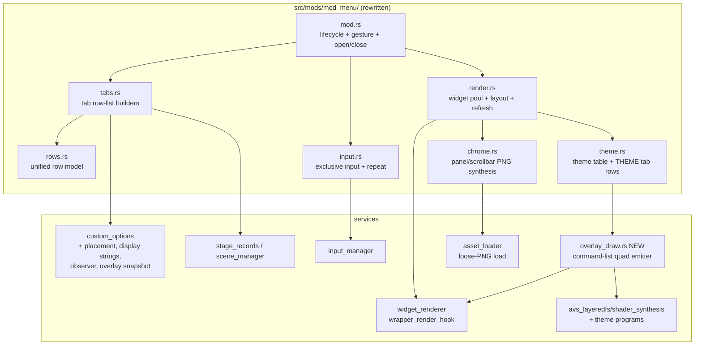
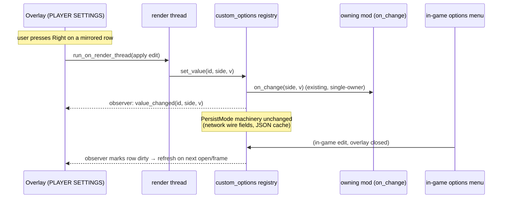

# Detailed Design: Overlay Menu Rewrite (Mod Menu v2)

Status: Approved 2026-08-24

## 1. Overview

The modpack's in-game overlay menu (triple-press `0` on either pinpad) is rewritten from
a single endless white-text scroller into a themed, tabbed modal that renders through the
game's own UI pipeline. The rewrite has four pillars:

1. **Information architecture** — four tabs separating concerns: **MODS** (top-level
   enable/disable), **GLOBAL SETTINGS** (cabinet-wide mod configuration), **PLAYER
   SETTINGS** (per-player/per-profile options mirrored from the game's injected options
   menu), and **THEME** (menu appearance).
2. **Option mirroring** — every custom option a mod registers into the game's options
   menu (via `src/services/custom_options/`) can also appear in the overlay's PLAYER
   SETTINGS tab, controlled by a per-registration placement parameter (default: both
   menus) and overridable by operator config. Values stay in lockstep in both menus.
3. **Presentation** — a modal panel with rounded corners and configurable opacity
   (default 80 %) floating above the game with the game visible around its edges;
   dense single-line rows (~12 visible), a footer that explains the selected row, scroll
   indicators, and a scrollbar.
4. **Theming** — built-in themes, each a color palette plus a procedurally-animated
   background rendered by custom D3D pixel shaders through the game's command-list
   renderer (with a static-gradient degrade path and an animations-off toggle).

Everything engine-facing follows the repository's standing rules: AOB/derived addresses
only, fail-open degradation, panic-free hook callbacks, render-thread affinity for
widget and texture work.

## 2. Detailed Requirements

### Functional

- **FR-1 Tabs.** The overlay presents exactly four tabs, labeled `MODS`,
  `GLOBAL SETTINGS`, `PLAYER SETTINGS`, `THEME`. Pinpad `1`/`3` (either side) switch to
  the previous/next tab. Each tab keeps its own cursor/scroll position for the duration
  of one open; state resets on close.
- **FR-2 MODS tab.** One boolean row per registered mod (excluding `mod-menu` itself),
  in registration order. Toggling routes through the existing registry toggle +
  `save_mod_states` path. The footer explains, for every mod row, that disabling removes
  the mod's settings rows and its injected in-game options.
- **FR-3 GLOBAL SETTINGS tab.** Hosts the cabinet-wide rows registered through the
  overlay's own registration API (today: Timing Offsets ×4, FPS TARGET, RESTART DELAY,
  ARROW ANTI-ALIASING). Rows are grouped under a section header per owning mod; a
  disabled mod's group is hidden. The Music Wheel Song Length `Length X/Y Offset` rows
  are **removed outright** (the mod keeps reading `music_wheel_song_length.offset_x/_y`
  from config; they are hand-tunable only).
- **FR-4 PLAYER SETTINGS tab.** Mirrors custom-option rows (including decorative
  headers) whose placement includes the overlay. A pinned `CONFIGURING: PLAYER 1/2`
  selector row sits above the scroll region; it defaults to the side whose pinpad
  completed the open gesture and only offers sides with an active session. Rows render
  the selected side's values, honor `ShowWhen` visibility and live scalar bounds, and
  edits apply through the framework's normal `set_value` path (owner callback +
  persistence included).
- **FR-5 Session gating.** A side is editable only while it has an active session
  (`stage_records::side_entered(side) == Some(true)`, additionally requiring the current
  scene to be outside the attract band, scenes 2..=16 — belt-and-suspenders; the
  predicate is fail-closed). With no editable side, the PLAYER SETTINGS tab remains
  browsable but shows a `NO ACTIVE SESSION` banner and renders every row greyed and
  non-editable.
- **FR-6 Placement metadata.** `RegisterSpec` gains a `menus` placement (`in_game`,
  `overlay`; default both). The in-game builder filters rows with `in_game == false`
  exactly like unavailable rows; the overlay filters on `overlay == false`.
  `webui_options` registers its ten cosmetic pickers as in-game-only (their UX depends
  on the live preview boxes).
- **FR-7 Display strings.** The registration API gains optional `display_name` and
  `description` strings, and per-enum-value display labels (bool toggles auto-derive
  `OFF`/`ON`). When absent, the display name falls back to the prettified id
  (`assist_tick_volume` → `ASSIST TICK VOLUME`) and the description to empty. Scalar
  value text reuses the framework's existing `ScalarFormat` formatter so both menus
  render values identically.
- **FR-8 Config: placement + order.** New `custom_options.option_menu_settings` array:
  ordered entries `{ "id": string, "overlay": bool?, "in_game": bool? }`. Array order is
  the display order for **both** menus (listed ids first; unlisted non-header rows
  append in registration order; unlisted headers are excluded when the list is
  non-empty — same rationale as the retired `row_order` header rule). Omitted booleans
  inherit the registration default. Unknown ids: one WARN, ignored. **`row_order`
  support is removed entirely** (the key is silently ignored like any unknown key).
- **FR-9 Value sync.** A new multicast observer on the custom-options registry notifies
  subscribers of every value mutation (user edits, silent seeds, network loads, card-in
  resets, bounds changes). The overlay subscribes while open and refreshes affected
  rows; overlay edits are marshaled to the render thread and applied via `set_value`.
- **FR-10 Theming.** Built-in themes (compiled into the DLL), each `{ id, display name,
  palette, background }`. Ships with four: `arrows` (scrolling DDR-arrow field),
  `bubbles` (drifting circles), `wavefield` (geometric wave), `minimal` (static
  gradient, no animation). THEME tab rows: `THEME` (enum), `ANIMATED BACKGROUND`
  (bool, default ON), `MENU OPACITY` (scalar 25–100 %, step 5, default 80). All three
  persist to a new `overlay_menu` config section, written on change.
- **FR-11 Backgrounds.** Animated backgrounds are drawn by custom SM3 pixel-shader
  programs appended to the game's boot-resident `gs_screencommand_default` shader
  container at synthesis time, emitted per frame into the game's command list, clipped
  to the modal rect, above game content and below the menu's widgets. Degrade ladder:
  animations toggle OFF, shader-fixes mod disabled, synthesis/derivation failure, or
  emission-gate failure ⇒ the theme's static gradient (baked into the panel texture)
  with one WARN. New Shadertoy-derived themes are added by dropping a ported `.hlsl`
  into the theme shader directory, rebuilding blobs, and adding one table entry
  (single-pass shaders only; permissive licenses only, attribution header retained).
- **FR-12 Input.** Unchanged where it works: triple-`0` opens/closes (1250 ms window),
  Up/Down (`8`/`2` or menu buttons) navigate, Left/Right (`4`/`6`) toggle/adjust/cycle,
  Start-held = coarse scalar step, hold-to-repeat for scalar/enum rows, all cabinet
  input suppressed from the game while open. New: `1`/`3` switch tabs. Header rows and
  greyed rows are skipped by the cursor.
- **FR-13 Layout density.** Single-line rows (label left, value right), ~12 visible.
  Fixed footer renders the selected row's description plus a key-hint line. Scrollbar
  with proportional thumb + `N/M` position text when a tab overflows.

### Non-functional

- **NFR-1 Fail-open everywhere.** No menu feature may take the game down or block other
  mods: missing signature/derivation ⇒ degrade (text-only menu at worst), widget-pool
  exhaustion ⇒ WARN + missing element, shader failure ⇒ static panel.
- **NFR-2 Thread discipline.** Widget/texture mutation only on the render thread
  (`run_on_render_thread`); no state mutex held across a render-thread schedule; the
  hold-to-repeat thread marshals mirrored-row edits to the render thread.
- **NFR-3 Hot-path budget.** Per-frame work while the menu is closed: one relaxed atomic
  check in the wrapper-render path. While open: shader emission is O(1) records; sprite
  updates only on state changes.
- **NFR-4 No hardcoded offsets.** All new game addresses via AOB or derivation from
  existing anchors (the required globals — screen renderer state, default shader
  container — are already derived).
- **NFR-5 Boot cost.** Chrome textures are synthesized on a background thread; nothing
  new blocks boot. One boot-time diagnostic logs the widget free-pool count.

### Non-goals (this pass)

- Localization of overlay strings (English only; the in-game texture pipeline keeps its
  eng/jpn/kor sets).
- Removing any option from the in-game menu (mirroring only; final homes decided after
  UAT).
- Operator-loadable shader blobs from `data_mods/` (themes are compiled in).
- Authored (AFP/movie) backgrounds; mouse/touch input.

## 3. Architecture Overview



Layering on screen (bottom → top): game frame → theme background quad (shader, clipped
to the modal rect) → panel texture (rounded corners, gradient, opacity) → chrome sprites
(tab indicator, selection bar, scrollbar) → text widgets. This works because (a) the
DLL's widget render list draws after all of the game's BM2D/AFP content
(cabinet-confirmed), (b) within the widget list, creation order = z-order, and (c) the
background quad is emitted from the widget wrapper's render pass, which runs before the
menu's own widgets draw (the exact recipe is validated by the spike's z-probe; the
fallback is emitting late and creating the menu's widgets even later).

### Value-sync data flow



## 4. Components and Interfaces

### 4.1 `src/mods/mod_menu/` module structure

The single 1,170-line `mod_menu.rs` becomes a subdirectory:

| File | Responsibility |
|------|----------------|
| `mod.rs` | `Mod` impl (`mod-menu`, always enabled), triple-0 gesture, open/close lifecycle, global `MenuState`, public registration API re-exports |
| `rows.rs` | Unified `Row` model (see §5), row-value plumbing, cabinet-row registration API (`ScalarRowSpec`/`EnumRowSpec`/new `register_bool_row` if needed) |
| `tabs.rs` | `TabId` enum; per-tab row-list builders (MODS from registry entries; GLOBAL from contributed rows grouped by owning mod; PLAYER from the custom_options overlay snapshot; THEME from theme.rs) |
| `input.rs` | Exclusive-consumer handler, navigation (incl. header/greyed skip), tab switching, hold-to-repeat thread (unchanged generation-token design), coarse detection |
| `render.rs` | One-time widget allocation (ordered for z), layout constants, `refresh()` (repaints all visible slots from the active tab's row list), scrollbar/footer/banner updates, palette application |
| `chrome.rs` | Runtime PNG synthesis (panel with rounded corners + theme gradient + opacity, 1×N solid strips for selection bar/scrollbar/tab underline), cache under `data_mods/_cache/mod_menu/`, hash-guarded regeneration on theme/opacity change |
| `theme.rs` | Built-in theme table, palette struct, THEME tab row definitions, `overlay_menu` config read/write |

The current file's proven pieces carry over with minimal change: the gesture buffer,
exclusive consumer + suppression, the repeat thread, and the allocate-once/reuse widget
discipline.

### 4.2 Unified row model

One `Row` type serves all tabs (replaces today's `MenuRow`):

```rust
pub struct Row {
    pub key: String,            // stable id (mod id, contributed key, or option id)
    pub label: String,
    pub description: String,    // footer text when selected
    pub kind: RowKind,          // Boolean | Scalar{..} | Enum{..} | Header
    pub source: RowSource,      // RegistryToggle | Contributed | Mirrored{option} | Theme
    pub greyed: bool,           // rendered dim, cursor skips, edits refused
    pub visible: bool,
}
```

- `RegistryToggle` rows toggle via the registry callback + `save_mod_states` (unchanged
  semantics from the current menu).
- `Contributed` rows keep the current `on_change(i32)` contract. Their `parent_row_key`
  field is reinterpreted as **owning mod id**: on the GLOBAL tab the row appears (under
  the mod's section header) iff that mod is enabled.
- `Mirrored` rows are built from a snapshot (§4.3) and edited via the marshaled
  `set_value` path.
- `Header` rows render label-only in the accent color; never selectable.

Tab row lists are rebuilt: on open, on tab switch, on side switch, when the observer
reports a mutation, and after any local edit (cheap — plain-data lists, no widget work;
widgets repaint from the list in `refresh()`).

### 4.3 custom_options extensions

All additive, in `src/services/custom_options/`:

1. **`MenuPlacement`** (api.rs): `struct MenuPlacement { pub in_game: bool, pub overlay: bool }`,
   default `{ true, true }`. New `RegisterSpec.menus` field + builder setter
   `.menus(...)` (+ convenience `.in_game_only()` / `.overlay_only()`).
   Enforcement: `builder_hook`'s per-open snapshot filters `!in_game` rows exactly like
   unavailable ones; the overlay snapshot filters `!overlay`. Config overrides (§4.4)
   are resolved at read time (config wins over registration). Optional optimization:
   `asset_gen` skips label-texture generation for `in_game == false` rows.
2. **Display strings** (api.rs): `RegisterSpec.display_name: Option<&'static str>`,
   `RegisterSpec.description: Option<&'static str>`; `EnumValue.display_label:
   Option<String>`. Builder setters `.display_name(..)`, `.description(..)`;
   `bool_toggle` auto-sets `OFF`/`ON` value labels; `EnumValue` gains a
   `with_display(..)` constructor. Fallbacks: prettified id / empty / prettified
   texture-name suffix. Every existing registration site gains explicit strings in the
   sweep step (~30 options across ~12 mods).
3. **Observer** (registry.rs + mod.rs): `subscribe_value_changed(Arc<dyn Fn(&str, u8, i32) + Send + Sync>) -> usize`
   (+ `unsubscribe`). Dispatched after the STATE lock is released (same pattern as the
   existing `dispatch_callback`), on every mutation path: `set_value`,
   `set_value_silent`, `resolve_from_load`, card-in resets, `set_scalar_bounds`
   (bounds-clamp writes). Panic-contained per subscriber.
4. **Overlay snapshot** (mod.rs): one call under the STATE lock producing plain data:

   ```rust
   pub struct OverlayRowInfo {
       pub id: String,
       pub display_name: String,
       pub description: String,
       pub kind: OverlayRowKind,   // Bool{value} | Enum{index, values, labels} |
                                   // Scalar{value, min, max, steps, formatted} | Header
       pub visible: bool,          // ShowWhen evaluated for the requested side
   }
   pub fn overlay_snapshot(side: u8) -> Vec<OverlayRowInfo>
   ```

   The snapshot applies: availability, placement (registration ⊕ config override),
   configured order (listed-first; unlisted headers excluded when a list is configured),
   live scalar bounds, and per-side `ShowWhen`. Scalar `formatted` text comes from the
   existing `format_scalar_value` (made `pub(crate)`-visible to the snapshot builder),
   so both menus render values identically.
5. **Ordering rework** (ordering.rs): `row_order` parsing/consumption deleted.
   `set_configured_settings(Vec<OptionMenuSetting>)` replaces `set_configured_order`;
   `compute_order` keeps its listed-first/unlisted-append/headers-excluded semantics but
   returns placement overrides alongside the permutation. `builder_hook` consumes the
   same source. Host tests updated in place.

### 4.4 Configuration

**New `custom_options.option_menu_settings`** (operator-authored; read once at init):

```jsonc
"custom_options": {
  "option_menu_settings": [
    { "id": "premium_free" },                          // defaults: both menus
    { "id": "song_speed", "overlay": true },           // explicit
    { "id": "customize_appeal_board", "overlay": false }, // in-game only
    { "id": "autoplay", "in_game": false }             // overlay only
  ]
}
```

Array order = display order in both menus. Omitted keys inherit the registration
default. `"overlay": false, "in_game": false` = row hidden everywhere (the "neither"
case). Unknown ids: one WARN, ignored. `row_order` is no longer read; the README's
config example and row-id list migrate to the new schema.

**New top-level `overlay_menu` section** (DLL-written on THEME tab change, via the same
`save_json_key` mechanism the quick-restart delay row uses):

```jsonc
"overlay_menu": {
  "theme": "arrows",            // built-in theme id; unknown → "arrows" + WARN
  "animate_background": true,
  "opacity": 80                 // 25..=100, clamped+snapped to 5s
}
```

### 4.5 Chrome & layout

All chrome is synthesized at runtime (RGBA8 PNGs via the `image` crate, encoded on a
background thread, cached under `data_mods/_cache/mod_menu/` with hash sidecars keyed on
theme id + opacity + layout version) and loaded as loose PNGs through `asset_loader`
(async, ~0.7 s to resolve — kicked at boot so the first open is instant; a theme change
regenerates and swaps when resolved). Synthesized pieces:

- **Panel**: one full-size texture, rounded corners (r≈20 px), theme gradient baked in,
  alpha = configured opacity (so "static background" costs zero extra widgets).
- **Solids**: a small white rounded-rect strip reused (stretched + tinted) for the tab
  active-indicator, selection bar, scrollbar track/thumb, and banner backing.

Layout (1280×720 canvas; constants in `render.rs`, tuned on first deploy; **amended
2026-08-24 per maintainer: only ~50–75 px of unobscured screen around the modal — the
menu should occupy most of the screen. Numbers below use uniform 60 px margins**):

```
┌─ modal 1160×600 @ (60,60), rounded, opacity 80% ────────────────────┐
│ TITLE BAR   DDR WORLD UNIVERSAL MODPACK                    (h≈44)   │
│ TABS   [MODS] [GLOBAL SETTINGS] [PLAYER SETTINGS] [THEME]  (h≈36)   │
│ (PLAYER tab only) CONFIGURING: ◄ PLAYER 1 ►                (h≈30)   │
│ ─ content: 12 rows × 34 px ─────────────────────────────┬─ scroll ─ │
│   ROW LABEL ..................................... VALUE │ ▲ █ ▼    │
│   (headers render accent-colored, full-width)           │  12/34   │
│ ─ footer (h≈64) ────────────────────────────────────────┴───────── │
│   Selected row description (wrapped, 0.45 scale)                    │
│   8/2 Nav · 4/6 Adjust · +Start Coarse · 1/3 Tab · 0×3 Close        │
└──────────────────────────────────────────────────────────────────────┘
```

Widget budget (allocated once, on first open, in z-order): panel 1 + title 1 + tab
labels 4 + tab indicator 1 + side selector 1 + selection bar 1 + rows 12×2 (label,
value) + scrollbar 2 + position text 1 + footer 2 + banner 1 ≈ **39** (vs 25 today; the
repo's total worst case moves from ~49 to ~63). The widget node pool's size is unknown
(game-side pre-allocation, nodes never truly freed), so `widget_renderer` gains a
boot-time diagnostic that walks the free list and logs the available count; exhaustion
is already non-fatal (WARN + invisible widget).

Text scale drops to ≈0.55 for rows (from 1.0), ≈0.45 for the footer — the current menu's
oversized text is the main density killer.

### 4.6 Theme system

```rust
pub struct Theme {
    pub id: &'static str,        // config value
    pub display: &'static str,   // THEME tab label
    pub palette: Palette,        // ~10 RGBA entries: panel_base/gradient, border,
                                 // title, tab_active/inactive, label, value,
                                 // selected/accent, greyed, footer
    pub background: Background,  // Shader { program: ThemeProgram } | Static
}
```

Built-ins (compiled in; `THEMES: &[Theme]`):

| id | display | palette direction | background |
|----|---------|-------------------|------------|
| `arrows` | RHYTHM | deep blue/purple, cyan accent | shader: scrolling DDR-arrow field (low-contrast) |
| `bubbles` | BUBBLES | dark teal, warm accent | shader: drifting/bobbing translucent circles |
| `wavefield` | WAVEFIELD | charcoal, green accent | shader: geometric grid riding a 3-D wave surface |
| `minimal` | MINIMAL | neutral dark grey, white accent | static (gradient only) |

Adding a theme (incl. Shadertoy ports): drop `shaders/src/themes/<name>.hlsl`, run
`scripts/build_shaders.sh` (extended to compile theme PS blobs alongside the lane
shaders), add one `Theme` entry referencing the blob. Shadertoy constraints: single-pass
"Image" shaders only (no render-to-texture exists); must compile under fxc 9.29 within
ps_3_0 budgets; permissive licenses only (Shadertoy defaults to CC BY-NC-SA 3.0 —
unsuitable for redistribution here), attribution header retained in the ported source.

THEME tab rows (all cabinet-wide, `overlay_menu`-persisted, live-applied): `THEME`
(enum over built-ins), `ANIMATED BACKGROUND` (bool), `MENU OPACITY` (scalar 25–100,
step 5/coarse 10). Theme/opacity changes trigger chrome re-synthesis (async; the old
panel stays until the replacement resolves) and palette repaint.

### 4.7 Background rendering (`src/services/overlay_draw.rs` + synthesis extension)

**Synthesis** (`src/services/avs_layeredfs/shader_synthesis.rs`): theme pixel-shader
programs (one per shader-backed theme, sharing one passthrough VS that forwards a time
value through an interpolator) are appended to the `gs_screencommand_default` container
**after** all existing programs — the player-perspective rewrite hardcodes program
index 1, so ordering is: stock prog 0, perspective prog 1 (when enabled), theme progs
last; the menu-bg program indices are recorded at synthesis time for the emitter, in
every synthesis configuration. The overlay-menu backgrounds become a synthesis input
alongside AA/perspective (shader-fixes mod disabled ⇒ no theme programs ⇒ static
degrade). Blobs live at `data_mods/shader_fixes/blobs/theme_*.d3dbc` (mod-owned HLSL
only, matching the existing rule of never committing Konami bytecode).

**Emission** (`overlay_draw.rs`): `widget_renderer::wrapper_render_hook` calls
`overlay_draw::on_wrapper_render()` each frame (one relaxed-atomic no-op when inactive).
When the menu is open, animations are on, and every gate passes, it appends to the
active command list (`render_notes_hook::active_command_list()` — the underlying global
is scene-agnostic and process-lifetime):

1. scissor-on (tag `0x0C`) to the modal rect,
2. `SetVSConstantF` (tag `0x14`, c48 window) carrying time + rect + theme params,
3. `SetShader` (tag `0x13`) to `(default container, theme program index)` — **strictly
   behind the mandatory program-count gate** (`*(u32*)(shaderObj+4) ≥ idx+1`; the
   handler has no bounds check),
4. one quad (tag `0x03`/`0x04` family),
5. restore shader/texture/blend + scissor-off — full state restoration is a hard
   invariant (established by the mine-render emitter).

Gates (all fail-open to Static): container global resolves, program count sufficient,
active list non-null with plausible write cursor, arena headroom heuristic (measured
during the spike; refuse to emit when the frame's list is unusually full).

**Spike-first sequencing.** The emitter is the design's only genuinely new RE. It is
front-loaded as an isolated spike with staged success criteria: (1) static decode of the
layer dispatcher/slot table, (2) per-scene active-list diagnostics from the wrapper
site, (3) stock-shader tinted-quad POC in attract/select/gameplay, (4) z-probe
(before/after original-call emission vs widget creation order), (5) synthesis extension
+ animated bind, (6) scissor/state soak incl. versus gameplay and scene churn. If the
spike fails, the design degrades cleanly: themes keep palettes + static gradients
(sprite-based animation remains a documented contingency, not built up front).

### 4.8 Input handling

Unchanged mechanics carried over: triple-0 gesture buffer (opens and closes), exclusive
consumer consuming all input while open, `set_input_suppressed(true)` (10-key + all five
menu-button detours), generation-tokened hold-to-repeat thread, Start-held coarse steps.

New/changed:

- `1`/`3` = previous/next tab (wraps). Tab switch rebuilds the row list, restores that
  tab's cursor.
- Navigation skips `Header` and `greyed` rows (with wrap-around preserved; an all-greyed
  list parks the cursor on the side selector / first row without editing).
- The open gesture records the originating side (`InputEvent.player`) → PLAYER SETTINGS
  default side.
- Edits on `Mirrored` rows are marshaled: the input/repeat thread computes the new value,
  then `run_on_render_thread(move || custom_options::set_value(...))` — preserving the
  framework's documented "user edits fire on the render thread" expectation. Contributed
  and registry rows keep their current direct-call semantics.

### 4.9 Session gating & side selection

- Editable(side) := `stage_records::side_entered(side) == Some(true)` AND
  `scene_manager::current_scene()` outside 2..=16. `None` (records unavailable) ⇒ not
  editable (fail-closed).
- Side selector: pinned row; Left/Right switches only among editable sides; exactly one
  editable side ⇒ selector locked to it (greyed); zero ⇒ selector greyed, banner shown,
  all rows greyed.
- Gating is re-evaluated on open, on scene change while open (scene callback marks
  dirty), and before applying any edit (a stale-open race — e.g. logout while the menu
  is open — refuses the edit and repaints greyed).

### 4.10 Removals & migrations

| Item | Action |
|------|--------|
| `custom_options.row_order` | Reading code deleted (`ordering.rs` rework); key silently ignored; README section replaced by `option_menu_settings` docs |
| Music Wheel Song Length `Length X/Y Offset` overlay rows | Deleted from `src/mods/music_wheel_song_length.rs` (row registration + `save_json_key` wiring); config keys remain hand-editable and are still read at enable |
| `webui_options` cosmetic registrations | Gain `.in_game_only()` (config-overridable) |
| Old `mod_menu.rs` layout/rendering | Fully replaced; registration API (`ScalarRowSpec`/`EnumRowSpec`) signature-compatible so the four remaining registrants (timing_offsets, fps_unlock, quick_restart_or_fail, shader_fixes) need at most description-string touch-ups |
| README | "Mod Menu" feature row, configuration section, complete-example JSON updated (row_order → option_menu_settings, new overlay_menu section) |

## 5. Data Models

### Config (new/changed sections)

```jsonc
{
  "custom_options": {
    // ... existing keys unchanged (persist_network, persist_json, p1/p2, ...) ...
    "option_menu_settings": [ { "id": "...", "overlay": true, "in_game": true } ]
  },
  "overlay_menu": { "theme": "arrows", "animate_background": true, "opacity": 80 }
}
```

### Core structs (abridged)

```rust
// custom_options/api.rs (additive)
pub struct MenuPlacement { pub in_game: bool, pub overlay: bool }   // default both
// RegisterSpec += menus, display_name, description; EnumValue += display_label

// custom_options/ordering.rs
pub struct OptionMenuSetting { pub id: String, pub overlay: Option<bool>, pub in_game: Option<bool> }

// mod_menu/rows.rs
pub enum RowKind { Boolean{..}, Scalar{..}, Enum{..}, Header }
pub enum RowSource { RegistryToggle, Contributed{on_change}, Mirrored{option_id}, Theme }

// mod_menu/theme.rs
pub struct Theme { id, display, palette: Palette, background: Background }
pub enum Background { Shader { program: ThemeProgram }, Static }
```

### Shader constant block (c48 window, VS-delivered, PS via interpolators)

| Register | Contents |
|----------|----------|
| c48 | `time_seconds, rect_x, rect_y, unused` |
| c49 | `rect_w, rect_h, theme_param0, theme_param1` |

## 6. Error Handling

Degradation ladder (every rung logs one bounded WARN; nothing below the top rung can
affect gameplay):

| Failure | Behavior |
|---------|----------|
| Shader emission gate fails (container/program/list/arena) | Static gradient panel (already the base layer); emitter latches off for the session on repeated failure |
| shader-fixes disabled / synthesis absent | Same static degrade; THEME tab shows themes with `ANIMATED BACKGROUND` greyed |
| Chrome PNG synthesis or asset load fails | Solid fallback strip texture; if even that fails, text-only rendering (today's look) — menu remains functional |
| Widget pool exhausted mid-allocation | WARN + affected element invisible; menu still navigable (text rows allocate before decorative chrome to protect function over form) |
| custom_options service unavailable | PLAYER SETTINGS tab renders an "OPTIONS FRAMEWORK UNAVAILABLE" banner; other tabs unaffected |
| `stage_records` unavailable | PLAYER SETTINGS permanently gated (fail-closed NO ACTIVE SESSION) |
| Unknown `overlay_menu.theme` / out-of-range opacity | Default theme / clamp+snap, one WARN |
| Unknown id in `option_menu_settings` | One WARN, entry ignored |
| Panic containment | All hook-reachable callbacks (`on_wrapper_render`, input handlers, observer dispatch, repeat-thread body) are `catch_unwind`-wrapped per the repo standard |

Edit-time races: an edit against a side that lost its session between paint and press is
refused at apply time (re-check the gate under the marshaled closure). Observer
notifications arriving during a repaint mark-dirty rather than re-entering the render
path.

## 7. Testing Strategy

**Host tests (`cargo test`, pure modules — the repo's established pattern):**

- `ordering.rs` rework: `option_menu_settings` parse (booleans optional, unknown keys),
  order computation (listed-first, unlisted append, header exclusion), placement
  resolution matrix (registration default ⊕ config override, incl. "neither").
- Row-list builders in `tabs.rs`, made pure over injected snapshots: MODS list from a
  fake registry; GLOBAL grouping/hiding by owning-mod enablement; PLAYER list from
  synthetic `OverlayRowInfo` vectors (ShowWhen filtering, header skip map, greyed-all
  banner state); side-selector eligibility matrix.
- `chrome.rs` synthesis: output dimensions, corner-alpha profile, opacity mapping,
  cache-key stability (theme/opacity change ⇒ new hash).
- Theme table integrity: unique ids, config round-trip (unknown theme → default),
  opacity clamp/snap.
- Scalar formatting parity: mirrored-row `formatted` equals `format_scalar_value`
  output for every `ScalarFormat` variant.
- Navigation model: cursor skip (headers/greyed), tab cursor memory, scroll clamping
  (property-style cases mirroring the current file's underflow-guard comments).

**Build gates:** `cargo check` → `cargo fmt` → `./build.sh`; theme HLSL compiles via
`scripts/build_shaders.sh` (fxc 9.29 golden path); container packing validated by the
existing synthesis fingerprint machinery.

**Cabinet validation (the only real test for engine-facing code), staged with the plan:**

1. Boot diagnostic: widget free-pool count logged; no new boot-time cost.
2. Spike gates (§4.7): per-scene list diagnostics → tinted quad POC → z-probe →
   animated bind → scissor/state soak (attract loop, song select, solo + versus
   gameplay, scene churn; multi-hour).
3. Menu function: all four tabs on all scenes; mirroring lockstep test (edit in-game →
   reopen overlay; edit overlay → check in-game rows and, on card-out, server/JSON
   persistence); session-gating matrix (attract / P1 only / both / logout-while-open).
4. Regression: the four contributed-row registrants adjust correctly; mod toggling
   still persists; input suppression still holds; music wheel offsets still honored
   from config after row removal.

## Appendix A — Key research findings the design rests on

- **Command-list access is scene-agnostic**: the screen-renderer global lives for the
  process; active list = `*(state+0x40 + (*(state+0x68))*8)`
  (`src/services/render_notes_hook.rs`). Records are consumed on a worker thread after
  frame building, so mid-frame emission is safe. The DLL already ships two record
  emitters (mine rendering; perspective constant uploads).
- **Record tags** (documented in `docs/custom_arrow_renderer_research.md`): 0x0C
  scissor, 0x13 SetShader (no bounds check — gate mandatory), 0x14 VS constants
  (self-contained payloads), 0x11 SetTexture, 0x03/0x04 quads, 0x05/0x06 raw vertices.
  Painter's order only — no usable depth in the 2D path.
- **`gs_screencommand_default` is boot-resident in every scene**; its global is already
  derived; multi-program containers and runtime container synthesis are established
  (`src/services/avs_layeredfs/shader_synthesis.rs`). Perspective hardcodes program
  index 1 — theme programs append after it.
- **Widget z = creation order; the widget list draws above all BM2D/AFP content**
  (cabinet-confirmed twice). Widget nodes come from a finite game-side pool (~49
  consumed today, capacity unknown, nodes never truly freed) — hence the boot
  diagnostic and allocate-once discipline.
- **Runtime PNG synthesis is precedented** (training strip HUD): `image` crate encode on
  a background thread → loose PNG under `data_mods/_cache/` → async `asset_loader` load
  (~0.7 s), engine-refcounted.
- **No PS-constant record exists** — time reaches the pixel shader via a VS interpolator.
- **No display strings exist at runtime today**: in-game labels are `seop_item_*`
  textures; scalar value text is composed in Rust and is reusable.

## Appendix B — Alternatives considered

| Alternative | Verdict |
|-------------|---------|
| Render mirrored-row labels with the game's own `seop_item_*` textures (ja/ko for free) | Rejected: texture resolution requires the owning IFS resident (not guaranteed in every scene the overlay opens in); registry/contributed rows need text anyway |
| `"OVERLAY"/"IN_GAME"/"BOTH"` enum in config | Rejected for two optional booleans: partial overrides natural, "neither" expressible, typo degradation friendlier |
| Keep `row_order` as a deprecated fallback | Overridden by maintainer: removed outright; tiny user base will migrate configs |
| AFP-clip animated backgrounds (zero RE) | Rejected as primary: needs authored AFP content (untooled); kept in mind as historical precedent only |
| Sprite/UV-animated backgrounds as the primary path | Demoted to contingency-if-spike-fails: per-frame CPU widget churn vs near-zero-CPU shader path, and the spike is well-scoped |
| Whole new GSPW container instead of extending DEFAULT | Rejected: adds two extra unknowns (draw-time hash-lookup resolution, FileManager enumeration) for no benefit |
| Multi-pass Shadertoy support | Out of scope permanently: no render-to-texture path in the command-list model |
| Operator-loadable theme shader blobs from `data_mods/` | Deferred: support/safety surface unwanted at public release |

## Appendix C — Shadertoy porting workflow (per shader)

1. Verify license permits redistribution (CC0/MIT/attribution; Shadertoy default
   CC BY-NC-SA is not acceptable for the repo). Record author/URL/license in the HLSL
   header.
2. Port GLSL → HLSL SM3: `mainImage(fragColor, fragCoord)` → `ps_3_0` main over the
   quad's interpolated UV; `iTime`/`iResolution` from the c48 block via interpolators;
   `iChannel` textures (if any) become shipped/synthesized PNGs bound via SetTexture.
3. Compile through `scripts/build_shaders.sh` — fxc success within ps_3_0 limits IS the
   feasibility gate (heavy raymarchers won't pass or won't hit frame rate; expect
   plasma/tunnel/geometric-class shaders to fit).
4. Add a `Theme` entry (palette + program) and deploy; validate at 720p on the cabinet
   (fill-rate check on the modal-rect area).
