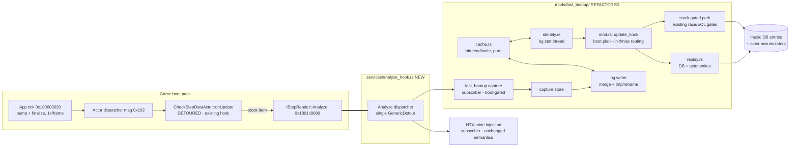

# Ultrafast Boot — Detailed Design

Status: Approved 2026-08-24
Date: 2026-08-24
Feature: refactor of the `fast-bootup` mod (same mod id, same toggle — no new mod)

## Overview

DDR World's boot spends the majority of its wall time (~15.5 s of a ~28 s boot
on a measured cabinet with ~1441 songs) loading and analyzing every SSQ chart
file to compute metadata that `musicdb.xml` does not carry: per-chart
min/core/max BPM, note counts (→ EX score), shock/variable-BPM flags,
groove-radar values, and global normalization maxima. The full reverse
engineering of this pipeline is published in `docs/ultrafast_boot_research.md`;
this design inlines everything needed to implement against it.

This feature refactors `fast-bootup` so that:

1. **First boot (capture):** charts load and analyze stock (with the existing
   batching); we capture the game's own analyzer outputs per
   (file × difficulty × mode) at the Analyze function boundary and persist
   them to a versioned bin file.
2. **Subsequent boots (replay):** for every chart whose backing file is
   unchanged, we skip the file read and the analysis entirely — the cached
   outputs are written into the game's in-memory music DB and the boot actor's
   accumulators through a transcription of the game's own arithmetic, and the
   loader entries are retired through the game's own release machinery.
   Changed/new/unverifiable charts fall back to the stock path and refresh the
   cache.
3. **Pacing removal:** the loader's artificial throughput cap (4 new file
   opens per pump × one pump per frame) is raised during the boot pass so
   cache-miss loads run at device speed.

Expected outcome: cache-hit boots eliminate the SSQ window almost entirely
(boot ≈ 13 s on the measured cabinet); first boots and partial misses shrink
toward true disk speed.

Everything fails open: any cache, identity, or address-derivation failure
degrades to exactly today's fast-bootup behavior.

## Detailed Requirements

Consolidated from the accepted decision register.

**Functional**

- FR-1: Delivered as a refactor of `fast-bootup` — same mod id, name, config
  toggle. No new mod, no new `mod-config.json` keys.
- FR-2: On boots where a chart's identity verifies against the cache, neither
  read nor analyze its SSQ file; inject the cached outputs instead. All ten
  music-DB per-slot writes, the two song-wide u16 BPM accumulators, the
  per-song corruption flag, the actor's five radar accumulators, the work-list
  cursor, and the loading-percent display must end up byte-identical to a
  stock pass over unchanged data.
- FR-3: The replay must NEVER invoke the game's error reporter
  (`ME1529 / FILE CORRUPTION ERROR` — a hard boot blocker on real hardware).
  Only the music-DB `+0x1B0` flag byte is replayed. Charts processed through
  the stock path keep stock behavior (we neither add nor suppress the game's
  own reporting).
- FR-4: Cache identity per file = registered game path + resolved backing
  file (LayeredFS mod-folder override or stock) + size + mtime. Global
  invalidators: cache format version and the gamemdx build (PE
  TimeDateStamp + SizeOfImage of the loaded module). NoteTypesExpansion
  configuration is deliberately NOT an invalidator (boot-time mine injection
  provably affects nothing persistent). Absent files are cached as an
  "absent" outcome; a file appearing later is an identity mismatch → stock.
- FR-5: Cache misses (first boot, changed files, in-flight records) process
  through the existing gated stock path — including both existing safety
  gates (buffer-settled chunk walk; done-flag + cursor bounds) — and their
  fresh captures are merged into the cache, which is rewritten once per boot
  (atomic tmp + rename, background thread) when anything changed.
- FR-6: While the boot actor is live, the step-data manager's per-pump open
  cap (`mgr+0x70`, stock value 4) is raised to 64 and restored afterward. A
  bounded per-frame drain (mirroring the game's own blocking drain) is
  designed (§Appendix B) but NOT built unless cabinet measurement shows the
  cap raise alone leaves the device idle.
- FR-7: The final work item is always processed through the stock path, so
  the game's own completion block (global accumulator copy, done-flag +
  parent-chain walk) runs natively.

**Non-functional**

- NFR-1: Fail-open tiers — (a) one bad cache entry ⇒ that chart goes stock +
  refresh; (b) whole bin unreadable/wrong version/wrong build ⇒ treated as
  empty, full stock boot + full rebuild; (c) any required address derivation
  missing ⇒ cache and pacing features disable entirely, mod behaves exactly
  like today's fast-bootup. One WARN per failure class.
- NFR-2: No panics may cross the hook boundary; no AVS calls off game
  threads; no game-thread file I/O (identity stats and cache writes happen on
  background threads using host `std::fs`).
- NFR-3: Pure layers (bin format, replay arithmetic, plan computation) are
  host-testable via `cargo test`.
- NFR-4: Percent display may jump 0→100 on a full-hit boot (accepted).

## Architecture Overview



**Boot timeline, cached boot:**

```mermaid
sequenceDiagram
    participant E as mod enable (DLL init)
    participant BG as identity thread
    participant U as update_hook (game main thread)
    participant M as step-data manager
    participant W as writer thread

    E->>BG: spawn: read bin, stat ~1466 files (std::fs + mod_paths)
    BG-->>E: verdict map published (~100 ms)
    Note over M: onInit registered all files (status 1)<br/>pump opened ≤4 before first onUpdate
    U->>U: first call: build boot plan (scan work list vs verdicts)
    U->>M: raise open cap 4→64; flip fully-hit records 1→6 (empty shape)
    loop every work item except the last
        alt plan = Replay
            U->>U: replay writes + accumulators + release + cursor + percent
        else plan = Stock
            U->>M: existing gated batch (loads at raised cap)
            U->>U: harvest capture for cache refresh
        end
    end
    U->>M: final item via stock path → completion block runs natively
    U->>M: restore open cap 64→4
    U->>W: spawn if anything captured: merge + stat + serialize + tmp/rename
```

### Why these mechanisms are safe (inlined rationale)

- **Status flip 1→6 with null buffer** is a state the stock pump itself
  produces for an empty file (`getSize()==0` → release reader, status 6,
  buffer stays null). Both stock pumps handle it: the pending pump drops
  status-6 entries without opening; the release path frees them without the
  error branch. We never touch records in in-flight statuses {2,3,4,7}.
- **Release replay** uses the game's own `queue_release(mgr, entry_index)`
  (gamemdx 20260721: `0x1801FF1B0`) once per work item, exactly as stock
  onUpdate does; refcounts (5 per shared file) and the freelist converge to
  the stock end-state.
- **Completion via the last stock item**: stock onUpdate runs its completion
  block (copy actor accumulators `+0xA8..+0xCC` → global config `+0x30..+0x54`,
  set done flag, walk parent chain) while processing the final work item.
  Replay max-accumulates into the actor fields as it goes, so the stock final
  item completes on top of correct state — and any future drift in the
  completion code is absorbed by running it stock.
- **Flip eligibility must be computed per record, not per item**: a song's 5
  work items share one file record. A record is flipped only when *every*
  item referencing it is planned for replay and none of them is the final
  work item; otherwise the record is left alone so the stock path can load it
  normally. (Flipping a record that a stock item still needs would make that
  item analyze an empty buffer → zeroed results AND the game's own corruption
  reporter — the FR-3 boot blocker. The plan structurally prevents this.)

## Components and Interfaces

### 1. `src/services/analyze_hook.rs` (new service)

Owns the single `GenericDetour` on `IStepReader::Analyze` (one detour per
target — this detour currently belongs to NoteTypesExpansion and moves here).
Pattern: `judge_hook` / `render_notes_hook` dispatcher.

```rust
pub type AnalyzeArgs = /* (this, notes, measures, result, radar, mode, difficulty, option) */;
pub fn init(ctx: &SignatureContext) -> bool;           // installs the detour (in service init, like NTX did)
pub fn register_post(cb: fn(&AnalyzeArgs, orig_ret: u8)); // fixed small slot array
pub fn is_available() -> bool;
```

- The detour calls the original, then dispatches to post-subscribers in
  registration order, each wrapped in `catch_unwind`.
- Subscribers: NTX's mine injection (registered from NTX `init()`, semantics
  unchanged — it already ran post-original), and fast_bootup's capture
  (registered from fast_bootup `init()`, self-gated on "boot batch active").
- Ordering independence: capture reads `result`/`radar`/`ret`; NTX mutates
  the notes vector. Neither reads what the other writes.
- Signature: the existing NTX Analyze signature moves to this service's
  `required_signatures`. NTX's function-pointer type (8-arg extern "C",
  documented in `src/mods/note_types_expansion/hooks.rs`) is reused verbatim.

### 2. `src/mods/fast_bootup/` (refactor of the single file into a directory)

#### `mod.rs` — Mod impl + `update_hook`

Keeps: id `fast-bootup`, RTTI-resolved `check_step_data_update` detour,
`IN_HOOK` guard, both existing safety gates, `MAX_PER_FRAME` for stock calls.

New orchestration per hooked call:

1. **One-time (first call per boot):** consume the identity verdict map (if
   the background thread isn't done, treat all as miss); read the work list
   (`actor+0x88..+0x90`, 12-byte items `{entry_index, difficulty, mcode}`)
   and build the **boot plan**: per item `Replay(payload)` or `Stock`; per
   record a flip decision (see safety rationale above). Write
   `mgr+0x70 = 64`. Flip eligible records `1→6` (skip any not currently 1).
   Pure plan computation lives in a host-testable function
   (`plan::compute(items, verdicts, cache) -> BootPlan`).
2. **Batch loop:** for the item at the cursor —
   - `Replay`: call `replay::apply_item(...)` (below), then queue the game's
     release, advance the cursor (counter[phase]++ at `actor+0x58+phase*8`,
     zero aux + later phases per `actor+0x80/+0x82`), write the percent
     (`*(ptr at actor+0xD8) = counter*100/total`, null-checked). Replayed
     items are not bounded by `MAX_PER_FRAME` (pure memory writes).
   - `Stock` (including always the final item): existing gated path —
     `should_process_more` then `hook.call(actor)` — with a per-call stash of
     `{game_path, difficulty}` so the capture subscriber can key its two
     (mode 0/1) captures. Post-call, harvest the captures into the capture
     store.
   - Loop exits on the existing done-flag / cursor-bounds / readiness gates.
3. **Completion (done flag observed):** restore `mgr+0x70 = 4`, clear the
   boot-active gate, hand the capture store to the writer thread if anything
   was captured or refreshed.

`disable()` additionally restores the open cap if mid-boot.

#### `cache.rs` — bin format (pure, host-tested)

Read/parse and serialize the cache file. No game interaction. Format in
§Data Models. Parse is fully bounds-checked; any malformation ⇒
`CacheLoad::Empty { reason }` (NFR-1b).

#### `identity.rs` — file identity + background verification

- `resolve(game_path) -> Resolved` — strips `data/`, consults
  `avs_layeredfs::mod_paths::find_first_modfile("mdb_apx/ssq/<name>")`, falls
  back to `data/mdb_apx/ssq/<name>`; stats via `std::fs::metadata` (host
  path, relative to the game's `contents/` CWD — the established
  `chart_length` / judgement-offsets-bootstrap pattern; never AVS off the
  game thread).
- `spawn_verifier(cache)` at mod enable: for each cached entry, resolve +
  stat + compare `{resolved path, size, mtime}` (or confirm absence for
  Absent entries); publish `HashMap<game_path, Verdict>` behind an
  `AtomicBool` ready flag.

#### `capture.rs` — the Analyze subscriber + capture store

- Boot gate: active only between the first hooked onUpdate call and
  completion, and only while `IN_HOOK` (i.e., the Analyze call originated
  from the boot actor's stock item — gameplay Analyze calls never capture).
- Keys each capture by the stashed `{game_path, difficulty}` + the `mode`
  argument; copies `result[14] i32`, `radar[5] i32`, `ret u8`.
- Store: `Mutex<HashMap<String, FileCapture>>`; merged over the loaded cache
  by the writer thread (fresh wins). Identity for fresh files is stat'd on
  the writer thread at completion, not on the game thread.

#### `replay.rs` — the injection path

Split into a pure computation and a thin unsafe applier (NFR-3 testability):

```rust
// PURE — transcription of onUpdate's post-Analyze arithmetic
// (docs/ultrafast_boot_research.md §3.8/§5.3, inlined in §Data Models below).
pub fn compute_slot(payload: &SlotPayload, has_chart: bool, threshold: f64) -> SlotWrites;

// UNSAFE appliers (game main thread, inside the hook)
unsafe fn apply_item(entry: *mut u8 /* music-DB entry */, actor: *mut u8,
                     item: &WorkItem, file: &FileEntry, w: &[SlotWrites; 2]);
```

Per item: look up the music-DB entry once via the derived
`find_music_by_mcode(mcode)` (null ⇒ WARN-once, skip item's replay, still
release + advance — mirrors stock's tolerance); evaluate `has_chart` live via
the entry's vfunc `+0x70(mode, difficulty)`; apply both modes' writes;
max/min-accumulate the u16s and the actor radar fields (sota/thr8 filename
special cases keyed off the cached game path's filename).

### 3. `core/signatures.rs` — new derivations

All decoded from already-resolved anchors at init; each is in the refactored
feature's `required_signatures` for the cache/pacing paths only (missing ⇒
NFR-1c degradation, stock fast-bootup still runs):

| New signature | Derivation (existing scanner primitives) | 20260721 referent |
|---|---|---|
| `step_data_release` | call-rel32 immediately after the per-item side loop in the resolved onUpdate body | `0x1801FF1B0` |
| `find_music_by_mcode` | call-rel32 at the `+0x1B0`-flag write site in onUpdate | `0x1801B4290` |
| `music_db_global` | RIP-relative load feeding the lower_bound calls in onUpdate | `&DAT_1806F2D78` |
| `variable_bpm_threshold` | RIP-relative MOVSD load in onUpdate's prologue region | `&DAT_180393F40` |
| (existing) `step_data_global_table` | unchanged | `&DAT_1806F2F48` |
| (existing) `check_step_data_vtable` → onUpdate | unchanged | vtable[6] |
| (moved) Analyze signature | unchanged resolution, now owned by `analyze_hook` | `0x1801C8680` |

No onInit hook is needed: the work list is read from the actor at the first
onUpdate call.

## Data Models

### Cache file — `data_mods/_cache/step_data/v1.bin`

Little-endian, hand-rolled (no new crates). ~1.3 MiB at ~1466 files.

```
Header:
  magic            u8[8]  = "DDRSSQC1"
  format_version   u32    = 1
  gamemdx_stamp    u32    (PE TimeDateStamp of loaded gamemdx)
  gamemdx_size     u32    (PE SizeOfImage)
  entry_count      u32
Entry (repeated):
  game_path        u16 len + utf8       // "data/mdb_apx/ssq/puty.ssq" (work-list registration name)
  identity_kind    u8                   // 0 = file, 1 = absent
  [file only] resolved_path  u16 len + utf8   // host-relative path actually backing it
  [file only] size u64, mtime_secs u64
  payload_count    u8                   // ≤ 10
  Payload (repeated):
    difficulty u8 (0..4), mode u8 (0=single, 1=double), ret u8
    result i32[14]                      // doubles at [8..9],[10..11],[12..13] stored as raw bit patterns
    radar  i32[5]
```

The filename for the sota/thr8 accumulator special cases derives from
`game_path` (last `/` segment); it is not stored separately.

### Replay write set (the arithmetic `compute_slot` transcribes)

Per (difficulty, mode), with `idx = difficulty + mode*5` and music-DB entry
stride 0x258 (from the boot-pass decode in `docs/ultrafast_boot_research.md`,
verified 20260721 + structural spot-checks on 20260616):

| Target | Value |
|---|---|
| `entry+0x98 + idx*4` (i32) | `result[12..13] as f64 as i32` (max BPM) |
| `entry+0xC0 + idx*4` (i32) | `result[10..11] as f64 as i32` (core BPM) |
| `entry+0xE8 + idx*4` (i32) | `result[8..9] as f64 as i32` (min BPM) |
| `entry+0x94` (u16) | `max`-accumulate max-BPM int, skip when 0 |
| `entry+0x96` (u16) | `min`-accumulate min-BPM int, skip when 0 |
| `entry+0x11A + idx` (u8) | `1` iff `result[2] > 0` (shock) |
| `entry+0x124 + idx` (u8) | `1` iff `abs(maxBPM_f − minBPM_f) > threshold` |
| `entry+0x12E + idx` (u8) | `1` iff `result[4] > 0` |
| `entry+0x1B4 + idx*4` (i32) | `(result[0] + result[1] + result[2]) * 3` (EX score) |
| `entry+0x1B0` (u8) | `1` iff `has_chart && (ret == 0 \|\| result[0]+result[2] == 0)` — flag ONLY, never the reporter (FR-3) |
| actor `+0xB0/+0xB4/+0xB8` (i32) | max-accumulate `radar[2]/[3]/[4]` |
| actor `+0xA8` (i32) | max-accumulate `radar[0]` iff filename == `sota.ssq` |
| actor `+0xAC` (i32) | max-accumulate `radar[1]` iff filename == `thr8.ssq` |

Flag/array writes are unconditional per slot exactly as stock (zeroed payloads
from failed charts write zeros, matching stock's zeroed-block behavior).

### Boot plan (in-memory, per boot)

```rust
struct BootPlan {
    items: Vec<ItemPlan>,            // Replay { file_key } | Stock
    flips: Vec<i32>,                 // entry_index list eligible for 1→6
}
```

Invariants (enforced by pure `plan::compute`, host-tested): the final item is
always `Stock`; an `entry_index` appears in `flips` only if every item
referencing it is `Replay`; items with entry_index ≤ 0 are always `Stock`
(the game uses −1 for unregistered charts — the existing gates own that
case).

## Error Handling

| Failure | Behavior |
|---|---|
| Bin missing / bad magic / version or gamemdx mismatch / truncated / parse error | Cache treated as empty: fully stock boot, full rebuild at completion. One WARN with the reason |
| One entry malformed, identity mismatch, or payload incomplete for an item | That item planned `Stock`; entry refreshed from fresh capture |
| Identity thread not finished at first onUpdate | All items `Stock` this boot (should not happen: ~100 ms of stats vs ~1 s before the actor runs) |
| `find_music_by_mcode` returns null during replay | WARN once, skip that item's DB writes, still release + advance (stock tolerates unknown mcodes the same way) |
| Any new derivation unresolved | Cache + pacing disabled for the session; existing fast-bootup batch behavior only (the mod's current `required_signatures` remain the hard floor) |
| Panic inside capture subscriber or replay | `catch_unwind` at the dispatcher / hook boundary; feature latches off for the session, stock path continues |
| Record not status 1 at flip time (already opened by the pre-batch pump) | Not flipped; its items ride the stock path and refresh the cache (self-healing) |
| Cache write failure (disk full, rename fails) | WARN; next boot simply rebuilds/misses; never blocks boot |
| Mod disabled mid-boot | `disable()` restores `mgr+0x70`; detours drop as today |

Concurrency notes:

- Status flips and all replay writes happen on the game main thread inside
  the onUpdate hook — the same thread as the tick's pump and finalize calls.
  The only cross-thread actor is the manager's I/O worker, which services
  FileReader jobs for records we never flip (in-flight statuses are excluded).
  Residual worst case if a pump overlaps a flip on another thread: ≤ open-cap
  wasted file reads whose completions overwrite status 6 → their items were
  planned `Stock`-equivalent anyway via the release path. Benign.
- The capture store mutex is only contended between the game thread (insert)
  and the writer thread (drain at completion) — never held across a
  `hook.call`.

## Testing Strategy

Host tests (`cargo test`, pure layers):

- **cache.rs:** round-trip serialize/parse; truncation at every field
  boundary ⇒ `Empty`; unknown version/build ⇒ `Empty`; entry-level
  malformation isolated to that entry where the format allows, else `Empty`.
- **replay::compute_slot:** fixture payloads → expected write sets. Cases:
  normal chart; zero-BPM skip of the u16 accumulators; variable-BPM flag on
  both sides of the threshold; shock flag; corruption flag truth table over
  (has_chart × ret × steps+shocks); double truncation semantics; zeroed
  (failed-chart) payload writes zeros.
- **plan::compute:** final-item-always-stock; shared-record flip eligibility
  (mixed hit/miss song never flips); split-file songs (distinct files per
  item); entry_index ≤ 0; absent-file entries.
- **identity resolution:** mod-folder override beats stock path; absent
  handling (pure part factored from the stat calls).

Cabinet validation (the project's real harness), staged:

1. **Capture-only build:** replay disabled. Boot twice; confirm bin written,
   entry/payload counts match the library, spot-check a few songs' cached
   BPM/EX values against known charts. No behavior change expected.
2. **Temporary parity-diff build (implements the D6 override):** loads and
   analysis run stock, but each fresh capture is diffed against the cache;
   any field mismatch logs `path/difficulty/mode/field`. A clean boot = the
   replay arithmetic is trustworthy. This diff code is removed once parity is
   confirmed (no shipped verify gate).
3. **Replay build:** measure boot wall time; verify wheel BPM displays,
   EX-score-derived UI, shock icons, radar rendering against a pre-cache
   boot; play a song (gameplay Analyze path untouched); confirm completion
   (percent reaches 100, attract starts, no stuck loader entries in the log).
4. **Mutation drills:** touch one SSQ (mtime) ⇒ exactly that file re-analyzed
   and cache refreshed; add a mod-folder override ⇒ identity miss for that
   file; delete the bin ⇒ full rebuild; corrupt the header ⇒ WARN + full
   rebuild; disable the mod ⇒ stock slow boot.
5. **Pacing measurement (FR-6):** on a cache-less boot, log first-open →
   last-item timestamps at cap 4 vs cap 64 to decide whether the bounded
   drain (Appendix B) is ever needed.

## Appendix A — Alternatives considered

- **Music-DB read-back capture** (no NTX dispatcher refactor): rejected —
  loses exact per-chart radar values (only max-accumulated survivors) and
  per-slot analyzable bools; replay would approximate. Exactness is the
  feature's core requirement.
- **Recomputing the analysis in Rust** (the DLL already parses SSQs in
  `core/ssq/`): rejected — bit-exactness against the game's radar/core-BPM
  arithmetic is a large, permanently-drifting surface; capturing the game's
  own outputs is strictly safer.
- **Full replication of the completion block** instead of last-item-stock:
  kept as a documented fallback if the last-item shape proves awkward in the
  field; not the primary because it reimplements the parent-chain flag walk
  and the global copy that the game will happily run for us.
- **Hooking onInit to prevent registration of cached files**: rejected — the
  work items need real entry indices, and reimplementing onInit's loop
  (path building, split-file specials, name-extension fixups) is a large
  fidelity risk for zero additional benefit over post-registration flips.
- **Shipped verify env-var** (`DDR_FAST_BOOT_VERIFY`): rejected by maintainer
  — validation is a temporary implementation-phase diagnostic, not shipped
  gated code.

## Appendix B — Bounded drain (designed, not built)

If the FR-6/step-5 measurement shows the device idle between frames at cap
64: from inside the hooked onUpdate, mirror the game's own blocking drain
(`0x1801FE380`) with a time budget — `while queues non-empty && elapsed <
~20 ms { sleep(1 ms); pump sibling mgr (0x180202A40 on DAT_1806F2F60); pump
(0x1801FDBF0); finalize (0x1801FE150); }` — then return so the frame renders
and the percent bar stays alive. All four callees would be derived from the
drain function's own body (it is small and anchored by the existing manager
global). Precedent: onBoot itself blocks in the unbounded version of this
exact loop.

## Appendix C — Key research facts relied on (inlined summary)

Full detail: `docs/ultrafast_boot_research.md` (addresses file-relative,
gamemdx 20260721; structural facts spot-verified on 20260616).

- Work item = `{i32 entry_index, i32 difficulty, i32 mcode}`, 5 per song
  sharing one file record (refcount 5); split-file songs get distinct files
  per item via a hardcoded per-build table.
- Step-data record (0x40 stride at `[mgr+8]`): buf `+0x08`, len `+0x14`,
  status `+0x20` {1 queued, 2/3/4/7 in-flight, 5 failed, 6 complete,
  8 finalized}, refcount `+0x24`.
- The boot pass frees every chart buffer after processing; its only
  persistent outputs are the music-DB writes, the actor accumulators → global
  config copy, and the percent display. That closed write-set is what makes
  the cache sound.
- Boot loading is pacing-bound (cap 4 opens/pump × 1 pump/frame ⇒ ~100
  opens/s observed at ~31 Hz), not disk-bound.
- Boot SSQ reads go through AVS (`/local/data → /data` mount) and therefore
  through LayeredFS — cache identity must target the resolved backing file.
- NTX's Analyze detour runs post-original; boot-time mine injection lands in
  vectors the game immediately frees, so skipping boot analysis changes
  nothing NTX-observable, and NTX config does not key the cache.
