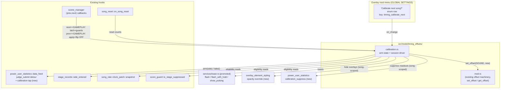
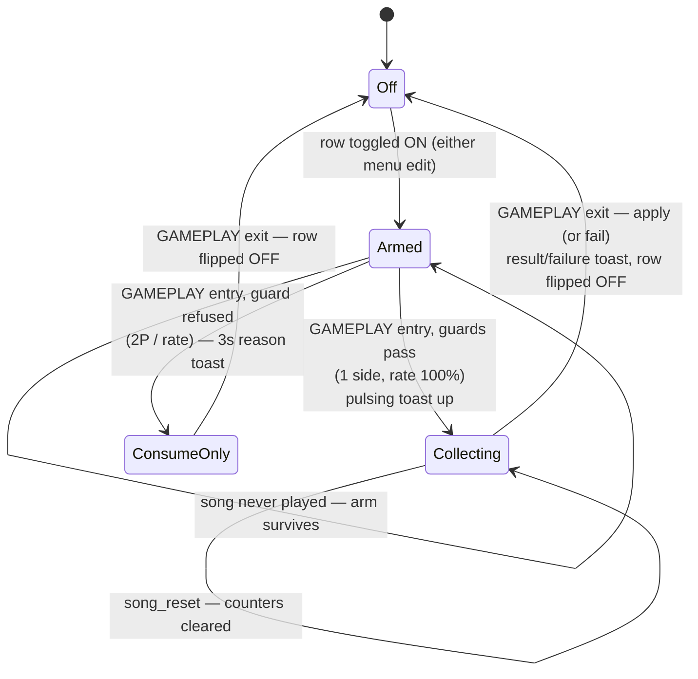

# Detailed Design — Auto-Calibration (Timing Offsets)

Status: Approved 2026-08-26 (amended 2026-08-26 post-cabinet-validation: the
apply guard reads autoplay taint ALONE — `score_guard::is_autoplay_tainted`,
added for this — not `is_stage_suppressed`, which ORs in quick-fail/training/
assist-tick/rate score taints and misattributed a quick-exited song to
autoplay; and the apply path refreshes the overlay SOUND OFFSET row's
displayed value, which only updates through menu edits. Sign direction of the
correction CABINET-VERIFIED: a −40 ms mis-set converged back to baseline.)

## Overview

Auto-calibration is a StepMania-AutoSync-style feature for the DDR World hook
DLL: the operator arms "Calibrate next song?" from the overlay mod menu, plays
one song while timing to the audio, and the DLL measures the player's mean
per-step timing error and folds it into the cabinet-global `SOUND_OFFSET` so
that subsequent songs are in sync with the machine's real audio latency.

The feature is a sub-feature of the existing **timing-offsets mod** (it reads
and writes the same SOUND_OFFSET value through the mod's existing config-map
write path), consumes per-step ms-error data from the existing `judge_submit`
detour owned by `power_user_statistics::data_feed` (made idempotently
installable so it works with that mod disabled), and reports progress/results
through the Training Mode toast, promoted to a shared service with a pulsing
persistent mode.

Nothing about the feature persists: the arm toggle is in-memory, defaults OFF
at boot, and is consumed (flipped OFF) by the end of any song played while it
is ON — whether calibration succeeded, failed, or was refused.

During the calibration song itself, every timing-feedback surface is hidden so
the player plays naturally to the audio instead of chasing the current
judgment windows: the judgement/combo/pacemaker overlay clips are forced to
opacity 0 through the overlay-element-styling mod's existing apply paths, and
power_user_statistics' realtime readouts (timing-stats widget,
pacemaker→ms-error swap) are suppressed for the song.

## Detailed Requirements

Consolidated from the accepted decision register:

1. **Placement (D1)**: calibration code lives inside the timing-offsets mod.
   `src/mods/timing_offsets.rs` becomes the directory
   `src/mods/timing_offsets/` (`mod.rs` = existing content, `calibration.rs` =
   new), per the project rule that mods outgrowing one file get a subdirectory.
2. **Control surface (D9)**: one contributed overlay row on the GLOBAL
   SETTINGS tab via the frozen `mod_menu::register_enum_row` API — key
   `timing_calibrate_next`, label "Calibrate next song?", values `[0,1]`,
   labels `["OFF","ON"]`, grouped under the `timing-offsets` section and
   registered before the four offset scalar rows so it renders at the top of
   the section. No custom_options registration, no in-game options-menu
   presence, no per-player state, no label textures, no persistence.
3. **Arm semantics (D5, D10, D13, D16)**: the arm is an in-memory flag,
   default OFF at boot, never written to `mod-config.json`. It latches at
   GAMEPLAY (scene 28) entry; edits mid-song apply to the next song. **One
   rule: any song ending while the toggle is ON flips it OFF** — success,
   failure, or refusal all consume the arm.
4. **Eligibility (D4, D6, D16, D17)**, evaluated at GAMEPLAY entry:
   - Exactly one entered side (via `stage_records::side_entered`) ⇒ calibrate
     that side. Two entered sides ⇒ refuse with a 3 s toast
     "2P MODE DETECTED, CALIBRATION DISABLED". Zero/unreadable ⇒ refuse
     silently (one WARN).
   - Song-rate ≠ 100 % (song-playback-speed active) ⇒ refuse with a 3 s toast
     "SONG SPEED ACTIVE, CALIBRATION DISABLED" (ms errors are content-domain,
     audio latency is wall-domain — samples would be rate-scaled).
   - Training mode is allowed; per-song judgement offsets and JUDGEMENT TIMING
     apply as normal **by design** (D15 — they are additive master-data
     corrections, so measuring with them active is the most representative).
5. **Sampling (D4)**: per-step signed ms errors from the calibrated side only,
   grades Marvelous/Perfect/Great/Good/Boo (judge opcodes `0x1028..=0x102C`);
   Miss (window-edge delta) and OK (freeze hold, no ms error) excluded. Plain
   arithmetic mean, no outlier trimming.
6. **Apply (D2, D3, D5, D7)**, at GAMEPLAY exit:
   - Autoplay-tainted side (`score_guard::is_autoplay_tainted` — autoplay
     ALONE, not the broader `is_stage_suppressed` score-policy OR: quick-fail
     / training / assist-tick / rate taints leave the steps humanly real, so
     a quick-exited calibration song still measures honestly) ⇒ refuse.
   - Fewer than **30** samples ⇒ refuse ("NOT ENOUGH STEPS").
   - `abs(mean)` > **500 ms** ⇒ refuse (garbage run).
   - Otherwise `new = clamp(old + round(mean), -1000, 1000)` written via the
     mod's existing `set_offset(SOUND, new)` (live config-map push +
     `mod-config.json` persistence), followed by a refresh of the overlay
     SOUND OFFSET row's displayed value (idempotent re-registration — the
     row store only updates through menu edits, and a stale display would
     let a later edit step from the pre-calibration value). The game latches
     SOUND_OFFSET into the `GamePlayActor` at construction, so the write is
     effective from the next song with no extra work.
7. **Feedback (D8, D14)**:
   - While calibrating: a **pulsing** toast "Calibrating..." (slow fade
     in/out loop) at the bottom-center for the duration of the song.
   - On success: a 5 s toast `CALIBRATED: {old} -> {new} ({+delta} MS)` plus an
     INFO log with sample count, mean, and standard deviation.
   - On refusal/failure: a 3 s reason toast plus a WARN log.
8. **Data source (D1)**: `power_user_statistics::data_feed::install` becomes
   idempotent (returns `true` when the detour is already installed);
   timing-offsets' `init` also calls it. The hook body gains a calibration tap
   costing one relaxed atomic load per judgment when disarmed.
9. **Restart integrity (D12)**: `song_reset::on_song_reset` (in-place quick
   restarts and Training Mode scrubs/loops never leave scene 28) resets the
   sample accumulator; the session stays armed and applies at the eventual
   GAMEPLAY exit.
10. **Sign convention (D3, D11)**: per-step error is
    `playhead_music_count − note.music_count` — negative = early, positive =
    late. SOUND_OFFSET semantics: higher = audio plays later;
    `mean(error) ≈ real_latency − SOUND_OFFSET`, so a positive mean raises the
    offset. The mean measures the net of the whole latency chain; folding it
    into SOUND_OFFSET is the intent. **Direction CABINET-VERIFIED
    2026-08-26**: with the offset deliberately mis-set −40 ms, one calibration
    song converged the value back to within a few ms of the known-good
    baseline, and play at the calibrated value timed cleanly.
11. **Hide judgement overlays during calibration (D18)**: visible judgements
    bias the player toward satisfying the CURRENT offset instead of playing
    naturally to the audio. While a `Collecting` session is live, the gameplay
    overlay elements tracked by the overlay-element-styling mod — step
    judgement (`dance_judge`), freeze O.K./N.G. (`dance_judge_for_freeze`),
    FAST/SLOW (`dance_fast_slow`), combo (`dance_combo_root*`), and pacemaker
    (`dance_score_compare`) — are forced to opacity 0 for BOTH sides via a
    per-song override inside that mod. Fail-open: if the
    overlay-element-styling mod is disabled (its clip hooks aren't live),
    calibration proceeds with visible overlays and one WARN.
12. **Suppress PUS timing readouts during calibration (D19)**: the
    power_user_statistics realtime timing widget (live `Current: +Xms`) and
    the pacemaker→ms-error swap leak the exact signal being calibrated. While
    a `Collecting` session is live, a suppression flag in
    power_user_statistics keeps the timing-stats widget hidden and makes the
    pacemaker swap return the stock value (and skip its force-visible write).
    Data collection (data_feed buffers, CSV export) is unaffected.

## Architecture Overview



Session lifecycle:



## Components and Interfaces

### 1. `src/mods/timing_offsets/` (restructure)

`src/mods/timing_offsets.rs` moves to `src/mods/timing_offsets/mod.rs`
unchanged except for:

- `mod calibration;` and lifecycle wiring:
  - `init`: also call `power_user_statistics::data_feed::install(ctx.signatures)`
    (idempotent; failure just disables calibration with one WARN — the offset
    rows are unaffected).
  - `enable`: call `calibration::enable()` after `register_overlay_rows()`
    ordering is settled (see row registration below).
  - `disable`: call `calibration::disable()` (unregister callbacks, disarm,
    dismiss any pulsing toast, remove the row key from `remove_rows_for`).
- `register_overlay_rows()` registers the calibrate row FIRST (contributed
  rows render in insertion order within the mod's section), then the four
  scalar offset rows as today.

The existing public surface (`set_offset`, `get_offset`, field constants) is
unchanged; calibration calls them directly as sibling module functions. The
calibrate row is not a `FieldDef` and is untouched by `persist_all()` /
`push_all_configured()` / `push_all_stock()`.

### 2. `src/mods/timing_offsets/calibration.rs` (new)

State (all `static`, atomics + one small `Mutex` where needed):

```rust
/// Row value: operator intent. Never persisted.
static ARMED: AtomicBool;
/// Session for the song currently in scene 28.
enum Session { Idle, Collecting { side: u8 }, ConsumeOnly }
static SESSION: Mutex<Session>;
/// Callback handles for teardown.
static SCENE_CB: ...; static RESET_CB: ...;
```

Public functions (called from `mod.rs`):

- `enable()` — registers the row (`register_enum_row`, spec below), the scene
  callback, and the song_reset callback. Gated on
  `data_feed::is_installed()`; if the feed is unavailable the row is not
  registered and one WARN is logged.
- `disable()` — unregisters callbacks, `rows::remove_rows_for(&["timing_calibrate_next"])`,
  disarms, dismisses the toast, clears the overlay-hide override and the PUS
  suppression if a session was live.

Row spec:

```rust
EnumRowSpec {
    key: "timing_calibrate_next",
    label: "Calibrate next song?",
    hint: "Measures your timing next song and adjusts Sound Offset. \
           Play one player, time your steps to the music.",
    parent_row_key: Some("timing-offsets"),
    values: vec![0, 1], labels: vec!["OFF", "ON"],
    initial_value: 0,
    on_change: |v| ARMED.store(v != 0),
}
```

Programmatic flip-OFF (song end) re-registers the identical spec with
`initial_value: 0` — `register_enum_row` replaces by key (documented idempotent
re-registration), so no new `mod_menu` API is needed; the frozen rows API stays
frozen. The tab list rebuilds from the contributed-row store on every menu
open, so the row reads OFF the next time anyone looks.

Scene callback (`scene_manager::on_scene_change`, fires with `(prev, next)`):

- `next == scene::GAMEPLAY && ARMED`:
  1. Entered-side census: `stage_records::side_entered(0/1)`.
     - exactly one `Some(true)` → candidate side;
     - two → `Session::ConsumeOnly` + 3 s toast `2P MODE DETECTED, CALIBRATION DISABLED`;
     - zero / any `None` → `Session::ConsumeOnly`, WARN, no toast.
  2. Rate guard: `song_rate::clock_patch::snapshot().is_non_identity_commit()`
     → `Session::ConsumeOnly` + 3 s toast `SONG SPEED ACTIVE, CALIBRATION DISABLED`.
     (Belt-and-braces: re-checked at apply time; the loader-thread commit
     completes before scene-28 entry, but the second check is free.)
  3. Guards pass: `data_feed::calibration_arm(side)`,
     `Session::Collecting { side }`,
     `toast::show_pulsing("Calibrating...")`,
     `overlay_element_styling::set_calibration_hide(true)` (both sides; one
     WARN if the styling mod is inactive — overlays stay visible, D18
     fail-open), and
     `power_user_statistics::set_calibration_suppress(true)` (timing widget +
     pacemaker swap, D19). The hide/suppress calls happen in the scene-entry
     callback, which runs before the song's overlay clips are created, so the
     bind-time opacity one-shots see the override.
- `prev == scene::GAMEPLAY` (fires for every exit shape: natural end,
  quick-restart/fail redirects, course inter-stage):
  1. `Session::Collecting { side }` → `let stats = data_feed::calibration_take();`
     dismiss pulsing toast; clear the hide override and the PUS suppression;
     run the pure decision function (below); execute its outcome (apply + 5 s
     success toast, or 3 s failure toast + WARN).
  2. Any non-idle session → `ARMED.store(false)` + re-register row OFF.
  3. `Session::Idle` → nothing.

`song_reset::on_song_reset` callback: if `Session::Collecting`, call
`data_feed::calibration_reset()` (the pulsing toast stays up; the session and
side are unchanged — a scrub/loop/quick-restart re-measures from scratch).

Pure decision core (host-testable, no game access):

```rust
pub struct CalibStats { pub sum: i64, pub sum_sq: i64, pub count: u32 }

pub enum Outcome {
    Apply { new_offset: i32, mean: f64, stddev: f64 },
    RefuseTooFewSamples { count: u32 },
    RefuseMeanOutOfRange { mean: f64 },
    RefuseAutoplay,
}

pub fn compute(stats: &CalibStats, old_offset: i32, autoplay_tainted: bool) -> Outcome
```

- `autoplay_tainted` = `score_guard::is_stage_suppressed(side)` read by the
  caller.
- `mean = sum as f64 / count as f64`; apply requires `count >= 30` and
  `mean.abs() <= 500.0`.
- `new_offset = (old_offset as f64 + mean).round().clamp(-1000.0, 1000.0) as i32`
  (round half away from zero, matching player expectation for ±0.5 ms means).
- `stddev` is derived from `sum_sq` for the INFO log only (never gates).

Constants: `MIN_SAMPLES: u32 = 30`, `MAX_ABS_MEAN_MS: f64 = 500.0`.

Apply path (impure wrapper): `let old = get_offset(SOUND_IDX);` → `compute` →
on `Apply`, `set_offset(SOUND_IDX, new_offset)` (existing clamp + live map push
+ JSON persistence), then
`toast::flash_with_hold(format!("CALIBRATED: {old} -> {new} ({delta:+} MS)"), 5000)`
and `log_info!` with count/mean/stddev.

### 3. `src/mods/power_user_statistics/data_feed.rs` (amend)

- **Idempotent install**: at the top of `install`, if `DETOUR.get().is_some()`
  return `true` (currently a second call fails on `DETOUR.set`). Add
  `pub fn is_installed() -> bool`.
- **Calibration tap** (new statics + three functions):

```rust
/// Side being calibrated, or -1 when disarmed. One relaxed load per judgment.
static CALIB_SIDE: AtomicI32 = AtomicI32::new(-1);
static CALIB_SUM: AtomicI64; static CALIB_SUM_SQ: AtomicI64; static CALIB_COUNT: AtomicU32;

pub fn calibration_arm(side: usize);          // resets counters, sets side
pub fn calibration_reset();                   // counters only (song_reset)
pub fn calibration_take() -> CalibStats;      // snapshot + disarm (side = -1)
```

- Hook-body addition, inside the existing `has_ms_error` branch (so OK is
  already excluded), gated on grade: only `grade_index <= 4` (M/P/G/Gd/Boo —
  excludes Miss at index 5) and `player_side as i32 == CALIB_SIDE`:

```rust
CALIB_SUM.fetch_add(ms_error as i64, Relaxed);
CALIB_SUM_SQ.fetch_add((ms_error as i64) * (ms_error as i64), Relaxed);
CALIB_COUNT.fetch_add(1, Relaxed);
```

  Pure atomics — no locks, no allocation, panic-free; cost when disarmed is a
  single relaxed load and compare. (Relaxed suffices: the take happens on the
  scene-change thread strictly after the last judgment of the song; a torn
  read across sum/count would require concurrent judgments during `take`,
  which cannot happen after gameplay exits. `calibration_take` reads count
  last and tolerates the theoretical off-by-one-step race — 1 sample in 30+
  moves the mean negligibly.)

- Ownership note: the tap lives in data_feed because the detour body is the
  only place the per-step error exists; the calibration POLICY (guards,
  formula, UI) stays in `timing_offsets/calibration.rs`. data_feed remains
  otherwise unchanged (buffers, CSV, pacemaker untouched).

### 4. `src/mods/overlay_element_styling/mod.rs` (amend — D18)

A calibration-hide override, additive and orthogonal to the mod's per-side
option values:

```rust
/// Calibration hide: when true, every tracked overlay element renders at
/// opacity 0 on both sides (calibration song). Orthogonal to the per-side
/// option values — cleared by the calibration session, never persisted.
static CALIBRATION_HIDE: AtomicBool = AtomicBool::new(false);

/// Song-scoped hide used by timing_offsets::calibration. Returns false when
/// the styling mod is not enabled (hooks not live) so the caller can WARN.
pub fn set_calibration_hide(on: bool) -> bool;
```

Consulted at the top of the mod's two opacity read paths — `opacity_pct`
(registry-preferred, used by the bind-time one-shot for Judge / FreezeJudge /
FastSlow) and `opacity_pct_fast` (atomic-only, used by the SetColor compose
detours for Combo / Pacemaker) — returning 0 when set. Those two functions are
the complete set of opacity consumers, so the override covers every tracked
element with no new hooks:

- Judge / FreezeJudge / FastSlow: alpha-0 one-shot at clip bind (the one-shot
  runs whenever the effective opacity ≠ 100, so 0 qualifies). This is why the
  override must be set at scene ENTRY, before the song's clips bind.
- Combo / Pacemaker: zeroed by the compose detour on every game color write —
  also neutralizes pacemaker_swap's force-visible attribute write (attribute
  visibility and color alpha are independent channels; alpha 0 wins visually).

`set_calibration_hide(true)` returns whether the mechanism is live (mod
enabled + hooks installed); `false` triggers the caller's single fail-open
WARN. The mod's own `disable()` also clears the flag (belt and braces).

### 5. `src/mods/power_user_statistics/mod.rs` + sub-features (amend — D19)

```rust
/// Calibration suppression: while true, the realtime timing readouts stay
/// hidden (they leak the signal being calibrated). Song-scoped, set/cleared
/// by timing_offsets::calibration. Data collection is unaffected.
static CALIBRATION_SUPPRESS: AtomicBool = AtomicBool::new(false);
pub fn set_calibration_suppress(on: bool);
```

Consumers (both already read their gates live on every judge dispatch, so the
flag check drops in beside the existing option reads):

- `timing_stats_widget::update_text`: early-return before the widget is shown
  while suppressed. Suppression is set at scene entry — before the first
  judgment — so the widget never becomes visible during the calibration song
  (no mid-song hide needed; the existing scene-exit hide covers teardown).
- `pacemaker_swap`: while suppressed, the swap callback returns the stock
  value and skips its force-visible write (`NoteResultActor+0xC0`), exactly as
  if the option were OFF for that song.

Unconditional no-op when the PUS mod is disabled (widget destroyed, patch
restored — nothing to suppress).

### 6. `src/services/toast.rs` (promoted from `src/mods/training_mode/toast.rs`)

The module moves verbatim in structure (single lazily-created `TextWidget`,
bottom-center 640/630, scale 1.2, amber with black outline, generation-tokened
self-requeueing render-thread animation, no locks across the re-queue
schedule) with these API changes:

```rust
pub fn flash(text: impl Into<String>);                 // 100/250/300 ms (today's behavior)
pub fn flash_with_hold(text: impl Into<String>, hold_ms: u64); // 3 s / 5 s toasts
pub fn show_pulsing(text: impl Into<String>);          // loops until dismissed/superseded
pub fn dismiss();                                      // unconditional hide (unchanged)
```

- `ToastState.text` becomes `String` (result toasts carry formatted numbers).
- `ToastState` gains `mode: ToastMode` where
  `enum ToastMode { Flash { hold_ms: u64 }, Pulse }`.
- `fade_alpha` is generalized: `Flash` keeps the 100 ms in / hold / 300 ms out
  curve with a per-toast hold; `Pulse` evaluates a smooth loop —
  800 ms fade-in → 800 ms hold → 800 ms fade-out → 400 ms dark gap, repeating
  (`elapsed % 2800`), never returning `None` (only supersession or `dismiss`
  ends it). The pulse floor is 0.0 alpha at the gap, giving the requested
  "slowly fades in and out for the duration of the song".
- `src/mods/training_mode/toast.rs` is deleted; the three
  `super::toast::show(...)` call sites in `src/mods/training_mode/bounds.rs`
  and the `toast::dismiss()` in `src/mods/training_mode/mod.rs` switch to
  `crate::services::toast::{flash, dismiss}`.
- Known benign edge: `dismiss()` is unconditional and shared — disabling
  Training Mode mid-calibration-song hides the pulsing toast (measurement is
  unaffected). Accepted; not worth a token-scoped dismiss.
- Registration in `src/services/mod.rs`. No init required (lazy widget).

### 7. Wiring summary (files touched)

| File | Change |
|------|--------|
| `src/mods/timing_offsets.rs` → `src/mods/timing_offsets/mod.rs` | move; add `mod calibration`, lifecycle calls, row-order change |
| `src/mods/timing_offsets/calibration.rs` | new — everything in §2 |
| `src/mods/power_user_statistics/data_feed.rs` | idempotent install, `is_installed`, calibration tap |
| `src/mods/overlay_element_styling/mod.rs` | `CALIBRATION_HIDE` override in the two opacity read paths |
| `src/mods/power_user_statistics/mod.rs` (+ `timing_stats_widget.rs`, `pacemaker_swap.rs`) | `CALIBRATION_SUPPRESS` flag + two consumer checks |
| `src/services/toast.rs` | new (promoted); pulsing + hold + String |
| `src/services/mod.rs` | `pub mod toast;` |
| `src/mods/training_mode/toast.rs` | deleted |
| `src/mods/training_mode/{bounds.rs,mod.rs}` | call sites → `services::toast` |

No new signatures, no new detours, no config keys, no textures.

## Data Models

- **CalibStats** `{ sum: i64, sum_sq: i64, count: u32 }` — per-song filtered
  accumulator. With |error| ≤ ~200 ms and count ≤ ~10⁴, `sum_sq` peaks around
  4×10⁸ — far inside i64.
- **Session** `{ Idle | Collecting { side: u8 } | ConsumeOnly }` — the
  scene-28 lifecycle state; guarded by a Mutex touched only in scene/reset
  callbacks (never on the judge hot path).
- **ARMED: AtomicBool** — mirrors the overlay row; the row store inside
  mod_menu holds the display copy, synchronized by `on_change` (user edits)
  and idempotent re-registration (programmatic flip-OFF).
- **Offset domain**: i32 milliseconds, clamped [-1000, 1000], stock default
  87; "higher = audio later". SOUND is canonical field index 0 in the
  timing-offsets field table.
- **Per-step error domain**: i32 milliseconds, negative = early, positive =
  late (`playhead_music_count − note.music_count`), read at `scratch+4` in the
  `judge_submit` detour; grade = opcode − 0x1028 (0..=6 = M/P/G/Gd/Boo/Miss/OK).

## Error Handling

Fail-open everywhere; the offset rows and the rest of the mod never degrade
because calibration can't run.

| Failure | Behavior |
|---------|----------|
| `judge_submit` signature unresolved (data_feed install fails) | calibrate row not registered; one WARN; offset rows unaffected |
| `scene_manager` / `song_reset` unavailable | calibrate row not registered; one WARN |
| `stage_records::side_entered` returns `None` | ConsumeOnly (no toast), WARN |
| Two entered sides | ConsumeOnly + 3 s toast (by design, D16) |
| Song rate ≠ 100 % | ConsumeOnly + 3 s toast |
| Autoplay taint at apply | refuse + 3 s toast `AUTOPLAY ACTIVE, CALIBRATION DISCARDED` + WARN |
| `count < 30` | refuse + 3 s toast `CALIBRATION FAILED: NOT ENOUGH STEPS` + WARN |
| `abs(mean) > 500` | refuse + 3 s toast `CALIBRATION FAILED: TIMING TOO INCONSISTENT` + WARN |
| Widget creation refused (render thread) | toast drops silently (existing behavior); calibration math unaffected |
| `overlay-element-styling` mod disabled | no clip hooks live ⇒ no hide path; calibration proceeds with visible overlays, one WARN (D18 fail-open) |
| `power-user-statistics` mod disabled | nothing to suppress (widget destroyed, patch restored); suppress call is a no-op |
| Mod disabled mid-session | `disable()` disarms, dismisses toast, clears hide/suppress, removes row; nothing applied |

Threading/safety rules honored:

- The judge-hook addition is lock-free, allocation-free, and panic-free
  (project rule 1/4: no panics across FFI, hot paths tight).
- Scene and reset callbacks run inside `catch_unwind` contexts provided by
  `scene_manager` / `song_reset`; the calibration bodies still avoid
  `unwrap`/indexing.
- All widget work goes through `widget_renderer::run_on_render_thread`; no
  state mutex is held across a schedule (existing toast discipline).
- `set_offset` is called from the scene callback (game thread) — the same
  thread class as its existing overlay `on_change` callers.

## Testing Strategy

**Host tests** (pure layers, no game): `calibration::compute` and the toast
fade curves are pure functions.

- `compute`: apply/refuse boundaries (count 29/30; mean ±500.0 edge; clamp at
  ±1000; rounding of ±0.5 means; sign direction: positive mean raises the
  offset; stddev derivation), autoplay refusal precedence.
- Pulse curve: alpha loops (never `None`), period arithmetic, flash hold
  parameterization (250 / 3000 / 5000 ms).
- Runner: `scripts/validate_auto_calibration.sh` using the temp-crate harness
  pattern established by `scripts/validate_judgement_offsets.sh` (plain
  `cargo test` cannot compile the `retour` dependency on ARM hosts).

**Cabinet validation** (the project's only real integration harness), in the
implementation plan:

1. **Sign direction (the one deliberate unknown)**: with a known-good cabinet,
   deliberately set SOUND_OFFSET 30 ms low via the overlay row, calibrate one
   song timing to the audio, confirm the INFO log
   (`calibration: old=57 mean=+29.8 count=213 stddev=18.4 -> new=87`) moves the
   value back toward the baseline. If it moves away, flip the sign in
   `compute` (one character) — the log makes the outcome unambiguous.
2. Toast behavior: pulsing visible for the song duration, 5 s result toast,
   3 s refusal toasts, no toast bleed into the results screen.
3. Arm consumption: verify the row reads OFF after (a) a successful run,
   (b) a too-few-steps run, (c) a 2P refusal, (d) a song-speed refusal; and
   stays ON if the toggle is set but no song is played.
4. Quick restart / Training Mode scrub: counters reset (log the count at
   apply; scrub mid-song and confirm the count reflects only post-reset steps).
5. Overlay hiding: during a calibration song, step judgements, freeze
   O.K./N.G., FAST/SLOW, combo, and pacemaker are all invisible; the PUS
   timing-stats widget stays hidden even with `timing_stats` ON; everything
   reappears on the next (non-calibration) song. With
   `overlay-element-styling` disabled in `mod-config.json`, calibration still
   runs (overlays visible, one WARN in the log).
6. Regression: timing-offsets scalar rows still adjust and persist; Training
   Mode marker toasts still flash; PUS timing stats and overlay styling values
   behave normally on non-calibration songs (no stuck opacity-0 or suppressed
   widgets); calibration works with PUS disabled in `mod-config.json`.

## Appendix: alternatives considered

- **Standalone mod**: rejected — calibration is conceptually a timing-offsets
  feature, and co-location removes the "write silently ignored while the
  timing-offsets mod is disabled" failure mode (the row is hidden with the mod).
- **Per-player custom_options row (both menus, mirrored)**: rejected — the
  value is cabinet-global, so per-side state, mirroring, persistence modes,
  and label textures were all accidental complexity. The overlay GLOBAL
  SETTINGS row matches the value's actual scope.
- **Second detour on `judge_submit`**: forbidden by the one-detour-per-target
  project rule; the idempotent-install + tap approach keeps a single owner.
- **Median / trimmed mean**: deferred — plain mean matches StepMania's
  AutoSync behavior and the min-samples + max-mean guards cover the
  garbage-run cases; revisit only if cabinet experience shows outlier skew.
- **Excluding Boo grades**: considered (large deltas), kept — a consistent
  player produces few Boos, and excluding them biases the mean toward the
  window center on noisy runs.
- **Own clip-capture fallback for overlay hiding when the styling mod is
  disabled**: rejected — it would duplicate the CMovieClip Create/SetColor
  detour set (violating the one-detour-per-target spirit via a parallel
  registry) for an edge case; fail-open with a WARN is proportionate, since
  visible overlays only add noise to the measurement, not error.
