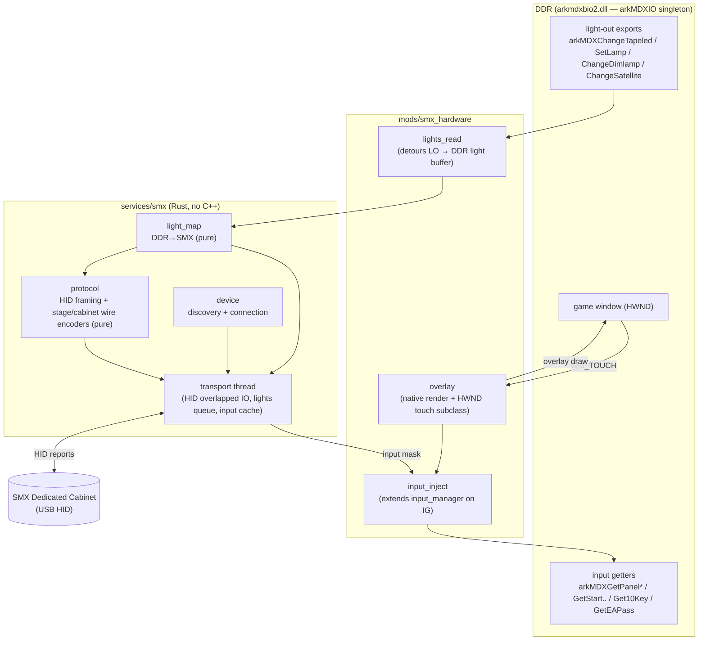
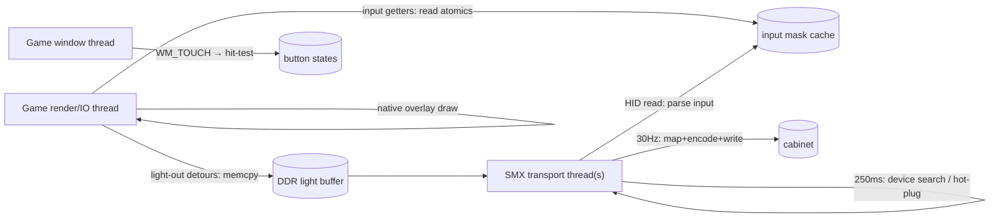

# Detailed Design — Native StepManiaX Hardware Support

Status: Approved 2026-08-27 (amended 2026-08-27: on-device/manual validation only —
host-test harness dropped; see Testing Strategy)

## Overview

`smx-hardware` is a new top-level mod for the DDR World Universal Modpack that makes
the modpack DLL talk **directly** to a StepManiaX (SMX) Dedicated Cabinet from inside
the game process:

- **Reads** the game's Gold-Cabinet light output and drives the SMX cabinet's lights
  (stage panels, marquee, vertical strips, spotlights).
- **Reads** the SMX stage panel sensors and injects them into the game as arrow/menu
  input; also keypad and card-in.
- **Renders** a native touchscreen overlay (per-player menu nav, 10-key pinpad,
  insert-card, per-player visibility toggle) through the game's own render pipeline.

This ports the maintainer's standalone **SpiceManiaX** app into the DLL and **removes
the SpiceAPI dependency** (no loopback TCP JSON-RPC, no separate process), for the
lowest achievable IO latency.

**Loader model (unchanged):** the DLL is still injected by spice2x's `-k` flag, and
spice2x (or bemanitools) remains the game loader and the DDR IO/board/DRM/network
emulator. This feature replaces only the SpiceManiaX process + the SpiceAPI comms
between game and cabinet. Because it hooks the *game's own* `arkMDX*` IO layer (not
spice2x internals), it is **loader-agnostic** — it works under any loader that
supplies the underlying IO emulation.

**In scope:** SMX Dedicated Cabinet; DDR in Gold-Cabinet (BIO2) mode — i.e. the
`arkmdxbio2.dll` target the modpack already builds against. Full lights + inputs +
touchscreen overlay parity with SpiceManiaX.

**Non-goals:** emulating the BIO2/ICCA/eamuse boards ourselves (spice2x/bemanitools
keeps doing that); SMX AIO/DX cabinets; non-Gold DDR cabinet lighting; the SMX config
editor / sensor-test / firmware-animation SDK features.

## Detailed Requirements

### Functional

- **FR-1 Lights capture.** Detour the game's `arkmdxbio2.dll` light-output exports to
  observe every light write without disturbing the game or spice2x:
  - `arkMDXChangeTapeled` — per-LED RGB tape (feet ×4/player, top panel, monitor
    strips), accumulated into an `[11][50][3]` buffer keyed like spice2x's
    `DDR_TAPELEDS`.
  - `arkMDXSetLamp` / `arkMDXChangeDimlamp` / `arkMDXChangeSatellite` — named/dim/
    side lamps (stage corners, woofer corners, etc.).
- **FR-2 Lights output.** Map captured DDR lights → SMX and push to the cabinet at
  ~30 Hz, reproducing SpiceManiaX's mapping exactly:
  - Stage (both pads, 9 panels × 25 LEDs): arrow panels ← foot tape 25:1; corner
    panels ← corner-light on/off as an L-shape over static gold; center ← static
    gold.
  - Marquee ← 40 top-panel LEDs → 24 logical SMX LEDs (conflict-averaged).
  - Vertical strips ← 25 monitor LEDs → 28 SMX LEDs (interpolated).
  - Spotlights ← woofer-corner brightness → 8 white LEDs/side.
- **FR-3 Input capture.** The SMX transport caches each pad's 9-bit panel mask,
  updated event-driven on HID input reports (change callback).
- **FR-4 Input injection.** Extend `input_manager` to feed SMX-derived state to
  game-side callers of the `arkMDX*` input getters:
  - `arkMDXGetPanelUp/Down/Left/Right` — arrows (gameplay).
  - `arkMDXGetStart/Up/Down/Left/Right`, `arkMDXGet10Key` — menu + keypad (overlay).
  - `arkMDXGetEAPass` — card-in (overlay).
- **FR-5 Touchscreen overlay.** Render, in the game's native pipeline, a per-player
  overlay: 5 menu-nav buttons (Up/Down/Left/Right/Start), a 12-key pinpad, an
  Insert-Card button (when a card id is configured), and an overlay-visibility
  toggle. Capture touch on the game window; hit-test; drive FR-4 injection.
- **FR-6 Card-in.** Pressing Insert-Card writes the player's configured card id into
  `arkMDXGetEAPass`'s output for game-side callers (one scan).
- **FR-7 Config.** New `smx_hardware` config section: `p1card`, `p2card`,
  `overlay_opacity`, and mapping/enable toggles. Mod default **OFF**.
- **FR-8 Lifecycle.** Standard mod: `enable()` connects the SMX transport, installs
  the light-read detours, extends input injection, and creates the overlay;
  `disable()` reverses all of it and reverts the game to normal input/lights.

### Non-Functional

- **NFR-1 macOS-buildable.** Pure Rust; no C/C++, no `SMX.dll`, no second toolchain.
  Builds under the existing `cargo-xwin` (`x86_64-pc-windows-msvc`) flow.
- **NFR-2 No panics across FFI.** Every detour body, HID callback, and WndProc is
  panic-contained or panic-free (repo rule 1).
- **NFR-3 Tight hot paths.** The light-read detours and input-getter detours do O(1)
  work (copy bytes / read atomics); mapping + USB IO happen off the game thread
  (repo rule 4).
- **NFR-4 Graceful degradation.** Missing exports/singleton ⇒ mod self-disables
  (`is_active()==false`). No cabinet connected ⇒ mod enables but IO no-ops with one
  WARN. Hot-plug reconnects.
- **NFR-5 Shared-detour discipline.** Extend `input_manager`'s existing `arkMDX*`
  detours; never install a second detour on the same target (repo rule).
- **NFR-6 Verbatim, isolated core.** Wire encoders, DDR→SMX mapping, input bit
  translation, and overlay geometry/hit-testing are kept as pure, side-effect-free
  modules (ported near-verbatim from the mature SpiceManiaX + SMX SDK sources) so
  they're easy to read and reason about. Validation is on-device/manual (see Testing
  Strategy) — no host-test harness.

### Assumptions (from the decision register)

Verbatim SpiceManiaX mapping (D6); SDK event-callback + getter-injection timing,
measured before adding more threads (D7); mod id `smx-hardware`, default OFF (D9);
SMX Dedicated Cabinet + DDR Gold-Cab/BIO2 only (D10); used instead of spice2x's own
SMX light mapping (D11).

## Architecture Overview

Two halves — a **hardware layer** (`services/smx/`, game-agnostic SMX transport +
mapping, mostly pure) and a **game-integration layer** (`mods/smx_hardware/`, the
`arkMDX*` detours, input-injection extension, and native overlay).



### Data flows

- **Lights (game → cabinet):** the light-out detours copy each write into a shared
  `DDR light buffer` (tight, on the game's thread). A ~30 Hz task in the SMX
  transport thread reads that buffer, runs `light_map` → stage + cabinet payloads,
  encodes them with `protocol`, and writes them over HID.
- **Inputs (cabinet → game):** the transport thread's HID read loop parses input
  reports and stores each pad's 9-bit mask in an atomic cache. When the game calls an
  `arkMDX*` input getter, the `input_inject` detour body ORs the SMX-derived state
  into the out-params (reusing `input_manager`'s `IN_MODPACK_POLL` re-entry pattern so
  the modpack's own poll still sees real state).
- **Overlay (touch → game):** the game window's subclassed WndProc receives WM_TOUCH,
  hit-tests against the button geometry, and sets atomic button states; those states
  feed the same `input_inject` path (menu/pinpad/card) and the native render pass.

### Thread model



- The SMX transport owns its own thread(s) — device discovery (~250 ms poll) and the
  overlapped HID read/write + lights-queue drain. Priority `ABOVE_NORMAL` (NOT
  `HIGHEST` — repo rule 4; the stock SDK used HIGHEST, but we run inside the game and
  must not starve its input/render).
- No state `Mutex` is held across a game-render-thread schedule; cross-thread state is
  atomics / small locked snapshots (mirrors the existing `input_manager` and
  `overlay_draw` patterns).

## Components and Interfaces

### `services/smx/` (hardware layer — mostly game-agnostic)

- **`protocol.rs` (pure).** HID packet framing + light wire encoders. No IO.
  - `fn frame_serial_command(cmd: &[u8]) -> Vec<HidReport>` — split a serial command
    into report-id-5 64-byte HID output reports with START/END flags.
  - `fn parse_input_report(report: &[u8; 64]) -> Option<u16>` — report-id-3 → 9-bit
    mask.
  - `fn encode_stage_lights(pad: &StageLights) -> [SerialCommand; 3]` — the 3 tagged
    commands (`4`/`2`/`3`), with the ×0.6666 scale and V3/V4 timing metadata.
  - `fn encode_cabinet_light(dev: CabinetDevice, model: u8, rgb: &[Rgb]) -> SerialCommand`
    — the `L`/`Q` command with per-device/model channel reorder, reverse, and
    zero-pad to 32|8 triplets.
- **`light_map.rs` (pure).** DDR light state → SMX payloads. Direct port of
  `SpiceManiaX/lights_utils.cpp`.
  - `fn map_stage(tape: &DdrTape, lamps: &DdrLamps) -> StageLights` (both pads).
  - `fn map_marquee(top_panel: &[Rgb; 40]) -> [Rgb; 24]` (conflict-average).
  - `fn map_strip(monitor: &[Rgb; 25]) -> [Rgb; 28]` (interpolate).
  - `fn map_spotlights(woofer_brightness: u8) -> [Rgb; 8]`.
- **`device.rs` (impure edge).** HID discovery + connection via the `windows` crate
  (`SetupAPI` + `HidD_*` + overlapped `ReadFile`/`WriteFile`). VID `0x2341`, PID
  `0x8037`, product-string filter (`StepManiaX`=stage / `SMXArcade`=cabinet). Owns
  the per-device overlapped read/write buffers.
- **`transport.rs` (impure).** The transport thread(s): device search loop, HID read
  loop (→ input cache + `"I"` handshake → cabinet model), and the 30 Hz lights drain
  (map+encode+write). Public service API:
  - `fn init(cfg) -> bool` / `fn shutdown()`.
  - `fn is_available() -> bool` (≥1 stage device connected).
  - `fn input_mask(pad: usize) -> u16` (atomic read).
  - `fn submit_lights(frame: DdrLightFrame)` (from the light-read detours; latest-wins).
  - `fn cabinet_model() -> Option<u8>`.

### `mods/smx_hardware/` (game-integration layer)

- **`mod.rs`.** The `Mod` impl: `id="smx-hardware"`, `required_signatures` (the
  `arkMDXIO` singleton derivation — reuse `input_manager`'s), `init` (resolve the
  light-out exports + validate), `enable` (start transport, install light-read
  detours, turn on input injection, create overlay), `disable` (reverse), `is_active`
  (self-disable if exports/singleton unresolved).
- **`lights_read.rs`.** Detours `arkMDXChangeTapeled` / `arkMDXSetLamp` /
  `arkMDXChangeDimlamp` / `arkMDXChangeSatellite`. Each body: forward to original,
  then copy args into the shared `DdrLightFrame` (tape buffer + lamp scalars). A
  coalescing tick (or the transport's 30 Hz drain) submits frames.
- **`input_inject.rs`.** Extends `input_manager`: registers the panel getters
  (`arkMDXGetPanel*`) into the existing detour set, and switches the getter detour
  bodies from *suppress-only* to *inject* (OR SMX state into out-params for game-side
  callers; keypad → write `buf1`; card → write the pending UID into `arkMDXGetEAPass`
  out-buffer). Gated by an "SMX injection active" flag so `input_manager` stays
  unchanged when the mod is off.
- **`overlay.rs`.** Native overlay render (reusing the modpack overlay path —
  `overlay_draw` command-list quads + `widget_renderer` text) + touch capture. The
  per-player button layout is ported from `SpiceManiaX/overlay_utils.cpp`.
- **`touch.rs`.** Locate the game HWND; subclass its WndProc (`SetWindowLongPtrW`
  `GWLP_WNDPROC`, chaining the original) and `RegisterTouchWindow`; handle WM_TOUCH
  (0.01 mm → px) and WM_LBUTTONDOWN/UP (debug); hit-test → set button states. Restore
  the original WndProc on disable.
- **`overlay_model.rs` (pure).** Button set construction, layout math, and
  point-in-button hit-testing (host-tested) — the geometry from
  `SpiceManiaX/overlay_utils.cpp` + `overlay_button.h`.

### Reused modpack services

`input_manager` (injection seam + singleton gate + suppression machinery), the
overlay render path (`overlay_draw`, `widget_renderer`), `mods::config` (config),
`core::hooks`/`core::signatures`/`core::scanner` (detours + export/singleton
resolution), and `core::logger` (`log_*!`).

## Data Models

### `arkMDXIO` hook points (confirmed on `arkmdxbio2_20260721.dll`)

All are thin wrappers over `SingletonArkMDXIO::mdxIO()` (the singleton
`input_manager` already derives + gates on) calling a vtable slot. Detouring the
exports sits above spice2x's `libacio` `ac_io_*` hooks (no double-hook).

| Export | vtable | Direction | Signature (effective) |
|---|---|---|---|
| `arkMDXChangeTapeled` | +0x3f0 | light-out | `(off1, off2, r, g, b)` per LED (to confirm) |
| `arkMDXSetLamp` | +0x370/+0x378 | light-out | `(id: u32, on: u8)` |
| `arkMDXChangeDimlamp` | +0x3d8 | light-out | `(id: u32, level: u32)` |
| `arkMDXChangeSatellite` | +0x3c0 | light-out | `(p1..p5)` (side/corner) |
| `arkMDXGetPanelUp/Down/Left/Right` | +0x310… | input | `(player: i32, *trigger: u32, *hold: u32)` |
| `arkMDXGetStart/Up/Down/Left/Right` | +0x2e0… | input | `(player: i32, *trigger: u32, *hold: u32)` |
| `arkMDXGet10Key` | +0x308 | input | `(player: i32, *buf1: [u8;12], *buf2: [u8;12])` |
| `arkMDXGetEAPass` | +0x2d8 | input | `(player: i32, *out, *out)` |

> The exact `arkMDXChangeTapeled` arg→(device,LED) decode and the
> lamp/satellite→light-name binding are confirmed by decompiling the vtable targets
> during Step 1 of the plan, cross-referenced to spice2x's `bi2a.cpp` off1/off2 device
> table and `mdxf.cpp` corner table. Strong prior: it matches spice2x's per-LED
> `ac_io_bi2a_control_tapeled_bright(off1,off2,r,g,b,bank)`.

### DDR tape device table (spice2x `DDR_TAPELEDS[11][50][3]`)

```
0 p1_foot_up   1 p1_foot_right  2 p1_foot_left  3 p1_foot_down   (25 LEDs)
4 p2_foot_up   5 p2_foot_right  6 p2_foot_left  7 p2_foot_down   (25)
8 top_panel    9 monitor_left  10 monitor_right                  (50)
```

### SMX side (from the SDK, matches SpiceManiaX)

- **Input mask** (`u16`, per pad): bits 0–8 = 9 panels, reading order `012/345/678`
  (bit1=Up, bit3=Left, bit4=Center, bit5=Right, bit7=Down; 0/2/6/8 corners).
- **SMX→DDR panel map** (injection): Up←bit1, Down←bit7, Left←bit3, Right←bit5.
- **Stage lights** (`SMX_SetLights2`): 2 pads × 9 panels × 25 LEDs × RGB = 1350 bytes;
  per panel 16 outer (4×4) then 9 inner (3×3).
- **Cabinet light input sizes**: MARQUEE 24, L/R STRIP 28, L/R SPOTLIGHTS 8 (RGB
  triplets); encoder reorders/reverses/zero-pads per detected model.
- **HID reports**: 64 bytes; id 3 = input (`mask=(buf[2]<<8)|buf[1]`), id 5 =
  host→device, id 6 = device→host serial (flags START 0x04 / END 0x01 /
  HOST_CMD_FINISHED 0x02 / DEVICE_INFO 0x80).

### DDR→SMX light mapping (SpiceManiaX `lights_utils.cpp`)

- **Arrow panel** (UP/DOWN/LEFT/RIGHT): 25 tape LEDs from `pN_foot_*` → 25 SMX LEDs
  (1:1).
- **Corner panel** (UL/UR/DL/DR): outer 4×4 = L-shape flag grid lit by the corner
  light value; everything else = static gold `(0xBB,0xBB,0x00)`.
- **Center panel**: static gold.
- **Marquee**: 40 `top_panel` → 24, prefer-lit conflict resolution, average
  collisions.
- **Strips**: 25 `monitor_{left,right}` → 28, `MapValue` interpolate.
- **Spotlights**: `GOLD PN Woofer Corner` brightness → 8 white LEDs/side.

### Overlay model (SpiceManiaX `overlay_utils.cpp`, 1280×720)

Per player: 5 menu-nav buttons (Up/Down/Left/Right rotated 45°, Start), 12 pinpad
keys (7-8-9/4-5-6/1-2-3/0-00-decimal), Insert-Card (if card id set), Toggle-Overlay.
Each button: id, input-target, label, center x/y, w/h, rotated, type
(MENU/PINPAD/CARD_IN/VISIBILITY), player. Hit-test = point-in-(rotated-)rect.

### Config schema (`mod-config.json`)

```jsonc
"smx_hardware": {
  "p1card": "e004...",        // optional; enables P1 Insert-Card button
  "p2card": "e004...",        // optional; enables P2 Insert-Card button
  "overlay_opacity": 0.6,     // 0.0..1.0
  "overlay_enabled": true,    // master overlay toggle
  "output_lights": true       // drive cabinet lights (debug off-switch)
}
```
Operator-authored; read at mod enable (next-launch semantics for the fixed fields).
Mod on/off lives in the top-level `mods` map, default **false**.

## Error Handling

- **Missing `arkMDX*` exports / singleton unresolved:** `init` returns the mod
  usable-or-not; `enable` self-disables (`is_active()==false`) with one WARN so the
  mod menu shows OFF — no false ON over inert hooks (matches the repo pattern).
- **No cabinet connected / hot-unplug:** transport `is_available()==false`; light
  writes and input injection no-op; the device-search loop reconnects and resumes.
  One WARN latched per class; never spam.
- **Panics:** every detour body, the WndProc, and HID read/parse are
  `catch_unwind`-wrapped or panic-free (no `unwrap`/indexing on runtime data). A
  malformed HID report is dropped, not panicked on.
- **Injection isolation:** input injection is gated by an "SMX active" flag; when the
  mod is disabled, `input_manager`'s getter detours revert to their normal
  suppress-only behavior and the game sees stock input. `disable()` restores the
  original WndProc and stops the transport.
- **Thread safety:** the input mask cache is atomics; the DDR light frame is a small
  lock (or double-buffer) written on the game thread and read on the transport
  thread; no lock is held across a render-thread schedule.
- **Fault injection (dev):** a `DDR_SMX_FAULT` env (developer-mode-gated) can force
  "no device", "drop lights", "model=N" to exercise degradation paths without
  hardware.

## Testing Strategy

Validation is **on-device / manual**, by design decision — this feature is a
near-verbatim port of the mature, well-exercised SpiceManiaX + SMX SDK code, so the
logic is simple and low-risk, and an automated host harness would cost more iteration
cycles than it returns. This also matches the repo norm: engine-facing code is
validated by live cabinet deployment + log observation.

- **Cabinet deploy-and-observe** (maintainer, via `scripts/deploy.sh`): light visual
  correctness across scenes; input responsiveness/latency vs. the SpiceManiaX
  baseline; overlay touch accuracy; pinpad + card-in; hot-plug; exclusive-fullscreen
  overlay compositing. This is the primary (and sufficient) validation for every step.
- **Diagnostics as the validation aid** (ship these before rewriting anything): INFO
  on device connect + resolved model + first light frame + first injected SMX input;
  one-shot WARN on every fallback branch (missing export, no device, HID report
  anomalies). The pure modules stay isolated so a suspected bug can be reasoned about
  directly against the SpiceManiaX/SDK source.
- No `cargo test` suite or `scripts/validate_smx.sh` harness is created for this
  feature.

## Appendices

### A. Technology choices

- **Full Rust port over `LoadLibrary(SMX.dll)`** (decision D2): the only option that
  keeps a single macOS-buildable Rust artifact with no C++ toolchain and no shipped
  DLL, and it fits the repo's conventions (no exceptions across FFI, host-managed
  threads, `is_available()` degradation, host-tested pure layers). We port only the
  used SDK subset (discovery, input, stage lights, cabinet lights, connect) and drop
  GIF animation / config editor / sensor test / factory reset / firmware upload.
- **HID via the `windows` crate** (already a dependency) — raw `SetupAPI` + `HidD_*` +
  overlapped IO; no new C dependency (no `hidapi` C lib).
- **Native overlay render** (decision D4) over a separate transparent D2D window:
  composites correctly even in exclusive fullscreen, no z-order/focus fights, and
  reuses the modpack's proven command-list overlay path.

### B. Alternatives considered

- **(A) `LoadLibrary("SMX.dll")`** — lowest porting effort and matches SpiceManiaX,
  but requires cross-building + shipping an x64 `SMX.dll` (a separate C++ toolchain),
  against the macOS-buildable goal. Rejected.
- **(B) Static-link the SDK `.cpp`** — one artifact but drags the MSVC C++ runtime/STL
  and SDK C++ exceptions into the cdylib, plus `SMXBuildVersion.h` generation.
  Rejected.
- **Separate D2D overlay window** (SpiceManiaX's approach) — proven, near copy-paste,
  but a new window pattern for this codebase, fails under exclusive fullscreen, and
  fights z-order/focus. Rejected per D4.
- **Read spice2x's in-memory IO state directly** (`DDR_TAPELEDS`, `Light.last_state`)
  — bypasses the `arkMDX*` layer but needs spice2x symbol/address resolution
  (fragile, loader-specific). Rejected — the `arkMDX*` layer is stable and
  loader-agnostic.

### C. Risk register

- **Stage-lights pacing** (V3 1/60 s gap vs V4 queue; ~30 Hz; ×0.6666 scale;
  embedded-NUL handling) — port verbatim from the SDK; cabinet-validate the timing.
- **Cabinet wire format** (model-dependent `L`/`Q`, channel reorder/reverse/pad) —
  port verbatim; cabinet-validate per model.
- **`arkMDXChangeTapeled` arg decode** — confirm via Ghidra vtable decompile in Step 1
  before wiring the map.
- **Touch capture on the game HWND** — locating + subclassing the window is net-new;
  validate WM_TOUCH delivery in fullscreen early.
- **Timing/latency** — getter-injection latency ≈ the game's own read cadence;
  cabinet-measure vs. the 1000 Hz SpiceAPI baseline; add a dedicated input thread only
  if measurement demands it.
