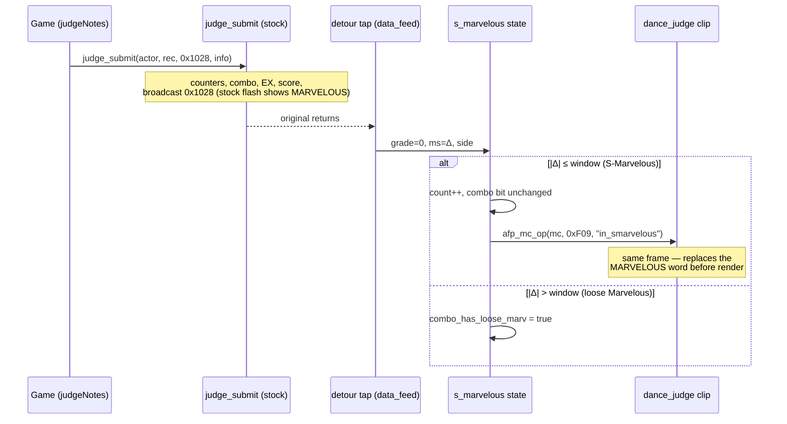

# Detailed Design — S-Marvelous Judgement

Status: Approved 2026-08-29

## 1. Overview

This feature adds **S-Marvelous**, a discrete judgement grade above the game's
strictest stock grade. A step judged Marvelous whose timing delta is within
**±12 ms** (stock Marvelous is ±17 ms) is presented as S-Marvelous: its own
gameplay flash, its own combo digit art and glow tint, its own full-combo
splash and accolade ("S-MFC"), its own row on the results score tab (with the
MARVELOUS count shown exclusively, i.e. stock − S-Marv), its own series and
legend entry on the results judgement graph, and its own full-combo emblem on
the per-stage and total results screens. The goal is native fidelity: every
surface renders through the game's own UI machinery and should be
indistinguishable from first-party work.

**Architectural principle (the "Option C" model):** the engine's internal
grade space is never touched. To every internal consumer — scoring, EX, groove
gauge, combo logic, full-combo classification, dance grade, clear kind, the
network save payload, and ghost streams — an S-Marvelous IS a Marvelous,
bit-identical to stock. The classification happens in the modpack's existing
`judge_submit` detour from the exact per-note millisecond delta the stock
window walk classified, so S-Marvelous ⊆ Marvelous holds by construction. All
discreteness is presentation-layer: runtime-synthesized AFP timeline edits,
injected textures, and post-original detours that re-drive the game's own
display calls.

**Asset policy:** the repository and distribution carry only net-new assets
(recolored art supplied as PNGs). All modification of Konami data — AFP
timeline edits, geo clones, atlas composition — happens client-side at runtime
on the end user's machine, cached under `data_mods/_cache/`. Every AFP edit is
strictly additive (new labels, new frames, new instances that stock code never
references), so disabling the mod yields byte-identical stock behavior.

The feature also delivers a reusable, first-class **Rust AP2 editor**
(`core/ap2/`) — the modpack's first general AFP timeline editing capability,
needed by planned future mods.

## 2. Detailed Requirements

### Functional requirements

| # | Requirement |
|---|---|
| FR1 | Classification: a judgement is S-Marvelous iff its judge opcode is `0x1028` (tap grade 0, Marvelous) AND `abs(ms_delta) <= window` (default 12). Per side. Applies in every mode where gameplay runs: normal, versus (per side), Training Mode, Course/Dan. Applies at any Song Playback Speed rate (deltas are content-time ms; the subset property scales identically with the stock windows). Applies under Autoplay (Δ≈0 ⇒ everything classifies S-Marvelous, including the full S-MFC accolade — intended behavior; autoplay is already score-tainted elsewhere). |
| FR2 | Engine invariance: score, EX, gauge, combo, MFC classification, dance grade, clear kind, save payload, and ghost bytes remain bit-identical to stock. |
| FR3 | Gameplay flash: an S-Marvelous step shows the S-MARVELOUS word (new art) in place of MARVELOUS, by re-driving the game's own `dance_judge` clip to a synthesized `in_smarvelous` frame label. Marvelous never shows FAST/SLOW (stock gate) — inherited unchanged. The freeze-tick display (`in_marvelous_freeze`) is untouched. |
| FR4 | Combo digits: while the current combo's worst judgement is stock-Marvelous-tier AND contains no Marvelous looser than the window, digits show a new `daco_combo_smarvelous_*` texture set and the glow layers get a new tint pair. Stock quirks inherited: the ones place is always unsuffixed; freeze O.K. (grade 6) maps to Marvelous tier and does not degrade the S-Marvelous status. Self-healing: if the status drops, the next stock refresh restores Marvelous art. |
| FR5 | Full-combo splash: an MFC (broadcast type 0) whose Marvelouses were all within the window shows a synthesized `s_marbelous_in` splash segment instead of `marbelous_in` (stock label, Konami's typo). The stock `se_game_fullcombo` sound plays once (not doubled). All four splash templates (single/double × normal/reverse) are patched. |
| FR6 | Results score tab (per-stage results, scene 30): a native S-MARVELOUS row (label art + count) is added to the `detail_result` layout; the MARVELOUS row shows `stock − smarv` (exclusive display). The MISS row's stock aggregation (boo+miss+NG) is untouched. |
| FR7 | Results judgement graph (graph tab): S-Marvelous appears as its own per-second series (subtracted from the Marvelous series) with a "■S-MARVELOUS" legend entry rendered as real font text. |
| FR8 | Full-combo emblems: per-stage results `fc_usr` clip gains a `loop_smfc` labeled segment shown for S-MFC; total results (scene 32) `fullcombo_usr` widget shows an injected S-MFC texture. The song-select score popup stays stock (it renders server data; the server cannot represent S-Marvelous). |
| FR9 | Enable surface: one top-level mod, id `s-marvelous`, display name "S-Marvelous Judgement (12ms)", toggled globally via the `mods` map / overlay-menu MODS tab. Default ON. No custom-options row, no per-player option, no network/wire fields, no PUS integration (no timing-stats line, no CSV column). |
| FR10 | Window tuning: operator config `s_marvelous.window_ms` (default 12, clamped 1..=17), read at enable; no UI. |
| FR11 | Asset policy: repo bundles only net-new recolored PNGs under `data_mods/s_marvelous/`; AFP/geo edits are synthesized client-side; edits are strictly additive. |
| FR12 | Suppression interplay: while auto-calibration hides judgement feedback, the S-Marvelous flash is hidden too (automatic — the flash IS the same `dance_judge` clip whose opacity the hide zeroes). Per-player judgement styling (scale/opacity) applies automatically for the same reason. |
| FR13 | Degradation: each display surface fails open independently (one WARN, stock visuals). The classification core requires only the shipped `judge_submit` signature; without it the mod is inert with one WARN. |
| FR14 | Reset discipline: per-song live state resets at GAMEPLAY entry and on every in-place song reset (quick restart, training scrubs/loops). |

### Assumptions

- Classification lives physically inside the modpack's single `judge_submit`
  detour body (one-detour-per-target rule; the per-step ms delta exists only
  there), as an armed/disarmed atomics block; all policy stays in the mod.
- Results-time data (score tab count, graph series, emblem condition) is
  recomputed from the stage record's per-note streams (grade byte + signed ms
  error vectors — see §5.2), not carried over from live counters. This makes
  the results surfaces correct even across scene transitions, restarts, and
  independent of live-tracking edge cases.
- AFP edits are delivered through the shipped `afp_stream_do_create` patch
  seam (in-memory, per-template, descrambled data), not synthesized arcs on
  disk. Textures flow through the existing atlas-injection pipeline (which
  caches under `data_mods/_cache/`).
- Enable state is latched per side at GAMEPLAY entry; a mid-song toggle
  applies next song.

## 3. Architecture Overview

```mermaid
graph TD
    subgraph core [core/ — pure format layer]
        AP2[core/ap2/ NEW<br/>AP2 parse / edit / serialize]
        AFP[core/afp.rs<br/>descramble, string table]
        ARC[core/arc.rs]
    end

    subgraph synth [Asset synthesis (client-side, at load)]
        PATCHER[services/afp_patcher<br/>register_patch by template name]
        ATLAS[avs_layeredfs atlas injection<br/>donor-anchored + FRESH]
        GEO[geo clone + label rewrite]
    end

    subgraph mod [mods/s_marvelous/]
        STATE[state.rs<br/>per-side counters + combo bit]
        FLASH[flash.rs]
        COMBO[combo.rs detour]
        SPLASH[splash.rs detour]
        RSCORE[results_score.rs detour]
        RGRAPH[results_graph.rs detour]
        REMBLEM[results_emblem.rs detours]
        PATCHES[afp_patches.rs]
        ASSETS[assets.rs]
    end

    TAP[data_feed.rs judge_submit tap<br/>(existing detour, new block)] --> STATE
    STATE --> FLASH
    STATE --> COMBO
    STATE --> SPLASH
    AP2 --> PATCHES
    PATCHES --> PATCHER
    ASSETS --> ATLAS
    ASSETS --> GEO
    RECORD[(Stage record per-note streams<br/>grade bytes + ms errors)] --> RSCORE
    RECORD --> RGRAPH
    RECORD --> REMBLEM
    CAPTURE[overlay_element_styling capture<br/>dance_judge clip per side] --> FLASH
```

Runtime flow for one gameplay judgement:



The five display detours (combo refresh, FC splash, score tab, graph, emblems)
are each post-original `GenericDetour`s on game display functions; every one
re-drives the game's own display calls (bitmap loads, frame-label gotos,
SpriteLayer widgets, chart-series appends) so the output is native.

## 4. Components and Interfaces

### 4.1 `core/ap2/` — AP2 document model (NEW, pure)

The modpack's first full AP2 (AFP animation) editor. Pure Rust, no game or DLL
dependencies, host-tested. Format knowledge transcribed from the bemaniutils
project's parser (public-domain / Unlicense), which documents the complete
read side; the write side is new work (no open AP2 serializer exists).

Format facts the module implements:

- **Header**: magic @0, total length @4, exported-name offset @10, tag-section
  pointer @36, string-table offset/size @48/52.
- **String table**: rolling-cipher scrambled (key starts at 128, increments
  per byte), null-terminated UTF-8, u16 table-relative offsets, 4-byte
  alignment (misalignment is a game fatal). Descramble/re-scramble and cipher
  round-trip already exist in `core/afp.rs` and are reused.
- **Tag section** header `<HHIIIII>`: name_reference_flags,
  name_reference_count, frame_count, tags_count, name_reference_offset,
  frame_offset, tags_offset. **Frames** = packed u32 each (low 20 bits =
  start index into the tag list, next 12 bits = tag count executed that
  frame). **Tags** = u32 header (`tagid = (w>>22) & 0x3FF`,
  `size = w & 0x3FFFFF`) + payload, 4-byte aligned. **Frame labels are not
  tags**: a trailing name-reference array of `<HH>` (frame_number,
  string_offset) pairs; the root movie and every DefineSprite carry their own
  label map.
- **Tags modeled**: `AP2_DEFINE_SPRITE (0x79)` (recursive — nested tag
  section), `AP2_PLACE_OBJECT (0x7F)` (flag-driven: 0x20 = instance/movie
  name, matrix components in documented fixed-point — scale s32/1024,
  translate s32/20, colors s16/255), `AP2_REMOVE_OBJECT (0x80)`,
  `AP2_SHAPE (0x84)` (4 bytes; binds geo `{exported_name}_shape{id}`),
  `AP2_IMAGE (0x83)`, `AP2_DEFINE_EDIT_TEXT (0x7E)`. Unknown tags are carried
  opaquely (byte-preserved) so round-trip covers the whole file.

Public API (shape, not final signatures):

```rust
// core/ap2/mod.rs
pub struct Ap2Doc { /* header fields, string table, root TagSection */ }
pub struct TagSection { frames: Vec<FrameSpan>, tags: Vec<Tag>, labels: Vec<(String, u32)> }
pub enum Tag { DefineSprite { id: u16, section: TagSection },
               PlaceObject(PlaceObject), Shape { id: u16, raw: Vec<u8> },
               Opaque { tag_id: u16, data: Vec<u8> }, /* ... */ }

impl Ap2Doc {
    pub fn parse(descrambled: &[u8]) -> Option<Ap2Doc>;
    pub fn serialize(&self) -> Option<Vec<u8>>;           // all offsets/lengths recomputed
    pub fn exported_name(&self) -> &str;
    // Editing primitives the feature needs:
    pub fn find_sprite_by_label(&self, label: &str) -> Option<SpritePath>;
    pub fn clone_labeled_segment(&mut self, src_label: &str, new_label: &str,
                                 remap: &TagRemap) -> Option<()>;  // frames+tags+label append
    pub fn add_shape(&mut self, geo_suffix_id: u16) -> u16;        // new AP2_SHAPE, returns char id
    pub fn add_place_object_named(&mut self, parent: &SpritePath, po: PlaceObject) -> Option<()>;
    pub fn adjust_placements(&mut self, pred: impl Fn(&PlaceObject) -> bool,
                             dxy: (i32, i32)) -> usize;            // row repositioning
    pub fn max_character_id(&self) -> u16;
}
```

`TagRemap` re-points character/shape IDs inside a cloned segment (so the
cloned S-Marvelous frames reference the new shape instead of the Marvelous
one). Serialization validates: string table ≤ 64 KiB (u16 offsets), 4-byte
alignment everywhere, frame/tag counts within the packed-field widths.

### 4.2 Asset synthesis pipeline

Per-surface synthesized artifacts, all generated on the user's machine:

| artifact | mechanism |
|---|---|
| AP2 timeline edits | `afp_patcher::register_patch(exported_name, fn)` — the shipped `afp_stream_do_create` detour hands the patch fn the descrambled AP2 bytes; the fn runs `core/ap2` edits and returns the new buffer (empty BSI). In-memory; no disk arcs. |
| New textures | Existing atlas pipeline. Donor-anchored clone mode (new region at the donor's exact pixel rect in a cloned same-size atlas — keeps cloned geo UVs valid) for art that cloned shapes reference; FRESH mode for standalone bitmaps (`daco_combo_smarvelous_*`, `scre_total_player_*`, `scre_tab_detail_smarv`). Merged texturelists served through LayeredFS as today. |
| New geo files | Clone the donor GE2D binary + rewrite its label strings to the new region names (the shipped `folder_expansion::patch_ge2d_labels` pattern, promoted to a shared helper); serve by registering the new geo name's MD5 mapping (`ifs_textures::register_afp_geo_mapping`). Geo vertices/UVs are untouched — valid because the donor-anchored atlas clone preserves pixel rects. |

Patched templates:

| template (exported name) | package | edit |
|---|---|---|
| `dance_judge` | `dance_judge` (+ skin-suffixed variants — patch keys on the template name, so skins are covered automatically) | clone the `in_marvelous` labeled segment → `in_smarvelous`, re-pointed to a new shape/geo/region with the S-MARVELOUS word art |
| `01_fullcombo_single_normal`, `01_fullcombo_single_reverse`, `02_fullcombo_double_normal`, `02_fullcombo_double_reverse` | `dance_fullcombo` | clone the `marbelous_in` segment → `s_marbelous_in`, art re-pointed |
| `detail_result` | results scene package | add `smarvelous_num_usr` named instance (PlaceObject flag 0x20) + S-MARVELOUS row label art placement; adjust existing row placements' translate values to open a row slot |
| results main window template (contains `player_%dp_info_usr/fc_usr`) | results scene package | add `loop_smfc` labeled segment to the `fc_usr` sprite, cloned from `loop_mfc` with art re-pointed. (Exact template name to be confirmed from the package during implementation.) |

Committed inputs (`data_mods/s_marvelous/`, maintainer-supplied recolored
PNGs): the S-MARVELOUS word, splash art, `daco_combo_smarvelous_0..9`,
`scre_tab_detail_smarv` row label, `scre_total_player_fc_smfc`, and the
`loop_smfc` emblem art. No Konami bytes in the repo.

### 4.3 Classification tap + mod state

A new armed/disarmed block inside the existing `judge_submit` detour body in
`src/mods/power_user_statistics/data_feed.rs` (the calibration-tap precedent:
the detour body is the only place the per-step ms error exists; policy stays
in the mod). The tap install is already idempotent and invoked from multiple
mods' inits — `s_marvelous` init calls it too, so classification works with
the PUS mod disabled.

Disarmed cost: one relaxed atomic load. Armed, per event (game thread, hot
path — atomics only, no locks, no allocation):

```
side  = *(actor + 0x84)            (already read by the hook)
grade = judge_code - 0x1028        (already computed)
ms    = *(scratch + 4)             (already read; absent for freeze O.K.)
combo = *(actor + 0x1DC)           (one extra read)

if combo <= 1: combo_has_loose_marv[side] = false      // combo (re)started
if grade == 0:
    if |ms| <= window: smarv_count[side]++              // S-Marvelous
    else:              combo_has_loose_marv[side] = true
elif grade in 1..=3:   combo_has_loose_marv[side] = true // worst-tier tracking parity
// grade 4/5 break the combo (bit resets at next combo start); grade 6 (O.K.) is neutral
```

After state update, the flash re-drive (§4.4) fires inline for S-Marvelous
events. `s_marvelous::state` exposes:

```rust
pub fn arm(side: usize, window_ms: i32);   // at GAMEPLAY entry, per latched side
pub fn disarm_all();                       // at GAMEPLAY exit
pub fn reset_song_state();                 // scene entry + song_reset callback
pub fn smarv_count(side) -> u32;
pub fn combo_is_all_smarv(side) -> bool;   // == !combo_has_loose_marv
```

### 4.4 Gameplay flash (`flash.rs`)

The stock flash already played (`in_marvelous`) inside the broadcast that ran
within the original call; the mod re-drives the same clip one event later in
the same frame, before anything renders:

```
wrapper = overlay_element_styling::judge_clip(side)   // new small pub accessor
mc      = *(wrapper + 0x110)
afp_mc_op(mc, 0xF09, "in_smarvelous")                 // goto-label-by-string (libafp export)
```

- The clip registry lives in `overlay_element_styling::capture` (the
  `dance_judge` clips are already classified and side-bound there). Two small
  extensions: a `pub fn judge_clip(side) -> Option<*mut u8>` accessor, and an
  idempotent shared install path so the capture detours install even when the
  styling mod is config-disabled (the `data_feed::install` precedent —
  `s_marvelous` init requests it).
- Play state and visibility were already set by the stock handler; the label
  goto alone suffices. No gamemdx-internal label-lookup functions are needed
  (`afp_mc_op` op `0xF09` takes the label string directly).
- Calibration hide and per-player judgement styling need no code: both operate
  on this same clip's opacity/scale, so they apply to the S-Marvelous word
  automatically.
- Fail-open: capture or patch unavailable ⇒ skip the re-drive (stock
  MARVELOUS shows), one WARN.

### 4.5 Combo digits (`combo.rs`)

Post-original `GenericDetour` on the ComboActor digit-refresh function
(20260721: `0x180066950`; AOB = the inline tint-immediates run
`C7 45 F8 EC FE A9 00 C7 45 FC EF A6 DF 00 …`, prologue walked back). The
refresh is event-driven (init + every combo-changed message with combo ≥ 4),
never per-frame. Post-original, when `*(this+0x6C) == 0` (stock worst =
Marvelous tier) AND `combo_is_all_smarv(side)` (side from `**(this+0x58)`):

1. Layer root1 (`this+0x70`), places {10, 100, 1000}: for each, resolve
   `"combo_usr/number_usr/%d_usr"` via `afp_layer_mc_refer` and walk ALL
   same-name instances with `afp_mc_traversal(id, 6)`, calling
   `afp_mc_load_bitmap(id, "daco_combo_smarvelous_%d")` — replicating the
   stock walk exactly. The ones place stays stock-unsuffixed (stock quirk).
2. Layers root2/root3 (`this+0x78/+0x80`): apply the S-Marvelous tint pair
   via the wrapper's SetColor vfunc (+0x98, `float[4]{r,g,b,1.0}`), overriding
   the just-applied Marvelous pair (`0xA9FEEC` / `0xDFA6EF`). The new
   constants are compiled in beside the stock table.

Self-healing: when the bit drops mid-combo, the next stock refresh (triggered
by the very judgement that dropped it) repaints Marvelous art — no cleanup
path. The suffix table is 4 entries; the mod never writes `this+0x6C`.

### 4.6 Full-combo splash (`splash.rs`)

Post-original `GenericDetour` on the FullcomboActor message handler
(20260721: `0x180069C50`; AOB `81 FA 34 10 00 00` — `cmp edx,0x1034`,
verified module-unique). The splash clip is created via an INLINED path the
CMovieClip capture never sees, so the detour is the capture: post-original,
for `msg == 0x1034` with `type == 0` (MFC) and
`combo_is_all_smarv(side from **(this+0x88))`:

```
clip = *(this + 0x98)
afp_mc_op(*(clip + 0x110), 0xF09, "s_marbelous_in")
```

Stock already played the sound and set play/visibility; only the label goto is
re-driven (never re-play `se_game_fullcombo`). The actor keeps no
timers/latches (its onUpdate is an empty stub), so the re-drive is clean. All
four splash templates carry the patched label; a goto to a missing label is
expected to be a benign libafp no-op (verified live before shipping).

### 4.7 Results score tab (`results_score.rs`)

Post-original `GenericDetour` on the PlaydataTab populate/update fn
(20260721: `0x1800F6BC0`; anchored on the module-unique
`"marvelous_num_usr"` string xref). The fn runs every frame while the tab is
visible; the heavy populate is gated by the dirty flag `tab+0x151`.

Post-original, per call:

- On populate (flag read pre-call, or first sight of this tab instance):
  compute `n = smarv_count_from_record(side, stage, window)` (§5.2), where
  side = `*(tab+0x148)`, stage = `*(tab+0x14C)`.
- Maintain a mod-owned `sequence::SpriteLayer` (the shipped
  music_wheel_song_length construction path — `spritelayer_ctor` /
  `spritelayer_set_names` signatures already resolve) anchored on the
  patched-in `smarvelous_num_usr` instance under parent `*(tab+0x110)`, glyph
  names `scre_tab_num_<digit>`; lay it out each call (vtable[0]) exactly like
  the game's own tail loop does for its widgets. Stock code never touches the
  new instance, so nothing fights it.
- Exclusive MARVELOUS display: locate the stock marvelous widget in the tab's
  widget vector (`tab+0x158..0x160`; identified by its anchor-name string at
  widget+0x68) and rewrite its glyph list to `stock_count − n` via
  `spritelayer_set_names` — a persistent edit the per-frame layout then
  re-applies for us.

The row label art and the `smarvelous_num_usr` instance come from the
`detail_result` AFP patch (§4.2). Total results (scene 32) shows no per-grade
counts — nothing to do there for counts.

### 4.8 Results graph (`results_graph.rs`)

`GenericDetour` on the GraphTab rebuild fn (20260721: `0x1800ED610`; anchored
on the module-unique `"scre_tab_graph_judge_%s"` xref — note that string is
the fast/mav/slow icon family, not judge markers; the judgement graph is a
chart renderer). The fn clears and rebuilds all charts and legend texts every
frame, so the mod participates in the rebuild:

- Once per tab activation (after the one-time ingest): build the mod's
  per-second `Vec<f64>` of S-Marvelous counts from the record streams
  (bucketing rule `(t_ms − t_first)/1000`, timestamps from the record's
  note-entry vector), and subtract it column-wise from the tab's persistent
  Marvelous series vectors (`tab+0x5D8` and the all-marvelous shimmer
  `+0x5F8`) — a one-shot adjustment (guarded by a per-tab-instance flag).
- Every frame, post-original (judge-graph page only: `*(tab+0x138) == 0`,
  has-data `tab+0x1C4`): append the S-Marvelous series to the judge chart
  (last element of `tab+0x178`) by replicating the game's own series-append
  call — `chart_append_series(chart, &vec, &callable)` — where the color
  callable is a 16-byte `{game_lambda_vftable, rgba}` object reusing a game
  lambda vftable (derived from the LEA preceding the stock append calls,
  pinned by the distinctive color immediates). The chart copies the data.
- Legend: add a "■S-MARVELOUS" line by replicating the legend text-object
  construction (text ctor + tint + push into `tab+0x1A0` + cursor advance) —
  real font rendering, no texture. Positioning uses the graph rect queried
  from the `graph_usr` MC like stock does.

Series offsets (`+0x538` family) are derived per build from the GraphTab
ctor's array-construction calls, not hardcoded.

### 4.9 Full-combo emblems (`results_emblem.rs`)

S-MFC condition at results time, computed from the record:
`clear_kind(record+0x54) == 10 && smarv_count_from_record == marv_count(record+0x28) && marv_count > 0`.

- **Per-stage results**: the emblem is the `fc_usr` clip
  (`player_%dp_info_usr/fc_usr`), driven once at scene build by the results
  builder (20260721: `0x1800B8AA0`, anchored on the unique `"scre_rank_%s"`
  xref) via `afp_mc_op(mc, 0xF09, "loop_" + suffix)` from the clear-kind
  suffix table. Post-original detour: when S-MFC, re-drive
  `afp_mc_op(mc, 0xF09, "loop_smfc")` (label added by the AFP patch). Build
  runs once — the one-shot re-drive is stable.
- **Total results**: populate fn (20260721: `0x1800CB090`, anchored on
  `"total_result"` / `"fullcombo_usr"` xrefs) loads bitmap
  `"scre_total_player_%s"` into `fullcombo_usr` per stage pane. Post-original
  detour: for each S-MFC stage, re-drive the bitmap load with the injected
  S-MFC texture name (replicating the stock load-into-all-leaf-clips call).
- **Song-select popup**: stock (server data), by requirement.

### 4.10 Mod lifecycle (`mod.rs`)

- **Registration**: `mods/s_marvelous/` registered in `src/lib.rs`; id
  `s-marvelous`; `required_signatures() = ["judge_submit"]` (classification is
  the only hard dependency — every display signature is optional,
  per-surface fail-open).
- **init**: resolve optional per-surface signatures; call
  `data_feed::install` (idempotent) and the capture shared-install; read
  `s_marvelous.window_ms` (clamp 1..=17, default 12).
- **enable**: register the AFP patches (patch fns check an enabled flag —
  patches and detours are never uninstalled; disable flips flags to
  passthrough); run texture injection (atlas clones + merged texturelists —
  first deploy may need one reboot per the existing atlas-rebuild boot rule);
  install the display detours; register the scene callback (arm/latch at
  GAMEPLAY entry, disarm at exit) and the `song_reset` subscription
  (`reset_song_state`).
- **disable**: flip flags; unregister callbacks. AFP patch fns return None
  when disabled ⇒ templates stream stock bytes on next load.

### 4.11 New signatures (all in `core/signatures.rs`)

| signature | target (20260721) | anchor | consumer |
|---|---|---|---|
| `combo_digit_refresh` | `0x180066950` | tint-immediates run (distinctive constants) | combo.rs |
| `fullcombo_actor_on_message` | `0x180069C50` | `81 FA 34 10 00 00` (module-unique) | splash.rs |
| `playdata_tab_update` | `0x1800F6BC0` | `"marvelous_num_usr"` xref (unique) | results_score.rs |
| `graph_tab_rebuild` | `0x1800ED610` | `"scre_tab_graph_judge_%s"` xref (unique) | results_graph.rs |
| `result_window_build` | `0x1800B8AA0` | `"scre_rank_%s"` xref (unique) | results_emblem.rs |
| `total_result_populate` | `0x1800CB090` | `"total_result"`/`"fullcombo_usr"` xrefs | results_emblem.rs |
| derived: chart-append fn + lambda vftables, legend text ctor, row-write helpers | — | call-site / LEA derivation from the anchors above (house `scan_first_call_rel32` pattern) | results_graph.rs / results_score.rs |

Existing signatures reused: `judge_submit`, `judge_notes`,
`spritelayer_ctor`, `spritelayer_set_names`, the CMovieClip capture pair;
libafp calls are named exports (no AOBs).

## 5. Data Models

### 5.1 Live per-side state (atomics, `state.rs`)

| field | type | reset |
|---|---|---|
| `WINDOW_MS[2]` | `AtomicI32` (0 = disarmed) | armed at GAMEPLAY entry, 0 at exit |
| `SMARV_COUNT[2]` | `AtomicU32` | scene entry + song_reset |
| `COMBO_HAS_LOOSE_MARV[2]` | `AtomicBool` | combo start (observed `combo <= 1`), scene entry, song_reset |

### 5.2 Stage-record per-note streams (read-only, results side)

Stage record = `PlayerWork + 0x590 + stage*0x2B8` (course: `+0x2D8`);
PlayerWork via the shipped `stage_records` service.

| record offset | contents |
|---|---|
| +0x98..0xA0 | `vector` of 0x60-byte note entries; `+0x00` flag byte, `+0x04` tick-in-measure, `+0x08` timestamp ms, `+0x18` unjudged flag |
| +0xB8..0xC0 | `vector<u8>` — grade class per judged note (0=M, 1=P, 2=Gr, 3=Gd, 6=OK) |
| +0xD8..0xE0 | `vector<i16>` — signed ms error per judged note |
| +0x28..0x44 | per-grade counts [8] (M first) |
| +0x54 | clear kind (7=FC, 8=GFC, 9=PFC, 10=MFC) |

`smarv_count_from_record(side, stage, window)` = count over aligned indices of
the grade/ms vectors where `grade == 0 && |ms| <= window` (fail-closed
`Option` reads, vector-length sanity checks, both vectors must agree in
length). The per-second graph vector pairs the same predicate with the
note-entry timestamps.

### 5.3 Config

```json
"s_marvelous": { "window_ms": 12 }
```

Optional; clamped 1..=17; read at enable (next-launch semantics for edits).
The `mods` map carries the enable flag like every mod.

### 5.4 AP2 document model

See §4.1 — `Ap2Doc` / `TagSection` / `Tag` with opaque carriage of unmodeled
tags, so serialization is total over any input the parser accepts.

## 6. Error Handling

House rules apply: no panics across FFI (all detour callbacks
panic-free/`catch_unwind` at boundaries), atomics on hot paths, one-shot
WARNs, graceful degradation.

| failure | behavior |
|---|---|
| `judge_submit` signature missing | mod skipped at registration (required_signatures) |
| AP2 parse/serialize failure on a template | patch fn returns None ⇒ stock bytes stream; latched WARN naming the template; dependent surface degrades (flash/splash show stock words; score tab shows no S-MARV row and keeps stock MARVELOUS count — exclusivity rewrite is gated on the patch having succeeded) |
| texture injection failure | per-texture WARN; dependent surface degrades (e.g. combo digits stay Marvelous art but tint may still apply — tint and art are gated together to avoid mismatched presentation) |
| any display AOB unresolved | that surface inert, one WARN; others unaffected |
| capture registry unavailable (flash) | stock MARVELOUS flash, one WARN |
| record streams malformed/length-mismatched | results surfaces skip (stock display), one WARN |
| goto to missing label | benign no-op (verified live pre-ship); additionally gated on patch success so it should not occur |
| mod disabled | patch fns return None; detours pass through; next template loads are stock — byte-identical behavior (additive-edit invariant) |

Consistency guard: every surface's override condition re-derives from shared
state (`combo_is_all_smarv`, `smarv_count_from_record`) rather than caching
decisions, so surfaces can never disagree about whether a combo/stage is
S-class.

## 7. Testing Strategy

**Host tests (pure, `cargo test`):**

- `core/ap2`: round-trip byte-identity (`parse → serialize == input`) on
  **synthetic fixtures built by our own writer** (no Konami bytes in the
  repo); label-segment cloning correctness (frame spans, tag indices, label
  tables, string-table growth/alignment); PlaceObject encode/decode across
  the fixed-point fields; fuzz-ish malformed-input rejection (no panics).
- `state.rs` combo-bit state machine: sequences of (grade, ms, combo) events
  vs expected bit/counters, including O.K. neutrality, combo restarts, and
  window edges (|ms| == window inclusive).
- Record-stream recompute + per-second bucketing on synthetic records.

**Dev-time offline validation (not shipped, not committed):** a
`scripts/validate_ap2.sh`-style harness (temp-crate mount, house pattern) that
can additionally, on a machine with game data present, round-trip real
templates byte-identically and cross-check parsed structure against the
bemaniutils `parseafp`/renderer output. Renders of patched templates
(bemaniutils `afputils render`) preview the synthesized segments before any
cabinet deploy.

**Cabinet validation (staged deploys — this repo's real test bench):**

1. Classification + logging only (counts per song in the log; verify subset
   property and window edges against live play, autoplay ⇒ 100%).
2. Gameplay flash (AP2 patch on `dance_judge` + re-drive) — visual check,
   calibration-hide interplay, styling interplay, versus side-binding.
3. Combo digits + FC splash (tint semantics live-verified with a debug pure
   color; missing-label no-op verified against an unpatched variant).
4. Results: score tab row + exclusive MARVELOUS, graph series/legend, emblems
   (per-stage + total). Verify no interference with pacemaker_swap and the
   stock miss aggregation.
5. Regression sweep: mod disabled ⇒ stock everything; song_reset paths
   (quick restart, training scrub); rate play; course mode.

## Appendix A — RE address reference (gamemdx 20260721, file-relative to 0x180000000)

| symbol | address |
|---|---|
| judge window table (±17 Marvelous) | `0x18035B9C0` |
| `judgeNotes` / `judge_submit` | `0x18005EC70` / `0x18005FD30` |
| NoteResultActor msg handler (stock flash) | `0x18007B300` |
| ComboActor digit refresh / msg handler / suffix tables | `0x180066950` / `0x180066790` / `0x180483350` |
| FullcomboActor msg handler / vtable | `0x180069C50` / `0x180361788` |
| PlaydataTab populate / row-write helper / glyph conv | `0x1800F6BC0` / `0x1800F8370` / `0x1801D2C00` |
| GraphTab rebuild / ingest / chart append | `0x1800ED610` / `0x1800EB9C0` / `0x1801CFF60` |
| Results window build (fc emblem) / clear-kind table | `0x1800B8AA0` / `0x180486410` |
| Total results populate / table | `0x1800CB090` / `0x180486E80` |
| Marvelous combo tint pair | `0xA9FEEC` / `0xDFA6EF` |

Window values (±17/±34/±84/±124/±160) and the anchors above were spot-checked
stable across 20260616/20250805 where applicable; all runtime resolution is
AOB/derivation-based per house rules.

## Appendix B — Implementation-time verifications

- Dump the `dance_fullcombo` and results packages once (dev machine) to name
  the splash art textures and the template containing `fc_usr`.
- Verify combo tint SetColor (+0x98) multiply-vs-add semantics live.
- Verify `afp_mc_op(0xF09, missing_label)` is a benign no-op.
- Confirm `PlaydataTab+0x151` has no mid-scene re-arm (detour is written to
  tolerate re-population either way).
- Confirm unsuffixed `daco_combo_0..9` exist in the texture list (code
  implies yes).
- Confirm geo-name/MD5 serving path for a net-new geo in the dance_judge IFS.
