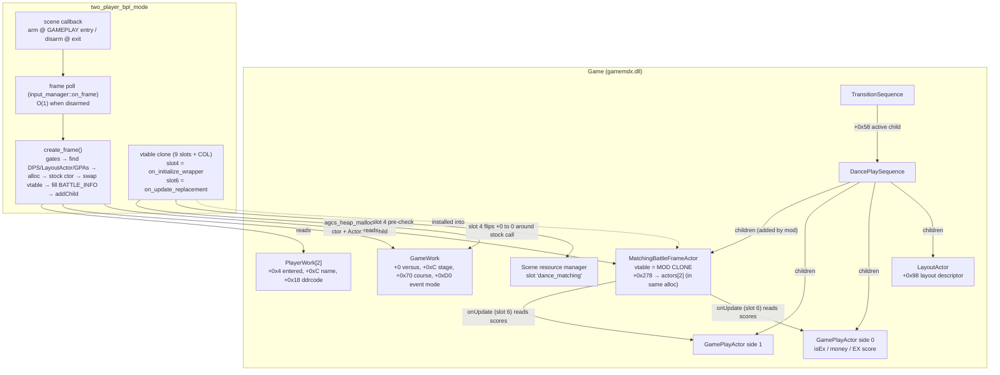

# 2-Player BPL Mode — Detailed Design

Status: Approved 2026-09-09

## Overview

DanceDanceRevolution World's "in-shop battle" (BPL) mode renders a spectator-oriented
battle HUD during gameplay: a score board per player, a score-ratio gauge per player,
live 1st/2nd rank badges and a score-margin readout. Stock play reaches that HUD only
through a 4-player, two-cabinet, network-matched session. This mod puts the same HUD on
screen for an ordinary local 2-player versus session on one cabinet.

The HUD is a single self-contained game actor, `sequence::dance::MatchingBattleFrameActor`
(0x280 bytes). Its art package (`dance_matching`) is already resident in normal gameplay
and its screen anchor (`matching_usr` in `dance_root`) is registered by the same layout
builder both play sequences use. Only its DATA source is network-bound: it reads player
scores from `CNetworkManager`'s cabinet blocks, which are null in local play.

The mod therefore constructs the stock actor itself inside the normal
`DancePlaySequence`, gives the instance a mod-owned copy of the class vtable, and
replaces exactly two of its nine virtual slots:

- `onInitialize` — wraps the stock function, presenting `GameWork+0 == 0` for the
  duration of the call so the actor builds its 2-participant layout (`main_single`) with
  the 3P/4P boards hidden and the single-mode gauge art.
- `onUpdate` — a ~15-line re-implementation that feeds each participant's score from
  the two live `GamePlayActor`s, then runs the stock smoothing and the stock rank
  function.

Zero detours, zero byte patches, one vtable clone, one heap allocation per play
sequence. Every other slot, the constructor, the draw code, the finalizer and the
deleting destructor are the game's own.

## Detailed Requirements

Consolidated from the accepted decision register.

| ID | Requirement |
|---|---|
| R-SCOPE | v1 delivers the gameplay battle HUD only. The results-screen `battle_rank_usr` badge, total-results BPL header, `bgm_bpl` and battle announcer lines are out of scope (each is gated on the event-mode flag `GameWork+0xD0` and would need its own re-host). |
| R-MECH | Re-host the stock `MatchingBattleFrameActor` with a mod-owned vtable clone (slots 4 and 6 replaced). No detours, no byte patches. Re-implementing the HUD on the `dance_matching` assets is the documented fallback if the clone approach fails on cabinet. |
| R-GATE | Create the frame iff ALL hold at gameplay: `GameWork+0 == 1` (local versus), both sides entered, `event_mode ∉ {1,2}` (a real battle session already has the frame), not a course session (`GameWork+course_field == 0`), current scene is GAMEPLAY (0-indexed 28). Solo, doubles, course, attract-demo sessions are untouched. 2-player TRAINING sessions are versus and get the HUD (pure display). |
| R-SCORE | Displayed score type follows the cabinet: money score / 1,000,000 by default, EX score / chart EX-max when the operator enabled EX scoring — by passing each `GamePlayActor`'s own cached `isEx` flag and reading the matching score counter. The frame therefore always agrees with the stock per-player readouts. |
| R-TOGGLE | Mod on/off only (Mods-tab toggle, cabinet-wide, default ON). No option rows, no config section. Enable/disable takes effect at the next play sequence; a mid-song disable leaves the current frame alone. |
| R-ID | Mod id `two-player-bpl-mode`, display name `2-Player BPL Mode`, source directory `src/mods/two_player_bpl_mode/` (`mod.rs` engine-facing + `logic.rs` pure, host-testable). |
| R-BOARDS | Board position 0 ← side 0 (P1), position 1 ← side 1 (P2); `player_index = position`. Names via the game's own getName semantics (inline `char[]` at `PlayerWork+0x0C`, ≤ 8 chars; empty ⇒ `PLAYER1`/`PLAYER2`); `ddrcode = PlayerWork+0x18` (or −1 when 0/guest — only logged by the game); `team_id = 0` (stock `dama_score_base_{1,2}p` art, never BPL team art). |
| R-STOCK-READOUTS | The stock per-player score readouts stay visible (stock BPL shows both). |
| R-LATCH | Creation is driven by a per-frame poll armed at GAMEPLAY entry and disarmed at exit; at most one frame per `DancePlaySequence` INSTANCE (latch = DPS pointer). A quick-restart `finish` builds a fresh DPS ⇒ new frame; an in-place `song_reset` restart keeps the DPS ⇒ the existing frame stays. |
| R-FAIL-OPEN | Any missing signature/derivation ⇒ mod absent (registry skip). At runtime every gate failure ⇒ no frame, one latched WARN per failure class, game untouched. The `onInitialize` wrapper pre-checks that `dance_matching` is resident and, if not, skips the stock call and neutralises the actor (stock would NULL-deref). Every game-object pointer read is null- and identity-checked; hook bodies are panic-contained. |
| R-SERVICE | Promote `song_reset::live_dps` / `gameplay_actors` / `read_step` (+ the DPS StackStep constants) to `pub(crate)` instead of a third private copy. All other new code lives in the mod directory and `signatures.rs`. |
| R-XBUILD | New AOBs/derivations must resolve exactly once on all four supported builds (`validate_signatures.sh`), and every `match+N` read must pass `shape_diff.py`, before the first cabinet deploy. |
| R-OVERLAP | No repositioning in v1; cabinet-check overlap with the power_user_statistics widgets and the training strip. |

Assumptions the design rests on:

- `CNetworkManager` is statically initialised with local cabinet index −1, so the stock
  constructor's unchecked cabinet-block read lands on the valid placeholder block at
  array index −1 (verified in the disassembly; see Appendix A). The design still checks
  the index explicitly.
- The actor layout (`+0x88..+0x280`) and constructor are byte-identical across the four
  supported builds (verified on the oldest and newest); the signature sweep proves it
  for the middle two.
- `agcs_heap_malloc` / `agcs_heap_free` are the pair the actor's deleting destructor
  expects (the destructor calls `agcs_heap_free(this)` when `flags & 1`).

## Architecture Overview



Runtime sequence for one play:

```mermaid
sequenceDiagram
    participant SM as scene_manager
    participant M as mod
    participant DPS as DancePlaySequence
    participant F as Frame actor (clone vtable)

    SM->>M: on_scene_change(prev, GAMEPLAY)
    M->>M: armed = true, done_for_dps = null
    loop every frame while armed
        M->>DPS: walk children (LayoutActor, 2× GamePlayActor?) 
        alt gates fail / not ready
            M-->>M: return (retry next frame)
        else ready
            M->>F: agcs_heap_malloc(0x290) + stock ctor(...)
            M->>F: *this = CLONE_VTABLE; +0x1B0 = 2; BATTLE_INFO[0..1] = {side i, name, ddrcode}
            M->>DPS: Actor::addChild(dps, frame)
            M->>M: done_for_dps = dps; armed = false
        end
    end
    DPS->>F: msg 0x102 (update) → not initialised → msg 0x101
    F->>F: slot 4 wrapper: package resident? flip GameWork+0=0; stock onInitialize; restore
    DPS->>F: msg 0x102 → slot 6: scores from GamePlayActors → smoothing → stock rank fn
    DPS->>F: msg 0x103 → stock onDraw
    SM->>M: on_scene_change(GAMEPLAY, next)
    M->>M: armed = false
    DPS->>F: msg 0x104 (finalize) → stock; DPS teardown → stock deleting dtor → agcs_heap_free
```

## Components and Interfaces

### Signatures and derivations (`src/core/signatures.rs`)

All are all-or-nothing for this mod (declared in `required_signatures`, so the registry
skips the mod cleanly on any miss). Names below are the store keys.

| Key | Kind | Definition |
|---|---|---|
| `battle_frame_actor_vtable` | RTTI | `.?AVMatchingBattleFrameActor@dance@sequence@@` via `find_vtable_by_rtti` (same loop shape as the gauge vtables). 9 slots; `[-1]` = RTTI COL. |
| `layout_actor_vtable` | RTTI | `.?AVLayoutActor@dance@sequence@@`. |
| `battle_frame_ctor` | AOB | Constructor prologue (Appendix B). Init cross-check: the ctor's second `LEA RAX,[rip]` (the class vftable store) must decode to `battle_frame_actor_vtable`, else the mod refuses to init. |
| `battle_frame_rank_fn` | derived | Stock `vtable[6]` (`onUpdate`) ends in `JMP rel32`; scan forward from `vtable[6]` to the first `E9` whose target lies inside the module and that is followed by a function boundary — simpler and robust: take the LAST instruction before the next function's entry; in practice `vtable[6]` is 0x14A bytes on every build, so scan the window `[vtable[6], vtable[6]+0x200)` for `E9 rel32` preceded by `5E` (`POP RSI`) and validate the target lies inside the module. |
| `matching_local_cabinet_idx` | derived | First `48 63 05 disp32` (`MOVSXD RAX,[rip+disp32]`) within `[battle_frame_ctor, +0x300)`; RIP-decode → the `i32` global. |
| `actor_add_child` | AOB | `agcs::Actor::addChild(parent, child)` (Appendix B). |
| `dance_matching_slot_probe` | AOB + 2 published values | Inside stock `onInitialize`; RIP at match+3 → `scene_resource_manager` (pointer-to-pointer global), imm32 at match+13 → `dance_matching_slot_off` via `publish_value`. Init cross-check: match address must lie inside `[vtable[4], vtable[4]+0x200)`. |
| `gpa_score_select` | AOB + 3 published values | The matching sequence's per-frame score read; imm32 at match+2 → `gpa_is_ex_off` (byte flag), match+11 → `gpa_ex_score_off`, match+19 → `gpa_money_score_off`. |
| existing | — | `agcs_heap_malloc`, `app_heap_handle`, `gameplay_actor_vtable`. |

### Service change (`src/services/song_reset/mod.rs`)

`live_dps() -> Option<*mut u8>`, `gameplay_actors(dps) -> Vec<*mut u8>`,
`read_step(object, base, index) -> Option<i32>` and the constants
`FIRST_CHILD_OFFSET`, `NEXT_SIBLING_OFFSET`, `GPA_SIDE_OFFSET` become `pub(crate)`.
No behavioural change.

### Mod module (`src/mods/two_player_bpl_mode/mod.rs`)

```rust
pub struct TwoPlayerBplMod { resolved: bool, scene_cb: Option<usize>, frame_cb: Option<usize> }

impl Mod for TwoPlayerBplMod {
    fn id(&self) -> &str { "two-player-bpl-mode" }
    fn name(&self) -> &str { "2-Player BPL Mode" }
    fn required_signatures(&self) -> &[&str] { &[ /* table above */ ] }
    fn init(&mut self, ctx: &ModContext) -> bool;   // resolve → Sites, build CLONE_VTABLE, cross-checks
    fn enable(&mut self);                           // register scene + frame callbacks, ENABLED = true
    fn disable(&mut self);                          // ENABLED = false, remove callbacks, disarm
    fn is_active(&self) -> bool { self.resolved }   // "CAN work"
}
```

Static state (all atomics / `OnceLock`; no locks on the frame path):

```rust
struct Sites { ctor, add_child, rank_fn, stock_vtable, layout_vtable, gpa_vtable,
               heap_malloc, heap_handle /* *const *const u8 */,
               local_cab_idx /* *const i32 */, scene_res_mgr /* *const *const u8 */,
               slot_off, is_ex_off, ex_off, money_off, game_work_versus /* via stage_records */ }
static SITES: OnceLock<Sites>;
static CLONE_VTABLE: AtomicPtr<*const u8>;   // 9 slots, [-1] = COL
static ENABLED: AtomicBool;
static ARMED: AtomicBool;                    // GAMEPLAY entered, frame not yet placed
static DONE_FOR_DPS: AtomicPtr<u8>;          // latch: DPS that already has a frame
static WARN_LATCHES: [AtomicBool; N];        // one per failure class
```

Scene callback (`scene_manager::on_scene_change`): `next == GAMEPLAY && prev != GAMEPLAY`
⇒ `ARMED = ENABLED`, `DONE_FOR_DPS = null`; `prev == GAMEPLAY && next != GAMEPLAY` ⇒
`ARMED = false`.

Frame callback (`input_manager::on_frame`): `if !ARMED { return }` then
`match create_frame() { Placed | Refused(_) => ARMED = false, NotReady => () }` — `NotReady`
covers "DPS not built yet / GamePlayActors not yet created" and retries next frame;
`Refused` is terminal for this play (gate false, package missing, allocation failed…)
and logs its latched WARN (gate-false is INFO-level, it's the normal solo/doubles case).

`create_frame()` (game thread, ≤ a few µs; all reads null-checked):

1. **Gates** (`logic::eligibility`): `stage_records::game_work()` → `+0 == 1`;
   `side_entered(0) && side_entered(1)`; `event_mode() ∉ {1,2}`;
   `read_u64(gw + course_field_offset()) == 0`; `scene_manager::current_scene() == GAMEPLAY`.
   Any `None` ⇒ `Refused(GateUnavailable)`.
2. **Tree**: `dps = song_reset::live_dps()?` (else `NotReady`); if `dps == DONE_FOR_DPS`
   ⇒ `Refused(AlreadyPlaced)`; walk children once: collect `layout` (vtable ==
   `layout_actor_vtable`), `gpas` (vtable == `gameplay_actor_vtable`), and refuse if any
   child's vtable is the stock frame vtable or `CLONE_VTABLE` (`Refused(FrameExists)`).
   Need `layout` + exactly two GPAs whose `+0x84` sides are {0,1}; otherwise `NotReady`.
   (The normal DPS creates the GamePlayActors only after the LayoutActor reached state 1,
   so two GPAs ⇒ the `dance_matching` anchor is registered.)
3. **Network idle**: `*local_cab_idx == -1` else `Refused(NetworkNotIdle)`.
4. **Package**: `slots = **scene_res_mgr` (global → manager object → its first field = the slot array), `*(slots + slot_off) != 0` else
   `Refused(PackageMissing)`. (Checked here AND in the slot-4 wrapper: the wrapper is the
   safety net, this is the early exit.)
5. **Inputs**: `stage = stage_counter()`; `rec = stage_record(0, stage)` (mcode `+0`,
   diff `+4`; the first entered side in stock — side 0 here since both are entered);
   `is_ex = read_u8(gpa0 + is_ex_off)`; names/ddrcodes from `player_work(i)`
   (`logic::player_name`).
6. **Allocate**: `frame = agcs_heap_malloc(*heap_handle, 0x290, 0, 0)`; null ⇒
   `Refused(AllocFailed)`. Bytes `0x280..0x290` hold `actors: [*mut u8; 2]` = `[gpa0, gpa1]`
   (ordered by side) — the array's lifetime equals the actor's, and the deleting
   destructor frees the whole allocation.
7. **Construct**: `ctor(frame, layout + 0x98, frame + 0x280, is_ex, 0 /*single*/, mcode, diff)`.
8. **Own it**: `write_ptr(frame, CLONE_VTABLE)`; `write_i32(frame + 0x1B0, 2)`; for
   `i in 0..2`: `BATTLE_INFO[i] = { player_index: i, ddrcode, name (≤ 8 + NUL, rest zero),
   team_id: 0, score_target: 0, score_display: 0, score_diff: 0, rank: -1, gauge: 0.0,
   position_map: i, is_ex }`; for `i in 2..4`: `position_map = -1` (leave the rest).
9. **Attach**: `add_child(dps, frame)`; verify `read_ptr(frame + 0x08) == dps` (addChild
   refuses silently on precondition failure) — on mismatch `agcs_heap_free` is NOT called
   (the object is constructed; leaking 0x290 bytes once is preferable to a double-free
   risk) ⇒ `Refused(AttachFailed)` + WARN. `DONE_FOR_DPS = dps`; INFO line
   `2P BPL: battle frame placed (dps=%p, is_ex=%d, mcode=%d, diff=%d, names=…)`.

### Vtable clone and replaced slots

Built once in `init` (pattern of the custom-options row vtables): allocate
`(9 + 1) × 8` bytes with `memory::alloc_zeroed`, copy `stock_vtable[-1]` (COL) into
slot −1, copy slots 0..9, then override slot 4 and slot 6. Return `raw + 8` so
`vtable[i]` indexing matches MSVC.

```rust
unsafe extern "C" fn on_initialize_wrapper(this: *mut u8) {
    // panic-contained; any failure path leaves the actor neutralised, never half-built
    let _ = catch_unwind(|| {
        if !package_resident() {                      // step 4 re-check, the safety net
            // clear update+draw bits so slots 6/7 never run against a NULL layer;
            // onFinalize (slot 5) null-checks the layer itself
            flags(this) &= !0x3; warn_once(PackageMissingAtInit); return;
        }
        let gw = game_work_versus_word();             // *GameWork + 0
        let saved = read_i32(gw); write_i32(gw, 0);
        stock_on_initialize(this);                    // vtable[4] of the STOCK table
        write_i32(gw, saved);
    });
}

unsafe extern "C" fn on_update_replacement(this: *mut u8) {
    let _ = catch_unwind(|| {
        let actors = read_ptr(this + 0x278) as *const *mut u8;     // == this + 0x280
        let n = read_i32(this + 0x1B0).clamp(0, 4);
        for i in 0..n {
            let gpa = read_ptr(actors.add(i));
            let target = if !gpa.is_null() && read_ptr(gpa) == gpa_vtable {
                if read_u8(gpa + is_ex_off) != 0 { read_i32(gpa + ex_off) } else { read_i32(gpa + money_off) }
            } else { 0 };
            write_i32(info(this, i) + 0x24, target);
        }
        let max = read_i32(this + 0x90);
        if max != 0 { for i in 0..n {
            let (t, d) = (read_i32(info+0x24), read_i32(info+0x28));
            let d2 = logic::smooth(d, t);             // min((d + t + 1) / 2, t)
            write_i32(info+0x28, d2); write_f32(info+0x34, d2 as f32 / max as f32);
        } }
        rank_fn(this);                                // stock FUN: sorts, ranks, diffs
    });
}
```

The restore of `GameWork+0` happens on every path of the wrapper, including a panic
inside the stock call (the closure body is structured so `write_i32(gw, saved)` is in a
scope guard). The flip is invisible to other code: the call is synchronous on the game
thread inside the DPS's message dispatch and the stock `onInitialize` callee closure
contains no other `GameWork` reader (verified to depth 3).

### Pure logic (`src/mods/two_player_bpl_mode/logic.rs`, dependency-free, host-tested)

```rust
pub struct GateInputs { versus: Option<i32>, entered: [Option<bool>; 2], event_mode: Option<i32>,
                        course_word: Option<u64>, scene_is_gameplay: bool }
pub enum Gate { Eligible, Ineligible(&'static str), Unavailable(&'static str) }
pub fn eligibility(i: &GateInputs) -> Gate;

/// Stock getName: entered && name[0]==0 ⇒ "PLAYER{side+1}"; else ≤ 8 bytes up to NUL.
pub fn player_name(entered: bool, raw: &[u8; 12], side: usize) -> [u8; 16];   // NUL-padded

pub fn smooth(display: i32, target: i32) -> i32;         // min((display + target + 1) / 2, target), i32 wrap-safe
pub fn gauge_fraction(display: i32, max: i32) -> f32;    // 0.0 when max == 0

/// Vtable clone layout helper: given donor slots + COL, produce the backing array
/// [col, s0..s8] with overrides applied; pure so the slot arithmetic is testable.
pub fn clone_vtable_image(donor: &[usize; 9], col: usize, ov4: usize, ov6: usize) -> [usize; 10];
```

### Registration

`src/mods/mod.rs`: `pub mod two_player_bpl_mode;` — `src/lib.rs`: one
`Box::new(mods::two_player_bpl_mode::TwoPlayerBplMod::new())` in the registration vector
(anywhere after the services it consumes are initialised, which is every mod's position).
Default ON (not in `DEFAULT_OFF_MODS`).

## Data Models

### `MatchingBattleFrameActor` (0x280; mod allocates 0x290)

| Offset | Type | Meaning | Who writes |
|---|---|---|---|
| +0x00 | vftable | stock → replaced with CLONE_VTABLE after ctor | ctor / mod |
| +0x08 / +0x10 / +0x18 | ptr | parent / next sibling / first child | addChild |
| +0x20 | u32 | tree flags (`& 0x24` = dead/dying) | engine |
| +0x24 / +0x28 | u32 | effective / requested priority (0) | ctor, addChild |
| +0x2C | char[24] | actor name `"MatchingBattleFrameActor"` | ctor |
| +0x50 | u32 | message flags: bit0 update, bit1 draw, bit2 skip-one, bit8 initialised (ctor = 3) | ctor / dispatcher / wrapper skip path |
| +0x58..+0x7F | i32×2 ×5 | StackStep slots | ctor |
| +0x80 / +0x82 | u16 | step count 5 / step index | ctor |
| +0x88 | ptr | layout descriptor (`LayoutActor + 0x98`) | ctor arg |
| +0x90 | i32 | max score (1,000,000 or chart EX max; 0 until onInitialize) | onInitialize |
| +0x94 | u8 | isEx | ctor arg |
| +0x98 | i32 | isDouble (0) | ctor arg |
| +0x9C / +0xA0 | i32 | mcode / difficulty | ctor args |
| +0xA8 | ptr | BM2D layer (NULL until onInitialize) | onInitialize |
| +0xB0 | BATTLE_INFO[4] | 0x40 stride | ctor + mod |
| +0x1B0 | i32 | participants (mod: 2) | mod |
| +0x1B8 | shared_ptr<SpriteLayer>[4][3] | widgets (0x30 per participant) | onInitialize |
| +0x278 | ptr | → `GamePlayActor*[2]` (mod: `this + 0x280`) | ctor arg |
| +0x280..+0x290 | ptr[2] | `[gpa_side0, gpa_side1]` (mod extension inside the same allocation) | mod |

### `BATTLE_INFO` (0x40)

| Offset | Type | Meaning | Mod value |
|---|---|---|---|
| +0x00 | vftable | `BATTLE_INFO::vftable` (ctor) | keep |
| +0x08 | i32 | player_index | `i` |
| +0x0C | i32 | ddrcode (log only) | `PlayerWork+0x18`, or −1 when 0 |
| +0x10 | char[16] | dancer name | ≤ 8 chars + NUL |
| +0x20 | i32 | team id (100001..100007 ⇒ team art) | 0 |
| +0x24 | i32 | score_target | slot 6 each frame |
| +0x28 | i32 | score_display (smoothed) | slot 6 |
| +0x2C | i32 | score_diff (vs the other) | rank fn |
| +0x30 | i32 | rank (0 = 1st, −1 none) | rank fn |
| +0x34 | f32 | gauge fraction display/max | slot 6 |
| +0x38 | i32 | position→player_index map (≥ 4 / −1 ⇒ unused; drives `{idx+1}p` art) | `i` for 0..1, −1 for 2..3 |
| +0x3C | u8 | isEx copy | is_ex |

### Game globals and objects read

| Object | Field | Use |
|---|---|---|
| `GameWork` (via `stage_records::game_work()`) | `+0` versus flag (1 = 2 players) | gate; flipped to 0 around stock onInitialize |
| | `+0xC` stage counter | record selection |
| | `+course_field_offset()` (0x70) | course gate |
| | `+0xD0` event mode | gate (∉ {1,2}) |
| `PlayerWork[side]` (via `stage_records::player_work`) | `+0x4` entered byte, `+0xC` name `char[]`, `+0x18` ddrcode | board identity |
| stage record (via `stage_records::stage_record(0, stage)`) | `+0` mcode, `+4` difficulty | ctor args (EX-max lookup key) |
| `GamePlayActor` | `+0x84` side; `+is_ex_off` (u8), `+ex_off`, `+money_off` (i32) — offsets DERIVED from `gpa_score_select` | actor ordering; per-frame score |
| `LayoutActor` | `+0x98` layout descriptor | ctor arg |
| `CNetworkManager` local cabinet index (derived global, i32) | must be −1 | network-idle gate |
| scene resource manager (derived global → manager object; `manager+0` = slot array) | `*(*(*global) + slot_off)` = `dance_matching` package ptr — three loads, the stock chain | residency gate |

### Signature byte shapes (20260825; verify on all four builds)

See Appendix B.

## Error Handling

| Failure | Where | Behaviour |
|---|---|---|
| Any required signature/derivation missing | registry | mod skipped (`[OFF]`), one WARN listing the misses |
| Ctor vftable cross-check ≠ RTTI vftable; probe not inside onInitialize; rank-fn tail not found | `init` | `init` returns false → mod not registered, one WARN |
| Gate false (solo / doubles / course / event) | frame poll | `Refused`, INFO once per play, disarm |
| Gate inputs unavailable (`stage_records` down) | frame poll | `Refused(GateUnavailable)`, latched WARN, disarm |
| DPS / LayoutActor / two GamePlayActors not present yet | frame poll | `NotReady`, retry next frame (bounded by scene exit) |
| A frame child already exists (real BPL, double arm) | frame poll | `Refused(FrameExists)`, disarm, no log (expected in BPL) |
| Network not idle (`local idx ≠ −1`) | frame poll | `Refused`, latched WARN (this should never fire behind the event-mode gate) |
| `dance_matching` not resident | frame poll AND slot-4 wrapper | poll: `Refused` + latched WARN; wrapper: neutralise actor (`+0x50 &= !3`) + latched WARN — never calls stock onInitialize |
| `agcs_heap_malloc` null | frame poll | `Refused`, latched WARN |
| `addChild` refused (parent field not set) | frame poll | `Refused`, latched WARN, allocation intentionally leaked (no free of a constructed actor) |
| Panic inside slot 4 / slot 6 | wrapper | `catch_unwind`; slot 4 restores `GameWork+0` via scope guard; latched WARN; frame simply stops updating |
| `GamePlayActor` pointer no longer identifies as one | slot 6 | that participant's target = 0 for the frame |
| Mid-song disable | `disable` | `ENABLED = false`, callbacks removed; existing frame untouched (per R-TOGGLE) |

No path writes to game memory other than: the actor's own bytes (mod-owned allocation),
the DPS child list through the game's own `addChild`, and the transient `GameWork+0`
flip (restored on every path).

## Testing Strategy

Host (offline, `scripts/validate_two_player_bpl.sh` — temp-crate `#[path]` harness like
the training-mode one, mounting `logic.rs`):

- `eligibility`: truth table over versus/entered/event/course/scene + each `None` ⇒
  `Unavailable`.
- `player_name`: entered+empty ⇒ `PLAYER1`/`PLAYER2`; non-empty copies ≤ 8 bytes and
  NUL-terminates; unterminated 12-byte input never over-reads; not-entered+empty ⇒ empty.
- `smooth`: eases up by halves, snaps down to target, idempotent at target, no overflow
  near `i32::MAX`.
- `gauge_fraction`: 0 when max is 0; display/max otherwise.
- `clone_vtable_image`: COL at index 0, donor slots copied, overrides at 4 and 6 only.

Offline signature validation (before ANY deploy): `./scripts/validate_signatures.sh
~/Desktop/ddr_modules` all green for the four new AOBs + 2 RTTI + derivations;
`scripts/sig_harness/shape_diff.py` on `battle_frame_ctor` (the vftable LEA at the same
offset), `dance_matching_slot_probe` (imm32 at +13), `gpa_score_select` (three imm32s)
and the stock `vtable[6]` window (tail `JMP`).

Cabinet (the only validation for the engine-facing code):

1. Solo / doubles / course: no frame, one INFO gate line, no WARN.
2. 2P versus, money score: frame appears with the READY panel, boards show P1/P2 names
   (or PLAYER1/2), gauges fill, rank badges swap with the lead, margin readout matches
   the difference of the stock readouts.
3. 2P versus with operator EX scoring ON: gauge max = chart EX max (full gauge at a
   perfect), digits match the stock EX readouts.
4. Quick restart (fresh DPS) ⇒ frame re-created; in-place restart ⇒ frame persists and
   the boards snap down to 0.
5. Quick fail / natural song end / results: no crash on teardown (deleting dtor path),
   no WARN.
6. Visual overlap with power_user_statistics widgets and the training strip (R-OVERLAP).
7. Toggle OFF in the Mods tab mid-song: frame stays; next song has none. Toggle ON: next
   song has it.

## Appendix A — Why the stock constructor is safe to call locally

The constructor maps players to board positions by reading `CNetworkManager`'s local
cabinet block, `blocks[local_idx]`, without a null check. `CNetworkManager` is a global
constructed from the CRT initializer table at DLL load: it sets `local_idx = −1`,
`blocks[0..1] = NULL`, and allocates a 0x178-byte placeholder record block stored
immediately BEFORE the block array — i.e. at array index −1. Its two records are
initialised invalid (`player_index = ddrcode = −1`), so no position matches; the
versus branch then assigns the unmatched players to positions 2/3 through
`GetPlayerInfo`, which iterates the two NULL blocks (skipped) and resets the record.
Net effect: four log lines and `position_map = {−1, −1, 2, 3}`, all overwritten by the
mod. The design gates on `local_idx == −1` explicitly so this dependency is checked
rather than assumed.

## Appendix B — Byte shapes (build 20260825, file-relative)

`battle_frame_ctor` @ `+0x71740` (prologue, no relocations):

```
48 89 4C 24 08 56 57 41 54 41 55 41 56 48 83 EC 40 48 C7 44 24 30 FE FF FF FF
48 89 5C 24 78 48 89 AC 24 80 00 00 00 45 0F B6 D1 49 8B D8 4C 8B DA 4C 8B F1 33 ED
48 89 69 08 48 89 69 10 48 89 69 18 48 89 69 20 89 69 28 40 88 69 2C
```
Cross-check: second `48 8D 05 disp32` in the body (at +0x78) decodes to the class vftable.

`actor_add_child` @ `+0x21F230`:

```
48 3B CA 74 63 48 85 D2 74 5E 48 83 7A 08 00 75 57 48 83 7A 10 00 75 50 48 8B 41 18
45 33 C0 48 85 C0 74 16 44 8B 4A 28 44 39 48 24 76 0C 4C 8B C0 48 8B 40 10 48 85 C0 75 EE
```
`addChild(parent RCX, child RDX)`: refuses (no-op) when child == parent, child NULL,
child already has a parent (`+0x08`) or next (`+0x10`); sorted insert by descending
priority, spliced BEFORE equal-priority siblings.

`dance_matching_slot_probe` @ `+0x71D6E` (inside `onInitialize`):

```
48 8B 05 ?? ?? ?? ??   MOV RAX,[rip+scene_res_mgr]     ; match+3 → global; RAX = manager object
48 8B 08               MOV RCX,[RAX]                    ; RCX = manager->slots (field 0)
4C 8B A9 ?? ?? ?? ??   MOV R13,[RCX+slot_off]          ; match+13 → imm32 (0x7F0 on 20260825)
48 8B 05               (start of the GameWork load)
```

`gpa_score_select` @ `+0x628E8` (matching play sequence, per-frame score read):

```
80 B8 ?? ?? 00 00 00   CMP byte [RAX+is_ex_off],0      ; match+2  (0x1D0)
74 08                  JZ
48 05 ?? ?? 00 00      ADD RAX,ex_off                  ; match+11 (0x1D8)
EB 06                  JMP
48 05 ?? ?? 00 00      ADD RAX,money_off               ; match+19 (0x1D4)
8B 00                  MOV EAX,[RAX]
```

Stock `vtable[6]` (`onUpdate`) tail: `... 48 8B CE 48 83 C4 30 5E E9 rel32` → rank fn.

`matching_local_cabinet_idx`: first `48 63 05 disp32` inside the ctor (`+0x71968`).

## Appendix C — Alternatives considered

- **Spoof the battle mode** (`GameWork+0xD0 = 1`): routes the session through the
  matching scene chain, which blocks on network state 4, runs the music-start sync
  handshake, forces EX-score rules and re-routes results/logout. Rejected.
- **Detour the stock `onInitialize`/`onUpdate`** with an identity gate: works, but adds
  two detours to functions shared with real battle play; the vtable clone touches only
  the mod's instance.
- **Fake a cabinet block** so the stock `onUpdate` runs unmodified: the blocks are
  `CNetworkManager` state with other readers (scene creation, the ScoreActor rival path,
  result-record copies). Rejected.
- **Replicate the constructor** to avoid the network-block read: avoids the index −1
  dependency but hard-codes the whole actor and `agcs::Actor` base layout. The explicit
  `local_idx == −1` gate is cheaper and keeps the base-class init stock.
- **Re-implement the HUD on the `dance_matching` assets** (~40 BM2D operations + three
  SpriteLayers per side): the fallback if the clone approach hits an unforeseen
  dependency on cabinet.
