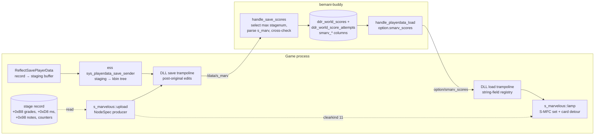

# Detailed Design — S-Marvelous Server-Side Awareness

Status: Approved 2026-09-12 (maintainer; includes the FR10 equal-points S-Marv tie-break)

Feature id: `s-marvelous` (extension of the shipped S-Marvelous Judgement mod);
companion backend changes in bemani-buddy.

## 1. Overview

The S-Marvelous Judgement mod classifies a stock Marvelous whose timing error is
inside a tighter window (default ±12 ms) as "S-Marvelous" and presents it as a
discrete tier — gameplay flash, combo tint, results rows, judgement graph,
S-MFC emblems. It is presentation-only: to the engine (score, EX, gauge, combo,
save payload, ghost) an S-Marvelous IS a Marvelous. A backend server therefore
cannot distinguish them.

This design adds two things without changing a single stock byte on the wire:

1. **Upload.** On every per-stage score save the DLL appends one node,
   `/data/s_marv`, describing the stage just played with S-Marvelous awareness:
   the S-Marvelous count, the exclusive Marvelous count, the FAST/SLOW counts
   with the loose-Marvelous share, the clear kind with a new S-MFC tier (11),
   and a ghost string with `'8'` at S-Marvelous steps. bemani-buddy parses it,
   cross-checks it against the `<result>` it already selects, and stores the
   values in new nullable columns beside the stock ones on both the personal-
   best row and the append-only attempt row.
2. **Echo-back.** bemani-buddy's profile load adds a string field listing the
   player's S-MFC charts. The DLL reads it through the load path it already
   owns and swaps the song-select header card's MFC lamp for a violet S-MFC
   lamp on those charts. Stock fields — including `clearkind` — are served
   unchanged, so stock or mod-off clients are unaffected.

Both halves are fail-open: any refusal produces a stock-identical packet or a
stock lamp, never a blocked save or a crash.

## 2. Detailed Requirements

### 2.1 Functional

| ID | Requirement |
|---|---|
| FR1 | The stock `playdata_3.playerdata_save` payload — every existing node, value, order and type — is byte-identical with the mod enabled or disabled. |
| FR2 | On a forwarded per-stage save (`savekind == 2`) of an armed side, the DLL appends `/data/s_marv` as a sibling of `<result>` describing the stage the marshal just serialised (`record[stage_counter]`). Exactly one node per save; none on `savekind` 1 or 3. |
| FR3 | `s_marv` carries: `mcode`, `style`, `difficulty`, `window_ms`, `judge_smarv`, `judge_marv` (exclusive), `fastcount`, `slowcount`, `clearkind`, `ghostsize`, `ghost` (§5.1). Fields the mod cannot change (score, exscore, maxcombo, rank, flare, other grades, calorie, gimmick flag) are not duplicated. |
| FR4 | Every count is recomputed from the stage record's per-note streams with the window the side was armed with — the same inputs the results screen uses — never from live counters. |
| FR5 | `s_marv/ghost` has the stock ghost's index space (every slot of the record's grade vector, `'0' + grade`) with `'8'` at slots that are judged ∧ grade 0 ∧ `\|ms\| <= window`. `ghostsize` equals its length. |
| FR6 | `s_marv/clearkind` equals the wire clear kind (`rec+0x54`), except 11 when the play is an S-MFC (wire clear kind 10 ∧ every judged Marvelous is S-Marvelous ∧ at least one). |
| FR7 | Emission requires: mod enabled ∧ side armed for the whole song ∧ `savekind == 2` ∧ not course mode ∧ record `mcode != -1` ∧ stream consistency (recomputed Marvelous total == record counter). Otherwise no node. |
| FR8 | bemani-buddy parses `/data/s_marv` on `savekind == 2` only, applies it to the highest-`stagenum` `<result>` it already selects, and ignores it (with a warning) when `mcode` or chart disagree with that result. |
| FR9 | bemani-buddy stores the S-Marv values in seven nullable columns on `ddr_world_scores` and `ddr_world_score_attempts`; NULL means "no S-Marv data for this play". A personal-best replacement from a save without `s_marv` NULLs them. |
| FR10 | Personal-best replacement additionally happens on equal points when the new play's S-Marvelous count is strictly higher (so an S-MFC supersedes a plain MFC — both score 1,000,000). |
| FR11 | bemani-buddy's `playerdata_load` response gains `<option><smarv_scores>` (str): the profile's charts whose `smarv_clear_kind` differs from `clear_kind`, encoded `mcode:chart:clearkind\|…`. Absent when there are none. Every stock load field, including each score's clear kind and ghost key, is unchanged. |
| FR12 | The DLL consumes `smarv_scores` per side (card-in reset → replace-on-load semantics), also inserts the chart locally when it emits `clearkind == 11`, and at song select re-binds the header card's `fullcombo_<n>p_usr` bitmap to `muca_card_fc_smfc` when the current chart is in the side's set. |
| FR13 | bemani-buddy's protocol model JSON is re-synchronised with the two fields that were hand-added to generated code, the generator is re-run, and the generated file shows no diff — before any load-side field is added. |

### 2.2 Non-functional

- No option rows, no config keys, no operator surface: behaviour follows the
  mod toggle.
- Hook-path code is panic-free (`catch_unwind` at the callback boundary, no
  `unwrap`/indexing), bounded reads on every game-owned vector, one latched
  WARN per failure class.
- One detour per target: the save/load trampolines are the existing ones; the
  card refresh is a new target with no other consumer.
- No hardcoded addresses: the new detour is AOB-anchored and validated across
  the four supported builds; record offsets are the ones the mod already uses.

### 2.3 Assumptions

- `stage_records::stage_counter()` equals the `stage` argument the marshal
  receives for a kind-2 save (the persistence trampoline already assumes this
  for its rate-ledger election). The identity echo lets the backend detect a
  violation.
- libavs `property_node_create` (ordinal 163) with kbin type 1 (`void`) and no
  value creates an empty container — it is how the game's own `<result>` and
  `<option>` nodes are made. Verified at first deploy; failure ⇒ node omitted.
- The song-select header card's current chart is `(PlayerWork+0x54 mcode,
  PlayerWork+0x5C difficulty, GameWork+0 style)` at refresh time (the
  song-select cursor writer keeps them current). Fallback: the highlighted
  `music::Info` from the wheel model the song-length mod already dereferences.
- A chart in the S-MFC set has a stock MFC lamp: an S-MFC scores 1,000,000, no
  later non-MFC play can out-score it, and the server never lists a chart
  whose stored clear kind is below 10.

## 3. Architecture Overview



Save path: the game's marshal fills a per-side staging buffer from the stage
record; ess serialises it into the kbin request tree; the DLL's existing
post-original trampoline runs the registered `/data` node producers, of which
`s_marvelous::upload` is the first. The producer reads the same stage record
(unfiltered streams + judged mask + counters), builds a pure `NodeSpec`, and
the trampoline materialises it with libavs ordinals.

Load path: bemani-buddy emits `smarv_scores` inside `<option>`; the DLL's
existing string-field registry delivers it per side after the card-in
deferral; `s_marvelous::lamp` keeps the set and re-binds the card lamp from a
post-original detour on the header-card refresh.

## 4. Components and Interfaces

### 4.1 DLL — `custom_options_persistence`: `/data` subtree producers

New registry beside the string-field registry:

```rust
pub enum NodeLeaf {
    S32 { name: &'static str, value: i32 },
    Str { name: &'static str, value: String },
}
pub struct NodeSpec {
    pub name: &'static str,          // container node name under /data
    pub leaves: Vec<NodeLeaf>,       // emitted in order
}
pub type DataNodeProducer = fn(side: u8, savekind: i32) -> Option<NodeSpec>;
pub fn register_data_node_producer(name: &'static str, producer: DataNodeProducer);
pub fn unregister_data_node_producer(name: &'static str);
```

Emission point: in the save trampoline, post-original, after `emit_string_fields`,
under the same `PERSIST_NETWORK` gate. For each producer: call it; on `Some`,
`data = find(0, kbin_ctx, "data")`, `ctx = get_ctx(kbin_ctx)`,
`node = add_child(ctx, data, KBIN_VOID /*1*/, name, 0)` (ordinal 163 — the extra
value argument is ignored for a void node under the Win64 variadic ABI), then
each leaf via the existing s32 (type 6, by value) / str (type 11, by pointer)
adders with `node` as parent. If the container or any leaf fails:
`remove_node(node)` (ordinal 164, best effort), one latched WARN naming the
producer, continue with the next producer. Producers see `savekind` and gate
themselves; the registry never filters by kind.

`NodeSpec` is a plain value type so producers are host-testable; the ordinal
calls stay in the service.

### 4.2 DLL — `s_marvelous::records`: unfiltered read

Existing `read_streams(record)` returns judged-only parallel streams. Add:

```rust
pub struct RawStreams {
    pub grades: Vec<u8>,   // every slot of the +0xB8 vector
    pub ms: Vec<i16>,      // every slot of the +0xD8 vector (expected − actual)
    pub judged: Vec<bool>, // per slot, from the +0x98 note entries (flag >= 0 ⇒ slot; +0x18 == 0 ⇒ judged)
}
pub fn read_raw_streams(record: *const u8) -> Option<RawStreams>;
```

Bounded like `read_streams` (`MAX_NOTES`), returns `None` on any length
disagreement between the three vectors. `read_streams` becomes a filter over
`read_raw_streams` so both readers share one decode.

### 4.3 DLL — `s_marvelous::upload` (new module)

Pure builder + impure producer.

```rust
pub struct RecordInputs<'a> {
    pub mcode: i32, pub style: i32, pub difficulty: i32,   // rec+0x00, +0x08, +0x04
    pub stock_marv: i32,                                    // rec+0x28
    pub stock_fast: i32, pub stock_slow: i32,               // rec+0x6C, +0x70
    pub wire_clearkind: i32,                                // rec+0x54 (what the marshal sends; +0x270 is `folder`)
    pub streams: &'a RawStreams,
}
pub struct SMarvPayload {
    pub mcode: i32, pub style: i32, pub difficulty: i32, pub window_ms: i32,
    pub judge_smarv: i32, pub judge_marv: i32,
    pub fastcount: i32, pub slowcount: i32,
    pub clearkind: i32,
    pub ghost: String,
}
pub const CLEAR_KIND_MFC: i32 = 10;
pub const CLEAR_KIND_SMFC: i32 = 11;
pub const GHOST_SMARV_CHAR: u8 = b'8';

pub fn build_payload(inp: &RecordInputs, window_ms: i32) -> Option<SMarvPayload>;
pub fn to_node_spec(p: &SMarvPayload) -> NodeSpec;   // leaf order = §5.1 table
```

`build_payload` rules:
- Judged filter → `(g, ms)` pairs; `Σ(g == 0) == stock_marv` else `None`.
- `judge_smarv = Σ(g == 0 ∧ |ms| <= w)`; `judge_marv = stock_marv − judge_smarv`.
- Loose Marvelous (`g == 0 ∧ |ms| > w`): `ms > 0` ⇒ FAST else SLOW (stream sign is
  `expected − actual`); `fastcount = stock_fast + loose_fast`, `slowcount =
  stock_slow + loose_slow`.
- `clearkind = if wire_clearkind == 10 && judge_smarv == stock_marv && stock_marv > 0 { 11 } else { wire_clearkind }`.
- `ghost`: for each slot `i`: `if judged[i] && g[i] == 0 && |ms[i]| <= w { '8' } else { (b'0'.wrapping_add(g[i])) as char }`.

Producer (`fn produce(side, savekind) -> Option<NodeSpec>`), all reads
range-checked, `None` on any refusal with one latched WARN per reason:
`!ACTIVE` · `!state::armed_this_song(side)` · `savekind != 2` · course mode
(`stage_records` course predicate) · record unresolvable or `mcode == -1` ·
`read_raw_streams == None` · `build_payload == None`. Window =
`state::last_armed_window(side)`. On success: one INFO (`side stage mcode
window smarv marv fast slow clearkind ghostlen`) and, when `clearkind == 11`,
`lamp::insert_local(side, mcode, chart)`.

Registration: `register_data_node_producer("s_marv", produce)` in `enable()`,
unregister in `disable()`.

### 4.4 DLL — `s_marvelous::state`: per-song arm latch

`ARMED_THIS_SONG: [AtomicBool; 2]` — set in `arm_for_play_scene` for both sides,
cleared in `disable()`. Not cleared at scene exit (the save fires in the
results scene). A side whose classification was not armed for the entire song
(mod enabled mid-song) emits nothing.

### 4.5 DLL — `s_marvelous::lamp` (new module)

State: `SETS: [Mutex<HashSet<(i32 /*mcode*/, u8 /*chart 0..9*/)>>; 2]`.

Wire consumption via the existing registry:

```rust
custom_options_persistence::register_string_field(
    "smarv_scores",
    |_side| None,                        // never emitted on save
    |side, text| lamp::on_load(side, text),
);
custom_options_persistence::register_card_in_callback(|side| lamp::clear(side));
```

`on_load` replaces the side's set with the decoded list (§5.2); malformed
entries are skipped individually; an empty string clears. `insert_local(side,
mcode, chart)` is the D15 feed (chart = `style == 0 ? difficulty : difficulty + 5`).

Badge: `GenericDetour` on the song-select header-card refresh (new signature
`selectmusic_card_refresh`, prologue-anchored; `fn(this: *mut u8, flag: u8)`),
post-original, body in `catch_unwind`:

1. Scene must be SONG_SELECT (25).
2. For each side `s` with `stage_records::side_entered(s)` and a non-empty set:
   chart from `(PlayerWork+0x54, PlayerWork+0x5C, GameWork+0)`; skip unless
   `(mcode, chart)` ∈ set.
3. `layer_obj = *(this + 0xD0)`; `layer_id = *(layer_obj + 0x08)` (both
   `memory::is_readable`-probed — no AOB pins this layout).
4. Replicate the game's own bitmap setter: `id = bm2d_api::layer_find_child(layer_id,
   "fullcombo_{s+1}p_usr")`, then for `id` and each `bm2d_api::mc_traversal(id, 6)`
   sibling: `bm2d_api::mc_load_bitmap(id, "muca_card_fc_smfc")`.

Widget visibility is left to the stock code (it already set the lamp visible
for an MFC). Any miss — signature, unreadable layer, `find_child` none,
texture not staged — leaves the stock MFC lamp and WARNs once.

Texture: `muca_card_fc_smfc` injected through `atlas_cloner` FRESH mode at
enable, donor `muca_card_fc_mfc` (encoding + cell size), art
`data_mods/s_marvelous/select_music/muca_card_fc_smfc.png` — the violet recolor
language of the results emblems. Staging failure ⇒ badge inert.

### 4.6 bemani-buddy — protocol model re-sync (first step)

`models/ddr_world/playdata_3.json`: add `"mod_skip_results_fast_exit": "s32?"`
and `"mod_sync_movie": "s32?"` to `PlayerdataLoadOption` and
`PlayerdataSaveOption` in the positions matching the hand-edited struct.
Regenerate (`cargo run -p codegen -- models/ddr_world/playdata_3.json crates/bemani-protocol/src/ddr_world/`),
`cargo fmt`, and require `git diff --stat crates/bemani-protocol/src/ddr_world/playdata_3.rs`
to be empty. Add to the repo's agent guidance: generated files are never edited
by hand; the JSON is the only input.

### 4.7 bemani-buddy — migration `019_ddr_world_smarv.sql`

```sql
ALTER TABLE ddr_world_scores
    ADD COLUMN smarv_window_ms  INT  NULL DEFAULT NULL,
    ADD COLUMN smarv_count      INT  NULL DEFAULT NULL,
    ADD COLUMN smarv_marvelous  INT  NULL DEFAULT NULL,
    ADD COLUMN smarv_fast       INT  NULL DEFAULT NULL,
    ADD COLUMN smarv_slow       INT  NULL DEFAULT NULL,
    ADD COLUMN smarv_clear_kind INT  NULL DEFAULT NULL,
    ADD COLUMN smarv_ghost      TEXT NULL DEFAULT NULL;
-- identical block for ddr_world_score_attempts
```

Header comment states the contract: values stored verbatim from the client's
`s_marv` node; NULL = stock client / mod off / node rejected; never echoed into
stock load fields.

### 4.8 bemani-buddy — models and DAO

```rust
pub struct DdrWorldSmarv {
    pub window_ms: i32, pub count: i32, pub marvelous: i32,
    pub fast: i32, pub slow: i32, pub clear_kind: i32, pub ghost: Option<String>,
}
// DdrWorldScore / NewDdrWorldScore / DdrWorldScoreAttempt / NewDdrWorldScoreAttempt
pub smarv: Option<DdrWorldSmarv>,
```

Row mapping: `Some` iff `smarv_window_ms IS NOT NULL` (all-or-nothing). Score
DAO (runtime `sqlx::query`): extend `SELECT_SCORES`, `ScoreRow`, `row_to_score!`,
the INSERT, the UPDATE and the attempts INSERT; `None` binds NULL for all seven.

Upsert rule:

```
replace = new.points > old.points
       || (new.points == old.points
           && new.smarv.map(|s| s.count).unwrap_or(0) > old.smarv.map(|s| s.count).unwrap_or(0))
```

The whole-row snapshot semantics are unchanged; the S-Marv tie-break is the only
addition. `DdrWorldScoreDao::upsert` keeps returning `was_high_score`.

### 4.9 bemani-buddy — save handler

In `handle_save_scores`, after the highest-`stagenum` `<result>` is selected and
`chart` computed:

```rust
fn parse_smarv_node(node: Option<&XmlElement>, mcode: i32, chart: i32) -> Option<DdrWorldSmarv>
```

Pure, lenient reads (`parse().ok()`); returns `None` when the node is absent,
when `mcode` ≠ or `chart(style, difficulty)` ≠ the selected result (logged at
`warn`), or when any of `window_ms`/`judge_smarv`/`judge_marv`/`fastcount`/
`slowcount`/`clearkind` is missing. `ghost` empty ⇒ `None`. Result goes into
`NewDdrWorldScore.smarv` and is copied into the attempt row.
`handle_save_dan_results` is untouched (`smarv: None`).

### 4.10 bemani-buddy — load handler

```rust
fn build_smarv_scores(scores: &[DdrWorldScore]) -> Option<String>
```

Entries where `s.smarv.clear_kind != s.clear_kind`, sorted by `(mcode, chart)`,
encoded per §5.2; `None` when empty. Emitted as `option.smarv_scores`
(`"smarv_scores": "str?"` added to `PlayerdataLoadOption` in the JSON model →
regenerate → `Option<String>` with `skip_serializing_if`).
`build_new_player_response` sets `None`. `rivaldata_load` and `ghostdata_load`
are unchanged.

## 5. Data Models

### 5.1 Wire: `/data/s_marv` (request, `savekind == 2`)

| Child | kbin type | Source | Notes |
|---|---|---|---|
| `mcode` | s32 (6) | `rec+0x00` | identity echo |
| `style` | s32 | `rec+0x08` | identity echo |
| `difficulty` | s32 | `rec+0x04` | identity echo |
| `window_ms` | s32 | armed window | interpretation key (1..=16) |
| `judge_smarv` | s32 | recomputed | S-Marvelous count |
| `judge_marv` | s32 | recomputed | exclusive Marvelous; `judge_smarv + judge_marv == result/judge_marv` |
| `fastcount` | s32 | recomputed | `result/fastcount` + loose-Marvelous FAST |
| `slowcount` | s32 | recomputed | `result/slowcount` + loose-Marvelous SLOW |
| `clearkind` | s32 | `rec+0x54` or 11 | 11 = S-MFC |
| `ghostsize` | s32 | `len(ghost)` | equals `result/ghostsize` |
| `ghost` | str (11) | recomputed | stock string with `'8'` at S-Marv slots |

Invariants (host-tested): `judge_smarv + judge_marv == stock marv`;
`judge_smarv + (fastcount − stock fast) + (slowcount − stock slow) == stock marv`;
`ghost.len() == stock ghost.len()`; `ghost[i] == '8' ⇒ stock ghost[i] == '0'`.

Ghost alphabet: stock `'0'..'7'` = grade class 0..7 (Marvelous, Perfect, Great,
Good, Boo, Miss, O.K., N.G.); `'8'` = S-Marvelous (this design).

### 5.2 Wire: `option/smarv_scores` (load response)

`entry ( '|' entry )*` with `entry = mcode ':' chart ':' clearkind`, decimal,
no whitespace, sorted by `(mcode, chart)`; `chart` 0..4 single, 5..9 double
(`style == 0 ? difficulty : difficulty + 5`). Absent or empty ⇒ empty set.
Decoders skip malformed entries and accept unknown clear kinds (the DLL badges
only 11).

### 5.3 Storage

Seven nullable columns per table (§4.7); all-or-nothing at the model level
(`Option<DdrWorldSmarv>`). Uniqueness and keying unchanged
(`(profile_id, mcode, chart)`).

## 6. Error Handling

| Failure | Behaviour |
|---|---|
| Ordinal 163 refuses the void container / a leaf | remove partial node (164), WARN once, save proceeds stock-identical |
| Record unresolvable, `mcode == -1`, stream length mismatch, Marvelous consistency gate fails | no node, WARN once per reason |
| Side not armed / mod disabled mid-song / course mode / kind ≠ 2 | no node, silent |
| Backend: node absent | `smarv = None` (stock behaviour) |
| Backend: identity mismatch or missing required child | node ignored, `warn!` with both identities |
| Backend: DB error | unchanged (`Err` → status 1, as today) |
| DLL load: malformed `smarv_scores` entry | entry skipped; rest applied |
| Card-refresh signature missing on a build | badge inert, one WARN at init; upload unaffected |
| Layer/widget unreadable, texture unstaged | stock MFC lamp, WARN once |
| Any panic in a hook body | contained by `catch_unwind`; treated as the corresponding refusal |

Nothing in this design can suppress, reorder, or alter a stock save, and no
stock load field changes domain.

## 7. Testing Strategy

**DLL host tests (`cargo test`, pure layers)**
- `upload::build_payload`: synthetic streams covering all-S-Marv (S-MFC → 11),
  mixed, loose-Marvelous FAST/SLOW split by sign, unjudged tail slots (must not
  count and must keep `'0'`), consistency-gate refusal, `stock_marv == 0`.
  Invariants of §5.1 asserted on every case.
- `upload::to_node_spec`: leaf order and names match §5.1.
- `lamp` codec: encode/decode round trip, malformed-entry skipping, empty
  string clears, chart mapping both styles.
- Existing `records.rs` tests keep passing; `read_streams` ≡ filter of
  `read_raw_streams` on the shared fixtures.

**DLL offline validation**
- `scripts/validate_signatures.sh ~/Desktop/ddr_modules` green with the new
  `selectmusic_card_refresh` signature; `shape_diff.py` shows the `+0xD0`
  layer field and the `fullcombo_%dp_usr` block stable across the four builds.

**DLL cabinet validation (the only test for engine-facing code)**
- Deploy against bemani-buddy with packet logging: one play → `s_marv` present
  with the expected values; results-tab numbers equal the node's; a stock
  `<result>` diff against a mod-off run is empty.
- S-MFC play → `clearkind 11`; next song select shows the violet lamp
  immediately (local feed), and after card-out/card-in (server feed).
- Mod off: no node, no lamp, no WARNs.

**bemani-buddy**
- Unit tests beside the existing `playdata.rs` tests: `parse_smarv_node`
  present/absent/mismatch/missing-child; `build_smarv_scores` empty/sorted/
  filtered; codec agreement with the DLL fixtures (shared test vectors);
  upsert tie-break (equal points, higher `smarv_count` replaces; equal points
  without S-Marv does not).
- DAO round trip on a test DB: insert with `Some`, update to `None` NULLs all
  seven, attempt rows carry the values.
- `cargo clippy --workspace --all-targets` clean; codegen diff empty after §4.6.

## Appendix A — Reverse-engineering findings this design rests on

gamemdx 20260825, addresses file-relative to `0x180000000`.

- `ReflectSavePlayerData` (`0x18ee0`), kind-2 branch: record = `PlayerWork +
  0x590 + stage*0x2B8` (course: `PlayerWork+0x2D8` when `PlayerWork+0x4C ==
  10`); `stagenum` = the stage argument; wire `clearkind = rec+0x54` (the
  staging slot fed from `rec+0x270` is `folder` — misread as the clear kind
  in the first draft; corrected from the 2026-09-12 packet log);
  judge counts `rec+0x28,+0x2C,+0x30,+0x34,+0x3C,+0x40,+0x44` (the `+0x38`
  Boo slot is never sent); `fastcount/slowcount = rec+0x6C/+0x70`; **ghost =
  every element of the `rec+0xB8..+0xC0` byte vector `+ '0'`, `ghostsize` =
  its length, no judged filtering** (staging cap `0x2004` chars).
- `ark::network::GetGhostData` (`0x1e1d0`): decodes each ghost char as
  `c − 0x30` — the alphabet is `'0'..'7'`.
- Header-card refresh (`0x15a450`), lamp block at `+0x1603..+0x188c`:
  `clearkind = lookup(scoreTable, song, side)`; `has_lamp = PTR_TABLE[0x4a0a30
  + clearkind*8] != 0` — **no bounds check**; `setVisible(layer@this+0xD0,
  "fullcombo_%dp_usr")`; `setBitmap(…, "muca_card_" + PTR_TABLE[clearkind])`
  where the strings are the same `fc_mfc`/`fc_pfc`/… literals the results
  badge uses. The setter (`0x257d80`) is `find_child → traversal(6) siblings →
  load_bitmap` over `*(layer+0x08)`.
- Backends: bemani-buddy `handle_save_scores` and bemaniutils' DDR
  `playerdata_save` both keep only the highest-`stagenum` `<result>`; the game
  re-sends every stage of the session in each kind-2 save.

## Appendix B — Alternatives considered

- **Per-`<result>` child instead of `/data/s_marv`.** Discarded for all but the
  latest stage by both reference backends; requires tree traversal in the DLL.
- **Overwrite `clearkind` in the load response with the S-Marv value.** A stock
  or mod-off client reads one slot past the lamp pointer table (unchecked
  index) and every stock consumer stops treating an S-MFC as an MFC. Replaced
  by an additive field stock clients ignore.
- **Separate S-Marv side table keyed on score id.** The PB row must describe
  one play; columns on the same rows get that from the existing whole-row
  snapshot and give per-attempt history for free.
- **Emit on `savekind == 3` too.** Both backends ignore regular results there.
- **Reuse `register_string_field` for the upload.** It carries no `savekind`
  and emits on kinds 1/2/3; the producer registry adds the missing dimension
  and a container primitive.
