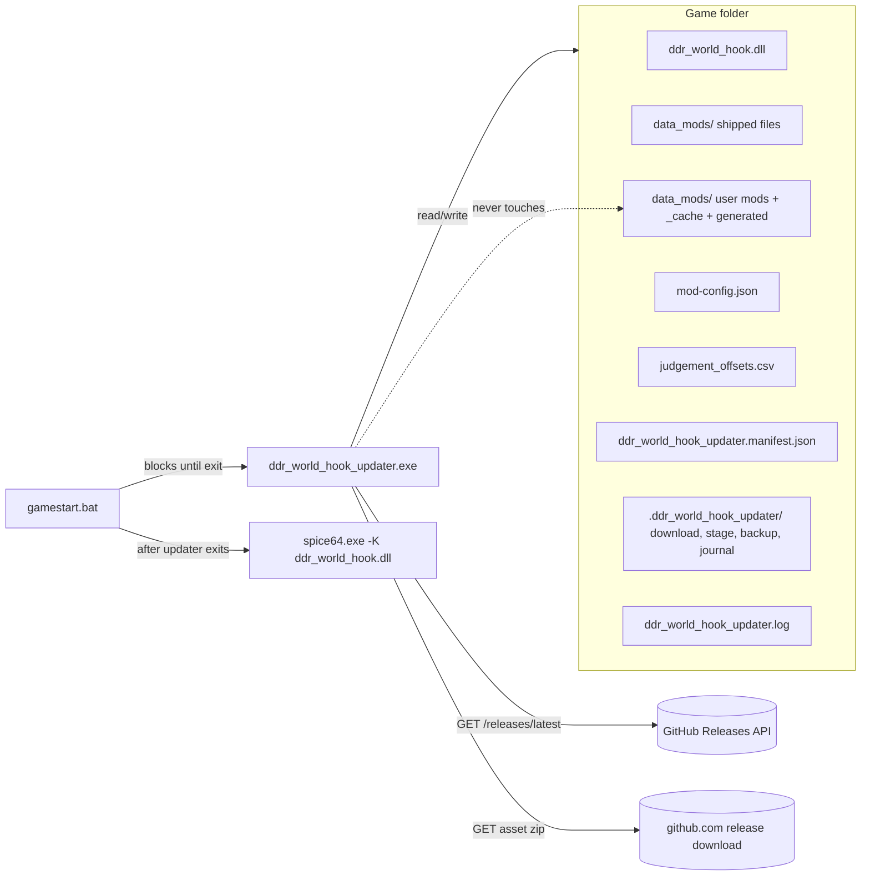

# Detailed Design: DDR World Hook Auto-Updater

Status: Approved 2026-09-13

## 1. Overview

`ddr_world_hook_updater.exe` is a standalone Windows console program that keeps a
DDR World Universal Modpack installation current with the newest release
published at `https://github.com/skogaby/ddr-world-universal-modpack/releases`.
It is placed in the game folder (the folder containing `spice64.exe`) and
invoked from the operator's `gamestart.bat` on the line before spice2x is
launched; because a bare `.exe` call blocks a batch file until the program
exits, the game cannot start until the update check (and any update) has
finished.

On each run the updater:

1. Resolves the game folder and refuses to act anywhere that does not look like
   one.
2. Asks the GitHub Releases API for the latest release and its single zip asset.
3. Compares the release's tag and asset SHA-256 with the locally recorded
   manifest; exits immediately when they match.
4. Downloads the zip, verifies it against the digest GitHub publishes, and
   extracts it to a staging directory.
5. Computes merged versions of the two user-owned files — `mod-config.json`
   (additive key merge, user values win, header-aware insertion into
   `custom_options.option_menu_settings`) and `judgement_offsets.csv` (fill
   blank cells, append missing songs, never overwrite a user value).
6. Applies everything transactionally: every replaced or removed file is backed
   up first, files the previous release shipped but the new one dropped are
   pruned only if unmodified, user content and runtime-generated files are never
   touched, and any failure rolls the folder back to its pre-run state.
7. Replaces its own executable (it ships inside the release zip), writes the
   manifest, and exits 0 so the game starts.

Design goals, in priority order: never leave a cabinet unable to boot; never
lose a user's configuration or their own mods; keep the installation exactly
equal to the release for everything the release owns; require nothing of the
operator beyond one line in `gamestart.bat`.

The updater updates the **hook** (DLL, its data files, its configuration
merges). It never touches the game's own files, spice2x, or `gamestart.bat`.

## 2. Detailed Requirements

Requirements consolidate the accepted decisions. "MUST" is normative.

### 2.1 Product and delivery
- **R1** The updater is a single native Windows x64 executable named
  `ddr_world_hook_updater.exe`, written in Rust as a separate binary crate
  `updater/` in the modpack repository (own `Cargo.toml`/`Cargo.lock`; not a
  Cargo workspace member of the DLL package).
- **R2** It MUST run on Windows 7 SP1 and later and under Wine/CrossOver. It is
  therefore built exactly like the hook DLL's release build: nightly toolchain,
  `cargo xwin build --release --target x86_64-win7-windows-msvc -Z build-std`,
  which avoids the `bcryptprimitives!ProcessPrng` import that makes default
  MSVC-target binaries unloadable on Windows 7.
- **R3** The executable ships at the root of every release zip
  (`scripts/build_release_archive.sh` builds it and adds it), so installations
  receive updater fixes automatically; the updater MUST be able to replace its
  own running image.
- **R4** TLS MUST NOT depend on the operating system's TLS stack or root store
  (unpatched Windows 7 lacks TLS 1.2, which GitHub requires): use rustls with
  bundled Mozilla roots.

### 2.2 Version identity
- **R5** The updater records what it installed in
  `ddr_world_hook_updater.manifest.json` in the game folder: release tag, asset
  name and SHA-256, and the SHA-256 of every release-owned file it wrote.
- **R6** An update is required iff there is no manifest, or the latest
  release's `tag_name` differs from the manifest's, or the zip asset's SHA-256
  differs from the manifest's. Comparison is **equality, not ordering**:
  deleting a release on GitHub makes cabinets move to whatever is now latest,
  and re-uploading an asset to an existing tag propagates.
- **R7** `--force` reinstalls the latest release regardless of the manifest.

### 2.3 Release-owned files (`ddr_world_hook.dll`, `data_mods/`, `README.md`, the updater)
- **R8** Every file in the zip except `mod-config.json`, `judgement_offsets.csv`
  and `ddr_world_hook_updater.exe` is release-owned and is written/overwritten
  unconditionally.
- **R9** A path recorded in the PREVIOUS manifest that is absent from the new
  zip is deleted iff the file on disk still hashes to the previous manifest's
  recorded value; otherwise it is kept and reported as locally modified.
- **R10** Any path in neither the new zip nor the previous manifest is never
  read, written or deleted. This protects user mod folders under `data_mods/`
  (the LayeredFS root), `data_mods/_cache/**`, enable-time generated `*_ifs/`
  directories, `texturelist.merged.xml` files, `*.arc` files and anything else
  the DLL generates.
- **R11** With no previous manifest (first run in a folder) nothing is deleted.

### 2.4 `mod-config.json`
- **R12** Merge on the parsed JSON tree, never on text. For each key in the
  release object: absent in the user object → copy the release subtree; present
  in both and both values are objects → recurse; otherwise keep the user value.
  Arrays and scalars are atomic; a type mismatch keeps the user value.
- **R13** Exception: `custom_options.option_menu_settings` (an array of
  `{id, overlay?, in_game?}` rows) is merged element-wise: every release row
  whose `id` (case-insensitive) is absent from the user array is inserted
  **inside the section of the header it sits under in the release**, after the
  nearest preceding release sibling that the user still keeps in that section,
  else at the end of that section (or directly after the header when the row
  immediately follows the header in the release). Header rows (`id` starting
  with `header_`) missing from the user array are inserted by the same rule.
  Existing user rows, their order and their flags are never changed; rows the
  release no longer ships are kept.
- **R14** The output preserves the user's key order and appends new keys at the
  end of their parent object; 2-space indentation; trailing newline.
- **R15** No user file → the release file is copied. An unparseable user file is
  backed up, left untouched, and the config merge is skipped with a warning;
  the rest of the update proceeds.

### 2.5 `judgement_offsets.csv`
- **R16** Parse both files with the DLL's grammar: optional header
  `code,p1_offset,p2_offset` on line 1; LF or CRLF; trimmed cells; blank cell =
  unset; integers clamped to −100..=100; lines with more than three cells or a
  non-integer cell are dropped; empty code dropped; the first occurrence of a
  duplicate code wins.
- **R17** Merge at cell level: for each release row, a user row with the same
  code has each **blank** cell filled from the release and each **non-blank**
  cell left alone; codes absent from the user file are appended in release
  order.
- **R18** Output: header, user rows in their existing order, appended rows,
  LF line endings, trailing newline, written via temp file + rename. The file
  is rewritten only when the merge changed something. No user file → copy;
  unparseable → same policy as R15.

### 2.6 Execution contract
- **R19** Non-interactive. No prompts, no `pause`, unless the updater detects it
  owns its console alone (double-clicked from Explorer), in which case it waits
  for Enter before closing so the output can be read.
- **R20** Exit code 0 for: already current, updated, skipped (offline, timeout,
  API error, no asset, digest mismatch, invalid archive, game folder not
  recognised), update failed but fully rolled back. Exit code 1 only when a
  rollback itself failed and the installation may be inconsistent — with a
  console message naming the backup directory. `--check` exits 0 (current) or 3
  (update available) and changes nothing.
- **R21** Network: 10 s connect timeout, 30 s per-read timeout, no overall cap,
  no retries within a run (the next boot retries), mandatory `User-Agent`.
- **R22** The game folder is the directory containing the executable
  (`--game-dir` overrides). The updater refuses to run unless that folder
  contains `spice64.exe` or `ddr_world_hook.dll`.
- **R23** All mutations are transactional (Section 6): backups before writes,
  a journal that lets an interrupted run be rolled back at the next start, the
  manifest written last.
- **R24** Self-update by rename-swap: rename the running
  `ddr_world_hook_updater.exe` to `ddr_world_hook_updater.exe.old`, write the
  new one, delete stale `.old` files at the next start. Rename failure → warn,
  skip self-update, continue.
- **R25** `--include-prerelease` selects the newest published release including
  pre-releases; the default uses `/releases/latest` (stable only).
- **R26** Diagnostics: console progress plus `ddr_world_hook_updater.log` in the
  game folder, overwritten each run; on update, the release name and the first
  lines of its changelog are shown.
- **R27** `--from-zip <path> [--tag <name>]` installs a local archive through
  the identical pipeline without network access (maintainer testing).

### 2.7 Out of scope
Editing `gamestart.bat`; launching or configuring spice2x; code signing;
reading the manifest from the DLL (the hardcoded splash version in
`src/lib.rs` is a follow-up); version pinning (operators remove the bat line to
opt out); manual `--rollback` (the last backup directory is kept for manual
recovery).

### 2.8 Assumptions
- Each release has exactly one asset matching
  `ddr-world-universal-modpack-*.zip`, built by `scripts/build_release_archive.sh`
  with a flat layout (zip root = game folder). All three published releases
  satisfy this.
- GitHub continues to publish `digest: "sha256:<hex>"` per asset (true for
  every asset so far). If absent, download verification degrades to a size
  check with a warning.
- The committed `mod-config.json` is the release default configuration; new
  `mods.<id>` keys therefore arrive with whatever value the maintainer
  committed.
- Cabinets that already run the hook DLL have the Universal CRT the DLL
  imports; the updater imports the same set.
- The in-game UI cannot produce a blank judgement offset, so a blank user cell
  means "no preference" rather than a deliberate erasure.

## 3. Architecture Overview



Internal structure of the crate (`updater/src/`):

| Module | Responsibility | Pure? |
|--------|----------------|-------|
| `main.rs` | CLI parsing, top-level `catch_unwind`, exit code mapping, console-owner detection | no |
| `log.rs` | Console + file logger (`INFO`/`WARN`/`ERROR`, elapsed-time prefix) | no |
| `gamedir.rs` | Resolve game folder from `current_exe()` / `--game-dir`; safety gate; work-dir layout | no |
| `github.rs` | Release feed client and JSON model; latest/prerelease selection; asset selection; digest parsing | parsing pure, HTTP thin |
| `download.rs` | Streaming download to `download/<asset>` with running SHA-256, size check, progress | no |
| `archive.rs` | Zip extraction into `stage/` with path-safety checks and size/entry caps; returns the release file list | no |
| `merge/json.rs` | `merge_config(user, release) -> (Value, MergeReport)` | yes |
| `merge/option_menu.rs` | `merge_option_menu_settings(user, release) -> Vec<Value>` | yes |
| `merge/csv.rs` | `CsvDoc` parse/serialize mirroring the DLL grammar; `merge_csv(user, release) -> (CsvDoc, CsvReport)` | yes |
| `manifest.rs` | `Manifest` read/write; `needs_update`; SHA-256 helpers | pure except I/O wrappers |
| `plan.rs` | Build the ordered `Plan` of file actions from stage listing + previous manifest + disk probe results | yes (disk probe injected) |
| `apply.rs` | Journal, backups, execution of the plan, rollback, crash recovery | no |
| `selfupdate.rs` | Rename-swap of the running executable; `.old` cleanup | no |

Pure modules take plain data (`serde_json::Value`, `&str`, listings) and return
data; every I/O-free rule in Sections 4–6 lives in them so the host test suite
covers the logic that decides what happens to a user's files.

### 3.1 A run, end to end

```mermaid
sequenceDiagram
    participant B as gamestart.bat
    participant U as updater
    participant G as GitHub
    participant F as Game folder
    B->>U: ddr_world_hook_updater.exe
    U->>F: resolve game dir, gate (spice64.exe | ddr_world_hook.dll)
    U->>F: delete *.exe.old; recover interrupted journal if present
    U->>G: GET /repos/…/releases/latest (or /releases)
    G-->>U: tag_name, assets[{name,size,digest,url}]
    U->>F: read manifest
    alt tag & digest match and not --force
        U-->>B: "up to date (vX.Y)", exit 0
    else update needed
        U->>G: GET asset zip (stream → download/, sha256)
        U->>U: verify digest; extract → stage/; list files
        U->>F: read mod-config.json, judgement_offsets.csv
        U->>U: merge config, merge csv (pure)
        U->>U: plan = writes + prunes + merges + self-update
        U->>F: write journal; clear backup/
        loop each action
            U->>F: move target → backup/, write new file
        end
        U->>F: rename self → .old, write new exe
        U->>F: write manifest (temp+rename); delete journal
        U-->>B: "updated to vX.Y", exit 0
    end
```

Any failure between "write journal" and "delete journal" runs the rollback of
Section 6.3; a crash there is recovered at the next start.

## 4. Components and Interfaces

### 4.1 Command line

```
ddr_world_hook_updater.exe [OPTIONS]

  --game-dir <DIR>        Game folder (default: the folder containing this exe)
  --check                 Report whether an update is available; change nothing
                          (exit 0 = current, 3 = update available)
  --force                 Reinstall the latest release even if already current
  --include-prerelease    Consider pre-releases (newest by published_at)
  --from-zip <PATH>       Install this local archive instead of downloading
  --tag <NAME>            Tag to record with --from-zip (default: local:<sha256 prefix>)
  --repo <OWNER/NAME>     Override the GitHub repository (testing)
  --help / --version
```

Unknown options print usage and exit 0 (a mistyped bat line must not block the
game). Argument parsing is hand-written (a dozen flags; no CLI crate).

### 4.2 `gamedir`

```rust
pub struct GameDir { pub root: PathBuf, pub work: PathBuf /* root/.ddr_world_hook_updater */ }
pub fn resolve(cli_override: Option<&Path>) -> Result<GameDir, Refusal>;
```
`resolve` canonicalises `current_exe().parent()` (or the override) and requires
`root/spice64.exe` or `root/ddr_world_hook.dll` to exist. `Refusal` carries a
one-line human explanation; the caller prints it and exits 0. Work-dir layout:

```
.ddr_world_hook_updater/
  download/    zip being fetched (deleted on success)
  stage/       extracted release (deleted on success)
  backup/      pre-run copies of every replaced/removed file, mirrored paths (kept until the next apply)
  journal.json present only while an apply is in flight
```

### 4.3 `github`

```rust
pub struct Release { pub tag_name: String, pub name: Option<String>, pub body: Option<String>,
                     pub draft: bool, pub prerelease: bool, pub published_at: Option<String>,
                     pub html_url: Option<String>, pub assets: Vec<Asset> }
pub struct Asset   { pub name: String, pub size: u64, pub digest: Option<String>,
                     pub browser_download_url: String }

pub fn fetch_latest(agent: &Agent, repo: &str, include_prerelease: bool) -> Result<Release, NetError>;
pub fn select_release(list: &[Release]) -> Option<&Release>;      // pure: non-draft, newest published_at
pub fn select_asset(release: &Release) -> Option<&Asset>;         // pure: ddr-world-universal-modpack-*.zip
pub fn parse_digest(digest: &str) -> Option<[u8; 32]>;             // pure: "sha256:<64 hex>"
```

Endpoints: `https://api.github.com/repos/{repo}/releases/latest` (default) or
`…/releases?per_page=10` (with `--include-prerelease`, then `select_release`).
Headers: `User-Agent: ddr_world_hook_updater/<version>`,
`Accept: application/vnd.github+json`. HTTP status other than 200 (including
403 rate limiting) is a `NetError` → skip. `select_asset` picks the asset whose
name starts with `ddr-world-universal-modpack-` and ends with `.zip`; with
several candidates the first is used and a warning is logged.

### 4.4 `download`

```rust
pub struct Downloaded { pub path: PathBuf, pub sha256: [u8; 32], pub bytes: u64 }
pub fn fetch_asset(agent: &Agent, asset: &Asset, dest_dir: &Path, progress: &mut dyn FnMut(u64, u64)) -> Result<Downloaded, NetError>;
```
Streams the body to `download/<asset name>` in 64 KiB chunks through a
`Sha256` hasher, following redirects (GitHub serves assets via a 302 to its
object store). Afterwards: byte count must equal `asset.size`; if
`asset.digest` parses, the hash must match, else warn. Progress is printed at
10 % steps.

### 4.5 `archive`

```rust
pub struct StagedRelease { pub root: PathBuf /* stage/ */, pub files: Vec<RelPath> }
pub fn extract(zip_path: &Path, stage_root: &Path) -> Result<StagedRelease, ArchiveError>;
```
Rules: every entry name must pass `ZipFile::enclosed_name()` (rejects `..`,
absolute paths, drive letters); directory entries create directories; entries
whose mode marks a symlink are rejected; caps of 100 000 entries and 2 GiB
total uncompressed size; the archive must contain `ddr_world_hook.dll` at its
root, otherwise it is not a modpack release (`ArchiveError::NotAModpack`).
`RelPath` is a forward-slash relative path (`data_mods/x/y.png`), the key form
used by the manifest.

### 4.6 `merge::json`

```rust
pub struct MergeReport { pub added: Vec<String> /* dotted paths */, pub menu_rows_added: Vec<String> }
pub fn merge_config(user: &Value, release: &Value) -> (Value, MergeReport);
```
`Value` is `serde_json::Value` with `preserve_order`. Algorithm (R12), applied
recursively with the current dotted path:

```
merge(user, release, path):
  if !user.is_object() || !release.is_object(): return user.clone()
  out = user.clone()                       // keeps the user's key order
  for (k, rv) in release:
    if path == "custom_options" && k == "option_menu_settings":
       out[k] = merge_option_menu_settings(user[k] as array or [], rv as array or [])   // §4.7
       (if either side is not an array: keep user value, or copy release when user lacks the key)
    else if k not in out:            out.insert(k, rv.clone()); report.added.push(path.k)
    else if out[k] and rv are objects: out[k] = merge(out[k], rv, path.k)
    else: keep out[k]
  return out
```
Serialisation: `serde_json::to_string_pretty` + `\n`. When the serialised
result equals the current file bytes the write is skipped.

### 4.7 `merge::option_menu`

```rust
pub fn merge_option_menu_settings(user: &[Value], release: &[Value]) -> Vec<Value>;
```
Definitions: `id(e)` = the row's `"id"` string lower-cased (rows without a
string id are opaque: kept where they are, never matched, never inserted);
`is_header(e)` = `id(e).starts_with("header_")`; `pos(out, id)` = index of the
first row in `out` with that id; `section(out, h)` = the index range from
`pos(out,h)+1` to the next header row (or the end); `pre_header(out)` = the
range from 0 to the first header row (or the end when there is none).

```
out = user.to_vec()
for (ri, r) in release.enumerate():
  if id(r) is None or pos(out, id(r)).is_some(): continue
  h = index of the nearest header row in release[..ri] (None if no header precedes r)
  region, header_pos = match h:
     Some(hi) => (section(out, id(release[hi])), Some(pos(out, id(release[hi]))))   // always present: processed earlier
     None     => (pre_header(out), None)
  siblings = release[h.map_or(0, |hi| hi + 1) .. ri]      // release rows between the header and r
  anchor = siblings.iter().rev().find_map(|s| pos(out, id(s)).filter(|p| region.contains(p)))
  insert_at = match (anchor, siblings.is_empty(), header_pos):
     (Some(p), _, _)        => p + 1                      // right after the nearest kept sibling
     (None, true, Some(hp)) => hp + 1                     // r directly follows its header in the release
     (None, true, None)     => region.start               // first pre-header row
     (None, false, _)       => region.end                 // siblings exist but the user moved them elsewhere
  out.insert(insert_at, r.clone())
```
Because release rows are processed in order, every release row preceding `r`
is already present in `out` (originally or just inserted), so the header of
`r` is always found when it exists. Worked examples (ids abbreviated;
`hA`/`hB` are headers):

| Release | User | Result | Why |
|---------|------|--------|-----|
| `hA a b N` | `hA a b` | `hA a b N` | anchor = `b` |
| `hA N a b` | `hA a b` | `hA N a b` | no siblings → after header |
| `hA a b N hB c` | `hB c hA a b` | `hB c hA a b N` | sections reordered; anchor `b` inside `hA`'s section |
| `hA a b N` | `hA a hB c b` | `hA a N hB c b` | user moved `b` to `hB`; `b` is outside the section, `a` anchors |
| `hA a hB c` | `hA a` | `hA a hB c` | new header inserted after `a`; `c` follows its header |
| `x hA a` | `hA a` | `x hA a` | pre-header row, no siblings → index 0 |
| `hA a` | `a` | `hA a` | header before any user header → pre-header start |

Rows in `user` that the release lacks stay in place; flags of existing rows are
never modified; inserted rows are copied verbatim.

### 4.8 `merge::csv`

```rust
pub struct CsvRow { pub code: String, pub offsets: [Option<i8>; 2] }
pub struct CsvDoc { pub rows: Vec<CsvRow> }            // + private code→index map
pub struct ParseStats { pub dropped_lines: usize, pub duplicates: usize, pub clamped: usize }
pub struct CsvReport { pub cells_filled: usize, pub rows_appended: usize }

pub fn parse(text: &str) -> (CsvDoc, ParseStats);       // grammar of R16
pub fn serialize(doc: &CsvDoc) -> String;               // header + rows, LF, trailing newline
pub fn merge_csv(user: &mut CsvDoc, release: &CsvDoc) -> CsvReport;
```
`merge_csv` (R17):
```
for r in release.rows:
  match user.index(&r.code):
    Some(i) => for side in 0..2:
                 if user.rows[i].offsets[side].is_none() && r.offsets[side].is_some():
                    user.rows[i].offsets[side] = r.offsets[side]; report.cells_filled += 1
    None    => user.push(r.clone()); report.rows_appended += 1
```
The file is rewritten only when `cells_filled + rows_appended > 0`. The grammar
intentionally mirrors `src/mods/per_song_judgement_offsets/csv.rs` in the DLL
(the DLL rewrites the same file with the same normalisations at runtime);
parity is pinned by tests that share literal fixtures with that module.

### 4.9 `manifest`

```rust
pub struct Manifest {
    pub schema: u32,                  // 1
    pub tag: String,
    pub release_name: Option<String>,
    pub asset_name: String,
    pub asset_sha256: String,         // lowercase hex
    pub installed_at_unix: u64,
    pub updater_version: String,      // CARGO_PKG_VERSION of the updater that wrote it
    pub files: BTreeMap<RelPath, String>,   // release-owned file → sha256 hex
}
pub fn read(game: &GameDir) -> Result<Option<Manifest>, ManifestError>;   // Ok(None) when absent; Err when unparseable (treated as absent + WARN)
pub fn needs_update(current: Option<&Manifest>, tag: &str, asset_sha256: &str, force: bool) -> bool;
pub fn sha256_file(path: &Path) -> io::Result<[u8; 32]>;
```
`files` lists every release-owned path written by the run (R8) including
`ddr_world_hook.dll`, `README.md`, all of `data_mods/**` from the zip, and the
updater executable; it excludes the two merged files. Written with
`to_string_pretty`, temp file + rename, LAST in the apply sequence.

### 4.10 `plan`

```rust
pub enum Action {
    Write   { rel: RelPath, existed: bool },        // copy stage/rel → root/rel (backup first if existed)
    Prune   { rel: RelPath },                       // move root/rel → backup/rel
    KeepModified { rel: RelPath },                  // report only
    WriteMerged { rel: RelPath, existed: bool },    // mod-config.json / judgement_offsets.csv from bytes
    SelfUpdate,                                     // rename-swap the exe
    WriteManifest,
}
pub struct Plan { pub actions: Vec<Action>, pub new_manifest_files: BTreeMap<RelPath, String> }

pub fn build(stage: &StagedRelease, stage_hashes: &BTreeMap<RelPath, String>,
             previous: Option<&Manifest>, probe: &dyn Fn(&RelPath) -> DiskState,
             merged: &MergedFiles) -> Plan;
pub enum DiskState { Missing, Present { sha256: String } }
```
Rules, in order:
1. For every staged file except the merged pair and the updater exe →
   `Write { existed = probe(rel) != Missing }`; its stage hash goes into
   `new_manifest_files`.
2. For every path in `previous.files` not in the stage listing, not the updater
   exe, not a merged file: `Present{sha}` with `sha == previous.files[rel]` →
   `Prune`; `Present` with a different hash → `KeepModified`; `Missing` →
   nothing.
3. `WriteMerged` for `mod-config.json` and `judgement_offsets.csv` when the
   merge produced new bytes (skipped when unchanged or when R15 applied).
4. `SelfUpdate` when the stage contains the updater exe and its hash differs
   from the running executable's.
5. `WriteManifest`.

Directory entries in the zip are created on demand by `Write`; directories
left empty by `Prune` are removed best-effort after the plan succeeds (only
directories under `data_mods/` that are ancestors of pruned files and are now
empty).

### 4.11 `apply`

```rust
pub struct Journal { pub tag: String, pub actions: Vec<Action>, pub started_unix: u64 }
pub fn recover_if_interrupted(game: &GameDir) -> Result<Recovery, ApplyError>;   // at start-up
pub fn execute(game: &GameDir, plan: &Plan, stage: &StagedRelease, merged: &MergedFiles, manifest: Manifest) -> Result<(), ApplyError>;
```
`execute` implements Section 6. `ApplyError::RolledBack(cause)` maps to exit 0,
`ApplyError::RollbackFailed { cause, restore_errors }` to exit 1.

### 4.12 `selfupdate`

```rust
pub fn cleanup_stale(exe_dir: &Path);                          // delete ddr_world_hook_updater.exe.old (best-effort)
pub fn swap_in(new_exe: &Path, running_exe: &Path) -> Result<SwapReceipt, io::Error>;   // rename running → .old, copy new → running
pub fn undo(receipt: &SwapReceipt) -> io::Result<()>;          // delete new, rename .old back
```
Windows and Wine permit renaming an executing image but not deleting or
overwriting it; the `.old` file is removed by `cleanup_stale` on the next run
(on Windows the deletion succeeds once the old process has exited).

### 4.13 Console / log output

Log lines: `[+12.34s] INFO  message` to both the console and
`ddr_world_hook_updater.log` (truncated at start of run; first line records the
updater version, unix time, game folder, arguments). Representative console
transcripts:

```
DDR World Hook updater 0.1.0
Game folder: C:\Games\DDR\contents
Checking github.com/skogaby/ddr-world-universal-modpack ... up to date (v1.2)
```
```
Checking github.com/skogaby/ddr-world-universal-modpack ... update available: v1.3
  v1.3 - Anchor mode, bottom-line stats, S-Marv upload
  • New: …
  (full notes: https://github.com/…/releases/tag/v1.3)
Downloading ddr-world-universal-modpack-20260920.zip (6.5 MB) ... 100%
Verifying ... ok
Extracting ... 412 files
Merging mod-config.json ... 3 keys added (mods.new-mod, s_marvelous.receptor_flash, …), 1 menu row placed under header_training_options
Merging judgement_offsets.csv ... 14 offsets filled, 3 songs added
Installing ... 411 files written, 2 obsolete files removed, 1 locally modified file kept
Updater replaced; restart the game normally.
Updated to v1.3.
```
```
Checking github.com/… ... skipped (could not reach api.github.com: timed out) — starting the game with the installed version.
```

## 5. Data Models

### 5.1 `ddr_world_hook_updater.manifest.json`

```json
{
  "schema": 1,
  "tag": "v1.3",
  "release_name": "v1.3 - …",
  "asset_name": "ddr-world-universal-modpack-20260920.zip",
  "asset_sha256": "bf3de838811fcd1da23c406feaecc9e112dae10a3b73c34d4e7931b804eac5df",
  "installed_at_unix": 1789329600,
  "updater_version": "0.1.0",
  "files": {
    "README.md": "…64 hex…",
    "data_mods/assist_tick/clap_44k_mono.pcm": "…",
    "ddr_world_hook.dll": "…",
    "ddr_world_hook_updater.exe": "…"
  }
}
```
Paths are forward-slash, relative to the game folder, sorted (BTreeMap). A
manifest with an unknown `schema` or that fails to parse is treated as absent
(the next run re-installs and rewrites it) with a warning.

### 5.2 `.ddr_world_hook_updater/journal.json`

```json
{ "tag": "v1.3", "started_unix": 1789329600,
  "actions": [ {"Write": {"rel": "ddr_world_hook.dll", "existed": true}},
               {"Prune": {"rel": "data_mods/custom_options/select_music_option_v3_ifs/tex/old.png"}},
               {"WriteMerged": {"rel": "mod-config.json", "existed": true}},
               "SelfUpdate", "WriteManifest" ] }
```
Present only between the first mutation and the manifest write. Its existence
at start-up means the previous run was interrupted; recovery is Section 6.4.

### 5.3 Backup layout

`backup/<rel path>` mirrors the game-folder path of every file moved aside by
`Write{existed: true}`, `Prune`, `WriteMerged{existed: true}`; `backup/self/`
holds nothing (the old exe is the `.old` sibling). The directory is emptied at
the start of each apply and otherwise left for manual recovery.

### 5.4 Release/asset (GitHub) — the subset consumed

`tag_name`, `name`, `body`, `draft`, `prerelease`, `published_at`, `html_url`,
`assets[].{name,size,digest,browser_download_url}`. Unknown fields ignored.

### 5.5 Files in the game folder and their owner

| Path | Owner | Updater behaviour |
|------|-------|-------------------|
| `ddr_world_hook.dll`, `README.md`, `data_mods/**` shipped in the zip | release | overwrite; prune when dropped and unmodified |
| `ddr_world_hook_updater.exe` | release | rename-swap |
| `mod-config.json` | user (DLL rewrites sections at runtime) | additive merge (R12–R15) |
| `judgement_offsets.csv` | user (DLL appends/edits at runtime) | cell-level merge (R16–R18) |
| `data_mods/<user folder>/**`, `data_mods/_cache/**`, generated `*_ifs/`, `texturelist.merged.xml`, `*.arc`, `bg_preview/`, `step_data_exports/`, `log.txt`, … | user / DLL runtime | never touched |
| `ddr_world_hook_updater.manifest.json`, `.ddr_world_hook_updater/`, `ddr_world_hook_updater.log` | updater | owned |

## 6. Transactional Apply

### 6.1 Ordering
1. Pre-flight (no mutation): plan built; merged bytes computed; every `Write`
   source exists in `stage/`.
2. `backup/` emptied; `journal.json` written with the full action list.
3. Actions executed in plan order: all `Write`/`Prune`/`KeepModified`, then
   `WriteMerged` (config, then CSV), then `SelfUpdate`, then `WriteManifest`.
4. `journal.json` deleted; `download/` and `stage/` deleted.

### 6.2 Per-action semantics
- `Write{existed:true}`: `rename(root/rel → backup/rel)` (creating parents),
  then `rename(stage/rel → root/rel)`. Same volume, so both are atomic moves.
- `Write{existed:false}`: `rename(stage/rel → root/rel)`.
- `Prune`: `rename(root/rel → backup/rel)`.
- `WriteMerged`: write bytes to `root/rel.tmp`, back up the original as above,
  `rename(root/rel.tmp → root/rel)`.
- `SelfUpdate`: `swap_in`; failure is logged and the action is skipped (R24),
  not treated as an error.
- `WriteManifest`: temp + rename.

A locked file (the game still running; antivirus holding the DLL) surfaces as
an `io::Error` on the first rename and triggers rollback before anything else
has changed for that file.

### 6.3 Rollback (same run)
On the first `Err`, walk the actions already performed in reverse: `Write`/
`WriteMerged` with a backup → move `backup/rel` back (deleting the new file
first); without a backup → delete `root/rel`; `Prune` → move back;
`SelfUpdate` → `undo(receipt)`. Every restore error is collected; if any
occurred the run exits 1 and prints the list plus the `backup/` location;
otherwise the folder is exactly as before and the run exits 0 with the original
cause.

### 6.4 Crash recovery (next run)
If `journal.json` exists at start-up, the previous run died mid-apply. For each
journaled action: if `backup/rel` exists → move it back over `root/rel`; else
if the action was `Write{existed:false}` and `root/rel` exists → delete it;
`SelfUpdate` → if `.old` exists and the running exe hash differs from `.old`,
leave it (the new exe is what is running; the `.old` is deleted by
`cleanup_stale` — an interrupted self-update is not rolled back because the
running image cannot be replaced from within). Then delete the journal and
continue with a normal check: the manifest still names the OLD release (it is
written last), so the interrupted update simply happens again.

### 6.5 Idempotence
Because the manifest is written last and the merges are pure functions of
(user file, release file), re-running an interrupted or repeated update
converges to the same folder state; `--force` re-applies the current release
with no user-visible change beyond refreshed release-owned files.

## 7. Error Handling

| Situation | Detection | Behaviour | Exit |
|-----------|-----------|-----------|------|
| Not a game folder | gate in `gamedir::resolve` | one-line refusal | 0 |
| DNS/connect/read timeout, TLS failure, HTTP ≠ 200, rate-limited | `ureq` error / status | "skipped (reason) — starting the game with the installed version" | 0 |
| API JSON unparseable / no zip asset | `github` parse & select | skipped + WARN | 0 |
| Download size mismatch or digest mismatch | `download` | delete the download, skipped + WARN | 0 |
| Zip invalid, unsafe path, symlink entry, caps exceeded, no `ddr_world_hook.dll` | `archive::extract` | delete `stage/`, skipped + WARN | 0 |
| Manifest unparseable | `manifest::read` | treat as absent, WARN, proceed (re-install) | 0 |
| User `mod-config.json` / CSV unparseable | merge pre-flight | back up copy to `backup/`, skip that merge, WARN, proceed | 0 |
| I/O error during apply (locked DLL, disk full, permissions) | `apply::execute` | rollback (6.3); "update failed and was rolled back" | 0 |
| Rollback error | `apply::execute` | list unrestored files + backup path | 1 |
| Self-update rename fails | `selfupdate::swap_in` | WARN, continue | 0 |
| Manifest write fails after successful apply | `WriteManifest` | WARN; next run re-installs (idempotent) | 0 |
| Interrupted previous run | journal present at start | recover (6.4), then normal flow | per flow |
| Panic anywhere | top-level `catch_unwind` | message + log; if inside apply the journal remains and the next run recovers | 0 |
| Usage error | CLI parser | print usage | 0 |

Rate limiting note: unauthenticated GitHub API allows 60 requests/hour per IP;
the updater issues one request per boot (the asset download is not metered),
so only shared-IP venues with many cabinets rebooting within an hour could hit
it — treated as "skipped", never as an error.

Security posture: HTTPS with certificate validation against bundled roots;
asset SHA-256 verified against GitHub's published digest; zip paths confined
to the game folder; no execution of downloaded content by the updater (the
DLL is later loaded by spice2x, as today); no elevation requested. The updater
writes only inside the resolved game folder.

## 8. Testing Strategy

The pure modules are covered by `cargo test` in `updater/`, runnable on the
macOS/Linux host without cross-compilation. The engine-facing surface (real
GitHub, Windows file locking, Windows 7) is covered by scripted manual checks.

### 8.1 Unit tests (host)
- `merge::json`: new top-level key; new nested key
  (`gameplay_timing_fixes.audio_clock.x`); user scalar wins; arrays atomic
  (`fps_unlock.presets` customised); type mismatch keeps user; user key order
  preserved and new keys appended; `custom_options` absent on user side copies
  the whole subtree including `option_menu_settings`; report lists dotted
  paths; idempotence (`merge(merge(u,r),r) == merge(u,r)`).
- `merge::option_menu`: the seven worked examples of §4.7; case-insensitive
  ids; duplicate ids in user list (first wins for positioning); rows without
  `id` on either side; release rows carrying `overlay`/`in_game` copied
  verbatim; user flags untouched; ids the release dropped kept; the real
  shipped `option_menu_settings` merged with itself is a no-op, and with any
  single row removed reproduces the original order.
- `merge::csv`: grammar parity fixtures copied from the DLL's `csv.rs` tests
  (header optional, CRLF, trimming, clamp ±100, >3 cells dropped, non-integer
  dropped, duplicate first-wins, `code,,5` legal); blank cell filled; non-blank
  kept; per-side independence; missing rows appended in release order; user
  row order preserved; no-change → `cells_filled + rows_appended == 0`; the
  repo's `judgement_offsets.csv` merged with itself is a no-op; LF + trailing
  newline output.
- `github`: fixture JSON captured from the live API (v1.0–v1.2 responses):
  asset selection by name; multiple assets; missing digest; `parse_digest`
  edge cases; `select_release` ignores drafts and orders by `published_at`
  with and without pre-releases.
- `manifest`: round trip; `needs_update` truth table (absent / tag differs /
  digest differs / equal / force); unknown schema → absent.
- `plan`: first run (no previous) → no `Prune`; second run → `Prune` only for
  unchanged dropped files, `KeepModified` for changed, nothing for missing;
  unknown on-disk files never appear in the plan; merged files and the updater
  exe never pruned; `SelfUpdate` only when the hash differs.

### 8.2 Integration tests (host, temp directories)
- Build a synthetic game folder (`spice64.exe` stub, old DLL, `data_mods` with
  shipped + user + `_cache` files, a customised `mod-config.json`, a CSV with
  user values) and a synthetic release zip; run the full pipeline via
  `--from-zip`. Assert: shipped files replaced, user/`_cache` files untouched,
  merges as specified, manifest written, `download/`/`stage/` gone, `backup/`
  holds the replaced originals.
- Second run with a zip that drops a file: pruned when unchanged, kept when
  modified locally.
- Injected failure mid-apply (a target path pre-created as a directory so the
  rename fails): folder byte-identical to before, exit 0.
- Journal left behind (simulated crash): recovery restores the folder; a
  subsequent run completes the update.
- Rename-swap logic on a dummy "running" file (semantics of a locked image
  cannot be reproduced on the host; the Windows/Wine behaviour is covered
  manually).
- `--check` exit codes; gate refusal in a folder without `spice64.exe`.

### 8.3 Build and platform checks
- `updater/` cross-builds with the release recipe inside
  `scripts/build_release_archive.sh`; the import table of the produced exe is
  checked for the absence of `ProcessPrng`/`bcryptprimitives.dll` (a one-line
  `strings | grep` guard in the script).
- Manual: run under CrossOver against the real API with `--check`, then a real
  update from a deliberately stale manifest; run on a Windows 10/11 machine and
  on a Windows 7 cabinet; verify a self-update leaves a working exe and that the
  `.old` file disappears on the following run; verify the locked-DLL case
  (game running) rolls back cleanly.

## Appendix A — Technology choices

| Concern | Choice | Reason |
|---------|--------|--------|
| Language / toolchain | Rust, repo-pinned nightly, `cargo xwin` cross-build, `x86_64-win7-windows-msvc` + `-Z build-std` | Identical to the DLL's release build; Win7-safe imports; a probe binary built with this stack ran under CrossOver and completed a TLS request to the GitHub API |
| HTTP/TLS | `ureq` 2.x (`default-features = false`, `tls`, `json`) → rustls + ring + `webpki-roots` | No dependence on Win7's TLS stack or root store; small; synchronous |
| Zip | `zip` 2.x, `deflate` only | The release archive is produced by Info-ZIP with deflate |
| JSON | `serde_json` with `preserve_order` | User key order survives the merge |
| Hashing | `sha2` | Asset digest verification and manifest hashes |
| Console detection | `windows-sys` (`Win32_System_Console`) | `GetConsoleProcessList` to detect a double-click launch (R19) |
| CLI parsing | hand-written | A dozen flags; keeps the binary small and the dependency tree short |
| Build profile | `opt-level = 2`, `lto = true`, `trim-paths = "all"` | Matches the DLL; no builder paths in the shipped binary |

Rejected: PowerShell/batch (Windows 7 ships PowerShell 2.0 without TLS 1.2 or
`Invoke-WebRequest`); WinHTTP/schannel (TLS 1.2 disabled on unpatched Win7);
a Cargo workspace with the DLL (the root manifest is a plain package using
unstable `cargo-features`; nothing is gained); folding the updater into the DLL
(cannot replace files while the game runs, and the requirement is to update
before launch).

## Appendix B — Facts about the DLL this design depends on

- `mod-config.json` and `judgement_offsets.csv` are opened by bare relative
  path from the process working directory (`src/mods/config.rs`,
  `src/mods/per_song_judgement_offsets/bootstrap.rs`); field `gamestart.bat`
  files `cd /d %~dp0` first, so both live next to `spice64.exe`.
- The DLL rewrites `mod-config.json` whole on any menu edit with keys sorted
  alphabetically (`serde_json` without `preserve_order`), 2-space indent;
  sections it writes: `mods`, `custom_options.p1/p2`, `timing_offsets`,
  `fps_unlock`, `quick_restart`, `shader_fixes`, `s_marvelous`, `resolution`,
  `power_user_statistics`, `overlay_menu`, `smx_hardware`. Unknown keys are
  tolerated and preserved.
- `option_menu_settings`: headers are ordinary row ids prefixed `header_`
  (registered by `decorative-option-headers`); unlisted normal rows fall to
  the end; unlisted headers are not rendered; unknown ids log one warning
  (`src/services/custom_options/ordering.rs`).
- `judgement_offsets.csv` grammar and writer are in
  `src/mods/per_song_judgement_offsets/csv.rs`; the boot crawl appends a blank
  row for every musicdb basename missing from the file — the reason the merge
  is cell-level.
- Runtime-generated content the DLL places under `data_mods/`: `_cache/**`,
  `s_marvelous/*_ifs/`, `custom_folders/select_music_folder_v3_ifs/{geo,afp}`
  + `.cache_meta.json`, `texturelist.merged.xml` under shipped `*_ifs/tex/`,
  `bg_preview/**`, `*.arc`.
- The release archive (`scripts/build_release_archive.sh`) is flat: zip root =
  game folder; it contains the Win7 DLL, `mod-config.json`,
  `judgement_offsets.csv`, `README.md`, `data_mods/` (git-tracked files only).

## Appendix C — Operator-facing documentation to add

README "Automatic updates" section:

```bat
@echo off
cd /d %~dp0
ddr_world_hook_updater.exe
start spice64.exe -ddr -modules modules -K ddr_world_hook.dll ...
```
Notes for the section: copy the exe into the game folder once (it is in the
release zip); it checks GitHub each launch and installs new releases before the
game starts; your `mod-config.json` values and per-song offsets are preserved
(new options are added with defaults); it never touches your own folders under
`data_mods/`; if offline it skips silently; the last replaced files are kept in
`.ddr_world_hook_updater/backup/`; remove the line to stop updating; add
`--include-prerelease` to test pre-release builds.
