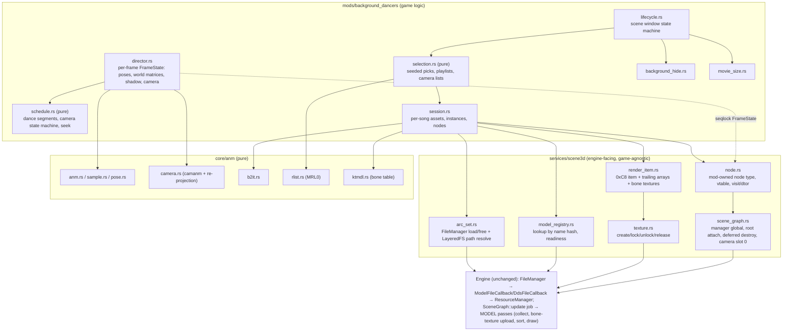
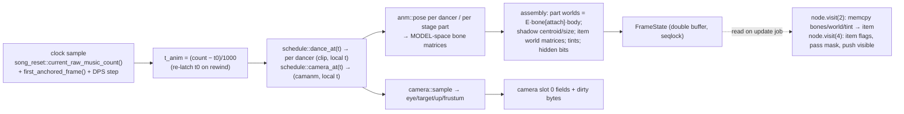

# Enable Background Dancers — Detailed Design

Status: Approved 2026-09-16 (maintainer; design calls 1–7 of the review accepted as written)

Mod id `background-dancers`, display name **"Enable Background Dancers"**. A DDR World hook-DLL mod that
revives the pre-World 3D background dancers: during every gameplay song a randomly chosen A3 stage and
randomly chosen A3 dancer(s) animate behind the lane, using the character / stage / motion / camera arcs
that the stock World install still ships but never opens.

Addresses in this document are file-relative to `gamemdx.dll` at image base `0x180000000` and refer to
World build **20260825** unless a build is named. "A3" = `gamemdx_20240402` (DDR A3 final), whose game-side
scene layer is the behavioural specification this design ports.

---

## 1. Overview

### 1.1 What survives in World and what the mod supplies

World's engine (`gs` / `agcs` / `me` libraries) still contains the entire 3D pipeline: the KTMDL model
loader (`.model` → GPU resource, registered by `Application::onBoot` as `agcs::ModelFileCallback`), the DDS
and ANM file callbacks, all model shaders (`gs_model_default`, `gs_model_skinning_default`, the ten `mdl_*`
variants — byte-identical `shader.arc`), the four `MODEL:*` render passes (three of them attached to the
RENDER-3D target every frame and driven with an *empty* item list), the `agcs::scene::SceneGraph` +
`SceneGraphManager` (root node, per-frame update job, render-item list, two camera slots, frustum culling,
deferred destroy) and the camera object whose view/projection are copied into the passes each frame.

Konami deleted only the **game-side scene layer**: the `ModelNode` / `TransformNode` / `AnimationNode` node
types, the ANM object + track evaluator + pose chain + animation player, and the
`CharaActor` / `StageActor` / `CameraActor` actors. World's `DancePlaySequence` still enables the scene graph
at its step 5 and its `SceneManageActor` still sets up the 2D background — the hooks the 3D layer hung off
are all still there.

The mod therefore supplies exactly that layer, in Rust, and lets the engine do everything GPU-facing:

- a **pure format layer** (`core/anm`): ANM/CAMANM parsing and sampling, the pose chain, B2IT, MRL0 rlists,
  the KTMDL bone table;
- an **engine-facing 3D scene service** (`services/scene3d`): arc registration, model-registry readiness,
  dynamic bone textures, hand-built render items, one mod-owned scene-graph node type, root attachment /
  deferred destroy, camera slot 0;
- the **mod** (`mods/background_dancers`): per-song random selection, the A3 choreography and camera
  sequencing rules, character assembly (body + parts + shadow), stage parts, the 2D background hide and the
  movie-size override, lifecycle and diagnostics.

No new detours are required for rendering. The only game-state writes outside our own objects are: the
camera slot-0 fields, a per-song alpha write on the game's own background clip layer, and a per-song,
restored, in-memory override of the movie-size customize field.

### 1.2 Scope of v1

- Single Mods-tab toggle. No per-player rows, no config section, no persistence of anything.
- Random stage + random dancer(s) per song; generic choreography pool; stage-camera sets.
- GAMEPLAY only (not the attract demo).
- Reads the stock install's arcs (LayeredFS mod-folder overrides honoured); ships no Konami assets.

Deferred (Phase 2, §10): song-specific choreography and cameras, the camera beat gate, STOP slow-motion,
face switching, fade-in stipple, the attract demo, dancers over a movie.

---

## 2. Detailed Requirements

### 2.1 Functional

| ID | Requirement |
|---|---|
| FR-1 | When the mod is enabled, every song entered through the normal play flow (scene window {26 SONG_TO_STAGE_INTERSTITIAL, 27 STAGE_INDICATOR, 28 GAMEPLAY}) shows a 3D stage and dancer(s) behind the lane, rendered by the game's own model passes. |
| FR-2 | **Stage selection:** uniform over the distinct stage KEYS of `map_resources.rlist` excluding `dummy00`, then uniform over that key's rows (so `replicant00`'s six rows and `boom00`'s two rows do not weight the pick); a candidate requires `data/arc/mapset_<key>.arc` to resolve (mod folder or stock). The `_g` gold-cabinet variant is never used. |
| FR-3 | **Dancer selection:** one dancer per entered side (`PlayerWork+0x4 != 0`; the Multiplayer Bot's phantom side counts), i.e. 1 in solo/doubles, 2 in versus; each dancer uniform over ALL `chara_resources.rlist` rows whose body arc `data/arc/pl_<key>.arc` resolves — unlock ids are ignored. Side 0's dancer is the left one. |
| FR-4 | **Choreography (A3 retail rule):** per dancer, a Fisher–Yates-shuffled playlist of the fixed generic pool for the row's sex — male `br01 br02 br03 hh01 hh02 ht01 ht02 ht03 ht04 ja01 ja02 sf01 sf02 sf03`, female `br01 br02 hh01 hh02 hh03 ht01 ht02 ht03 ja01 ja02 sf01 sf02 sf03` (clips `mc_<sex>_<name>_exec.anm` from `mc_<sex>.arc`) — started at song start; when the most-urgent dancer's clip has less than **1.5 s** remaining, BOTH dancers hard-cut to their next clip; the playlist cycles forever; no idle clip; no cross-fade. |
| FR-5 | **Camera (A3 stage mode):** the stage row's `stage_camera_resources.rlist` entries are split into a MAIN list and a `_non` list (names containing `_non`), both shuffled; the main list cycles on clip finish; switching is frozen while a dance clip has < 2.0 s left; at the 1.5 s cut a `_non` shot plays for `1 + U[0,1)` s (then the `_non` list rotates by one) before the main list resumes. Every `.camanm` is applied with the A3 re-projection (§5.5). The A3 beat gate on resume is NOT implemented in v1. |
| FR-6 | **Placement:** dancers at `x = (i − (n−1)/2) · 1.6 m`, `y = z = 0`, no rotation; stage parts at the origin; `pl_shadow00` under each dancer per the A3 shadow rule (§5.4). |
| FR-7 | **Visual completeness:** body + attached parts (`head00`, `hips00`, `chest00`, `face01`, `forearm00` on the left forearm AND its point-inverted copy on the right forearm) + shadow quad, uniform rlist `model_scale`; stage parts with their `_play_loop.anm` and `:N` low-priority pass mask. |
| FR-8 | **Time base:** animation time is derived from the game's content-domain music count (`GamePlayActor+0x178`, valid once the run is anchored), so SONG SPEED, in-place restarts, training scrubs and loops need no special handling; the whole dance/camera schedule is a pure function of (per-song seed, elapsed time since the song-start edge). |
| FR-9 | **Song-start edge / visibility:** nothing 3D is visible before the live `DancePlaySequence` reaches step 5 (the step that sets the SceneGraph enable bit — A3's `0x1046` edge); from that edge the stage loops, the dancers' first clips and the camera all start together. |
| FR-10 | **2D background:** the game's live `background_gameplay` clip (`bg_root`, stored at `BackgroundFrame+0x140`) is made fully transparent for the duration of the song by a per-frame multiplicative colour `(1,1,1,0)` on its AFP layer, restored to `(1,1,1,1)` when the song window ends. No placeholder asset, no destroy/release of game objects. |
| FR-11 | **Movie songs:** never suppressed. For every entered side whose `Customize+0x30` (movie size) reads 0 or 1 (fullscreen) at the first entry into the song window, the field is set to **2** (thumbnail) in memory for the song and restored to its original value when the window ends. Values 2/3 are left untouched. The player's persisted preference is unaffected (the logout write-back and the VIDEO SIZE row's scene-25 seed both happen after the restore). |
| FR-12 | **Re-roll granularity:** a new random pick is made once per song window (first entry into {26,27,28}); quick restarts (28→27→28), in-place `song_reset`s, training loops and course stages within the same window keep the pick and the loaded arcs. Everything is released when the scene leaves the window. |
| FR-13 | **Never gate the game:** the game is never waited on. If the models are not resident when the song starts, the dancers appear when they become resident; if they never do, the song plays without them and one WARN is logged. |
| FR-14 | **Fail-open:** any missing signature/derivation ⇒ the mod reports inactive (`is_active() == false`) with one WARN naming the site; any per-song failure ⇒ no dancers that song + one WARN; nothing the mod does can soft-lock or crash a song when its inputs are absent. |
| FR-15 | **Identity:** id `background-dancers`, name "Enable Background Dancers", listed in `DEFAULT_OFF_MODS` until cabinet-proven; no `mod-config.json` section. Developer aid: `DDR_DANCERS_PIN=<stage_key>[,<chara_key>[,<chara_key>]]` (only with `layeredfs.developer_mode`) pins the selection. |

### 2.2 Non-functional

| ID | Requirement |
|---|---|
| NFR-1 | Zero new detours for rendering; no engine function is patched. The only hook usage is the existing scene-change and per-frame callbacks (and, as a fallback only, the existing shared `CMovieClip::Create` capture). |
| NFR-2 | No hardcoded engine offsets in hook code: every engine address/offset the builders use is AOB-scanned or derived at boot, all-or-nothing, and swept over all four supported builds (20250805 / 20260224 / 20260721 / 20260825) with `scripts/validate_signatures.sh` + `shape_diff.py` over the consumer functions. |
| NFR-3 | Per-frame CPU cost ≤ ~0.3 ms on the game thread (two 33-bone dancers, ≤ 8 stage parts, camera) and O(1) when no song is armed. |
| NFR-4 | Allocator discipline: nodes, render items and their trailing arrays live in mod-owned `memory::alloc_zeroed` memory (the engine never frees an item); bone textures come from the engine texture API and are released by our node dtor; arcs via `FileManager::Free`. |
| NFR-5 | Threading discipline (§4.4): engine calls only on the game/render thread; item/node memory written only inside the node `visit` on the scene-graph update thread; publication between them through seqlocked, double-buffered frame state. |
| NFR-6 | No panics across FFI: `visit`/dtor are `extern "C"`, panic-free by construction and additionally wrapped in `catch_unwind`. |
| NFR-7 | Everything not touching the engine is host-testable (`cargo test` via the temp-crate harness) with fixtures generated from the existing Python codecs. |

### 2.3 Assumptions the design rests on

1. The hand-built render item + node are accepted by World's collector / bone-texture upload / draw loop
   exactly as A3's were (every consumer was read in both binaries; nothing has run). The plan's first steps
   prove this on a cabinet before anything else is built.
2. The skinning VS's vertex-texture fetch works under CrossOver/D3DMetal (never exercised under World).
3. The engine texture API's create/release pair for a dynamic `A32B32G32R32F` texture exists on all four
   builds (create documented on 20260616/20260721; release to be located during the spike).
4. `FileManager::Load` of an arc containing `.model` + `.dds` members registers textures so that the model
   converter (or the draw-time material bind) finds them — A3 used the same arcs through the same loader.
5. The `bg_root` clip's root multiplicative alpha hides the whole AFP background (standard Flash CXFORM
   inheritance) and the game does not re-set that colour per frame (a per-frame write defeats it if it does).
6. World's `DancePlaySequence` step 5 is the song-start edge for every song entered through the normal flow
   (verified in the binary; the in-place `song_reset` path re-anchors within the same DPS).

---

## 3. Architecture Overview

### 3.1 Layers



### 3.2 Per-song lifecycle

```mermaid
sequenceDiagram
  participant SM as scene_manager (callback, game thread)
  participant LC as lifecycle
  participant BG as std thread (parse)
  participant FR as on_frame (game thread)
  participant ENG as engine (FileManager, registry, SceneGraph job, passes)

  SM->>LC: scene → 26|27|28 (first entry into window)
  LC->>LC: eligibility (enabled, sites resolved, sides entered, rlists loaded)
  LC->>LC: seed; pick stage row, dancer rows, playlists, camera lists
  LC->>LC: movie_size override (per entered side 0/1 → 2, remember originals)
  LC->>ENG: FileManager::Load(every arc of the pick)  [via on_frame batch]
  LC->>BG: parse arcs: .anm/.camanm bytes, .b2it, .model bone tables
  loop every frame (Requested)
    FR->>ENG: model_registry lookup per model name
    FR->>FR: parse done? all models resident?
  end
  FR->>ENG: build items (+bone textures) and nodes; attach under root (hidden)
  FR->>FR: state = Built
  loop every frame (Built/Playing)
    FR->>FR: sample clock; DPS step ≥ 5 && anchored → Playing; FrameState = director(schedule, t)
    FR->>ENG: write camera slot 0; publish FrameState (seqlock)
    FR->>ENG: bg_root layer colour (1,1,1,0)
    ENG->>ENG: SceneGraph::update → node.visit(2): copy FrameState → item; visit(4): refresh, push visible
    ENG->>ENG: MODEL passes: bone-texture upload, sort, draw
  end
  SM->>LC: scene leaves {26,27,28}
  LC->>ENG: disable nodes, queue every node for deferred destroy
  LC->>ENG: restore bg_root colour; restore movie sizes
  ENG->>ENG: next manager tick: our dtor(node,1) frees item + bone textures + node
  FR->>ENG: FileManager::Free(arcs) once every dtor has run
```

### 3.3 Per-frame data flow (Playing)



---

## 4. Components and Interfaces

### 4.1 `core/anm` — pure format layer (host-tested, no engine dependency)

```rust
// core/anm/anm.rs
pub struct Anm { pub frame_count: u16, pub fps: f32, pub loops: bool, pub bone_tracks: Vec<Track>, pub camera_slots: [Option<Track>; 6] }
pub struct Track { pub kind: u16, pub channel: Channel, pub target: u8, pub key_count: u16, pub times: Option<Vec<u16>>, pub values: Range<usize> /* into the file bytes */ }
pub enum Channel { Rotation, Translation, Scale, CamQuat, CamPos, CamScalar }
pub fn parse(bytes: &[u8]) -> Result<Anm, AnmError>;         // header 0xFF010001, chunk map keyed on tag − 0xFF010002
impl Anm { pub fn duration_s(&self) -> f32 { self.frame_count as f32 / self.fps } }
```
Facts encoded: `fps` = header `+8` when a type-4 chunk exists, else 60.0; **loop flag = header byte `+6` bit 0**
(`*_loop` clips = 1, `*_exec` = 0 — read by A3's clip binder); type-0 chunk = bone tracks, type-4 = six camera
slots (`u32 rel_offsets` at chunk+8..+0x1C, 0 = absent), type-1 hierarchy ignored.

```rust
// core/anm/sample.rs
pub fn decode_q48(b: [u8; 6]) -> Quat;                         // a=(v>>32)&0x7FFF, b=(v>>17)&0x7FFF, c=(v>>2)&0x7FFF, m=v&3; f(x)=(x−16383.5)/23169.767578125
pub fn sample(bytes: &[u8], t: &Track, frame: f32) -> Sample; // uniform: i=floor(f), u=frac(f), clamp n−1; explicit: times[i] ≤ floor(f) < times[i1], dup-time skip; rot → slerp (negate on dot<0; lerp if 1−dot ≤ 1e-5); kinds 0x1B/0x20 step
pub fn clip_time(t: f32, dur: f32, loops: bool) -> (f32, bool /*finished*/); // loops: t mod dur (+dur if negative); else clamp [0,dur], finished at dur
```
Kinds: `0x1C` rotation (6 B q48), `0x1D` translation (12 B f32×3), `10` scale (16 B), `0x1E` (3×half),
`0x1F` (f32×3 base + half deltas), camera `1` (quat f32×4), `4` (f32×3), `8` (f32).

```rust
// core/anm/pose.rs
pub struct Skeleton { pub parents: Vec<i16>, pub bind_world: Vec<Mat4>, pub inverse_bind: Vec<Mat4> }   // from the KTMDL bone table
pub fn seed_local_trs(sk: &Skeleton) -> Vec<Trs>;              // bindWorld[i] · inverse(bindWorld[parent]) decomposed (roots: bindWorld[i]) — A3 FUN_18013ba50
pub fn evaluate(anm: &Anm, bytes: &[u8], frame: f32, sk: &Skeleton, seed: &[Trs], out_world: &mut [Mat4]); // local = S·R(q), translation row 3; non-roots: 3×3 columns ÷ parent scale; world = local · world[parent] (row-vector)
```
Bones without a track keep the bind-derived seed (A3 semantics; the Python `evaluate_pose` defaults to identity
and is only equivalent on the 33-track dance clips).

```rust
// core/anm/camera.rs
pub struct CamSample { pub eye: Vec3, pub target: Vec3, pub up: Vec3, pub l: f32, pub r: f32, pub b: f32, pub t: f32, pub near: f32, pub far: f32 }
pub fn sample_camera(anm: &Anm, bytes: &[u8], frame: f32, near_mul: f32, aspect_mul: f32) -> CamSample;
```
Recipe (A3 `FUN_18001cb50`, verified in-game on A3): `R = quat_to_rowmat(q)`; `eye = pos·0.01`;
`target = eye − 10.0·R.row2` (the A3 `1000·row2` shifted by the same 0.01); `up = normalize(R.row1)`;
`t' = tan(½·atan2(2, 2·tan(fovV·π/360)·aspect_file·aspect_mul))`; `l/r = ∓t'`, `b/t = ∓t'/(16/9)`;
`near = slot3·near_mul`, `far = slot4`. Defaults when a slot is absent: fovV 41.53°, near 0.1, far 10000, aspect 4/3.

```rust
// core/anm/b2it.rs      pub fn parse(bytes) -> Result<Vec<(String, u32)>>;  pub fn index_of(table, name) -> Option<u32>  // sorted, binary search
// core/anm/rlist.rs     pub fn parse(bytes) -> Result<Vec<(String, Vec<String>)>>   // MRL0 LE; duplicate keys preserved positionally
// core/anm/ktmdl.rs     pub fn bone_table(bytes) -> Result<Skeleton>  // header bone_count @0x18, bone_off @0x1C; records 0xB0: bind +0x10, inverse +0x50, parent i16 @0xAC
```

### 4.2 `services/scene3d` — engine-facing 3D scene service

All functions are game/render-thread only unless stated. Every offset below is a *derived* value published by
the signature store (§4.2.7); the literal numbers are the 20260825 values used for exposition.

#### 4.2.1 `arc_set.rs`
```rust
pub struct ArcSet { handles: Vec<(String /*game path*/, i32 /*fm handle*/)> }
pub fn resolve_path(game_rel: &str) -> Option<String>;  // "data/arc/pl_emi00.arc" → mod-folder override via avs_layeredfs::find_first_modfile("arc/pl_emi00.arc") else stock; None if neither exists
pub fn load(paths: &[&str]) -> ArcSet;                    // FileManager::Load per path (existing file_manager_load/singleton signatures); paths that fail are skipped + WARN
pub fn free(set: ArcSet);                                 // FileManager::Free per handle (queued by the engine)
pub fn read_bytes(game_rel: &str) -> Option<Vec<u8>>;     // std::fs read of the resolved path — for our own parsing (any thread)
```
The FileManager takes only a path (no category string); the model/DDS/ANM callbacks are dispatched by member
extension. We read the same file ourselves for the bytes we parse (`.anm`, `.camanm`, `.b2it`, `.model` bone
table) — simpler and thread-safe, and the engine's raw ANM registry is not needed once the evaluator is ours.

#### 4.2.2 `model_registry.rs`
```rust
pub fn model_resource(name: &str) -> Option<*const u8>;   // FNV-1 of the lower-cased name → ResourceManager map lookup (World FUN_180202d50 family) → GPU model resource, None while loading
pub struct ResourceView<'a> { res: *const u8 }           // typed accessors over the GPU resource:
//   is_skinned() = res+0x1C bit0; bone_count() = res+0x20; draw_record_count() = res+0x24; material_count() = res+0x28; palette_count() = res+0x30
//   bind() = res+0x48 (f32[16]×bones); inverse_bind() = res+0x50; draw_records() = res+0x68 (×0x48); materials() = res+0x78 (×0x168); palettes() = res+0x88 (×200 B)
```
Readiness = `model_resource(name).is_some()` for every model of the pick, polled per frame (cheap hash lookups).

#### 4.2.3 `texture.rs`
```rust
pub fn create_dynamic(width: u32, height: u32, format: u32, usage: u32) -> Option<u32>;  // engine create(w, h, mips=1, fmt, usage); bone textures: (bone_count, 4, 0x74 A32B32G32R32F, 0x2001)
pub fn release(handle: u32);                                                              // engine release — located during the spike (A3 item dtor twin)
```
Lock/unlock are performed by the engine's own pass (`FUN_18024a1f0` / `FUN_18024a620`); the DLL never writes
bone texels itself.

#### 4.2.4 `render_item.rs`
```rust
pub struct RenderItem { ptr: *mut u8 /* 0xC8 header + trailing arrays, one alloc_zeroed block */, bone_tex: [u32; 2] }
pub fn build(res: &ResourceView, pass_mask: u32) -> Option<RenderItem>;  // fills every field per §5.2; creates two bone textures when skinned; seeds bones with bind
pub fn free(item: RenderItem);                                             // release bone textures, free the block  — called ONLY from the node dtor
impl RenderItem {
  pub unsafe fn set_world(&self, m: &Mat4); pub unsafe fn set_tint(&self, rgba: [f32;4]); pub unsafe fn set_bones(&self, bones: &[Mat4]);
  pub unsafe fn set_hidden(&self, hidden: bool); pub unsafe fn set_pass_mask(&self, mask: u32); pub unsafe fn set_record_hidden(&self, i: usize, hidden: bool);
}
```
Mode flags `+0xA8 = 0x9 | (skinned ? 0x6 : 0)` (A3's `setModel` passed 9; the ctor OR-ed 6 for skinned resources).
Draw records copy `gpuRec+0x10 & 0xF00000FF` into their flags, colour `(1,1,1,1)`, pass mask `0xFFFFFFFF`.

#### 4.2.5 `node.rs`
```rust
#[repr(C)] pub struct SceneNode {
  vtable: *const *const u8,   // +0x00  mod-owned: [0] dtor(this, free:u8) [1] u32 visit(this, pass:i32, ctx:*mut u8) [2..8] no-op returning 0; COL slot [-1] = null
  flags: u32,                 // +0x08  bit0 enabled
  pass_mask: u32,             // +0x0C  0x10 update | 0x8 renderable  (no 0x4: we do our own refresh)
  parent: *mut SceneNode,     // +0x10
  first_child: *mut SceneNode,// +0x18
  next_sibling: *mut SceneNode,// +0x20
  _engine: [u8; 0x78 - 0x28], // +0x28.. untouched (A3 ModelNode kept local RT, world RT, extra matrix here — the engine never reads them for foreign nodes)
  item: *mut u8,              // +0x78  render item (REQUIRED: SceneGraph::update pushes *(node+0x78) for every node on the visible vector)
  // private:
  instance: u32,              // +0x80  index into the session's FrameState instance table
  session: *const Session,    // +0x88
  destroyed: AtomicBool,      // +0x90  set by the dtor; polled by the lifecycle before FileManager::Free
}
```
`visit(2, &dt)`: read the published `FrameState` slot (seqlock retry), copy this instance's bones / world /
tint / hidden into the item; return 0. `visit(4, ctx)`: refresh item pass mask + hidden bit, push `this` onto
the graph's visible vector through the pass-4 context exactly as A3's `ModelNode` refresh (`FUN_18015b300`)
does; return 0. `visit(5, camera)`: return 0 (engine culling on the item's own data). Any other pass: return 0.
`dtor(this, free)`: `render_item::free`, set `destroyed`, then free the node block when `free != 0`.
All bodies are panic-free and wrapped in `catch_unwind`. Layout pinned by `offset_of!` tests.

#### 4.2.6 `scene_graph.rs`
```rust
pub fn is_available() -> bool;                       // all derivations resolved
pub fn attach_under_root(node: *mut SceneNode);      // head-insert into root+0x18 under the manager lock (the same lock sequence FUN_180024250 uses: if mgr+0x28 > 0 → libavs ordinal 16 / 17)
pub fn queue_destroy(node: *mut SceneNode);          // push onto the manager's deferred-destroy vector (mgr+0x08..+0x10) under the lock; the next manager tick unlinks and calls our dtor(this, 1)
pub fn write_camera0(c: &CamSample);                 // graph+0x38 slot 0: eye +0x268, target +0x274, up +0x280, l/r/b/t +0x290/+0x294/+0x298/+0x29C, +0x2A0 = r−l, +0x2A4 = t−b, +0x28C = 1.0, near/far +0x2A8/+0x2AC, dirty +0x2B0/+0x2B1/+0x2B3
```
Nodes are kept **flat** (all direct children of the root) — the engine's destroy flush only clears child
links (`FUN_1802159e0`) and never calls a child's dtor, so a hierarchy would orphan children; flat nodes are
each queued individually.

#### 4.2.7 Signatures and derivations (new; all in one all-or-nothing group)

| Name | Anchor | Yields |
|---|---|---|
| `scene_graph_manager` | World `DancePlaySequence::onUpdate` (`FUN_180057e10`) step-5 `MOV RAX,[rip+DAT_1806f2d08]; OR dword [RAX+8],1`, cross-checked against the manager per-frame camera copy (`FUN_180023fb0`) | manager global; graph `+0x08` enable bit; identity gate: both anchors decode the same global |
| `scene_graph_layout` | `SceneGraphManager` ctor (`FUN_1800238a0`) / `SceneGraph` ctor (`FUN_180213dc0`) / camera sizing (`FUN_180214ce0`) | `mgr+0x08` destroy vector, `mgr+0x28` lock count, `graph+0x18` root first-child, `graph+0x30` item list, `graph+0x38` camera slots, `0x3F8` camera stride, camera field offsets |
| `model_resource_lookup` | ResourceManager hash lookup (`FUN_180202d50` family) + `DAT_1806f2f68` | lookup fn + manager global |
| `texture_create` / `texture_release` | World twins of `FUN_1802488e0` (20260721) and the A3 item-dtor release | fn pointers |
| `render_item_consumers` (shape only) | `FUN_180263430` collector, `FUN_180261780` upload, `FUN_180262670` draw | no address consumed at runtime — `shape_diff.py` evidence that every item offset in §5.2 is read identically on all four builds |
| `bgmovie_actor_global` | readiness fn `FUN_1800320a0` (or `SceneManageActor::onUpdate` `FUN_18007d850`) | `DAT_1806f2d38`; `+0x58` BackgroundFrame |
| `bg_root_create_site` | `FUN_18003e5b0` via the unique `"bg_root"` string xref | CMovieClip pool base (`DAT_1806f9b20`), pool stride `0x240`, clip slot displacement `+0x140`; identity gate: its CALL target == the already-derived `cmovieclip_create` |
| existing | `file_manager_load` / `file_manager_free` / `file_manager_singleton`, `player_work_table`, `customize_offset`, `stage_records` GameWork, `cmovieclip_create` (fallback path) | — |

### 4.3 `mods/background_dancers`

#### 4.3.1 `mod.rs` + `lifecycle.rs` — the mod and its state machine

```rust
pub struct BackgroundDancersMod;   // Mod: id "background-dancers", required_signatures = the §4.2.7 group + file manager + player_work_table/customize_offset
// enable(): load rlists (once), register scene callback + frame callback, set ENABLED; disable(): tear down any live session, clear callbacks, restore hide/movie state
// is_active(): scene3d::is_available() && rlists loaded && at least one stage and one dancer candidate exists
```
```mermaid
stateDiagram-v2
  [*] --> Idle
  Idle --> Requested: scene → {26,27,28} && eligible\n(seed, picks, movie-size override, arcs loaded, parse thread started)
  Requested --> Built: parse done && every model resident\n(items+nodes built, attached hidden; camera lists ready)
  Requested --> Abandoned: 20 s without residency (WARN once) — stays in window, no dancers
  Built --> Playing: DPS step ≥ 5 && first_anchored_frame()\n(t0 latched; hidden bits cleared)
  Playing --> Playing: per frame FrameState; rewind → re-latch t0
  Requested --> Teardown: scene leaves window
  Built --> Teardown: scene leaves window
  Playing --> Teardown: scene leaves window
  Abandoned --> Teardown: scene leaves window
  Teardown --> Idle: nodes queued for destroy; hide + movie size restored;\narcs freed once every dtor ran (polled per frame, 5 s cap)
```
Eligibility at window entry: mod enabled ∧ `scene3d::is_available()` ∧ rlists parsed ∧ ≥1 entered side
(`stage_records::side_entered`) ∧ `stage_records` available. Course mode and event modes are NOT excluded
(A3 danced in courses). Scene callbacks fire before the game's `createNextSequence`, so all window-entry
writes precede the DPS.

#### 4.3.2 `selection.rs` (pure)
```rust
pub struct Rng(u64);  // xorshift64*; seed = QPC ^ (scene id << 32) at window entry, or the DDR_DANCERS_PIN override
pub struct StageCandidate { pub key: String, pub row: usize, pub parts: Vec<(String /*part*/, Option<i32> /*:N*/)> }
pub struct DancerCandidate { pub key: String, pub row: usize, pub sex: Sex, pub model_scale: f32, pub shadow_scale: f32 }
pub fn stage_candidates(map_rows: &[(String, Vec<String>)], exists: impl Fn(&str)->bool) -> Vec<StageCandidate>; // drop dummy00, require mapset_<key>.arc
pub fn pick_stage(rng: &mut Rng, cands: &[StageCandidate]) -> Option<&StageCandidate>;  // distinct KEY uniform, then row uniform
pub fn dancer_candidates(chara_rows: &[(String, Vec<String>)], exists: impl Fn(&str)->bool) -> Vec<DancerCandidate>; // require pl_<key>.arc; parse fields [pl, sex, class, model_scale, shadow_scale, unlock]
pub fn pick_dancers(rng: &mut Rng, cands: &[DancerCandidate], n: usize) -> Vec<DancerCandidate>;  // independent uniform picks (repeats allowed, as A3's random kinds)
pub const POOL_MALE: &[&str] = &["br01","br02","br03","hh01","hh02","ht01","ht02","ht03","ht04","ja01","ja02","sf01","sf02","sf03"];
pub const POOL_FEMALE: &[&str] = &["br01","br02","hh01","hh02","hh03","ht01","ht02","ht03","ja01","ja02","sf01","sf02","sf03"];
pub fn playlist(rng: &mut Rng, sex: Sex) -> Vec<String>;   // Fisher–Yates over the pool → "mc_<sex>_<name>_exec"
pub fn camera_lists(rng: &mut Rng, stage_row: &[String]) -> (Vec<String> /*main*/, Vec<String> /*non*/); // split on "_non", shuffle both
```
Arc set of a pick: `mapset_<stage>.arc`, per dancer `pl_<key>.arc` + `pl_<key>_{head00,hips00,chest00,forearm00,face01}.arc`
(those that resolve), `mc_<sex>.arc`, `pl_shadow00.arc`, `camera/stage_camera.arc`. Model names:
`gm_<stage>_<part>`, `pl_<key>`, `pl_<key>_<part>`, `pl_shadow00`.

#### 4.3.3 `schedule.rs` (pure)
```rust
pub struct DanceSchedule { per_dancer: Vec<Vec<ClipRef>> /* playlist with durations */ }
pub struct DancePos { pub clip: usize /* index in that dancer's playlist */, pub local_t: f32, pub segment: usize, pub segment_start: f32, pub segment_end: f32 }
impl DanceSchedule {
  pub fn at(&self, dancer: usize, t: f32) -> DancePos;
  // segment k: every dancer plays playlist_i[k mod n_i]; segment length = min_i(dur_i,k) − 1.5 s (CUT_LEAD), clamped ≥ 0.05 s;
  // segments chain from 0; t → k by walking the chain (O(segments); ~7 per 2-min song). Both dancers share cut times (A3: most-urgent dancer drives the cut).
  pub fn cut_times(&self, until: f32) -> impl Iterator<Item = f32>;   // segment ends — the camera's cut events
}
pub struct CameraSchedule { main: Vec<ClipRef>, non: Vec<ClipRef>, rng_seed: u64 }
pub struct CameraState { pub clip: ClipSel /*Main(i)|Non(i)*/, pub clip_start: f32, pub hold_until: Option<f32>, pub frozen: bool, pub non_rotation: usize }
impl CameraSchedule {
  pub fn advance(&self, st: &CameraState, from: f32, to: f32, dance: &DanceSchedule) -> CameraState;
  // A3 stage-mode rules: main cycles on finish (clip_start + dur ≤ t); frozen while any cut is within 2.0 s ahead;
  // at a cut (t crosses cut − 1.5 s): if non non-empty → Non(next rotation) with hold_until = t + 1.0 + U_k (U_k from rng_seed ⊕ k); after hold → back to Main(idx+1) (NO beat gate in v1)
  pub fn at(&self, t: f32, dance: &DanceSchedule) -> CameraState;    // re-simulate from 0 (used on rewinds / first frame); O(segments + camera clips)
}
```
Determinism: every random draw in the schedules comes from the per-song seed, so `at(t)` is a pure function
and a seek just re-simulates.

#### 4.3.4 `director.rs` — FrameState producer (game thread, per frame)
```rust
pub struct FrameState { pub gen: u64, pub visible: bool, pub instances: Vec<InstanceState> /* fixed order: stage parts, dancers, parts, shadows */, pub camera: CamSample }
pub struct InstanceState { pub world: Mat4, pub tint: [f32;4], pub hidden: bool, pub bones: Vec<Mat4> /* bone_count entries, MODEL space */ }
pub fn produce(sess: &Session, t: f32, visible: bool, cam_state: &CameraState) -> FrameState;
```
Per dancer: `evaluate(clip, local_t·60)` → MODEL-space bones; body item `world = diag(s,s,s,1) · T(x,0,0)`;
part items `world = E_part · bone[attach] · body_world` with `E = diag(s,s,s,1)` (`diag(−s,−s,−s,1)` for the
right-forearm copy), attach bones from the body `.b2it` (`Head`, `Hips`, `Spine2`, `LeftForeArmRoll`,
`RightForeArmRoll`); part bones = their bind. Shadow (§5.4). Stage part `i`: `evaluate(loop_i, (t mod dur_i)·60)`
bones, world = identity, tint `(1,1,1,1)`. Camera: `sample_camera(clip, local_t·60, 1.0, 1.0)`.
The producer writes the inactive buffer of a double buffer and bumps the seqlock generation; `visit(2)` reads
the newest consistent buffer. A 1-frame skew between camera (written directly to slot 0 on the game thread)
and poses (consumed on the update job) is accepted — it equals the game's own actor-vs-node ordering.

#### 4.3.5 `session.rs` — per-song assets and instances
Holds: the pick, the `ArcSet`, parsed bytes (`Arc<Vec<u8>>` per file) + `Anm`s + `Skeleton`s + `.b2it`
tables (produced by one std thread per song; result handed over through a `Mutex<Option<Parsed>>` polled by
`on_frame`), the instance table (`Vec<Instance { name, kind, node: *mut SceneNode, item: RenderItem, attach: Option<(dancer, bone)>, pass_mask }>`),
and the `CameraState`. Build order at `Built`: stage parts (pass mask 4, `:N` parts `0x10`), dancers (2), parts (2),
shadows (2); all attached hidden. The session is `'static` for the node's lifetime: nodes hold a raw pointer to
it and the lifecycle only drops the session after every node reported `destroyed` (5 s cap, then leak + WARN).

#### 4.3.6 `background_hide.rs`
```rust
pub fn arm();     // per frame while armed: layer = live_bg_layer(); layer_set_color_raw(layer, 1,1,1,0)
pub fn disarm();  // once: layer_set_color_raw(last_layer, 1,1,1,1)
fn live_bg_layer() -> Option<u32> {
  // frame = *(*(bgmovie_actor_global) + 0x58); clip = *(frame + 0x140) (shared_ptr object ptr);
  // validate: clip ∈ [pool, pool + 0x400·0x240), (clip − pool) % 0x240 == 0, memory::is_readable(clip, 0x240);
  // layer = *(clip + 0x08) != 0
}
```
Fallback when `bg_root_create_site` / `bgmovie_actor_global` did not derive: join the shared `CMovieClip::Create`
capture (`overlay_element_styling::capture`, `SHARED_CAPTURE` consumer) for `name == "bg_root"` and use the
recorded `(wrapper, layer)` after checking `*(wrapper+0x08) == layer`. Uses `bm2d_api::layer_set_color_raw`
(libafp `afp_layer_set_color`); no detour, no destroy/release of any game object.

#### 4.3.7 `movie_size.rs`
```rust
pub fn apply(entered: &[bool; 2]) -> [Option<u32>; 2];  // per entered side: base = PlayerWork[side] + customize_offset; v = *(base+0x30); if v ∈ {0,1} { write 2; remember v }
pub fn restore(saved: [Option<u32>; 2]);                 // write the remembered values back (only if the field still reads 2)
```
The game reads the field at DPS step 2 through the movie-size getter of the governing side (`GameWork+8`);
only the value 1 selects the `movie_fullscreen_usr` marker, so 2 yields the sized marker rect used by
`sequence::dance::MovieActor`. The VIDEO SIZE row re-seeds from the field at scene 25 and the logout customize
write-back happens at EAM_EXIT — both after the restore.

#### 4.3.8 Diagnostics
Boot: one INFO listing every derived site (or the WARN naming the first missing one). Per song: one INFO
`background-dancers: stage=<key>[row] dancers=[<key>(<sex>) x=…] clips=[…] cameras=main:N non:M arcs=K`, one
INFO at `Built` (ms since request, models resident), one INFO at `Playing` (t0). WARNs (one each per song):
residency timeout, per-instance build failure (which model, why), bg-hide handle unavailable, movie-size base
unavailable. Dev env `DDR_DANCERS_PIN` logged when honoured.

### 4.4 Threading model

| Thread | Does | Never does |
|---|---|---|
| Game/render thread (scene callbacks, `input_manager::on_frame`, `run_on_render_thread` batches) | all engine calls (FileManager, registry lookups, texture create, node attach/queue under the manager lock, camera slot writes, AFP layer colour, customize field writes); the schedule/pose math; FrameState publication | write into item memory of an attached node |
| Scene-graph update job (engine worker) | `visit(2)`: memcpy FrameState → item; `visit(4)`: item flags + visible push | any engine API, locks, allocation, logging |
| Render walker (engine) | consumes items under the engine's own frame stamp (bone-texture upload, draw) | — |
| One std thread per song (ours) | `std::fs` read of the arcs + `core/anm` parsing into an `Arc<Parsed>` | any engine call |

`visit` and the dtor are `extern "C"`, panic-free, and wrapped in `catch_unwind`; the dtor is invoked by the
manager flush on the game thread.

---

## 5. Data Models

### 5.1 Scene node (mod-owned) — see §4.2.5; size 0x100, `alloc_zeroed`

### 5.2 Render item (0xC8 header, mod-owned; read by the engine's collector / upload / draw)

| Offset | Content | Written by |
|---|---|---|
| `+0x00` | `f32[16]` world matrix (row-vector) | `visit(2)` from FrameState |
| `+0x40` | `f32[4]` ModelParameters `{bone_count, 1.0, bone_count-or-0, 0}` → VS c22 / PS c2 (`.y` = stipple dissolve, keep 1.0) | build |
| `+0x50` | `f32[4]` tint → VS c23 multiplier | `visit(2)` |
| `+0x60` | GPU model resource pointer | build |
| `+0x68` | allocation base of the trailing arrays | build |
| `+0x70` | → draw records ×0x30: `{f32[4] color, gpuDrawRec* @0x10, materialCopy* @0x18, paletteCopy* @0x20, u32 flags @0x28 (bit27 hidden; `gpuRec+0x10 & 0xF00000FF` copied), u32 passmask @0x2C = 0xFFFFFFFF}` | build (+ `set_record_hidden`) |
| `+0x78` | `u32[2]` bone-texture handles (frame parity) — `bone_count × 4`, `A32B32G32R32F` (0x74), usage 0x2001 | build (skinned only) |
| `+0x80` | → `f32[16] × bone_count` MODEL-space bone matrices (seeded with bind) | `visit(2)` |
| `+0x88` | → scratch matrices (extra mode only) — null | — |
| `+0x98` | → private material copies (0x168 each, from `res+0x78`) | build |
| `+0xA0` | → private palette copies (200 B each, from `res+0x88`); draw records point into them | build |
| `+0xA8` | `u32` mode flags: `0x9 \| (skinned ? 0x6 : 0)` | build |
| `+0xAC` | `u32` flags, bit0 hidden | `visit(4)` |
| `+0xB0` | `u32` node pass mask: 2 dancers/parts/shadow, 4 stage parts, 0x10 `:N` parts | `visit(4)` |
| `+0xB4` | `u32` frame stamp (engine's) | engine |

Rigid (non-skinned) models: the opaque collector builds the world as `bone[0] · invBind[0] · item.world`, so
stage parts animate through their bone array like everything else; skinned models get the identity chain and
the VS reads the bone texture (3 float4 rows per bone = `invBind[i]·bone[i]`, uploaded by the engine).

### 5.3 Camera slot 0 (`graph+0x38`, stride 0x3F8)

`eye +0x268`, `target +0x274`, `up +0x280`, `w +0x28C = 1.0`, `l +0x290`, `r +0x294`, `b +0x298`, `t +0x29C`,
`r−l +0x2A0`, `t−b +0x2A4`, `near +0x2A8`, `far +0x2AC`, dirty `+0x2B0/+0x2B1`, projection-dirty `+0x2B3`;
the engine rebuilds view (`+0x08`) and projection (`+0x1C8`) and copies them into the passes each frame. The
debug `CameraNode` writes slot 1 and is irrelevant. Projection = right-handed off-centre perspective
(`m00 = 2w/(r−l)`, `m11 = 2w/(t−b)`, `m22 = −far/(far−near)`, `m23 = −1`, `m32 = −far·near/(far−near)`).

### 5.4 Shadow rule (per dancer, per frame — A3 `CharaActor::onUpdate`)
Ground bones `{Hips, Spine2, Head, LeftToeBase, RightToeBase}` (by name via `.b2it`): take each bone's
MODEL-space translation with `y := 0.02`; `centre = mean`; `spread = max ‖p − centre‖`;
`h` from the Hips Y delta `d` vs bind: `h = d ≤ 1 ? d² : (d−1)²+1`, clamped `[0, 2]`;
`target = clamp(1 + 1.5·spread, 1, 2) · h · shadow_scale`; `size += 0.1·(target − size)` (per-frame low-pass,
reset at song start); shadow item `world = diag(size, size, size, 1) · T(body_world(centre))`, tint `(0,0,0,1)`
(the stage row's second colour — `000000` on every stock row), pass mask 2.

### 5.5 rlist rows consumed
- `chara_resources.rlist` (26 rows): `key → [pl, sex M/F, class, model_scale, shadow_scale, unlock_id]`.
- `map_resources.rlist` (34 rows): `key → [rgb, rgb, part[:N]…]`; 7 `dummy00` rows excluded; the two colours are
  ignored in v1 (all stock rows are `000000`; the material-parameter push A3 performed is not reproduced).
- `stage_camera_resources.rlist` (34 rows, parallel to the stage rows): camera set names; `.camanm` path
  `data/camera/long/<name[:5]>/<name>.camanm` inside `stage_camera.arc`.
- `music_camera_resources.rlist`: not used in v1.

### 5.6 Selection / session types — see §4.3.2, §4.3.5. Persisted state: none.

---

## 6. Error Handling

| Failure | Detection | Behaviour |
|---|---|---|
| Any §4.2.7 derivation missing or failing its identity gate on this build | boot, `resolve_derived` | whole group un-resolved; mod registers but `is_active() == false`; one WARN naming the first missing site |
| `startup.arc` rlists unreadable / unparseable | `enable()` | mod inactive for the boot; WARN |
| No stage or no dancer candidate (arcs absent from the install) | `enable()` / window entry | inactive (enable) or no dancers this song (entry); WARN once |
| An arc of the pick fails `FileManager::Load` | window entry | that arc dropped; if it is the body/stage arc the song plays without dancers; WARN |
| Parse thread fails on a file | Requested | the affected instance is skipped (a part / a stage part), or the song is abandoned if it is the body/`mc_` arc; WARN |
| Models not resident within 20 s | Requested | `Abandoned`; WARN once; arcs freed at window exit |
| Bone-texture create fails | build | that instance skipped; WARN |
| `attach_under_root` precondition fails (manager global unreadable, root pointer invalid) | build | song abandoned; WARN; nothing attached |
| Clock never anchors (`first_anchored_frame()` false) | Playing gate | nodes stay hidden; no WARN (the game's own state) |
| bg-hide handle unavailable / invalid | per frame | skip the write this frame; one WARN per song after 60 consecutive misses |
| movie-size Customize base null (side not carded in) | window entry | skip that side silently |
| Node dtors not observed within 5 s of teardown | teardown poll | arcs freed anyway; session leaked (never freed) + WARN — a leak is preferred to a use-after-free |
| Scene callback / frame callback panic | `catch_unwind` in the dispatchers | swallowed; the session is torn down at the next window exit |

Principle: the mod may only ever REMOVE its own effect; it never delays, blocks or redirects a game state
transition, and every write into game-owned memory (camera slot 0, bg layer colour, `Customize+0x30`) is
either idempotent-per-frame or paired with a restore at window exit.

---

## 7. Testing Strategy

### 7.1 Host tests (`scripts/validate_background_dancers.sh`, temp-crate harness mounting the pure files)
1. **ANM codec vs Python reference:** `scripts/gen_anm_fixtures.py` (new, uses `scripts/anm_dump.py`)
   emits, for every `.anm`/`.camanm` reachable in the install (dance pool ×2 sexes, all stage `_play_loop`s,
   all 93 stage camanms), the header fields and `evaluate_pose` / camera-slot samples at 8 fractional frames;
   the Rust `core/anm` must match within 1e-5 (rotations compared as quaternions up to sign). Also
   `decode_q48(encode_q48(q)) ≈ q` round trips and the loop-flag read.
2. **Pose seeding:** a synthetic clip with a missing bone track must reproduce the bind-derived local TRS.
3. **Camera math:** `sample_camera` vs `tools/blender_ddr_addon/import_anm.py::game_camera_half_tangent`
   over the stock fov/aspect pairs; monotonic-decreasing check.
4. **rlist / b2it / KTMDL bone table** vs `scripts/ktmdl_dump.py` dumps of the World `startup.arc` rlists,
   `pl_emi00.b2it`, `pl_emi00.model` (26/34/34/12 rows; 33 bones; bind ≈ inverse⁻¹).
5. **Selection:** `dummy00` excluded; distinct-key uniformity (χ² over 10⁵ draws); playlist is a permutation of
   the pool; camera split on `_non`; PIN override; candidates require existence.
6. **Schedule:** segment lengths `min(dur) − 1.5`; both dancers change clip at the same instants; `at(t)`
   equals incremental stepping (purity); camera freeze/`_non`/hold/resume transitions at the right times;
   re-simulation on rewind equals forward stepping.
7. **Layouts:** `offset_of!` for `SceneNode`, the render-item header and the camera slot; the item builder
   against a synthetic `ResourceView` (fake GPU resource in a `Vec<u8>`) checks every pointer/size in §5.2.
8. **Director:** part world = `E · bone[attach] · body` (matches the add-on's verified identity), shadow size
   clamps, hidden-before-edge.

### 7.2 Static cross-build validation
`./scripts/validate_signatures.sh ~/Desktop/ddr_modules` all green for the new group;
`scripts/sig_harness/shape_diff.py` over the three item consumers, `SceneGraph::update`, the manager camera
copy, and `bg_root_create_site` — every offset in §5.2/§5.3 must be read identically on all four builds.

### 7.3 Cabinet spike protocol (the plan's first steps; go/no-go)
1. Register `mapset_boom00.arc`; log every `gm_boom00_*` model becoming resident.
2. One render item + node for the static `gm_boom00_footpanel`, fixed camera → footpanel behind the lane
   (with the bg hide active). **Go/no-go for Option A.**
3. `pl_emi00` in bind pose (bone textures created by the engine API) on Windows AND CrossOver.
4. Animate with `mc_female_hh01_exec.anm`; rate 100 % and 150 %; quick restart; training scrub.
5. Camera from `st001_st05.camanm` with the re-projection.
Exit criterion: dancing Emi on boom00 under the lane on both platforms, zero WARNs, sweep green.

### 7.4 Runtime diagnostics as a test surface
The per-song INFO lines (pick, residency time, `Playing` edge) plus the WARN ladder let a field `log.txt`
localise any failure to a stage of the lifecycle without a repro round-trip.

---

## 8. Appendix A — World engine facts relied upon (20260825)

| Fact | Where |
|---|---|
| File callbacks registered by `Application::onBoot` (`FUN_180002060`); `.model` → `FUN_180208fc0` → `FUN_1802030b0` → `FUN_18026f140` → KTMDL binder `FUN_180275d40` → converter `FUN_180272f80` | model loading |
| Model passes built by `FUN_1801f6510`; OPACITY/LOWPRIO_TRANS/TRANS attached to RENDER-3D at priorities 0x66/0x67/0x68 (`FUN_1801f2c30`); per frame `FUN_1801f68a0` → `FUN_1802606d0` → collectors (`FUN_180263430` opaque), bone-texture upload `FUN_180261780` (locks `item+0x78+parity*4`, writes `invBind·bone` 3 rows/bone under stamp `item+0xB4`), sort, draw `FUN_180262670`; texture lock/unlock `FUN_18024a1f0` / `FUN_18024a620` | rendering |
| `SceneGraphManager` ctor `FUN_1800238a0`, global `DAT_1806f2d08`, per-frame `FUN_180023fb0` (destroy flush `FUN_180024250` → our `dtor(node,1)`; camera slot 0 view/proj → passes), update job `FUN_180024430` → `SceneGraph::update` `FUN_180214570` (passes 2/3/4, item list reset, `FUN_180267190` item push, pass 5 cull); child unlink `FUN_1802159e0` clears links only | scene graph |
| Node protocol: `+0x00` vtable (slot 0 dtor(this,free), slot 1 visit(pass,ctx)), `+0x08` flags, `+0x0C` pass mask, `+0x10/+0x18/+0x20` parent/first child/next sibling (head insertion), `+0x78` render item | node ABI |
| Cameras: 2 × 0x3F8 at `graph+0x38`, both active; `FUN_1800243a0` returns slot 0; debug `CameraNode` writes slot 1 | camera |
| `DancePlaySequence::onUpdate` `FUN_180057e10`: step 2 reads movie size via `Customize(PlayerWork[GameWork+8]+0x1790)->vfunc(+0x90)`, `1` ⇒ `movie_fullscreen_usr` marker else sized marker; step 3 gates on background ready; **step 5 sets `*(*DAT_1806f2d08+8) \|= 1`** (scene-graph enable); step 6 anchors (`0x1044`) | song-start edge, movie size |
| `BgMovieActor` singleton `DAT_1806f2d38` → `+0x58` `BackgroundFrame` (ctor `FUN_18003d460`) → `+0x140` live `bg_root` clip; created in `FUN_18003e5b0` via `CMovieClip::Create` (`FUN_180257af0` = the DLL's `cmovieclip_create`) from the 0x400 × 0x240 pool `DAT_1806f9b20`; id source `FUN_18003e390` = `background_gameplay` getter of side `GameWork+8` in gameplay context (`+0x128 = 1`, `+0x134 = 1`, `+0x2D0 = +0x378 = 0`) | 2D background |
| RENDER (3D) viewport 0x66 cleared colour+depth+stencil each frame; RENDER_2D clears depth only — 3D colour survives under the 2D layers | compositing |

## 9. Appendix B — A3 behaviour ported (20240402)

| Behaviour | A3 source |
|---|---|
| Playlist = shuffled fixed pool (`FUN_180061b00`/`FUN_180061c10`), start on `0x1046` (`FUN_18005e840`), cut at < 1.5 s (`FUN_18005e960`, `DAT_1802647b8`), freeze camera at < 2.0 s (`DAT_1802624d8`), hard cut via `FUN_18001c970` | `SceneManageActor::onUpdate` `FUN_180060460` step 3 |
| No idle; graph disabled until DPS step 5 (`FUN_180039650`) | DPS |
| Rate = wall dt × 1.0 (retail `MOTION_BPM_DEPENDENCY=FALSE`); 1/12 during STOPs (`MOTION_STOP_SLOW=TRUE`) — the latter deferred | `FUN_18003a1b0` |
| Camera stage mode: main/`_non` split (`FUN_18005b490`), shuffle (`FUN_18005b830`), cycle on finish, `_non` hold `1 + U[0,1)` s on cut, beat-gated resume (deferred) | `CameraActor` `FUN_18005a230` / `FUN_18005aed0` / `FUN_18005b070` |
| Placement `x = (i − (n−1)·0.5)·1.6` (`DAT_180265198`, `DAT_180294188`); stage at origin; shadow rule (`DAT_180290138` 0.02, `DAT_1802888b8` 0.1) | `FUN_180060460`, `FUN_18005d5d0` |
| Time advance clamp/wrap, loop flag = header `+6 & 1`, finished bit; no blending | `FUN_18013a5e0`, `FUN_180158160` |
| Part attach `partExtra · bone[attach] · body`; right forearm `diag(−s,−s,−s,1)` | `FUN_18005e560`, `FUN_18015c000` |
| Camera apply: eye ×0.01, `target = eye − 1000·row2`, `up = row1`, `fov' = atan2(2, w·(r−l))`, aspect 16/9 | `FUN_18001cb50`, `FUN_18001a790` |

Deliberate deviations: content-domain music count instead of wall dt (identical at 100 %; follows SONG SPEED);
no STOP slow-motion; no beat gate on camera resume; stage colour pair not pushed into materials (all stock
rows are black).

## 10. Appendix C — Alternatives considered

- **Option B (custom renderer over the 2D screen command list)** — rejected for v1: 2–3× the engine-facing
  code, CPU or bespoke skinning, duplicated material semantics, unverified depth behaviour; kept as the
  fallback if the spike's item ABI fails, and as the only route to "dancers over a movie".
- **Transparent placeholder background arc** — rejected by the maintainer in favour of hiding the real clip
  (no asset, no persisted-field churn).
- **Suppressing the movie** — rejected by the maintainer in favour of the thumbnail override.
- **Directory-listing the choreography pool** — rejected: A3's code list excludes the on-disk `tu01`; fidelity.
- **Musicdb `<bgstage>` table** — unnecessary under the random-stage requirement.

## 11. Appendix D — Phase 2 candidates (not designed here)

Song-specific choreography (`mc_<sex>_<song>_<song>_exec`, one clip, freeze on last frame) and music-mode
cameras (`camera_music_<song>.arc`, cue lists, `f0` start offset, `f1` near×, `f2` aspect×) — both need the
song basename; camera beat gate via `core/ssq` tempo; STOP slow-motion; face switching (`face02/03`);
song-start stipple fade; attract demo (mcode `0x94e7`, kind 4 = rlist row 1, stage row 32); per-player character
choice; dancers over a movie (Option B/C).
