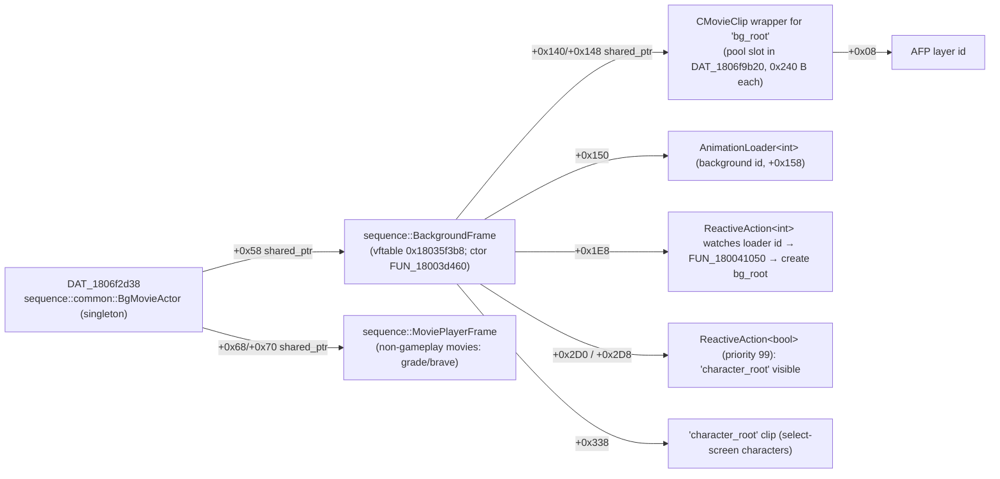

# World 20260825 — Gameplay Background Object Graph and Movie Actor

Source: Ghidra RE of `gamemdx_20260825.dll` (image base `0x180000000`), 2026-09-16. Decides D2 (how to hide
the 2D AFP background) and informs D1a (movie-size override). Existing docs referenced:
`docs/custom_shader_backgrounds_research.md` §5.1 (20260721 twin), `docs/player_customization_system_research.md`.

## 1. Object graph



Facts:

- **`DAT_1806f2d38` is the `BgMovieActor` itself** (dtor `FUN_180031c80` zeroes the global). Its
  `onInitialize` (`FUN_180032120`) creates the `BackgroundFrame` into `this+0x58`, calls
  `Component::setEnabled(frame, 0)` (`FUN_180046490`), sets `frame+0x138 = 1`, and clears the movie frame
  (`FUN_180031f60`). Messages `0x1005`/`0x1006` (`FUN_1800321f0`) enable/disable the frame.
- **`BackgroundFrame` is a long-lived singleton, not per-song.** Its one-shot loader registration
  (`FUN_18003d960`, guard byte `frame+0xC0`) registers the `"background"` custom-parts loader (display
  priority 99 captured at `+0x34` of the functor) and the two `"character"` loaders (`%s/%04d_usr`,
  `result_%dp`).
- **The live gameplay/menu background clip is `*(frame+0x140)`** (shared_ptr → CMovieClip wrapper). It is
  created by the lambda2 functor → `FUN_18003e5b0(desc, id)`:
  `compose "%s_%04d"` → BM2D package registry lookup (`DAT_1806f2d70`, `FUN_1801ad4a0`) → claim a free slot
  of the **0x400 × 0x240-byte CMovieClip pool `DAT_1806f9b20`** (vcall `+0x138` = slot-free probe) →
  **`FUN_180257af0(slot, pkg, "bg_root", 0)`** → wrap in shared_ptr (`FUN_1800424d0`) → store into
  `frame+0x140` via `FUN_18010f960` (store-with-release of the previous clip) → vcalls `+0xE0(value−1)` /
  `+0xE8(0)` on the new clip.
- **`FUN_180257af0` on 20260825 IS `CMovieClip::Create`** — byte-for-byte the standalone
  `cmovieclip_create` pattern in `src/core/signatures.rs::derive_cmovieclip_create`
  (`48 89 5C 24 10 56 48 83 EC 40 41 8B F1 48 8B D9 … 89 81 3C 02 00 00 8B 92 14 03 00 00`). The DLL's
  existing detour on it (`overlay_element_styling/capture.rs::create_hook`, idempotent `install_create`,
  `SHARED_CAPTURE` consumer flag) therefore already observes every `bg_root` creation
  (`this` = wrapper, `name = "bg_root"`, layer id at `this+0x08` after the call).
- The pool stride is **0x240 bytes** (`plVar8 + 0x48` in `longlong*` units); the docs' "0x48" is in 8-byte units.
- Context switch flags written by scene code on the frame (`*(DAT_1806f2d38+0x58)`):
  `+0x128` = 1 "gameplay background context" / 0 "menu context" (World `SceneManageActor::onUpdate`
  `FUN_18007d850` step 0 writes 1; the loading sequence `FUN_18002d330` writes 0/1 per scene kind);
  `+0x2D0` = select-screen characters visible (SceneManageActor writes 0); `+0x378` = result characters
  visible; `+0x134` = "no movie" (`FUN_180031f60` sets 1; the non-gameplay movie starter `FUN_180032010`
  sets 0). The readiness gate `FUN_1800320a0` checks `frame+0x150` (AnimationLoader ready),
  `+0x348`, `+0x3F0` (TextureLoaderGroups) and the movie frame's `+0xC0`.

## 2. Gameplay movie actor (D1a input)

- World's `SceneManageActor::onInitialize` (`FUN_18007d700`) looks up the music entry (`FUN_1801b3fa0(basename)`),
  reads the movie bytes (`entry+0x140/+0x141`; `(5,5)` = none) and, when a movie exists, creates a 0x150-byte
  **`sequence::dance::MovieActor`** (`FUN_18007c960`, vftable `0x180363398`) stored at `this+0xD8`.
- `MovieActor::onInitialize` (`FUN_18007cc20`): copies `entry+0x144` (movie offset) to `+0x140`, creates
  the DirectShow player `FUN_180216c70(player, path, 4)` (→ `this+0x138`; this is the `BuildGraph` path the
  `movie_policy` detour sees), registers it into render-list slot 9 (or 0 when matching, `+0x148`) via
  `FUN_18007cf90`. `onUpdate` `FUN_18007d160` waits for player state.
- **The `Customize+0x30` (movie size) read site was NOT located** in this session (the getter is Customize
  vtable slot 18 `+0x90` = `FUN_1801e0990` on 20260825, vtable `0x1803874d8`; virtual-call sites are not
  statically enumerable). The fullscreen/thumbnail choice is therefore assumed to be made by the gameplay
  layout/HUD builder at DPS init (after the scene-28 `createNextSequence`). Design consequence: write the
  override at the FIRST entry into {26, 27, 28} (all before the DPS exists) for EVERY entered side (so the
  "which side governs" question is moot), and confirm with the first diagnostic build (log the value the
  game reads back / the movie's on-screen size).
- Non-gameplay movies (`ddrw_bg_grade*`, `ddrw_bg_brave`) go through `MoviePlayerFrame` (`FUN_180032010`,
  `FUN_180032220`, ctor `FUN_18003f560`) with an explicit fullscreen byte (`+0xF8` → player mode 4/5) —
  never through Customize. Out of scope (results/course screens).

## 3. D2 mechanism decision (maintainer rule: hide the real background, no placeholder arc)

**Hide = per-frame multiplicative alpha 0 on the live `bg_root` clip's AFP layer**, restored to
`(1,1,1,1)` when the song window ends:

- Handle acquisition, primary (authoritative, reads the game's own current pointer every frame):
  `frame = *(*(bgmovie_actor_global) + 0x58)`; `clip = *(frame + 0x140)` (shared_ptr object pointer =
  first qword); validate `clip ∈ [pool_base, pool_base + 0x400·0x240)` and `(clip − pool_base) % 0x240 == 0`
  and `memory::is_readable(clip, 0x240)`; `layer_id = *(clip + 0x08)`; `layer_id != 0`.
  Derivations (all-or-nothing, identity-gated):
  - `bgmovie_actor_global` (`DAT_1806f2d38`): RIP-relative load in the World `SceneManageActor::onUpdate`
    (`FUN_18007d850`, which the feasibility doc already anchors) or the tiny readiness fn `FUN_1800320a0`;
    the `+0x58` displacement comes from the same instruction stream.
  - `bg_root` create function `FUN_18003e5b0`: found via the `"bg_root"` string xref (unique: the only other
    xref is `result_bg_root`), gives the **pool base** (`LEA … [DAT_1806f9b20]`), the **clip slot
    displacement** (`ADD …, 0x140` feeding `FUN_18010f960`), and an identity gate (its CALL target must be
    the already-derived `cmovieclip_create`).
- Handle acquisition, fallback (zero new derivations): join `overlay_element_styling::capture` as a shared
  consumer and record `(wrapper, layer_id)` for `name == "bg_root"`; validate `*(wrapper+0x08) == layer_id`
  before every write (slot reuse by a non-Create path — e.g. `afp_layer_create_with_property` clips — would
  otherwise be written).
- Write primitive: `bm2d_api::layer_set_color_raw(layer_id, 1.0, 1.0, 1.0, 0.0)` each frame while armed
  (idempotent, cheap; defeats any game-side colour re-set); restore `(1,1,1,1)` once on disarm. No detour,
  no destroy/release — the documented crash class (destroying packages under live layers) is not touched.
- Movie songs: with the thumbnail override the AFP background is still drawn behind the thumbnail; the same
  hide applies.

## 3a. Validations performed before design (2026-09-16, same session)

**V1 — the `+0x140` clip IS the gameplay background (D2 premise).** The AnimationLoader<int>'s id-source
functor (`lambda1`, `_Do_call` = `FUN_1800438f0` → `FUN_18003e390`) computes the background id every poll:
```
if (frame+0x134 == 0 /* movie playing */ || frame+0x378 == 1) id = 0            // no AFP background
else if (frame+0x128 == 0 || frame+0xB8 == 0)                   id = frame+0x138  // default/menu path
else {  // gameplay context
    pw = PlayerWork[ *(GameWork(DAT_1806f14f8) + 8) ]                              // the GOVERNING side
    cust = pw + 0x1790                                                              // Customize object
    id = (frame+0x2D0 == 0 && frame+0x378 == 0) ? cust->vfunc(+0x30)()             // background_gameplay getter (+0x14)
                                                : cust->vfunc(+0x20)();            // background getter (+0x10)
}
on change: frame+0x130 = id; AnimationLoader::request (FUN_180040040); when ready (FUN_1800401e0):
           clear frame+0x140 (shared_ptr reset) → the ReactiveAction<int> on the loader id fires the create → new bg_root clip into +0x140
```
World's `SceneManageActor::onUpdate` step 0 sets exactly `+0x2D0 = 0, +0x378 = 0, +0x128 = 1` and `+0x134 = 1`
(via `FUN_180031f60`), so in GAMEPLAY the clip at `frame+0x140` is `background_<Customize+0x14>` of the governing
side. CONFIRMED. (Also: the governing side for background/movie decisions is `*(GameWork+8)`.)

**V2 — where `Customize+0x30` is read (D1a).** World's `DancePlaySequence::onUpdate` is `FUN_180057e10`; its
**step 2** does:
```
movie_size = Customize(PlayerWork[GameWork+8] + 0x1790)->vfunc(+0x90)()      // movie_size getter, 1 if 0
marker = "movie_single_usr"; if (!both entered) marker = "movie_%s_%dp_usr" (single|double, side)
if (movie_size == 1) marker = "movie_fullscreen_usr"
rect = position/size of that marker inside the dance package's "dance_root" clip
SceneManageActor = FUN_18007d480(this, basename, ?, courseFlag, movie_size, &rect)   // → MovieActor sized by rect
```
So the read happens at DPS step 2 — INSIDE gameplay, after the scene-28 callback — and **only the value `1`
selects fullscreen**; `2` (and `3`) use the sized marker rect. Writing `2` at the first entry into {26,27,28}
is early enough, and the thumbnail rect is a small on-screen region (the 3D stays visible around it). The
governing side is `*(GameWork+8)`; writing every entered side whose value is 0/1 covers it. CONFIRMED.

Bonus from the same function: **World's DPS step 5 sets `*(*DAT_1806f2d08 + 8) |= 1`** — the SceneGraph
enable bit, exactly A3's step-5 `0x1046` edge — and step 3 gates on `FUN_1800320a0()` (background ready) +
the `0x1001` readiness poll, step 6 broadcasts the `0x1044` anchor. So the World DPS still drives the scene
graph's enable state; D17's "show at DPS step ≥ 5" is the right edge.

**V3 — deferred destroy calls OUR dtor and nothing engine-side frees a render item (D16).**
`SceneGraphManager` flush `FUN_180024250`: under the manager lock (`Ordinal_16/17` when `mgr+0x28 > 0`), for
every queued node: unlink all children recursively via `FUN_1802159e0(child, 1)` (which ONLY clears
parent/sibling links — it calls no dtor), unlink the node from its parent's list, then `(*node->vtable[0])(node, 1)`
— the node's own dtor with `free = 1`. The item push `FUN_180267190(list, item)` stores the pointer and adds
`*(*(item+0x60) + 0x24)` (draw-record count) to a counter; nothing frees. CONFIRMED. Design consequence:
keep our nodes FLAT (all direct children of the root, one deferred-destroy entry each) so no child is orphaned
by the engine's link-clearing; our dtor frees the node, its item, and its bone textures.

## 4. Open items carried to implementation

1. Confirm at first deploy that the `bg_root` clip in `frame+0x140` during GAMEPLAY is the
   `background_gameplay` (`Customize+0x14`) package (log the clip pointer + layer id per song).
2. Confirm the `Customize+0x30` read happens after the scene-28 callback (thumbnail visible in the first
   diagnostic build); if not, move the write earlier (scene 25 exit) — the write is per-side and restored.
3. `FUN_18007d850`/`FUN_1800320a0`/`FUN_18003e5b0` shapes on 20250805 / 20260224 / 20260721
   (`validate_signatures.sh` + `shape_diff.py`).
