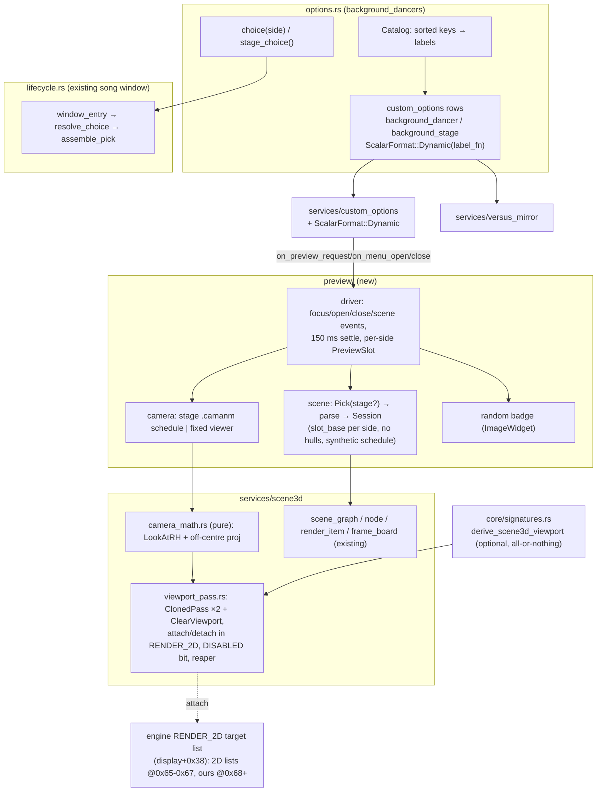

# Detailed Design — Background Dancer / Background Stage selection options with live 3D previews

Status: Approved 2026-09-21

## 1. Overview

The Background Dancers mod (`background-dancers`) revives DDR A3's 3D background — a random stage
and one random dancer per entered player — inside DDR World's gameplay window using the engine's
own model passes. Today the choice is random every song; the only override is a developer env var.

This design adds two player-facing rows to the game's native OPTIONS menu, under the
PLAYFIELD STYLING OPTIONS decorative header:

- **BACKGROUND DANCER** — per player; value `RANDOM` or one of the 26 stock dancers
  (`EMI #2`, `RAGE #1`, `YUNI #3`, …, names derived from the `chara_resources.rlist` keys).
- **BACKGROUND STAGE** — cabinet-wide (mirrored between players in a 2P session); value
  `RANDOM` or one of the 25 distinct stock stages (`BOOM #3`, `CRYSTALDIUM`, `REPLICANT #6`, …).

Both rows exist only while the mod is enabled, are excluded from the 0-0-0 overlay menu (their
previews are the point), persist locally per side (never on the wire), and take effect at the next
song.

While a row is focused and a specific value is selected, the preview panel of the options modal
shows a **live, animated 3D render** of that dancer (dancing a random routine from its sex's pool)
or that stage (its `_play_loop` animations under the stage's own `.camanm` camera choreography),
inside a 16:9 target box authored into the row's template chrome. `RANDOM` shows a static badge.

The render uses a new compositing primitive: **mod-owned clones of the engine's MODEL passes,
attached into the RENDER_2D target list with their own D3D viewport rect and their own camera
matrices**, so the 3D lands above the options modal, clipped to the box, without touching the
stock passes or camera slot 0. Two players can preview different things at once. Every part of the
feature is fail-open: a missing derivation leaves the rows working with a static preview panel.

## 2. Detailed Requirements

### 2.1 Functional

| ID | Requirement |
|---|---|
| FR-1 | Two scalar rows `background_dancer` and `background_stage` registered through `custom_options`, displayed under `header_playfield_styling_options` in the in-game options menu (order: DANCER, STAGE), only while `background-dancers` is enabled. |
| FR-2 | Value 0 renders as `RANDOM`; value `k ≥ 1` renders the k-th catalog entry's label. Labels derive from the rlist key (= arc stem): `UPPER(alphabetic prefix)`, plus ` #(digits+1)` only when that prefix has more than one variant. Catalog sorted by key. Every label ≤ 15 bytes. |
| FR-3 | The dancer catalog = every `chara_resources.rlist` row whose body arc exists (unlock ids ignored, as the mod already does). The stage catalog = every DISTINCT `map_resources.rlist` key with an existing arc, `dummy00` excluded. |
| FR-4 | Persistence `PersistMode::Local`: cached in `mod-config.json` (`custom_options.p1/p2`), never emitted on the wire, never loaded from a network response. Out-of-range cached values clamp to `RANDOM` on load. |
| FR-5 | `background_stage` is mirrored between players via `versus_mirror` (P1 seeds P2 at song select while both are entered; last writer wins). `background_dancer` is per side. |
| FR-6 | At song-window entry: stage value ≠ 0 ⇒ that key, uniform over the key's rlist rows; dancer value for entered side *i* ≠ 0 ⇒ that dancer for dancer index *i*; 0 ⇒ the existing random path. The song seed remains random (playlists, camera shuffles). Developer-mode `DDR_DANCERS_PIN` keeps precedence. |
| FR-7 | Both rows carry `MenuPlacement { in_game: true, overlay: false }` and the shipped `option_menu_settings` lists them after `arrow_opacity` with `overlay: false`. |
| FR-8 | While either row is focused in an open options modal at song select with a non-RANDOM value, a live 3D preview renders inside the row's template marker box for that side. Stage preview: the stage's parts (incl. skydome), `_play_loop` animations, its own camera choreography (fixed fallback camera when the row has no camera set). Dancer preview: body + parts, no stage, no shadow, a fixed frontal ¾ camera, dance clips from its sex pool. |
| FR-9 | Value `RANDOM` shows a static badge image in the box and no 3D. |
| FR-10 | Value edits re-target the preview after a 150 ms settle; focus leaving the row, the modal closing, or the scene leaving song select tears the preview down. Both sides may preview simultaneously and independently. |
| FR-11 | The preview is hidden while the 0-0-0 overlay menu is open. |
| FR-12 | Previews apply the same lighting style as gameplay (`stock` / `lit` / `cel`); outline hulls are not built for previews. |
| FR-13 | Previews never alter gameplay state: no movie-size write, no `bg_root` alpha, no tempo map, no camera slot 0 write, no change to the stock pass objects. |

### 2.2 Non-functional

- **Fail-open at every seam.** Missing compositor derivation ⇒ rows work, box shows chrome only, one WARN. Missing catalog ⇒ rows not registered, one WARN. Per-preview failure (arc missing, parse error, residency timeout) ⇒ that preview shows nothing, one WARN per class.
- **No hardcoded engine offsets** in hook code: every address/offset comes from AOB signatures + derivations validated on all four supported `gamemdx` builds.
- **Thread discipline.** Engine calls only on the game thread; the clear-viewport render callback runs on the engine's render worker and performs no engine API, allocation, locking or logging; parse work on a std thread.
- **Hot-path cost.** The per-frame preview driver is O(1) when no preview is live; a live preview costs one `director::produce` + one matrix write per side per frame.
- **Value text budget.** Scalar value strings must stay ≤ 15 bytes (MSVC SSO in the game's string; longer strings heap-promote and leak).

### 2.3 Assumptions

1. The RENDER_2D target list has a depth buffer bound (it is documented to clear depth only).
2. gd tag 0 on the device thread is a plain `IDirect3DDevice9::Clear(0, NULL, flags, color, z, stencil)`, which clears the current viewport (D3D9 semantics).
3. Stage-only camera choreography can be driven by a synthetic fixed-segment dance schedule (the camera event loop only needs cut times).
4. The template marker box is 16:9, so `.camanm` cameras (16:9-baked frustums) map without distortion.
5. A live enable of the mod registers the rows but their textures appear at the next launch (framework-wide: the label atlas is flushed once at boot).

## 3. Architecture Overview



Layering: `core/` gains nothing engine-specific beyond signatures; `services/scene3d` gains the
compositor primitive (game-agnostic "render the scene graph into a sub-rectangle above the 2D");
`services/custom_options` gains one `ScalarFormat` variant; the mod gains `options.rs` and
`preview/`.

### 3.1 The compositing primitive

The engine renders each frame as an ordered list of *target lists* (OFFSCREEN1, RENDER-3D,
AFTER-RENDER-3D, RENDER_2D, DISPLAY, PRESENT). A target list is a `std::vector<{viewport*, u32
priority}>` rendered in priority order; before each viewport's render callback the worker applies
that viewport's own D3D viewport rect and depth range, and (unless the viewport's flag bit1 is set)
uploads that viewport's own VIEW and PROJ matrices to the shader constants. The three MODEL passes
(OPACITY / LOWPRIO_TRANS / TRANS) are such viewports, attached to RENDER-3D — which is why the 3D
is the frame floor. Their render callback iterates the scene graph's shared render-item list,
filters items by `item.pass_mask & pass.filter`, culls per record against the pass's own matrices,
and emits the draw stream. Attach is a plain `push_back` + sort; detach erases.

The primitive therefore is:

1. Allocate a byte-copy of the stock OPACITY pass object (0xF8 bytes) and one of the TRANS pass;
   set each clone's self back-pointer, viewport rect (= the preview box in render-target pixels),
   and node-mask filter (= a private bit unused by every stock filter: `0x08` for P1, `0x20` for P2).
2. Allocate a small mod-owned "clear" viewport (own 2-slot vtable) whose render callback emits one
   gd Clear record; with flag bit1 set the worker still applies its rect but skips the camera
   upload.
3. Attach clear/opaque/trans to the RENDER_2D list at priorities `0x68/0x69/0x6A` (P1) and
   `0x6B/0x6C/0x6D` (P2) — after the three 2D layer lists at `0x65..0x67`.
4. Each frame, write VIEW/PROJ into the two clones. Toggle visibility with the pass DISABLED bit
   (`flags` bit0) instead of detaching.
5. Preview scene nodes stamp their items with the side's private bit, so the stock passes never
   draw them and each clone draws only its side's scene.

```mermaid
sequenceDiagram
  participant G as game thread (on_frame)
  participant D as frame-end dispatch
  participant W as render worker
  G->>G: director::produce(t) → frame_board; camera_frame(t) → view/proj → clone+0x58/+0x98
  G->>D: end of frame (workers drained from the previous frame)
  D->>W: RENDER_2D: 2D list viewports 0x65..0x67
  D->>W: ClearViewport @0x68 {rect, flags bit1}
  W->>W: SetViewport(rect) → our callback emits gd Clear(depth[+colour])
  D->>W: OPACITY clone @0x69 {rect, filter 0x08}
  W->>W: SetViewport(rect); upload clone view/proj; render items with pass_mask & 0x08
  D->>W: TRANS clone @0x6A
  D->>W: DISPLAY list (SYSTEM text) — untouched
```

## 4. Components and Interfaces

### 4.1 `custom_options::api::ScalarFormat::Dynamic` (framework, additive)

```rust
/// A value-text provider supplied by the owning mod. Returns `None` to fall back to the
/// plain integer text. Must return ≤ 15 bytes of ASCII/SJIS; must not block or panic.
pub type DynamicLabelFn = fn(option_id: &str, value: i32) -> Option<String>;

pub enum ScalarFormat {
    …existing variants…,
    /// Per-value text from the owner (RANDOM / EMI #2 / BOOM #3 …).
    Dynamic(DynamicLabelFn),
}
```

`format_scalar_value` (and the UTF-8 twin used by the overlay snapshot) gain one arm:
`Dynamic(f) => f(id, value).unwrap_or_else(|| value.to_string()).into_bytes()`. Both formatters
need the option id, so the signature becomes `format_scalar_value(id: &str, value, format)` (two
call sites: the in-game scalar renderer and the overlay snapshot). `ScalarFormat` stays `Copy` and
`Debug` (fn pointers are both). The host test that pins every shipped scalar string ≤ 15 bytes is
extended with the catalog labels.

### 4.2 `background_dancers::options` (new file `src/mods/background_dancers/options.rs`)

```rust
pub const OPT_DANCER: &str = "background_dancer";
pub const OPT_STAGE:  &str = "background_stage";
pub const RANDOM: i32 = 0;

pub struct CatalogEntry { pub key: String, pub label: String }
pub struct Catalog { pub dancers: Vec<CatalogEntry>, pub stages: Vec<CatalogEntry> }

/// Pure. Sorted by key; labels per FR-2. Stages = distinct keys.
pub fn build_catalog(stages: &[StageCandidate], dancers: &[DancerCandidate]) -> Catalog;
/// Pure. "emi01" → ("EMI", 2); "crystaldium00" → ("CRYSTALDIUM", 1).
pub fn split_key(key: &str) -> (String, u32);
/// Pure. Labels for one family: variants > 1 ⇒ "EMI #1".."EMI #3", else "CLUB".
pub fn label_for(prefix: &str, variant: u32, variants_in_family: usize) -> String;

/// Registers both rows (enable), or re-arms them (`Duplicate` ⇒ set_option_available(true)).
pub fn register(catalog: Catalog) -> bool;
pub fn set_available(available: bool);          // disable() path
/// Live reads for window_entry (the value → key resolution).
pub fn stage_choice() -> Option<String>;        // None = RANDOM / rows unavailable
pub fn dancer_choice(side: u8) -> Option<String>;
/// The DynamicLabelFn.
fn label(option_id: &str, value: i32) -> Option<String>;
```

Registration (inside `BackgroundDancersMod::enable()`, after `lifecycle::init_tables()`):

```rust
RegisterSpec::scalar(OPT_DANCER, 0, dancers.len() as i32, 1, ScalarFormat::Dynamic(label))
    .step_coarse(5).default_value(RANDOM)
    .persist_mode(PersistMode::Local)
    .persist_transform(identity, clamp_to_catalog)   // load: out of range ⇒ RANDOM
    .in_game_only()
    .display_name("Background Dancer")
    .on_change(on_dancer_change);
RegisterSpec::scalar(OPT_STAGE, …).on_change(on_stage_change);   // tail: versus_mirror::mirror_edit
versus_mirror::register(&[OPT_STAGE]);
```

`on_change` handlers store the value into per-side atomics (`DANCER_VALUE[2]`, `STAGE_VALUE[2]`)
and, for the stage, call `versus_mirror::mirror_edit(OPT_STAGE, side, value)`. The catalog is
stored once behind a `OnceLock`; `label` and the `*_choice` readers index it (bounds-checked).

`disable()`: `versus_mirror::unregister(&[OPT_STAGE])`, `set_option_available(id, false)` for both.

### 4.3 Gameplay application (`lifecycle.rs` + pure `selection.rs` extension)

```rust
/// Pure, host-tested. Resolves the rows' choices into candidates.
pub fn resolve_choice(
    rng: &mut Rng,
    stages: &[StageCandidate], dancers: &[DancerCandidate],
    stage_key: Option<&str>, dancer_keys: &[Option<&str>],   // one per entered side
) -> Option<(StageCandidate, Vec<DancerCandidate>)>
```

Rules: `stage_key = Some(k)` ⇒ uniform over the rows with key `k` (the existing `pick_stage`
second stage), `None` ⇒ `pick_stage`; each `dancer_keys[i] = Some(k)` ⇒ that candidate, `None` ⇒
one uniform pick; an unknown key (catalog drift) ⇒ treated as `None` with one WARN from the caller.
`window_entry` calls `resolve_choice` with `options::stage_choice()` and, for entered side *i*,
`options::dancer_choice(i)` — after the existing `DDR_DANCERS_PIN` branch (pin wins) and before
`make_pick` (which stays the fallback). Then `assemble_pick(rng, stage, camera_rows, dancers,
pinned = any_choice, arc_exists)` exactly as today. The `pick.summary()` INFO line names the source
(`random` / `option` / `pin`) per element.

`lifecycle` also exposes `pub(super) fn tables_snapshot() -> Option<(Vec<StageCandidate>,
Vec<(String, Vec<String>)>, Vec<DancerCandidate>)>` for the catalog and the preview scene builder.

### 4.4 `scene3d::camera_math` (new, pure)

```rust
pub type Mat4 = [f32; 16];   // row-major, row vectors (v' = v · M), the engine's convention
pub fn view_look_at_rh(eye: [f32;3], target: [f32;3], up: [f32;3]) -> Mat4;
pub fn proj_off_centre(w: f32, l: f32, r: f32, b: f32, t: f32, near: f32, far: f32) -> Mat4;
pub fn view_proj(cam: &CamSample) -> (Mat4, Mat4);
```

Formulas (the engine's own, see Appendix A): view rows `(s.x,u.x,f.x,0) (s.y,u.y,f.y,0)
(s.z,u.z,f.z,0) (−eye·s, −eye·u, −eye·f, 1)` with `f = normalize(eye−target)`, `s =
normalize(up×f)`, `u = normalize(f×s)`; proj `[0][0] = 2w/(r−l)`, `[1][1] = 2w/(t−b)`, `[2][0] =
(r+l)/(r−l)`, `[2][1] = (t+b)/(t−b)`, `[2][2] = −far/(far−near)`, `[2][3] = −1`, `[3][2] =
−far·near/(far−near)`, others 0. Degenerate directions (zero-length `f` or `s`) return identity
view (caller logs once).

### 4.5 `scene3d::viewport_pass` (new, engine-facing)

```rust
pub fn is_available() -> bool;             // derivation present + free bits verified

#[derive(Clone, Copy)] pub struct RtRect { pub x: i32, pub y: i32, pub w: i32, pub h: i32 }
#[derive(Clone, Copy)] pub struct ClearSpec { pub depth: bool, pub color: Option<u32 /*ARGB*/> }

pub struct PassSet { /* clear: *mut ClearViewport, opaque: *mut u8, trans: *mut u8, attached: bool, filter_bit: u32 */ }

/// Game thread. Allocates + attaches the three viewports at `base_prio, +1, +2`.
pub fn create(filter_bit: u32, rect: RtRect, clear: ClearSpec, base_prio: u32) -> Option<PassSet>;
impl PassSet {
    pub fn set_rect(&mut self, rect: RtRect);                       // all three
    pub fn set_camera(&mut self, view: &Mat4, proj: &Mat4);         // both clones
    pub fn set_enabled(&mut self, on: bool);                        // flags bit0 on all three
    pub fn detach(self);                                            // erase from the list; queue for the reaper
}
/// Game thread, once per frame: frees detached sets ≥ 2 frames old.
pub fn reap();
/// The RENDER_2D target's pixel size (u16 dims of the list's target surface) — the box rect is
/// scaled from the 1280×720 canvas by these.
pub fn render_target_dims() -> Option<(u32, u32)>;
```

Internals:

- **Sites** (`Scene3dViewportSites`, an `Option` sub-group of `Scene3dSites` like
  `texture_lookup`): `display_global`, `render2d_list_off` (0x38), `attach_fn`, `detach_fn`,
  `pass_opacity_global`, `pass_trans_global`, `pass_size` (0xF8), `viewport_sub_off` (0x30),
  `pass_rect_off` (0x38), `pass_flags_off` (0x54), `pass_proj_off` (0x58), `pass_view_off`
  (0x98), `pass_self_off` (0xE0), `pass_items_off` (0xE8), `pass_filter_off` (0x2C),
  `worker_gd_write_off` (0x218), `list_target_off` (0x38), `target_dims_off` (0x14). Derivation
  §4.9.
- **Clone**: `alloc_zeroed(pass_size)`; `copy_nonoverlapping(stock, clone, pass_size)` after
  `memory::is_readable(stock, pass_size)`; patch self/rect/filter; the clone's `items` and
  callback-block pointers are shared read-only with the stock pass. Identity gate before cloning:
  `*(stock + viewport_sub_off) == the vftable read from the OPACITY pass at derivation`, and
  `*(stock + pass_filter_off) ∈ {0x56, 0x46}`.
- **Free bits**: at `is_available()` the four stock filters are read live; `0x08` and `0x20` must be
  clear in all of them, else unavailable (WARN).
- **ClearViewport** (`#[repr(C)]`, 0x40 bytes): `vtable*`, rect `{x,y,w,h}`, `min_z 0.0`, `max_z
  1.0`, `name_hash 0`, `flags = 2` (skip camera upload; bit0 = disabled toggles with the set),
  then the payload `clear_flags: u32`, `color_argb: u32`, `z: f32`, `stencil: u32`. Its vtable
  (RWX region, built once like `node.rs`): slot 0 `extern "C" fn render(vp: *mut ClearViewport,
  worker_ctx: *mut u8)`, slot 1 no-op dtor. `render` runs on the render worker: `let p =
  *(worker_ctx + worker_gd_write_off) as *mut u8; write {0x0014_0000u32, clear_flags, color_argb,
  z, stencil}; *(worker_ctx + off) = p + 0x14`. No other work (rules of `node_visit`).
- **Attach** (game thread, from `input_manager::on_frame` — the frame-end dispatch has drained the
  workers, so no viewport object is being read): `attach_fn(*display + render2d_list_off, vp_base,
  prio)`. Rect is written before attach (non-zero ⇒ the attach leaves it).
- **Detach + reaper**: `detach_fn(list, vp_base)` for the three, then push `(ptrs, frame_no)` onto a
  reaper vector; `reap()` frees entries older than two frames (the worker may still hold a pointer
  from the frame of detachment).
- **Rect mapping**: `render_target_dims()` reads `*(*(list + list_target_off) + target_dims_off)` as
  two u16 (probed). `RtRect = round(canvas_rect × dims / (1280, 720))`.

### 4.6 `background_dancers::preview` (new directory)

`preview/mod.rs` — the driver:

```rust
pub fn init();                       // subscribes: custom_options::on_preview_request / on_menu_open / on_menu_close
pub fn on_scene_change(prev, next);  // scene-exit backstop
pub fn on_frame();                   // per-frame driver (O(1) idle)
pub fn shutdown();                   // mod disable
```

Per side `PreviewSlot { side, focused: Option<Kind>, wanted: Option<(Kind, key)>, settle_at:
Option<Instant>, live: Option<PreviewWindow>, passes: Option<PassSet>, badge: BadgeState }`.

Events:
- `on_preview_request(side, id)`: `id ∉ {ours}` ⇒ `focused = None`, request teardown, hide badge.
  Else `focused = Some(kind)`; read the value; `0` ⇒ teardown + badge on; `k` ⇒ `wanted =
  (kind, catalog key)`, `settle_at = now + 150 ms` (re-armed on every change — the getter fires
  every focus tick so value changes are observed without an `on_change` hook).
- `on_menu_close(side)` / scene leaves 25: `focused = None`, teardown, badge off, passes disabled.
- `on_frame()`: per side — settle elapsed and `wanted ≠ live.identity` ⇒ teardown the live one (if
  any) then start `PreviewWindow` for `wanted`; drive the window's phases; when Built, publish
  poses at `t = now − built_at` (`TempoOptions::REAL_TIME` semantics: `t` is wall seconds) and the
  camera; `passes.set_enabled(visible && !mod_menu::is_open())`; `viewport_pass::reap()`.

`preview/window.rs` — a `PreviewWindow` is the gameplay `Window` minus clock/tempo/hide/movie
size. To avoid duplicating cabinet-proven code, the gameplay `Window` and its phase drivers
(`request_load`, `Session::build_pending` loop, `begin_teardown`, `drive_teardown`,
`finish_window`) are extracted into `background_dancers/scene_window.rs` as `SceneWindow` with the
gameplay-only fields left in `lifecycle.rs`'s wrapper. The extraction changes no logic (cabinet
regression: one gameplay song identical in the log).

`preview/scene.rs` — pick construction:
- STAGE `key`: `Pick { stage: Some(uniform row of key), dancers: [], playlists: [], parts: [],
  camera_* from the stage row }`; `Session::new(.., slot_base, hulls = empty)` with
  `schedule = synthetic_schedule()` (one pseudo-clip of `STAGE_CUT_PERIOD_S = 9.0` so the camera
  event loop cuts every ~7.5 s) and `camera = camera_schedule(parsed, seed)`.
- DANCER `key`: `Pick { stage: None, dancers: [candidate], playlists: [playlist(rng, sex)], parts:
  parts_present, camera_* empty }`; no shadow (parse skips `pl_shadow00`); `schedule =
  dance_schedule(parsed, REAL_TIME)`; `camera = None`.
- Both: `style = style::effective().style`, `hulls = HullPlan::empty()`, items' pass mask =
  the side's private bit (a `Session::new` parameter `item_pass_mask_override: Option<u32>` — in
  gameplay `None` keeps the 2/4/0x10 masks).

`preview/camera.rs`:
- STAGE: `director::camera_frame(sess, t)` → `CamSample` (16:9 frustum) → `camera_math::view_proj`;
  no camera set ⇒ the fixed fallback `(0,1.6,5)→(0,0.9,0)`, hFOV 76.8°, aspect = box aspect.
- DANCER: fixed `CamSample::perspective(eye (0, 1.05, 3.4), target (0, 0.95, 0), up +y,
  half_tangent_x = 0.32·aspect, aspect = box w/h, near 0.1, far 100)` (tunable constants; frames a
  1.8 m figure with headroom). Dancer placed at the origin facing +z (`dancer_x(0, 1) = 0`).

`preview/layout.rs` (pure): `box_rect(side, marker) -> canvas rect` (`CHROME_ORIGIN[side] +
marker`, the constant the WebUI overlays use: P1 `(185, 463)`, P2 `(742, 463)`), `to_rt(rect,
dims) -> RtRect`, `aspect(rect)`.

`preview/badge.rs`: one `ImageWidget` per side (`widget_renderer::create_image_widget`, texture via
`asset_loader` from `data_mods/background_dancers/preview_random.png`), positioned/sized to the box
canvas rect, shown iff focused ∧ value == 0 ∧ modal open ∧ `!mod_menu::is_open()`. Fail-open (no
badge).

Priorities: P1 `0x68/0x69/0x6A`, P2 `0x6B/0x6C/0x6D`. Slot bases: P1 `0`, P2 `16` (each preview ≤
16 instances; a stage with more parts drops the excess with one WARN).

### 4.7 Template chrome and strings (`scripts/option_strings.py`, generated PNGs)

> **Amendment 2026-09-21 (maintainer, at Step 1 authoring):** the templates keep the shipped
> SPLIT layout — description text in the left column, the preview box filling the RIGHT column of
> the 368×172 panel (there is no in-game precedent for a text-less preview). The box is therefore
> NOT 16:9 (≈ 170×150); the stage preview renders a **cropped** view of the stage rather than the
> stock 16:9 frame (the `.camanm` frustum keeps its vertical extent, the horizontal half-tangent
> is `half_tangent_y × box_aspect` — a centre crop), and the dancer preview simply frames the
> figure at the box aspect. §2.3 assumption 4, FR-8's "16:9" and the `preview/camera.rs` aspect
> handling in §4.6 are to be read with this amendment.

- `LABELS["background_dancer"] = {en: "BACKGROUND DANCER", ja/ko: …}`, `LABELS["background_stage"]`.
- `TEMPLATES`: one `TemplateSpec` per row (SPLIT layout) with a single green marker filling the
  right column — `(191, 11, 170, 150)` — and the description lines in the left column (e.g.
  "Shown behind your lane." / "RANDOM picks a different one each song.").
- `PREVIEWS`: fallback panels `seop_image_<id>.png` (generated by `generate_chrome` from the
  template at runtime — `preview_gen::generate_chrome` is widened to `pub(crate)`).
- `data_mods/background_dancers/preview_random.png`: the RANDOM badge (dice / "?" art, sized to
  the marker box — 170×150 under the 2026-09-21 amendment).
- `mod-config.json` `option_menu_settings`: `{ "id": "background_dancer", "overlay": false,
  "in_game": true }`, `{ "id": "background_stage", … }` inserted after `arrow_opacity`.

### 4.8 `Session` / `Pick` changes (`session.rs`)

- `Pick.stage: Option<StageCandidate>`; `Pick::arcs()`, `summary()`, `parse_pick` handle `None`
  (no stage arc, `stage_parts = []`, `cameras = None`). `make_pick`/`assemble_pick` wrap the stage
  in `Some`.
- `Pick.dancers` may be empty; `parse_pick` skips the motion arcs and the shadow when it is;
  `parse_pick` takes `ParseOptions { shadow: bool }` (gameplay `true`, previews `false`).
- `Session::new(pick, parsed, requested_at, tempo_opts, style, hulls, slot_base: u32,
  item_pass_mask: Option<u32>)`; slot indices become `slot_base + i`; `schedule` falls back to a
  caller-supplied synthetic schedule when there are no dancers (`Session::with_schedule`).
- Stage-only build: no dancers ⇒ `children`/`shadow_size` empty; `director::produce` already
  iterates instances by kind.

### 4.9 Signatures (`core/signatures.rs::derive_scene3d_viewport`, OPTIONAL, all-or-nothing)

| Site | Anchor | Yields |
|---|---|---|
| `render_graph_boot_attach` | the run of `MOV RCX,[display+0x38]; LEA RDX,[pass_global+0x30]; MOV R8D,0x66/0x67/0x68; CALL attach` in the render-graph boot (`FUN_1801f2c30`) | display global, RENDER_2D list offset, attach fn, OPACITY/LOWPRIO/TRANS pass globals, viewport sub-object offset; the three priorities are attested |
| `viewport_detach` | the shutdown's paired `CALL detach` immediately preceding the pass dtor call (`FUN_1801f30b0`) — or a prologue AOB cross-checked against that callee | detach fn |
| `model_pass_ctor` | `MOV [RAX+0xe0],RAX; MOV [RAX+0xe8],R14; LEA RCX,[vftable]; MOV [RAX+0x30],RCX; MOV [RAX+0xf0],RBX; MOV [RAX+0x50],EDI; MOV [RAX+0x2c],EBP` + `MOV ECX,0xf8; CALL alloc` (`FUN_1801f6510`) | pass size, self/items/callbacks/name/filter offsets, the Viewport vftable (identity gate), sort-mode offset |
| `scene_manager_camera_copy` | the eight `memcpy(pass+0x98 / +0x58, cam+0x08 / +0x1C8, 0x40)` (`FUN_180023fb0`) | pass view/proj offsets (cross-checked against `camera_view_off`) |
| `viewport_setup_rect` | `FUN_18026cec0`'s prologue: `MOV [ctx+..], list; CALL set_viewport(ctx, x,y,w,h,minZ,maxZ)` then `TEST byte [rect+0x1c],2` | rect offset within the viewport sub-object (+8), flags offset (+0x1C from rect ⇒ +0x54 outer), attests the bit1 semantics |
| `worker_gd_write` | the `MOV RAX,[RDI+0x218]; MOV dword [RAX],0x4003a` terminator in the render worker (`FUN_180272d30`) | worker gd write-pointer offset; the `0x4003a` immediate is attested |
| `target_list_clear` | `FUN_180272600`'s `MOV dword [RAX],0x140000` + the four payload copies from `list+0x20/+0x24/+0x28/+0x2C` | Clear record shape (size 0x14, field order) and the list's target pointer offset (`list+0x38`, dims at `+0x14/+0x16`) |

All seven must resolve and cross-check or the whole sub-group is `None` (one WARN: "3D previews
unavailable"). Non-address values are published via `SignatureStore::publish_value` so they show in
the boot log. Every new AOB is swept on the four supported builds with `validate_signatures.sh` +
`shape_diff.py` (the consumers read `match+N` immediates).

## 5. Data Models

### 5.1 Option values

| Row | Value | Meaning | Persist | Wire |
|---|---|---|---|---|
| `background_dancer` | `0` | RANDOM | `custom_options.p{1,2}.background_dancer` | none |
| | `1..=N_d` | `catalog.dancers[v−1]` (sorted by key) | | |
| `background_stage` | `0` | RANDOM | `custom_options.p{1,2}.background_stage` | none |
| | `1..=N_s` | `catalog.stages[v−1]` (distinct keys, sorted) | | |

Load transform: `v ∉ 0..=N ⇒ 0`. Catalog for the stock install: 26 dancers, 25 stages.

Label derivation examples: `emi00 → EMI #1`, `emi01 → EMI #2`, `emi02 → EMI #3`, `rage01 → RAGE
#2`, `babylon00 → BABYLON`, `boom06 → BOOM #7`, `replicant05 → REPLICANT #6`, `crystaldium00 →
CRYSTALDIUM`. Longest: `CRYSTALDIUM` (11), `REPLICANT #6` (12), `LOVESWEETS` (10) — all ≤ 15.

### 5.2 Engine objects touched (all offsets derived, listed for the record)

MODEL pass object (0xF8): `+0x08..+0x20` callbacks, `+0x28` sort mode, `+0x2C` filter, `+0x30`
Viewport vftable, `+0x38..+0x44` rect `{x,y,w,h}`, `+0x48/+0x4C` minZ/maxZ, `+0x50` name hash,
`+0x54` flags (bit0 disabled, bit1 skip camera upload), `+0x58` proj, `+0x98` view, `+0xE0` self,
`+0xE8` item list, `+0xF0` callback block. Target list: vector at `+0x00/+0x08/+0x10`, clear flags
`+0x20`, rgba `+0x24`, z `+0x28`, stencil `+0x2C`, target `+0x38` (u16 dims `+0x14/+0x16`), flags
`+0x40`. Worker ctx: gd write pointer `+0x218`. gd Clear record: `u16 tag 0, u16 size 0x14, u32
flags (1 target | 2 zbuffer | 4 stencil), u32 D3DCOLOR, f32 z, u32 stencil`.

### 5.3 Preview state (per side)

```
PreviewSlot
  focused: Option<Kind{Dancer,Stage}>
  wanted:  Option<(Kind, String key)>      settle_at: Option<Instant>
  live:    Option<PreviewWindow { identity:(Kind,key), scene_window: SceneWindow, built_at: Option<Instant>, seed }>
  passes:  Option<PassSet>                  (created lazily on first live preview; rect refreshed per preview)
  badge:   { widget: Option<ImageWidget>, shown: bool }
```

Constants: `SETTLE_MS = 150`, `SLOT_BASE = [0, 16]`, `MAX_PREVIEW_INSTANCES = 16`, `PRIO_BASE =
[0x68, 0x6B]`, `FILTER_BIT = [0x08, 0x20]`, `STAGE_CUT_PERIOD_S = 9.0`, dancer camera constants
(§4.6), `REAPER_FRAMES = 2`, `RESIDENCY_TIMEOUT_MS = 20_000` (shared), `TEARDOWN_TIMEOUT_MS =
5_000` (shared).

## 6. Error Handling

| Failure | Behaviour |
|---|---|
| `derive_scene3d_viewport` incomplete / free bits taken | `viewport_pass::is_available() == false`; rows register normally; preview driver never creates passes; badge still works; one WARN at enable |
| Catalog empty (rlists unreadable) | rows not registered; gameplay unchanged (random); one WARN |
| Cached value out of range | `load_transform` ⇒ RANDOM |
| Option key unknown at song entry (catalog drift) | treated as RANDOM for that element; one WARN naming the key |
| Preview arc missing / parse failure | window abandoned, one WARN per identity; box shows chrome |
| Residency timeout (20 s) | same as above |
| Stage has > 16 instances | excess parts skipped, one WARN |
| Teardown timeout (5 s) | leak + WARN (the existing gameplay rule); passes stay attached but disabled |
| `graph_stats().enabled == false` at song select | preview items never listed; one WARN; badge/chrome only |
| Attach vector reallocation while a worker renders | impossible by construction (game-thread mid-frame only; dispatch drains workers) — asserted by a debug-mode check that `on_frame` never runs inside the frame-end dispatch |
| `mod_menu::is_open()` | passes disabled + badge hidden for the duration |
| Options modal closes mid-load | teardown queued; the parse thread result is dropped by generation |
| Scene leaves 25 while a preview is live | teardown begins at once; completes during scenes 26/27 (graph still enabled); a gameplay window opening meanwhile is unaffected (preview nodes are disabled at teardown start and use their own slot bases) |

Every WARN is one-shot per class per boot (`AtomicBool` latches), never per frame.

## 7. Testing Strategy

**Host tests (`cargo test`, via the existing temp-crate harnesses where engine code is mounted):**
- `options.rs`: `split_key`, `label_for`, `build_catalog` (sorting, family variant counts, `dummy00`
  and duplicate-row collapsing, ≤ 15-byte labels for the full stock key list), `clamp_to_catalog`.
- `selection::resolve_choice`: chosen stage ⇒ only rows of that key; chosen dancer per slot; unknown
  key ⇒ `None` for that element; RANDOM reproduces `pick_stage`/`pick_dancers` distributions.
- `camera_math`: view against hand-computed LookAt cases (axis-aligned + oblique), proj against the
  documented `.camanm` sample (`t'` → `l/r/b/t`), near→0/far→1 depth, orthogonality of view rows.
- `viewport_pass` pure parts: `#[repr(C)] ClearViewport` size/offset asserts; Clear record encoder
  byte-exact `[00 00 14 00, flags, argb, z, stencil]`; `RtRect` mapping at 1280×720, 1920×1080,
  640×480; priority/bit tables.
- `preview/layout.rs`: box rect per side from a marker; aspect.
- `custom_options`: `format_scalar_value` `Dynamic` arm (fallback to integer on `None`), the ≤ 15
  byte lint extended with the catalog labels.
- `session.rs`: `Pick` with `stage = None` (arcs list, summary), `Session::new` slot bases and
  pass-mask override, synthetic schedule cut times.
- `scripts/validate_background_dancers.sh` gains the new pure files.

**Signature sweep:** `scripts/validate_signatures.sh ~/Desktop/ddr_modules` all green for the seven
new derivations; `shape_diff.py` for the consumers reading `match+N`.

**Cabinet validation (the only real test for engine-facing code), in order:**
1. Rows appear under PLAYFIELD STYLING OPTIONS with labels; value text cycles `RANDOM, AFRO #1, …`;
   values persist across a reboot; STAGE mirrors in 2P; overlay menu does not show them.
2. Gameplay honours the choices (`pick.summary()` INFO names `option` sources); RANDOM unchanged.
3. Compositor smoke: with a hardcoded test scene disabled — first the ClearViewport alone with a
   colour clear (a solid rectangle inside the box proves rect + clear semantics), then a dancer
   preview, then a stage preview; check log lines `viewport_pass: attached P1 @0x68..0x6A rect=…`.
4. Two-player simultaneous previews; value scrubbing (settle); menu close mid-load; scene exit
   mid-preview followed by a normal song (no leaked nodes: the teardown INFO must appear).
5. Custom resolution 1920×1080 and 640×480 SD: box stays inside the panel.
6. Wine/CrossOver: same set (D3DMetal viewport + clear semantics).

## Appendix A — Engine facts the design relies on (RE, `gamemdx_20260825.dll`, file-relative)

- Render-graph boot `FUN_1801f2c30`: `attach(display+0x28, OPACITY+0x30, 0x66)`, `(…, LOWPRIO+0x30,
  0x67)`, `(…, TRANS+0x30, 0x68)`; RENDER_2D (`display+0x38`) gets the three 2D-list viewports at
  `0x65/0x66/0x67`; DISPLAY (`display+0x40`) gets the SYSTEM list at `0x66`.
- `FUN_1802666c0(list, vp, prio)`: fills `vp+0x08..+0x18` from the target's u16 dims only when all
  zero; `push_back {vp, prio}`; `std::sort` by prio. `FUN_1802667d0(list, vp)` detaches.
- Frame end `FUN_18026af10` → per list `FUN_180272600`: optional Clear (`list+0x40 & 2`, payload
  from `list+0x20..0x2C`), then per viewport with `flags bit0 == 0`: marker record `0x100039`,
  queue `{rec, vp, list}`; worker `FUN_180272d30`: `FUN_18026cec0(ctx, vp+8, list)` — SetViewport
  `(x,y,w,h,minZ,maxZ)` via `FUN_18026c9a0`, then iff `flags bit1 == 0` upload VS c0..3 = proj
  (`vp+0x28`), c4..7 = view (`vp+0x68`), c8..11 = view×proj, c12 = camera position, c14..17 =
  identity world, c18..21 = wvp, plus a default render-state block — then `vp->vft[0](vp, ctx)`,
  then `0x4003a`. The dispatch waits for the workers before returning to the game loop.
- MODEL pass render `FUN_1801f68a0(vp, ctx)`: `items = *(vp+0xB8)`; `FUN_1802606d0(*(vp+0xB0),
  ctx, items)` collects with `outer+0x2C` as the node-mask filter and `outer+0x28` as
  collector/sort mode, does the frame-stamped bone upload, emits records. Nothing else is
  pass-specific.
- `SceneGraphManager` tick `FUN_180023fb0`: `memcpy(pass+0x98, cam+0x08, 0x40)`, `memcpy(pass+0x58,
  cam+0x1C8, 0x40)` for the four stock passes only.
- `SceneGraph::update FUN_180214570`: pass 4 builds the visible vector; every visible node's
  `+0x78` item is pushed onto the item list; pass 5 only calls `visit(5)` per active camera
  (result gates child recursion) — the item list is not culled there.
- Camera math: view = `FUN_180220b80` (LookAtRH, row vectors), D3D projection = `FUN_1802376e0`
  (formulas in §4.4); `cam+0x88` is a second GL-range projection used for frustum planes — unused
  by the passes.
- 2D walker `FUN_18026a040` tag `0x10` = SetTexture-by-object (not a model draw); tag `0x17` =
  SetRenderTarget. No model-draw record exists in the 2D list.
- Stock node-mask filters: DISTANTVIEW `0x01`, OPACITY `0x56`, LOWPRIO_TRANS `0x10`, TRANS `0x46`
  ⇒ bits `0x08`, `0x20`, `0x80` free.

## Appendix B — Alternatives considered

| Alternative | Why not |
|---|---|
| Enum rows with one ribbon PNG per value | 51 textures + regeneration per data change; the scalar text renderer already exists |
| Persist the key string instead of an index | Framework persists `i32` only; index + load clamp is the accepted compromise |
| Render the preview through the stock passes + a transparent hole in the 2D | The 3D is the frame floor; D3D9 scissor is include-only; every opaque layer would need a hole |
| Re-attach the STOCK passes into RENDER_2D during previews | Mutates stock state that gameplay depends on; a clone shares the item list and needs no restore |
| Tag-0x10 "model draw" records (feasibility doc Option C) | Disproved: the handler is SetTexture-by-object |
| Own vertex/skinning pipeline over the 2D command list (Option B) | 2–3× the engine-facing code, CPU skinning or a bespoke VS, no engine reference to compare against |
| Render-to-texture + textured overlay quad | Needs RT/depth creation and the SetRenderTarget protocol; the viewport-rect route gives clipping and placement for free |
| Off-centre frustum to place the image (no viewport rect) | Places but does not clip; moot once the pass carries its own rect |
| Point camera slot 0 at the preview | Unnecessary — record culling uses the pass's own matrices; slot 0 stays untouched |
| Re-roll a random candidate for the RANDOM value | Ambiguous to the player ("I chose RANDOM, why Emi?"); a static badge is unambiguous and free |
