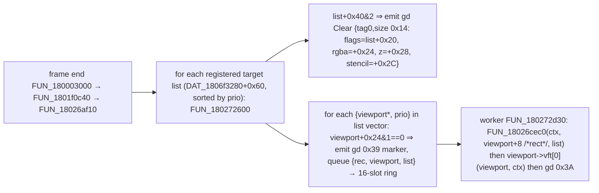

# Research — Preview compositing: cloned MODEL passes in the 2D stack

Ghidra session 2026-09-21 on `gamemdx_20260825.dll` (addresses file-relative to `0x180000000`;
the `FUN_1801f2c30`/`FUN_1801f6510`/`FUN_180023fb0` region is unshifted vs 20260616, the
ScreenCommandList walker region shifted by ~+0x300). Resolves the register's D13/D14 and pins every
engine fact the design's compositor needs. Everything below must become signature derivations
(`core/signatures.rs`) validated by `scripts/validate_signatures.sh` on all four builds; nothing is
to be hardcoded.

## 1. Target lists and the render dispatch

- **Display object** `DAT_1806f2ef0`; target lists at `display+0x08` OFFSCREEN1, `+0x28` RENDER-3D,
  `+0x30` AFTER-RENDER-3D, `+0x38` RENDER_2D, `+0x40` DISPLAY, `+0x48` PRESENT (`FUN_1801f2c30`).
- **Target list layout** (ctor `FUN_180266660`): `+0x00/+0x08/+0x10` = `std::vector<{viewport*,
  u32 prio}>` (16-byte elements), `+0x20` clear flags (ctor 7 = TARGET|ZBUFFER|STENCIL), `+0x24`
  clear rgba, `+0x28` clear z (1.0), `+0x2C` clear stencil, `+0x38` target surface (u16 dims at
  `+0x14/+0x16`), `+0x40` flags (bit0 disabled, bit1 clear-at-start).
- **Attach** `FUN_1802666c0(list, viewport, prio)`: if the viewport rect `viewport+0x08..+0x18` is
  all zero, fill w/h from the target dims; `push_back` + `std::sort` by prio (`FUN_1802668f0`,
  ascending). Plain vector — NOT an intrusive list. **Detach** `FUN_1802667d0(list, viewport)`
  (used by the shutdown `FUN_1801f30b0` for every stock pass).
- Stock RENDER_2D contents: the three 2D-list viewports `DAT_1806f1598/1580/1568` at
  0x65/0x66/0x67 (FRONT/MIDDLE/BACK AFP layer lists — every AFP layer incl. the options modal and
  the mod-menu widget layer). A viewport at prio ≥ 0x68 draws AFTER all of them. DISPLAY's SYSTEM
  list (`DAT_1806f15b0`, bottom text) still draws later, in its own target list.
- **Per-viewport setup `FUN_18026cec0(workerCtx, rect, list)`**: `FUN_18026c9a0(ctx, x, y, w, h,
  minZ, maxZ)` applies the viewport (D3D SetViewport) — **the rect IS honoured per pass**; then,
  iff `viewport+0x1C & 2 == 0` (= outer `+0x54` bit1 clear), copies the pass's PROJ (`viewport+0x28`
  = outer `+0x58`) and VIEW (`viewport+0x68` = outer `+0x98`), computes view×proj and
  world×view×proj, uploads VS c0..3 proj, c4..7 view, c8..11 viewproj, c12 camera position (also
  PS c0), c14..17 identity world, c18..21 wvp, then a per-viewport default render-state block.
  The 3D pass therefore renders with ITS OWN matrices and viewport, independent of camera slot 0.
- **Render vfunc** `FUN_1801f68a0(viewport, workerCtx)`: `items = *(viewport+0xB8)`; if non-null
  `FUN_1802606d0(*(viewport+0xB0) /*outer*/, workerCtx, items)`. The worker passes RCX=viewport,
  RDX=workerCtx (`MOV RDX,RDI; MOV RCX,RBX; CALL [R11]`).
- **Frame ordering / thread safety**: the dispatch at frame end waits for the workers to drain
  (`DAT_1806f2060` spin at the end of `FUN_18026af10`), so game-thread writes made from
  `input_manager::on_frame` (mid-frame) are never concurrent with a worker reading the same pass.
  Attach/detach must be game-thread and outside the dispatch (on_frame qualifies); a detached
  object must outlive the frame in which it was detached (free ≥ 2 frames later).

## 2. MODEL pass object (0xF8 bytes) — ctor `FUN_1801f6510`

| Offset | Field | Source |
|---|---|---|
| `+0x08..+0x20` | four render callbacks (copied from a 0x20 block; OPACITY/LOWPRIO/TRANS share `FUN_1801f6210 / LAB_1801f63c0 / FUN_18019de30 / FUN_1801f63f0`) | ctor |
| `+0x28` | sort mode: OPACITY 0x15, LOWPRIO_TRANS 0x12, TRANS 0x1A, DISTANTVIEW 0x10 (`&3` = collector mode, `>>2&3` = sort, bit4) | ctor |
| `+0x2C` | node-mask FILTER: OPACITY 0x56, LOWPRIO 0x10, TRANS 0x46, DISTANT 0x01 | ctor |
| `+0x30` | `gs::Renders::Model::Viewport<Render>` vftable `0x180388578` — slot 0 render `FUN_1801f68a0`, slot 1 dtor `FUN_180021690` | ctor |
| `+0x38..+0x44` | viewport rect `{i32 x, y, w, h}` (zero at ctor ⇒ filled by attach) | attach |
| `+0x48 / +0x4C` | viewport minZ 0.0 / maxZ 1.0 | ctor |
| `+0x50` | name hash (`DAT_1806f2040("MODEL:OPACITY", 13)`) | ctor |
| `+0x54` | flags: bit0 = DISABLED (worker skips), bit1 = skip camera setup; ctor ends with `&= ~1` | ctor |
| `+0x58` | PROJ 4×4 f32 | manager tick memcpy from `cam+0x1C8` (stock passes only) |
| `+0x98` | VIEW 4×4 f32 | manager tick memcpy from `cam+0x08` (stock passes only) |
| `+0xE0` | self back-pointer (render reads `viewport+0xB0`) | ctor |
| `+0xE8` | render-item list pointer (`*(graph+0x30)`) | SceneGraphManager ctor |
| `+0xF0` | pointer to the 0x20 callback block | ctor |

The manager tick `FUN_180023fb0` copies camera slot 0's matrices into `DAT_1806f1528..1540`
(`+0x98` view, `+0x58` proj) and the four packet passes of `DAT_1806f1550` only. A clone is
never touched by the engine after construction.

**Clone recipe**: `alloc_zeroed(0xF8)`, memcpy from the stock OPACITY (or TRANS) outer object,
set `+0xE0 = clone`, `+0x38..+0x44 = box rect (RT pixels)`, `+0x2C = private filter bit`, write
`+0x58/+0x98` each frame, attach `clone+0x30` to `display+0x38` at a free priority ≥ 0x68. The
dtor slot is never invoked on the clone (we detach and free it ourselves). Item list `+0xE8`
and callback block `+0xF0` are shared read-only with the stock pass.

## 3. Render entry `FUN_1802606d0(outer, workerCtx, items)` — nothing pass-identity-specific

Collects over ALL items in the list: `FUN_180261430(ctx, outer+8, cb0(), &opaque, &trans, items,
outer+0x28 & 3, outer+0x28 >> 4 & 1, outer+0x2C /*filter*/)` (record filter `item+0xB0 & filter`
+ clip-space AABB test against the worker ctx's view×proj — i.e. THIS pass's matrices), the
once-per-frame bone-texture upload `FUN_180261780` (frame-stamp guarded on `item+0xB4`, already
shared by OPACITY+TRANS), sort by `outer+0x28 >> 2 & 3`, `SetTexture(stage 0xF, DAT_1806f3268)`,
emit `FUN_180262670`, then callback `outer+0x10`. The gd write pointer is `workerCtx+0x218`
(records `{u16 tag, u16 size, payload}`; the worker terminates each viewport with `0x4003a`).

## 4. D14 resolved — the graph's pass-5 cull does NOT drop items

`SceneGraph::update FUN_180214570`: pass 2 update, pass 3 refresh, reset item list (`+0x30`) and
visible vector (`+0x58`), pass 4 (renderables push themselves), optional sort, then **every visible
node's `*(node+0x78)` is pushed onto the item list** (`FUN_180267190`). Pass 5 then iterates the
active cameras (`+0x38..+0x40`, 0x3F8 stride, active byte `+0x3F4`) and calls `visit(5,
{camera, index})` on each visible node — the return value only decides whether to recurse into
children; the item list is not modified. Culling of records happens in the collector against the
PASS's own matrices (§3). ⇒ a clone with its own view/proj culls correctly; camera slot 0 is not
involved and needs no write during previews.

## 5. D13 resolved — depth: add a mod-owned "clear" viewport before the clones

- Only the target list clears (once, at list start, `list+0x40 & 2`); RENDER_2D is documented to
  clear depth only, so a depth buffer IS bound. Whether AFP quads write depth was not settled
  (the gd 0x11 render-state payload is a bitfield I did not decode), and settling it is
  unnecessary: a **mod-owned viewport object** (0x30 bytes: vftable at +0, rect at +8, minZ/maxZ,
  flags at +0x1C = 0) with a 2-slot vtable whose slot 0 emits one gd Clear record
  `{0x00140000, flags, rgba, z=1.0, stencil=0}` at `*(workerCtx+0x218)` (advance 0x14) — the exact
  shape `FUN_180272600` emits — attached at the priority just below the clones. D3D9 `Clear` with
  `pRects = NULL` clears the CURRENT VIEWPORT, which the worker set to our rect one call earlier.
  Flags 2 = depth only (stage preview: the skydome fills the box); flags 3 = depth + colour (dancer
  preview: solid backdrop behind the figure — optional, design choice).
- Render-state leakage after the clone is harmless: every later viewport gets the default state
  block from `FUN_18026cec0`.

## 6. Camera matrices (for the DLL to write into the clones)

From `FUN_180220b80` (camera object: eye `+0x268`, target `+0x274`, up `+0x280`, w `+0x28C`, l/r/b/t
`+0x290/+0x294/+0x298/+0x29C`, near `+0x2A8`, far `+0x2AC`) and `FUN_1802376e0`:

- **VIEW** (`cam+0x08`, row-major, row vectors `v' = v·M`, = `D3DXMatrixLookAtRH`):
  `f = normalize(eye − target)`, `s = normalize(up × f)`, `u = normalize(f × s)`;
  rows `(s.x, u.x, f.x, 0)`, `(s.y, u.y, f.y, 0)`, `(s.z, u.z, f.z, 0)`,
  `(−eye·s, −eye·u, −eye·f, 1)`.
- **PROJ** (`cam+0x1C8`, the one copied into the passes), w > 0 perspective:
  `[0][0] = 2w/(r−l)`, `[1][1] = 2w/(t−b)`, `[2][0] = (r+l)/(r−l)`, `[2][1] = (t+b)/(t−b)`,
  `[2][2] = −far/(far−near)`, `[2][3] = −1`, `[3][2] = −far·near/(far−near)`, `[3][3] = 0`, rest 0
  (far ≤ 0 degenerates to `[2][2] = −1`, `[3][2] = −near`). Depth lands in D3D `[0,1]` (near → 0,
  far → 1). `w ≤ 0` selects the orthographic branch (not needed).
- `cam+0x88` is a second (GL-range) projection used for the frustum planes at `+0x208..` — not the
  one the passes use; ignore.
- Existing Rust: `core/anm/camera.rs` (`.camanm` → eye/target/up + `t'`, 16:9 aspect) and
  `scene_graph::CamSample::perspective(eye, target, up, half_tangent_x, aspect, near, far)` already
  produce the six frustum values; the design adds a pure `view_proj(cam: &CamSample) -> ([f32;16],
  [f32;16])` implementing the two formulas above (host-tested; validated against a live dump of a
  stock pass's `+0x58/+0x98` during one gameplay frame).

## 7. Dead end recorded: tag 0x10 is not a model draw

Walker `FUN_18026a040` case 0x10 → `FUN_180269600` → `FUN_18026cc00(ctx, stage, texObj)`: emits gd
tag 8 SetTexture from a `{TextureData*, f32[4]}` object (default texture `DAT_180cf3528` when
null) + `FUN_180267830(ctx, textured?)` for stage 0. Case 0x11 = SetTexture by id, 0x12 = gd tag
0xA with a u64, 0x17 = gd 0xD SetRenderTarget (`DAT_1806f326c` default). The feasibility doc's
"Option C" is closed.

## 8. Signature work implied (all-or-nothing `derive_scene3d_preview`, fail-open to no preview)

1. `display` global + RENDER_2D list offset + attach fn + Viewport sub-object offset + the two
   pass globals: the `FUN_1801f2c30` attach sequence (`MOV RCX,[display+0x38]; LEA RDX,[pass+0x30];
   MOV R8D,0x66/0x68; CALL attach`).
2. Detach fn: prologue AOB, cross-checked as the callee of the shutdown's paired calls.
3. Pass layout (`+0x38` rect, `+0x54` flags, `+0x58`/`+0x98` matrices, `+0xE0` self, `+0xE8`
   items, `+0x2C` filter, `+0x28` sort): ctor `FUN_1801f6510` stores + manager tick memcpys.
4. Worker gd write-pointer offset (`+0x218`): the `MOV RAX,[RDX+0x218]` / `{8,0xc,0xf}` SetTexture
   store in `FUN_1802606d0`, or the worker's `0x4003a` terminator store.
5. Clear record shape: attest `FUN_180272600`'s `0x140000` store + the flags/rgba/z/stencil copies.
6. Free node-mask bits: assert the four stock filters (`0x01|0x56|0x10|0x46`) leave `0x08`, `0x20`,
   `0x80` clear on the running build before using them.
