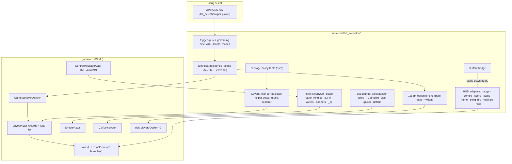
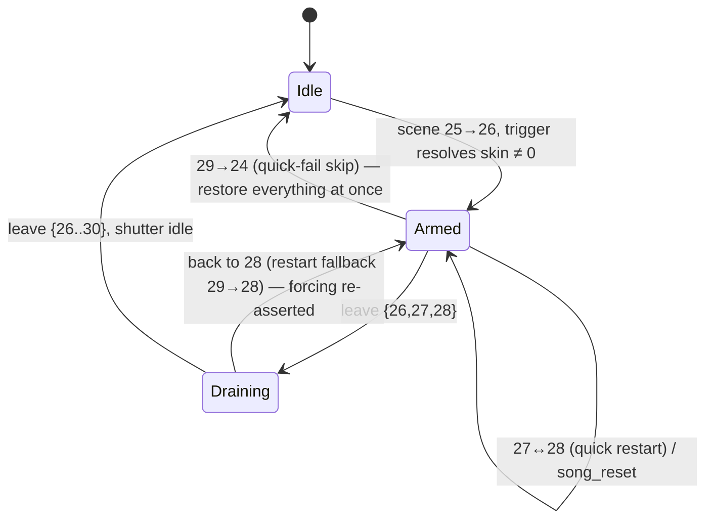

# DDR SELECTION — Detailed Design

Status: Approved 2026-09-22

## 1. Overview

DDR A20 – A3 let a player pick a song from a **DDR SELECTION** sub-folder and
play it with the gameplay presentation of the era it came from: judgement
words, combo digits, life gauge, score frame, stage banner, element
positions, the pre-song stage panel with its era cut-in, READY / HERE WE GO,
the end-of-song banners, the announcer, and — for the 1st–5th era — forced
classic options. DDR World removed the feature, but almost all of the data
and much of the code survived:

- The skin id field (`GameWork+0xA8`), its per-credit reset, the identity
  table the play sequence uses to hand it to the gameplay `LayoutActor`, and
  the `LayoutActor`'s per-package record that stores it — all alive, all
  inert (nothing writes a non-zero value).
- Several World HUD actors still contain A3's per-skin branches (danger flash
  placement, gauge intro label, full-life display, loader-vs-record package
  selection) and three live `CMP [GameWork+0xA8],1` gates (no song-info
  panel, no option icons on the 1st–5th skin).
- 108 legacy data files (skin packages, the stage-panel / cut-in / end-banner
  packages, SuperNOVA 2 banners, `_sel` movies, and A3's sound banks) are
  shipped in the stock World install; 105 are byte-identical to A3's.

This mod — `ddr-selection` — revives the feature, driven from the in-game
options menu instead of a folder. It restores the one missing string append in
the package loader, feeds the skin id back into World's own plumbing, and
re-implements the pieces Konami deleted (the READY/HERE WE GO actor, the
legacy stage panel, the era cut-in, the A3 announcer rules, the legacy
combo/score behaviour) inside World's objects.

Delivery is phased (§2.3); the feature is complete only when every phase has
shipped. Addresses below are file-relative to `gamemdx.dll` at `0x180000000`,
World build 20260825 unless noted; every production address is resolved by
AOB/RTTI/derivation and swept across the supported builds (20250805,
20260224, 20260721, 20260825).

## 2. Detailed Requirements

### 2.1 Trigger and governance

- **R1.** A per-player in-game OPTIONS row `ddr_selection`, "DDR SELECTION",
  values OFF / AUTO / 1st-5th / MAX-EXTREME / SuperNOVA / X / 2013-A,
  rendered as text (Dynamic-format scalar, no per-value textures), default
  OFF, persisted in the JSON option cache only (`PersistMode::Local`, never on
  the wire). The row label texture `seop_item_ddr_selection` (eng/jpn/kor) is
  generated by the existing option-label pipeline.
- **R2.** AUTO maps the committed song's raw musicdb `<series>` to a skin:
  1–5 → 1st-5th, 6–8 → MAX-EXTREME, 9–10 → SuperNOVA, 11–13 → X, 14–17 →
  2013-A (17 = DDR A), everything else (0, ≥ 18 = A20 onward, custom
  series ≥ 22) → stock. This equals A3's DDR SELECTION folder buckets.
- **R3.** An explicit era applies to every song regardless of series.
- **R4.** One skin per song for the whole cabinet. Solo: the entered side's
  row governs. Versus: P1 governs and the row is mirrored P1 → P2 while both
  are entered. A multiplayer-bot side never governs.
- **R5.** Armed in normal play, training and versus. Courses, event chains
  (event mode 1/2) and the attract demo stay stock (A3 never skinned them).
- **R6.** Song select is untouched — no folder, no wheel changes.

### 2.2 Presentation (the full A3 skin surface)

For skins 1–5 the gameplay window reproduces A3:

| # | Element | Requirement |
|---|---|---|
| P1 | Judgement words, FAST/SLOW, full-combo splash, game over, danger | The legacy package of the skin (`dance_{judge,fast_slow,fullcombo,game_over,danger}000N`) replaces World's; danger placement per A3 (skins 1–2 centred, 3–5 at the `danger_gauge` marker) |
| P2 | Life gauge, all gauge types | Legacy gauge package; P2 gauge mirrored; segmented fill for skins 1 (63 cells) and 5 (26 cells + partial cell), continuous for 2–4 and every FLARE state; skin 3 intro label; skin 2 full-life display. FLARE / GRADE show the legacy bar exactly as A3 did (labels the legacy art lacks are simply requested and miss). FLOATING FLARE (World-only) behaves as FLARE |
| P3 | Combo | A3 behaviour: one `dance_combo` clip, digits laid out by code, count-dependent growth, skin 1 half-width digits, single colour for skins 1–3 and worst-grade colour for 4–5, shown from combo 4, replay on each increment |
| P4 | Score + difficulty + EX | A3 `frame_score` 7-digit display with smoothing and grey leading zeros, commas where the skin has them, A3 difficulty frame and level texture (skin 2's label scheme), EX indicator where the skin has it, no player name |
| P5 | Stage frame ("1st STAGE" …) | Legacy `dance_stage_frame000N` with A3 texture names |
| P6 | Song info | Skin 1 none; skin 2 legacy band; skins 3–5 A3's own `0000` panel with title/artist text |
| P7 | Element positions | A3 layout: markers from `dance_common000N` (skins 2–5) or A3's `dance_common0000_v2` (skin 1) override World's for every A3-defined element; World-only markers stay World's |
| P8 | World-only HUD | BPM display and player name hidden; option display hidden on skin 1, World's on 2–5; captions, measure, pacemaker, lane filter/cover and hit effects stay World's |
| P9 | Pre-song stage panel | A3's legacy panel (legacy stage band, legacy background, jacket for skins 3–5 — the song's SuperNOVA 2 banner on skin 3, no jacket on 1–2), score fields where World has a data source, held until READY |
| P10 | Era cut-in | Per-skin cut-in animation + SE (`sele_1st/ext/sn2/x2/2013`) between panel load and panel reveal, skippable after 0x3B frames like A3 |
| P11 | READY / HERE WE GO | A3's `dance_message000N` clips at the chart-derived READY / HERE / OUT ticks (lesson song: HOW TO PLAY, no HERE); skin 1 HERE WE GO voice `ACT3_1` (`ACT4_2` on the final stage); READY closes the stage panel |
| P12 | World-only intro | While a legacy skin is armed: no World READY? panel, no `vo_ingame_ready`, no 5.0 s ready dwell, no World stage voice |
| P13 | Stage voice | Skin 1 silent; 2–3 `sn2_etc*` by stage; 4–5 A3 `vo_stage_*` |
| P14 | End-of-song banners | Legacy CLEARED / FAILED / PRAY FOR ALL from `common_shutter000N` |
| P15 | `_sel` background movies | `<movie>_sel` plays whenever a legacy skin is armed and the file exists |
| P16 | Announcer + crowd | A3 `CallVoiceActor` rules per skin (§4.7), skins 4–5 with A3's own `vo_ingame_*` voices |
| P17 | 1st-5th option forcing | Speed ×1.0, boost/appearance/step zone/scroll normal, arrow colour FLAT, arrow CLASSIC, lane filter off, guideline off — for the song only, never saved; in-song speed change stays available |
| P18 | S-Marvelous | First pass: S-Marv's judgement-word flash and S-MFC splash stand down on songs whose judge / full-combo package is legacy; every other S-Marv surface unchanged. Final phase: per-skin S-Marvelous art (§4.9) |

Not reproduced: the DDR SELECTION folder UI (replaced by R1).

### 2.3 Delivery phases

| Phase | Content | Exit |
|---|---|---|
| P0 | Package-helper restore + `GameWork+0xA8` write + dev knob, class-A packages only | Cabinet: legacy judge words etc. render, no WARN, consecutive skin→stock→skin songs + quick restart/fail correct |
| P1 | Option row, trigger, AUTO, governance, versus mirror, S-Marv stand-down, A3 import scripts, docs corrections | Operator can pick any era in-game |
| P2 | Era bank infrastructure; READY/HERE WE GO; legacy stage panel (shutter kind 3); cut-in; stage voices; World-intro suppression; end banners; `_sel` movies | A3 intro and outro on every skin |
| P3 | Gauge, combo, score, stage frame, song info, element positions, World-only HUD hiding | Full A3 HUD |
| P4 | Announcer + crowd rules | A3 soundscape |
| P5 | 1st-5th option forcing | A3 1st-5th behaviour |
| P6 | S-Marvelous legacy art | S-Marv on every skin |

The mod is listed in `DEFAULT_OFF_MODS` until P0–P3 are cabinet-proven.

### 2.4 Assumptions

- Stage-panel fields with no World data source (A3 rival/target sets without
  a World equivalent) stay empty; the design of P9 lists them.
- The A3 announcer rules are driven by World's `CallVoiceActor` fields, whose
  layout is identical to A3's on every supported build.
- Only A3's `dance_combo0005_v0.arc` is needed from an A3 install today
  (World's copy is blanked: it decompresses to 518 016 zero bytes). Any other
  data version missing a file is covered by the same import mechanism (§4.11).

## 3. Architecture Overview



Principles:

1. **World's plumbing does the routing.** Once the helper appends the suffix
   and `GameWork+0xA8` holds the skin, every package lookup, the record skin,
   the surviving skin branches and the skin-1 gates behave as in A3. The mod
   adds only what was deleted.
2. **Keep World's objects and vtables.** `song_reset` identifies the gauge,
   score and note-result actors by stock RTTI vtable and pokes their fields,
   so re-hosted behaviour lives in gated detours on individual World
   functions, never in cloned vtables.
3. **One detour per target.** Targets already owned by another mod
   (center-arrows' layout builder, marker setter and song-info card;
   S-Marvelous' combo digit refresh; overlay-element-styling's clip creation)
   are promoted to shared dispatchers (the `judge_hook` model) before
   `ddr-selection` subscribes.
4. **A package is legacy only when its consumer is ready.** A World actor
   handed a package that lacks the export it asks for NULL-derefs. Each
   policy entry names the adapter it needs; an entry is live only when that
   adapter resolved at init.
5. **Fail open per element.** Any missing derivation, file or bank leaves that
   element stock with one WARN; the rest of the skin still applies.

### 3.1 Lifecycle



- **Arm** (scene callback at 25 → 26, before `createNextSequence` builds the
  interstitial that requests the stage panel): resolve the skin, write
  `GameWork+0xA8`, publish the armed skin to every component, snapshot and
  force options (skin 1), mark the era bank for registration, set the
  `_sel`/intro/banner overrides.
- **Gameplay** (26/27/28): the play sequence's `LayoutActor` loads legacy
  packages through the helper; HUD adapters and the intro run off the armed
  skin. A quick restart (28 → 27 → 28) builds a fresh play sequence under the
  same arm; the old `LayoutActor` erases its own packages at finalize, the new
  one reloads them. Option forcing is re-asserted at 27 → 28.
- **Leave 28**: option forcing restored (before the per-stage and logout
  save marshals run).
- **Leave {26..30}** (or 29 → 24): `GameWork+0xA8 = 0` (A3 reset the skin at
  stage-results finalize), shutter overrides removed once the shutter is
  idle, everything disarmed. The credit reset zeroes the field too.

## 4. Components and Interfaces

Module layout: `src/mods/ddr_selection/` — `mod.rs` (lifecycle, `Mod` impl),
`trigger.rs`, `policy.rs`, `options_force/table.rs`, `hud/*_math.rs`,
`sound/{bank_build,rules}.rs` are **pure** (std-only, no `crate::` imports,
host-tested); `package_helper.rs`, `hud/*.rs`, `intro/*.rs`,
`sound/{bank,call_voice,voices}.rs`, `options_force/mod.rs`, `movie_sel.rs`,
`smarv_bridge.rs` are engine-facing.

### 4.1 Trigger and arming (`trigger.rs`, `mod.rs`)

```rust
pub enum RowValue { Off, Auto, Era(Skin) }          // row 0..=6
pub struct Skin(u8);                                  // 1..=5
pub struct TriggerInputs { entered: [Option<bool>;2], bot_side: Option<u8>,
    row: [i32;2], series: Option<u8>, course: Option<bool>, event_mode: Option<i32> }
pub fn resolve(i: &TriggerInputs) -> Resolution;     // {skin: u8, governing: Option<u8>, reason}
pub fn auto_skin(series: u8) -> u8;                   // R2 table
```

- Inputs are gathered at the arm edge: `stage_records::{side_entered,
  course_field_offset, event_mode}`, `multiplayer_bot::is_bot_side`, the row
  values (per-side atomics fed by the row's `on_change`), and the governing
  side's committed mcode (`PlayerWork+0x54`) → `find_music_by_mcode` (existing
  derivation) → raw series via the music-entry vslot read from the
  `flare_skill_classifier` match (`call [rdx+disp32]` at match+2; 0xA0 on
  20260324+, 0x88 on 20250805/20260224), published as `music_series_vslot`.
  `None` anywhere fails closed to stock (series missing ⇒ AUTO = stock + one
  WARN; an explicit era still applies).
- The row registers with `versus_mirror` (`register(&["ddr_selection"])`,
  `mirror_edit` from `on_change`).
- Dev knob (developer mode only): `DDR_SELECTION_FORCE=<1..5>` overrides the
  resolution for every song (P0 vehicle).

### 4.2 Package helper and skin write (`package_helper.rs`, `policy.rs`)

World's `LayoutActor::onInitialize` (`FUN_18006b8b0`) calls the per-package
helper `FUN_18006b710(this, side, base, skin, shared)` for 14 per-side
packages and 4 shared ones (`dance_stage`, `dance_message`,
`dance_song_info`, `dance_common`; `dance_danger` is also shared on World).
The helper builds a `{std::string name; …; int skin @+0x28}` value, formats
`"%04d"` into a dead stack buffer (A3 appended it here), probes
`FUN_1801ac3f0("bm2d", name)`, and — when `!shared || skin != 0` — inserts
`records[side][base] = value` (`FUN_18006ec30`) and pushes the name on the load
list `+0x170` (`FUN_18006db60`). Actors look records up by base
(`FUN_18006ece0`); the package vector is keyed by the pushed name; the
`LayoutActor`'s finalize releases every pushed name (`FUN_1801acd00`, erase by
name).

**Detour** (full replacement, game thread, not hot):

1. `policy::decide(base, armed_skin)` → `Stock` | `Legacy { arc_base, skin }`.
2. `Stock` ⇒ call the original with `skin = 0` (exact World behaviour; shared
   packages come from the stage loader, record skin 0 so World actors keep
   their skin-0 branches).
3. `Legacy` ⇒ check `data/arc/bm2d/<arc_base>000N_v0.arc` exists (LayeredFS
   mod folders first — `mod_paths::find_first_modfile`, then `std::fs`;
   cached per arm), then build the value with the game's own `std::string`
   assign (`FUN_18000b560`) and allocator, `skin` = N, insert under `base`,
   push `<arc_base>000N`, free the local — the A3 append, verbatim. Missing
   file ⇒ `Stock` + one INFO.
4. Never fall back to `<base>0000`: World's probe (`_v3`, `_v0`, `_lite`,
   bare) resolves those to early-World or A3-oldest arcs with the wrong export
   names.

All callee addresses and the record/list offsets (`+0x98` shared,
`+0xE0 + side*0x48`, `+0x170`) are decoded from the helper's own bytes
(all-or-nothing derivation, identity-gated on the `"dance_message"` compare and
the `"%04d"` format string); P0 also scans for any other reader of
`LayoutActor+0x190`.

`GameWork+0xA8` is located by the `MOVSXD RAX,[RCX+disp32]` after the
`GameWork` load in the play-sequence initialiser (published
`gamework_skin_off`); written at arm, zeroed at disarm. Distinct suffixed names
never collide with loader-owned stock entries, so the write is safe exactly
when step 3 exists — both ship together.

**Policy table** (`policy.rs`, const):

| Base | Legacy arc base | Skins | Needs adapter | Phase |
|---|---|---|---|---|
| `dance_judge`, `dance_fast_slow`, `dance_fullcombo`, `dance_game_over` | same | 1–5 | — (S-Marv bridge) | P0 |
| `dance_danger` | same | 1–2 / 3–5 | — / markers | P0 / P3 |
| `dance_gauge` | same | 1–5 | gauge | P3 |
| `dance_combo` | same | 1–5 (5 needs the A3 import) | combo | P3 |
| `dance_score` | same | 1–5 | score | P3 |
| `dance_stage` | `dance_stage_frame` | 1–5 | stage frame | P3 |
| `dance_song_info` | same (skin 2) | 2 | song info | P3 |
| `dance_message` | same | 1–5 | ReadyGo | P2 |
| `dance_common` | — (never handed to the builder; markers post-pass reads it) | — | — | — |
| `dance_effect/bpm/filter/cover/option/score_compare` | — | — | — | stock |

A pure host test enforces: every live legacy entry names an adapter or none;
no entry maps to a `0000` name; `dance_common` is never legacy.

### 4.3 Shared dispatchers

Promoted before use, each keeping its current owner's behaviour bit-for-bit:

- layout builder `FUN_18006bd40` + marker setter `FUN_18006f020` + song-info
  card builder (today center-arrows-single) → `services/hud_layout_hooks`;
  order: ddr-selection's marker post-pass runs **before** center-arrows' lane
  shift.
- combo digit refresh `FUN_180066930` (today S-Marvelous post-original) →
  `services/combo_hooks`; a legacy side never reaches World's refresh, so
  S-Marv's subscriber is simply not invoked for it.
- clip creation (today overlay-element-styling's capture) → gains a
  pre-original **export alias** hook (§4.4) and a classifier entry for the
  legacy `dance_combo` clip.

### 4.4 HUD adapters (`hud/`, phase P3)

All gated on "this side's record skin ≥ 1", detouring World functions:

- **Gauge.** Export alias `dance_gauge` → `00_dance_gauge` when the package
  handle is a legacy gauge package (pure map consulted at clip creation; the
  labels and child names already match). GaugeActor init
  (`FUN_180073cf0`) post-original: side 1 `SetScale(-1,1)` (percent family
  only). Fill (`FUN_180074e10`): port of A3's segmented fill `FUN_180054050`
  (skins 1/5 non-FLARE) and mirrored continuous fill (2–4, FLARE); latches
  `+0x94/+0x98/+0x9C` untouched so `song_reset`'s gauge restore stays valid.
  Cell math in `hud/gauge_math.rs`.
- **Combo.** Port of A3 `ComboActor` (`FUN_180046a60` init, update, msg,
  finalize) into World's init/msg/update/finalize for legacy sides: legacy
  clip in `+0x70`, `+0x78/+0x80` stay null, World's msg/refresh never run for
  that side; counters from World's own `+0x68` (combo) / `+0x6C` (worst
  grade). Growth factors, cell width, digit centring in `hud/combo_math.rs`
  (A3 constants: skin 1 1.0 → 1.1..1.99 (10–99) → 2.1 (≥100); others
  1.0 → 1.04..1.35 → 1.5 (100–999) → 1.25 (≥1000); skin 1 half cell).
- **Score.** Port of A3 `ScoreActor` init (`FUN_180055390`), digits
  (`FUN_180055be0`), difficulty msg (`FUN_180056080`) into World's
  (`FUN_1800775d0`, `FUN_180077eb0`, `FUN_180078320`); honours
  `+0x6C == -1` as "repaint all" (song_reset's sentinel).
- **Stage frame.** World's two functions (`FUN_18007a190`, `FUN_18007a390`)
  run A3's logic for legacy sides: export `stage_frame`, marker
  `stage_frame`, textures `stage_frame%04d_stage_%s`.
- **Song info.** Skin 1: the live gate. Skin 2: init detour creating the
  legacy band (no text child). Skins 3–5: A3's `0000` panel —
  `dance_song_info0000_v2` loaded by explicit name, A3 SongInfoChild text
  layout (`music_name_usr`, `artist_name_usr`).
- **Markers.** Post-pass after World's builder: load the legacy root
  (`dance_common000N`, or `dance_common0000_v2` for skin 1) by explicit name,
  read the A3-named markers (`combo_set_usr/{combo,fast_slow}_usr` nesting,
  `difficuty_normal_%dp[_reverse]_usr`, …) and overwrite the A3-defined keys
  via the setter: score, difficulty, gauge, danger_gauge, gameover, fullcombo,
  judge, combo, fast_slow, filter, score_compare, arrow_raw/arrow,
  freeze_judge, stage, song_info; release the root. World-only keys (bpm,
  name, option, option_icon, dance_matching, movie_*) stay World's. The
  loader-owned `dance_common` is never swapped.
- **Hide.** BPM display and player name: skip creation (or alpha 0) for
  legacy sides.

### 4.5 Intro and outro (`intro/`, phase P2)

- **Stage panel (kind 3 host).** World's interstitial requests shutter kind 3
  (`shutter_play` from `common_shutter_v3`). While armed, detours on the
  kind-art loader (`FUN_180035420`) and kind-3 fill (`FUN_180035f00`)
  substitute A3's panel: root `shutter_choice_hd_root` from
  `common_choice_v2` (requested by **full name** — the bare base resolves
  `_v0`), plus `choice_stage` from `common_choice000N`,
  `choice_background` / `choice_jacket` from `common_shutter000N`,
  jacket rules (skin 3 `data/arc/banner/banner_sn2_<basename>.arc`, skins 1–2
  jacket hidden), score fields per §2.4. The state that plays World's
  `stage_out` + voice plays A3's `frame_out` instead and parks; the panel is
  closed at READY by World msg `0x100c` (A3's `0x100D` — its only stock sender
  was the deleted ReadyGoActor), which also keeps quick-restart's bannerless
  dismiss valid. The 5.0 s ready dwell is cleared by seeding `DPS+0x130` past
  the threshold (the quick-restart technique). Phase P2 opens with a focused
  RE task pinning the exact state-machine seams on all builds before any code.
- **Cut-in.** Inserted between "art loaded" and "swap": `choice_cutin` from
  `common_choice_cutin000N` over `common_choice_cutinbg`, SE `sele_*`,
  skippable after 0x3B frames, wait label `close`.
- **ReadyGo.** Re-implemented without a fabricated actor: a post-original tap
  on the ControlMessageActor sender (`FUN_1800561f0`, World ids `0x1047`
  READY, `0x1048` HERE, `0x1049` OUT) drives two DLL-created layers
  (`00_ready` or `00_howtoplay`, `00_here`; draw layer/prio 5) from
  `dance_message000N`, created at play-sequence step ≥ 1 and destroyed at
  `end`, before the package is released (layer-before-package rule). READY
  sends `0x100c` to the shutter; skin 1 HERE plays `ACT3_1` / `ACT4_2`
  (final stage). Duplicate triggers (versus sides) are no-ops.
- **Voices / suppression.** Stage voice `FUN_180033760` detour (skin 1 none,
  2–3 `sn2_etc{a2..a5,a7,73}`, 4–5 A3 `vo_stage_*`); the two
  `vo_ingame_ready` plays in the shutter update suppressed while armed.
- **End banners.** Kinds 4/5 → `common_shutter000N` `shutter_clear` /
  `shutter_failed` plus a DLL-created overlay (`00_cleared` / `00_failed` /
  `00_prayforall`); World's kind-4/5 fills guarded (their children are
  absent).
- **`_sel` movies** (`movie_sel.rs`). MovieActor ctor (`FUN_18007c960`)
  post-original writes the dead flag `+0x149 = 1` when armed and
  `<movie>_sel` exists; World's init already tries `_sel` first when the flag
  is set. Coordinated with `movie_policy` / `movie_sync` (no change to their
  seams).

### 4.6 Era sound bank (`sound/bank_build.rs` pure, `sound/bank.rs`, phase P2)

World ships A3's unloaded `_n` banks: `data/sound/win/voice_n.xwb`
(byte-identical to A3's), `data/arc/soundbanks_n.arc` (`voice_n.xsb`,
`se_normal_n.xsb`), `data/arc/se_normal_n.arc` (`se_normal_n.xwb`). At enable,
a background thread reads them (LayeredFS-aware, `std::fs`) and builds **one
in-memory bank pair** containing exactly the cues the feature uses (table in
§5.4): XWB entries copied verbatim (ADPCM, per-entry format), align 4, empty
seek segment, mod-owned internal name `dsel`; XSB with the simple cues and the
complex cues' type-1 variation tables, sounds byte-copied with wave indices
remapped. `se_bank_synth` gains an N-entry XWB writer and a variation-capable
XSB writer (reusing its CRC-16 and cue hashing). Registered on the game thread
at the first arm through `game_audio::register_bank` (slot 4, unused today),
immortal. `game_audio` gains `play_cue(...) -> Option<CueHandle>` and
`is_cue_playing(handle)` (the game's is-playing function, derived from the
`CallVoiceActor` guard helper's first call).

**AFP-embedded cues** (the legacy clips carry their own `sound_play` names:
`2nd_BIG2`, `STG_APP02/03`, `ACT2_1`, `sn2_mst09`, `XAC_full_combo2`, …) are
included in the bank. P2's RE task determines how World's AFP sound callback
resolves cue names; if it searches loaded banks by name, registration alone
makes them play; otherwise a tap on that callback routes misses to `dsel`.

### 4.7 Announcer rules (`sound/rules.rs` pure, `sound/call_voice.rs`, phase P4)

World's `CallVoiceActor` has A3's field layout on every build and its own
`onMessage` keeps filling it (step state `+0x58`, last handle `+0x84`, song
time `+0x88/+0x8C`, next state/crowd times `+0x90/+0x94`, next milestone
`+0x98`, voice/SE mutes `+0x9C/+0x9D`, was-low `+0x9E`, per-side gauge / combo
/ difficulty `+0xA0..+0xB4`, players left `+0xB8`). Detour on its `onUpdate`
(vtable slot 6, via the RTTI vtable): armed skin ∈ 1..5 ∧ bank registered ⇒
`rules::step(snapshot, skin) -> Vec<Effect>` (pure, host-tested against the A3
table) executed through `play_cue` with A3's guard (skip while the previous
voice plays) and World's mute filter; else the original.

| Trigger | skin 1 | skins 2, 3 | skins 4, 5 |
|---|---|---|---|
| combo crosses 100·k, ≤ 1000 | — | `sn2_dgm25 + k − 1` | `vo_ingame_combo_<N>` |
| combo 100·k ≥ 1100 / odd 50·k | — | — | `vo_ingame_combo_over` / `_gen` (only when `c % 100 < 91`) |
| state voice, gauge > 0.8 | `ACT6` | `sn2_dgm_high` | `vo_ingame_high` |
| 0.2 ≤ g ≤ 0.8 | — | `sn2_dgm_middle` | `vo_ingame_gen` / `_regain` (after low, > 20 s) |
| g < 0.2 | — | — | `vo_ingame_low_hard` (diff 3–4) / `_low_easy` |
| crowd SE due (unless g ≤ 0.4 ∧ c < 13) | `2nd_BIG2` | `2nd_KANSEI_B` / `STG_APP03` | `STG_APP02` |

Thresholds 0.2 / 0.4 / 0.7 / 0.8; state-voice period 0x8000, crowd period
0x10000, seeded `t+0xBE70` / `t+0xFC7C` — all A3 constants.

### 4.8 1st-5th option forcing (`options_force/`, phase P5)

Per-side field writes on `ddr::player::Option` (at `PlayerWork+0xE0`, +0xF0
on old builds — existing `player_option_offset`), snapshot once per window:

| A3 option | World field | Forced |
|---|---|---|
| speed ×1.0 | `+0x08` speed type, `+0x0C` hispeed | type 1 (speed rate), 100 — `song_rate::real_speed` only recomputes type-0 sides |
| boost | `+0x54` scroll moving | 0 normal |
| appearance | `+0x28` visibility, `+0x34` lane cover | 0, 0 |
| step zone | `+0x40` | 0 (on) |
| scroll | `+0x1C` | 0 normal |
| arrow colour FLAT | `+0x5C` | 3 |
| arrow CLASSIC | `+0x60` | 2 |
| lane filter off | `+0x30` transparency | 100 |
| guideline off | `+0x3C` | 2 |

Written at arm for every side that gets a GamePlayActor (both sides when the
bot is armed — after its impersonation copy), re-asserted at 27 → 28,
restored when leaving 28. Any save built while forced has the 11 native nodes
rewritten from the snapshot (`custom_options_persistence::replace_option_s32`,
the `<timing_music>` precedent). Field offsets are published derivations
validated against the `ddr::player::Option::Set*` assert-string layout on all
builds.

### 4.9 S-Marvelous bridge (`smarv_bridge.rs`, P1; art P6)

`ddr_selection::legacy_package(base: &str) -> bool` for the current song.
S-Marv's flash (`flash.rs`) and S-MFC splash (`splash.rs`) consult it and
stand down; this also closes their session-latch hazard (the patch-applied
latch would otherwise fire `in_smarvelous` on a legacy clip).

**P6.** Per-skin art under `data_mods/ddr_selection/s_marvelous/<skin>/`
(judgement word, S-MFC splash, violet combo treatment where the skin has
per-grade colour): drafted by `scripts/gen_ddr_selection_smarv_drafts.py` from
the installed legacy art (local output only), finished by hand, committed as
original work. The runtime generalises S-Marv's word-clone / splash recipes
(`core/ap2` editing) to the legacy templates, keyed on
`dance_judge000N_v0.ifs` / `dance_fullcombo000N_v0.ifs`; the bridge then
enables S-Marv presentation on legacy songs whose art exists.
*As built 2026-09-25:* no draft phase (maintainer) — the art is generated
programmatically like World's (`scripts/gen_ddr_selection_smarv_art.py`) and
committed; see `research/smarv-legacy.md`.

### 4.10 Diagnostics

- One INFO per armed song: skin, source (AUTO series N / explicit / dev
  knob), governing side, legacy packages loaded, elements stock with reason.
- One WARN per degraded element (latched per class).
- `DDR_SELECTION_FORCE=<1..5>` (developer mode).

### 4.11 A3 asset import (`scripts/ddr_selection/`)

`import_a3_assets.sh <A3 install> <World install>` and
`import_a3_assets.bat` (same contract): validate both installs
(`data/arc/bm2d/` present), read the manifest `a3_assets.manifest`
(committed: relative path + A3 sha256 + reason), copy each listed file whose
World copy is missing or on the manifest's known-damaged list into
`<World>/data_mods/ddr_selection_a3/<path relative to data/>`, verify the
hash, print a summary; idempotent; never touches any other folder. Manifest
today: `arc/bm2d/dance_combo0005_v0.arc` (World copy blanked). The DLL
detects a zero-filled `dance_combo0005` (no mod-folder copy) and keeps skin 5
combo stock with one WARN naming the script. The README documents the step.

## 5. Data Models

### 5.1 Skins and row values

| Row value | Meaning | Skin id |
|---|---|---|
| 0 | OFF | 0 |
| 1 | AUTO | `auto_skin(series)` |
| 2 | 1st-5th | 1 |
| 3 | MAX-EXTREME | 2 |
| 4 | SuperNOVA | 3 |
| 5 | X | 4 |
| 6 | 2013-A | 5 |

### 5.2 Armed state

```rust
struct Armed {
    skin: u8,                       // 1..=5
    governing: u8,                  // side
    mcode: i32,
    legacy: EnumSet<Package>,       // filled by the helper as packages resolve
    options_snapshot: [Option<OptionFields>; 2],
    shutter_overridden: bool,
}
```

Published lock-free (atomics) for detours; mutations on the game thread.

### 5.3 `LayoutActor` record value (MSVC, from World's helper)

| Off | Field |
|---|---|
| +0x00 | `std::string` package name (SSO 16, size +0x10, capacity +0x18) |
| +0x28 | `int` skin |

### 5.4 Era bank cue set

| Group | Cues | Source | Size |
|---|---|---|---|
| skins 1–3 announcer | `ACT6`, `sn2_dgm_high`, `sn2_dgm_middle`, `sn2_dgm25..34` | `voice_n` | ≈ 1.2 MB |
| skins 4–5 announcer | 20 `vo_ingame_*` cues (A3 set) | `voice_n` | ≈ 11.4 MB |
| crowd SEs | `STG_APP02`, `STG_APP03`, `STG_BOO`, `2nd_BIG2`, `2nd_KANSEI_B` | `se_normal_n` | 0.9 MB |
| intro | `sele_1st/ext/sn2/x2/2013`, `sn2_etca2..a5/a7/73`, A3 `vo_stage_*`, `ACT3_1`, `ACT4_2` | both | small |
| AFP-embedded | every `sound_play` name in the legacy clips absent from World's loaded banks | both | small |

## 6. Error Handling

| Failure | Behaviour |
|---|---|
| Helper derivation / `GameWork+0xA8` derivation missing | Mod inert (`is_active` false), one WARN — nothing half-applied |
| Series lookup fails | AUTO ⇒ stock for that song; explicit eras still apply |
| Legacy arc missing (incl. blanked `dance_combo0005` without import) | That package stock, INFO; its adapter never engages |
| Adapter derivation missing | Its packages stay stock; other elements still legacy |
| Shared-dispatcher promotion fails | Dependent adapter disabled; the owning mod keeps working unchanged |
| Shutter seam derivation missing | World intro/outro for the song (READY panel included); `dance_message` stays stock; HUD still legacy |
| Era bank build/registration fails | World announcer and voices; AFP-embedded legacy cues silent; one WARN |
| Option snapshot/restore fails a readability probe | Forcing skipped (never write without a snapshot) |
| Any pointer read from a game object without an AOB-pinned layout | `memory::is_readable` before dereference; failure ⇒ element stock |
| Panic in a callback | `catch_unwind` ⇒ passthrough to the original + one WARN |

Detours stay installed for the session; disarmed they are passthrough, so an
options-menu toggle never installs or removes code.

## 7. Testing Strategy

- **Host tests** (`scripts/validate_ddr_selection.sh`, the temp-crate
  `#[path]` harness used by the other validators): trigger resolution (every
  row value × series × modes × versus/bot), AUTO table, policy invariants,
  option-forcing value table against World's enum orders, combo growth/cell
  math and gauge segmented-fill math against A3 constants, announcer rules
  (fixture timelines → expected cue sequences, guard and mute semantics),
  era-bank builder round-trip (parse the built XWB/XSB back; offline leg
  against `$DDR_WORLD_INSTALL` when set), cue-set completeness against the
  legacy clips' `sound_play` names, import manifest parsing.
- **Signature sweep**: every new AOB/derivation through
  `scripts/validate_signatures.sh` on all four builds, and
  `scripts/sig_harness/shape_diff.py` for every consumer reading bytes after a
  match or hardcoding struct offsets.
- **Script tests**: `import_a3_assets.sh` against both installs (copies one
  file, second run is a no-op, bad paths refused); `.bat` reviewed for the same
  contract.
- **Cabinet matrix** per phase: each skin × {1P, versus, bot} × gauge types
  (NORMAL, LIFE4, RISKY, FLARE, FLOATING FLARE, GRADE) × {quick restart, quick
  fail, training loop, song_reset} × {stock → skin → stock consecutive songs};
  logs must show the per-song INFO and no unexpected WARN; S-Marv, center
  arrows, overlay element styling, playfield styling and PUS enabled together.

## Appendix A — Alternatives considered

- **Resolver-level name swap** (detour the arc resolver, keep the stock name
  as the package key): one pointer swap, but the stock and legacy copies then
  share a package key, which forbids the `GameWork+0xA8` write (shared
  packages would dedupe onto loader-owned entries and be erased at
  `LayoutActor` finalize) and leaves loader-owned `dance_danger` stale across
  a quick-fail skip. Rejected for the A3-exact helper restore.
- **LayeredFS renamed copies**: stateful repack cache per skin; rejected.
- **Cloned vtables for re-hosted actors**: breaks `song_reset`'s vtable
  identity checks; rejected for per-function gated detours.
- **Operator-supplied A3 sound banks**: unnecessary — World ships them.
- **DLL-owned shutter actor for the stage panel**: decoupled from World's
  state machine but loses the loader gate and quick-restart's dismiss;
  rejected for the kind-3 host.
- **Folder trigger** (A3's UX): dropped by requirement R6.

## Appendix B — Corrections to the preliminary research record

To be folded into `docs/ddr_selection_research.md` in P1:
`dance_message` has no World consumer (A3's ReadyGoActor was deleted);
`dance_danger` is shared on World; `dance_common` roots carry positions only
(no gauge-frame art); the era cues exist in World's unloaded `_n` banks; raw
series 17 = DDR A, 18 = A20, 19 = A20 PLUS, 20 = A3; World's
`dance_combo0005_v0.arc` is blanked; the `GameWork+0xA8` write is safe only
together with the helper append.
