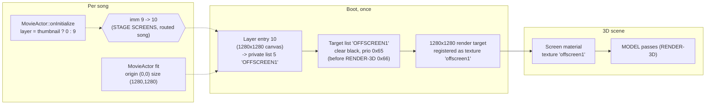

# Detailed Design — Background Movies on the stage screens

Status: Approved 2026-09-23

## 1. Overview

DDR A3 played a song's background movie on the video screens inside ten of its 3D stages (the
`monitor00..03` and `replicant00..05` sets — ENDYMION on `replicant05` is the famous example). The
mechanism is data-driven: the engine keeps a 1280 × 1280 offscreen render target that is published at boot
as the named texture `offscreen1`; the screen meshes of those stages use a material whose texture is named
`offscreen1`, so the model loader binds the render target like any texture; a song whose movie should play
on the screens simply has its movie drawn into that render target instead of onto the screen.

DDR World kept every piece of that chain except the one decision that routes a movie into the offscreen
target. The Background Dancers mod (the revived A3 3D background) therefore shows those stages with black
screens today.

This design adds two values to the mod's GLOBAL SETTINGS row **Background Movies**:

- **STAGE SCREENS** — when the song's stage has screens, the song's movie plays on them (A3's look); when it
  has none, the movie plays as a THUMBNAIL, exactly like the existing default.
- **MOVIE ONLY (NO DANCERS)** — A3's default for an ordinary movie song: while a movie is actually playing,
  the whole 3D scene (stage and dancers) is hidden and the song looks like stock World.

It also keeps screen materials unlit (Lighting Style and outlines never touch them), gives custom stages a
one-line contract for having screens, and converts the shipped Griffin House custom stage so its living-room
TV shows the movie — the proof of concept for custom content.

## 2. Detailed Requirements

Accepted decisions (maintainer approval 2026-09-23), consolidated:

**R1 — Row values.** The Background Movies row offers, in this display order: OFF / THUMBNAIL / STAGE
SCREENS / FULLSCREEN (NO STAGE) / MOVIE ONLY (NO DANCERS). Config spellings `off`, `thumbnail`,
`stage_screens`, `fullscreen`, `movie_only`. The stored row integers of the existing values are unchanged
(0 / 1 / 2); the new values are 3 (STAGE SCREENS) and 4 (MOVIE ONLY). Edits apply from the next song, as
today.

**R2 — Default.** THUMBNAIL stays the default. STAGE SCREENS is a candidate default once it is proven on the
cabinet (a later, separate change).

**R3 — MOVIE ONLY.** The players' VIDEO SIZE is not touched. The 3D scene loads as usual; while the live
song's movie is being drawn (the MovieActor is opening or has really opened, the graph build was real and
nothing suppresses it), every 3D element is published hidden — stage parts, dancers, dancer parts, floor
shadows and every outline twin — and the 2D gameplay background is left to the game. A player with VIDEO
SIZE OFF, a song without a movie, or a movie that is suppressed or faked (SONG SPEED without SYNC BACKGROUND
VIDEO, the non-native "suppress" mode) keeps the dancers.

**R4 — STAGE SCREENS.** At song-window entry, after the stage is picked:
- stage has screens ⇒ every entered side whose VIDEO SIZE shows a movie is written as FULLSCREEN for the song
  (restored at window exit), the movie is routed into the offscreen target, framed with A3's fit, and the
  full scene (stage, dancers, shadows) is shown through the stage's own camera set;
- stage has no screens ⇒ the song behaves exactly as THUMBNAIL.
VIDEO SIZE OFF stays off (the screens stay black). A routed movie that fails to open or is faked draws
nothing — the screens stay black, which is what the thumbnail would have shown too.

**R5 — "Has screens" and the custom-stage contract.** Decided once at mod enable, per distinct stage key,
for stock stages, custom stages and LayeredFS overrides alike: the stage's `mapset_<key>.arc` header lists a
member whose file name is `offscreen1.dds` (case-insensitive). This holds for exactly the ten stock screen
stages. A custom stage opts in by naming its screen image `offscreen1` in Blender; the add-on then names the
KTMDL texture `offscreen1` and writes an `offscreen1.dds` beside the part.

**R6 — Routing.** One byte of game code — the entry index `9` in the MovieActor's layer choice
(`thumbnail ? 0 : 9`) — is rewritten to `10` at window entry for a routed song only, and written back at
window exit and at mod disable. Checked write: the byte must read the expected value first.

**R7 — Framing.** A3's exact result: the movie is contained in the 1280 × 1280 square (aspect preserved,
centred). Achieved by writing the MovieActor's fit rectangle — origin (0, 0), size (1280, 1280) — while the
actor has not started playing (its step ≤ 2), for every MovieActor instance of a routed window. No per-stage
cropping.

**R8 — Unlit screens, always.** In every Background Movies mode and every Lighting Style, a material that
samples the `offscreen1` texture keeps its stock shader and gets no outline records. (Additive / alpha screen
meshes are already exempt through the blend-group rule.)

**R9 — Songs without a movie.** Screen stages show black screens and stay in the random rotation.

**R10 — Griffin House.** The shipped custom stage is re-exported from its Blender source with the TV screen
sampling `offscreen1`; the screen's UVs cover the 16:9 band of the square (u 0 → 1 left to right as seen by
the dancer, v 0.21875 → 0.78125 top to bottom), so a 16:9 movie fills the TV (≈3 % horizontal squeeze onto
the 1.72:1 panel) and a 4:3 movie fills it with 12.5 % cropped top and bottom. Shader stays
`mdl_bg_constant_vc`. The Blender source is saved as a new version (the previous one kept); the now-unused
`lr_screen.dds` leaves the shipped folder.

**R11 — Blender add-on.** The exporter writes a tiny black `offscreen1.dds` placeholder for an image whose
stem folds to `offscreen1` (the game never binds it — the render target owns the name), and the add-on README
documents the convention.

**R12 — Fail-open.** STAGE SCREENS needs the movie-size override, the movie probe and both new signatures;
MOVIE ONLY needs the movie probe; FULLSCREEN keeps its existing rule. A missing dependency degrades the mode
to THUMBNAIL with one WARN per boot per mode. A failed checked write, an unreadable actor or field ⇒ that
song plays as THUMBNAIL or keeps the game's own framing, one WARN — never a crash, never a stuck patch.

**R13 — Diagnostics.** One INFO per song naming the mode, whether the stage has screens and the movie-size
writes; one INFO per framed MovieActor (with the movie's pixel size once known); a one-shot-per-boot INFO of
layer entry 10's state after the first routed registration; one INFO at enable listing the stages with
screens; one INFO per built item that keeps screen materials stock.

**R14 — Previews.** The options-menu stage previews are unchanged (screens black — no movie at song select).

**R15 — Documentation.** `docs/background_dancers_research.md` §8 (mark the proposal implemented, record
deviations), README (Background Movies paragraph + config table), AGENTS.md (Background Dancers row +
`background_dancers` config entry), the add-on README.

**R16 — Validation.** Host tests for every pure addition (`scripts/validate_background_dancers.sh`); the
offline signature sweep `./scripts/validate_signatures.sh` all green on the five supported builds with both
new signatures and their derivations; the add-on's headless test for the placeholder; cabinet checks
(§7.3).

**Assumptions.** A3's mechanism is intact in World (static evidence, Appendix A); the MovieActor, its layer
table and its fit fields are touched only on the game thread; a course keeps one song window across its
stages (the existing FULLSCREEN mode already relies on this); the render target's alias is registered at
boot before any stage arc can load.

## 3. Architecture Overview

### 3.1 The engine chain (unchanged game behaviour, one byte changed)



Stock World: every non-thumbnail movie registers into entry 9 (drawn under the 3D passes — the FULLSCREEN
mode's backdrop). A routed movie registers into entry 10 instead; entry 10's list renders into the render
target at the start of the frame, and the model passes sample it in the same frame.

### 3.2 The mod's per-song flow

```mermaid
sequenceDiagram
  participant SC as Scene callback (25->26)
  participant LC as lifecycle
  participant SR as screen_route
  participant G as Game (DPS / MovieActor)
  participant FR as Frame callback
  SC->>LC: window_entry
  LC->>LC: pick stage; has_screens = table lookup
  LC->>LC: mode = window_mode(degrade(requested), has_screens)
  LC->>SR: arm() -- checked write 09 -> 0A (routed only; failure => THUMBNAIL)
  LC->>G: movie size override (FULLSCREEN for STAGE SCREENS)
  G->>G: DPS step 2: MovieActor created, registers into entry 10
  loop every frame while routed
    FR->>SR: on_frame()
    SR->>G: live MovieActor step <= 2 ? write fit rect
  end
  G->>G: 0x1044 anchor (step 2), 0x1045 fit + play (step 3)
  SC->>LC: window exit
  LC->>SR: disarm() -- checked write 0A -> 09
  LC->>G: restore movie sizes
```

MOVIE ONLY and FULLSCREEN use the existing per-frame backdrop probe inside the scene driver; only the scene
mask they produce differs.

## 4. Components and Interfaces

### 4.1 `src/mods/background_dancers/movie_mode.rs` (pure, host-tested) — extended

- `MovieMode` gains `StageScreens` and `MovieOnly`.
  - `ALL` in display order `[Off, Thumbnail, StageScreens, Fullscreen, MovieOnly]`.
  - `row_value`: Off 0, Thumbnail 1, Fullscreen 2, StageScreens 3, MovieOnly 4; `from_row_value` inverse,
    unknown ⇒ `DEFAULT` (Thumbnail).
  - `key`: `off` / `thumbnail` / `stage_screens` / `fullscreen` / `movie_only`; `parse` also accepts
    `screens`, `monitor`, `monitors` → StageScreens and `no_dancers`, `a3` → MovieOnly.
  - `label`: `STAGE SCREENS`, `MOVIE ONLY (NO DANCERS)` (≤ 24 bytes, as the existing test enforces).
- `size_override(mode, current)`: StageScreens targets `SIZE_FULLSCREEN` (the Fullscreen row of the table);
  MovieOnly returns `None` (never writes). Only ever called with the WINDOW mode (below), so an unrouted
  STAGE SCREENS song arrives here as Thumbnail.
- `Capabilities { movie_size: bool, probe: bool, route: bool }` and
  `degrade(requested, caps) -> MovieMode`: Fullscreen needs `movie_size ∧ probe`; StageScreens needs
  `movie_size ∧ probe ∧ route`; MovieOnly needs `probe`; any miss ⇒ Thumbnail.
- `window_mode(mode, stage_has_screens) -> MovieMode`: StageScreens without screens (or without a stage) ⇒
  Thumbnail; everything else unchanged.
- `routes_to_screens(mode) -> bool` = `mode == StageScreens` (window mode).
- `probes_backdrop(mode) -> bool` = Fullscreen ∨ MovieOnly.
- `SceneMask` gains `dancers: bool` (dancer bodies + their parts; outline twins follow the slot they read);
  constants `ALL`, `DANCERS_ONLY` (existing), `NOTHING` (new).
- `scene_mask(mode, backdrop)`: Fullscreen ∧ backdrop ≠ None ⇒ `DANCERS_ONLY` (unchanged); MovieOnly ∧
  backdrop ≠ None ⇒ `NOTHING`; else `ALL`. `wants_bg_hide(mask)` stays `mask.stage` (NOTHING ⇒ the game's
  own 2D background).
- Screen helpers:
  - `SCREEN_TEXTURE_STEM = "offscreen1"`;
  - `arc_members_have_screen(members: &[String]) -> bool` — any member whose final `/` component equals
    `offscreen1.dds` ignoring ASCII case;
  - `SCREEN_RT_EXTENT: f64 = 1280.0`; `fit_writable(step: i32) -> bool` = step ∈ {0, 1, 2};
  - `RouteImm { ROUTED = 0x0A, STOCK = 0x09 }` and `imm_action(current: u8, want_routed: bool) ->
    ImmAction { Write(u8), Already, Refuse }` — Write only from the other known value, Already when it
    already holds the wanted one, Refuse for anything else.

### 4.2 `src/mods/background_dancers/screen_route.rs` (new, engine-facing)

Owns the one code byte and the fit writes. All functions run on the game thread.

- `init(signatures: &SignatureStore) -> bool` — resolves `movie_layer_select_imm` (address),
  `movie_fit_origin_off`, `movie_fit_size_off` (published values) and, optionally, `layer_table` (diagnostic
  only). Returns availability; one INFO when unavailable.
- `is_available() -> bool` — both signatures resolved.
- `arm() -> bool` — checked write `09 → 0A` (`make_writable` / `restore_protection`, the
  `anytime_speedmod` pattern); sets `ROUTED`, clears the per-window actor memory. `false` + WARN on Refuse.
- `disarm()` — if `ROUTED`: checked write `0A → 09`, clear `ROUTED`. Idempotent. Called from the window-exit
  branch of the scene callback (synchronously, with the movie-size restore) and from mod disable.
- `on_frame()` — O(1) when not routed. Otherwise: `movie_backdrop::live_movie_actor()` → `(actor, step)`;
  when `fit_writable(step)` and the 32 bytes at each field are readable: write f64 `origin.x = 0, origin.y =
  0` at `actor + movie_fit_origin_off`, `size.w = 1280, size.h = 1280` at `actor + movie_fit_size_off`
  (z/depth fields untouched). Logs one INFO per actor pointer (quick restart / course stage ⇒ a new actor),
  including the movie's pixel size once the step is ≥ 1 (f32 at `*(*(actor+0x138)+0x18) + 0x24/+0x28`, read
  through probed pointers; omitted when unreadable). The first time per boot it also logs layer entry 10's
  state from `layer_table` (override pointer, list index, the layer's walk-gate bytes `+0x10/+0x12` and its
  active-node count `+0x3C`, which a routed registration increments).

Called from the mod's frame callback in `mod.rs` (next to `lifecycle::on_frame`), because the scene driver
returns early until the 3D scene is built and the fit must be in place before the movie's step 2 → 3.

### 4.3 `src/mods/background_dancers/movie_backdrop.rs` — one new accessor

`live_movie_actor() -> Option<(*mut u8, i32)>` — the live DancePlaySequence's SceneManageActor child's
MovieActor child and its StackStep, using the existing verified walk (`movie_step` becomes a thin wrapper).
No new offsets.

### 4.4 `src/mods/background_dancers/lifecycle.rs` — window changes

- `Tables` gains `screen_stages: HashSet<String>`, filled at the end of `init_tables` (after the custom plan
  is appended, so custom stages and their mounts are covered): for every distinct stage key,
  `arc_set::resolve_path("data/arc/mapset_<key>.arc")` → `custom_scan::read_arc_members(path)` (made
  `pub(super)`) → `movie_mode::arc_members_have_screen`. One INFO: `stages with screens: …  (n of m)`.
- `window_entry`: while `TABLES` is locked for the pick, read `has_screens` for the picked stage; pass it to
  `apply_movie_mode(has_screens)`.
- `apply_movie_mode(has_screens)`: `requested = style::movie_mode()`;
  `mode = window_mode(degrade(requested, caps), has_screens)` (the existing FULLSCREEN WARN generalises to one
  WARN per degraded mode per boot); latch `WINDOW_MOVIE_MODE`; OFF's suppressor as today; movie-size writes
  from `size_override(mode, …)`. The route is armed BEFORE the movie-size writes: when
  `routes_to_screens(mode)`, `screen_route::arm()`; if that fails the window mode becomes Thumbnail before
  anything is written (a song must never end up as a fullscreen-size movie over a full stage). The per-song
  INFO adds `stage screens: yes/no, routed: yes/no`.
- `restore_movie_mode()` calls `screen_route::disarm()` first (it already runs synchronously in the exit
  branch and in `teardown_on_disable`).
- `drive_live`: the backdrop probe runs when `probes_backdrop(w.movie_mode)` (was: Fullscreen only); the log
  line names the mode. `scene_mask` does the rest. `camera_source` is unchanged (movie cameras only for
  `DANCERS_ONLY`).

### 4.5 `src/mods/background_dancers/director.rs` — honour `mask.dancers`

Dancer bodies and dancer parts are published hidden when `!mask.dancers` (as stage parts already are for
`!mask.stage`); poses keep advancing underneath so the dancers return current (a course stage without a
movie after one with).

### 4.6 `src/mods/background_dancers/style.rs` — row and persistence

The Background Movies row's values/labels come from `MovieMode::ALL` (so the two new entries appear in the
right order automatically); hint rewritten to cover all five values; config parse/persist via
`MovieMode::key/parse` (unknown ⇒ Thumbnail + the existing WARN, message lists all five spellings).

### 4.7 Unlit screens — `src/services/scene3d/render_item_layout.rs` (pure) + `render_item.rs`

- Pure: `materials_sampling(material_tex_indices: &[Vec<u16>], table_hashes: &[u32], target_hash: u32) ->
  Vec<bool>` — material `m` is true when any of its masked slots indexes a table entry whose hash is
  `target_hash` (out-of-range indices ignored).
- `RenderItem::restyle_materials` reads, per private material copy, the masked slot indices (`u16 mat +
  slot*2` under the mask at `mat + 0x14`) and the resource texture table hashes (`res + 0x80`, stride 0x10,
  hash `+0`, count `res + 0x2C` — the layout `resolve_material_textures` already walks), computes
  `materials_sampling(…, fnv1_name_hash("offscreen1"))`, and keeps those materials stock
  (`RestyleStats.kept_screen`, a new counter). Because a hull twin hides every record whose material was not
  restyled, the screen also gets no outline. The rule sits in the shared service, so the options-menu
  previews get it too.
- `session.rs::build_one`: the per-item restyle INFO adds `screen=<n>`; when an item has screen materials,
  one INFO also logs the bound texture's size (`TextureData` u16 `+8/+0xA`) — 1280 × 1280 (or `render_w²`
  under Custom Resolution) confirms the render target, not the placeholder DDS, is what the screen samples.

### 4.8 Signatures — `src/core/signatures.rs` (both optional; never in `required_signatures`)

| Name | Pattern | Derivation / publishes | Identity gates |
|---|---|---|---|
| `movie_layer_select` | `44 38 81 48 01 00 00 B8 09 00 00 00 49 0F 45 C0 48 8D 04 40 48 8B 54 C2 08` | `movie_layer_select_imm` = match + 8 (address) | unique; byte at +8 is `09`; the 7 bytes at match − 0x1B are `48 8B 15 d32` and decode to `layer_table` when that is resolved (in-module otherwise); `C7 40 0C FF FF FF 7F` (the draw-priority store) at match − 0x11 |
| `movie_actor_fit_case` | `83 7C C1 58 02 0F 85 ?? ?? ?? ?? 0F 10 81 ?? ?? ?? ?? F2 0F 10 89 ?? ?? ?? ?? 4C 8D 44 24 20 48 8D 54 24 40 0F 29 44 24 20 0F 10 81 ?? ?? ?? ?? F2 0F 11 4C 24 30 F2 0F 10 89 ?? ?? ?? ??` | `movie_fit_origin_off` = d32 @ +14, `movie_fit_size_off` = d32 @ +43 (published values) | unique; d32 @ +22 == origin + 0x10; d32 @ +57 == size + 0x10; both offsets < 0x150 (the MovieActor's allocation size); the literal `58` / `02` in the pattern pin the StackStep base the probe uses and the step-2 gate |

Both are resolved by one derivation `derive_movie_screen_route` (all-or-nothing for the pair; a failure
leaves neither published). Expected values on every supported build: origin `0x108`, size `0x120`.

### 4.9 Blender add-on — `tools/blender_ddr_addon/`

- `export_model.write_textures_for`: when the stem folds (lower-case, `_` removed) to `offscreen1`, write an
  8 × 8 opaque-black A8R8G8B8 DDS (`ktmdl.write_dds_a8r8g8b8`) instead of the Blender image.
- `tests/synthetic_test.py`: export a quad whose image is named `offscreen1`; assert the model's texture name
  is `offscreen1` and the DDS header reads 8 × 8.
- README: a "Stage screens" section — name the screen image `offscreen1`; unlit `*_constant_vc` shader;
  UVs in D3D top-down space span the part of the 1280 × 1280 square the movie occupies (16:9 movie: v
  0.21875–0.78125, 4:3: 0.125–0.875, square: 0–1); the image pixels are never used in game.

### 4.10 Griffin House conversion (content, outside the DLL)

A script in the maintainer's Blender project (not in this repository) opens the current room `.blend`, and:
1. renames the `TVScreenShot` material's image to `offscreen1` (replacing its pixels with a Blender-only
   preview: the previous screenshot letterboxed into the 16:9 band of a square image, so the Blender viewport
   shows what a 16:9 movie will look like);
2. rewrites the two screen quads' UVs: `u = (x1 − x)/(x1 − x0)` (the existing unmirrored-as-seen-by-the-dancer
   rule), `v_blender = 0.21875 + 0.5625 · (z − z0)/(z1 − z0)` (the exporter's `1 − v` turns it into the D3D
   band 0.21875 at the top → 0.78125 at the bottom);
3. saves a new version of the `.blend` and exports the room with the add-on (write_textures on), verifying
   with the KTMDL parser that mesh 11 samples `offscreen1`, uses `mdl_bg_constant_vc` and that the round trip
   is byte-identical;
4. renders a Blender check image of the TV.

The export replaces `data_mods/custom_models/stages/Griffin House/mapset_griffin00/gm_griffin00_room/`'s
`.model`, `.b2it`, `.grp2it` and DDS files, adds `offscreen1.dds` and removes `lr_screen.dds`. The stage's
cache arc repacks itself on the next boot (fingerprint of member paths + mtimes).

## 5. Data Models

- **Config** `background_dancers.movie_mode`: string, one of `off`, `thumbnail` (default), `stage_screens`,
  `fullscreen`, `movie_only`. Written WHOLE with the section on every row edit (existing behaviour).
- **Row integers** (in-memory latches `LIVE_MOVIE_MODE` / `WINDOW_MOVIE_MODE`): 0 OFF, 1 THUMBNAIL, 2
  FULLSCREEN, 3 STAGE SCREENS, 4 MOVIE ONLY.
- **MovieActor fit fields** (World, all builds): origin `f64 x @ +0x108, y @ +0x110, z @ +0x118`; size
  `f64 w @ +0x120, h @ +0x128, d @ +0x130`; StackStep `i32 @ +0x58 + idx·8`, `u16 idx @ +0x82`; the Movie
  wrapper `@ +0x138` → impl `@ +0x18` → movie pixel size `f32 @ +0x24 / +0x28`.
- **Layer table entry** (stride 0x18): override command list `+0x00`, layer object `+0x08`, list index
  `+0x10`; entry 10 at `+0xF0`. Layer object (ScreenRoot): walk gate bytes `+0x10` (must be 0) / `+0x12`
  (must be ≠ 0), active node count `+0x3C`.
- **`TextureData`**: `u32 hash @ +0`, `u32 handle @ +4`, `u16 w @ +8`, `u16 h @ +0xA`.
- **Texture name hash**: FNV-1 32 over the folded name (`src/services/scene3d/pure.rs::fnv1_name_hash`;
  `offscreen1` is already folded).
- **Stage screens set**: `HashSet<String>` of stage keys, built once per enable, read under the `TABLES` lock
  at window entry.

## 6. Error Handling

| Failure | Detection | Behaviour |
|---|---|---|
| `movie_layer_select` / `movie_actor_fit_case` missing or gate fails | derivation | neither published; STAGE SCREENS ⇒ THUMBNAIL, one WARN per boot |
| movie-size override or movie probe unavailable | existing `is_available` | STAGE SCREENS / MOVIE ONLY (and FULLSCREEN) ⇒ THUMBNAIL, one WARN per boot per mode |
| imm byte not `09` at arm | `imm_action` = Refuse | no write, WARN; the song's window mode becomes THUMBNAIL before any movie-size write |
| imm byte not `0A` at disarm | `imm_action` = Refuse | no write, WARN (someone else patched it; never write over unknown bytes) |
| stage arc header unreadable at enable | `read_arc_members` = None | stage counted as no screens (INFO lists it) |
| MovieActor not found / step unreadable / fields unreadable | probes | no write that frame; if the actor starts playing unframed, one WARN (the movie keeps the stock fullscreen rect inside the square) |
| movie faked, suppressed or failed while routed | — | screens stay black; nothing to recover |
| mod disabled mid-song | `teardown_on_disable` | disarm (byte back to `09`), movie sizes restored, scene neutralised as today |
| screen material has no masked slot / bad index | `materials_sampling` ignores out-of-range | material treated as non-screen |

Every write is on the game thread, every pointer read out of a game object is probed (`memory::is_readable`)
before use, and no callback can panic across FFI (no `unwrap` / indexing on engine data).

## 7. Testing Strategy

### 7.1 Host tests (`scripts/validate_background_dancers.sh`, existing temp-crate harness)

- `movie_mode.rs`: row/key/label round trips for all five modes, the display order, legacy spellings;
  `size_override` table for the new modes; `degrade` truth table; `window_mode` (screens / no screens / no
  stage); `scene_mask` + `wants_bg_hide` for MovieOnly; `probes_backdrop`; `arc_members_have_screen` on the
  stock member lists (screen stage, non-screen stage, case variants, a directory named `offscreen1.dds/`
  prefix, empty); `fit_writable`; `imm_action` all cases.
- `render_item_layout.rs` (already mounted): `materials_sampling` — single slot, multi-slot, no mask, index
  out of range, several materials, a hash that appears twice in the table.
- `director.rs` is engine-facing; its mask use is covered by the `scene_mask` tests plus the cabinet run.

### 7.2 Offline signature sweep

`./scripts/validate_signatures.sh <directory holding the five gamemdx builds>` — both new names resolve on 20250805 / 20260224 /
20260721 / 20260825 / 20260915 with origin 0x108 / size 0x120 / imm `09`, and `scripts/sig_harness/
shape_diff.py` reports no divergence inside the bytes the consumers read. Blender add-on:
`scripts/validate_blender_addon.sh <unpacked A3 data root>` (synthetic test includes the placeholder).

### 7.3 Cabinet checks (the only runtime validation)

1. STAGE SCREENS, a movie song on a monitor/replicant stage (pin with `DDR_DANCERS_PIN`): movie on every
   screen, contained in the square; INFO shows the imm write, the framed actor, entry 10's node count ≥ 1,
   and the screen material's texture 1280 × 1280.
2. ENDYMION on `replicant05` fills the square screens; a 4:3 song on `monitor00` fills its screen.
3. STAGE SCREENS on a stage without screens ⇒ thumbnail, byte never written.
4. Griffin House with a 16:9 and a 4:3 movie: the TV shows it, unmirrored, upright.
5. MOVIE ONLY: movie song ⇒ stock World look (no 3D, 2D background); non-movie song ⇒ dancers; VIDEO SIZE
   OFF ⇒ dancers.
6. Lighting Style CEL + outlines on a screen stage: screens unlit, no outline around the screen quads.
7. Quick restart and a course on a screen stage (a new MovieActor each time is framed); training-mode seek.
8. Mod disable mid-song, then song select: byte back to `09`, next song stock.
9. Custom Resolution 1080p: same framing.

## Appendix A — RE evidence (static; A3 `gamemdx_20240402`, World 20260825 unless noted)

- A3 route: `SceneManageActor::onInitialize` (`FUN_180060090`) sets the monitor flag = movie type 3; the
  MovieActor registers into `layer_table[flag ? 10 : 9]` (`FUN_18005f960`); per-frame fit
  `FUN_18005f9f0(this, 1280, 1280, 1280, 1280)` for monitor movies. The 43 type-3 songs pair with the ten
  screen stages through `<bgstage>`; World keeps `<movie>3` on the same songs but has no `<bgstage>`.
- World route: `FUN_18007cf90` — `CMP byte [RCX+0x148],R8B ; MOV EAX,9 ; CMOVNZ RAX,R8` (thumbnail ⇒ 0,
  else 9). Entry 10 is never selected; the only fixed-index use of entry 10 is its own construction in
  `FUN_18002aab0`, which gives it a 1280 × 1280 canvas (`MOVSS xmm6,[1280.0]` passed as both extents) and a
  ScreenRoot (`FUN_180217df0`) whose walk gate is open by default (`+0x10 = 0`, `+0x12 = 1`).
- Render target: display ctor `FUN_1801f10e0` — `create(0x500, 0x500, A8R8G8B8)` → view → registered
  `"OFFSCREEN1"`; render-graph boot `FUN_1801f2c30` registers the alias `"offscreen1"` and attaches the
  OFFSCREEN1 ScreenCommandList viewport into the OFFSCREEN1 target list (prio 0x65, colour clear
  `0xFF000000` every frame). Name registration `FUN_1802036d0`: first registration of a folded name wins
  (later ones only bump a refcount), and a new name is pushed into the gs texture registry the model
  converter searches — so a material named `offscreen1` binds the render target at model conversion.
- Fit: `FUN_18007d250` case `0x1045`, gated on step == 2, calls `FUN_18007d030(this, &size@+0x120,
  &origin@+0x108)`: `s = min(w/mw, h/mh)`, position `origin + (size − movie·s)/2`. Fields written only by the
  ctor `FUN_18007c960`.
- Byte-identity: both patterns unique and identical on all five supported builds (one-off capstone sweep):
  layer select at `0x1800792a2` / `0x1800783e2` / `0x18007cbd2` / `0x18007cfb2` / `0x18007d122`, fit case at
  `0x180079570` / `0x1800786b0` / `0x18007cea0` / `0x18007d280` / `0x18007d3f0` (20250805 / 20260224 /
  20260721 / 20260825 / 20260915).
- Stage data: exactly the ten screen stages carry an `offscreen1`-textured material and one placeholder
  `offscreen1.dds` (identical 512 × 512 bytes); every screen shader is an unlit `*_constant_vc`. Screen UV
  bands: monitor00 v 0.125–0.874 (4:3), monitor01 0.200–0.800, monitor02/03 0.130–0.857 and 0.254–0.747,
  replicant 0.01–0.99 (square). Stock UVs are unmirrored D3D (u right, v down as seen by the camera).

## Appendix B — Alternatives considered

- **Routing by data instead of code**: swapping layer-table entries 9 and 10 (a write into a table the
  dispatcher walks every frame, and it would also move every FULLSCREEN movie); relinking the movie's render
  node from entry 9 to entry 10 after registration (intrusive surgery on the node pool). The one-byte patch is
  read once per song on the game thread and is trivially restored.
- **Detecting screens by parsing `.model` texture tables**: correct but the parse thread finishes after the
  route must be decided; the header test is equivalent on all stock data and on add-on exports.
- **A per-stage "cover" fit** (crop the movie to fill each screen band): ill-defined for stages with two
  different screen shapes and not what A3 did.
- **MOVIE ONLY decided from the music database at window entry**: would skip the scene load, but a movie that
  then fails to draw would leave a blank background; the live probe is already proven by FULLSCREEN mode.
- **Exempting screens from restyle only in STAGE SCREENS**: needless coupling — a black surface looks the same
  either way and the rule then has one case.
