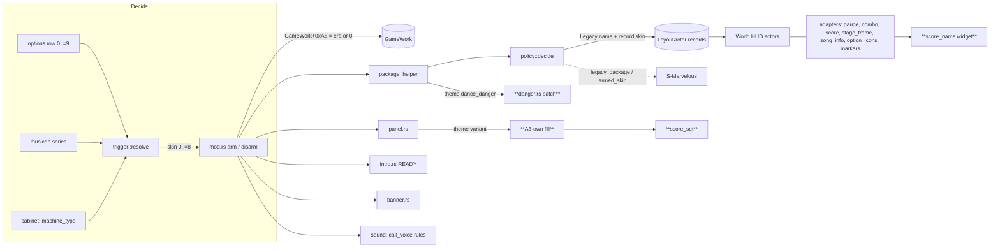

# DDR SELECTION — DDR A / DDR A3 (White) / DDR A3 (Gold) themes — Detailed Design

Status: Approved 2026-09-25

Addresses are file-relative to `0x180000000`. "A3" = DDR A3 final (`gamemdx_20240402`); "World" =
DDR World (addresses from 20260825 unless stated). Paths are repository-relative.

---

## 1. Overview

DDR SELECTION (`src/mods/ddr_selection/`, mod id `ddr-selection`) replays a song with the gameplay
UI of an older DDR release. It ships five **eras** (1st-5th … 2013-A) that re-host A3's legacy
`…000N` skin packages on World's own HUD actors.

This project adds three **themes**, the A-series UI generations the stock World install still
carries under A3's skin-0 package names:

| Theme | What it is | Package suffix |
|---|---|---|
| **DDR A** | The DDR A generation (blue chevron gauge, heavy rounded fonts, 2016–2018 IFS dates, no FLARE art) | `_v0` |
| **DDR A3 (White)** | A3's own UI on every non-gold cabinet (silver frames, teal shutter) | `_v2` |
| **DDR A3 (Gold)** | A3's own UI on the gold cabinet (gold frames, purple shutter) | `_v1` |

`_v1` = gold rests on two facts:

- A3's arc probe starts at `_v1` exactly on cabinet classes 6 / 7, which are machine type 4, the
  gold cabinet. The same class test picks `ddra3_bg_gold`.
- Only `dance_common0000_v1` carries the BPL `matching_*` markers, a gold-cabinet feature.

Every theme file ships in stock World, byte-identical to A3's install. Nothing is imported.

The themes are cheaper than the eras were:

- A3's own packages already satisfy every existing adapter's export / label / child contract.
- World kept A3's skin-0 branches.
- Most surfaces reduce to a package name plus "A3 skin 0" parameters that the adapters already
  implement for some era.

Four pieces are genuinely new:

1. A3's **skin-0 stage-panel fill**.
2. The panel's **per-player score sets**.
3. A **gameplay player-name** text widget.
4. A **2-byte scoped patch** so doubles gets the doubles danger clip.

S-Marvelous support comes last.

---

## 2. Detailed Requirements

### 2.1 Vocabulary

- **Skin**: DDR SELECTION's internal look id. 0 = World. **Era** = skins 1..=5. **Theme** = skins
  6..=8. "Legacy" below means any skin 1..=8.
- **Record skin**: the `int` at `+0x28` of a `LayoutActor` package record. World's HUD actors
  branch on it.
- **Suffix** `vN`: a theme's package generation (`_v0`, `_v2`, `_v1`).

### 2.2 Requirements

**Selection and identity**

- **R1 (D1): row values.** The per-player DDR SELECTION row gains three appended values. Values
  0..=6 keep their meaning; value 6 is already relabelled `2013-2014`:

  | Row value | Label (≤ 15 bytes) | Skin |
  |---|---|---|
  | 7 | `DDR A` | 6 |
  | 8 | `DDR A3 (White)` | 7 |
  | 9 | `DDR A3 (Gold)` | 8 |

  - The row still maps value → skin as `value − 1`.
  - A cached 7..=9 read by an older DLL clamps to OFF.
- **R2 (D2): theme identity in the engine.**
  - A theme's packages are registered with record skin 6 / 7 / 8, the "neutral" class. World's
    record-skin readers are all compares, so ≥ 6 lands on World's skin-0 branches, applied to the
    theme's own packages (§3.3).
  - `GameWork+0xA8` is written **0** for a theme:
    - World's DPS `int[6]` table forbids ≥ 6;
    - 1 would trigger World's three `== 1` gates, which hide song info and option icons;
    - nothing else reads the field once a skin is armed.
- **R3 (D3–D5): AUTO.**

  | Series | AUTO result |
  |---|---|
  | 14–16 | `2013-2014` (skin 5) |
  | 17 (DDR A) | **DDR A** |
  | 18 (A20), 19 (A20 PLUS), 20 (A3) | DDR A3: **Gold** when `arkMDXGetMachineType` reports 4, else **White** |
  | 21 (World) and above, 0, custom series | World's UI |

  - The machine-type read honours the SMX GOLD force, which is a detour on the same export.
  - An unreadable machine type ⇒ White.
  - Explicit row values always win over AUTO.

**Before and after the song**

- **R4 (D6, D9): no era cut-in, no `_sel` movies** for the themes. The five eras keep both, and the
  Era Cut-In setting still applies to them only.
- **R5 (D7): stage panel.** Before a theme song, A3's skin-0 panel shows in World's ShutterActor
  stage kind:
  - **Root:** the theme's own `common_choice_vN` / `shutter_choice_hd_root`.
  - **Band:** `choice_stage_usr2` is hidden. The band texture is written to the root's **own**
    `choice_stage_usr/scene_choice_stage_usr`: `scene_choice_stage_{1st, 2nd, 3rd, 4th, final,
    extra}`.
    - Rule (A3 `FUN_180030d10`): extra stage → `extra`; else final stage → `final`; else stage
      index 3 / 2 / 1 → `4th` / `3rd` / `2nd`; else `1st`.
    - A3's event-only special stages (the final-stage-override stage itself, or past `max + 1`)
      show `extra`.
  - **Background and frame:** the root's default background and jacket frame, with the song's
    jacket in the frame.
  - **Stage call:** `vo_stage_{NN, final, extra}` (the skins 4–5 rule), played at once rather than
    at a `voice` label.
  - `caution_usr` and `fullcombo_challenge_usr` stay hidden.
- **R6 (D13, D23–D26): score sets.** On the theme panel, each entered side's `pN_score_set_mc`
  shows A3's contents, filled from World's records:
  - **High-score set:** difficulty, dancer name, 7-digit best score, rank, full-combo mark, area.
  - **Target set:** the target's name, area, score, rank and full-combo mark, for World's own
    target selection. It is hidden wherever World's own panel would show no target.
  - **Every field fails open to hidden.** The eras keep both sets hidden.
- **R7 (D8): end banners.** The song ends on `common_shutter_vN`'s CLEARED / FAILED. Tohoku
  EVOLVED (mcode 37789) gets PRAY FOR ALL on all three themes.

**During the song**

- **R8 (D15): HUD.** A3 skin-0 rules on the existing adapters:

  | Element | Behaviour on a theme |
  |---|---|
  | Judge words, FAST / SLOW, full combo | Whole-package swaps |
  | Game over, danger, pacemaker | Whole-package swaps of the `_v0` copies (A3 used those on every cabinet) |
  | Life gauge | `00_dance_gauge`; P2 mirrored; segmented, 26 cells × 17 px plus a partial cell (A3's "skins 0 / 5" fill); continuous in every FLARE state; eased; rainbow at full lives; no intro |
  | Combo | Standard growth, full cells, one sheet per worst grade |
  | Score | Level-texture difficulty scheme at priority 7; A3's digits, grey leading zeros and commas; EX indicator |
  | Stage frame | `stage_frame0000_stage_*` |
  | Song info | A3's panel (`dance_song_info0000_vN`) |
  | Option icons | A3's (`dance_option_icon0000_v0`) |
  | Layout | `dance_common0000_vN` through the markers post-pass |
  | World's own BPM display and `dance_name` element | Hidden (their markers parked off screen) |
  | Hit flash, lane filter, cover, measure | World's |

- **R9 (D12, D21, D22): gameplay player name.** On a theme, each side's difficulty frame shows the
  dancer name A3's way:
  - an `agcs::BmpString` in font 6 (`2d_font_player`);
  - A3's colour, scale and placement, bound to the frame's `name_usr` placeholder;
  - text from World's rule: the profile name `*PlayerWork+0xC`; else `PLAYER1` / `PLAYER2` for an
    entered side with no name; else `PLAYER`. A multiplayer-bot side shows whatever its
    `PlayerWork` yields, as World's own HUD would.

  The eras never show a name.
- **R10 (D10): danger on doubles.** On a theme, doubles shows `danger_double`. World's actor gets it
  from a scoped 2-byte patch that is live only while a theme's `dance_danger` is registered. The
  second danger clip World's skin-0 path creates is dead in both games and is not reproduced.
- **R11 (D16): announcer and crowd.** A3's skin-0 column:
  - combo callouts and state voices as skins 4–5;
  - crowd, when due:

    | Gauge `g` and combo `c` | Crowd plays |
    |---|---|
    | `g > 0.7` | `STG_APP02` + `vo_ingame_cheer` (guarded) |
    | `g ≤ 0.4 ∧ c < 13 ∧ g < 0.2` | `STG_BOO` + `vo_ingame_boo` (guarded) |
    | `g ≤ 0.4 ∧ c < 13 ∧ g ≥ 0.2` | nothing |
    | otherwise | `STG_APP03` + `vo_ingame_cheer` (guarded) |

  Every cue is already in the `dsel` era bank.
- **R12 (D17): intro.** READY from `dance_message_vN`, requested by its explicit name; its clips'
  own sounds (`vo_ingame_ready`); no HERE WE GO voice from code.
- **R13 (D11): S-Marvelous.** With S-Marvelous Judgement on, the themes get their S-Marvelous in
  their own style:
  - a violet MARVELOUS word;
  - a violet S-MFC splash;
  - a violet combo sheet on an all-S-Marvelous combo (the themes are per-grade-sheet skins).

  White and Gold share one generated art set (their judge / combo / full-combo textures are
  pixel-identical); DDR A has its own. Without art, S-Marvelous stands down on a theme (plain
  Marvelous), exactly as today.

**Names and knobs**

- **R14 (D18):** `policy::skin_name` (logs) matches the row labels. README, the option preview text
  (`scripts/option_strings.py`, regenerated) and module docs are updated. The developer knob
  `DDR_SELECTION_FORCE` accepts 1..=8.

### 2.3 Scope exclusions (D14, D19)

- The eras' shared A3 pieces (panel root, skins 3–5 song info, skin-1 layout root) stay on `_v2`
  even on a gold cabinet.
- SD-cabinet (`_sd`) variants are not ported (World always creates the HD exports).
- Courses and event chains stay stock: the existing mode refusal applies to the themes unchanged.
- No new import-manifest entries.
- No menu theming (A3's `ddra3_bg*` menu movies are out of scope).

### 2.4 Assumptions the design rests on

- **AS1 (D20): no texture bleed across generations.** BM2D texture names do not bleed across
  packages when two generations with identical texture names load in consecutive songs.
  - `libafputils` allocates each IFS's texture records under its package id, which suggests
    per-package storage, but the name lookup is not traced.
  - Shared names: `dance_judge0000_*`, `stage_frame0000_*` (also in skin 1's stage-frame package),
    `dance_song_info0000_*` (also in skins 3–5's panel), `scene_choice_stage_*` (all three
    `common_choice_vN`).
  - **Plan Step 1 is a cabinet spike that tests this before anything else lands.** A failure stops
    implementation and reopens this design (§6.3).
- **AS2: DDR A behaves like A3 skin 0.** DDR A's binary is unavailable, so the DDR A theme uses A3's
  skin-0 rules on `_v0` art. `_v0` has the same exports and children as `_v1` / `_v2`; its gauge
  lacks FLARE labels, which is the eras' existing situation.
- **AS3: font 6 is resident in gameplay.** World keeps font 6 (`2d_font_player`) resident during
  gameplay, or can be made to. If not, the name stays hidden (§6).

---

## 3. Architecture Overview

### 3.1 Where the themes plug in

The themes add no new pipeline. They add table rows, match arms and four new components (bold
below) to the existing DDR SELECTION flow.



### 3.2 One theme song, end to end

```mermaid
sequenceDiagram
  participant SS as Song select (25)
  participant SA as ShutterActor (kind 3)
  participant M as mod.rs
  participant LA as LayoutActor + HUD
  participant CM as ControlMessage (READY)
  SS->>SA: confirm → stage-panel request
  SA->>M: panel request: resolve skin from the wheel highlight (trigger + cabinet)
  M->>SA: session (theme): row patch → common_choice_vN, score-set tickets
  SA->>SA: World's kind-3 fill runs on A3's root, then the A3-own fill + score sets + stage call
  SS->>M: 25 → 26 play edge: arm(skin 6..=8), GameWork+0xA8 = 0
  LA->>M: per-package helper → theme arcs, record skin 6..=8 (danger patch before dance_danger)
  LA->>LA: HUD actors init (adapters); score init → name widget bound to name_usr
  CM->>SA: READY → panel closed (0x100c); legacy READY clip plays
  LA->>SA: song end → CLEARED / FAILED from common_shutter_vN
  M->>M: leave the window → disarm: restore patches, hide name widgets
```

### 3.3 Why a record skin ≥ 6 is the right engine class

Each World HUD actor reads the record of its own package, so the value can be chosen per package.
For a record skin ≥ 6 the verified branches are:

| World actor (20260825) | Stock skin 0 | Record skin ≥ 6 |
|---|---|---|
| Percent gauge `FUN_180073cf0` / `FUN_1800743d0` | Eased, no intro | Same |
| LIFE gauge `FUN_1800706e0` | Rainbow at full lives | Same |
| StageFrame `FUN_18007a190` / SongInfo `FUN_180078fd0` | The stage loader's package, i.e. **World's** art | The record's package: the theme's art (why skin 0 itself cannot be used) |
| DanceDanger `FUN_180068ce0` | `filter` marker, layer 0 / prio 6; `danger_double` on doubles | `filter` marker, layer 0 / prio 6; **`danger_single` always** → closed by R10's patch |

---

## 4. Components and Interfaces

All pure decision code stays in `crate::`-free files mounted by `scripts/validate_ddr_selection.sh`
(or `scripts/validate_s_marvelous.sh`). Engine code keeps the mod's invariants unchanged:

- scoped patches;
- layer-before-package;
- game-thread-only engine access;
- fail-open per surface;
- no panics across FFI.

### 4.1 Trigger and AUTO (`trigger.rs`, pure)

- `ROW_MAX = 9`; `row_label` gains 7..=9; `clamp_row` follows.
- `Inputs` gains `gold_cabinet: bool` (caller: machine type == 4; `false` when unreadable).
- `auto_skin(series, gold_cabinet)`:

  | Series | Skin |
  |---|---|
  | 1–5 | 1 |
  | 6–8 | 2 |
  | 9–10 | 3 |
  | 11–13 | 4 |
  | 14–16 | 5 |
  | 17 | 6 |
  | 18–20 | `gold_cabinet ? 8 : 7` |
  | otherwise | 0 |

- The dev-knob range becomes `1..=SKIN_MAX` (8). `Resolution.skin` is documented as 0..=8.
- Only AUTO consults `gold_cabinet`. Explicit value 8 / 9 is always White / Gold.

### 4.2 Cabinet read (`src/services/cabinet.rs`, new; small)

- `machine_type() -> Option<i32>`: calls the ark export `arkMDXGetMachineType` on every call (cheap).
  A later-installed SMX GOLD detour is therefore honoured.
- It is promoted from `custom_resolution/debug_ui.rs` (`resolve_ark_module` /
  `resolve_machine_type`), which becomes its second caller (AGENTS rule: a shared primitive at two
  call sites). `debug_ui.rs` keeps its own cache on top.
- `resolve_song` in `mod.rs` passes `gold_cabinet = machine_type() == Some(4)` into the trigger,
  only when the governing row is AUTO.

### 4.3 Policy (`policy.rs`, pure)

**Constants and helpers**

- `SKIN_MAX = 8`; `ERA_MAX = 5`.
- `is_era(skin)`, `is_theme(skin)`.
- `theme(skin) -> Option<Theme>`. `Theme` is defined in §5.2.
- `tex_number(skin) -> u8`: 1..=5 → itself, 6..=8 → 0. This is the `%04d` inside A3 texture names:
  `dance_combo0000_*`, `dance_score0000_*`, `stage_frame0000_stage_*`.
- `engine_skin(skin) -> u8`: the `GameWork+0xA8` value (era → itself, theme → 0).
- `skin_name(skin)`: the row labels (`1stMIX-5thMIX`, `MAX-EXTREME`, `SuperNOVA 1-2`,
  `X-X3 vs 2ndMIX`, `2013-2014`, `DDR A`, `DDR A3 (White)`, `DDR A3 (Gold)`). A harness test keeps
  it equal to `trigger::row_label(skin + 1)`.

**Table changes**

- `Entry.skins` widens to `u16`.
- `Entry.fixed_arc: Option<&str>` becomes `Entry.naming: Naming` (§5.3):
  - `Suffixed`: `<arc_base>%04d`, the eras;
  - `Fixed(name)`: A3 skin-0 art by full name, the eras' three existing rows;
  - `Theme(ThemeArc)`: the theme's name, computed from the theme suffix.
- `decide` returns `Legacy { arc_base, skin, naming }`. A single
  `package_name(base, arc_base, skin, naming) -> String` builds every name. The package helper,
  `intro.rs` and S-Marvelous all use it, so the helper has one source of truth.
- The existing `TABLE` rows keep their era skin masks. Theme rows are appended with `skins =
  THEMES` (bits 6..=8):

| World base | Theme package | `ThemeArc` | Adapter |
|---|---|---|---|
| `dance_judge` | `dance_judge0000_vN` | `Own` | None |
| `dance_fast_slow` | `dance_fast_slow0000_vN` | `Own` | None |
| `dance_fullcombo` | `dance_fullcombo0000_vN` | `Own` | None |
| `dance_game_over` | `dance_game_over0000_v0` | `V0` | None |
| `dance_danger` | `dance_danger0000_v0` | `V0` | None (skin-0 placement at `filter`; §4.12 adds doubles) |
| `dance_gauge` | `dance_gauge0000_vN` | `Own` | Gauge |
| `dance_combo` | `dance_combo0000_vN` | `Own` | Combo |
| `dance_score` | `dance_score0000_vN` | `Own` | Score |
| `dance_stage` | `dance_stage_frame0000_vN` | `Own` | StageFrame |
| `dance_song_info` | `dance_song_info0000_vN` | `Own` | SongInfoPanel |
| `dance_score_compare` | `dance_score_compare0000_v0` | `V0` | None |
| `dance_option` | `dance_option_icon0000_v0` | `V0` | OptionIcons |
| `dance_message` | `dance_message_vN` | `Message` | ReadyGo |

These bases are never swapped:

- `dance_common`: the layout root reaches the markers post-pass by name instead, see §4.5.
- `dance_effect`, `dance_filter`, `dance_cover`, `dance_measure`, `dance_bpm`: World's actors ask
  for export names the theme packages do not carry (a missing export NULL-derefs the actor).

Naming rules (`ThemeArc`):

| `ThemeArc` | Name |
|---|---|
| `Own` | `<arc_base>0000<suffix>` |
| `V0` | `<arc_base>0000_v0` |
| `Message` | `<arc_base><suffix>` |

- Every theme name carries an explicit `_vN`. World's probe (`_v3`, `_v0`, `_lite`, bare) reaches
  `_v1` / `_v2` and explicit names only through its bare rung, and a bare `<base>0000` must never be
  produced.
- The existing "no bare `0000`" test extends to theme rows.

### 4.4 Arm / disarm (`mod.rs`)

- `arm` writes `policy::engine_skin(skin)` to `GameWork+0xA8`. `ARMED_SKIN` keeps the real skin
  (6..=8), which is the identity every surface reads.
- `configure_dev_knob` accepts `1..=SKIN_MAX`; its WARN text changes to match.
- `movie_sel` plans `_sel` movies only when `policy::is_era(armed_skin())`.
- `options_force` (skin 1 only) and `code_se` need no change. `code_se` follows the legacy package
  mask, so the full-combo `XAC_full_combo2` flip applies to the theme full combo unchanged.
- Log strings and the module doc name the themes (R14).

### 4.5 HUD adapters (range widening and theme arms)

Every adapter that reads an actor's record skin and checks `1..=5` widens to
`1..=policy::SKIN_MAX`. Texture prefixes switch to `policy::tex_number`.

| Module | Change |
|---|---|
| `gauge.rs` / `gauge_math.rs` | `legacy_actor` range 1..=8. `fill_mode`: an explicit arm for 6..=8 = `Segmented { 26, 17.0, partial: true }` outside FLARE labels (today's `else` branch made explicit and tested). The export switch, P2 mirror and eased value are unchanged |
| `combo.rs` / `combo_math.rs` | `PACKAGE_STATE` sized `SKIN_MAX + 1`. `package_usable(skin)` checks the policy's own package name (the theme arc is never blanked; the check stays generic). `single_sheet` stays `1..=3`, so themes are per-grade. `sheet_prefix` uses `tex_number` → `dance_combo0000[_<grade>]`. Growth and cell width take the non-skin-1 paths |
| `score.rs` / `score_math.rs` | Range 1..=8. `difficulty_writes`, `digit_writes` and the comma names use `tex_number` → `dance_score0000_*`. Priority 7 (non-skin-2). The `dance_name` stand-in export is unchanged (World's own name clip stays hidden). The init POST hands the created difficulty clip to §4.11 |
| `stage_frame.rs` | Near-buffer prefix slots for skins 1..=8 (stride 0x20; slot 8 at +0x100; the rel32 reach check covers the last slot). `prefix(skin)` = `stage_frame{tex_number:04}_stage_` (22 chars, so `PREFIX_LEN` is unchanged). `apply` accepts 1..=8 |
| `song_info_logic.rs` | `mode_for_skin(6..=8) = Panel` (same SongInfoChild patches; the package is the theme's `dance_song_info0000_vN`) |
| `option_icons.rs` | `legacy_skin` accepts 2..=8 |
| `marker_keys.rs` / `markers.rs` | `root_name(6..=8)` = `dance_common0000<suffix>` (queued on the load list next to World's root, as for the eras). `HIDDEN_KEYS` (`bpm`, `name`) apply unchanged |

### 4.6 Intro (`intro.rs`)

- `create_session` takes the package name from `policy::package_name(...)`, which yields
  `dance_message_vN` for a theme. It no longer calls `legacy_name` itself.
- `here_voice` already returns `None` for any skin ≠ 1.
- The rest (World panel dismissal, READY? dwell skip, clip life) is unchanged.

### 4.7 Sound (`sound/rules.rs`, pure)

- `step` accepts 1..=8. Themes take `a3_voice` (already true for skins ≥ 4): combo tables and state
  voices as skins 4–5.
- A theme crowd arm implements R11's skin-0 column. The per-frame `plays` array grows from 3 to 4
  slots:
  - combo;
  - state voice;
  - crowd SE;
  - crowd voice, guarded by the same stored handle as the state voice, per A3's transcription.
- `all_cues()` gains `STG_BOO`, `vo_ingame_cheer` and `vo_ingame_boo`. They are already in the bank
  manifest (`sound/cues.rs`); the existing "bank holds every rule cue" check keeps that true.
- `panel_logic::stage_voice` gives themes the skins 4–5 `vo_stage_*` branch.

### 4.8 End banners (`banner.rs` / `banner_logic.rs`)

- `PACKAGES` becomes one static entry per skin 1..=8: `common_shutter0001..5`, then
  `common_shutter_v0`, `common_shutter_v2`, `common_shutter_v1`. The loader keeps the row
  pointers, so the strings are static.
- `art` / `package` accept 1..=8.
- `has_pray_for_all(skin)` = `skin == 4 || is_theme(skin)`. All three theme `00_prayforall` clips
  have art.
- Everything else (row patch, overlay life, release margin) is unchanged. The theme clips' own
  cues (`se_shutter_in/out`, `STG_APP02/03`, `vo_stage_clear`) play through the AFP sound route
  from the era bank.

### 4.9 Stage panel: theme variant (`panel.rs` / `panel_logic.rs`)

**The theme variant**

- `panel_logic` gains `Variant::{Era(Packages), Theme { root: &'static str }}` and
  `variant(skin)`. `root_package(skin)` is `common_choice_v2` for the eras and the theme's
  `common_choice_vN` for themes (White shares the eras' root package).
- `panel.rs` keeps a `static` CStr per root for the one-update row patch.
- A theme session requests **no era packages and no cut-in**, and never touches `common_shutter_vN`.
  The panel therefore never conflicts with the end banner's by-name load of that package.
- The **score-set tickets** (§4.10) are the theme session's only tickets. `art_ready` waits for
  them; a ticket that could not be requested is treated as ready (its fields stay hidden).

**Adoption** (state 1 → 2) runs the same identity check (`choice_stage_usr2` present; all three
theme roots have it). What it hides depends on the variant:

| Child | Era | Theme |
|---|---|---|
| `choice_stage_usr` | hidden | visible |
| `choice_stage_usr2` | hosts the era clip | hidden |
| `caution_usr`, `fullcombo_challenge_usr` | hidden | hidden |
| `pN_score_set_mc` | hidden | filled by §4.10 |

**Theme fill** (A3 `FUN_180030d10`, skin-0 branch)

1. `set_texture(root, "choice_stage_usr/scene_choice_stage_usr", theme_stage_texture(ctx))`.
2. No `load_movie`: the background and jacket frame are the root's defaults.
3. Jacket = `Jacket::Song`. The existing `SetJacket` action writes
   `choice_jacket_usr/jacket_root_usr/jacket_usr`, a default child of the root.
4. The score sets (§4.10).
5. The stage call: `stage_mc` = the root's `choice_stage_usr` with `voice_label = 0`, so the
   existing voice gate fires on the first `Showing` update.

**Stage rules**

- `theme_stage_texture(ctx)` (pure):
  - if `special_stage(ctx) || is_extra_stage(ctx)` → `scene_choice_stage_extra`;
  - else if `is_final_stage` → `_final`;
  - else stage 3 / 2 / 1 → `_4th` / `_3rd` / `_2nd`;
  - else `_1st`.
- `special_stage(c) = !course && !event_chain && (c.stage == c.override_stage || c.stage >
  c.max_stage + 1)`. It is exactly the complement of the existing stage-voice allowance, whose
  field semantics are cabinet-proven.
- The READY dismissal, dwell skip, drain and release logic are the existing ones.

**D20 note.** The three roots share `scene_choice_stage_*` names. Plan Step 4's demo includes
back-to-back theme panels.

### 4.10 Panel score sets (`score_set_logic.rs` pure + `score_set.rs` engine; new)

The fill is a port of A3 `FUN_180032240(root, set, name, area, record)` over World's data.

**Pure core**

```text
fill(set: SetKind{HighScore, Target}, side, inputs) -> Vec<Write{ path, texture: Option<String>, visible }>
```

- **Visibility.** `pN_score_set_mc` is visible iff the side is entered ∧ (not a course ∨ the first
  course stage). Courses are refused by the mode policy, so in practice "entered".
- **Children written** (under `pN_highscore_usr/` or `pN_target_usr/`):

| Child | Content | Texture source |
|---|---|---|
| `highscore_difficulty_usr` | `scene_choice_{beginner, basic, difficult, expert, challenge}` by chart difficulty 0..4 (World has no edit charts, so A3's `_edit_*` variants are not ported) | root `common_choice_vN` |
| `choice_dancer_name_usr/highscore_name1..8_usr` | One `playername_<c>` per character. The map is A3 `FUN_1800ffe00`: a–z (the name is lower-cased), 0–9, `blank`, `exclamation`, `question`, `doll`, `and`, `hifun`, `dot`. Unmapped characters and unused slots follow A3's handling (confirmed by the Step 5 RE) | `common_texture_v0` |
| `choice_score_usr/highscore_000000N_usr` (7 places) | `scene_choice_num_<d>`, leading zeros hidden (A3 `FUN_1800ff9d0`) | `common_texture_v0` |
| `highscore_rank_usr` | `scene_choice_rank_<r>`, r = World rank 0..15 (the same 16-name order); hidden for ≥ 16 or no record | root |
| `fullcombo_mark_rotate_usr` (+ `/fullcombo_mark_usr`) | `scene_choice_fullcombomark_{good, great, perfect, marvelous}` for World clear kind 7 / 8 / 9 / 10; hidden otherwise | root |
| `highscore_area_usr` | `dancer_region_<area>` (A3 `FUN_180100280`) only if World's per-player area exists (D25); otherwise hidden | `common_area_lang_<lang>_vN` |

- **No record.** With no best record, the score shows A3's zero record and the rank / mark are
  hidden. The exact A3 display is confirmed by the Step 5 RE.

**Engine side** (inside the fill, game thread, post-original of the update in which World's own
kind-3 fill ran, so it reads the same, current data)

- **Chart:** `stage_records::stage_record(side, stage)` header: mcode `+0x0`, difficulty `+0x4`,
  style `+0x8`.
- **Best record:** World's lookup `best_record(*PlayerWork[side] + 0x178, mcode, style,
  difficulty)`, a new signature (§5.5). Record fields: score `+0x0`, rank `+0x4` (0..15; `0x11`
  = none), clear kind `+0x8`. The same call World's song-select side-info table makes.
- **Name:** `*PlayerWork[side] + 0xC`. **Area:** per the Step 5 RE (D25).
- **Target:**
  - type `*PlayerWork[side] + 0x1328`;
  - hidden for −1 and in event modes 1 / 2, as World's panel does;
  - type 0 = the player's own record;
  - otherwise World's resolver (`{3,3,3,3,3,1,2}` class table → `FUN_1801efa00` →
    `FUN_1801ee220`) gives the record. Name / area come from the getters the Step 5 RE pins, and
    are hidden if not pinned.
- **Tickets:** `common_texture_v0` (explicit name: the bare base resolves `_v3`, which lacks
  `playername_*` / `scene_choice_num_*`); `common_area_lang_<lang>_vN` only if the area is shown.
- **Texture writes** use the panel's `set_texture` / `set_visible` helpers on the adopted root.
  Every read is `is_readable`-probed; a failed read hides that field.

### 4.11 Gameplay player name (`score_name_logic.rs` pure + `score_name.rs` engine; new)

**Widget creation**

- `widget_renderer::create_text_widget_with_font(font_id, style: WidgetStyle)`, where
  `WidgetStyle::{System, Native}`:
  - `System` is today's font 0 + the system outline. `create_text_widget()` is unchanged.
  - `Native` keeps the `agcs::BmpString` constructor's own defaults, as A3's name did.
- New narrow `TextWidget` setters for A3's binding fields: the horizontal box (`desc+0x68/+0x6C`),
  the vertical alignment (`desc+0xAC`) and the box flag (`desc+0xB4`). The existing
  `set_position`, `set_alignment`, `set_color` and `set_scale` cover the rest.
- The render list and sort key follow the Step 6 RE (§6.2).

**Pure core**

- `name_text(profile: &[u8], entered: bool, side) -> String` implements D22's rule.
- `binding(placeholder: Rect { x, y, w, h, sx, sy }) -> Binding` is A3 `FUN_180100480(…, 1, 3,
  1.0)`:

  | Quantity | Value |
  |---|---|
  | `px` | `trunc(x + 0.5)` |
  | `py` | `trunc(y + 0.5) + trunc(h)·sy/2` |
  | box | `px ± trunc(w)·sx/2` |
  | h-align | 1 |
  | v-align | 3 |
  | box flag | 1 |

- `style(profile_flag)` holds A3's constants:

  | Field | Value |
  |---|---|
  | colour | (1.0, 0.922, 0.031, 1.0), from `0xFFFFEB08` in {B, G, R, A} byte order |
  | scale y | 0.64 |
  | scale x | 0.928, or 1.28 when A3's `*PlayerWork+1` flag holds |

  World's equivalent of that flag is pinned by the Step 6 RE; the default is "profile name
  present".

**Lifecycle**

- **Create.** Two widgets (one per side) are created **once**, lazily, on the first theme score
  init, via `run_on_render_thread`, and reused across songs. Render-list nodes come from a finite
  pool that `destroy()` never returns.
- **Bind.** The theme ScoreActor init POST (`score.rs`) finds `name_usr` in the created difficulty
  clip. If it is there, it:
  - hides the placeholder (A3 did);
  - sets the text and style;
  - binds the widget.

  The widget re-binds on each render-thread frame while the difficulty clip's layer is valid. That
  costs a few libafp param reads, and it follows other mods that move HUD clips.
- **Visible** while the side's theme score actor is live and its difficulty clip is visible,
  **from READY until the song-end shutter is requested** (§6.2 explains why).
- **Hidden** at the GAMEPLAY exit scene callback, at disarm and at disable.
- **Font gate.** Font 6 (`2d_font_player`) must be resident (World's counterpart of A3
  `FUN_18014f310(6)`); otherwise no widget is created and one WARN is logged.

### 4.12 Danger doubles patch (`danger.rs`, new)

- **Signature** `ddr_sel_danger_double_skip`, from site A in DanceDangerActor init:

  ```text
  CMP [RDI+0xB4],0 ; LEA RSI,["danger_single"] ; LEA R15,["danger_double"] ; MOV R8,RSI ; JNZ +7 ; TEST R13B,R13B ; CMOVNE R8,R15
  ```

  - The `+0xB4` displacement is pinned; the string LEAs are wildcarded.
  - The patch site is the `JNZ` (`75 07` → `90 90`).
  - Unique on all five builds (file offsets): 20250805 `0x64b3c`, 20260224 `0x63b8c`, 20260721
    `0x681ac`, 20260825 `0x6818c`, 20260915 `0x6895c`.
  - It is an optional member of the DDR SELECTION derivations and is verified in its stock shape at
    init.
- **Interface:** `danger::sync(want: bool)`.
  - The package helper calls it for **every** `dance_danger` request: `true` iff the decision is a
    theme's; stock and era requests restore.
  - It is also restored at disarm and disable.
  - This is the stage-frame / gauge / song-info scoping pattern, and it keeps the eras on their
    authentic `danger_single`.
- **Failure.** The theme `dance_danger` still registers. Singles is correct; doubles shows the
  single-lane clip. One WARN. The package is not held stock, because the failure is cosmetic,
  unlike an adapter whose missing patch would crash the actor.

### 4.13 S-Marvelous on the themes (`src/mods/s_marvelous/`, last)

- **`targets.rs` (pure):**
  - `LEGACY_SKINS` → 1..=8;
  - per-target "patched" masks widen from `u8` to `u16`; `skin_bit` covers 0..=8;
  - `legacy_combo_has_grade_sheets` → `4 | 5 | 6..=8`;
  - the texture names use the tex number: `dance_judge0000_smarvelous`,
    `dance_combo0000_smarvelous_<key>`;
  - `art_set(skin)`: 1..=6 → itself, 7 | 8 → 7, so White and Gold share
    `data_mods/ddr_selection/s_marvelous/7/`;
  - `fc_expected_shapes` for themes is set from the theme full-combo packages (counted in that
    step).
- **`assets.rs` (engine):** staging targets for themes take their package names from DDR SELECTION's
  `policy::package_name`, the single naming source. The fixed arc is reached through the probe's
  bare rung, so the candidate list for a fixed name is that name alone. Art for set 7 is staged
  into both `_v1` and `_v2` IFS mod paths.
- **`scripts/gen_ddr_selection_smarv_art.py`:** `--skins` accepts 6 and 7 (art sets). Donors are
  `…0000_v0` and `…0000_v2`, with a guard that the `_v1` donors are pixel-identical to `_v2`'s.
  Recipes are chosen per set in the same way as for the eras (word: `violet_outline` or
  `violet_glow`; splash / combo: `all_purple`).

### 4.14 Names and docs (last)

- `README.md` DDR SELECTION section and mods table: new values; AUTO now reaches DDR A and A3
  (White / Gold by cabinet).
- `scripts/option_strings.py` `ddr_selection` preview text, regenerated through
  `scripts/gen_option_labels.py` (never hand-edit the PNGs).
- The `//!` docs of the touched modules.
- The status line of `docs/ddr_selection_a3_themes_research.md`.

---

## 5. Data Models

### 5.1 Option row (persisted)

- A `PersistMode::Local` scalar, `0..=9`, default 0 (OFF), `versus_mirror`ed.
- Value v ≥ 2 → skin v − 1.
- No config section changes: `ddr_selection.era_cutin` still applies to eras only.

### 5.2 Theme table (`policy.rs`)

```rust
pub struct Theme {
    pub skin: u8,             // 6, 7, 8
    pub suffix: &'static str, // "_v0", "_v2", "_v1"
}
```

| Skin | Suffix | Panel root | Banner | Layout root | READY | S-Marv art set |
|---|---|---|---|---|---|---|
| 6 DDR A | `_v0` | `common_choice_v0` | `common_shutter_v0` | `dance_common0000_v0` | `dance_message_v0` | 6 |
| 7 White | `_v2` | `common_choice_v2` | `common_shutter_v2` | `dance_common0000_v2` | `dance_message_v2` | 7 |
| 8 Gold | `_v1` | `common_choice_v1` | `common_shutter_v1` | `dance_common0000_v1` | `dance_message_v1` | 7 |

Every name that the engine or the row patch keeps a pointer to is a `static` string.

### 5.3 Policy entry

```rust
pub enum ThemeArc { Own, V0, Message }
pub enum Naming { Suffixed, Fixed(&'static str), Theme(ThemeArc) }
pub struct Entry { base, arc_base, skins: u16, adapter: Adapter, naming: Naming }
pub enum Decision { Stock, Legacy { arc_base: &'static str, skin: u8, naming: Naming } }
```

Invariants (host tests):

- Rows for one base never overlap.
- No row yields a bare `…0000`.
- Every theme name carries `_vN`.
- Skin 0 is never legacy.
- Every base has a mask index.

### 5.4 Score set

```rust
pub struct Record { pub score: u32, pub rank: Option<u8> /* 0..=15 */, pub clear_kind: u8 }
pub struct SetInputs {
    pub visible: bool,
    pub difficulty: Option<u8>,
    pub name: Option<Vec<u8>>, pub area: Option<u16>,
    pub record: Option<Record>,
}
pub struct Write { pub path: String, pub texture: Option<String>, pub visible: bool }
```

World's best-record shape (0x30 bytes; only these fields are read):

| Offset | Field | Values |
|---|---|---|
| `+0x0` | score | |
| `+0x4` | rank | 0..15, `0x11` = none |
| `+0x8` | clear kind | 7 good FC, 8 great FC, 9 PFC, 10 MFC; 2..6 clears; 0 none |

### 5.5 New signatures (names indicative; each in the sweep)

| Name | What | Needed by |
|---|---|---|
| `ddr_sel_danger_double_skip` | DanceDangerActor site A (§4.12) | R10 |
| `ddr_sel_best_record` | World's best-record lookup `FUN_1801e2c40` | R6 |
| target resolver / name / area getters | World's target record and its name / area | R6 (target) |
| font-residency getter, gameplay render list | World counterparts of A3 `FUN_18014f310` and `*(scene_manager+0xC8)` | R9 |

The last two rows are pinned by the RE tasks at the head of their plan steps. The best-record
lookup may instead be derived from the call in World's rank getter, which is reachable from the
existing `selectmusic_record_panel_refresh` signature. The plan step picks whichever anchor sweeps
green.

---

## 6. Error Handling

### 6.1 Fail-open map

Every new surface degrades on its own with one WARN; the rest of the theme keeps working.

| Failure | Effect |
|---|---|
| Machine type unreadable | AUTO picks White |
| A theme arc missing / probe miss | That package stays World's (existing helper rule: never `<base>0000`) |
| An adapter unresolved on this boot | The rows needing it stay stock for themes too (existing `AdapterSet` rule) |
| Theme layout root missing | The markers post-pass does nothing; Markers-gated rows stay stock (existing) |
| Panel root missing / not A3's root | World's stage panel; the legacy intro dismisses it (existing path) |
| Score-set ticket not requested / not ready by World's swap | Its fields stay hidden; the rest of the panel fills |
| Best-record / target / name / area read fails | That field hidden (D23) |
| Font 6 not resident, or no render-list node | No name widget |
| Name placeholder missing | No name for that side |
| Danger patch site unresolved or in the wrong shape | Theme danger registers; doubles shows the single-lane clip |
| S-Marvelous art missing for a theme | S-Marvelous stands down on that theme (plain Marvelous), as today |

Panics: new hook-side code (the panel fill, the score-set fill, the name binding, the danger sync)
runs inside the existing `catch_unwind` bodies and uses no `unwrap` / indexing on game data.

### 6.2 Name-widget draw order

- **The risk.** The mod's widgets live in `*scene_manager + 0xB0`, the list its menu overlays use;
  it is expected to draw above every gameplay BM2D layer, the stage panel and the end shutter
  included. A3's name used a different list
  (`*(scene_manager + 0xC8)` in A3) with sort key `0x7FFFFFFB`.
- **Step 6 RE task.** Find World's counterpart of that list and key.
- **Acceptance.** The name draws above the score frame and below the stage panel and the end
  shutter.
- **If only the mod's list is available.** The name is visible only from READY (the panel is gone
  by then) until the song-end shutter kind is requested (`banner.rs` already observes it). This
  keeps it off both shutters at the cost of disappearing at the song end, slightly earlier than A3.

### 6.3 Texture-name bleed (AS1)

If the Step 1 spike shows another generation's pixels, implementation stops and the design is
revisited. The fix depends on which cause the spike finds:

- **Lingering registration** (the previous song's package still registered when the next song's
  packages load): release or refuse the stale package.
- **Global name lookup:** LayeredFS alias arcs with renamed textures (the
  `bg_preview_overlay::ensure_alias_arc` / `core::arc::rewrite_paths` precedent plus a texture-list
  rename). This is a larger change.

---

## 7. Testing Strategy

### 7.1 Host tests (`scripts/validate_ddr_selection.sh`, `scripts/validate_s_marvelous.sh`)

Each lands in the same plan step as the code it covers.

| Module | Coverage |
|---|---|
| `trigger` | Labels and budget for 0..=9; clamp; explicit 7..=9 → 6..=8; AUTO table incl. 17 and 18–20 × gold / white; dev knob 1..=8 |
| `policy` | Every theme name per base and theme (the §4.3 table); `tex_number`; `engine_skin`; `skin_name` ≡ labels; the extended invariants (§5.3); themes never select era rows and vice versa |
| `gauge_math` | Theme fill = segmented 26 + partial outside FLARE, continuous on labels 6..=16 |
| `combo_math` | Theme sheet prefixes `dance_combo0000_<grade>` and the S-Marvelous sheet; growth |
| `score_math` | `dance_score0000_*` digits, commas, level textures; priority 7 |
| `song_info_logic` | Panel mode for 6..=8 |
| `marker_keys` | Theme root names |
| `panel_logic` | Theme variant; `theme_stage_texture` over stages 0..4, final override, extra, special stages, course / event; `stage_voice` for themes |
| `banner_logic` | Theme packages, PRAY FOR ALL on 6..=8 |
| `sound::rules` | Theme crowd table (the four branches of R11), 4-slot plays, `all_cues` ⊆ bank |
| `score_set_logic` | Visibility; difficulty textures; name glyph map incl. symbols and unknowns; 7-digit leading-zero hiding; rank 0..15 / none; clear kind → mark; target hidden rules |
| `score_name_logic` | D22 text rule; binding maths against hand-computed A3 values; style constants (bit-exact) |
| `s_marvelous::targets` | `LEGACY_SKINS`, `skin_bit` to 8, art-set map, theme texture names, grade-sheet skins |

### 7.2 Signatures

After adding each new signature:

- `./scripts/validate_signatures.sh <supported-builds folder>` green on all five builds;
- `scripts/sig_harness/shape_diff.py` for anything read or written at `match + N` (the danger
  `JNZ`, the best-record call site if derived).

### 7.3 Cabinet

Engine code has no harness. Each step ends in a `./scripts/deploy.sh` deploy with log observation
(spice2x `log.txt`, `ddr_hook_crash.log`). New `data_mods/` content (S-Marvelous art, the option
preview) is copied alongside the DLL.

- **Step 1 spike (AS1).**
  - Play Gold → White → DDR A → Gold back-to-back, with a skin 3–5 era song (which loads
    `dance_song_info0000_v2`) and a skin 1 song (whose stage-frame package also names
    `stage_frame0000_*`) in between.
  - The song-info panel and stage-frame colours must switch every song.
  - Repeat for the stage panel once Step 4 lands.
- **Matrix (final step).**
  - Each theme × {1P, versus, bot} × {normal, reverse, doubles} × {quick restart, quick fail} ×
    {stock → theme → era → stock}.
  - S-Marvelous, Center Arrows, overlay element styling and playfield styling enabled together.
  - One song per gauge type on A3 Gold (FLARE, FLOATING FLARE, GRADE, LIFE4, RISKY): real FLARE art
    appears.
  - AUTO on a gold cabinet (or with the SMX GOLD force) and a white one.
  - Tohoku EVOLVED on each theme.
  - A guest and a profile player for the name.
  - A chart with and without a best record / full combo / target for the score sets.

---

## Appendix A. Reverse-engineering record

### A.1 A3 skin-0 stage-panel fill (`FUN_180030d10`)

- The legacy branch runs only when both era names are set. Otherwise the skin-0 branch runs:
  1. Hide `choice_stage_usr2`.
  2. Pick the band: extra → `_extra`; final → `_final`; stage 3 / 2 / 1 → `_4th` / `_3rd` /
     `_2nd`; else `_1st`.
  3. Normal stages: write that texture into the root's own
     `choice_stage_usr/scene_choice_stage_usr`. The root's default `choice_stage` content stays, and
     nothing is loaded into the background or jacket frame. The exception is `choice_background_%s`
     when a mode field is 1..=3, an event / exclusive mode.
- Special stages (override stage, past `max + 1`) load event art from a loader-owned package. World
  has no such package, so this design shows `extra` there.
- Score sets, `caution_usr`, `fullcombo_challenge_usr` and rinon behave as on every skin. There is
  no cut-in on skin 0.

### A.2 A3 score-set fill (`FUN_180032240`)

- Children and textures as in §4.10.
- Best record `FUN_1801271b0(PlayerWork+0x168, mcode, style, difficulty)` → `{score, rank,
  fc_type}`, only for non-edit charts (A3 had edit data; World does not).
- Name `PlayerWork+8`; area `PlayerWork+0x1C` when the `+1` byte is set.
- Target:
  - type `PlayerWork+0xDC0`;
  - hidden for −1, edit data or a mode test;
  - 0 = own record; 1..=3 = rivals `PlayerWork+0xDC4…`; 4..=6 via the `{3,3,3,3,3,1,2}` class
    table;
  - name `FUN_18012f5d0`, area `FUN_18012f680`, record `FUN_18012eee0`.

### A.3 World's records (20260825)

- **Song-select side-info table** (`RecordPanel::Refresh` `FUN_18019b9f0`, the mod's
  `selectmusic_record_panel_refresh`): score `FUN_1800fe300`, rank `FUN_1800ff5a0`, clear kind
  `FUN_1800ff4a0`. Each calls `FUN_1801e2c40(*PW[side] + 0x178, mcode, style, difficulty)` and
  reads `+0x0` / `+0x4` / `+0x8` (§5.4).
- **Rank table** (16): `aaa, aa_p, aa, aa_m, a_p, a, a_m, b_p, b, b_m, c_p, c, c_m, d_p, d, e`,
  the same order as A3's `scene_choice_rank_*`.
- **Clear-kind table:** 2 `clear_assisted`, 3 `clear_normal`, 4..6 `clear_life4`, 7 `fc_gofc`, 8
  `fc_grfc`, 9 `fc_pfc`, 10 `fc_mfc`, i.e. A3's FC types 7..10.
- **World's own stage panel** (kind-3 fill `FUN_180035f00`):
  - chart `*PW + 0x590 + stage·0x2B8` (course `+0x2D8`), difficulty `+4` (the `+0xC` byte World's
    fill tests is A3's edit flag, vestigial: World has no edit charts);
  - target type `*PW+0x1328`, rivals `+0x132C`;
  - class table → `FUN_1801efa00` → `FUN_1801ee220`.
- **World name rule:** `*PW+0xC`; `PLAYER1` / `PLAYER2` when entered with an empty name; else
  `PLAYER`.

### A.4 A3 gameplay name (ScoreActor init `FUN_180055390`)

- **Creation:**
  - a 0x20 game-heap wrapper, `agcs::BmpString::ctor(wrapper, 6, *PW+8)`, gated on font 6;
  - pushed onto `*(DAT_1802eee58 + 200)` with node key `wrapper+0xC = 0x7FFFFFFB`.
- **Style:**
  - scale x = 0.8 × (1.16 | 1.6 by `*PW+1`), y = 0.8 × 0.8 (SD: 0.576 base);
  - colour via slot 2 = `{B, G, R, A}` bytes of `0xFFFFEB08`.
- **Binding:** `FUN_180100480(name_usr, text, 1, 3, 1.0)` (the §4.11 maths; slot 0 = set position
  at `desc+0x4C/+0x50`), once at init; the placeholder is then hidden.
- **World's own name** (`FUN_1800775d0`) is a `dance_name` clip with `cote_edge_%s` glyph textures.
  It is skipped on legacy packages because the score adapter's stand-in export has no `name_usr`.

### A.5 Danger (World `FUN_180068ce0`, A3 `FUN_180048630`)

- The branch shape is the same in both. For record skin ≥ 6 the position branch and the layer
  branch already take skin 0's paths; only site A's `JNZ` skips the doubles export.
- The second clip (`+0xA0`: World's second copy, A3's `*_failed`) is created paused and never read
  again by either game's update or message handler; only finalize destroys it. It is not
  reproduced.

## Appendix B. Alternatives considered

- **Reuse an era's record skin for a theme.** Rejected: it fires that era's branches.
- **Record skin 0 for a theme.** Rejected: the stage frame and song info then come from World's
  loader art.
- **AUTO: 17 → `2013-2014`** (A3's folder). Rejected: it contradicts the new label.
- **AUTO: always White, or a GLOBAL SETTINGS gold / white row.** Rejected: the cabinet rule is A3's
  own and needs no UI.
- **Theme cut-in.** Rejected by the maintainer: A3's own UI had none.
- **World's `cote_edge_*` glyph name.** Rejected: that is World's look, and the theme score package
  has no `dance_name` export.
- **Hold the theme `dance_danger` stock when the patch fails.** Rejected: the failure is cosmetic.
- **Reproduce the second danger clip.** Rejected: it is dead in both games.
- **Gold look for the eras' shared A3 pieces.** Deferred: it changes shipped, cabinet-proven
  behaviour. It could later be a one-line reuse of the R3 cabinet test.

## Appendix C. Open RE, owned by plan steps

| # | Question | Plan step | If unresolved |
|---|---|---|---|
| 1 | Anchor for World's best-record lookup (direct AOB or a call in the rank getter) | 5 | Score-set record fields hidden |
| 2 | Target resolver calling convention, record shape, name / area getters | 5 | Target name / area hidden (score / rank / mark from the record if it resolves; else the whole target set hidden) |
| 3 | A per-player area in World and the region / language setting | 5 | Area hidden; no area package requested |
| 4 | A3's no-record display; `FUN_1800ffe00` slot handling | 5 | Conservative defaults (§4.10) |
| 5 | World's counterpart of A3's gameplay render list and key; font-6 residency getter; World's equivalent of A3's `*PlayerWork+1` | 6 | The mod's list with the READY-to-shutter visibility window; default x factor; no name if font 6 is absent |
