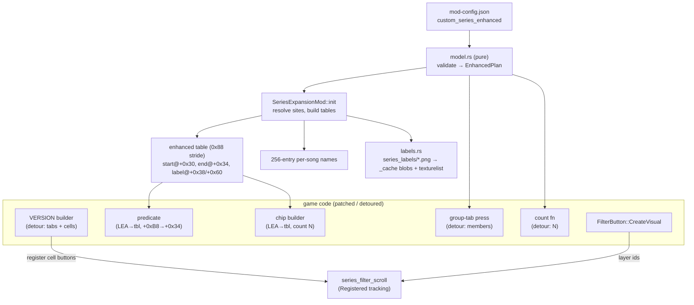

# Detailed design — config-defined VERSION (series) filter layout

Status: Approved 2026-09-27

## 1. Overview

DDR WORLD's song-select FILTER overlay has a VERSION menu with a hardcoded layout: three GROUP
tabs (GOLD / WHITE / CLASSIC) followed by nine two-per-row cells that each cover a range of
series (WORLD, A3, A20–A20 PLUS, …, 1st–5thMIX). The `series_expansion` mod can append extra
cells for custom `<series>` values, but cannot change the layout, the ranges, or the order.

This design adds an **enhanced mode** to `series_expansion`, keyed on a new config object
`series_expansion.custom_series_enhanced`. In enhanced mode the menu below the three GROUP tabs
is entirely config-owned: a grid of `num_columns` (1–5) cells per row, filled left-to-right in
the order of the config's `filters` list, each cell with its own inclusive series range and label
texture. Label art exists per column count, so switching layouts is a one-number config change. A
Python generator produces the label art for every canonical series at all five widths and a
contact sheet that previews each layout.

The feature is experimental and for a specific group: it is not mentioned in `README.md`, the
mod menu or the WebUI, and the committed `mod-config.json` never enables it.

## 2. Detailed requirements

### 2.1 Mode selection and config

- R1. `series_expansion.custom_series_enhanced` present and a JSON object ⇒ enhanced mode.
  `custom_series` is then ignored entirely (cells, labels, names, counts).
- R2. Enhanced key absent ⇒ the existing (legacy) behaviour, unchanged except R24.
- R3. `custom_series` becomes optional in the schema, so a config holding only the enhanced key
  parses.
- R4. Nothing inside the enhanced object can fail the global `mod-config.json` parse: the object is
  deserialised as untyped JSON and validated by the mod. An enhanced value that is not an object ⇒
  one WARN; legacy mode if `custom_series` is non-empty, else the mod is not registered.
- R5. Schema:

  ```json
  "series_expansion": {
    "custom_series_enhanced": {
      "num_columns": 3,
      "filters": [
        { "label": "WORLD",      "series_start": 21, "texture": "world" },
        { "label": "2014",       "series_start": 15, "series_end": 16, "texture": "2014" },
        { "label": "WORLD RUBY", "series_start": 30, "texture": "world_ruby", "group": "gold" }
      ]
    }
  }
  ```

  | Field | Type | Required | Meaning |
  |---|---|---|---|
  | `num_columns` | integer 1–5 | yes | cells per grid row; equals the game's cell template index. Invalid ⇒ WARN, 2 |
  | `filters` | array | yes (may be empty) | cells in display order; array index = selection index |
  | `label` | ASCII string, any length | yes | filter-chip text; per-song name for custom series (R14) |
  | `series_start` | integer 0–255 | yes | first raw musicdb `<series>` value covered |
  | `series_end` | integer 0–255 | no (= start) | last raw value covered (inclusive) |
  | `texture` | `[a-z0-9_]+` | yes | label art base name (R16) |
  | `group` | `"gold"` \| `"white"` \| `"classic"` \| `"none"` | no | GROUP-tab membership override (R10) |

- R6. `filters: []` ⇒ the GROUP tabs only; the mod stays active.
- R7. Invalid cells (start > end, value outside 0–255, unknown `group`, bad `texture`, empty or
  non-ASCII `label`) are skipped with one WARN each; the rest load.
- R8. Cell cap: `min(64, 24 × num_columns)` (64 = the saved-filter bitfield; 24 = grid rows that
  get visuals, R21). Extra cells are dropped with one WARN. The 24 is a named constant, measured on
  the first cabinet deploy.

### 2.2 Menu behaviour

- R9. The first line is always the three stock GROUP tabs (stock art, 72-px template), in stock
  order GOLD, WHITE, CLASSIC. Cells follow on the next line using template `num_columns`. The
  stock invisible 1-px row break between tabs and cells is omitted (the tabs fill the 216-px line,
  so the first cell wraps regardless; cells sit 1 px higher than stock).
- R10. Pressing a GROUP tab replaces the VERSION selection with that group's member cells, then
  refreshes results as stock does. Membership: the cell's `group` if set; otherwise the group whose
  raw span contains `series_start` — CLASSIC 1–13, WHITE 14–17, GOLD 18–21; `series_start` 0 or ≥ 22
  ⇒ no group. A tab with no members still shows; pressing it clears the VERSION selection.
- R11. A song matches a cell iff its series value lies in `[series_start, series_end]`. Values are
  raw musicdb values, except that raw 16 is treated as 15 (the game folds 16 into 15 before any
  filter sees it and names both "DDR 2014"): bounds of 16 are normalised to 15. Custom values
  ≥ 22 pass through (existing mapper patch). Semantics otherwise stock: OR across selected cells,
  AND with other categories, Simple/Normal modes, range select.
- R12. Selection index = position in `filters`; it is also the bit in the saved
  `filtersort/version` u64. Appending cells preserves players' saved filters; inserting,
  reordering or switching modes remaps them (accepted, no migration).
- R13. Filter chip: stock format — `"DDR "` + runs of selected cells' labels merged by adjacent
  selection index (`DDR WORLD～A20`, `DDR WORLD, 2013`).
- R14. Per-song version name ("Version / %s") for raw values ≥ 22: the `label` of the first cell
  whose range is exactly that value; otherwise the existing WORLD fallback. 0–21 stay stock.
- R15. More cells than fit on screen scroll with the existing edge-scrolling (nine visible grid
  rows below the tabs, `num_columns` per row); the tabs never scroll.

### 2.3 Labels

- R16. Per cell, label art is resolved from `data_mods/custom_series/series_labels/`:
  `sefi_version_<texture>_<N>col.png` (N = `num_columns`), else `sefi_version_<texture>.png`, else
  the cell renders with no label (one WARN). The in-game texture name is
  `sefi_version_<texture>_<N>col` for both sources.
- R17. Canvas per width: 1 col 220×20, 2 col 104×20, 3 col 64×20, 4 col 44×20, 5 col 32×20. A
  source of another size is cropped or padded (top-left) to the canvas, with one WARN.
- R18. Only the active width's labels are declared to the game (each costs one texture open at
  the CAUTION-screen preload).
- R19. Changing `num_columns`, labels or art shows correct labels on the next boot with no
  "reboot again" splash (the labels mount after mod enable, so a rebuild is picked up the same
  boot).

### 2.4 Other game-side effects

- R20. Every supported gamemdx build (20250805, 20260224, 20260721, 20260825, 20260915) is
  supported; every new site is found by AOB or derivation and shape-checked. Any miss ⇒ enhanced
  mode off with one WARN, falling back to legacy when `custom_series` is non-empty, else the mod is
  not registered. Stock behaviour is never left half-patched.
- R21. The jacket-thumbnail ARC loop bound (`data/arc/thumbnail/jacket_thumbnails_<rgn>_<N>.arc`,
  stock N ≤ 21) is raised to the highest N in 22–127 for which that arc exists (`ja` or `ua`, in the
  install's `data/` or a LayeredFS mod folder); otherwise it stays stock. It is never derived from
  cell ranges.
- R22. Unchanged from legacy and shared: custom series ≥ 22 are excluded from flare skill; the
  per-song name table has 256 entries; filter selections persist (count detour).
- R23. Mode-exclusive: the legacy builder-loop byte patches are never applied in enhanced mode.
- R24. Legacy fix: the legacy thumbnail bound is clamped to 127 (a bound ≥ 128 never terminates
  and hangs boot).

### 2.5 Tooling and shipping

- R25. `scripts/gen_series_labels.py` renders the canonical series labels at all five widths into
  `data_mods/custom_series/series_labels/`, and supports `--from-config PATH`, `--emit-config`,
  `--preview` (§4.8). Generated PNGs are committed and never hand-edited.
- R26. Canonical cells (newest first): WORLD 21, A3 20, A20 PLUS 19, A20 18, A 17, 2014 15–16,
  2013 14, X3 VS 2ndMIX 13, X2 12, X 11, SuperNOVA2 10, SuperNOVA 9, EXTREME 8, MAX2 7, MAX 6,
  5thMIX 5, 4thMIX 4, 3rdMIX 3, 2ndMIX 2, 1stMIX 1.
- R27. Label look: font FOT-TsukuGo Pro B (`scripts/fonts/FOT-TSUKUGOPRO-B.OTF`), 15 px (12-px
  caps, baseline y = 16), base horizontal scale 0.90, no faux-bold (the generator keeps the
  embolden amount as a constant, default 0), fill `#00B68C`,
  left-aligned with a 1-px pad, ink kept within the stock limits (216/98/60/42/30 px for the five
  widths). Too-wide text condenses horizontally to 0.70, then stacks on two lines (10.5 px, second
  line right-aligned) only at a space or a lower→upper / digit→letter boundary; single words keep
  condensing. The canonical table may override text or the break per width.
- R28. The committed `mod-config.json` never contains `custom_series_enhanced` (the auto-updater
  inserts missing keys from the release config into users' configs, which would enable it for
  everyone). Testers paste the block from `--emit-config`.
- R29. No README, mod-menu or WebUI surface. Internal docs (module `//!` header, a `docs/` note)
  describe the mode as experimental.

### 2.6 Assumptions

- The CAUTION-screen preload mounts `select_music_option_v3.ifs` after mod `enable()` on every
  build (true today; R19 relies on it).
- Fresh-mode (compact) cloned-atlas texturelist entries bind to the filter cell's label layer like
  donor-slot entries (per-image serving makes the atlas origin irrelevant); verified on the first
  deploy, donor mode is the fallback.
- About 24 grid rows below the tabs lie inside the on-screen band (R8); measured on the first
  deploy.
- Network servers may drop saved `version` bits above the stock count; not verified, not handled.

## 3. Architecture overview

### 3.1 Game mechanics the design relies on

- **The item area is a flow layout.** A 216 × 266-px `GridPanel` places children in insertion
  order and wraps when the next child would overflow. A filter cell's width comes from its
  template: `filter_switch_base01..05` = 220/108/72/54/42 px ⇒ 1/2/3/4/5 per row, so template index
  = `num_columns`. The group tabs use template 3 (three fill a line exactly).
- **The VERSION builder** is a lambda body `builder(capture, factory)` run each time the menu
  opens (after the grid is cleared). It creates the tabs through a tab factory, a 1-px
  `FilterHeader`, then entries 8…0 through `factory` (a by-value
  `std::function<FilterButton*(int)>` it owns and destroys); each factory call returns a
  `FilterButton` already pushed into the grid, and the builder sets its template and label string
  (`FilterButton+0xC8`, texture `sefi_<label>`). The factory argument is the selection index.
- **The predicate** walks the category's selected indices and tests
  `table[i].start (+0x30) <= v < table[i+1].start (+0xB8)` on a 0x88-stride table, where `v` is the
  mapped series value. `+0x34` in every entry is unused padding.
- **The group-tab press** (a lambda body) clears the category, adds indices
  `[group[g].start, group[g+1].start)` from the stock group table, then tail-calls notify.
- **Selections** live in a `map<int, set<int>>` behind a state pointer; the game exposes
  clear-category `(state, cat)`, set-one `(state, cat, idx, on)`, and notify `(FilterPanel*)`.
- **Persistence**: one u64 per category; a count function bounds the load/save bit loops.
- **Labels**: `select_music_option_v3.ifs` serves textures **per image name**; LayeredFS serves a
  declared name from `_cache/select_music_option_v3_ifs/md5(name)` or a PNG at the IFS mod path.
  The texturelist declares the name and size.
- **Visuals are lazy**: `FilterButton::CreateVisual` runs on a later tick, only while the button's
  *layout* rect is inside the virtual screen band (y < 864 in 1280 × 720), and may re-run with a new
  BM2D layer id.

### 3.2 Enhanced-mode structure



Legacy mode keeps its current structure (extended table, builder-loop byte patches,
template-2 scroll tracking). Both modes share: the mapper default patch, flare exclusion, the count
detour, the chip-builder patch, the per-song name table, the AFP scroll children and the scroll
service. The builder and press detours are installed in enhanced mode only.

### 3.3 Opening the menu (enhanced)

```mermaid
sequenceDiagram
    participant Game as FilterPanel (open VERSION)
    participant Grid as item GridPanel
    participant B as builder detour
    participant Scroll as series_filter_scroll
    Game->>Grid: clear() (old FilterButtons destroyed → dtor hook resets scroll)
    Game->>B: builder(capture, factory)
    loop g = 2, 1, 0
        B->>Game: tab_factory(capture, g) → btn
        B->>Game: SetTemplate(btn, 3); assign(btn+0xC8, "version_<gold|white|classic>")
    end
    loop i = 0 … N-1
        B->>Game: factory.impl→invoke(i) → btn
        B->>Game: SetTemplate(btn, num_columns); assign(btn+0xC8, "version_<tex>_<N>col")
        B->>Scroll: register(btn, row = i / num_columns)
    end
    B->>Game: factory.impl→destroy(impl != factory); factory.impl = 0
    Game->>Grid: append Reset target
    Note over Grid,Scroll: later ticks: CreateVisual(btn) per on-screen button → layer id → Scroll activates when every registered button has one
```

## 4. Components and interfaces

### 4.1 Module layout

`src/mods/series_expansion.rs` becomes `src/mods/series_expansion/`:

| File | Content |
|---|---|
| `mod.rs` | `SeriesExpansionMod` (existing legacy code), mode selection, shared patches, `//!` docs |
| `enhanced/mod.rs` | enhanced init/enable/disable glue, resolved sites, table building |
| `enhanced/model.rs` | pure: config validation → `EnhancedPlan`, table-row values, label stems, thumbnail policy. No `crate::` imports (harness-mountable) |
| `enhanced/hooks.rs` | builder and group-press detours |
| `enhanced/labels.rs` | label source resolution, normalisation, `_cache` blobs, texturelist batch |

### 4.2 Config schema (`SeriesConfig`)

```rust
#[derive(Deserialize, Clone)]
pub struct SeriesConfig {
    #[serde(default)]
    pub custom_series: Vec<CustomSeriesEntry>,
    #[serde(default)]
    pub custom_series_enhanced: Option<serde_json::Value>,
}
```

The section stays operator-only (never written by the DLL).

### 4.3 `enhanced/model.rs` (pure)

```rust
pub const MAX_CELLS: usize = 64;
pub const MAX_GRID_ROWS: usize = 24;          // tuned on the first cabinet deploy
pub enum Group { Classic = 0, White = 1, Gold = 2 }   // = the tab's stock g
pub struct Cell { pub label: String, pub start: u8, pub end: u8, pub texture: String, pub group: Option<Group> }
pub struct EnhancedPlan { pub columns: u8, pub cells: Vec<Cell> }

pub fn parse(v: &serde_json::Value) -> Result<(EnhancedPlan, Vec<String>), String>;  // Err = not an object
impl EnhancedPlan {
    pub fn members(&self, g: u32) -> Vec<u32>;            // cell indices of tab g (R10)
    pub fn table_rows(&self) -> Vec<TableRow>;            // max(N, 9) + 1 rows (§5.2)
    pub fn custom_names(&self) -> Vec<(u8, &str)>;        // R14
    pub fn label_key(&self, i: usize) -> String;          // "version_<tex>_<N>col"
    pub fn label_stems(&self) -> Vec<String>;             // unique "sefi_version_<tex>_<N>col"
}
pub struct TableRow { pub start: i32, pub end_excl: i32, pub label: String }
pub fn canvas_width(columns: u8) -> u32;                  // 220/104/64/44/32
pub fn thumbnail_bound(exists: impl Fn(u8) -> bool) -> Option<u8>;  // highest N in 22..=127
pub fn legacy_thumbnail_bound(max_series: u8) -> u8;      // min(max_series, 127)
```

`parse` applies R5–R8 and R11's normalisation (bounds of 16 → 15) and returns every WARN string
for the caller to log. `group` defaults use the raw (pre-normalisation) `series_start`.

### 4.4 Signatures and derivations (`src/core/signatures.rs`)

New signatures (each has exactly one match on all five builds; offsets identical on all builds):

| Name | Resolves | Derived from it |
|---|---|---|
| `version_filter_builder` | builder entry | `+0x55` CALL → tab factory; `+0x65` and `+0x27F` CALL → SetTemplate (must equal `filter_button_panel_config`); `+0x8B` CALL → `std::string::assign(const char*, size_t)` |
| `version_group_press` | group-press body entry | `+0x19` CALL → clear-category; `+0xD9` **JMP** → notify |
| `filter_toggle_one_body` | lambda93 body | `+0x18` CALL → set-one; `+0x26` JMP must equal notify |
| `version_predicate_range` | predicate `+0x32` (the 58-byte loop head, LEA disp32 wildcarded) | must equal the first `version_predicate_lea` match |

Shape checks before use (fail-closed): the builder's `+0x1D0 = 49 8B 47 40`,
`+0x278 = 41 8B 57 48`, `+0x260 = 49 8B 4E 18`, the opcode byte at every derived CALL/JMP site, the
predicate's 58 bytes (masking the LEA disp32), and the predicate's mapper CALL at `match − 0x22`
targeting the mapper (`series_mapper_bounds − 0x5D`). Cross-check: `ui_entry_loop` = builder
`+0x249`. The patterns are in Appendix A. All pass through `validate_signatures.sh` and
`shape_diff.py`.

### 4.5 `enhanced/hooks.rs` — detours

Both are owned by `series_expansion`; nothing else hooks these functions. Both read one
`static` plan/sites pointer and an `ENHANCED_ACTIVE` flag; when the flag is off they call the
original. Bodies run inside `catch_unwind`; no `unwrap`/indexing.

**Builder** `unsafe extern "C" fn(capture: *mut u8, factory: *mut u8)`:

1. Tabs, `g = 2, 1, 0`: `btn = tab_factory(capture, g)`; skip if null; `set_template(btn, 3)`;
   `assign(btn + 0xC8, "version_" + ["classic", "white", "gold"][g])`.
2. `impl = *(factory + 0x18)`; if non-null, for each cell `i`:
   `btn = (impl.vtbl[1])(impl, i)`; skip if null; `set_template(btn, columns)`;
   `assign(btn + 0xC8, label_key(i))`; `series_filter_scroll::register_entry(btn, i / columns)`.
3. Destroy the factory exactly once, as stock: if `impl` non-null,
   `(impl.vtbl[3])(impl, impl != factory)`, then `*(factory + 0x18) = 0`.

`assign` is the game's own `std::string::assign(const char*, size_t)`: the game allocator owns the
result and the button's destructor frees it. Before step 1 the detour calls
`series_filter_scroll::begin_build()`.

**Group press** `unsafe extern "C" fn(captures: *mut u8, on: u8)` (`captures` = +0x00 state,
+0x08 category i32, +0x18 `g` i32, +0x20 FilterPanel): `clear(state, cat)`; for each
`members(g)`: `set_one(state, cat, idx, 1)`; `notify(panel)`. Never falls through to the stock body
while active.

### 4.6 `enhanced/mod.rs` — lifecycle

`init` (mode = enhanced):
1. `parse` the plan; log warnings.
2. Resolve every enhanced site (§4.4) plus the shared legacy ones; any miss ⇒ `None`, and `init`
   falls back per R20.
3. Build (near-allocated, never freed) the enhanced table (§5.2), the 256-entry name table with R14
   labels, and the flare-exclusion tables (shared code).
4. Stash the plan, sites and `VERSION_TOTAL_COUNT = N`.

`enable` (enhanced):
1. `labels::prepare(plan)` (§4.7).
2. Detours first: builder and group press (flag still off, so they pass through). If either
   install fails, drop both and stop — nothing is patched and the menu stays stock.
3. Byte patches (saved/restorable): mapper default; predicate LEA → table and disp32
   `B8 00 00 00 → 34 00 00 00` (applied together; restored in reverse); chip builder LEA → table and
   count → N; per-song name LEA; flare exclusion; thumbnail bound (R21) if any.
4. Count detour (shared; a failure only loses persistence above index 8, one WARN). Set
   `ENHANCED_ACTIVE`.
5. AFP scroll children (shared) and `series_filter_scroll::configure` with
   `tracking: Registered`, `columns = num_columns`, `visible_rows = 9`, `row_height = 26`,
   `total_entries = N`.

`disable`: clear `ENHANCED_ACTIVE` (detours pass through), restore patches in reverse, drop the
count detour (as today). Tables are never freed (captured `std::function`s keep pointers).

### 4.7 `enhanced/labels.rs` and LayeredFS additions

`prepare(plan)` at `enable()`:
1. For each unique stem `sefi_version_<tex>_<N>col`: find the source (R16); decode; if not
   exactly W × 20, crop or pad top-left and write the normalised copy to
   `data_mods/_cache/custom_series_labels/<stem>.png` (machine-owned; `_cache` is never scanned as
   a mod). Unresolved stems ⇒ one WARN each, no declaration.
2. `ifs_textures::prebuild_texture("select_music_option_v3_ifs", stem, png, W, 20)` — **new
   public helper** that builds the image descriptor (`argb8888rev`, AVSLZ, W × 20) and runs the
   existing `cache_texture` encoder into `_cache/select_music_option_v3_ifs/md5(stem)`, updating the
   in-memory cache index. Its existing freshness check (cache newer than PNG) skips unchanged art.
3. Texturelist: `atlas_cloner::generate_cloned_atlases_cached_with(..., [AtlasSet { prefix:
   "cser_enh", fresh: true, specs: stem → donor for the width }], BatchOptions { sidecar_key:
   "custom_series_enhanced", latch_reboot: false })` — **new variant**: per-caller sidecar name
   (`_cache/select_music_option_v3_ifs/<key>.atlasbatch.md5`, as the function's doc already
   describes) and an opt-out of the "reboot" latch. The existing function delegates with
   `("atlasbatch", true)`, unchanged for current callers.
4. Guards: on `Cached`, confirm every stem appears in the merged texturelist; if not (a legacy boot
   rewrote it), delete the sidecar and rebuild. If no stem resolved, write an empty merged
   texturelist. Rescan mod paths only when the merged file was (re)written.

Donors (all in the stock IFS's `tex001` atlas): 220 `sefi_event_league`, 104
`sefi_version_world`, 64 `sefi_version_gold`, 44 `sefi_title_other`, 32 `sefi_level_00`.

Nothing is written under any `_ifs` folder, so LayeredFS's loose-PNG auto-injection never sees
these files. Legacy mode keeps its existing uncached pipeline.

### 4.8 `series_filter_scroll` changes

- `ScrollConfig` gains `tracking: Tracking` — `Template2` (today's behaviour; legacy) or
  `Registered`.
- New `begin_build()` (drop registrations, deactivate) and `register_entry(btn, row)` (record
  `this` and row).
- In the CreateVisual detour, `Registered` mode matches `this` against registrations and records
  or **refreshes** the layer id (CreateVisual can re-run with a new layer); activation is scheduled
  once every registered button has a layer id. The template test is not used in this mode.
- Masking, cursor-follow and the BM2D `set_position` offset are unchanged. Tabs are never
  registered, so they stay fixed.

### 4.9 `scripts/gen_series_labels.py`

- Data: the canonical table (key, text, raw range, optional per-width text/break overrides).
- Default run: render every canonical key × widths 1–5 into
  `data_mods/custom_series/series_labels/sefi_version_<key>_<N>col.png`.
- `--from-config PATH`: read `series_expansion.custom_series_enhanced.filters` from a config
  file and render each distinct `texture` from its `label`, all five widths.
- `--emit-config`: print the canonical `custom_series_enhanced` block (`num_columns: 3`,
  newest first, no explicit groups).
- `--preview [PATH]` (default `target/series_labels_preview.png`): a contact sheet of every layout
  for the rendered set, using stock tab and check-mark art from a local stock extraction when
  present (`select_music_option_v3_ifs/tex/`, untracked) and flat placeholders otherwise; it
  marks the nine-row scroll boundary.
- Rendering per R27; reports condensed/stacked labels; fails with a clear message when the font is
  missing; prints repo-relative paths only.

## 5. Data models

### 5.1 `EnhancedPlan`

As in §4.3. Invariants: `1 ≤ columns ≤ 5`; `cells.len() ≤ min(64, 24 × columns)`; every cell
`start ≤ end` after normalisation (no 16 remains); `texture` matches `[a-z0-9_]+`; `label` is
non-empty ASCII.

### 5.2 Enhanced table (game memory, near-allocated, never freed)

`max(N, 9) + 1` rows of 0x88 bytes, indexed by selection index:

| Offset | Type | Rows 0…N−1 (cells) | Row N (sentinel) and padding rows |
|---|---|---|---|
| +0x00 | u32 | 0 | 0 |
| +0x08 | std::string | empty | empty |
| +0x30 | i32 | `start` | `i32::MAX` |
| +0x34 | i32 | `end + 1` (exclusive) | 0 |
| +0x38 | std::string | `label` | empty |
| +0x60 | std::string | `label` | empty |

Strings use the MSVC layout (16-byte buffer or pointer, size at +0x10, capacity at +0x18). Labels
of ≤ 15 bytes are inline; longer ones point at mod-owned, never-freed memory with capacity = length
(the game only copies these strings). The sentinel exists because the chip builder probes indices
`0..=count`; the padding keeps any stale index < 9 inert.

### 5.3 Label assets

| Path | Owner | Content |
|---|---|---|
| `data_mods/custom_series/series_labels/sefi_version_<key>_<N>col.png` | generator (committed) | label art, 5 widths per key |
| `data_mods/_cache/custom_series_labels/<stem>.png` | DLL | normalised copies (only when a source is mis-sized) |
| `data_mods/_cache/select_music_option_v3_ifs/md5(<stem>)` | DLL | per-image served blobs |
| `data_mods/custom_series/select_music_option_v3_ifs/tex/texturelist.merged.xml` | DLL (shared with legacy) | declarations for the active mode |
| `data_mods/_cache/select_music_option_v3_ifs/custom_series_enhanced.atlasbatch.md5` | DLL | batch hash |

## 6. Error handling

| Condition | Behaviour |
|---|---|
| Enhanced value not an object | WARN; legacy if `custom_series` non-empty, else mod not registered |
| Invalid `num_columns` | WARN; 2 |
| Invalid cell | WARN per cell; cell skipped |
| Cells over the cap | WARN once; extras dropped |
| Enhanced signature / derivation / shape check fails | WARN naming the site; enhanced off; legacy fallback per R20; no enhanced patch or detour applied |
| Builder or press detour install fails | WARN; nothing patched (detours precede patches); stock menu |
| Mod disabled at runtime with cells ≥ 9 selected | stock predicate reads neighbouring static tables for those indices (in-bounds, wrong matches) until the player clears the filter — same as legacy today |
| Null button from a factory | skip that cell/tab; continue |
| Null factory impl | no cells; tabs still built; nothing to destroy |
| Panic inside a detour body | caught; the factory is still destroyed exactly once (destroy runs outside the fallible section) |
| Label source missing | WARN per stem; not declared; cell shows no label |
| Label source mis-sized | WARN; cropped/padded copy used |
| Texturelist batch cached but stale | sidecar deleted, rebuilt |
| No labels at all | empty merged texturelist written |
| No custom thumbnail arcs | thumbnail loop left stock |
| Legacy max series ≥ 128 | WARN; thumbnail bound 127 |
| Game C++ exception inside a called game function | not recoverable across `extern "C"`; only on out-of-memory (same as stock) — label lengths stay far below `npos` |

Every hook body is panic-free or wrapped in `catch_unwind`, and nothing heavy runs per frame: the
predicate stays game code; the detours run once per menu open or tab press.

## 7. Testing strategy

**Host harness** (new `scripts/validate_series_expansion.sh`, mounting `enhanced/model.rs` with a
`serde_json` dependency):
- parse: valid config; `filters: []`; not-an-object; each invalid-cell rule; missing
  `series_end`; `num_columns` out of range and non-integer; cap at `24 × columns` and 64.
- 16 → 15 normalisation (`[16,16]`, `[14,16]`, `[16,20]`); groups by default rule and override;
  `none`; a cell starting at 0 or ≥ 22.
- `table_rows`: N + 1 and padding to 10 rows for N < 9; `end_excl`; sentinel values.
- `members`, `custom_names` (first exact single-value cell wins), `label_key` / `label_stems`
  (dedupe), `canvas_width`.
- `thumbnail_bound` (no arcs, 22 only, gaps, a 127 cap), `legacy_thumbnail_bound`.

**Signature sweep:** `validate_signatures.sh` green with the four new signatures;
`shape_diff.py` identical on every build for the builder offsets, press offsets, lambda93 offsets
and the predicate's 58-byte window.

**Generator:** a default run produces 100 PNGs of the exact canvas sizes; `--emit-config` output
parses and passes the model's validation (run through the harness as a fixture); `--preview`
renders; re-running is byte-identical.

**Cabinet (engine code has no harness; spice2x `log.txt` + visual):**
1. First enhanced deploy, canonical 20 cells, `num_columns` 1: the log records, one frame after
   opening VERSION, which registered buttons received a layer id (measures the on-screen row
   limit, R8) and that labels render with fresh-mode declarations.
2. Each `num_columns` 1–5: layout, labels, scrolling at 1 and 2 columns, tabs fixed.
3. Filtering results per cell match the musicdb counts (e.g. WORLD 289, 2014 = 60 + 47 = 107,
   1stMIX 3); multi-select OR; AND with LEVEL; Simple and Normal; range select; chip text.
4. GROUP tabs select the right cells; empty group; `group` overrides.
5. Persistence across a credit (selection restored); appending a cell keeps it.
6. Custom series (a test song at series 30 with a `world_ruby` cell): filters, per-song name,
   flare exclusion, thumbnail bound log.
7. `filters: []`; an invalid cell; a missing texture.
8. Regression: enhanced key removed ⇒ legacy menu exactly as before; mode switch legacy → enhanced
   → legacy → enhanced shows correct labels each boot; mod toggled off in the overlay menu ⇒ stock
   menu.
9. Readiness gate: `cargo check`, `cargo fmt`, `./build.sh`, signature sweep; label PNGs and the
   generator's outputs deployed with the DLL (`data_mods/` must be copied).

## Appendix A — Signature patterns

| Name | Pattern |
|---|---|
| `version_filter_builder` | `40 55 56 57 41 54 41 55 41 56 41 57 48 8D 6C 24 D9 48 81 EC C0 00 00 00 48 C7 45 97 FE FF FF FF 48 89 9C 24 10 01 00 00 48 8B 05 ?? ?? ?? ?? 48 33 C4 48 89 45 17 4C 8B F2 4C 8B F9 48 89 55 8F BE 02 00 00 00 48 8D 1D` |
| `version_group_press` | `48 89 5C 24 18 55 56 57 41 54 41 55 48 83 EC 30 8B 51 08 48 8B D9 48 8B 09 E8 ?? ?? ?? ?? 4C 63 5B 18 48 8B 53 10` |
| `filter_toggle_one_body` | `40 53 48 83 EC 20 44 8B 41 14 44 0F B6 CA 8B 51 10 48 8B D9 48 8B 49 08 E8 ?? ?? ?? ?? 48 8B 4B 18 48 83 C4 20 5B E9` |
| `version_predicate_range` | `48 8B 50 08 48 8B 0A 48 3B CA 74 36 4C 8D 05 ?? ?? ?? ?? 66 66 66 0F 1F 84 00 00 00 00 00 48 63 41 10 48 69 C0 88 00 00 00 42 39 7C 00 30 7F 0A 42 3B BC 00 B8 00 00 00 7C 15` |

Reference addresses on 20260915 (file-relative to `0x180000000`): builder `0x180124220`, tab
factory `0x180124000`, group press `0x180127810`, set-one `0x1801D5680`, clear-category
`0x1801D5740`, notify `0x180137230`, SetTemplate `0x1801345B0`, assign `0x180003990`, predicate
`0x180123E40` (disp32 patch at `0x180123EA6`), CreateVisual `0x180134A30`.

## Appendix B — Alternatives considered

- **Extend the stock builder loop** (legacy's approach). The loop walks the table backwards and
  is a do-while, so display order forces selection index `N−1−p`, an empty menu is impossible, and
  the template still needs a capture rewrite. Rejected for the builder detour.
- **Full predicate detour.** Needs the build-dependent FilterManager selection offset for no gain
  over the 4-byte `+0x34` patch, and adds a hot-path Rust hook.
- **Group-contiguous selection indices + group-table patch** (no press detour). Ties saved-filter
  bits to group order and forbids interleaving grouped and ungrouped cells.
- **Un-merging raw 16** via the mapper's jump table: splits the VERSION sort's group headers into two
  "2014" groups; the game treats 15/16 as one series.
- **Staging label PNGs into the IFS mod folder each boot:** needs stale-copy cleanup and cache purges,
  and loose PNGs there are auto-injected by LayeredFS.
- **Component-level scrolling** (moving the grid instead of BM2D layers) to lift the ~24-row limit:
  more RE, and it would scroll the tabs too. Deferred until a layout needs more rows.
- **Recreating the 1-px `FilterHeader`:** five more derived sites for a 1-px difference.
