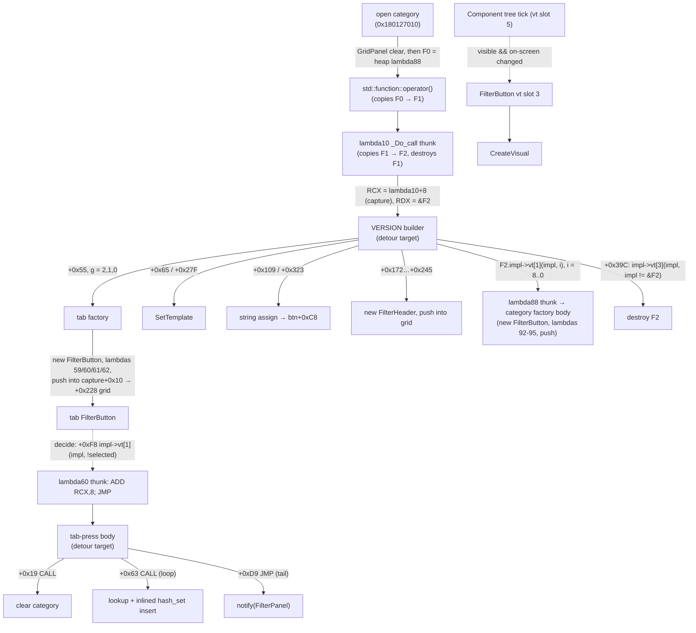

# Research: VERSION builder, group tabs and selection primitives (R1 / R3 / R4)

Scope: can the enhanced mode detour the VERSION builder and the group-tab press body on all
five supported builds, and how to derive every address it needs. Read-only; nothing in the
Ghidra DB or the source tree was changed.

**Method.** Ghidra (`gamemdx_20260915.dll` primary, `gamemdx_20250805_STOCK.dll` spot checks)
for semantics; a throwaway capstone/pefile script over the raw DLLs in
`~/Desktop/ddr_modules/gamemdx_{20250805,20260224,20260721,20260825,20260915}.dll` for
cross-build work: byte-search AOB counts, call-target chains, and an
**instruction-by-instruction comparison with addresses/RIP displacements normalised**.
All addresses are file-relative (image base `0x180000000`).

**Verdict.** Both detours are feasible and low-risk. Builder, tab factory, press body,
`_Do_call` thunks, set-one, clear-category, SetTemplate, CreateVisual and the FilterButton
dtor are **instruction-identical on all five builds** (only rel32/disp32 values differ), and
every derivation below was checked on every build. Three things the plan must add (details in
[§10](#10-findings-that-change-the-plan)): the builder also creates a `FilterHeader`; the press
body inlines set-one (so set-one needs its own derivation) and reaches notify by a tail `JMP`,
not a `CALL`; and `CreateVisual` is lazy and on-screen-gated, so rows laid out far below the
panel never get a visual.

---

## 1. Per-build addresses

| Role | 20250805 | 20260224 | 20260721 | 20260825 | 20260915 |
|---|---|---|---|---|---|
| VERSION builder (lambda10 body) | `0x180117450` | `0x180119E70` | `0x180124520` | `0x180124040` | `0x180124220` |
| builder `_Do_call` thunk (lambda10 vt slot 1) | `0x180120800` | `0x1801231C0` | `0x18012DA50` | `0x18012D460` | `0x18012D6A0` |
| group-tab factory | `0x180117230` | `0x180119C50` | `0x180124300` | `0x180123E20` | `0x180124000` |
| lambda60 (tab press) vtable | `0x180351278` | `0x180358828` | `0x180371F58` | `0x180371F78` | `0x180371F98` |
| tab-press `_Do_call` thunk (`ADD RCX,8; JMP`) | `0x180123BF0` | `0x1801265E0` | `0x180130E40` | `0x180130850` | `0x180130AC0` |
| **tab-press body** | `0x18011A9E0` | `0x18011D3D0` | `0x180127B10` | `0x180127630` | `0x180127810` |
| clear category `(state, cat)` | `0x1801BF530` | `0x1801C28F0` | `0x1801D58E0` | `0x1801D5DE0` | `0x1801D5740` |
| **set/clear one** `(state, cat, idx, on)` | `0x1801BF470` | `0x1801C2830` | `0x1801D5820` | `0x1801D5D20` | `0x1801D5680` |
| clear all `(state)` (Simple-mode pre-press) | `0x1801BF5A0` | `0x1801C2960` | `0x1801D5950` | `0x1801D5E50` | `0x1801D57B0` |
| selection lookup `map<int,set>::operator[]` | `0x1801BF7D0` | `0x1801C2B90` | `0x1801D5B80` | `0x1801D6080` | `0x1801D59E0` |
| notify `(FilterPanel*)` | `0x18012AB70` | `0x18012D560` | `0x180137610` | `0x1801370C0` | `0x180137230` |
| lambda93 body (toggle one) | `0x180125000` | `0x1801279C0` | `0x180132250` | `0x180131C90` | `0x180131EA0` |
| `FilterButton::SetTemplate` | `0x180127C50` | `0x18012A680` | `0x180134990` | `0x180134400` | `0x1801345B0` |
| `std::string::assign(const char*, size_t)` | `0x1800038C0` | `0x1800038D0` | `0x1800038A0` | `0x180003860` | `0x180003990` |
| `std::string::assign(const string&, pos, n)` | `0x180003460` | `0x180003470` | `0x180003440` | `0x180003400` | `0x180003530` |
| category factory (lambda88) thunk | `0x180124C20` | `0x180127610` | `0x180131E70` | `0x1801318B0` | `0x180131AF0` |
| category factory body | `0x18011AE20` | `0x18011D810` | `0x180127F50` | `0x180127A70` | `0x180127C50` |
| open category (clear grid, run builder, Reset) | `0x18011A1E0` | `0x18011CBD0` | `0x180127310` | `0x180126E30` | `0x180127010` |
| `FilterButton::CreateVisual` | `0x1801280D0` | `0x18012AB00` | `0x180134E10` | `0x180134880` | `0x180134A30` |
| FilterButton vt slot 3 (visibility change → CreateVisual) | `0x180129110` | `0x18012BB40` | `0x180135BF0` | `0x180135660` | `0x180135810` |
| `FilterButton::~FilterButton` | `0x180127900` | `0x18012A330` | `0x180134640` | `0x1801340B0` | `0x180134260` |
| game `operator new` / `free` (from builder) | `0x18025E444` / `0x18025E19C` | `0x1802653B4` / `0x18026510C` | `0x180279714` / `0x18027946C` | `0x1802791F4` / `0x180278F4C` | `0x1802792A4` / `0x180278FFC` |
| `sequence::Component` ctor | `0x18003CED0` | `0x18003C7F0` | `0x18003CCE0` | `0x18003D2F0` | `0x18003D850` |
| `vector<Component*>::push_back` (tab factory +0x1C0) | `0x180045C00` | `0x180045700` | `0x180045C10` | `0x180046880` | `0x180046CC0` |
| `FilterHeader` vtable / secondary vtable | `0x180351F68` / `0x180351FB0` | `0x180359518` / `0x180359560` | `0x180372C48` / `0x180372C90` | `0x180372C68` / `0x180372CB0` | `0x180372C88` / `0x180372CD0` |
| stock group table (`classic/white/gold`) | `0x180CB6BC0` | `0x180CCA9F0` | `0x180CF3EA0` | `0x180CF3E50` | `0x180CF3E40` |

The 20260915 column matches every address in the task brief and in
`docs/filter_menu_system_research.md` §13; the SetTemplate / CreateVisual values for 20250805
and 20260721 match that doc's §11.

## 2. Call flow



## 3. The builder

**Signature.** `void builder(u8* capture, std::function<FilterButton*(int)>* factory)`; RCX =
`lambda10_object + 8`, RDX = pointer to a by-value `std::function` the **builder owns and must
destroy**. R8/R9 are dead on entry; return value unused. The detour type
`unsafe extern "C" fn(capture: *mut u8, factory: *mut u8)` is correct.

**Callers.** Exactly one code reference on every build: the `CALL` at thunk+0x4F in the lambda10
`_Do_call` thunk (vtable slot 1). The other two references in Ghidra (20260915 `0x181292FC0`
in `.pdata`, `0x18043573C` in `.rdata`) are unwind/EH metadata, not code. The thunk itself is
only reached through the VERSION category's builder `std::function`, invoked by the open-category
function. The thunk is identical on all builds (36 instructions): it copies its argument into a
local `std::function` (`impl->vt[0](impl, dest)`, `dest` = the local buffer if the argument's impl
was stored inline, else NULL = heap copy), calls the builder with `&local`, then destroys its own
argument.

**Capture layout** (lambda10 `_Impl` object is 0x58 bytes: vtable + 0x50-byte capture). Built in
the filter init (`FUN_18011F600` on 20260915, the code right after the `LEA "version"`),
byte-identical on all five builds:

| Capture off | Type | Value | Consumer |
|---|---|---|---|
| +0x00 | ptr | selection state = `FilterManager + 0x378` (**+0x358 on 20250805 and 20260224**) | tab factory → lambda60/59 captures |
| +0x08 | i32 (+4 pad) | category = 1 | tab factory → lambda60 |
| +0x10 | ptr | `FilterPanel*` (the filter-init `this`, set by the FilterPanel ctor) | tab factory: `[+0x10]+0x228` item grid; lambda60 panel |
| +0x18 | `std::string` (0x28) | prefix `"version"` (buf +0x18, size +0x28, cap +0x30, empty allocator +0x38) | builder label `"%s_%s"` |
| +0x40 | ptr | the same `FilterPanel*` | builder: `[+0x40]+0x228` for the FilterHeader push |
| +0x48 | i32 | entry template = 2 | builder `MOV EDX,[R15+0x48]` (+0x278) |

`+0x10` and `+0x40` are the same register (`R13` = FilterPanel) on every build. The
"+0x38" slot is the VS2010 `std::string` allocator byte (this CRT's `std::string` is 0x28 bytes:
16-byte buffer/pointer, size, capacity, empty allocator; hence the 8-byte gaps after every
string in these structs). The capture copier copies +0x00/+0x08/+0x10, the string, +0x40 and
the `u32` at +0x48.

**What the stock builder does** (20260915 offsets; all builds use the same offsets):

| Offset | Action |
|---|---|
| +0x36/+0x39 | `R14 = factory`, `R15 = capture` |
| +0x40..+0x167 | `for g = 2..0` (do-while): `btn = tab_factory(capture, g)` (+0x55); `SetTemplate(btn, 3)` (+0x65); `tmp = sprintf("%s_%s", prefix, group[g].key)`; `assign(btn+0xC8, tmp, 0, npos)` (+0x109); free temporaries with the game CRT |
| +0x16D..+0x245 | `h = operator new(0xF8)`; `Component::Component(h)`; vtables at `h+0`/`h+0x28` (LEAs at +0x18B/+0x195); empty string at `h+0xC0`; `h+0xE8 = h+0xF0 = 0`; push `h` into `[[capture+0x40]+0x228]+0x68` (inline `push_back`); `h+0x60 = grid` |
| +0x249..+0x3A4 | `for i = 8..0` (do-while; `ui_entry_loop` = `MOV ESI,8` at +0x249): `impl = factory+0x18`, NULL ⇒ `bad_function_call` (+0x3A5, noreturn); `btn = impl->vt[1](impl, i)`; `SetTemplate(btn, capture+0x48)` (+0x27F); label as above (+0x323) |
| +0x38A..+0x3A3 | `impl = factory+0x18; if impl { impl->vt[3](impl, impl != factory); factory+0x18 = 0 }` |

Both factories push the new button into the item GridPanel themselves; the builder never
touches the children vector except for the FilterHeader.

## 4. The factory `std::function` contract

VS2010 `std::tr1::function`, 0x20 bytes: +0x00..+0x17 inline storage, **+0x18 `_Impl*`**
(`== self` when stored inline). `_Impl` vtable, identical on all builds (lambda88 checked on all
five):

| Slot | Off | Role |
|---|---|---|
| 0 | +0x00 | `_Copy(impl, dest)` — `dest` NULL ⇒ heap copy (game `operator new`) |
| 1 | +0x08 | `_Do_call(impl, args…)` — for lambda88 an `ADD RCX,8; JMP body` thunk |
| 2 | +0x10 | `_Target_type` |
| 3 | +0x18 | `_Delete_this(impl, bool dealloc)` — calls slot 4 (dtor), then game `free(impl)` if `dealloc` |
| 4 | +0x20 | destructor |
| 5 | +0x28 | `_Get` (returns `impl+8`) |

Invoke: `FilterButton* btn = ((fn(*mut u8, i32) -> *mut u8) impl->vt[1])(impl, selection_index)`.
Destroy exactly like stock: `impl->vt[3](impl, impl != factory)` then write 0 to
`factory+0x18`. In practice the impl is always a heap lambda88 (0x28-byte object ⇒ never
inline), so `dealloc` is true and the game CRT frees it.

**Ownership rule for the detour:** either call the original builder (which destroys the
factory) or destroy it yourself; never both, never neither (neither leaks a 0x28 block per
open, both double-frees). Copies F0/F1 are owned by the open-category function and the
`operator()` wrapper respectively; they are not the detour's concern.

**lambda88 (category factory) capture** (`impl+8`): +0x00 state, +0x08 category (i32),
+0x10 FilterPanel (grid = +0x228), +0x18 FilterPanel (sets `FilterButton+0x188 =
this+0xC0` when non-null). The body wires lambdas 92–95 to `(state, category, index, panel)`
and pushes the button into the item grid before returning it.

## 5. Group tabs: factory, press `std::function`, press body

**Tab factory** `FilterButton* tab_factory(u8* capture, i32 g)` (133 instructions, identical on
all builds): allocates + constructs a FilterButton (0x1D0), then installs

| Button field | Lambda | Behaviour |
|---|---|---|
| +0x118 pre-press | lambda59 (capture: state) | Simple mode (`FilterManager+0x1C3`) ⇒ clear **all** categories. Same body as lambda92. |
| +0xF8 press | **lambda60** (0x30-byte heap object) | tab press, below |
| +0x138 post-press | lambda61 | Simple mode ⇒ post event 0x11 (close). Same body as lambda94. |
| +0x158 is-selected | lambda62 (no capture) | the shared `XOR AL,AL; RET` stub ⇒ tabs never show a check mark |

and pushes the button into `[capture+0x10]+0x228` (`push_back` at +0x1C0). It does **not** set
`FilterButton+0x188` (the category factory does); the ctor leaves it NULL. The factory's only
caller is the builder (+0x55) on every build.

**lambda60 object**: +0x00 vtable, +0x08 state (`capture+0x00`), +0x10 category (low dword of
`capture+0x08`; upper dword is uninitialised stack), +0x18 **stock group table** (hardcoded
`LEA R13` at factory+0x9F — not from the capture), +0x20 `g` (low dword; upper uninitialised),
+0x28 FilterPanel (`capture+0x10`).

**Reaching the body.** Decide on a button (`FUN_180134480` on 20260915) calls pre-press,
press and post-press, each as `impl->vt[1](impl, !is_selected())`. lambda60's slot 1 is
`ADD RCX,8; JMP body`, so the body receives `captures = impl+8` in RCX and the bool in EDX.

**Press body** `void press(u8* captures /*, bool on — ignored*/)`, 64 instructions, identical on
all builds:

```text
+0x19  CALL clear_category(captures[0x00], (i32)captures[0x08])
       for idx in [group[g].start, group[g+1].start):          // group = captures[0x10], g = (i32)captures[0x18]
+0x63     CALL lookup(state, &cat) → hash_set*;  +0x7E CALL node alloc;  +0xB9 CALL hash insert
+0xD9  JMP  notify(captures[0x20])                              // tail call
```

The captures are the same on every build (the FilterManager shift is hidden behind the state
pointer). A detour `unsafe extern "C" fn(captures: *mut u8, on: bool)` (or without `on`) is
correct; the stock body never reads EDX. The body has exactly one reference on every build (the
lambda60 thunk's `JMP`), lambda60 is only built by the tab factory, and the tab factory is only
called by the VERSION builder: **the body is used by the VERSION group tabs only.** One
non-obvious second path: **range select** (`FUN_180136E70`) calls `+0xF8` press (not
pre-press) on every FilterButton between anchor and cursor whose is-selected equals the
anchor's. So a range that spans a tab runs the tab macro in the middle of the range. That is
stock behaviour; the detour sees the same call.

## 6. Selection primitives

The per-category selection is `std::map<int, stdext::hash_set<int>>` (list + bucket vector),
not a plain `std::list` as the filter doc says.

| Function | Semantics |
|---|---|
| lookup `(state, int* cat) → set*` | `operator[]`: creates an empty set when absent |
| set/clear one `(state, cat, idx, bool on)` | `on`: push node + hash insert **with dedupe** (idempotent); `!on`: erase value |
| clear category `(state, cat)` | frees every node (game `free`), size 0, rehash to 8 buckets |
| clear all `(state)` | all categories (Simple-mode pre-press) |
| notify `(FilterPanel*)` | marks FilterManager dirty (+0x1C1/+0x1C2 ← 0x101), re-resolves the focused song, posts event 6 to FilterManager+0xC0, sets `FilterPanel+0x190 = 1`. Reads the global FilterManager itself; its internal field offsets are **−0x20 on 20250805 and 20260224** (the only instruction diffs in this set of functions) |

A press detour can do `clear(state, cat)`, then `set_one(state, cat, idx, true)` for each
member, then `notify(panel)`: equivalent to stock, and idempotent for duplicate members.

## 7. Derivations and verified AOBs

Byte-search counts over the five raw DLLs (`??` = wildcard):

| Name (proposed) | Pattern | Matches (0805/0224/0721/0825/0915) | Match → |
|---|---|---|---|
| `version_filter_builder` | `40 55 56 57 41 54 41 55 41 56 41 57 48 8D 6C 24 D9 48 81 EC C0 00 00 00 48 C7 45 97 FE FF FF FF 48 89 9C 24 10 01 00 00 48 8B 05 ?? ?? ?? ?? 48 33 C4 48 89 45 17 4C 8B F2 4C 8B F9 48 89 55 8F BE 02 00 00 00 48 8D 1D` | 1/1/1/1/1 | builder entry (+0) |
| `version_group_press` | `48 89 5C 24 18 55 56 57 41 54 41 55 48 83 EC 30 8B 51 08 48 8B D9 48 8B 09 E8 ?? ?? ?? ?? 4C 63 5B 18 48 8B 53 10` | 1/1/1/1/1 | press body entry (+0) |
| `filter_toggle_one_body` (lambda93) | `40 53 48 83 EC 20 44 8B 41 14 44 0F B6 CA 8B 51 10 48 8B D9 48 8B 49 08 E8 ?? ?? ?? ?? 48 8B 4B 18 48 83 C4 20 5B E9` | 1/1/1/1/1 | +0x18 `E8` set-one; +0x26 `E9` notify |
| (alt.) set-one direct | `44 89 44 24 18 89 54 24 10 48 83 EC 38 48 8D 54 24 48 45 84 C9 0F 84` | 1/1/1/1/1 | set-one entry |
| (alt.) clear-category direct | `89 54 24 10 57 48 83 EC 20 48 8D 54 24 38 E8 ?? ?? ?? ?? 48 8B F8 48 8B 50 08 48 8B 0A 48 89 12` | 1/1/1/1/1 | clear entry |
| (info) category factory body | `48 8B C4 55 57 41 54 41 55 41 56 48 8B EC 48 83 EC 60 48 C7 45 C0 FE FF FF FF 48 89 58 10 48 89 70 18 44 8B E2 48 8B D9 B9 D0 01 00 00` | 1/1/1/1/1 | body entry (not needed by the detour) |
| existing `ui_entry_loop` | `BE 08 00 00 00 48 8D 1D` | 1/1/1/1/1 | builder **+0x249** |

Not usable as-is: the bare builder prologue (first 32 bytes) matches **2** functions per build.

**Derivation chain** (all offsets and opcodes checked on all five builds):

1. `builder` = `version_filter_builder` match. Cross-check: `ui_entry_loop` match − 0x249
   (it is patched by legacy series_expansion, so compare at resolve time only).
2. From the builder (`decode_call_rel32` at the listed offsets, after checking the opcode byte):
   `+0x55` E8 → tab factory; `+0x65` and `+0x27F` E8 → SetTemplate (must equal
   `filter_button_panel_config`); `+0x8B` E8 → `assign(const char*, n)`; `+0x109` E8 →
   `assign(const string&, pos, n)`; `+0x172` E8 → game `operator new`; `+0x186` E8 → Component
   ctor; `+0x18B`/`+0x195` `LEA` (disp at +3, length 7) → FilterHeader vtables. Shape checks:
   `+0x1D0 = 49 8B 47 40` (capture+0x40), `+0x278 = 41 8B 57 48` (capture+0x48),
   `+0x260 = 49 8B 4E 18` (factory impl).
3. Tab factory shape: entry `48 8B C4 55 41 54 41 55 48 8B EC 48 83 EC 70`; `+0x9F = 4C 8D 2D`
   (group table), `+0xAD = B9 30 00 00 00`, `+0xC3 = 48 8D 05` → lambda60 vtable;
   `+0x1C0` E8 → `push_back`.
4. Press body = `version_group_press` match; cross-check: `vtable[1]` of the LEA at tab
   factory+0xC3 is `48 83 C1 08 E9 rel32`, and its JMP target equals the match.
5. From the press body: `+0x19` E8 → clear category; `+0x63` E8 → lookup; `+0xD9` **E9** →
   notify (tail JMP: a "last CALL" rule would pick the hash insert at +0xB9).
   `decode_call_rel32` decodes an E9 correctly, but check the opcode byte first.
6. set-one = lambda93 match `+0x18` (E8); its `+0x26` E9 must equal notify from step 5. set-one
   is not reachable from the builder chain because the press body inlines it.
7. CreateVisual = existing `filter_panel_builder`; FilterButton dtor = existing
   `filterbutton_dtor`; count = existing `filter_entry_count_table`.

Existing signatures: `ui_entry_loop` → builder+0x249; `filter_button_panel_config` →
SetTemplate; `filter_panel_builder` → CreateVisual; `filterbutton_dtor` → dtor body. None
resolves the tab factory, press body, set-one, clear, notify or the string assigns. No existing
detour targets any of them (hook-ownership map in `.agents/summary/interfaces.md`), so the
builder and press-body detours have no ownership conflict. **Never detour** lambda59/61 (shared
with lambdas 92/94 for every category) or the `XOR AL,AL; RET` stub (shared widely).

Detour-ability: both prologues are relocatable (builder: 17 bytes of pushes plus
`LEA RBP,[RSP-0x27]`; press body: `MOV [RSP+0x18],RBX` plus pushes and `SUB RSP,0x30`). There
are no RIP-relative operands or branches before builder+0x28 or in the press body's first 0x19
bytes.

## 8. CreateVisual timing (R4)

`CreateVisual` has one caller: FilterButton vtable slot 3 (`OnShownChanged(bool)`), which
resets the movie shared_ptr at `+0x178` and calls CreateVisual only when the argument is true.
Slot 3 is called from the generic Component tree tick (vtable slot 5; `FUN_180046BA0` on
20260915) whenever `visible(+0xB8 chain) && on_screen` differs from the cached `+0xB9`.
`on_screen` (`FUN_180046A90`) tests the absolute rect against the 1280×720 virtual screen with a
20 % margin: x ∈ (−256, 1536), y ∈ (−144, 864).

Consequences:

* It never runs inside the builder or a factory. It runs on a later Component-tree tick (later
  in the same tree walk or on the next frame). By then `+0xC8` (label) and `+0xF0`/`+0xA0`/`+0xA8`
  (template and size) are always set, because the builder writes them right after creation.
* `this` in CreateVisual is exactly the pointer the factory returned (primary base at +0,
  children vector holds that pointer). Registering buttons from the builder detour and
  matching `this` in the CreateVisual hook is sound.
* CreateVisual can run **more than once per button** (visibility or on-screen flip → movie
  released → recreated with a **new layer id**). Key tracking by `this`; refresh the layer id on
  every call.
* A button whose **layout** rect lies wholly outside the band never gets a visual. See risk 1.

## 9. Labels and allocators (Q7)

`FilterButton+0xC8` is a VS2010 `std::string` (buf/ptr +0xC8, size +0xD8, cap +0xE0, alloc
byte +0xE8). The ctor initialises it empty SSO (cap 0xF, size 0, `buf[0]` = 0) on all builds.
The dtor frees it with the **game CRT `free`** when cap > 15 (verified in the 20260915
decompile; dtor instruction-identical on all builds).

**Recommended:** call the game's `assign(const char*, size_t)` (builder+0x8B target) directly
on `btn+0xC8` with a pointer to our own bytes and their length. It grows through the game's
allocator when len > 15, copies the bytes (never frees or keeps our buffer), and its `_Inside`
check only matters for self-aliasing. This is exactly what the stock
`assign(str, 0, npos)` ends up doing, without needing a temporary `std::string`. It throws only
for `len == npos` or allocation failure. If a source `std::string` is ever needed (for the
`(const string&, pos, n)` form), build a 0x28-byte stack struct: cap ≤ 15 ⇒ inline bytes at +0;
cap > 15 ⇒ pointer at +0 to our buffer, size at +0x10, cap at +0x18. The game only reads it.
Never write a Rust-heap pointer into `+0xC8` directly.

`CreateVisual` builds `"sefi_" + label` from `+0xC8`, so labels of any length work.

## 10. Findings that change the plan

1. **The builder creates a `FilterHeader`**, not just tabs and entries. It is not needed for
   layout (3 × 72 px tabs fill 216 exactly, so the next item wraps anyway) or navigation (its
   secondary vtable slot 0 returns false, so it is not focusable; range select dynamic-casts it
   away). Omitting it only moves the entries up by 1 px (row Y 26 instead of 27). To keep
   stock geometry, recreate it with game code: `operator new(0xF8)`, Component ctor, the two
   derived vtables, empty string at +0xC0, zero +0xE8/+0xF0, `push_back(grid+0x68, &h)`,
   `h+0x60 = grid`. Recommendation: omit it. It is simpler and removes four derived addresses.
2. **The press body does not call set-one** (the insert is inlined) **and notify is a tail JMP**.
   Derive set-one from the lambda93 AOB (or its own AOB) and notify from press body+0xD9 (E9).
3. **The factory is owned by the builder** (by-value parameter). The detour must destroy it
   (§4) unless it falls back to the original.
4. **The tab factory hardcodes the stock group table** into each lambda60; the press detour must
   key membership on `g` (captures+0x18) only. Tabs with `g ≥ 3` are fine only if the detour
   never falls through to the stock body (which would read `group[g+1]` out of bounds).
5. **20260224 shares 20250805's −0x20 FilterManager layout** (the filter doc only lists
   20250805). It does not affect the detours, which get the state pointer from captures.
6. **On 20250805/20260224 the FilterButton ctor leaves `+0xF0` uninitialised** (20260721+
   zeroes it). Always call SetTemplate before anything can read the button. The stock order
   (factory → SetTemplate) already does this.
7. **CreateVisual is lazy and on-screen-gated** (§8). The current `series_filter_scroll` logic
   (count CreateVisual calls until `total_entries`, row = call index / columns, `+0xF0 == 2`)
   can never activate when some rows are off-screen.

## 11. Risks and unknowns

| # | Risk / unknown | Notes / mitigation |
|---|---|---|
| 1 | **Off-screen rows get no visual.** Component Y is never scrolled (the scroll service only shifts BM2D layers), so an entry whose layout top is ≥ y 864 in the virtual 1280×720 space never runs CreateVisual. The limit depends on the item grid's absolute Y, which was not determined statically (it comes from the `filter_root` layer `switch_usr/dummy_choice_usr` at runtime). Estimate ≈ 24–28 grid rows below the panel top, i.e. about 24 entries at 1 column and 48 at 2; 3–5 columns fit 64. | Verify on cabinet: log the item GridPanel's absolute position, or check that `+0x178` is non-null for every registered button one frame after open. If it is short, scroll by the GridPanel's native offset (`+0x150/+0x158`, applied to Component positions) or cap rows. |
| 2 | C++ exceptions (`bad_alloc`, `"string too long"`, `"list<T> too long"`) raised by game functions called from a Rust `extern "C"` detour cannot unwind through it (abort or UB). | Only on OOM or impossible sizes; the stock code has the same exposure. Keep label length ≪ npos and never pass `npos`. |
| 3 | Factory destroyed zero or two times. | Single code path: fallback ⇒ `original(capture, factory)` and return; else destroy exactly once (§4). |
| 4 | A NULL factory impl makes stock throw `bad_function_call`. | The detour should skip entry creation and still leave `factory+0x18 == 0`. |
| 5 | Template index outside 1–5 (or without a shipped `filter_switch_baseNN` AFP): SetTemplate instantiates the AFP on a cache miss and dereferences the result. | Clamp to 1–5 (`num_columns`). |
| 6 | Range select sends the tab press mid-range; Simple mode clears all categories before a tab press and closes after it. | Stock behaviour, inherited unchanged. Note it in tests. |
| 7 | Legacy `ui_entry_loop` byte patches live inside the builder body (dead code once detoured). | Keep legacy and enhanced mutually exclusive; resolve all AOBs before any patch (already the init order). |
| 8 | Whether FilterButton visibility toggles during normal use (overlay wipe animations flipping `+0xB8`), which would re-run CreateVisual with new layer ids. | Not exercised statically. Handle it anyway by keying on `this`. |
| 9 | The per-category count still bounds persistence (≤ 64, owned by `series_expansion`'s count detour). | Unchanged by this research. |
| 10 | The `version_predicate_lea` AOB has 4 matches (5 on 20260224); first-match semantics were not re-examined here. | Out of scope (R2). The first match was at predicate+0x32 on the builds spot-checked. |

## Appendix: builder offset map (identical on all five builds)

`+0x055` tab factory · `+0x065` SetTemplate(3) · `+0x08B` assign(ptr,n) · `+0x0B9` sprintf→string ·
`+0x109` assign(str,pos,n) · `+0x11A/+0x13C/+0x15C` free · `+0x172` operator new(0xF8) ·
`+0x186` Component ctor · `+0x18B/+0x195` FilterHeader vtable LEAs · `+0x1D0` `[capture+0x40]` ·
`+0x20A/+0x22F` vector grow · `+0x249` `ui_entry_loop` · `+0x260` factory impl load ·
`+0x272` `CALL [RAX+8]` (invoke) · `+0x278` `[capture+0x48]` · `+0x27F` SetTemplate ·
`+0x323` assign · `+0x39C` `CALL [RAX+0x18]` (destroy) · `+0x3A5` bad_function_call ·
`+0x3B2` cookie check · size 0x3D2.
