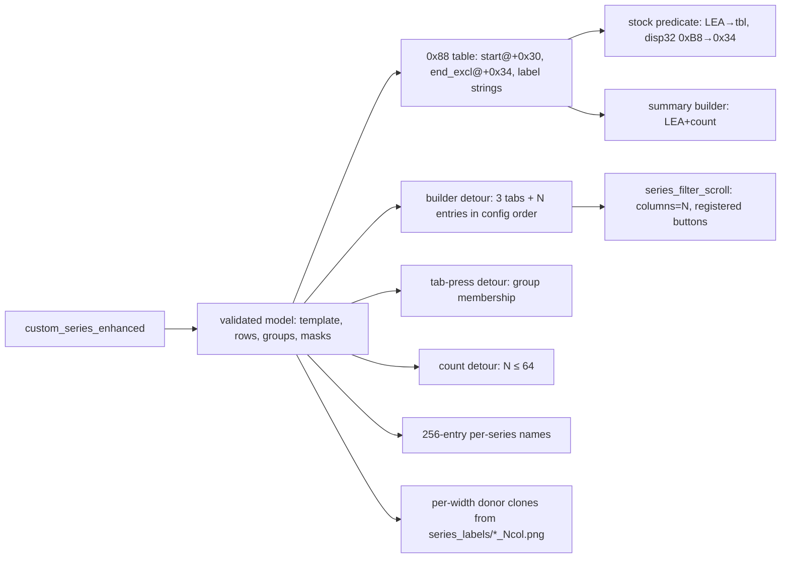

# Orientation — config-defined VERSION (series) filter layout

Blind-spot pass before the decision register. Sources: `docs/filter_menu_system_research.md`
(primary), `docs/series_filter_internals.md`, `src/mods/series_expansion.rs`,
`src/services/series_filter_scroll.rs`, `src/mods/config.rs`, `src/core/signatures.rs`,
`src/services/avs_layeredfs/{atlas_cloner,ifs_textures}.rs`, `scripts/gen_option_labels.py`,
`updater/src/main.rs`, `scripts/build_release_archive.sh`, Ghidra (`gamemdx_20260915.dll`), the
stock label textures (local, untracked extraction at `select_music_option_v3_ifs/tex/`) and a
20260915 `musicdb.xml` (in a sibling project checkout, not in this repo).

## 1. What exists today

`series_expansion` (default ON) is **Strategy A — table extension** (research doc §9.2):
it rebuilds the 0x88-stride VERSION entry table (9 stock rows + `custom_series` rows sorted by
value + sentinel) in a near allocation and byte-patches every consumer:

| # | Site | Purpose |
|---|---|---|
| 1 | series mapper default `xor eax,eax` → `mov eax,esi` | raw ≥ 22 passes through (still 16→15, 0→0) |
| 2 | predicate `LEA R8,[table]` | filtering reads extended table |
| 3/4 | builder loop `MOV ESI,8` / `LEA RBX,[last key]` | builder creates 9+N entry buttons |
| 5 | summary label builder (`"DDR "`-seeded) LEA + count | chip text for custom rows |
| 6 | per-song name table (`"Version / %s"`) → 256-entry table | no OOB on raw ≥ 22 |
| 7 | CalcFlareSkill walk | raw ≥ 22 excluded from flare skill |
| — | thumbnail ARC loop bound `CMP RSI,0x15` → max custom value | loads `data/arc/thumbnail/jacket_thumbnails_<rgn>_<N>.arc` for N ≤ bound |
| — | detour `filter_entry_count_table` → 9+N for category 1 | selections persist in `filtersort/version` u64 |
| — | AFP scroll children into `filter_switch_base01..05` + `series_filter_scroll::configure(2 cols, 9 rows)` | scrolling past 9 grid rows |

Custom label art: donor-clone of `sefi_version_world` (104×20) from PNGs in
`data_mods/custom_series/select_music_option_v3_ifs/tex/`.

## 2. Game mechanics that shape the design (20260915, verified in Ghidra)

**VERSION builder** `FUN_180124220(capture*, std::function<FilterButton*(int)>* factory)`:
1. group tabs g = 2,1,0 via direct tab factory `FUN_180124000(capture, g)`, `SetTemplate(btn, 3)`,
   label `"version_" + group_key`;
2. a `FilterHeader` (1-px full-width row break) pushed into the item GridPanel;
3. entries i = 8…0: `btn = factory(i)` (selection index = i), `SetTemplate(btn, capture+0x48)`
   (stock 2), label `"version_" + table[i].key` → `FilterButton+0xC8`;
4. destroys the factory (`impl->vtbl[3](impl, impl != factory); factory[3] = 0`).
Both factories push the new button into the item GridPanel themselves.

Consequences: display order = descending table index (selection index `N-1-p` for display
position `p`); the loop is do-while (≥ 1 entry always); the entry template comes from the
builder capture.

**Template index == columns.** Template N (`filter_switch_base0N`) = 220/108/72/54/42 px in a
216-px flow ⇒ 1/2/3/4/5 per row. So `num_columns` maps 1:1 onto the template index. Three
72-px tabs fill 216 exactly, so the first entry always wraps even without the `FilterHeader`.
Label canvases (maintainer-supplied): 220×20, 104×20, 64×20, 44×20, 32×20 — donor slots in the
main IFS: `sefi_event_league`, `sefi_version_world`, `sefi_version_gold`, `sefi_title_other`,
`sefi_level_00` (all present in `select_music_option_v3_ifs/tex/`).

**Predicate** `FUN_180123E40(capture{state_owner*, cat}, song)`:
`v = mapper(song)`; for each selected index `i` in the category's `std::list<int>`:
`CMP [i*0x88 + R8 + 0x30], v` then `CMP v, [i*0x88 + R8 + 0xB8]` — i.e. contiguous ranges
`[start_i, start_{i+1})` only. **The second compare's disp32 (`0xB8`) can be repointed to
`0x34`** (4 bytes of padding between the `+0x30` u32 and the `+0x38` std::string), giving every
row its own exclusive end ⇒ arbitrary, overlapping, gapped per-row ranges with the stock
predicate and one 4-byte patch (shape check needed across builds).

**Group-tab press** `FUN_180127810(capture{state, cat, group_table*, g, panel})`: clear
category; add selection indices `[group[g].start, group[g+1].start)`; notify
(`FUN_180137230`). Contiguous index ranges only. Selection primitives available:
`FUN_1801D5740(state, cat)` clear, `FUN_1801D5680(state, cat, idx, on)` set/clear one.

**Series values.** Raw `<series>` u8 at `music::Info+0x138`. The game's own per-series name
table (`gamemdx` .rdata, indexed by raw value) names 20 series over raw 1–21, with **15 and 16
both "DanceDanceRevolution 2014"** (the mapper merges 16→15 for the same reason). musicdb
20260915 counts per raw value: 1:3 2:12 3:14 4:21 5:13 6:6 7:30 8:48 9:81 10:49 11:59 12:66
13:77 14:67 15:60 16:47 17:131 18:87 19:116 20:208 21:289 (1484 songs, no 0 or ≥ 22).

| Raw | Series | Raw | Series |
|---|---|---|---|
| 1 | 1stMIX | 12 | X2 |
| 2 | 2ndMIX | 13 | X3 VS 2ndMIX |
| 3 | 3rdMIX | 14 | 2013 |
| 4 | 4thMIX | 15, 16 | 2014 |
| 5 | 5thMIX | 17 | A |
| 6 | MAX | 18 | A20 |
| 7 | MAX2 | 19 | A20 PLUS |
| 8 | EXTREME | 20 | A3 |
| 9 | SuperNOVA | 21 | WORLD |
| 10 | SuperNOVA2 | | |
| 11 | X | | |

Groups (stock group table + flare thresholds): CLASSIC 1–13, WHITE 14–17, GOLD 18–21.
Raw 0 = no series. The rough idea's example (`1stMIX = 0`) is off by one.

**Stock label look** (sampled from `sefi_version_*`, `sefi_title_*`, `sefi_level_*`):
fill `#00B68C` (0,182,140), left-aligned at x≈0–2, caps on rows 4–16 (baseline y=16, 12-px cap
height), condensed grotesque; long names stack on two smaller lines (`SuperNOVA–/SuperNOVA2`,
`GROUP/GOLD`). The existing custom `world_ruby`/`world_sapphire` art is hand-made 104×20 only.

## 3. Findings that change the idea

1. **Shipping `custom_series_enhanced` in `mod-config.json` enables it for everyone.** The
   release ships `mod-config.json` and the auto-updater merges it into users' configs by
   inserting absent keys (objects recurse, arrays atomic). A committed enhanced block would
   switch every updating user into the experimental layout — the opposite of "undocumented".
2. **Config parse failures are global.** `ConfigFile` is one serde struct; a type error
   anywhere (e.g. in a new `custom_series_enhanced` row) makes `config::init` fall back to
   defaults for **every** mod. `SeriesConfig.custom_series` is also currently required, so a
   config with only the enhanced key would fail the whole file.
3. **Label PNGs must not live in an IFS `tex/` folder.** LayeredFS auto-injects every PNG in
   `<mod>/<ifs>/tex/` whose name isn't a stock texture as its own 1:1 atlas
   (`ifs_textures::list_extra_pngs`). 20 series × 5 widths ⇒ 100 stray atlases on every mount.
4. **Scroll discriminator collides.** `series_filter_scroll` recognises VERSION entries by
   `FilterButton+0xF0 == 2` (template). At `num_columns = 3` entries share template 3 with the
   group tabs (and CLEAR TYPE also uses 2 today).
5. **Persistence is a u64 per category** ⇒ ≤ 64 selectable rows; the persisted bit is the
   selection index, so row order matters for saved filters. The count detour must never report
   > 64 (bit shifts past 63 alias).
6. **The stock builder forces its entry order and ≥ 1 entry**, so `filter_rows: []` and
   "selection index = position in config" both require replacing the builder rather than
   extending its loop (the capture's template field would need rewriting anyway).
7. **SSO limits disappear with the right choices.** Table strings can be non-SSO `std::string`s
   pointing at mod-owned memory (the game only reads them); button label keys stay ≤ 15 bytes if
   the in-game texture name is synthetic per row (`version_cseNN`), so no game-heap strings.
8. **Thumbnail loop bound.** Enhanced rows name ranges, not declared series; a catch-all row
   (e.g. 22–255) would raise the jacket-thumbnail ARC loop to 255, which the existing code notes
   crashed AVS.

## 4. Proposed approach

Keep the legacy path byte-for-byte; add an enhanced mode selected by the presence of
`custom_series_enhanced`:

Shared with legacy: mapper default patch, flare exclusion, AFP scroll children, count detour,
per-song name table, thumbnail bound. Replaced in enhanced mode: builder loop patches (3/4) →
builder detour; contiguous ranges → per-row end field.

## 5. Unknowns (research, Step 4)

- R1 Builder + tab-factory derivation and the factory ownership contract across all supported
  builds (20250805 … 20260915).
- R2 Predicate second-compare disp32 at a fixed offset from `version_predicate_lea` on every
  build (shape diff).
- R3 Tab-press function derivation and the set/clear/notify primitives across builds.
- R4 `FilterButton::CreateVisual` timing relative to label write (scroll registration).
- R5 Atlas cloner with five donors in different parent atlases in one batch.
- R6 Thumbnail loop: safe upper bound / whether custom series ship thumbnail ARCs.
