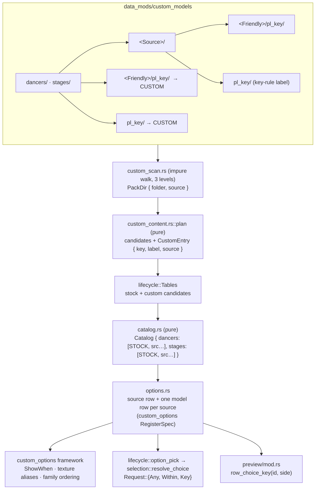
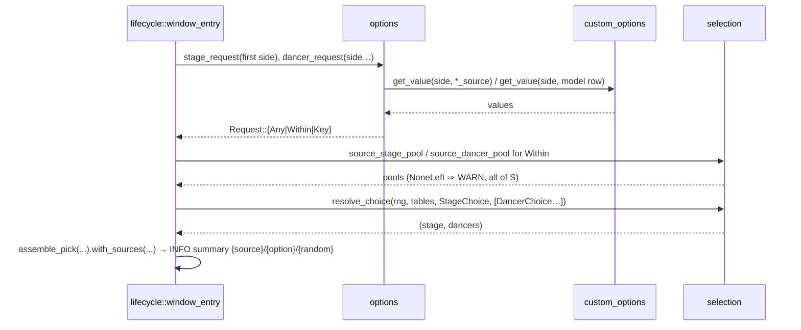

# Detailed Design — Custom dancer / stage SOURCES for Background Dancers

Status: Approved 2026-09-30
Date: 2026-09-30

## 1. Overview

The Background Dancers mod of the DDR World hook DLL renders a 3D stage and dancers behind the lanes
and lets each player choose them through two in-game option rows, **BACKGROUND DANCER** and
**BACKGROUND STAGE**. Custom content under `data_mods/custom_models/{dancers,stages}` is appended to
the stock list in those rows. With 115 custom dancer folders on disk and more dancers and stages
coming, one flat list of ~140 entries makes a specific pick tedious.

This design adds a **source** level to the folder layout and to the menu:

- `data_mods/custom_models/dancers/<Source>/<Character>/pl_<key>/…` makes `<Source>` a **Dancer
  Source** whose pool is only the dancers under it; likewise for stages. The current 2-level layout
  keeps working: anything not under a source folder belongs to an implicit source named **CUSTOM**.
- Two new per-player rows, **DANCER SOURCE** and **STAGE SOURCE**, appear whenever at least one
  custom source of that kind exists. Values: `RANDOM`, `STOCK`, then every discovered source.
- The dancer / stage row a player sees depends on the source they chose (one model row exists per
  source, hidden unless its source is selected). Source `RANDOM` hides the model row entirely and
  draws from everything — exactly today's behaviour. A specific source with model `RANDOM` draws
  within that source, honouring the background-movie screen rule where the source allows it.
- The last pick made under each source is remembered per player.

Nothing in the game's memory changes: as today, the DLL alone reads the model lists, and the option
rows are the DLL's own native rows.

## 2. Detailed Requirements

Consolidated from the accepted decision register.

### 2.1 Folder layout and discovery

- **R1 Source folders.** A directory directly under `dancers/` (or `stages/`) whose name is not a
  model folder (`pl_*` / `mapset_*`) and which contains at least one *friendly folder* is a **source
  folder**. A friendly folder is a non-model directory that itself contains at least one model folder
  or a body / stage `.arc`.
- **R2 Friendly folders inside a source** label their models by folder name (today's rule); model
  folders and `.arc`s directly inside a source folder take the key-rule label (today's root rule).
  Sidecar rlists apply to their own directory, as today.
- **R3 Implicit source CUSTOM.** Models at the root of `dancers/` / `stages/` and friendly folders at
  that root (today's layout) belong to the implicit source labelled `CUSTOM`. A real source folder
  whose slug is `custom` (e.g. `Custom/`) is the same source. The implicit source is omitted when
  nothing lands in it.
- **R4 Source identity.** A source is identified by the **slug** of its folder name (ASCII-lowercased,
  runs of non-`[a-z0-9]` collapsed to `_`, trimmed, capped at 32 bytes). Folders with the same slug
  are one source (label from the first in byte order; one INFO when two spellings merge). The slug
  `source` is reserved and a folder producing an empty slug has no printable name: both are refused
  with one WARN and their content is skipped.
- **R5 Source label** = the folder name through the existing folder-label rule (upper-cased,
  `_` → space, ASCII only, ≤ 15 bytes; a cut is one WARN).
- **R6 Key uniqueness is unchanged**: a model key colliding with stock or an earlier accepted key is
  refused with one WARN, regardless of source.
- **R7 A junk subdirectory** (no models anywhere inside) never promotes its parent to a source and is
  ignored.

### 2.2 Option rows

- **R8 Source rows** `background_dancer_source` / `background_stage_source`: scalar, value `0` =
  `RANDOM`, `1` = `STOCK`, `2..=N+1` = custom sources sorted by label then slug. Registered only when
  N ≥ 1 for that kind; otherwise the kind keeps today's single stock row, always visible.
- **R9 Model rows.** One per source and kind: `background_dancer` / `background_stage` for `STOCK`
  (ids unchanged, so today's stock values keep their meaning), `background_dancer_<slug>` /
  `background_stage_<slug>` per custom source. Value `0` = `RANDOM`, `k ≥ 1` = the source's `k`-th
  entry. Stock entries byte-sorted by key with the key-rule labels (today's block, byte-identical);
  custom entries sorted by label then key (today's rule). Coarse step 5 on model rows, 1 on source rows.
- **R10 Visibility.** Each model row shows only while its source row equals its source's value
  (`ShowWhen::Equals`). Source `RANDOM` ⇒ no model row visible.
- **R11 Row labels and preview chrome.** Every model row renders the `BACKGROUND DANCER` /
  `BACKGROUND STAGE` label and the same preview chrome as the stock row. Source rows render
  `DANCER SOURCE` / `STAGE SOURCE` labels (new art) and borrow the kind's preview chrome.
- **R12 Menu order.** A source row sits immediately above the model rows it controls even when the
  operator's `option_menu_settings` lists only the old ids (`background_dancer`,
  `background_stage`): unlisted rows that belong to a `ShowWhen` family are placed adjacent to the
  family's listed member. The shipped `mod-config.json` also lists the two source ids.
- **R13 Persistence.** All rows persist locally (JSON cache only, never the network) with the
  existing per-row load clamp (out-of-range ⇒ `RANDOM`). Source rows default to `RANDOM`. Cached
  `background_dancer` values above the stock count (old custom entries) load as `RANDOM`.
- **R14 Versus.** The stage source row and every stage model row are cabinet-wide (mirrored across
  sides while both are entered), as the stage row is today. Dancer rows stay per side.
- **R15 Live enable / disable** behave as today: rows registered at enable (re-shown on a
  `Duplicate`), hidden at disable; label textures for a live first enable appear at the next launch.

### 2.3 Per-song pick

- **R16 Source RANDOM** ⇒ that element draws exactly as today (uniform over every dancer; stage from
  the screen-rule pool over every stage). With every element `RANDOM` the RNG draw sequence is
  identical to the current one under the same seed.
- **R17 Source S, model RANDOM** ⇒ uniform within S (`STOCK` is a source). Dancers: uniform over S's
  dancers. Stage: S's rows kept by the screen rule (`STAGE SCREENS` + movie plays ⇒ screens only;
  otherwise no screens); when none of S qualifies, all of S, with one WARN naming S.
- **R18 Source S, model M** ⇒ M, never screen-filtered (today's rule for a chosen stage).
- **R19 Stale requests** (a cached value naming a key or source no longer present) fall back to
  `RANDOM` for that element with one WARN, as today.
- **R20 The pick summary log** names the provenance of each element: `{random}` / `{source}` /
  `{option}` / `{pin}`.

### 2.4 Preview

- **R21** A focused model row previews its own value (today). A focused source row previews the
  side's *effective* pick for that source: the model row's dancer / stage when non-`RANDOM`, else the
  `RANDOM` badge. Source `RANDOM` focused ⇒ badge.

### 2.5 Out of scope

- Moving the tracked content into source folders (maintainer, after the code lands; moved folders
  re-pack their cache arcs once at the next boot because the source path is part of the cache name).
- Any change to which sides' rows are read (the entered-side list, bot exclusions) or to the
  `custom_content` toggle (still next-launch, still the scan gate).

### 2.6 Assumptions

- The option framework's value text is re-pushed every render tick, so a label that depends only on
  the row's own value is always fresh (true today; the design does not rely on cross-row labels).
- `custom_options::get_value` is safe from the render thread and the game thread (documented; the
  preview driver already uses it).
- N (custom sources per kind) stays small (single digits to low tens); every registered row allocates
  one native row object per form open per side, hidden rows included.

## 3. Architecture Overview



Layers, unchanged in kind: `custom_scan.rs` is the only file that touches the filesystem;
`custom_content.rs`, `sources.rs`, `catalog.rs`, `selection.rs`, `pick.rs` stay dependency-free
and host-tested; `options.rs`, `lifecycle.rs`, `preview/mod.rs` are engine-facing and
cabinet-validated. The framework (`src/services/custom_options/`) gains two small, general
capabilities: texture aliases on a row and family-aware ordering.

## 4. Components and Interfaces

### 4.1 `sources.rs` — NEW pure module (`src/mods/background_dancers/sources.rs`)

Dependency-free (std only), mounted in the host harness.

```rust
/// The implicit source for legacy placements; also the folder name that merges into it.
pub const IMPLICIT_SOURCE: &str = "Custom";
/// Slugs that would collide with the source rows' own ids.
pub const RESERVED_SLUGS: &[&str] = &["source"];
pub const MAX_SLUG_BYTES: usize = 32;

/// A resolved source: stable id + display label.
#[derive(Debug, Clone, PartialEq, Eq)]
pub struct SourceRef { pub slug: String, pub label: String }

/// `[^a-z0-9]+` → `_` on the ASCII-lowercased name, trimmed of `_`, ≤ MAX_SLUG_BYTES; `None` when empty.
pub fn slug(name: &str) -> Option<String>;

/// The source for a folder name (`None` = the implicit source). Err(reason) for a reserved or
/// unprintable name — the caller WARNs and skips that folder's content.
pub fn resolve_source(folder: Option<&str>) -> Result<SourceRef, String>;

/// A planned custom entry the catalog groups: one accepted dancer or stage.
#[derive(Debug, Clone, PartialEq, Eq)]
pub struct CustomEntry { pub key: String, pub label: String, pub source: SourceRef }

/// Directory classification from names alone (the impure walker supplies the booleans).
#[derive(Debug, Clone, Copy, PartialEq, Eq)]
pub enum DirRole { Model, Source, Friendly, Ignored }
pub fn dir_role(is_model_folder: bool, has_friendly_child: bool, has_model_content: bool) -> DirRole;
/// A listing holds model content when any dir is a model folder or any file is a body/part/stage arc.
pub fn has_model_content(files: &[String], dirs: &[String], is_model_folder: impl Fn(&str) -> bool,
                         is_model_arc: impl Fn(&str) -> bool) -> bool;

/// Option-row ids. `base` is "background_dancer" / "background_stage".
pub fn source_row_id(base: &str) -> String;                 // "{base}_source"
pub fn model_row_id(base: &str, slug: Option<&str>) -> String; // base for STOCK, "{base}_{slug}" otherwise
```

`resolve_source(None)` = `Ok(SourceRef { slug: "custom", label: "CUSTOM" })`; `resolve_source(Some(f))`
= slug(f) + `label_from_folder(f)` fitted to 15 bytes (both from `custom_content`; `sources.rs`
receives the label helper by import — the two files are siblings, mutual imports are fine).

### 4.2 `custom_scan.rs` — the walk becomes three levels deep

`walk_kind_root(root) -> Vec<PackDir>`:

1. List `root`. Model folders + files at the root ⇒ `PackDir { folder: None, source: None }` (today).
2. For every non-model directory `d` at the root, list it. For each non-model subdirectory `f` of
   `d`, list `f` once more and compute `has_model_content(f)`. Then
   `dir_role(false, any f has model content, has_model_content(d))`:
   - `Source` ⇒ `PackDir { folder: None, source: Some(d) }` for `d`'s own files / model folders, plus
     `PackDir { folder: Some(f), source: Some(d) }` for every friendly `f`;
   - `Friendly` ⇒ `PackDir { folder: Some(d), source: None }` (today's 2-level layout);
   - `Ignored` ⇒ nothing.

`PackDir` gains `pub source: Option<String>` (the source folder's name as written). One extra
`read_dir` per friendly folder (≈115 today) at enable — negligible. Logging is unchanged in shape; the
"custom content -- N dancer(s) + M stage(s)" INFO gains a per-source breakdown
(`… in 3 source(s): DDR STRIKE 45, UMX2 6, CUSTOM 5`).

### 4.3 `custom_content.rs` — the planner carries the source

- `Plan.labels: Vec<(String, String)>` becomes `Plan.entries: Vec<CustomEntry>`.
- At the top of each `PackDir`, `resolve_source(dir.source.as_deref())`; `Err(reason)` ⇒ one WARN
  per distinct source folder (`{folder:?}: {reason} -- its content is skipped`) and every arc of that
  `PackDir` is skipped. Accepted entries push `CustomEntry { key, label, source }`; key-rule labels
  (pending) resolve after the pass exactly as today, then land in `entries` with their source.
- Two folders resolving to the same slug with different spellings ⇒ one INFO note
  (`sources {:?} and {:?} merge as {label}`).
- Module `//!` layout block documents the `<Source>/` level, the implicit `CUSTOM`, the reserved slug
  and the merge rule.

### 4.4 `catalog.rs` — grouped by source

```rust
pub struct CatalogEntry { pub key: String, pub label: String }        // unchanged
pub struct SourceCatalog {
    /// `None` = STOCK.
    pub slug: Option<String>,
    pub label: String,               // "STOCK", "CUSTOM", "DDR STRIKE", …
    pub entries: Vec<CatalogEntry>,
}
pub struct Catalog { pub dancers: Vec<SourceCatalog>, pub stages: Vec<SourceCatalog> }

impl Catalog {
    pub fn sources(&self, kind: Kind) -> &[SourceCatalog];          // [0] is always STOCK
    pub fn has_custom(&self, kind: Kind) -> bool;                    // sources(kind).len() > 1
    pub fn source_count(&self, kind: Kind) -> usize;                 // the source row's max value
    pub fn source_label(&self, kind: Kind, value: i32) -> Option<&str>; // 0 RANDOM, 1 STOCK, 2.. custom
    pub fn count(&self, kind: Kind, source: usize) -> usize;         // a model row's max value
    pub fn entry(&self, kind: Kind, source: usize, value: i32) -> Option<&CatalogEntry>;
    pub fn label(&self, kind: Kind, source: usize, value: i32) -> Option<&str>;  // RANDOM for 0
    pub fn key(&self, kind: Kind, source: usize, value: i32) -> Option<&str>;
    pub fn keys(&self, kind: Kind, source: usize) -> Vec<String>;   // the within-source pool
}

pub fn build_catalog(stages, dancers) -> Catalog;                  // stock only (one source each)
pub fn build_catalog_with_custom(stages, dancers, custom: &[CustomEntry]) -> Catalog;
pub fn clamp_to_catalog(value: i32, count: usize) -> i32;          // unchanged
```

`build_catalog_with_custom`: the STOCK source is exactly today's stock block (keys not in `custom`,
byte-sorted, key-rule labels). Custom entries whose key is a candidate of that kind are grouped by
`source.slug`; sources sorted by `(label, slug)`; entries within a source sorted by `(label, key)`,
deduplicated by key, labels fitted to 15 bytes. The source row's value `v ≥ 2` names
`sources(kind)[v - 1]`.

### 4.5 `options.rs` — rows over the grouped catalog

Process-wide, built once with the catalog (`OnceLock`, as `CATALOG` is today):

```rust
enum RowRole { Source, Model { source: usize } }
struct RowInfo { id: &'static str, kind: Kind, role: RowRole }   // ids leaked once per process
static ROWS: OnceLock<Vec<RowInfo>>;
```

Registration (`register(built: Catalog) -> bool`), per kind in `[Dancer, Stage]`:

1. `preview_gen::generate_chrome(base_id)` (today) — the one chrome every row of the kind aliases.
2. If `has_custom(kind)`: register the source row
   `RegisterSpec::scalar(source_id, 0, source_count, 1, ScalarFormat::Dynamic(label))
    .step_coarse(1).default_value(0).persist_mode(Local).persist_transform(identity, clamp_load)
    .in_game_only().display_name("Dancer Source").description(…).preview_texture_like(base_id)`.
3. For each source `i` (STOCK first): the model row
   `RegisterSpec::scalar(model_id(i), 0, count(kind, i), 1, Dynamic(label)).step_coarse(5)
    .default_value(0).persist_mode(Local).persist_transform(identity, clamp_load).in_game_only()
    .display_name(…).description(…).label_texture_like(base_id).preview_texture_like(base_id)`
   with `.show_when(ShowWhen::Equals { parent_id: source_id, value: i + 1 })` when the source row
   exists, `ShowWhen::Always` otherwise (today's shape).
4. `Err(Duplicate)` ⇒ `set_option_available(id, true)` (re-enable this boot); any other error ⇒ WARN,
   rows of that kind are not read (`ROWS_LIVE` stays false — fail-open to random picks, as today).
5. `versus_mirror::register(&stage_ids)` (source row + every stage model row); subscribe the mirror
   observer once (`custom_options::subscribe_value_changed`): for `(id, side, value)` with `id` a
   registered stage row and `rows_live()`, call `versus_mirror::mirror_edit(id, side, value)`. The
   observer receives the id (the `on_change` fn pointer does not), runs with no framework lock held,
   and terminates through `set_value`'s unchanged-value check exactly like the `on_change` tail did.
6. `ROWS_LIVE = true`; one INFO listing the rows (`DANCER SOURCE (3 sources) / BACKGROUND DANCER ×4
   rows (26 / 45 / 6 / 5 entries) / …`).

The per-side atomics go away: every reader uses `custom_options::get_value(side, id)`. `on_change`
is the framework default.

Pure per-id functions (all `fn` pointers, no captures):

- `label(id, value) -> Option<String>`: source row ⇒ `source_label`; model row ⇒ `label(kind, i, v)`.
- `clamp_load(id, value) -> i32`: `clamp_to_catalog(value, count_for(id))`.

Readers:

```rust
pub fn kind_for_option(id: &str) -> Option<Kind>;      // every row of the mod, source rows included
pub fn rows_live() -> bool;
pub fn set_available(available: bool);                 // all rows; (un)register the stage ids

/// What the pick path asks for, per element.
pub enum Request {
    Any,                                              // source RANDOM (or no rows) — today's path
    Within { source: String, keys: Vec<String> },     // source S, model RANDOM
    Key(String),                                      // an explicit model
}
pub fn dancer_request(side: u8) -> Request;
pub fn stage_request(side: u8) -> Request;

/// The key a focused row previews (R21): a model row's own value; a source row's effective pick.
pub fn row_choice_key(id: &str, side: u8) -> Option<String>;
```

Request resolution for `(kind, side)`: `sv = get_value(side, source_id)` (`Some(1)` when no source
row is registered). `sv == 0` ⇒ `Any`. Else `i = sv - 1`; `mv = get_value(side, model_id(i))`;
`mv == 0` ⇒ `Within { source: label_i, keys: keys(kind, i) }`; `mv ≥ 1` ⇒ `Key(entry.key)`;
anything out of range ⇒ `Any` (defensive; the clamps make it unreachable).

### 4.6 `selection.rs` — per-element random pools

```rust
pub enum StageChoice<'a>  { Key(&'a str), Random(&'a [StageCandidate]) }
pub enum DancerChoice<'a> { Key(&'a str), Random(&'a [DancerCandidate]) }

/// Key ⇒ uniform over that key's rows (stage) / that candidate (dancer), looked up in the full
/// tables; Random(pool) ⇒ pick_stage(pool) / one uniform draw over pool. Unknown key or empty pool
/// ⇒ None. With Random(global pools) everywhere the draws are exactly pick_stage + pick_dancers.
pub fn resolve_choice(rng, stages: &[StageCandidate], dancers: &[DancerCandidate],
                      stage: StageChoice, dancer_choices: &[DancerChoice])
    -> Option<(StageCandidate, Vec<DancerCandidate>)>;

/// The within-source stage pool: S's rows kept by the screen rule, else all of S (NoneLeft).
pub fn source_stage_pool(stages: &[StageCandidate], keys: &[String], keep: impl Fn(&str) -> bool) -> StagePool;
pub fn source_dancer_pool(dancers: &[DancerCandidate], keys: &[String]) -> Vec<DancerCandidate>;

pub enum PickSource { Random, Source, Option, Pin }   // Source: "random within a source", tag "source"
```

`source_stage_pool` filters the table to `keys` and reuses `random_stage_pool` over that subset, so
`StagePool::All / Filtered / NoneLeft` keep their meaning relative to the source.

### 4.7 `lifecycle.rs`

- `Tables.custom_labels: Vec<(String, String)>` → `Tables.custom: Vec<CustomEntry>`;
  `custom_labels_snapshot()` → `custom_entries_snapshot()`.
- `option_pick(rng, t, random_stages, sides, arc_exists)`: reads `stage_request(first side)` and
  `dancer_request(side)` per entered side; all `Any` ⇒ `None` (plain random path, today). Otherwise:
  - `Key(k)` unknown in the tables ⇒ WARN + `Any` for that element (R19);
  - stage `Within` ⇒ `source_stage_pool(&t.stages, &keys, screen_filter)`; `NoneLeft` ⇒ WARN
    `no stage in source {S} matches ({filter}); drawing from all {n} of {S}`; the pool rows are the
    `StageChoice::Random` slice;
  - dancer `Within` ⇒ `source_dancer_pool`; empty ⇒ WARN + `Any`;
  - `Any` ⇒ `Random(random_stages)` / `Random(&t.dancers)`.
  Provenance per element: `Any` → `PickSource::Random`, `Within` → `Source`, `Key` → `Option`.
- The per-song "random stage pool" INFO is unchanged for `Any`; a `Within` stage logs its own line
  naming the source and the kept/excluded counts.

### 4.8 `preview/mod.rs`

`on_preview_request(side, option_id)`: `kind = options::kind_for_option(option_id)`;
`wanted = options::row_choice_key(option_id, side).map(|k| (kind, k))`. Everything downstream
(badge when focused and nothing wanted, settle, teardown) is unchanged. `marker_for(kind)` keeps
reading the kind's base chrome.

### 4.9 Framework: `src/services/custom_options`

**Texture aliases (`api.rs`, `registry.rs`, `mod.rs`).**

```rust
// RegisterSpec (+ RegisteredOption)
pub label_texture_like: Option<&'static str>,    // row label rendered from seop_item_<alias>
pub preview_texture_like: Option<&'static str>,  // preview box chrome from seop_image_<alias>
pub fn label_texture_like(self, id: &'static str) -> Self;
pub fn preview_texture_like(self, id: &'static str) -> Self;
```

`RegisteredOption::label_texture_name()` and `preview_image_base_name()` use the alias when set;
`preview_image_name_for_value` / `preview_image_names` already build on the base name.
`register_option` registers the label atlas entry under the label stem (alias or id) — `asset_gen`
dedups — so N rows sharing one alias cost one atlas slot.

**Family-aware ordering (`ordering.rs`, `builder_hook.rs`, `registry.rs::overlay_snapshot_rows`).**

`compute_order(registered, is_header, parent: &[Option<usize>], configured)`, where `parent[i]` is
the snapshot index of `registered[i]`'s `ShowWhen` parent (`None` when it has none or the parent is
not in the snapshot). Listed ids are placed first, as today. Each unlisted non-header, in
registration order:

1. its parent is already placed ⇒ insert immediately after the last placed member of that family
   (the parent or any placed sibling);
2. else, one of its own children is already placed ⇒ insert immediately before the first placed child;
3. else ⇒ append (today's behaviour).

The unconfigured fast path (identity minus headers) is untouched. Both callers build the `parent`
slice from `state.options[i].show_when` → `state.index_of(parent_id)` → position in their snapshot.

### 4.10 Assets and config

- `scripts/option_strings.py`: `LABELS["background_dancer_source"]` (`DANCER SOURCE` / `背景ダンサー
  ソース` / `배경 댄서 소스`) and `LABELS["background_stage_source"]` (`STAGE SOURCE` / `背景ステージ
  ソース` / `배경 스테이지 소스`); `scripts/gen_option_labels.py` renders the six PNGs into the three
  `data_mods/custom_options/select_music_option_lang_*_v3_ifs/tex/` dirs. No `_TEMPLATE` for the
  source rows (they alias the kind's chrome).
- `mod-config.json` (shipped): `option_menu_settings` lists `background_dancer_source` before
  `background_dancer` and `background_stage_source` before `background_stage` (`overlay: false`,
  `in_game: true`).
- `scripts/validate_background_dancers.sh`: mount `sources.rs`.

## 5. Data Models

### 5.1 Folder layout contract (replaces the 2-level contract)

```text
data_mods/custom_models/dancers/
  <Source>/                          source folder (any name; slug = id, label ≤ 15 bytes)
    <Friendly>/pl_<key>/…            dancer labelled <FRIENDLY>, in source <Source>
    <Friendly>/pl_<key>_<part>/…     optional accessory parts (same folder as the body)
    <Friendly>/chara_resources.rlist optional sidecar (or .rlist.txt), applies to this folder
    pl_<key>/…                       dancer labelled by the key rule, in source <Source>
    chara_resources.rlist            optional sidecar for the flat models of <Source>
  <Friendly>/pl_<key>/…              dancer labelled <FRIENDLY>, in source CUSTOM   (today's layout)
  pl_<key>/…                         dancer labelled by the key rule, in source CUSTOM
data_mods/custom_models/stages/      the same shape with mapset_<key>/ folders and the map / camera sidecars
```

Model folder contents (the add-on export or a literally unpacked arc), the key rule, sidecar grammar,
`_g` handling and the cache-arc packing are unchanged.

### 5.2 Row ids and values

| Row | Id | Values | Visible when | Mirrored |
|---|---|---|---|---|
| Dancer Source | `background_dancer_source` | 0 RANDOM · 1 STOCK · 2… sources by label | ≥ 1 custom dancer source | no |
| Dancer (STOCK) | `background_dancer` | 0 RANDOM · 1..26 stock (today's values) | source = 1 (or always, no sources) | no |
| Dancer (source S) | `background_dancer_<slug>` | 0 RANDOM · 1..count(S) | source = index(S)+1 | no |
| Stage Source | `background_stage_source` | as above | ≥ 1 custom stage source | yes |
| Stage (STOCK) | `background_stage` | 0 RANDOM · 1..25 stock | source = 1 (or always) | yes |
| Stage (source S) | `background_stage_<slug>` | 0 RANDOM · 1..count(S) | source = index(S)+1 | yes |

All rows: scalar, `PersistMode::Local` (`custom_options.p1/p2.<id>` in `mod-config.json`), load clamp
to `0..=max`, in-game only. A removed source leaves a stale key in the JSON that the framework
ignores on load and drops at the next write.

### 5.3 Request → draw

| Source row | Model row | Request | Stage draw | Dancer draw | Tag |
|---|---|---|---|---|---|
| RANDOM | (hidden) | `Any` | screen-rule pool over all stages (today) | uniform over all (today) | `random` |
| S | RANDOM | `Within(S)` | S ∩ screen rule; empty ⇒ all of S + WARN | uniform over S | `source` |
| S | M | `Key(M)` | M's rows, never filtered | M | `option` |

Dancer requests resolve per entered side; the stage request is the first entered side's (mirrored in
versus). The developer pin still wins over everything.

### 5.4 Sequence — one song



## 6. Error Handling

Every failure degrades to today's behaviour and logs once; nothing panics on a hook path.

| Condition | Behaviour |
|---|---|
| Source folder name unprintable (empty slug) or slug reserved (`source`) | WARN `…: <reason> -- its content is skipped`; the folder's models are not loaded |
| Two source folders with the same slug | Merge into one source (INFO naming both spellings) |
| Source label longer than 15 bytes | Cut + WARN (today's `fit_label`) |
| Model key already present (stock / earlier folder, any source) | WARN + skipped (today) |
| Junk subdirectory | Ignored silently |
| No custom source of a kind | No source row; today's single stock row, always visible |
| Row registration fails (`NotInitialized`, `UnknownParent`, …) | WARN; `ROWS_LIVE` false ⇒ picks stay random (today) |
| `Duplicate` (mod re-enabled this boot) | `set_option_available(id, true)` per row |
| Cached value out of a row's range | `RANDOM` at load (existing clamp) |
| Cached key for a removed row id | Ignored by the framework on load; dropped at the next cache write |
| Request names an unknown key / a source with no loadable entries | WARN + `Any` for that element |
| `Within` stage pool empty under the screen rule | WARN naming the source; draw from all of the source |
| Preview: unknown row id | `kind_for_option` ⇒ `None` ⇒ no badge, no preview (today) |
| Family ordering: parent not in the snapshot | `parent[i] = None` ⇒ today's append rule |

## 7. Testing Strategy

Pure logic is host-tested; engine wiring is cabinet-validated (the repo has no harness for it).

### 7.1 Host tests — `scripts/validate_background_dancers.sh`

- `sources.rs`: `slug` (`"DDR STRIKE" → ddr_strike`, `"J.C." → j_c`, cap, empty), `resolve_source`
  (`None` ⇒ CUSTOM/custom; `Some("Custom")` ⇒ the same; reserved `Source`; unprintable), `dir_role`
  truth table, `has_model_content` (model folder / body arc / part arc / stage arc / nothing),
  `source_row_id` / `model_row_id`.
- `custom_content.rs` planner: a 3-level fixture (source with two friendlies + one flat model +
  source-level sidecar), a root friendly (⇒ CUSTOM), a root flat model (⇒ CUSTOM), a `Custom/` source
  merging with the implicit one, a refused source (reserved slug) whose arcs never mount, key collision
  across sources refused, `entries` carry the right `SourceRef`, existing tests migrated from `labels`.
- `catalog.rs`: STOCK source byte-identical to today's `build_catalog` (26 / 25, same labels, same
  values); custom sources sorted by label then slug; entries within a source sorted by label then key;
  `source_label` (0/1/2…); `count/entry/label/key/keys` per source; entries for non-candidate keys
  dropped; `clamp_to_catalog` unchanged.
- `selection.rs`: `resolve_choice` with `Random(global)` everywhere reproduces `pick_stage` +
  `pick_dancers` under the same seed (existing test migrated); `Key` unknown ⇒ `None`; `Random(pool)`
  draws only from the pool; `source_stage_pool` returns `All` / `Filtered` / `NoneLeft` relative to the
  source; `source_dancer_pool` preserves table order.
- `pick.rs`: summary renders `{source}`.

### 7.2 Host tests — `scripts/validate_custom_options.sh`

- `ordering.rs`: the shipped-config scenario (listed `background_dancer`, `background_stage`;
  unlisted source rows + per-source rows) yields
  `[…, dancer_source, dancer, dancer_x, dancer_y, stage_source, stage, stage_x, …]`; unconfigured
  stays identity; a parent outside the snapshot falls back to append; headers unaffected (R10 rule
  intact); a listed parent with unlisted children (training-mode shape) keeps children after it.
- `registry.rs`: alias resolution for `label_texture_name` / `preview_image_base_name` /
  `preview_image_names`; no alias ⇒ unchanged names (existing header test still passes).

### 7.3 Readiness gate and cabinet validation

`cargo check --target x86_64-pc-windows-msvc` → `cargo fmt` → `./build.sh` → both harnesses green.
Deploy DLL **and** `data_mods/` (new label PNGs) + the shipped `mod-config.json` change. Observe in
spice2x `log.txt`:

1. Boot: `custom content -- N dancer(s) + M stage(s) … in K source(s): …`, the rows INFO, no WARNs
   for the untouched legacy layout (everything under CUSTOM).
2. Options modal: DANCER SOURCE / STAGE SOURCE rows directly above their model rows; stepping the
   source swaps the model row on the same frame; RANDOM hides it; labels render (`RANDOM`, `STOCK`,
   `CUSTOM`, source names); coarse step on model rows.
3. Preview: model row focused previews its value; source row focused previews the effective pick /
   badge (R21).
4. Songs: `{random}` with source RANDOM; `{source}` with S + RANDOM (the WARN when S has no screen
   stage on a movie song, then a stage of S); `{option}` with an explicit pick.
5. Versus: P1's stage source edit mirrors to P2 (and its model row follows); dancer rows independent.
6. Reboot: every row value persists; a value cached under an id whose source folder was removed is
   dropped from `mod-config.json` at the next save.
7. After the maintainer moves content into source folders: one-time repack INFOs, sources appear,
   labels without the old prefixes.

## Appendix A — Alternatives considered

- **One model row per kind, re-bounded per source.** Rejected: the framework stores scalar bounds per
  option (not per side) and its label / load-clamp callbacks receive no side, so two players on
  different sources cannot share a row; it would also have to reset to RANDOM on every source change
  (value 3 means a different dancer under every source), losing the per-source memory this design
  gets for free.
- **Encoding source × model in one value with a stride.** Rejected: breaks the stepper and the row's
  position marker, and still needs per-side bounds.
- **Requiring source folders (no implicit source).** Rejected: breaks every existing install and the
  documented `data_mods/custom_models/<Friendly>/` contract.
- **Skipping the second of two same-slug source folders.** Refined to merging: two spellings with one
  slug also share one label, so two rows would be indistinguishable; merging is what the `Custom/`
  folder already needs.
- **Editing the shipped config only, no ordering rule.** Rejected: existing installs keep their own
  `option_menu_settings` (operator-owned, never rewritten), so the source rows would land at the
  bottom of the menu there.

## Appendix B — Why the mirror moves to an observer

`RegisterSpec::on_change` is a plain `fn(side, value)`; it cannot know which of N runtime-named stage
rows it belongs to, and `versus_mirror::mirror_edit(id, side, value)` needs the id. The framework's
value-changed observer (`subscribe_value_changed`) delivers `(id, side, value)` after every mutation
(press path, `set_value`, loads) with no framework lock held, and `set_value`'s unchanged-value check
terminates the P1 → P2 → P1 echo at depth one exactly as it does for the `on_change` tail today.
