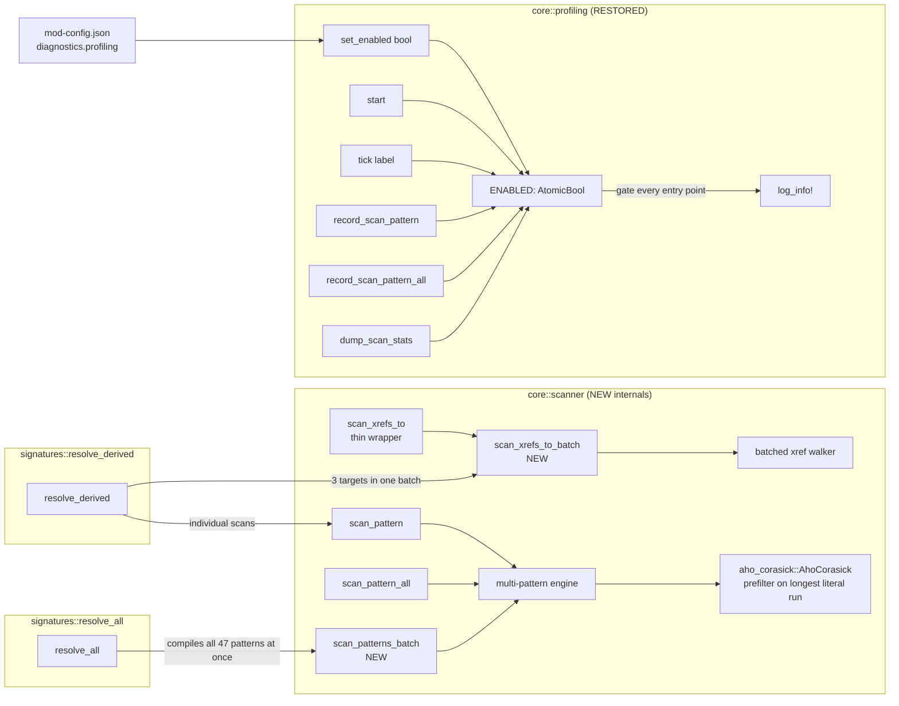

# Detailed Design: Centralized Scanner + Permanent Profiling

> Status: Draft (2026-05-22). Companion to
> `../../20260522-dll-init-speedup/` — that prior feature
> identified scanning as a *future* bottleneck (not the current
> 2026-05-22 bottleneck) and deferred the scanner refactor. This
> design lands it now, ahead of a planned 20+ mod expansion.

## Overview

The DLL's signature-resolution architecture today is O(N×M)
where N = pattern count and M = module bytes (~50 MB). At
N=47 that's measurable but acceptable (~120 ms). At
N=100-150 (post-expansion target) it becomes a user-visible
hitch.

This design lands three coordinated changes:

1. **Multi-pattern single-pass scanner** — replace the byte-by-
   byte loop in `scan_pattern` / `scan_pattern_all` internals
   with an Aho-Corasick prefilter on each pattern's longest
   contiguous wildcard-free literal, then verify on candidate
   hits. Existing call sites unchanged.
2. **Batched xref walk** — replace the three independent
   `scan_xrefs_to` calls in `signatures::resolve_derived` with
   a single multi-target pass.
3. **Permanent profiling** — restore the diagnostic
   instrumentation from the prior feature, gated behind a new
   `"diagnostics": { "profiling": true }` mod-config flag.
   When disabled, zero log output and zero hot-path overhead.

## Detailed Requirements

### R1. Multi-pattern scanner (Q1, Q2, Q4)

- The public API of `core/scanner.rs` is unchanged:
  `scan_pattern(base, size, pattern) -> Option<ScanResult>` and
  `scan_pattern_all(base, size, pattern) -> Vec<ScanResult>`
  remain.
- Their internals replace the byte-by-byte first-byte-prefilter
  loop with an `aho-corasick` based engine.
- The new internal engine compiles the pattern's longest
  contiguous wildcard-free byte run into an Aho-Corasick
  automaton and runs it against the module bytes. Each hit is
  verified against the full pattern (including wildcards). For
  `scan_pattern`, the first verified match wins. For
  `scan_pattern_all`, every verified hit is collected.
- A new private function `scan_patterns_batch(base, size,
  patterns: &[(name, pattern)]) -> HashMap<name, ScanResult>`
  is added for `signatures::resolve_all` to consume directly,
  bypassing the per-pattern overhead of compiling N separate
  automata. This is the highest-value optimization site.
- Wildcards are encoded by splitting each pattern into runs of
  literal bytes; we use the **longest** run as the prefilter
  needle. Patterns with very short runs (e.g. `??  ?? 41`)
  fall back to an alternative needle selection (longest run
  even if not first), but if no run ≥ 2 bytes exists the
  pattern is rejected at construction time and a warning is
  logged.

### R2. Batched xref walk (Q1)

- `core/scanner.rs` gains a new function
  `scan_xrefs_to_batch(base, size, targets: &[*const u8])
  -> Vec<Vec<*const u8>>` that returns, for each target, the
  list of `CALL rel32` site addresses targeting it.
- `signatures::resolve_derived` is restructured to collect all
  xref targets it needs (currently 3: folder_register,
  file_manager_load, metadata_insert) into one slice, call the
  batch function once, and split the results back to each
  derivation chain.
- The existing `scan_xrefs_to(base, size, target)` (single
  target) is kept as a thin wrapper around `_batch` for any
  ad-hoc use.

### R3. Permanent profiling (Q3, Q5)

- `src/core/profiling.rs` is recreated (mostly identical to the
  stashed version) with one architectural change: a
  process-wide `static AtomicBool ENABLED` that all entry
  points check first. When `false`, every public function
  becomes a no-op.
- `mods::config::ConfigFile` gains a `diagnostics: Option<DiagnosticsConfig>`
  field where `DiagnosticsConfig { profiling: bool }`.
- After `mods::config::init()` runs, a single line in
  `lib.rs::init` calls `profiling::set_enabled(...)` reading
  the flag. From that point forward, every `profiling::tick`
  / `record_scan_pattern` / `dump_scan_stats` call respects
  the flag.
- The `profiling::start()` call in `lib.rs::init` must run
  *before* `mods::config::init()` (we want module_load timing
  available even when the flag is off — the call records
  the start `Instant` but emits no log line if disabled).
  The first user-visible log line is produced by the first
  `tick` after the enabled flag is set.

### R4. Acceptance criteria (Q6)

All four must hold with `"diagnostics": { "profiling": true }`
on a real cabinet boot:

1. `[init-prof] resolve_all` < 30 ms (down from 119 ms).
2. `[init-prof] resolve_derived` < 200 ms (down from 729 ms).
3. With `profiling: false` (or missing), `log.txt` contains
   zero `[init-prof]` lines.
4. Total init time on warm boot < 1500 ms (down from ~2000 ms).

## Architecture Overview



The scanner public API stays the same; the engine underneath
becomes O(M + total_hits) where M is module size, replacing
today's O(N×M).

## Components and Interfaces

### `core::scanner::scan_patterns_batch` (new)

```rust
// src/core/scanner.rs

/// Scan a memory region for many named patterns in a single pass.
///
/// Returns a HashMap mapping each pattern's name to its first
/// match, or omitted entirely if the pattern doesn't match. This
/// is the highest-value entry point for `signatures::resolve_all`
/// because it amortizes the multi-pattern engine's setup cost
/// across all known patterns.
///
/// # Safety
/// `base..base+size` must be readable.
pub fn scan_patterns_batch(
    base: *const u8,
    size: usize,
    patterns: &[(&str, &str)], // (name, pattern_string)
) -> HashMap<String, ScanResult> {
    // 1. Parse each pattern, extract longest contiguous literal run + offset within pattern.
    // 2. Build an aho_corasick::AhoCorasick over the literal runs.
    // 3. Single pass: for each AC hit, look up the pattern that owned that needle,
    //    back-step by the needle's offset within the pattern, run full-pattern verify.
    // 4. Record first match per pattern.
}
```

The single-pattern entries become trivial wrappers:

```rust
pub fn scan_pattern(base: *const u8, size: usize, pattern: &str) -> Option<ScanResult> {
    let map = scan_patterns_batch(base, size, &[("", pattern)]);
    map.into_values().next()
}
```

`scan_pattern_all` keeps a slightly different internal structure
because it must collect every hit, not just the first. Its body
also uses Aho-Corasick over the pattern's longest literal run,
but accumulates every verified match instead of returning early.

### `core::scanner::scan_xrefs_to_batch` (new)

```rust
// src/core/scanner.rs

/// Walk the module once collecting `CALL rel32` sites targeting
/// any of the given targets. Returns a vec-of-vecs: index `i`
/// holds the call sites targeting `targets[i]`.
///
/// # Safety
/// `base..base+size` must be readable.
pub unsafe fn scan_xrefs_to_batch(
    base: *const u8,
    size: usize,
    targets: &[*const u8],
) -> Vec<Vec<*const u8>> {
    let target_set: HashMap<*const u8, usize> = targets
        .iter()
        .enumerate()
        .map(|(i, t)| (*t, i))
        .collect();
    let mut results = vec![Vec::new(); targets.len()];

    // Single pass over the module bytes.
    for i in 0..size.saturating_sub(5) {
        let p = base.add(i);
        if *p != 0xE8 {
            continue;
        }
        let target = decode_call_rel32(p);
        if let Some(&idx) = target_set.get(&target) {
            results[idx].push(p);
        }
    }

    results
}

pub unsafe fn scan_xrefs_to(base: *const u8, size: usize, target: *const u8) -> Vec<*const u8> {
    let mut out = scan_xrefs_to_batch(base, size, &[target]);
    out.into_iter().next().unwrap_or_default()
}
```

### `core::profiling` (restored, gated)

```rust
// src/core/profiling.rs

use std::sync::atomic::{AtomicBool, Ordering};

static ENABLED: AtomicBool = AtomicBool::new(false);

/// Set by lib.rs::init after mod-config is parsed. Default false
/// so `start()` can run safely before config is available without
/// emitting noise.
pub fn set_enabled(on: bool) {
    ENABLED.store(on, Ordering::Release);
}

#[inline]
fn enabled() -> bool {
    ENABLED.load(Ordering::Acquire)
}

pub fn start() {
    // Always records the start instant, even when disabled, so a
    // late `set_enabled(true)` can compute meaningful elapsed
    // times. Doesn't log anything until enabled.
    let now = Instant::now();
    let mut st = STATE.lock().unwrap();
    st.start = Some(now);
    st.last = Some(now);
    drop(st);
    if enabled() {
        log_info!("[init-prof] start");
    }
}

pub fn tick(label: &str) {
    if !enabled() {
        return;
    }
    // ... rest unchanged from stashed version ...
}

pub fn record_scan_pattern(pattern: &str, dur: Duration) {
    if !enabled() {
        return;
    }
    // ... rest unchanged ...
}

pub fn record_scan_pattern_all(pattern: &str, dur: Duration) {
    if !enabled() {
        return;
    }
    // ... rest unchanged ...
}

pub fn dump_scan_stats() {
    if !enabled() {
        return;
    }
    // ... rest unchanged ...
}

// `unix_millis()` and `elapsed_since_start()` stay un-gated;
// they're side-effect-free helpers other code may use.
```

The `record_scan_pattern*` calls inside `scan_pattern` /
`scan_pattern_all` (and the new batch function) check the gate
themselves, so the cost when disabled is one `AtomicBool::load`
per call — effectively free.

### `core::profiling::record_scan_batch` (new)

```rust
/// Record cumulative timing for a `scan_patterns_batch` call.
/// `n_patterns` and `n_hits` are recorded so the dump shows
/// the work batched together.
pub fn record_scan_batch(n_patterns: usize, n_hits: usize, dur: Duration) {
    if !enabled() {
        return;
    }
    // Adds to the existing scan_pattern stats so a single combined
    // summary line appears in dump_scan_stats; tracks n_hits and
    // n_patterns under separate counters for visibility.
}
```

### `mods::config` schema additions

```rust
// src/mods/config.rs

#[derive(Deserialize, Clone, Debug, Default)]
pub struct DiagnosticsConfig {
    #[serde(default)]
    pub profiling: bool,
}

#[derive(Deserialize)]
pub struct ConfigFile {
    #[serde(default)]
    pub mods: HashMap<String, bool>,
    // ... existing fields ...
    #[serde(default)]
    pub diagnostics: Option<DiagnosticsConfig>,
}
```

Default JSON value: missing field → `None` → profiling disabled.
User opts in by adding:
```json
{
  "mods": { ... },
  "diagnostics": { "profiling": true }
}
```

### `lib.rs::init` integration

```rust
fn init() {
    profiling::start();  // always — records start_instant
    log_info!("DDR World Hook DLL starting...");

    let game_module = module_resolver::wait_for_game_module();
    profiling::tick("module_load");

    let mut signatures = SignatureStore::new(&game_module);
    let result = signatures.resolve_all();
    profiling::tick("resolve_all");
    // ... existing logging ...

    mods::config::init();
    // Activate profiling now that config is loaded.
    let profiling_on = mods::config::get()
        .and_then(|c| c.diagnostics.as_ref())
        .map(|d| d.profiling)
        .unwrap_or(false);
    profiling::set_enabled(profiling_on);
    profiling::tick("config_store");

    // ... rest of init unchanged ...

    profiling::tick("init_complete");
    profiling::dump_scan_stats();
}
```

The first three ticks (`module_load`, `resolve_all`,
`config_store`) all happen before `set_enabled` runs. They're
always recorded into the state but only emit log lines if the
flag was on **at the time the tick fired**. To get the timing
for the very-early phases the user sees, we change `tick` to
**buffer** the first few ticks until `set_enabled` resolves:

```rust
pub fn tick(label: &str) {
    let now = Instant::now();
    let (delta, elapsed, will_emit) = {
        let mut st = STATE.lock().unwrap();
        let last = st.last.unwrap_or(now);
        let start = st.start.unwrap_or(now);
        st.last = Some(now);

        if !st.gate_decided {
            // Buffer the entry — emit on next tick after set_enabled.
            st.buffered.push(BufferedTick {
                label: label.to_string(),
                delta: now - last,
                elapsed: now - start,
            });
            return;
        }
        (now - last, now - start, true)
    };
    // ... emit log line ...
}

pub fn set_enabled(on: bool) {
    ENABLED.store(on, Ordering::Release);
    // Flush any buffered ticks.
    let buffered = {
        let mut st = STATE.lock().unwrap();
        st.gate_decided = true;
        std::mem::take(&mut st.buffered)
    };
    if on {
        for b in buffered {
            log_info!(
                "[init-prof] {:<32} +{:>8.3}ms  (elapsed {:>8.3}ms)",
                b.label, b.delta.as_secs_f64() * 1000.0, b.elapsed.as_secs_f64() * 1000.0
            );
        }
    }
    // (If disabled, buffered ticks are silently dropped.)
}
```

This way `module_load` and `resolve_all` are correctly timed
even though they run before the gate is decided.

### Scanner instrumentation hooks

```rust
// src/core/scanner.rs

pub fn scan_pattern(base: *const u8, size: usize, pattern: &str) -> Option<ScanResult> {
    let _t = std::time::Instant::now();
    let result = scan_pattern_inner(base, size, pattern);
    crate::core::profiling::record_scan_pattern(pattern, _t.elapsed());
    result
}

pub fn scan_pattern_all(base: *const u8, size: usize, pattern: &str) -> Vec<ScanResult> {
    let _t = std::time::Instant::now();
    let result = scan_pattern_all_inner(base, size, pattern);
    crate::core::profiling::record_scan_pattern_all(pattern, _t.elapsed());
    result
}

pub fn scan_patterns_batch(...) -> HashMap<String, ScanResult> {
    let _t = std::time::Instant::now();
    let n = patterns.len();
    let result = scan_patterns_batch_inner(base, size, patterns);
    crate::core::profiling::record_scan_batch(n, result.len(), _t.elapsed());
    result
}
```

When profiling is off, every `record_*` call returns immediately
after one atomic load — no measurement, no allocation, no log.

## Data Models

### `DiagnosticsConfig`

```rust
#[derive(Deserialize, Clone, Debug, Default)]
pub struct DiagnosticsConfig {
    #[serde(default)]
    pub profiling: bool,
}
```

### `ProfileState` (extended)

```rust
struct ProfileState {
    start: Option<Instant>,
    last: Option<Instant>,
    gate_decided: bool,
    buffered: Vec<BufferedTick>,
    scan_pattern_calls: u64,
    scan_pattern_total: Duration,
    scan_pattern_slowest: Duration,
    scan_pattern_slowest_label: String,
    scan_pattern_all_calls: u64,
    scan_pattern_all_total: Duration,
    scan_pattern_all_slowest: Duration,
    scan_pattern_all_slowest_label: String,
    // NEW for batch tracking:
    scan_batch_calls: u64,
    scan_batch_patterns_total: u64,
    scan_batch_hits_total: u64,
    scan_batch_total: Duration,
}
```

## Error Handling

### Pattern compilation failures

If a pattern has no contiguous wildcard-free run of ≥ 2 bytes
(rare but possible — e.g. `?? ?? ?? 5C ?? ??` only has a 1-byte
run), `scan_patterns_batch` falls back to a slower per-byte
scan for that pattern only and logs:

```
[scanner] pattern "<name>" has no ≥2-byte literal run; using slow fallback
```

The fallback maintains correctness; only the speedup is forfeit.

### Aho-Corasick build failure

`AhoCorasickBuilder::build` can fail if the input slice is
empty (we never call it with empty input). Defensive: if it
returns `Err`, log a warning and fall back to the per-pattern
scalar loop for the entire batch.

```
[scanner] aho-corasick build failed: <err>; falling back to scalar
```

This is a "should never happen in practice" path; logged loudly
so the bug isn't silent.

### Profiling state-poisoning

The profiling Mutex can theoretically be poisoned if a panic
occurs while it's held. All call sites use `.lock().unwrap()`
because: (a) we never panic inside the locked region; (b) if
the lock is poisoned, profiling is lost but the rest of init
continues. This matches the codebase's "graceful degradation"
discipline — profiling is observability, not load-bearing
correctness.

### Config flag missing

If `diagnostics` is missing from `mod-config.json`, default to
disabled (Q5 decision). No warning logged — this is the
expected default.

## Testing Strategy

This codebase has no unit-test harness. Validation is by deploy
+ observe per CLAUDE.md.

### Pre-deploy checks

- `cargo check --target x86_64-pc-windows-msvc` clean.
- `cargo build --release --target x86_64-pc-windows-msvc` clean.
- New `aho-corasick` dep is one of ripgrep's stable deps, so
  the toolchain compatibility (nightly required by `retour`)
  is not a concern. Audit during implementation that the
  current `retour 0.4.0-alpha.4`'s nightly doesn't have known
  conflicts.

### Per-step deploy verification

Each step in `implementation/plan.md` ends with a deploy + a
short verification protocol. The protocol is:

1. Build via `./build.sh`.
2. Deploy via `./scripts/deploy.sh`.
3. Boot the game once.
4. With `"profiling": true` in mod-config, inspect log.txt for
   the expected new log lines and timing improvements.
5. Smoke-test affected mods (SongLimit loads songs, custom
   folders show, etc.).

### Final acceptance test

To validate R4:

1. Boot with `"diagnostics": { "profiling": true }`. Capture
   log. Confirm:
   - `resolve_all` < 30 ms.
   - `resolve_derived` < 200 ms.
   - Total init (start → init_complete) < 1500 ms.
2. Boot without the flag (or with `false`). Capture log.
   Confirm zero `[init-prof]` lines.
3. Cabinet smoke test: SongLimit, folder-expansion, webui-options
   all functional.

## Appendices

### A. Technology Choices

- **`aho-corasick = "1"`** — multi-pattern matcher with optional
  SIMD. ~600 KB compile-time, MIT/Apache. Already heavily used
  in the Rust ecosystem (ripgrep, regex). Q4 decision.
- **`std::sync::Mutex` for profiling state** — same as today's
  stashed version. Lock contention is a non-issue: profiling
  ticks happen on the init thread serially.
- **`std::sync::atomic::AtomicBool` for the gate** — one load
  per profiling entry point. Free when disabled, near-free
  when enabled.

### B. Research Findings (summary)

Detailed prior-art research is in
`../../20260522-dll-init-speedup/research/centralized-scanner-prior-art.md`.
Key findings that shaped this design:

- Aho-Corasick with literal-run prefilter is the recommended
  approach for AOB scanning at this scale.
- SIMD via Teddy submodule kicks in automatically for ≤ 100
  needles and gives ~3× over scalar AC. Above that, scalar AC
  is still O(M).
- Hyperscan / vectorscan are overkill for this workload and
  add significant FFI complexity for a `cdylib`.
- Hand-rolling a multi-needle scanner is feasible but error-
  prone, especially around wildcard handling. The crate dep is
  worth it.

### C. Alternative Approaches Considered

- **Memoize scan results across boots** (cache them to disk).
  Rejected because module bytes change per game version
  (`patchmanager` patches gamemdx.dll on disk pre-load), so the
  cache invalidation is the same complexity as just re-scanning.
- **Parallel scan across cores** (rayon over chunks of the
  module). Rejected because the multi-pattern engine is already
  O(M) and synchronization overhead would dwarf the gain at
  ~50 MB of input.
- **Move profiling to a feature flag (`#[cfg(feature = "profile")]`)**.
  Rejected because that requires a full rebuild to flip, which
  defeats the "user-flips-flag-redeploys" workflow. The runtime
  gate is the right shape.
- **Always-on profiling, no gating**. Rejected because per-boot
  log noise (~25 lines) is unwelcome on cabinets that don't
  need it.

### D. Out-of-scope for this design

- RTTI walk optimization (`find_function_by_debug_string` and
  related). Today these are inside `resolve_derived` but their
  cost is bounded by string-table size, not module size. If they
  show up in profiling later, address them in a follow-up.
- Cross-mod parallelization of `enable()`. Already deferred in
  the prior feature; still deferred.
- Migrating SongLimitExpansion's `scan_pattern_all` to use the
  batch API. Possible but the gain is small (its 56ms drops to
  ~10ms) and the migration would couple it to the
  signatures.rs internal store. Keep its independent scan
  for now.
