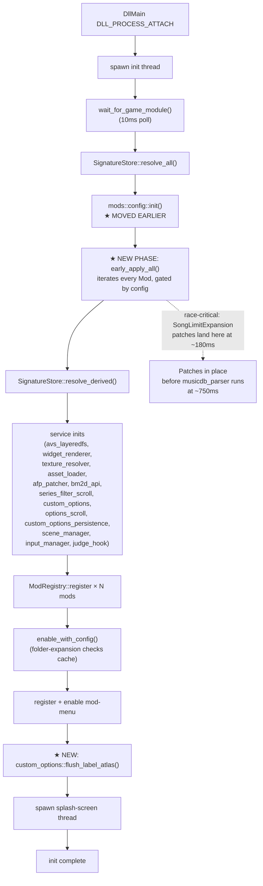

# Detailed Design: DLL Init Speedup

> Status: Draft (2026-05-22). Synthesizes empirical profiling
> data, idea-honing decisions, and architectural research into
> a self-contained design that can be implemented without
> re-reading the rest of the project artifacts.

## Overview

The DDR World hook DLL takes ~5.2 seconds to fully initialize
during game startup. Two specific problems within that budget are
load-bearing:

1. **A race condition** — `SongLimitExpansionMod`'s 6-byte buffer
   patches must land before the game's `master_loader` calls
   `musicdb_parser`. With current ordering, the patches land at
   ~1300 ms while the parser runs at ~750 ms — losing the race
   ~75 % of the time when `musicdb.xml` exceeds the stock 1 MB
   buffer (~2200 songs). Crash on bootup.

2. **Slow mod enables** — Two mods together account for ~3.8 s
   of the total 5.2 s init. `folder-expansion::enable` regenerates
   on-disk asset files every boot (1.3 s). `webui-options::enable`
   triggers an O(N²) atlas-rebuild storm via `register_option`
   (2.5 s).

This design fixes both, plus adds a small architectural change to
the `Mod` trait that supports current and future race-sensitive
mods cleanly.

**Scope expressly excluded**: a centralized AOB-pattern registry
(originally hypothesized as the bottleneck), thread suspension
during patch application (no longer needed), and cross-mod
parallelization of `enable()` calls (deferred to a follow-up
phase).

## Detailed Requirements

Consolidated from `idea-honing.md`. Each requirement traces to a
Q with a recorded decision.

### R1. Race fix via `early_apply` trait method (Q3, Q4)

- The `Mod` trait gains an optional method
  `fn early_apply(&mut self, ctx: &EarlyContext) -> bool` with a
  default implementation that returns `true` (no-op).
- `EarlyContext` is a struct exposing `game_module` and a reference
  to the `SignatureStore` *as it exists after `resolve_all`* —
  derived addresses are not yet populated.
- `lib.rs::init` runs an "early apply" phase between `resolve_all`
  and `resolve_derived`. The phase iterates over every Mod and
  invokes `early_apply` only when the mod's id is enabled in
  `mod-config.json`.
- `mods::config::init()` (currently runs after `resolve_derived`
  + LayeredFS) must move earlier so config is loaded before the
  early-apply phase.
- `SongLimitExpansionMod::early_apply` performs scan + verify +
  byte-write for the 6 patch sites, and sets an internal flag.
  When `init()` and `enable()` later run on the same instance,
  they observe the flag and no-op.

### R2. folder-expansion enable() output caching (Q5)

- `FolderExpansionMod::enable` writes generated artifacts under
  `./data_mods/custom_folders/`. A meta file
  `./data_mods/custom_folders/.cache_meta.json` records the
  cache key for the most recent successful generation.
- Cache key fields:
  - `version: u32` — schema version of the meta file (start at 1).
  - `config_hash: String` — SHA-256 hex of the canonicalized
    `FolderConfig` (sorted keys, fixed-width fields). Computed
    fresh every boot.
  - `source_arc_mtime: u64` — Unix epoch seconds of the mtime of
    `data/arc/bm2d/select_music_folder_v3.arc`. Computed via
    `std::fs::metadata` on every boot.
- On `enable()`:
  1. Compute `cache_key`.
  2. Read `.cache_meta.json` if it exists.
  3. If the file is missing, version-mismatched, or any of
     `config_hash`/`source_arc_mtime` differ, run the existing
     `generate_custom_assets` flow and then write a new meta file.
  4. Otherwise, skip generation entirely and proceed to the
     non-asset-generation work (hook installs, ctor patches, AFP
     patcher registrations).
- Hook installs (`folder_register_hook`, `folder_has_songs_hook`,
  `gameplay_obj_ctor_hook`) and the AFP patcher registration are
  **not** affected by the cache — they always run, since they
  patch live game memory.

### R3a. Late-binding-tolerant mod reorder (Q9)

- `ModRegistry::enable_with_config` partitions the list of mods to
  enable into "fast" (most mods) and "late-binding" (currently
  `folder-expansion`, `webui-options`).
- Fast mods enable first, in their existing registration order.
- Late-binding mods enable last, in their existing registration
  order (relative to each other).
- The set is hardcoded in `mod_trait.rs` as a small const slice;
  we don't promote this to a trait method until / unless other
  mods need to opt in.
- This change is independent of R1–R3 (race fix, folder-expansion
  cache, atlas flush). It compounds the user-visible boot-time
  improvement: today's autoplay/fast-bootup/etc. wait behind
  webui-options' 2.5s atlas storm; with the reorder + atlas fix,
  they land at ~1.3s instead of ~3.7s.

### R3. Atlas-rebuild fix (Q6)

- `custom_options::asset_gen::register_label_for(option_id)`
  becomes append-only: it adds the id to `LABEL_REGISTRATIONS`
  and returns. No atlas rebuild fires from inside.
- A new public function
  `custom_options::flush_label_atlas() -> bool` is added. It
  performs the existing `rebuild_lang_eng_atlas` work using the
  current contents of `LABEL_REGISTRATIONS`. Returns `true` if a
  rebuild happened, `false` if nothing was registered or the
  cloner failed.
- `lib.rs::init` calls `custom_options::flush_label_atlas()`
  exactly once, **after all mods are registered, after
  `enable_with_config`, and after the mod-menu mod is registered
  and enabled**. The single flush captures every option from every
  caller of `register_option` regardless of registration order.
- Existing callers of `register_option`
  (`autoplay.rs`, `webui_options/mod.rs`) need no changes.

### R4. Profiling instrumentation removed (Q7)

- All diagnostic instrumentation from the profiling deploy is
  rolled back. There is no `core/profiling.rs` in the production
  build. No `[init-prof]` log lines.
- The data captured by the diagnostic deploy is preserved in
  `idea-honing.md` and the research files for posterity.

### R5. Success criteria (Q8)

The implementation is "done" when all of the following hold,
verified by deploying to the cabinet and observing the game's
log file plus visual behavior:

1. `musicdb.xml` with > 2000 songs boots without crashing across
   ≥ 5 consecutive boots. The race window between patch and
   parser must be ≥ 200 ms (currently ~564 ms with the
   diagnostic build's reorder; design preserves that ordering).
2. `folder-expansion::enable` completes in < 50 ms on warm boots
   (configuration unchanged from previous boot).
3. `webui-options::enable` completes in < 600 ms.
4. Cabinet smoke test: SongLimitExpansion loads songs;
   folder-expansion's custom folders are visible in the song-
   select scene; webui-options' custom options appear in the
   options menu and accept user input.

## Architecture Overview



The architecture is fundamentally unchanged from today; we add
three things and reorder one:

- **Reorder**: `mods::config::init()` moves earlier, before the
  new early-apply phase.
- **New phase**: `early_apply_all()` between `resolve_all` and
  `resolve_derived`.
- **New behavior**: `FolderExpansionMod::enable()` checks a cache
  meta file before regenerating assets.
- **New API + call site**: `custom_options::flush_label_atlas()`
  invoked once at the end of init.

## Components and Interfaces

### `ModRegistry::enable_with_config` (modified)

```rust
// src/mods/mod_trait.rs

/// Mods whose enable() does substantial late-binding-tolerant work
/// (filesystem I/O, atlas generation) that doesn't need to complete
/// before the game's first frame. Enabled after all other mods to
/// keep faster hooks online sooner.
const LATE_BINDING_MODS: &[&str] = &[
    "folder-expansion",
    "webui-options",
];

impl ModRegistry {
    pub fn enable_with_config(&mut self, config: &HashMap<String, bool>) {
        let ids: Vec<String> = self
            .mods
            .iter()
            .map(|e| e.mod_impl.id().to_string())
            .collect();

        let (fast, late): (Vec<String>, Vec<String>) = ids
            .into_iter()
            .partition(|id| !LATE_BINDING_MODS.contains(&id.as_str()));

        for id in fast.into_iter().chain(late.into_iter()) {
            if id == "mod-menu" {
                continue;
            }
            let should_enable = config.get(&id).copied().unwrap_or(true);
            if should_enable {
                self.enable(&id);
            }
        }
    }
}
```

### `Mod` trait (modified)

```rust
// src/mods/mod_trait.rs

pub trait Mod: Send {
    fn id(&self) -> &str;
    fn name(&self) -> &str;
    fn description(&self) -> &str;
    fn required_signatures(&self) -> &[&str];
    fn init(&mut self, ctx: &ModContext) -> bool;
    fn enable(&mut self);
    fn disable(&mut self);

    /// Optional. Called once at init-time, after `resolve_all` but
    /// before `resolve_derived` and service init. Use for setup
    /// that must land before the game touches a particular code
    /// path (e.g. patching a buffer size before the game's first
    /// XML parse).
    ///
    /// Mods that implement `early_apply` are still expected to
    /// implement `init` and `enable` normally; those will run
    /// after services. The mod is responsible for tracking what
    /// `early_apply` already did and making `init`/`enable`
    /// no-op on the duplicated work.
    ///
    /// Default: returns `true` (no-op success). Returning `false`
    /// logs a warning but does not abort init.
    fn early_apply(&mut self, _ctx: &EarlyContext) -> bool {
        true
    }
}
```

### `EarlyContext` (new)

```rust
// src/mods/mod_trait.rs

/// Context passed to `Mod::early_apply`. A subset of `ModContext`
/// — derived signatures are not yet resolved at this phase.
pub struct EarlyContext<'a> {
    pub game_module: &'a GameModule,
    pub signatures: &'a SignatureStore,
}
```

`SignatureStore` at this phase contains only the linear AOB hits
from `resolve_all`. Calling `signatures.get_address(name)` for a
derived signature will return `None`. Mods invoked via
`early_apply` should rely on linear AOB lookups or perform their
own ad-hoc scans (the `SongLimitExpansion` case scans for two
patterns directly).

### `ModRegistry::early_apply_all` (new)

```rust
// src/mods/mod_trait.rs

impl ModRegistry {
    /// Run `early_apply` on every registered mod whose id is
    /// enabled in `config`. Called once during init, after
    /// `resolve_all` and config load, before `resolve_derived`.
    pub fn early_apply_all(
        &mut self,
        ctx: &EarlyContext,
        config: &HashMap<String, bool>,
    ) {
        for entry in &mut self.mods {
            let id = entry.mod_impl.id();
            // Default to ON when config doesn't mention the mod
            // (matches enable_with_config's existing behaviour).
            let should_run = config.get(id).copied().unwrap_or(true);
            if !should_run {
                continue;
            }
            let ok = entry.mod_impl.early_apply(ctx);
            if !ok {
                log_warn!("Mod '{}' early_apply returned false", entry.mod_impl.name());
            }
        }
    }
}
```

**Subtle point**: This iterates `self.mods` — but at the early-
apply phase, `self.mods` is empty because mods register *after*
`resolve_derived`. To make the phase work, `lib.rs::init` will
construct the mod *instances* before `early_apply_all` and pass
them in. There are two clean options:

- **Option A** (chosen): construct mods early in lib.rs as
  `Vec<Box<dyn Mod>>`, call `early_apply` on each one in turn,
  then later move them into the registry via `register()`. This
  keeps the registry's pre/post-registration discipline intact.
- **Option B**: have `register()` work in two phases. Add an
  `early_apply` step to `register()` itself. Rejected because it
  ties early-apply timing to registration timing, defeating the
  whole point.

`lib.rs` shape with Option A:

```rust
fn init() {
    // 1. Module + resolve_all (unchanged)
    let game_module = module_resolver::wait_for_game_module();
    let mut signatures = SignatureStore::new(&game_module);
    signatures.resolve_all();

    // 2. ★ MOVED: load config now, before early-apply.
    mods::config::init();

    // 3. ★ NEW: construct mods + run early_apply.
    let mut mods_to_register: Vec<Box<dyn Mod>> = vec![
        Box::new(mods::song_limit_expansion::SongLimitExpansionMod::new()),
        Box::new(mods::hello_world::HelloWorldMod::new()),
        // ... all other mods, in registration order ...
    ];
    let early_ctx = EarlyContext {
        game_module: &game_module,
        signatures: &signatures,
    };
    let mod_config = mods::config::get()
        .map(|c| c.mods.clone())
        .unwrap_or_default();
    for m in &mut mods_to_register {
        let id = m.id();
        let should_run = mod_config.get(id).copied().unwrap_or(true);
        if !should_run {
            continue;
        }
        let _ = m.early_apply(&early_ctx);
    }

    // 4. Resolve derived (unchanged)
    signatures.resolve_derived();

    // 5. Services (unchanged)
    avs_layeredfs::init();
    // ... all the rest ...
    judge_hook::init(&signatures);

    // 6. Register the prepared mods. They go through normal
    //    init() — for SongLimitExpansion, init() will see its
    //    EARLY_PATCH_APPLIED flag and report success without
    //    re-scanning.
    let ctx = ModContext {
        game_module: &game_module,
        signatures: &signatures,
    };
    let registry = Arc::new(std::sync::Mutex::new(ModRegistry::new()));
    {
        let mut reg = registry.lock().unwrap();
        for m in mods_to_register {
            reg.register(m, &ctx);
        }
    }

    // 7. Enable per config (unchanged)
    {
        let mut reg = registry.lock().unwrap();
        reg.enable_with_config(&mod_config);
    }

    // 8. Mod menu (unchanged)
    {
        let mut reg = registry.lock().unwrap();
        reg.register(Box::new(mods::mod_menu::ModMenuMod::new()), &ctx);
        reg.enable("mod-menu");
    }

    // 9. ★ NEW: one-shot atlas flush after every option-registering
    //    mod has run its enable.
    custom_options::flush_label_atlas();

    // 10. Splash (unchanged)
}
```

### `SongLimitExpansionMod` (modified)

```rust
// src/mods/song_limit_expansion.rs

pub struct SongLimitExpansionMod {
    sites: Vec<PatchSite>,
    early_applied: bool,
}

impl Mod for SongLimitExpansionMod {
    fn early_apply(&mut self, ctx: &EarlyContext) -> bool {
        // Same body as today's init() + enable(): scan, verify,
        // write 0x80 over 0x10 at the 6 sites. Populate self.sites
        // so that disable() can roll back. Set self.early_applied.
        // ...
        self.early_applied = true;
        true
    }

    fn init(&mut self, _ctx: &ModContext) -> bool {
        if self.early_applied {
            // Already done in early_apply.
            return true;
        }
        // Fallback (shouldn't normally execute, but kept for the
        // case where the mod's early_apply was disabled in config
        // but the enable() codepath still wants to apply the patch
        // when the user toggles it on later via mod-menu).
        // Same logic as today's init().
        // ...
        true
    }

    fn enable(&mut self) {
        if self.early_applied {
            // Already in 8MB state.
            return;
        }
        // Fallback for the toggle-on-after-disable case. Same as
        // today's enable().
        // ...
    }

    fn disable(&mut self) {
        // Restore original bytes. Works regardless of whether
        // patches landed via early_apply or enable.
        // ...
    }
}
```

`disable()` continues to roll the buffers back to 1 MB regardless
of how they got patched, preserving the runtime toggle behaviour
in the mod-menu.

### `FolderExpansionMod` (modified)

The mod's existing `enable()` body is wrapped in a cache check:

```rust
// src/mods/folder_expansion.rs

const CACHE_META_VERSION: u32 = 1;

#[derive(serde::Serialize, serde::Deserialize)]
struct CacheMeta {
    version: u32,
    config_hash: String,
    source_arc_mtime: u64,
}

fn cache_meta_path() -> PathBuf {
    PathBuf::from(GEO_MOD_FOLDER).join(".cache_meta.json")
}

fn compute_cache_key(config: &FolderConfig) -> Option<CacheMeta> {
    let config_bytes = serde_json::to_vec(&CanonicalConfig::from(config)).ok()?;
    let config_hash = sha256_hex(&config_bytes);
    let arc_mtime = std::fs::metadata(FOLDER_ARC_PATH)
        .ok()?
        .modified()
        .ok()?
        .duration_since(std::time::UNIX_EPOCH)
        .ok()?
        .as_secs();
    Some(CacheMeta {
        version: CACHE_META_VERSION,
        config_hash,
        source_arc_mtime: arc_mtime,
    })
}

fn cache_is_valid(want: &CacheMeta) -> bool {
    let path = cache_meta_path();
    let bytes = match std::fs::read(&path) {
        Ok(b) => b,
        Err(_) => return false,
    };
    let got: CacheMeta = match serde_json::from_slice(&bytes) {
        Ok(m) => m,
        Err(_) => return false,
    };
    got.version == want.version
        && got.config_hash == want.config_hash
        && got.source_arc_mtime == want.source_arc_mtime
}

fn write_cache_meta(meta: &CacheMeta) {
    if let Ok(bytes) = serde_json::to_vec_pretty(meta) {
        let _ = std::fs::write(cache_meta_path(), bytes);
    }
}

// Inside enable():
fn enable(&mut self) {
    let config = match get_config() { ... };

    // Existing: register custom ARC, install hooks, etc. — these
    // ALWAYS run, regardless of cache.
    // ...

    if !config.custom_folders.is_empty() {
        // Patch gameplay_obj alloc size + install ctor hook —
        // unchanged from today.
        // ...

        // Asset generation — gated by cache.
        let need_regen = match compute_cache_key(config) {
            Some(want) => {
                if cache_is_valid(&want) {
                    log_info!("FolderExpansion: cache HIT, skipping asset regeneration");
                    false
                } else {
                    log_info!("FolderExpansion: cache MISS, regenerating assets");
                    true
                }
            }
            None => {
                // Couldn't compute cache key (file missing, etc).
                // Regenerate to be safe.
                log_warn!("FolderExpansion: cache key unavailable, regenerating");
                true
            }
        };

        if need_regen {
            generate_custom_assets(config);
            mod_paths::init_mod_paths();
            if let Some(meta) = compute_cache_key(config) {
                write_cache_meta(&meta);
            }
        }
    }

    // Existing: hide_difficulty_pane handling, etc.
    // ...
}
```

`CanonicalConfig::from(config)` ensures the same `FolderConfig`
serializes to the same bytes regardless of HashMap iteration
order — implemented as a struct with sorted vectors for any
collection-typed fields. This is the only hash-stability concern.

### `custom_options::asset_gen` (modified)

```rust
// src/services/custom_options/asset_gen.rs

pub(crate) fn register_label_for(option_id: &str) {
    let mut registrations = LABEL_REGISTRATIONS.lock().unwrap();
    if !registrations.iter().any(|id| id == option_id) {
        registrations.push(option_id.to_string());
    }
    // ★ REMOVED: the rebuild_lang_eng_atlas call that lived here.
}

/// Rebuild the lang_eng atlas using all currently-registered
/// labels. Idempotent — safe to call multiple times. Returns
/// `true` if a rebuild happened.
///
/// Called from `lib.rs::init` exactly once, after every mod has
/// finished its `enable()` — guaranteeing that every label
/// registration is captured in a single rebuild pass.
pub fn flush_label_atlas() -> bool {
    let xml = match load_stock_texturelist(LANG_ENG_ARC, LANG_ENG_IFS) {
        Some(x) => x,
        None => {
            log_warn!("custom_options/asset_gen: can't load lang_eng texturelist for atlas flush");
            return false;
        }
    };
    rebuild_lang_eng_atlas(&xml)
}
```

Re-export from `custom_options/mod.rs`:

```rust
pub use asset_gen::flush_label_atlas;
```

## Data Models

### `CacheMeta` (new — folder-expansion cache)

| Field | Type | Description |
|-------|------|-------------|
| `version` | `u32` | Schema version (start at 1). Bumped if the meta-file format changes. |
| `config_hash` | `String` | SHA-256 hex of the canonicalized `FolderConfig`. |
| `source_arc_mtime` | `u64` | Unix epoch seconds of `data/arc/bm2d/select_music_folder_v3.arc`'s mtime. |

Stored at `./data_mods/custom_folders/.cache_meta.json` as
pretty-printed JSON.

### Existing models — no changes

`FolderConfig`, `RegisterSpec`, `OptionHandle`, `RowHandle`,
`ModInfo`, `Mod` trait method signatures other than the new
`early_apply` are untouched.

## Error Handling

All paths follow the codebase's "graceful degradation" rule
(CLAUDE.md item 2). Specific contracts:

### early_apply

- Default impl returns `true`.
- A mod returning `false` logs a warning and does not abort init.
- A mod that would have returned `false` for `init()` (e.g.
  signature drift) returns `false` for `early_apply()` too. The
  later `init()` call may still succeed if the AOB was a transient
  miss; the registry then proceeds with the mod registered.
- Panics inside `early_apply` propagate to the init thread (which
  is *not* a hook callback — panics are acceptable here, though
  the codebase's quality-rule preference is graceful-degrade).

### folder-expansion cache

- If `compute_cache_key` fails (e.g. source ARC missing), log
  warning, force regeneration. Do not skip the cache write —
  next boot's `cache_is_valid` will then either hit (if the
  source ARC reappears) or miss (if it stays missing, in which
  case we'll keep failing the same way each boot, which is the
  correct behavior).
- If `write_cache_meta` fails (disk full, permissions), log a
  warning. Subsequent boot will see a missing/stale meta file
  and regenerate — annoying but correct.
- If `serde_json` deserialization of the meta file fails (file
  corrupted), treat as cache miss. Regenerate and overwrite.

### atlas flush

- `flush_label_atlas` returns `false` if the texturelist XML
  can't be loaded or `rebuild_lang_eng_atlas` returns `false`.
- `lib.rs::init` ignores the return value; if the flush fails,
  game-rendered options just show without their custom labels —
  they remain functional.
- `register_label_for` cannot fail (it just appends to a vec).

## Testing Strategy

This codebase has no unit-test harness — every change is
validated by deploying the DLL to the cabinet and observing
behaviour against the game's log file
(`<game_dir>/log.txt`) plus visual smoke-checks of the mods.

### Pre-deploy checks

- `cargo check --target x86_64-pc-windows-msvc` must pass clean.
- `cargo xwin build --release --target x86_64-pc-windows-msvc`
  (via `./build.sh`) must produce a DLL.
- No new `unwrap`/`expect`/`unreachable!` in hook callbacks.
- New file `mods::config` reordering audited: nothing in the
  reorder calls into a service that hasn't been initialized yet.
  (Today, `mods::config::init` reads JSON; it has no dependencies
  on `signatures` or services.)

### Per-step deploy verification

Each implementation step ends with a deploy + a short
verification protocol. The protocol is:

1. Build via `./build.sh`.
2. Deploy via `./scripts/deploy.sh`.
3. Boot the game once.
4. Inspect `log.txt` for the expected new log lines and absence
   of expected absences.
5. Smoke-test the relevant mod's UI feature.

Specific verifications by step appear in `implementation/plan.md`.

### Final acceptance test

To validate R5:

1. Restore (or copy in) a `musicdb.xml` with > 2000 songs.
2. Boot the game ≥ 5 consecutive times. Every boot must reach
   the song-select scene without crashing.
3. Boot once more with the timing-instrumented diagnostic-build
   re-derived from the stash; confirm:
   - `early_apply` of `song-limit-expansion` runs at < 200 ms
     elapsed.
   - `folder-expansion::enable` runs at < 50 ms (warm boot).
   - `webui-options::enable` runs at < 600 ms.
4. Cabinet smoke test: enter song select, verify custom folders
   appear; enter options, verify custom options appear and
   accept user input; verify the `[DDR-Hook]` log lines for each
   mod show enabled state.

## Appendices

### A. Technology Choices

- **`sha2` crate** for SHA-256 of the folder cache key. Already
  used elsewhere in the codebase (TODO during implementation:
  audit `Cargo.toml` to confirm; if absent, add as a dependency
  with default features off).
  - Alternative considered: a smaller `Hasher`-based crate (FxHash,
    AHash). Rejected because the cache key is persisted to disk
    and we want a stable hash across Rust versions and host CPUs.
- **`serde_json`** for the cache meta file. Already used in
  `mods::config`; no new dependency.
- **`std::fs::metadata().modified()`** for source ARC mtime.
  Returns `SystemTime`; we convert to `Duration since UNIX_EPOCH`.
  Cross-platform standard library only — no concerns.

### B. Research Findings (summary)

Detailed research is under `research/`. Key findings that
shaped this design:

- The musicdb race is solved by reordering alone — no thread
  suspension is required. The diagnostic deploy proved the patch
  lands at ~184 ms while the parser runs at ~748 ms (564 ms
  slack). See `time-critical-hooks.md` and the empirical
  baseline in `idea-honing.md`.
- The "scanning is the bottleneck" hypothesis was wrong. Of the
  ~5.2 s init time, scanning consumes only ~847 ms (`resolve_all`
  + `resolve_derived`). The dominant cost is two specific mod
  enables. See `scan-bottleneck-analysis.md` and `idea-honing.md`'s
  empirical-baseline section.
- Centralizing the AOB scanner is a real but lower-priority
  optimization — deferred. See `centralized-scanner-prior-art.md`.
- Thread-suspension feasibility was researched in case it was
  needed; it isn't, but the analysis is preserved as future
  reference. See `thread-suspension-feasibility.md`.

### C. Alternative Approaches Considered

- **Hardcode the early-patch directly in `lib.rs`** (no trait
  method). Rejected — doesn't scale to future race-sensitive
  hooks and creates an asymmetric special case.
- **Move SongLimitExpansion's *registration* up entirely**
  (so its existing `init`/`enable` run early, no separate
  `early_apply` method). Rejected — couples the registration
  order to a timing concern; the trait method is the right
  abstraction.
- **Per-mod explicit `flush_label_atlas` calls**. Rejected by
  user pushback — every future mod that registers a single
  option would have to remember to call flush, eventually
  re-introducing the compounding work problem. Single-flush in
  `lib.rs` is the right level.
- **Folder-expansion existence-only cache check**. Rejected —
  doesn't detect config changes (renamed/removed folders
  wouldn't invalidate the cache).
- **Cross-mod parallel `enable()`**. Deferred — the audit
  surface area (every mod's `enable` body for thread-safety,
  `static mut`, shared service locks) is too high to take on
  in this phase, and the marginal win is bounded by webui-
  options' single-mod 600 ms (post-fix) anyway.

### D. Out-of-scope for this design

These were considered but explicitly excluded:

- Centralized AOB pattern registry (the original rough-idea
  framing). The empirical data showed scanning is not the
  bottleneck.
- Thread-suspension during patch installation. The reorder
  buys 564 ms of slack, far beyond what suspension would add.
- Cross-mod parallelization of `enable()`.
- `resolve_derived`'s ~729 ms of derivation cost. Real, but
  not race-critical and not on the critical path for the fix.
  Could be a follow-up.
- Profiling instrumentation as a feature flag. Removed per Q7.
