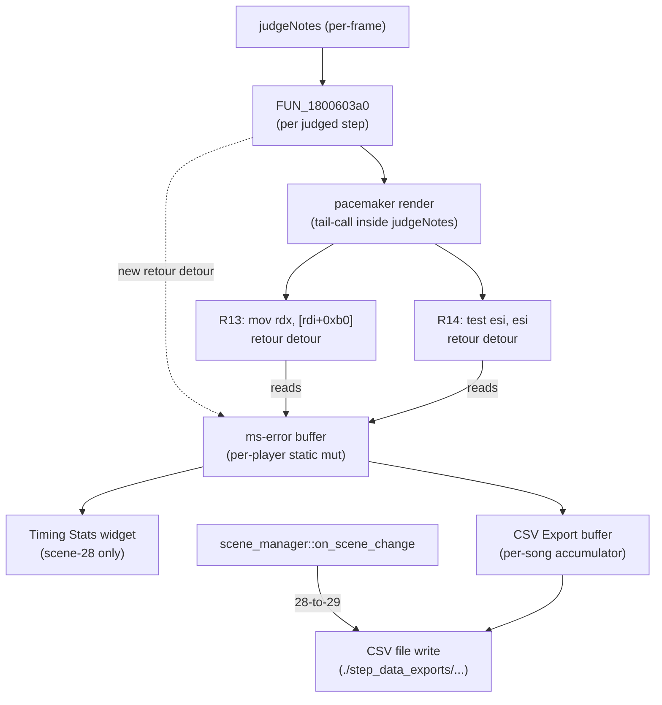

# Detailed Design — Bulk Hack Porting (20260523)

## Overview

This feature ports a curated set of mods from the pre-modded
`gamemdx_20250805_MODIFIED.dll` into the DDR World Universal Modpack
hook DLL. Each ported mod must work version-agnostically across all
DDR World binary releases (verified on 20250805 stock and 20260421).
Where possible, ports use the same patch sites as the original mod's
hex edits, but installed via the modpack's `retour::GenericDetour`
infrastructure or `core::memory::write_bytes` rather than as direct
binary edits — preserving compatibility with future game updates.

The feature delivers **four new mods**, **one infra change** to the mod
menu, and **one tooling consolidation** for the custom-options label
asset pipeline.

This design document is self-contained: it can be read without the
other PDD artifacts (rough-idea.md, idea-honing.md, research/*.md),
though those remain the audit trail for why each decision was made.

## Detailed Requirements

Consolidated from `idea-honing.md` Q1–Q17 (with research-driven
revisions to Q9 and Q13).

### REQ-1: Mod-menu scene-gate removal (infra)

The current mod menu (`src/mods/mod_menu.rs`) has two scene-related
gates that prevent it from opening outside the attract loop:

1. **Open gate** — `open()` early-returns if
   `current_scene() > ATTRACT_SCENE_MAX` (16).
2. **Auto-close** — a `scene_manager::on_scene_change` callback closes
   the menu when the new scene is past `ATTRACT_SCENE_MAX`.

Both must be removed. The mod menu must be openable on any scene at
any time. The existing exclusive-input-consumer mechanism
(`input_manager::set_exclusive_consumer`) is the only suppression
needed — research note `mod-menu-input-gating.md` confirmed that
gameplay (scene 28) does not act on numpad bits 9–20 (the navigation
keys), so navigation key-presses cannot bleed through to the game.

### REQ-2: PremiumFreeMod (global, mod-menu gated)

A standalone mod that freezes the per-stage counter at the current
round so players can play indefinitely.

  - Hook the per-frame stage-counter increment site (R9, see
    `binary_modpack_research.md §3`).
  - When enabled: zero the stage counter before each per-frame
    increment, keeping the player on stage 1 forever.
  - When disabled: the stage counter advances normally.
  - **Save behavior is observed-and-fixed-only**: trust that the game
    emits a per-song save packet at song-end regardless of stage
    counter state (this is the typical DDR backend pattern). If live
    testing reveals scores not saving, escalate to additional RE on
    the save path.

### REQ-3: QuickRestartOrFailMod (global, mod-menu gated)

A standalone mod that listens for two triple-press gestures during
gameplay (scene 28) and triggers either a song restart or a song
fail-out.

  - **Triple-1** within 1.5s on either pinpad → song restart. Trigger
    a fresh transition to scene 28 via the scene-transition function
    `FUN_18002de40(transition_seq, 0x1d)`. The previous gameplay
    actor drops via shared_ptr decref; a fresh `DancePlaySequence` is
    constructed; the per-frame stage counter is left untouched.
  - **Triple-3** within 1.5s on either pinpad → song fail. Set the
    "song completed cleanly" flag at `[transition_seq + 0xE8] = 0`,
    which steers the post-stage state machine's case-0x1e block onto
    the failed/quit-out branch (skipping the results screen and
    returning to song select).
  - The 1.5s gesture window is per-pinpad (so P1 and P2 each have
    their own triple-press counter — pressing 1 once on P1 and twice
    on P2 within 1.5s does NOT trigger).
  - If `PremiumFreeMod` is also enabled, neither gesture bumps the
    stage counter (PremiumFree's per-frame hook keeps it frozen).

### REQ-4: SongSelectionImprovementsMod (global, mod-menu gated, JSON sub-toggles)

A standalone mod with two sub-features, each independently toggleable
via `mod-config.json`:

  - **Real Speed Core BPM** (`real_speed_core_bpm`, default `true`) —
    Replace the Max BPM divisor with Core BPM in
    `ddr::player::Option::SetScrollSpeed`'s display formula
    (R24-R26 patches), AND wrap the bare `logf` call so `logf(0)`
    returns `0` instead of `-inf`/NaN (R15-R16 patches). All five
    patches are byte-level memory writes; four of five payloads are
    version-identical, only the R16 rel32 is computed at runtime.
  - **Flare → Clear/Combo Lamps** (`flare_to_clear_lamps`, default
    `true`) — On the results screen, replace flare-clear banner
    semantics with clear-lamp colors (MFC = white FLARE EX, PFC =
    gold FLARE IX, etc.). Hook the flare-banner setup site (R21)
    and substitute the clear-lamp value when the JSON toggle is on.

### REQ-5: PowerUserStatisticsMod (per-player, options-gated)

A mod with three sub-features, each gated by an independent per-player
option on the Mods tab (Page6) of the in-game options menu.

  - **`pus_timing_stats`** (bool, default OFF) — Render per-player
    text widgets during gameplay (scene 28) showing the player's
    current step's ms-error, plus running max / abs-mean / mean
    over the song. Format: 2-decimal precision (e.g.,
    `"+12.34 ms"`). Layout: per-player widget groups so positioning
    can be tuned per side (P1 left, P2 right).
  - **`pus_pacemaker_to_mserror`** (bool, default OFF) — Replace the
    in-game pacemaker readout with the most-recent ms-error.
    - **`pus_pacemaker_threshold`** (scalar, default 10, range 1..=50,
      step 1) — Visible only when the parent toggle is ON. When
      `|current_ms_error| < threshold`, force the pacemaker color
      to white (the "good timing" zone color).
  - **`pus_step_data_export`** (bool, default OFF) — At each scene
    28 → 29 transition, write a per-song CSV file at
    `./step_data_exports/<YYYY-MM-DD>_<HH-MM-SS>_<songcode>_<difficulty>_P<n>.csv`
    with header `Expected,Actual,Delta (Ms Error)\r\n` and one row
    per judged step. Per-player gating: write only the file(s) for
    the side whose toggle was ON.

All four options:
  - Use the `pus_` prefix for namespacing.
  - Persist via the existing custom-options network/JSON layer
    (`persist: true`, default).
  - Need new label PNG assets shipped via LayeredFS.

### REQ-6: Custom options label-generation script consolidation (tooling)

The repo currently has two scattered scripts that produce
`seop_item_*` / `seop_op_*` label PNGs:
  - `scripts/gen_webui_option_labels.py`
  - `scripts/gen_scroll_dummy_labels.py`

Consolidate both into one script `scripts/gen_custom_option_labels.py`
that reads a single in-script manifest of every label every mod
needs and emits all PNGs in one pass. Add the four new
`pus_*` labels to the manifest. Delete the old scripts once the
consolidated one reaches parity.

### REQ-7: Cross-version verification

Every AOB pattern and structural offset used by the four mods must be
verified on 20250805 stock AND 20260421 (the supported version range).
Patterns must use established hygiene: wildcard RIP-relative
displacements, branch displacements where basic-block size could
shift, and state-id immediates where the state machine's encoding
could change; never wildcard opcodes, ModR/M bytes, or structural
game values (struct offsets, judgment IDs).

## Architecture Overview

### Crate-level placement

```
src/
├── core/                      (no changes)
├── services/
│   └── (no new services)      Existing judge_hook + scene_manager + input_manager are sufficient.
├── widgets/                   (no changes)
├── types/                     (no changes)
└── mods/
    ├── premium_free.rs            ← NEW (single-file, simple)
    ├── quick_restart_or_fail.rs   ← NEW (single-file)
    ├── song_selection_improvements/   ← NEW (multi-file because two sub-features have separate state)
    │   ├── mod.rs                 — Mod trait impl, lifecycle, JSON config read
    │   ├── real_speed.rs          — BPM swap + logf guard install/uninstall
    │   ├── logf_stub.rs           — VirtualAlloc-backed guarded-logf wrapper assembly
    │   └── flare_lamps.rs         — Flare→Lamps banner-setup detour
    └── power_user_statistics/     ← NEW (multi-file because three sub-features share data)
        ├── mod.rs                 — Mod trait impl, lifecycle, option registration
        ├── data_feed.rs           — FUN_1800603a0 detour, per-player ms-error buffer
        ├── timing_stats_widget.rs — TextWidget creation, scene-28 visibility, per-frame text update
        ├── pacemaker_swap.rs      — R13/R14 detours, white-zone threshold check
        └── csv_export.rs          — Scene 28→29 callback, file writer, songcode/difficulty snapshot
```

The mod menu's scene-gate removal is a small in-place change to
`src/mods/mod_menu.rs`, not a new module.

### Mod registration

All four new mods are registered in `src/lib.rs` after the existing
mods. The mod menu auto-includes them. JSON config keys land in
`mod-config.json` under top-level `mods.<mod_id>` (existing pattern)
and the new section `song_selection_improvements`.

### Initialization sequence (existing)

The existing init sequence in `lib.rs` runs:

1. Load `gamemdx.dll` → wait for it to be loaded.
2. AOB scan all known signatures.
3. Derive RTTI / RIP-relative addresses.
4. Init widget renderer, texture resolver, asset loader, scene manager,
   input manager, judge hook, custom_options.
5. Register and enable mods.

The four new mods plug into the existing flow without changes to the
init order. Each mod's `init(ctx)` validates required signatures via
`ctx.signatures.get_address(...)` and returns false to skip itself
gracefully if anything fails to resolve.

### Data flow — PowerUserStatisticsMod



Three sub-features share a single per-player ms-error buffer populated
by ONE detour at `FUN_1800603a0`. This avoids the latency problem the
research note `per-step-data-feed.md` flagged: a `judge_hook::register_post`
subscription would fire too late for the in-flight pacemaker render
(which is a tail-call inside `judgeNotes`).

## Components and Interfaces

### Mod 1: PremiumFreeMod (`src/mods/premium_free.rs`)

**Trait impl:**
- `id() = "premium-free"`
- `name() = "Premium Free"`
- `description() = "Freezes the stage counter at the current round (unlimited stages)"`
- `required_signatures() = &["premium_free_stage_inc"]`

**New signature:**
- Name: `premium_free_stage_inc`
- Pattern: `FF 41 0C 45 33 C0 41 8D 50 68 48 8B 0D` (anchor +0 is the
  `inc dword [rcx+0xc]` instruction at the per-frame stage-counter
  increment site).
- Verified unique on 20250805 stock (`0x180030092`) and 20260421
  (`0x180030595`).

**Hook strategy — manual mid-function patch + VirtualAlloc'd stub:**

The R9 site is a 6-byte instruction sequence (`mov rcx, [rax]; inc dword [rcx+0xc]`).
The original mod's binary patch replaces these 6 bytes with a 5-byte
`call <cave>` + 1-byte NOP and the cave does the conditional zero +
inc + return.

For our port:
1. AOB-scan to find the patch site (anchor + 0 = `FF 41 0C`).
2. Allocate a 16-byte stub via `core::memory::alloc_near(near=anchor, size=16)`
   (returns RWX-backed memory within rel32 reach). Stub assembly:
   ```
   mov rcx, [rax]               ; restore the original mov rcx,[rax]
   cmp byte [rip+ENABLED], 0    ; check static enable flag
   je inc                       ; if disabled, skip zero
   mov dword [rcx+0xc], 0       ; zero the counter
   inc dword [rcx+0xc]          ; original inc
   jmp <return_addr>            ; back to instruction after patch
   ```
3. Replace the stock 6 bytes with `E9 <rel32>` (5-byte JMP) + 1 NOP.
4. The static `ENABLED: AtomicBool` is read by the stub via a
   RIP-relative `cmp byte [rip+disp32], 0`. We assemble the stub at
   runtime and patch the rel32 to point at our static.
5. On disable, restore the 6 stock bytes and free the stub.

The stub is hand-assembled at runtime because we need version-agnostic
addresses. The same pattern is used by `mods/timer_freeze.rs` already.

**Alternative considered:** retour::GenericDetour on the enclosing
function. Rejected because the function is a generic per-frame update
hub with multiple `inc` operations; we'd need expensive register-state
inspection inside the detour to identify which inc to suppress.

### Mod 2: QuickRestartOrFailMod (`src/mods/quick_restart_or_fail.rs`)

**Trait impl:**
- `id() = "quick-restart-or-fail"`
- `name() = "Quick Restart / Fail"`
- `description() = "Triple-press 1 to restart song, triple-press 3 to fail-out (during gameplay)"`
- `required_signatures() = &["scene_transition_call"]`
- Plus a runtime dependency: `scene_manager::current_transition_sequence()`
  (a new accessor we add to the existing scene_manager service that
  exposes the cached `TransitionSequence*`).

**New signature:**
- Name: `scene_transition_call`
- The address of `FUN_18002de40` (the scene-transition trigger that
  takes `(this=transition_seq, scene_id)`). Derive from
  `createNextSequence` (already resolved) by walking its first call
  to `FUN_18002de40` via `scanner::scan_first_call_rel32`.
- Verified resolvable on both versions; no AOB pattern needed if we
  derive from `createNextSequence` reliably.

**New scene_manager API:**
```rust
// In src/services/scene_manager.rs
pub fn current_transition_sequence() -> Option<*mut u8>;
```
Adds a `static AtomicPtr<u8> CURRENT_TS: AtomicPtr<u8> = AtomicPtr::new(null_mut())`
to scene_manager. Each call to the existing `createNextSequence` hook
updates it before/after dispatching the original. Readers acquire a
snapshot via `Acquire` ordering.

**Hook strategy:**

For triple-1 (Quick Restart):
- `input_manager::on_input_event` registers a callback that watches for
  NUM_1 presses on either pinpad during scene 28.
- Per-pinpad rolling-window press counter (1.5s window, count = 3
  triggers).
- On trigger: read `current_transition_sequence()`. If `Some(ts)`,
  schedule `FUN_18002de40(ts, 0x1d)` on the render thread (via
  `widget_renderer::run_on_render_thread`).
- The existing `scene_manager` hook intercepts the resulting
  `createNextSequence` call. Game's normal teardown/reconstruct path
  runs (drops the previous `DancePlaySequence`, allocates a new one).

For triple-3 (Quick Fail):
- Same gesture detector, NUM_3 instead of NUM_1.
- On trigger: read `current_transition_sequence()`. Write
  `*(uint8_t*)(ts + 0xE8) = 0` (the "song completed cleanly" flag).
- ALSO trigger a transition via `FUN_18002de40(ts, 0x1f)` (scene 31,
  the post-stage transition entry — case 0x1e of the state machine).
  This forces the state machine to advance immediately to the
  case-0x1e block, which reads the flag we just wrote and selects
  the failed/quit-out path.
- Open question for implementation: the exact target scene for the
  `FUN_18002de40` call is not fully validated. The research note
  documents case 0x1e as the post-stage entry, but the scene_id that
  triggers it isn't mapped 1:1. **Implementation task includes a
  scene-mapping verification step**: deploy a diagnostic build that
  logs every scene transition from gameplay onward, with and without
  the flag write, and identify the right target.

**Pinpad gesture detector struct:**
```rust
struct GestureBuffer {
    p1_num1_presses: VecDeque<Instant>,
    p1_num3_presses: VecDeque<Instant>,
    p2_num1_presses: VecDeque<Instant>,
    p2_num3_presses: VecDeque<Instant>,
}
```
On each press, push the timestamp, prune entries older than 1.5s,
trigger when `len() >= 3`. Reset all four buffers on scene change
out of 28 (via `on_scene_change`).

### Mod 3: SongSelectionImprovementsMod (`src/mods/song_selection_improvements/mod.rs`)

**Trait impl:**
- `id() = "song-selection-improvements"`
- `name() = "Song Selection UX Improvements"`
- `description() = "Real Speed using Core BPM, Flare→Lamps banner"`
- `required_signatures()`:
  - `real_speed_bpm_anchor` (gated: only required if `real_speed_core_bpm` JSON toggle is on)
  - `real_speed_logf_anchor` (gated: same)
  - `flare_lamps_anchor` (gated: only required if `flare_to_clear_lamps` is on)

JSON config:
```json
{
  "song_selection_improvements": {
    "real_speed_core_bpm": true,
    "flare_to_clear_lamps": true
  }
}
```
Defaults: both `true`. Missing section / missing keys → both `true`.

#### 3a. Real Speed Core BPM (`song_selection_improvements/real_speed.rs`)

**Patches** (research note `real-speed-anchors.md` is the source of truth):

| Site | Address (20260421) | Stock bytes | Patched bytes | Purpose |
|---|---|---|---|---|
| R24 | `r24_anchor` (= main_anchor − 0x1C) | 2 bytes | `EB 64` | Divert into cave |
| R25 | `r25_anchor` (= main_anchor + 0x03) | `01` | `C2` | divsd ModRM swap (use xmm2 instead of [rcx]) |
| R26 | `r26_anchor` (= main_anchor + 0x4A) | 12 bytes int3 padding | `F2 0F 10 93 88 00 00 00 77 97 EB 90` | Cave: load core BPM, branch back |
| R15 | `r15_anchor` (= logf_anchor − 0x38) | 1 byte | `0x37` | JMP rel8 displacement adjust |
| R16 | `r16_anchor` (= logf_anchor + 0x04) | rel32 (read at runtime) | rel32 to our guarded stub | Redirect logf call |

**Anchors:**
- `real_speed_bpm_anchor`: `F2 0F 5E 01 48 8D 4C 24 40` — verified unique on
  20250805 stock and 20260421 (`0x1801df948`).
- `real_speed_logf_anchor`: `0F 28 C7 E8 ?? ?? ?? ?? F3 0F 58 C6` —
  verified unique on both versions.

**Guarded logf stub** (`song_selection_improvements/logf_stub.rs`):

VirtualAlloc-backed RWX page allocated by `core::memory::alloc_near` (so
the JMP target is reachable from a 4-byte rel32). Stub assembly:
```
xorps  xmm1, xmm1       ; xmm1 = 0.0
ucomiss xmm0, xmm1       ; compare xmm0 to 0
jne    +1                ; if xmm0 != 0, jump to logf
ret                      ; xmm0 already holds 0.0; return
jmp    rel32 bare_logf   ; tail-call bare logf
```

The bare `logf` address is read from the stock R16 site BEFORE patching
(`r16_anchor + 4` is the rel32 displacement; resolve the absolute
target). On disable, restore all five sites' original bytes and free
the stub.

**Critical correction over the existing research doc:** the BPM triple
lives on `ddr::player::Option` (the `rbx` parameter) at offsets
`+0x80/+0x88/+0x90`, NOT on `ChartData` as the doc claimed. Verified
by parent-side spot-check: `FUN_1801df8b0` is named
`ddr::player::Option::SetScrollSpeed` per Konami's `Ordinal_382`, and
the BPM-setter (`FUN_1801df840`, vtable slot `+0xC0`) writes to the
same `param_1` Option struct at those offsets.

#### 3b. Flare → Clear/Combo Lamps (`song_selection_improvements/flare_lamps.rs`)

**Hook:** `retour::GenericDetour` at `FUN_1800f2700` (or its xref site
inside the results-banner setup `FUN_1801452e0`).

**Anchor:** `48 8B 11 83 3A 01 0F 45 F0` — verified unique on 20260421
(`0x18015a9ad` — anchor − 12 is the `call FUN_1800f2700` site).

**Behavior:** when the JSON toggle is on, the detour calls
`FUN_1800f3c00` (clear-lamp getter) instead of the stock flare-clear
getter, and remaps the result through a small lookup table to produce
clear-lamp colors (MFC=white, PFC=gold, etc.).

The exact remap table values are extracted from the original mod's
runtime data at `0x18034c5e0+...` per `binary_modpack_research.md §15`.
Read these once at mod enable time from the ARC/IFS lookup pipeline
or hardcode them as a Rust const if they're stable across versions.
**Implementation task includes verifying the table values are
version-stable** (likely yes, since these are clear-lamp grade IDs
which are protocol values).

### Mod 4: PowerUserStatisticsMod (`src/mods/power_user_statistics/mod.rs`)

**Trait impl:**
- `id() = "power-user-statistics"`
- `name() = "Power User Statistics"`
- `description() = "Per-player ms-error stats, pacemaker swap, CSV export"`
- `required_signatures()`:
  - `judge_per_step_handler` (FUN_1800603a0)
  - `pacemaker_render_input` (R13 site)
  - `pacemaker_render_zf` (R14 site)
  - All gated by their respective sub-feature options (registered with
    custom_options); the mod is robust to missing signatures (logs warn
    and skips that sub-feature).

#### 4a. Per-step data feed (`power_user_statistics/data_feed.rs`)

**Hook:** `retour::GenericDetour` on `FUN_1800603a0` (the per-step
judgment-result handler called once per judged step from inside
`judgeNotes`).

**Signature:** AOB anchor for the function prologue (research note
`per-step-data-feed.md` documents). Verified unique on both versions.

**Detour callback:**
- Read `(actor, result, opcode, &delta_struct)` arguments.
- Compute ms-error: `result.judgeTimestamp - note.music_count` (both
  `i32` ms per existing project conventions; see
  `mods/note_types_expansion/game_note.rs::result::` constants).
- Determine player side: read from the actor at the documented offset
  (research note specifies).
- Write to a per-player static buffer:
  ```rust
  static MS_ERROR_BUFFER: [Mutex<MsErrorAccum>; 2] = ...;
  struct MsErrorAccum {
      current: i32,         // most-recent step
      max_abs: i32,         // running max of |delta|
      sum_abs: i64,         // running sum of |delta|
      sum: i64,             // running sum of signed delta
      count: u32,           // step count
      per_step: Option<Vec<StepRecord>>, // for CSV export, lazy-init when CSV toggle is on
      song_start_snapshot: Option<SongIdentity>,
  }
  struct StepRecord { expected_ms: i32, actual_ms: i32, delta_ms: i32 }
  struct SongIdentity { songcode: String, difficulty: String, timestamp: chrono::DateTime }
  ```
- Reset on song-start (non-gameplay → gameplay scene transition; see
  `csv_export.rs` for the snapshot timing).
- Always populate `current` and the running stats — Timing Stats and
  Pacemaker→MS need them. Only populate `per_step` if the CSV Export
  option is on for that player (avoid pointless allocation).
- Call the original `FUN_1800603a0` after.

#### 4b. Timing Stats widget (`power_user_statistics/timing_stats_widget.rs`)

**Widget allocation:** lazy on first scene-28 entry per side. Each
side's group is 4 stacked TextWidgets (Current / Max / Abs(μ) / μ).
Per-player position constants tunable in source.

**Per-frame update:** schedule on the render thread via
`widget_renderer::run_on_render_thread`. Read the per-player
`MsErrorAccum` (under its Mutex) and update widget text via the
existing `TextWidget::set_text` API.

**Visibility:** only during scene 28. Hide on scene transition out
(via `scene_manager::on_scene_change`). Per-side gating: hide P1's
group if `pus_timing_stats[0]` is OFF, regardless of P2's state.

**Format:** `"{label} {sign}{value:.2} ms"`. Text scale and color
match the existing widget aesthetic (white, ~0.8 scale).

#### 4c. Pacemaker → MsError swap (`power_user_statistics/pacemaker_swap.rs`)

Two `retour::GenericDetour` handles, both on `FUN_180077a00` (the
score-render function), at distinct sites (0x52 bytes apart, no
trampoline overlap).

**R13 detour** (`mov rdx, [rdi+0xb0]`):
- Anchor: `48 8B 97 B0 00 00 00`. Verified unique on both versions.
- Callback: if `pus_pacemaker_to_mserror[player_side]` is ON, overwrite
  the formatter input slot at `[r14+8]` with the most-recent ms-error
  from the buffer. Then run the original `mov rdx, [rdi+0xb0]`.

**R14 detour** (`mov rax, [rcx]; test esi, esi`):
- Anchor: `48 8B 01 85 F6 75 ?? F3 0F 10 0D`. Verified unique on both
  versions.
- Callback: if the option is ON AND `|current_ms_error| < threshold`,
  set the test result to ZF=1 (force fall-through to the
  white-pacemaker-color path). Otherwise behave as the stock
  instructions.

Both detours read the active player side from the score-render
function's calling convention (`r13` per the research doc; verify
during implementation).

#### 4d. CSV Export (`power_user_statistics/csv_export.rs`)

**Setup:** at mod enable, ensure `./step_data_exports/` exists
(create if missing, log warn-and-skip if create fails).

**Songcode/difficulty snapshot:** the session struct at
`actor->[+0x88]` mutates between songs, so songcode and difficulty
must be captured at song START (first per-step data point of a song,
gated by a non-gameplay → gameplay scene transition).
- Songcode: MSVC `std::string` at `session+0x98` (SSO threshold 16,
  size at `session+0xb0`).
- Difficulty: `*(session+0x118)+0x4` for player 0,
  `*(session+0x120)+0x4` for player 1. Maps to a label
  (`single_basic`, `single_difficult`, ..., `double_challenge`).

**Flush trigger:** `scene_manager::on_scene_change` callback. When
`prev == 28 && next != 28`, write per-player CSVs for each player
whose `pus_step_data_export` was ON at song-start.

**File format:**
```
Filename: ./step_data_exports/<YYYY-MM-DD>_<HH-MM-SS>_<songcode>_<difficulty>_P<n>.csv
Header:   Expected,Actual,Delta (Ms Error)\r\n
Row:      <expected_ms>,<actual_ms>,<delta_ms>\r\n
```

**Failure handling:** any I/O error during write → log warn, do not
crash, do not block the scene transition.

### Mod menu scene-gate removal (in-place edit to `src/mods/mod_menu.rs`)

Two changes:
1. Remove the early-return in `open()`:
   ```rust
   // DELETE:
   if scene_manager::is_available() && scene_manager::current_scene() > ATTRACT_SCENE_MAX {
       return;
   }
   ```
2. Remove the auto-close `on_scene_change` callback registration
   in `enable()`. The cleanest patch removes the registration
   entirely. The `scene_cb_id` field can also be removed.

The rest of the menu's input/widget machinery is scene-agnostic and
needs no changes. Existing exclusive-input-consumer behavior continues
to work; per `mod-menu-input-gating.md`, this is sufficient.

### Custom-options label-generation script (`scripts/gen_custom_option_labels.py`)

A new Python script that supersedes the existing
`gen_webui_option_labels.py` and `gen_scroll_dummy_labels.py`. The
script:

- Accepts no arguments (writes everything to a fixed output path).
- Has an in-script manifest (Python dict) of every label every mod
  needs.
- For each manifest entry: render the label text into a PNG matching
  the existing label aesthetic (font, size, color), write to
  `data_mods/custom_options/select_music_option_lang_eng_v3_ifs/tex/<id>.png`.

Manifest entries (initial set):

```python
LABELS = {
    # WebUI Options (migrated from gen_webui_option_labels.py)
    "seop_item_appeal_board": "APPEAL BOARD",
    "seop_item_background_song_select": "BACKGROUND (SONG SELECT)",
    # ... all existing labels ...

    # New for PowerUserStatistics (Q15)
    "seop_item_pus_timing_stats":        "TIMING STATISTICS",
    "seop_item_pus_pacemaker_to_mserror": "PACEMAKER -> MS ERROR",
    "seop_item_pus_pacemaker_threshold":  "WHITE THRESHOLD",
    "seop_item_pus_step_data_export":    "EXPORT STEP DATA (CSV)",
}
```

After confirming parity with the old scripts, delete
`gen_webui_option_labels.py` and `gen_scroll_dummy_labels.py`.

## Data Models

### `mod-config.json` additions

```json
{
  "mods": {
    "premium-free": false,
    "quick-restart-or-fail": false,
    "song-selection-improvements": false,
    "power-user-statistics": false
  },
  "song_selection_improvements": {
    "real_speed_core_bpm": true,
    "flare_to_clear_lamps": true
  }
}
```

PowerUserStatistics's per-player options live in
`custom_options`'s persistence layer (network + JSON). No new top-level
key in `mod-config.json`.

### Per-player ms-error buffer (in-memory)

```rust
struct MsErrorAccum {
    current: i32,                     // most-recent step's signed delta
    max_abs: i32,                     // running max of |delta|
    sum_abs: i64,                     // running sum of |delta|
    sum: i64,                         // running sum of signed delta
    count: u32,                       // step count
    per_step: Option<Vec<StepRecord>>, // lazy-allocated when CSV Export is ON
    song_start_snapshot: Option<SongIdentity>, // captured at first step
}

struct StepRecord {
    expected_ms: i32,
    actual_ms: i32,
    delta_ms: i32,
}

struct SongIdentity {
    songcode: String,
    difficulty: String,
    timestamp: chrono::DateTime<chrono::Local>,
}
```

### Quick Restart / Quick Fail gesture state

```rust
struct GestureBuffer {
    p1_num1_presses: VecDeque<Instant>,   // window 1.5s
    p1_num3_presses: VecDeque<Instant>,
    p2_num1_presses: VecDeque<Instant>,
    p2_num3_presses: VecDeque<Instant>,
}
```

Trigger at `len() == 3` after pruning entries older than 1.5s.

## Error Handling

Following the codebase convention of graceful degradation:

- **Signature resolution failures:** log warn, set the affected mod or
  sub-feature to inactive, continue. Specifically for
  `SongSelectionImprovementsMod`: a missing `real_speed_bpm_anchor`
  disables only the Real Speed sub-feature; Flare→Lamps still installs.
- **`retour::GenericDetour::new` failures:** log warn, the mod logs
  "feature unavailable", `enable()` returns without throwing.
- **CSV file write failures:** log warn, drop the file, do not
  retry, do not block the scene transition.
- **VirtualAlloc failure for the logf stub or PremiumFree stub:** log
  warn, fall back to installing only the BPM swap sub-portion (skip
  the logf guard) / disable PremiumFree entirely. Display will briefly
  show NaN/-inf before songs start, but the primary feature still
  works.
- **Per-player buffer Mutex poisoning:** drop the lock, reset the
  buffer, log warn. Continue.
- **Custom-options registration failures:** log warn per option;
  options that fail to register are silently inactive in the UI.
- **Panics inside hook callbacks:** wrap in `std::panic::catch_unwind`
  to prevent unwinding across the FFI boundary.

## Testing Strategy

No unit tests — the codebase hooks a live game and validation is
manual deployment + log observation. Each mod's task includes a Demo
acceptance criterion (in the implementation plan) that lists the
specific in-game observation that proves the mod works.

Cross-version verification: deploy to a test machine running 20260421
first (the primary supported version). For each mod that resolves
signatures uniquely on both versions, that single deploy validates the
hook installation; the visual/behavioral outcome is the second
validation. Re-test on 20250805 stock if the AOB pattern is high-risk
(Quick Fail's role-flip is the prime example).

For the harder-to-observe behaviors:
- **Premium Free score saving:** play 2 songs with Premium Free on,
  log out, check the backend (bemani-buddy or whatever) for both
  scores. If only the second appears, fall through to the deferred RE
  on the save path.
- **CSV Export:** play 1 song, check `./step_data_exports/` for a
  per-player file with the expected filename and rows.
- **Quick Restart pollution:** play 1 song, restart 5 times, complete,
  check end-of-song stats screen. If the displayed stats are clearly
  wrong (mean/max accumulated across the restarts), add the per-stage
  block-zero before transition.
- **Quick Fail mid-song:** triple-3 mid-song. If the song stays
  running for 30s instead of failing immediately, the design's
  open-question (write flag vs. write flag + force transition) needs
  the second path implemented.

## Appendices

### A. Technology Choices

- **`retour::GenericDetour`** for all function-level hooks. Established
  pattern in this codebase. The two pacemaker-swap detours (R13 and
  R14, 0x52 bytes apart) are at distinct addresses with no trampoline
  overlap, so retour handles them cleanly.
- **`core::memory::write_bytes` + `core::memory::alloc_near`** for the
  Real Speed byte-level patches and the guarded-logf stub, plus
  PremiumFree's stub. This avoids an unnecessary detour for what's
  essentially a 1-byte ModRM swap and keeps the hot path fast.
- **`once_cell::Lazy<Mutex<...>>`** for per-player state buffers. Same
  pattern used by every existing service.
- **`std::panic::catch_unwind`** wrapping hook callback bodies (per
  `.spec/steering/rust-hooking.md` rule 1).
- **`AtomicPtr<u8>` and `AtomicBool`** for cross-thread comms where
  Mutex would be too heavy (e.g., the per-player option toggles read
  from the score-render hook every frame; `AtomicBool::load(Acquire)`
  is the established pattern from `mods/autoplay.rs`).

### B. Research Findings Summary

Detailed research files in `research/`:
- `quick-restart-re.md` — Direct 28→28 transition is viable;
  `FUN_18002de40(this, 0x1d)` is the trigger; per-stage accumulator
  pollution is the one open risk.
- `quick-fail-re.md` — Original-doc R19 strategy doesn't port cleanly
  due to compiler register-scheduling differences between versions;
  flag-write at `[transition_seq + 0xE8] = 0` is more portable.
  Several research-doc claims for 20260421 are wrong (case ID,
  function ID, dispatch function, second state pair).
- `speed-toggle-re.md` — Vanilla 20260421 already implements the
  ±0.05/±0.50 fine/coarse semantics natively. Mod is redundant on
  the current target. **DROPPED FROM SCOPE.**
- `per-step-data-feed.md` — Pacemaker render is a tail-call inside
  `judgeNotes`, so `judge_hook::register_post` fires too late. New
  hook at `FUN_1800603a0` provides per-step ms-error early enough
  for all three sub-features.
- `real-speed-anchors.md` — All five anchors verified unique on both
  versions; four of five byte payloads version-identical; bare
  `logf` shifts between versions and must be runtime-resolved from
  the R16 stock CALL rel32. BPM lives on `ddr::player::Option` (NOT
  `ChartData`).
- `mod-menu-input-gating.md` — Gameplay only reads the Start bit and
  the foot-panel arrow bits; numpad bits 9–20 are ignored during
  scene 28. No suppression hook needed.

### C. Alternative Approaches Considered

- **Quick Fail via `createNextSequence` redirect to scene 25 directly.**
  Rejected: leaves the score/judge state in an inconsistent state and
  doesn't go through the game's canonical post-stage teardown. The
  state-machine hijack is the right path.
- **Pacemaker swap via `judge_hook::register_post`.** Rejected per
  research finding (too late for in-flight pacemaker render).
- **Single mod (`StageProgressionHacks`) with three sub-features.**
  Rejected per Q3 (separating Premium Free into its own mod is more
  user-friendly).
- **JSON-only sub-toggles for all three SongSelectionImprovements
  sub-features** (vs. mod-menu-only single toggle). Adopted (Q11)
  because power-user mix-and-match was deemed valuable enough to
  justify the JSON-config surface area.
- **Speed Toggle port** (originally part of SongSelectionImprovements).
  Dropped after live verification that 20260421 already implements
  the feature natively.
- **PremiumFree via retour detour on the enclosing function.**
  Rejected because the function is a per-frame update hub with
  multiple `inc` operations; manual stub is cleaner.

### D. Constraints and Limitations

- **Cross-version testing limited to 20250805 and 20260421.** Future
  game versions may break AOB anchors. The `quick-fail-re.md` finding
  (anchor role-flips between versions) is a concrete example of why
  every new version requires re-verification.
- **Score-save behavior under Premium Free is unverified.** If the
  game's save path is suppressed under "stage counter never advances",
  we'll need to extend the mod with a manual save trigger. Deferred
  per Q4.
- **Quick Restart per-stage accumulator pollution is unverified.** May
  need a manual block-zero before the transition. Deferred to
  post-deploy observation per Q5.
- **Quick Fail mid-song timing is unclear.** May need flag-write +
  forced transition rather than just flag-write. Resolved during
  implementation by deploying a diagnostic build that maps scene
  transitions on triple-3.
- **Custom-options framework limit.** The Mods tab (Page6) currently
  hosts ~10 rows. Adding 4 more from PowerUserStatistics may push
  the row count past whatever the page's natural capacity is. The
  custom_options framework supports scrolling, so this is not a hard
  limit, but layout inspection during deploy is wise.
