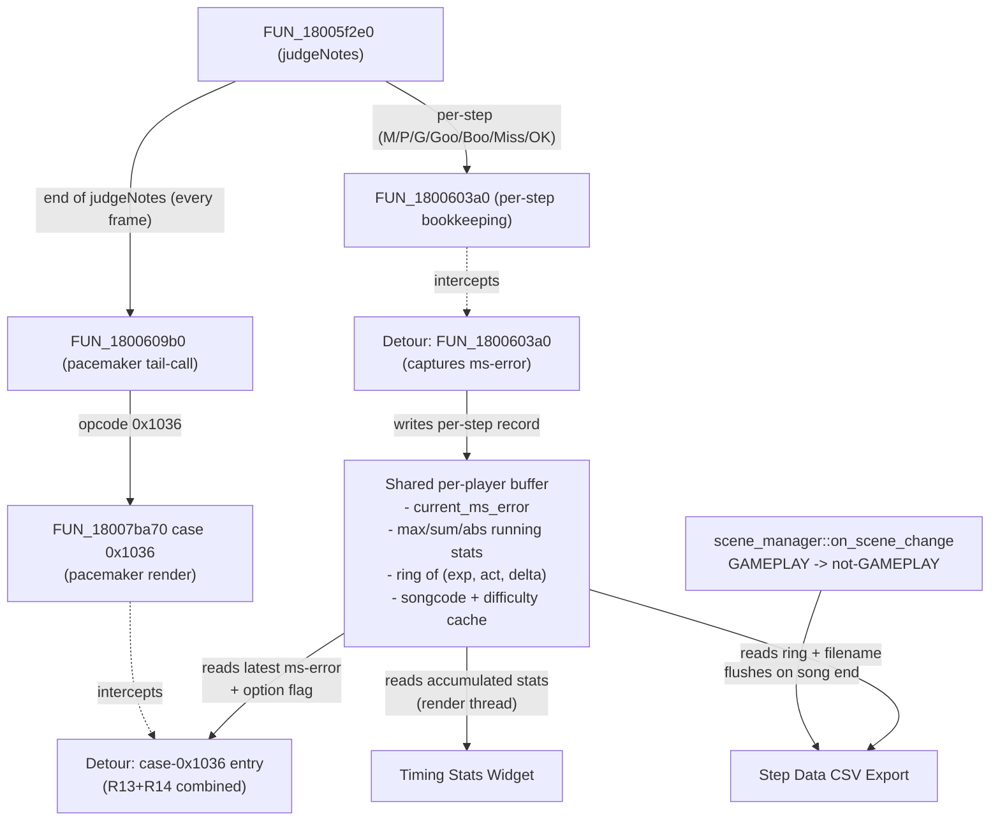

# Per-Step ms-error Data Feed and Song-End Event — RE Findings

Research for the **PowerUserStatistics** mod (Q12–Q14 of `idea-honing.md`).
Goal: feed three sub-features (Timing Stats widget, Pacemaker→MsError swap,
Step Data CSV Export) from a single ms-error data source, and identify a
clean per-song flush event for CSV export.

All Ghidra addresses below are file-relative to `gamemdx.dll`'s
`0x180000000` base. Verified on **`gamemdx_20250805_MODIFIED.dll`** (= the
20250805 stock layout, plus the binary mod's edits — used for understanding
the original mod's cave-3 logic) and **`gamemdx_20260421.dll`** (the latest
supported game version). Per-version anchors are tabulated in §1.

---

## Overview

Per-step ms-error in DDR World is **the signed delta in milliseconds
between the player's actual hit time and the note's expected time**, with
negative = early, positive = late. The engine never stores this as a
named field — it is computed on the fly inside `judgeNotes` (the per-frame
judgment dispatcher) every time a step is judged, then forwarded as one
integer in a small struct passed via virtual dispatch to the score-render
function.

Three places in the engine touch this number:

1. **judgeNotes**, function `FUN_18005f2e0` (20260421) — computes
   `local_104.lo = playhead_music_count - note->music_count` and stuffs
   the result into a 4-int struct `local_108`. The struct is passed (by
   pointer) as the 4th arg to `FUN_1800603a0`, the per-step bookkeeping
   helper.

2. **FUN_1800603a0** (per-step bookkeeping). Updates score/combo/fast-slow
   counters. Uses `(int)param_2[1] - *(int *)(*param_2 + 8)` (= `result.judgeTimestamp - note.music_count`)
   for fast/slow classification — proving that `param_2[1]` (the result's
   judge-timestamp) is in the same units (ms) as the note's `music_count`.
   Then the helper does `(**(code **)(*param_1 + 0x18))(param_1, opcode,
   param_4)` — a virtual dispatch on the actor that reaches the score-render
   function with the local struct (from judgeNotes) as `param_4`.

3. **Score-render function**, `FUN_18007ba70` (20260421). The virtual
   dispatch lands here. Cases `0x1028..0x102f` are the per-judgment opcodes
   (one per grade); the per-step ms-error sits at `[r14+4]` (= `param_3[1]`,
   where `R14 = R8 = param_3` is set at function entry). Case `0x1036` is the
   per-frame pacemaker render — its `[r14+8]` is the cumulative score-target
   delta, NOT the ms-error.

The original community mod taps **(3)** with two trampolines:

- **R17** at the per-judgment site (`mov [rdi+0x98], eax`) snapshots the
  ms-error into a per-player BSS row at `0x1802c219c + idx*0xe`. The same
  row is updated with running max/sum/abs-sum and a step counter.
- **R13** at the pacemaker render site (`mov rdx, [rdi+0xb0]`) reads the
  most-recent ms-error from that BSS row and overwrites RSI before the
  formatter call, so the player sees ms instead of the score delta.

This tells us the original mod **needs both hooks** — a single
judge-time hook isn't enough, because the pacemaker render also runs
inside `judgeNotes` and consumes the formatter input within the same
call.

---

## judge_hook Existing API Capabilities

The dispatcher (`src/services/judge_hook.rs`) installs exactly one
detour on `judgeNotes` (`FUN_18005f2e0` in 20260421, resolved at runtime
via the `"sequence::dance::GamePlayActor::judgeNotes"` debug-string xref
in `core::signatures::find_judge_notes`). Subscribers register `fn(actor:
*mut u8, music_count: i32)` callbacks at `Priority::Early | Normal | Late`,
fired pre and post the original.

What a subscriber sees inside the callback:

| Field | Path from `actor` | Type | Used by |
|---|---|---|---|
| play side | `+0x84` | `i32` | autoplay (already) |
| play mode | `+0x88` | ptr to Match struct (first int = play_side) | — |
| Results vector `begin` | `+0xb0` | `*mut u8` | autoplay, note_types_expansion |
| Results vector `end` | `+0xb8` | `*mut u8` | note_types_expansion |
| Notes vector `begin` | `+0xe8` | `*mut u8` | (engine internal) |
| Notes vector `end` | `+0xf0` | `*mut u8` | (engine internal) |
| `IFootPanel*` slot | `+0x270` (older) / `+0x278` (newer) | `*mut u8` | autoplay |

The Result entry layout (`STRIDE = 0x40`) is documented in
`mods/note_types_expansion/game_note.rs::result`. For ms-error work the
relevant offsets are:

| Offset | Field | Notes |
|---|---|---|
| `+0x00` | `note*` | underlying `GameNote` pointer; deref `+0x08` for note's `music_count` |
| `+0x08` | `judgeTimestamp` | `-1` = unjudged; otherwise the player's hit `music_count` |
| `+0x0C` | `grade` | `0..7`, `0xFF` = unjudged |
| `+0x10` | `visible` | suppress-judgment flag |

The `music_count` is the engine's per-frame integer time. **In DDR World
this counter is in milliseconds** — confirmed by the shock-arrow miss
window check in `judgeNotes`: `note.musicCount + 0xa0 <= playhead`
(`0xa0 = 160` ms is a sensible shock-arrow miss window). The cave's
running-stats accumulator at `0x181270500` confirms ms units too: it
multiplies by 10 for the sum buckets and stores the ms-error directly
as a signed byte (range ±127 ms; anything beyond is treated as
out-of-range and not stored).

---

## Per-Step ms-error Reachability

### Option A — direct read from the actor inside a `register_post` callback

A post-judge callback fires **after** the original `judgeNotes` returns.
By that point `judgeNotes` has:

1. Walked the unjudged Result entries, found ones the player has hit on
   this frame, and called `FUN_1800603a0(actor, result, opcode,
   &local_108)` for each. `local_108` carries the music_count delta in
   `local_104.lo` (= `param_3[1]` in the score-render function).
2. Updated the Result entry: `result.judgeTimestamp` ← `local_140`
   (= the playhead `music_count` arg to judgeNotes), and
   `result.grade` ← the assigned grade.
3. Tail-called `FUN_1800609b0` which dispatches the per-frame pacemaker
   render (opcode `0x1036`).

**So inside a `register_post` callback, the ms-error for any step
judged in this frame is reachable as:**

```
ms_error = result.judgeTimestamp - note.music_count
         = *(i32*)(result + 0x08) - *(i32*)(*(u8**)(result + 0x00) + 0x08)
```

The "which entries got judged THIS frame" question is answered by
remembering the previous-frame state. The simplest scheme: per-frame,
walk `[begin, end)`; for any entry where current `judgeTimestamp >= 0`
and our remembered "last known timestamp" was `< 0`, we have a fresh
judgment. Note that the existing `note_types_expansion::registry::
mark_handled_results_skipped` uses an analogous "did the timestamp just
flip past 0" guard — same pattern works here.

**Subtle case: multi-step frames.** A single judgeNotes call can judge
multiple Result entries (a freeze tail and a regular arrow at the same
tick, for example). Walking the vector and looking for fresh transitions
catches all of them. The order is "vector order" which matches the
chart's `(beat_count, music_count)` ordering — fine for stats.

**Subtle case: mines and other expansion notes.** Mines mark themselves
via `note_types_expansion::mark_handled_results_skipped` BEFORE the
post-judge callback runs (mines hook `register_pre` with `Priority::Late`,
or otherwise pre-mark before the original judge). The post-callback must
filter expansion-kind notes out before computing ms-error — checking
`note->kind` against the registry's known kinds is the correct gate.

**Verdict on Option A:** technically sufficient for Timing Stats and CSV
Export, since both consume the data after the fact. But it does NOT
solve the Pacemaker→MsError swap, because R13's hook site fires
*inside* `judgeNotes` (the tail-call into `FUN_1800609b0` →
`FUN_18007ba70` case `0x1036`), and a `register_post` callback runs
*after* `judgeNotes` has already returned. By then the pacemaker has
already rendered the wrong value for this frame.

### Option B — separate hook on the score-render function (case 0x1028..0x102f)

Mirrors the original mod's R17 trampoline. Hook at
`mov [rdi+0x98], eax` (anchor `89 87 98 00 00 00 83 F9 06`,
verified unique at `0x18007bddf` on 20260421 and `0x180077d6f` on
20250805). At hook entry: `EAX` = music_count delta = ms-error,
`RDI` = actor, `R14` = `param_3` ptr, `ECX` = grade.

This is the canonical write of the per-step ms-error into a static
buffer the OTHER subscribers can read. It runs synchronously within
`judgeNotes` (because `FUN_1800603a0` is called from judgeNotes →
virtual dispatch reaches `FUN_18007ba70`), so the data is fresh by
the time the pacemaker render runs in the same `judgeNotes` call.

**Verdict on Option B:** required for Pacemaker→MsError; conveniently
also serves Timing Stats and CSV Export (the same hook fires for every
M/P/G/Goo/Boo/Miss/OK judgment).

### Why Option A vs Option B matters for our architecture

If we don't need Pacemaker→MsError, Option A is strictly cleaner — one
detour total (the existing judge_hook), three subscribers reading from
the same shared buffer that one of them populates.

But with Pacemaker→MsError in scope (Q13), we need the per-judgment
write to happen synchronously inside `judgeNotes`, which means hooking
either `FUN_1800603a0` or `FUN_18007ba70` case `0x1028..0x102f` directly.

The cleanest hook point is `FUN_1800603a0` itself — it has just one
xref (`judgeNotes`), it's called once per judged step (M/P/G/Goo/Boo/
Miss/OK), and at entry the parameters expose everything we need:

```c
void FUN_1800603a0(GamePlayActor *actor,
                   Result *result,
                   uint opcode,           // 0x1028..0x102f, 0x1031, etc.
                   void *delta_struct);   // = &local_108 from judgeNotes
                                          //   delta_struct[1] = music_count delta = ms-error
```

A retour detour on `FUN_1800603a0` runs:
- ONCE per judged step,
- BEFORE the score-render dispatch,
- with full access to actor / result / grade / ms-error.

This is the right hook for the shared "per-step subscriber" service.

---

## Score-Render Function Anchors (R13/R14 verification)

The score-render function is `FUN_18007ba70` on 20260421 / `FUN_180077a00`
on 20250805. Same prologue, same case dispatch table.

Calling convention at function entry:
- `RCX = param_1 = actor*` → saved in `RDI` at `+0x18` of prologue.
- `RDX = param_2 = opcode` → consumed by jump-table dispatch.
- `R8  = param_3 = int*`   → saved in `R14` at `+0x14` of prologue.

Result: throughout the function body, `RDI = actor`, `R14 = int*`. The
`int*` content depends on which case is dispatched (different callers
populate the struct differently).

### R13 site — pacemaker render override (`mov rdx, [rdi+0xb0]`)

| Version | Address | Instruction bytes | Anchor pattern |
|---|---|---|---|
| 20250805 stock | `0x180077b36` | `48 8B 97 B0 00 00 00` | unique |
| 20260421 stock | `0x18007bba6` | `48 8B 97 B0 00 00 00` | unique |

Anchor: `48 8B 97 B0 00 00 00` (verified unique on both via Ghidra
byte-pattern search). Do NOT extend past byte 7 — the immediately-
following `MOVD XMM0, ESI` is encoded `0F 6E C6` on 20250805 and
`66 0F 6E C6` on 20260421 (operand-size prefix added in the newer build).

**Calling convention at this site (case `0x1036`):**
- `RDI = actor`
- `R14 = int*` whose content is `[play_side, score_value, score_delta]`
  laid out from `FUN_1800609b0`:
  - `[r14+0x00]` = play side (matches `actor->[+0x84]`)
  - `[r14+0x04]` = current cumulative score value (`local_60` high half)
  - `[r14+0x08]` = score delta (target − current) — the value the
    formatter is about to print.
- `RSI` already loaded with `MOVSXD RSI, [R14+0x8]` four bytes earlier
  (at `0x18007bba2`), holding the same score-delta sign-extended to 64-bit.

Hook strategy: **replace `RSI` with the ms-error**, not `[R14+8]`. The
original mod overwrites `[R14+8]` AND the cave preserves `RSI` from the
overwrite via `movsx rsi, byte [...]; mov [r14+8], esi` — the former
is what actually changes the rendered output (RSI is what the
subsequent `MOVD XMM0, ESI` consumes), the latter is just for
defense-in-depth so any later code that re-reads the slot also sees the
new value. A retour detour-style port can do the same in safe Rust:

```rust
unsafe extern "C" fn r13_pre(actor: *mut u8, param_3: *mut i32) {
    if pacemaker_swap_active(actor) {
        let player_idx = (*param_3) & 1;            // [r14+0]
        let ms_error = LATEST_MS_ERROR[player_idx as usize].load(Ordering::Acquire);
        *param_3.add(2) = ms_error;                  // [r14+8]
    }
}
```

But because the surrounding instruction is `MOV RDX, [RDI+0xB0]` and
the patched-out instruction needs to be re-executed, the cleanest
approach is a **retour `GenericDetour` on the case-`0x1036` entry**
(the `MOV RAX, [RCX+0x88]` at `0x18007bb2a` on 20260421) rather than
mid-block patching at `0x18007bba6`. A detour at `0x18007bb2a` lets
us read `param_3` from `R8`, decide to override `[r14+8]`, and call
the original. Detour spec is identical on both versions because the
prologue-to-`mov rax` is the same byte sequence.

If we want to preserve the exact mod-file semantics (= a mid-block
hook at `mov rdx, [rdi+0xb0]`), use `core::scanner::scan_first_call_rel32`
to find the case-0x1036 dispatch entry and install a `GenericDetour`
on the CASE ENTRY, not mid-block — retour requires at least 5 bytes
to install a JMP, and `mov rdx, [rdi+0xb0]` is 7 bytes, so it would
work in principle. **Recommendation: detour at the case-entry, set
the override there, no mid-block patching.**

### R14 site — pacemaker white-zone color trigger (`mov rax, [rcx]; test esi, esi; jne ...`)

| Version | Address | Instruction bytes | Anchor pattern |
|---|---|---|---|
| 20250805 stock | `0x180077b88` | `48 8B 01 85 F6 75 22 F3 0F 10 0D` | unique |
| 20260421 stock | `0x18007bbf8` | `48 8B 01 85 F6 75 20 F3 0F 10 0D` | unique |

Anchor: `48 8B 01 85 F6 75 ?? F3 0F 10 0D` (JNE displacement wildcarded;
the slow-path basic block shrank by 2 bytes between versions).

**This is also inside case `0x1036`** — same RDI/R14 conventions as R13.
Distance from R13 site: `0x18007bbf8 - 0x18007bba6 = 0x52` bytes. Both
hooks land in the same case body but at non-overlapping detour ranges
(retour copies 5–15 bytes per detour, so 0x52 spacing is comfortably
clear).

The semantic of R14: `RSI = score-delta` (or our overridden ms-error,
if R13 ran and re-wrote `[r14+8]`); `TEST ESI, ESI` sets ZF based on
sign of the delta. The JNE at offset 6 takes the non-zero path
(`0x18007bc1f` — pick "above" or "below" target color). The fall-through
is the white/perfect path. The mod forces ZF=1 (= fall-through to white)
when `|ms_error|` is below the configured threshold.

Hook strategy: same idea as R13 — install at the **case-`0x1036`
entry** with a single detour, and inside the dispatcher's logic decide
whether to override the formatter input AND/OR force the white path.
The two behaviors (R13 = formatter override; R14 = color zone) are
controlled by the same player option, so a single combined detour is
the natural shape.

**Both anchors verified unique on 20260421 via `mcp__ghidra__search_byte_patterns`.** The 20250805 verification is from the
research doc's existing cross-version table (re-confirmed by reading
the modified DLL's bytes at the patch sites — `e8 a5 8b 1f 01 90` at
`0x180077b36` is `call 0x1812706e0; nop`, replacing the original
`48 8B 97 B0 00 00 00`).

---

## Song-End Event Options

For CSV Export we need a "song complete" event after which the per-step
buffer is flushed to disk. Three candidate triggers, ordered by
preference:

### Option 1 (preferred) — `scene_manager::on_scene_change` watching scene 28 → 29 transition

`services::scene_manager::on_scene_change` fires whenever
`TransitionSequence::createNextSequence` is called. The transition
from scene 28 (`GAMEPLAY`) to scene 29 (`STAGE_RESULT`) marks song-end
in the canonical state machine.

**Timing question — is this "late enough"?** Yes. By the time the
scene-change hook fires, judgeNotes has stopped running (the gameplay
actor's `onUpdate` is no longer being called) — meaning all per-step
data has already been committed to our static buffers. There is no
late-binding straggler on the judgment path that fires after the scene
flip.

**Why this is good enough:** the transition is initiated by the engine
when the chart's last note has been processed and the post-stage
animation cooldown has elapsed. The Results vector is fully populated
and stable. We can read it (or our shadow buffer) safely.

**One nuance — failed-out / quit-out paths.** Scene 28 can also exit
to scene 25 (SONG_SELECT, in the failed-out / Quick-Fail case) or
scene 30/32. CSV flush should fire on **any** scene-28 → not-28
transition, not just 28 → 29 specifically. The code looks like:

```rust
scene_manager::on_scene_change(Box::new(|prev, next| {
    if prev == scene::GAMEPLAY && next != scene::GAMEPLAY {
        flush_step_data_csv();
    }
}));
```

### Option 2 — actor onUnload virtual call

`GamePlayActor` is destroyed when the gameplay scene exits. Vtable[?]
likely has an `onUnload`/`destroy` callback. This is more granular than
scene transition but harder to pin to a stable signature, and it doesn't
buy us anything over Option 1 since the data is already complete by the
time scene 28 ends.

### Option 3 — last-note detection inside judge_hook

Track when `Results.end == Results.begin + last_judged_index*0x40` and
treat that as song-end. Brittle: the player can fail mid-song, the
chart can have a sustained final note that takes time to release, etc.
Not recommended.

**Recommendation: Option 1.** Single integration point, leverages an
existing service (`scene_manager`), no new hook needed.

---

## Songcode/Difficulty Read Paths

CSV filename per Q14 needs `<songcode>` and `<difficulty>`. The
gameplay actor has the active song info reachable by indirection:

### Songcode (canonical 4–5-character ASCII slug, e.g. `"acef"`)

**Source:** the song-load setup function `FUN_180061c20` (vtable
target — referenced from three vtables at `0x181287d80`, `0x18041de20`,
`0x18035efc8`). It uses `param_1` as a "session/match" struct (NOT the
GamePlayActor). On that session struct:

| Offset | Field |
|---|---|
| `+0x98` | `std::string` body (in-place buffer or pointer; SSO threshold = 16) |
| `+0xb0` | `std::string` size (size_t; if `>= 16`, deref `[+0x98]` for heap buffer) |
| `+0x118` | chart_info ptr (player 0): `[+0x4]` = difficulty index |
| `+0x120` | chart_info ptr (player 1): `[+0x4]` = difficulty index |

This is canonical MSVC `std::string` layout. Same shape on both versions.

**Reaching it from a judge_hook callback:** the GamePlayActor's `+0x88`
slot holds a pointer to a struct whose first int matches `actor->[+0x84]`
(play_side) — confirmed by `case 0x1036`'s check
`*param_3 == **(int **)(param_1 + 0x88)`. That pointer is the
session/match struct. So the chain is:

```
session = *(u8**)(actor + 0x88)
songcode_str = session + 0x98          (deref if size at +0xb0 >= 16)
songcode_size = *(usize*)(session + 0xb0)
chart_info = *(u8**)(session + 0x118)  // player 0 (or +0x120 for player 1)
difficulty = *(i32*)(chart_info + 0x4)
```

Caveat: the user's research note for Q14 says "drop to a numeric code if
the resolved label isn't easily available at write-time" — **the
difficulty field at `chart_info+0x04` is a numeric index** (0..7
typically: 0 = beginner, 1 = basic, 2 = difficult, 3 = expert,
4 = challenge, 5+ = special). Mapping to the human-readable label
(`single_basic`, `double_challenge`, etc.) requires combining with the
play_mode (single vs double) which is separately reachable from the
chart_info. For the CSV filename a numeric code is sufficient and
unambiguous; the label can be built post-RE if desired.

### Difficulty index — already covered above (`chart_info + 0x4`)

The `chart_info` struct also holds: `+0x00` = something the existing
code looks at (likely a chart subtype id), `+0x04` = difficulty index,
`+0x02` = active-flag byte. Layout matches the structure used by both
`FUN_180057b70` (multi-actor session setup) and `FUN_180061c20`.

### Caching strategy

Resolve songcode + difficulty once per song at the first `judge_hook::register_pre`
callback of a song (gated by "first call after a non-gameplay → gameplay
scene transition"), copy into a Rust-owned `String`/`i32`, and use that
for the CSV filename. Don't read from the engine's std::string at
flush time — by the time the scene transition fires, the session
struct may have been mutated for the next song's setup.

---

## Recommended Data Flow Architecture

**One shared subscriber.** All three sub-features consume the same
per-step ms-error stream. Build a single internal service inside
`PowerUserStatisticsMod` that:

1. Owns the **shared per-player buffer** (current ms-error, running
   max, sum_signed, sum_abs, step counter, full ring of `(expected_ms,
   actual_ms, delta_ms)` triples for CSV).
2. Installs **one `retour::GenericDetour`** on `FUN_1800603a0` (= the
   per-step bookkeeping helper) and dispatches each step into the
   shared buffer. `FUN_1800603a0` is called from judgeNotes → captures
   every M/P/G/Goo/Boo/Miss/OK judgment with full context (actor,
   Result, opcode, ms-error).
3. Installs **one `retour::GenericDetour`** on the case-`0x1036` entry
   (`mov rax, [rcx+0x88]` at `0x18007bb2a` on 20260421) for the
   pacemaker swap. The detour reads from the shared buffer and decides
   whether to override `[r14+8]` (R13 behavior) and whether to force
   ZF=1 in the subsequent test (R14 behavior).
4. Subscribes to **`scene_manager::on_scene_change`** for the song-end
   flush. On `GAMEPLAY → !GAMEPLAY`, flushes the CSV.

The Timing Stats widget reads from the shared buffer on the render
thread — no judge-hook involvement at all on the read side.



**Per-player gating** (Q12/Q13 require per-side options) is enforced at
the read path:

- `FUN_1800603a0` detour always writes the buffer (cheap; always-on
  collection makes mid-song toggle behavior predictable for CSV: the
  user gets a complete file even if they tab into the option menu
  mid-song).
- The Timing Stats widget reads only the row for sides whose
  `pus_timing_stats` is ON.
- The case-0x1036 detour reads `pus_pacemaker_to_mserror` and
  `pus_pacemaker_threshold` for the active side (= `param_3[0]`) and
  no-ops if OFF.
- The CSV flush writes a file only for sides whose
  `pus_step_data_export` is ON at song-start (snapshot at the first
  per-step capture of the song; mid-song toggle does not change the
  decision per Q14).

### Why not split into multiple judge_hook subscribers?

Splitting per sub-feature would mean three separate subscribers all
walking the same `Results` vector and computing the same `delta`.
Each walk is `O(n)` in the chart's note count; a 600-note chart
runs the walk 60×/sec = 36000 walks/sec just for stats. That's
trivial in absolute terms but it duplicates work and creates three
places to maintain the "fresh judgment detection" idiom. One
subscriber writing to a shared buffer, three readers — same idiom we
already use for `judge_hook` itself.

### Why hook `FUN_1800603a0` rather than `FUN_18007ba70` case `0x1028..0x102f`?

Both work; the score-render case sees the same data. Two reasons to
prefer `FUN_1800603a0`:

1. **Single xref.** It's called only from `judgeNotes`. Hooks installed
   here can't be confused by another caller.
2. **Cleaner parameters.** The detour signature is naturally
   `(actor, result, opcode, delta_struct)` — the result pointer is
   handed to us directly, no need to walk the vector. The score-render
   function would require us to reach the result via the actor's
   `[+0xb0]` and the playhead.

### Failure modes and degradation

- Signature `judge_notes` resolves but `FUN_1800603a0` doesn't (we'd
  need a new signature to find it — anchor it via xref-from `judgeNotes`
  using `core::scanner::scan_first_call_rel32` on the section that
  contains the per-step dispatch). If unresolved, log warn and disable
  the mod's per-step features; pacemaker swap also disabled.
- Case-`0x1036` entry detour fails to install. Pacemaker swap disabled,
  Timing Stats and CSV Export still work.
- Scene change service unavailable. CSV Export disabled, others still
  work.

Each sub-feature degrades independently per the project's "graceful
degradation over hard failure" rule (CLAUDE.md §2).

---

## Summary table — hooks needed

| Hook | Site | Anchor (file-relative bytes) | Owner | Purpose |
|---|---|---|---|---|
| `judge_hook` (existing, dispatcher) | `FUN_18005f2e0` (judgeNotes) entry | (resolved by debug-string xref) | `services::judge_hook` | not used by PowerUserStats directly |
| **NEW**: shared per-step capture detour | `FUN_1800603a0` entry | derive via `scan_xrefs_to(judgeNotes_call_target)` — single xref from inside `judgeNotes` | PowerUserStatisticsMod | populates shared buffer |
| **NEW**: pacemaker-render combined hook | case-`0x1036` entry of score-render function (`mov rax, [rcx+0x88]` at `0x18007bb2a` on 20260421) | derive via `scan_xrefs_from(0x1036 jump-table entry)` OR keep R13 anchor `48 8B 97 B0 00 00 00` mid-block (both work; case-entry is cleaner) | PowerUserStatisticsMod | R13 + R14 combined |
| `scene_manager::on_scene_change` (existing) | `TransitionSequence::createNextSequence` | (existing signature) | `services::scene_manager` | song-end flush trigger |

### Cross-version anchor verification

| Anchor | 20250805 stock | 20260421 stock | Notes |
|---|---|---|---|
| `48 8B 97 B0 00 00 00` (R13) | unique @ `0x180077b36` | unique @ `0x18007bba6` | Don't extend past byte 7 (operand-size prefix differs on next instr). |
| `48 8B 01 85 F6 75 ?? F3 0F 10 0D` (R14) | unique @ `0x180077b88` | unique @ `0x18007bbf8` | JNE displacement wildcarded. |
| `89 87 98 00 00 00 83 F9 06` (R17 alt site, NOT used in our design) | unique @ `0x180077d6f` | unique @ `0x18007bddf` | Listed for completeness — we use `FUN_1800603a0` instead. |

All anchors verified via `mcp__ghidra__search_byte_patterns` against
20260421 in this session; 20250805 verifications carried over from
`docs/binary_modpack_research.md` cross-version table (re-confirmed by
reading the modified DLL's patch sites).

---

## Gotchas

1. **`musicCount` is in milliseconds in DDR World** (not 1/60 ticks as
   in older Bemani titles). Confirmed by the 0xa0 (= 160 ms) shock-arrow
   miss window check in judgeNotes and by the original mod's cave at
   `0x181270500` storing the delta as a signed byte (range ±127 ms).
   No conversion needed when reading `param_3[1]` or computing
   `result.judgeTimestamp - note.music_count`.

2. **Pacemaker render runs at the END of every `judgeNotes` call**
   (tail-call to `FUN_1800609b0`). A `judge_hook::register_pre` callback
   sees the previous frame's data; a `register_post` callback runs
   AFTER pacemaker render. Neither is in time to override the formatter
   input — that's why R13 needs its own hook in the score-render
   function, NOT in `judge_hook`.

3. **Mines / expansion notes already mark Result entries as judged on
   their first frame** via `note_types_expansion::registry::
   mark_handled_results_skipped`. A naive "look for transitions in the
   Result vector" stats-collector would treat mine-marks as ms-error
   data. Filter on `note->kind`: only stock kinds (`ARROW=0`,
   `THINOUT=1`, `FREEZE_TAIL=2`) should contribute to ms-error. The
   `FUN_1800603a0`-detour approach side-steps this entirely because
   the per-step opcodes (`0x1028..0x102f`) are dispatched only for
   real M/P/G/Goo/Boo/Miss/OK grades; the registry's mine-marking
   doesn't go through `FUN_1800603a0` at all (it just mutates the
   Result entry directly).

4. **`actor->[+0x88]` is NOT the song-info struct directly** — it's
   a struct whose first int is the play_side. The session/match struct
   that holds the songcode is reachable through it but the layout is
   tangled. For songcode caching the pragmatic approach is to hook the
   chart-load entry (`FUN_180061c20` or its caller) and snapshot
   `(songcode, difficulty)` at song-start, rather than reaching it
   from inside the judge-time hot path.

5. **Don't confuse R14 site location with R14 register usage.** The
   "R14" naming in the binary-mod research doc is the patch ordinal
   (Region 14), not the x64 register. Inside the score-render function
   the R14 register holds `param_3` (= the `int*` from the dispatch
   call). The RE conventions for hook-callback parameter access in
   this codebase use `R14 = param_3` consistently.

6. **The pacemaker_target field on the per-player struct is at
   `+0x1308`** (read by the original mod's swap-check helper at
   `0x181270700`: `cmp [rbx+0x1308], r8b`). This is a per-player config
   field accessible via the global player array at
   `[image_base + 0x6b5c60 + player_idx*8]`. The exact path is:
   `player = *(u8**)(0x1806b5c60 + player_idx*8)`,
   then `player[0x1308]` = pacemaker target id (compare to the option's
   "which target slot triggers the swap" config). Matches the binary
   research doc (§7).
