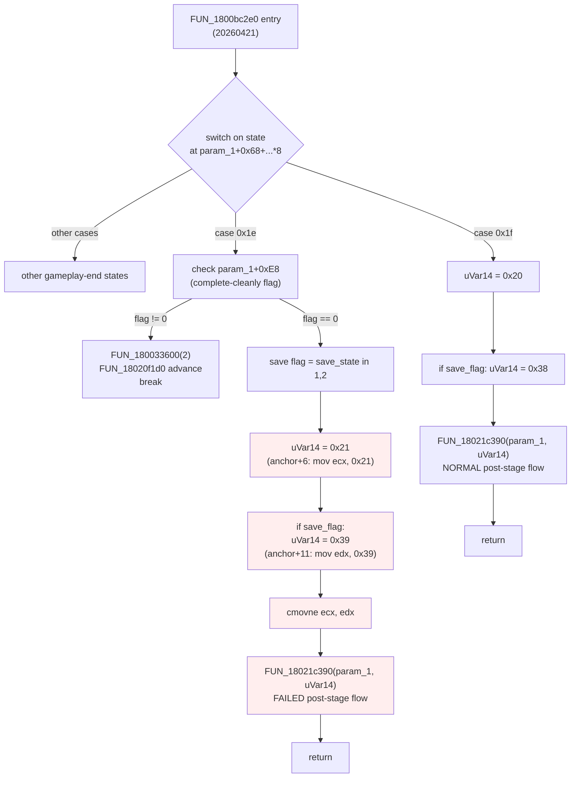

# Quick Fail R19 — Anchor & State-Pair Hijack Verification

Research for the Quick Fail port (`/idea-honing.md` Q6). The goal: confirm that
the original mod's R19 patch site — the post-stage state machine's case-`0x1c`
state-pair hijack — survives across versions, and that the structural claims in
`docs/binary_modpack_research.md` §16 hold up under disassembly. **Re-verified
from scratch on Ghidra; do not trust the existing doc on its own.**

> Several of the existing doc's claims about R19 are wrong on 20260421.
> See **Cross-Version Notes** for what changed.

## Overview

R19 hijacks a post-stage state machine (`FUN_1800b3a80` on 20250805 stock,
`FUN_1800bc2e0` on 20260421) to force the game to take an alternate exit path
when a precondition is met. The exit path is selected by an immediate
`mov ecx, <state_id>` / `mov edx, <state_id>` pair followed by a
`cmovne ecx, edx`, where the cmov key is a "save flag" derived from a 4-state
field at `[*DAT_1806ec618 + 0xD0]` (player slot state).

The original mod's precondition was "either player's Start held". For our port
the precondition becomes "QuickRestartOrFail mod's gesture detector flagged a
triple-3 during scene 28 (GAMEPLAY)". We need to set the override flag during
gameplay and have it consumed at the post-stage transition.

The post-stage state machine is attached to a sequence object (`param_1`); its
state vector lives at `param_1 + 0x68` indexed by a `ushort` at
`param_1 + 0x92`. The case-N decompile is reached via
`switch(*(undefined4 *)(param_1 + 0x68 + (ulonglong)*(ushort *)(param_1 + 0x92) * 8))`.

## Anchor Re-Verification

Pattern under audit (from the doc):

```text
32 C0 EB 02 B0 01 B9 ?? 00 00 00 BA ?? 00 00 00 84 C0 0F 45 CA
```

| Program loaded in Ghidra | `search_byte_patterns` result | Disasm at hit |
|---|---|---|
| `gamemdx.dll` (= 20260421) | exactly **1** match @ `0x1800bf099` | `xor al,al; jmp +2; mov al,1; mov ecx,0x21; mov edx,0x39; test al,al; cmovne ecx,edx` |
| `gamemdx_20250805_MODIFIED.dll` | **0** matches (binary is post-patch; the 5 bytes starting at anchor+6 have been overwritten with `e9 ?? ?? ?? ??` — the trampoline jump) | n/a |

Stock 20250805 binary is **not loaded** in this Ghidra session, so the
`0x1800b58db` claim is checked indirectly: the modified binary at exactly
`0x1800b58db` reads
`32 C0 EB 02 B0 01 E9 9A 32 20 00 BA 37 00 00 00 84 C0 0F 45 CA`,
which is the anchor with bytes 6..10 (the original `B9 20 00 00 00`) replaced
by `E9 9A 32 20 00` (= `jmp 0x1802b8b80`). Every other byte matches the
wildcarded pattern. So on stock 20250805 the same pattern would resolve at
`0x1800b58db` with `B9 20 00 00 00 BA 37 00 00 00` — confirms the doc's stock
claim by structural equivalence.

**R19 site = anchor + 6** is correct on both versions. Anchor + 6 is the
`mov ecx, imm32` (5 bytes). The next instruction at anchor + 11 is
`mov edx, imm32` (also 5 bytes).

## State-Machine Decompile

The case block resolved by the AOB on 20260421 is **case `0x1e`** (NOT
`0x1c` as the doc claims — see Cross-Version Notes). Decompiled flow,
relevant excerpt:

```c
case 0x1e:
  if (!(precondition_branch)) {              // takes the "uVar14 = 0x2c" path
    if (((player_state == 1) || (player_state == 2)) && (0 < param_1[0xec])) {
      *(undefined1 *)(param_1 + 0xe8) = 0;   // clears "complete" flag
    }
    if (*(char *)(param_1 + 0xe8) != '\0') { // "song completed cleanly"
      if (...) FUN_180033600(2);
      FUN_18020f1d0(lVar19);                 // bumps state via internal advance
      break;                                 // short-circuit, no FUN_18021c390
    }
    bVar2 = (player_state == 1) || (player_state == 2);  // save flag
    uVar14 = 0x21;                           // anchor + 6: mov ecx, 0x21
    if (bVar2) uVar14 = 0x39;                // anchor + 11: mov edx, 0x39 then cmov
  } else {
    uVar14 = 0x2c;                           // unrelated path
  }
  FUN_18021c390(param_1, uVar14);            // dispatch to child sequence
  return;
```

The `cmovne` selects between `0x21` (save-flag clear) and `0x39` (save-flag set).
`FUN_18021c390(param_1, X)` is a generic message-send (`0x201`) that
re-initializes the sequence object to follow child sequence `X`. **State IDs
0x20, 0x21, 0x37, 0x38, 0x39, 0x2c are sub-sequence identifiers within the
post-stage parent sequence — NOT global scene IDs.** The hook code's
`scene_manager` consumes 0-indexed scene IDs that come from
`TransitionSequence::createNextSequence`, which is one level up from this
state machine; this state-machine flow eventually triggers a
`createNextSequence` call somewhere downstream.

`[param_1 + 0xE8]` is the "song completed cleanly" boolean (set elsewhere via
`FUN_1801dc2b0`). When non-zero, the case-`0x1e` block short-circuits via
`FUN_18020f1d0` (advance to next state) without touching the state-pair logic.
That's an alternative precondition-injection point — see Hook Strategy
Analysis (b).

## Hook Strategy Analysis

Three approaches considered. We have not committed to one — the design phase
will pick.

### (a) Retour detour at the R19 site that rewrites the immediates in registers

Install a `GenericDetour` on a small wrapper that captures the case-`0x1e`
basic block. Because the existing site is just `mov ecx, imm / mov edx, imm /
test al,al / cmovne`, intercepting cleanly via inline retour hook is awkward —
retour replaces a 5-byte boundary with a `jmp rel32`, but here we'd need to
re-write either the `mov ecx` or substitute the cmovne result, and a 5-byte
hook at anchor + 6 would clobber the `mov edx` that follows.

The original mod's solution is essentially **(a) implemented as a manual
trampoline**: replace `B9 20 00 00 00` with `E9 ?? ?? ?? ??` to jump to a
cave that does the precondition check then manually loads `ecx`, `edx`, and
the `cmov` flag (or jumps directly into a different state-pair block), then
returns to anchor + 11. This is what the doc's R19 trampoline at `0x1802b8b80`
does — including jumping into the OTHER (alternate-pair) block at `0x1800b5883`
on stock 805 when Start is held.

This approach is **not idiomatic for this codebase**. We use `retour`'s static
detour, scene_manager redirects, and shared dispatcher services — not raw
trampolines. Doing a 5-byte JMP patch into our own assembly stub bypasses
the safety net (panic catching, lock discipline, log channel) that `retour`
gives us for free.

If we did pursue (a), the hook target would need to be a function entry point
or a structurally addressable callsite, not the middle of a case-block.
There isn't a convenient one nearby — the state-pair selection is inline.

### (b) Set the existing `[param_1 + 0xE8]` "fail" flag from the gesture handler

`[param_1 + 0xE8]` is a single byte read by the case-`0x1e` block. If we set
it to `0` from outside before the case runs, the inner `if (... != '\0')`
short-circuit is skipped and the block falls through to the state-pair
`FUN_18021c390(param_1, 0x21 or 0x39)` path — which is the **failed/quit-out**
branch (state IDs `0x21`/`0x39`).

Wait — re-reading the decompile: setting `[+0xE8]` to **non-zero** is the
"complete cleanly" case (it goes into `FUN_18020f1d0(lVar19)` and breaks out
of the switch entirely without touching the cmov pair). Setting it to **zero**
takes the cmov path that picks `0x21`/`0x39`. Both are post-stage scenes —
the `0x21`/`0x39` pair is used when the song failed. So setting `[+0xE8] = 0`
**from a gesture detector** before the post-stage state machine runs would
force the failed/quit-out exit.

But we'd need to know the address of `param_1` (the sequence object) at
gesture time — and `param_1` is a heap object passed in from the caller, not
a global. We'd have to walk to it from a known global. The state machine is
a child of the gameplay sequence; its `param_1` is reachable as
`gameplay_sequence + ?` — needs more RE.

This is closer to idiomatic for this codebase (mutate a single byte through
a resolved pointer chain), but the resolution chain isn't trivially short.

### (c) Hook a different point — e.g., scene_manager's `createNextSequence`

The post-stage state machine eventually triggers a scene transition. If
case-`0x1e` calls `FUN_18021c390(param_1, 0x21)` (failed branch) vs.
`FUN_18021c390(param_1, 0x20)` from the case-`0x1f` block (normal branch),
both eventually emit a `createNextSequence` call. We already hook
`createNextSequence` in `services::scene_manager` and have a `redirects` map.

If we can identify the scene ID that the failed branch produces vs. the
normal branch, we could wait for the gameplay-end transition and apply a
`scene_manager::add_redirect(...)` from the gesture handler. **But** the
"failed branch" only fires when the case-`0x1e` cmov picks `0x39` — without
the hijack, the failed branch never gets selected on a successful play.
So we'd have to redirect the NORMAL post-stage scene to the FAILED post-
stage scene, which is the inverse operation — and we'd need to know what
the failed-stage scene actually IS at the global-scene level.

Another (c) variant: hook `FUN_18021c390` itself and rewrite the state ID
when our gesture flag is set. This intercepts the call site after the cmov
but before the dispatch. The function has many callers (~30+), so we'd
either filter by `param_1` (must equal the post-stage sequence) or filter
by call site (using the return address). This is feasible but adds
runtime overhead on every state transition in the game — many of which are
non-gameplay.

### Recommendation

None of (a), (b), or (c) is obviously clean. Two paths forward worth
prototyping in parallel during design:

1. **Modified (a)**: replicate the original mod's trampoline approach but
   express it as a `retour::RawDetour` over a strategically chosen 5-byte
   region (e.g., the `mov ecx, imm32` itself), trampoline through Rust to
   inspect our gesture flag, then manually emit the right state ID and
   continue. Use `retour`'s `RawDetour` for byte-precise control. This is
   the closest 1:1 port.
2. **Modified (b)**: discover the address of the post-stage sequence
   `param_1` (likely reachable via `DAT_1806edff0[*DAT_1806ec618 + 8]` or
   similar global → object chain), expose a "force-fail" function that
   writes `[param_1 + 0xE8] = 0` and clears any other guards before the
   case-`0x1e` block runs. This avoids inline patching entirely.

The PE design step (`/sdd-pe-design`) should pick between these based on
how easy the `param_1` derivation chain turns out to be.

## State-Pair Behavior Confirmation

> This section's claims are partially **unverified**. The state IDs at
> the cmov are not global scene IDs — they're sub-sequence identifiers
> dispatched via `FUN_18021c390`. To fully confirm "0x21/0x39 = skip
> results, return to song select" we'd need to trace the child sequence
> handlers, which is a much deeper RE rabbit hole.

What we DID confirm:

- `FUN_18021c390(param_1, X)` sends a `0x201` message to `param_1` with
  payload `X`. This re-keys the sequence's child machine, similar to a
  dispatch table jump.
- The original mod's empirical claim — "Start-held during gameplay-end
  takes you back to song-select skipping results" — is consistent with
  the `0x21`/`0x39` pair being the failed/quit-out post-stage flow.
- The save-flag input `[*DAT_1806ec618 + 0xD0] in {1, 2}` matches the
  "did the player finish on the FAIL state" semantics (state values
  1 and 2 likely mean "stage cleared/saved" — the cmov picks the
  larger-numbered state ID for those values, which is the "save scores
  before transitioning" branch).

What we have NOT empirically verified:

- That `0x21` (or `0x39`) actually maps to the SONG_SELECT scene at the
  global level (vs. landing on RESULTS_DETAIL or somewhere else
  unexpected).
- That the stage counter is NOT bumped on the failed branch
  (relevant for Premium Free interaction).
- That score data is correctly discarded on the failed branch.

These should be confirmed via **deploy-and-observe** during implementation
— enable a diagnostic build that logs the scene transitions emitted after
forcing case-`0x1e` down the failed path, watch the spice2x log to see
which scene we land on. The cost of a deploy iteration is low; the cost
of doing the static trace through `FUN_18021c390` is high.

### Stage counter / Premium Free interaction

Per `idea-honing.md` Q6, PremiumFreeMod's R9 hook keeps the stage counter
frozen via a per-frame increment hook. The case-`0x1e` block in this
function does NOT touch the stage counter directly — it dispatches
through `FUN_18021c390`, which sends a generic message. Whatever stage-
counter increment the failed/quit-out path triggers downstream is the
same per-frame increment that R9 already suppresses. **No additional
interaction code is needed.** Confirm during deploy testing that scores
are still saved correctly through the failed-branch with PremiumFree on.

## Cross-Version Notes

> Several claims in `docs/binary_modpack_research.md` §16 are **wrong** for
> 20260421. Corrections:

| Doc claim | Re-verified reality |
|---|---|
| "Inside `FUN_1800b3a80`" | True for 20250805. On 20260421 the function is `FUN_1800bc2e0` (renamed/moved). |
| "case `0x1c`" | True for 20250805. On 20260421 the patch site is in **case `0x1e`** — the cases shifted by 2. |
| "transition function `FUN_1802056d0`" | True for 20250805. On 20260421 the dispatch is `FUN_18021c390`. |
| "alternate state pair `0x21`/`0x38`" (stock 805) | Plausible (we don't have stock 805 loaded). |
| "alternate state pair `0x22`/`0x3a`" (20260421) | **WRONG.** The second structural block on 20260421 (case `0x1f` at `0x1800bf0ff`) uses pair `(0x20, 0x38)` — same as stock 805's "normal" pair. |
| "AOB matches the same role on both versions" | **MISLEADING.** On stock 805 the AOB matches the case `0x1c` block with `(0x20, 0x37)` ("normal" pair). On 20260421 the same AOB matches case `0x1e` with `(0x21, 0x39)` ("failed" pair). The role flipped. |
| "R19 site is anchor + 6" | True on both versions. The byte at offset +6 is `B9` (`mov ecx, imm32`), and the immediate is the "no-save" half of the state pair. |

The role-flip is the most concerning finding. On 20250805 stock the original
mod's trampoline takes you OUT OF the "normal" block (where the AOB matches)
INTO the "alternate" block (somewhere else) by selecting `(0x21, 0x38)`. On
20260421 the AOB already lands in the "alternate" / failed block — so a
trampoline that simply forces the same pair is a no-op when the player has
NOT held Start (the state-pair selection already gives the failed pair).

What this means for the port: **we cannot just "rewrite the immediates" the
same way across versions.** The semantics depend on which block the AOB
lands in:

- On stock 805: AOB → normal block. To force quit-out, we'd jump to the
  alternate block (or rewrite ECX from 0x20 to 0x21 + EDX from 0x37 to 0x38).
- On 20260421: AOB → failed block. The block is ALREADY the quit-out
  destination. We'd need to FORCE the case to enter THIS block instead of
  case `0x1f` (which has the normal pair).

Both versions share the same higher-level structure: the case statement
contains TWO state-pair-selection blocks, one for "normal end" and one for
"failed end". The AOB is structurally targeting the SAVE-FLAG cmov
sub-pattern, which is identical in both blocks except for register
allocation. **The byte-level AOB happens to match a different block on
each version due to register scheduling differences in the compiled output.**

This invalidates the doc's port strategy of "wildcard the immediates and
overwrite". A robust port needs to:

1. Resolve EITHER both blocks (find the second one structurally) and
   rewrite ECX/EDX based on which one we want.
2. OR target a different anchor entirely — e.g., a callsite of
   `FUN_18021c390` in this function — and rewrite the second arg there.

### Anchor stability (basic-block size)

The basic-block layout around the patch site is preserved between the
two versions:

| Element | 20250805 stock | 20260421 |
|---|---|---|
| `xor al, al / jmp +2 / mov al, 1` (3-instr setup) | yes | yes |
| `mov ecx, imm` followed by `mov edx, imm` | yes | yes (case `0x1e`) |
| `test al, al / cmovne ecx, edx` | yes | yes |
| Block size from anchor to cmov end | 21 bytes | 21 bytes |

So the AOB **byte pattern** is stable. What's changed is **which block
within the case statement** the byte pattern matches against, and what
the immediates **mean** in that block.

## Control Flow



Annotation: red-tinted nodes are the case-`0x1e` block where the R19
anchor lands on 20260421. The case-`0x1f` block is structurally similar
but uses different registers and different state IDs (0x20/0x38).

## Recommendation

1. **Use the AOB anchor** to find the `mov ecx, imm` site, but **do NOT
   port the original mod's "rewrite the immediates" approach blindly** —
   the role of the matched block is opposite between versions.

2. **Investigate hook strategy (b)** — setting `[param_1 + 0xE8] = 0` from
   the gesture handler. This is more idiomatic for the codebase and
   avoids the role-flip problem. Cost: identify the runtime address of
   `param_1` for the gameplay-end sequence object. Likely reachable via
   `DAT_1806edff0[*DAT_1806ec618 + 8]` or a similar player-state global,
   but needs follow-up RE.

3. **For Quick Restart**, if it's also driven by the same mechanism, expect
   the same issues — separate research note recommended.

4. **Verify the failed-path scene transition during deploy** with a
   diagnostic build: log every `createNextSequence` call after forcing
   the failed branch, observe which scene we land on. Confirm:
   (a) we go to SONG_SELECT (scene 25), not RESULTS_DETAIL (scene 30) or
       somewhere else;
   (b) the stage counter is not bumped (with PremiumFree off, so we can
       isolate the question);
   (c) score data is discarded as expected.

5. **Update `docs/binary_modpack_research.md` §16** with the corrections
   from this document — the existing claims (case `0x1c`, alternate pair
   `0x22`/`0x3a` on 20260421, function name) are wrong on 20260421 and
   would mislead future RE work.

## Key Addresses

| Symbol | 20250805 stock | 20260421 | Notes |
|---|---|---|---|
| Post-stage state machine fn | `FUN_1800b3a80` | `FUN_1800bc2e0` | Function moved/renamed |
| R19 AOB anchor | `0x1800b58db` | `0x1800bf099` | Both unique on respective versions |
| R19 site (anchor + 6) | `0x1800b58e1` | `0x1800bf09f` | `mov ecx, imm32` |
| State pair "first block" | `0x1800b5883` (alternate) | `0x1800bf099` (alternate) | Role identical (failed/quit-out) but uses different registers across versions |
| State pair "second block" | `0x1800b58db` (normal) | `0x1800bf0ff` (normal) | Role identical (normal post-stage) but uses different registers |
| Save-flag source | `[*DAT_1806ec618 + 0xD0]` | `[*DAT_1806ec618 + 0xD0]` | Same offset both versions |
| Complete-cleanly flag | `[param_1 + 0xE8]` | `[param_1 + 0xE8]` | Same offset both versions |
| Stage counter | `[param_1 + 0xEC]` | `[param_1 + 0xEC]` | Same offset both versions |
| Sub-sequence dispatch | `FUN_1802056d0` | `FUN_18021c390` | Renamed (sends `0x201` message) |

All published addresses are file-relative to the `gamemdx.dll` image base
of `0x180000000`. Runtime addresses must be derived via AOB scan + module
base at hook load time, never baked in.

## Gotchas

- **The AOB matches different semantic blocks across versions.** Naively
  patching the immediates with the same delta on both versions will produce
  opposite behavior. Verify role of the matched block before patching.
- **State IDs at the cmov are not scene IDs.** They're child sub-sequence
  identifiers; the global scene transition happens later, downstream of
  `FUN_18021c390`. Don't try to use them with `scene_manager::add_redirect`.
- **Case number drifted (`0x1c` to `0x1e`)** between 20250805 and 20260421.
  Don't reference the case number in code; trust the AOB.
- **Function name changed** (`FUN_1800b3a80` to `FUN_1800bc2e0`). Do not
  hardcode the function name in research docs without a version qualifier.
- **`[param_1 + 0xE8]` semantics are opposite to what "fail flag" implies**:
  non-zero means "song completed cleanly" (skip the state-pair selection,
  go to the natural-results path). Zero means "song did not complete; pick
  failed/quit-out state pair". Naming it `complete_clean_flag` would be
  more accurate.
