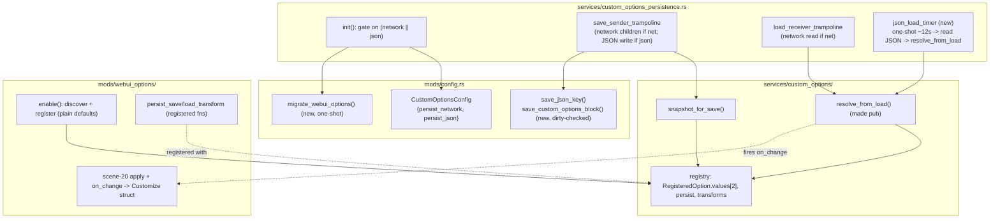

# Detailed Design — Custom-Options JSON Persistence

## Overview

Today the **WebUI Options** mod hand-rolls an offline cache of P1/P2 option
values under a `webui_options` key in `mod-config.json`, reading it at `enable()`
and writing it on every value change / scene-20 entry. This offline-cache concept
is useful for *all* custom options, but it lives only inside one mod and
duplicates logic the custom-options framework already provides for the **network**
persistence path.

This feature **genericizes JSON persistence into the custom-options framework**
so it covers every registered persistable option from every mod, renames the
config key `webui_options` → `custom_options` (co-habiting with the gate keys),
and splits the single `persist` gate into two independent booleans:
`persist_network` (backend server save/load) and `persist_json` (offline
`mod-config.json` save/load).

This is a **Rust-layer-only** refactor. No reverse engineering, no new game
signatures, no new game-memory reads. It relocates and generalizes existing code
and reuses the registry APIs that already exist.

## Detailed Requirements

Consolidated from `idea-honing.md` (decisions D1–D4 + Q1–Q7).

### Functional

- **R1.** JSON persistence of custom options lives in the custom-options
  framework (not in any single mod) and covers **every** registered option whose
  `persist` flag is true — the same set `snapshot_for_save()` already returns.
- **R2.** The `mod-config.json` key for the offline cache is renamed
  `webui_options` → `custom_options`, preserving the `{ p1: {...}, p2: {...} }`
  shape. The persisted block co-habits the `custom_options` section flat
  alongside the gate keys (Q4):
  ```jsonc
  "custom_options": {
    "persist_network": true,
    "persist_json": true,
    "p1": { "<option_id>": <wire_value>, ... },
    "p2": { "<option_id>": <wire_value>, ... }
  }
  ```
- **R3.** The single `persist` config gate is replaced by two booleans:
  - `persist_network` — gates backend-server save/load (what `persist` did).
  - `persist_json` — gates offline `mod-config.json` save/load.
  Both default `true` when absent (Q5a). The legacy `persist` key is no longer
  read (Q5b).
- **R4.** Persisted wire values reuse the registry's `save_transform` /
  `load_transform` (D3). JSON stores the same wire value the network path stores
  (e.g. asset_id for WebUI options). WebUI's inline asset_id↔index conversion in
  its JSON read/write is removed.
- **R5.** **Save trigger** (Q1): JSON is written on the ess.dll `save_sender`
  (card-out), the same moment as the network save.
- **R6.** **Detour gating** (Q2): the `save_sender` / `load_receiver` detours
  install if *either* `persist_network` or `persist_json` is true. Inside the
  trampolines, network emission/read is gated on `persist_network` and JSON write
  is gated on `persist_json`. If both gates are false, no detours install
  (current no-op behavior preserved).
- **R7.** **Dirty-check** (D4): the JSON write only touches disk when the new
  `custom_options` `{p1,p2}` block differs from what's already persisted.
- **R8.** **Load** (D1, Q7): a one-shot lazy timer fires ~10–15s after init,
  reads `custom_options.{p1,p2}`, and calls `resolve_from_load(id, side, value)`
  for each cached value (applying `load_transform` + firing the option's
  `on_change`).
- **R9.** **Precedence** (D2, Q7): network values override JSON. Achieved by
  ordering (timer fires before any card swipe is possible) plus the network
  `load_receiver` always re-applying `resolve_from_load` on every swipe. No extra
  tracking state.
- **R10.** **Migration** (Q3): on first run after the rename, if a `webui_options`
  block exists and no `custom_options.{p1,p2}` data does, copy `webui_options`'s
  contents into `custom_options` and delete the old `webui_options` key.
- **R11.** **WebUI mod** (Q6) keeps only asset discovery and the live game-state
  write (scene-20 apply + `on_change` → `Customize` struct). It registers options
  with plain defaults (no JSON read at enable). Its
  `persist_save_transform` / `persist_load_transform` stay as registered
  transform fns. All JSON read/write code is removed from the mod.

### Non-functional

- **R12.** Graceful degradation: a missing/oversized/corrupt config section, a
  failed timer, or a missing ess.dll hook must not crash; log a warning and
  continue (other persistence path / other mods still work).
- **R13.** No panics across FFI in the `save_sender` trampoline (already
  `extern "C"`); the JSON-write work must be panic-safe or wrapped.
- **R14.** Thread discipline: the JSON write happens inside the `save_sender`
  trampoline (game thread). The lazy load runs on a background timer thread but
  only calls `resolve_from_load`, which acquires the registry lock and fires
  `on_change` — confirm `on_change` callbacks tolerate being called off the
  render thread, or marshal as the existing load path does (see Open Questions).

## Architecture Overview



### Where the new logic lives

The persistence service (`custom_options_persistence.rs`) is the natural home —
it already owns the network save/load bridge and reads the config gate. JSON
save/load becomes a sibling concern in the same module. The config-file mechanics
(read-modify-write, dirty-check, migration) live in `mods/config.rs` next to the
existing `save_json_key` / `save_mod_states`.

## Components and Interfaces

### 1. `mods/config.rs` — config schema + writers

**`CustomOptionsConfig` (changed):**
```rust
#[derive(Deserialize, Clone, Debug)]
pub struct CustomOptionsConfig {
    #[serde(default = "default_true")]
    pub persist_network: bool,
    #[serde(default = "default_true")]
    pub persist_json: bool,
    // p1/p2 are NOT typed here — handled out-of-band via read-modify-write.
    // serde ignores unknown keys by default, so p1/p2 won't break the parse.
}
```
The legacy `persist` field is removed. Both gates default true via the existing
`default_true` helper.

**New writer — dirty-checked custom_options block write (R7):**
```rust
/// Write the p1/p2 sub-keys of the custom_options section, preserving the
/// gate keys (and all other top-level keys). Skips the disk write if the
/// resulting custom_options block is byte-identical to what's on disk.
pub fn save_custom_options_values(p1: serde_json::Value, p2: serde_json::Value);
```
Implementation: read the file as a `serde_json::Value`, set
`root["custom_options"]["p1"]`/`["p2"]`, compare the new `root["custom_options"]`
to the old one; if equal, return without writing. Reuses the read-modify-write
pattern of `save_json_key`. (Decision point recorded in Open Questions: whether to
generalize the dirty-check into `save_json_key` itself — leaning no, keep it local
to avoid changing `save_mod_states` semantics.)

**New migration helper (R10):**
```rust
/// One-shot: if `webui_options` exists and `custom_options.{p1,p2}` does not,
/// move webui_options' contents under custom_options.{p1,p2} and delete the
/// webui_options key. Called once during persistence init.
pub fn migrate_webui_options_to_custom_options();
```
Operates on the on-disk JSON (read-modify-write). Idempotent: after the first
run, `webui_options` is gone so it no-ops.

**Removed:** the `webui_options: Option<serde_json::Value>` field on `ConfigFile`
(L48) once WebUI no longer reads it. (Keep `serde` ignoring the stale key during
the migration window — migration deletes it from disk anyway.)

### 2. `services/custom_options/mod.rs` — visibility change

- `resolve_from_load` (currently `pub(crate)`, L180) stays `pub(crate)` — the
  persistence service is in `crate::services`, so `pub(crate)` suffices. **No
  signature change.** Confirm the timer code lives where `pub(crate)` is
  reachable (it does — same crate).
- `snapshot_for_save` (L268) — already returns exactly what JSON save needs:
  `Vec<(id, [p1_wire, p2_wire])>` with transforms applied and `persist` filtered.
  **Reused as-is for both network and JSON save.**

No new framework API is strictly required; this is the payoff of the existing
generic design.

### 3. `services/custom_options_persistence.rs` — the orchestration changes

**`init()` gating (R3, R6):**
```rust
let co = config::get().and_then(|c| c.custom_options.as_ref());
let persist_network = co.map(|c| c.persist_network).unwrap_or(true);
let persist_json    = co.map(|c| c.persist_json).unwrap_or(true);

config::migrate_webui_options_to_custom_options(); // R10, before any load

if !persist_network && !persist_json {
    log_info!("custom_options_persistence: both gates off — no detours");
    return true;
}
// resolve ordinals + hook ess.dll as today (needed if EITHER gate on)
// store persist_network / persist_json in statics for the trampolines
// spawn the one-shot JSON load timer iff persist_json (R8)
```

**Static gate flags** (read by the `extern "C"` trampolines):
```rust
static PERSIST_NETWORK: AtomicBool = AtomicBool::new(false);
static PERSIST_JSON: AtomicBool = AtomicBool::new(false);
```

**`save_sender_trampoline` (R5, R6, R7):**
- Call original, as today.
- If `PERSIST_NETWORK`: emit `<mod_{id}>` children (existing code path).
- If `PERSIST_JSON`: take the same `snapshot_for_save()` result, build the
  current side's `{option_id: wire_value}` object, merge into the in-memory
  `{p1,p2}` accumulator, and call `config::save_custom_options_values(...)`
  (dirty-checked). Side derived from `savedata+0x90` as today.
  - Because save_sender fires per-side, the writer must preserve the *other*
    side's existing values (read-modify-write already does this).

**`load_receiver_trampoline` (R9):** unchanged except guarded by
`PERSIST_NETWORK`. It already calls `resolve_from_load` per option — this is the
"network re-applies" mechanism that makes network win over JSON.

**New: one-shot JSON load timer (R8, D1):**
```rust
fn spawn_json_load_timer() {
    std::thread::spawn(|| {
        std::thread::sleep(Duration::from_secs(JSON_LOAD_DELAY_SECS)); // ~12
        json_load_once();
    });
}

fn json_load_once() {
    // read custom_options.{p1,p2} from config (re-read file, not the OnceCell,
    // so it reflects any migration write)
    // for each (side, option_id, wire_value):
    //     custom_options::resolve_from_load(option_id, side, wire_value);
}
```
`JSON_LOAD_DELAY_SECS` is a module const (12). Only spawned when `persist_json`.

### 4. `mods/webui_options/mod.rs` — slimming down (R11, R4)

- **Remove** `load_from_json` (L329), `save_to_json` (L305), `side_key` (L297),
  `CONFIG_KEY` (L14), and the `save_to_json` call inside `try_apply_all` (L293).
- **`enable()`**: drop the `load_from_json()` call (L140) and the saved-value
  default computation (L171–184); register each option with plain
  `default_value(0)`. Drop the P2 `resolve_from_load` priming (L219–224) — the
  generic loader handles it.
- **Keep** `discovery`, the scene-20 `try_apply_all` game-state write (minus its
  `save_to_json` tail), `on_value_changed`, and
  `persist_save_transform`/`persist_load_transform` (still registered via
  `.persist_transform(...)`).
- `try_apply_all` no longer needs to build `save_map` for JSON; it still writes
  the `Customize` struct. (It may keep an internal map only if needed for the
  game write; otherwise simplify.)

## Data Models

### Config JSON (after)
```jsonc
"custom_options": {
  "persist_network": true,    // backend server save/load
  "persist_json": true,       // offline mod-config.json save/load
  "p1": { "lane_skin_single": 12, "appeal": 5 },   // option_id -> wire value
  "p2": { "lane_skin_single": 3 }
}
```
`p1`/`p2` values are the **wire** representation (post-`save_transform`), matching
what the network path emits — for WebUI options that's the stable asset_id.

### Registry (unchanged)
`RegisteredOption.values: [i32; 2]` (P1/P2), `persist: bool`, `save_transform`,
`load_transform`. The JSON path consumes these via `snapshot_for_save()` /
`resolve_from_load()` exactly like the network path.

## Error Handling

- **Missing `custom_options` section** → both gates default true; no `p1`/`p2`
  data → JSON load is a no-op.
- **Corrupt/oversized JSON** → `serde_json` parse failure already falls back to
  defaults in `config::init()`; the timer re-read uses the same defensive parse
  and logs a warning on failure, then returns.
- **Dirty-check read failure** (can't read file) → treat as "differs", write
  anyway (fail-safe toward persisting).
- **Migration** with malformed `webui_options` → skip migration, log warning,
  leave the key in place (don't delete data we couldn't move).
- **ess.dll hook fails to resolve** → if `persist_json` is on, JSON *save* is lost
  (it rides the save_sender) but JSON *load* (timer) still works; log a warning
  noting save is degraded. (See Open Questions — whether to add a fallback JSON
  save trigger is explicitly out of scope per Q1/Q2.)
- **Trampoline panic isolation** → wrap the JSON-write addition in the same
  defensive style as the surrounding network code (no `unwrap` on game pointers;
  early-return on null).

## Testing Strategy

No unit-test harness (per project convention) — validation is `cargo check` +
cabinet deploy with `layeredfs.verbose` / persistence INFO logs. Per-step demos
in the implementation plan. Key manual checks:

1. Fresh config (no `custom_options` section): both gates default on; after
   setting WebUI options and carding out, a `custom_options.{p1,p2}` block
   appears with asset_id wire values; no `webui_options` key.
2. Existing `webui_options` block: after one boot, contents appear under
   `custom_options.{p1,p2}` and `webui_options` is gone (migration).
3. `persist_json: false`: no JSON block written on card-out; network still works.
4. `persist_network: false, persist_json: true`: JSON written/read; no network
   children emitted; detours still install.
5. Both false: no detours, no JSON, options reset to defaults each swipe.
6. Dirty-check: carding out twice with identical values writes the file only once
   (observe mtime / a one-shot "wrote custom_options" log gated on actual write).
7. Precedence: with a JSON cache present and a server that returns option values,
   the server values win after card swipe.
8. Lazy load: ~12s after boot, INFO log shows N options primed from JSON;
   WebUI `Customize` struct reflects them at scene 20.

## Appendices

### A. Technology Choices
- **Reuse `snapshot_for_save()` / `resolve_from_load()`** rather than new APIs —
  the framework's generic value model already does per-player + transform +
  callback handling. Pro: minimal surface area, single source of truth for "what
  persists". Con: `resolve_from_load` fires `on_change` per value (fine; that's
  how the network path already primes).
- **One-shot `std::thread` + sleep timer** for lazy load — matches the project's
  existing deferred-work idiom (splash screen timer, deferred widget setup in
  `lib.rs`). No new dependency. Alternative (scene-event trigger) rejected per D1
  for now as more complex than needed.
- **Dirty-check local to the custom_options writer** rather than generalized into
  `save_json_key` — avoids changing `save_mod_states` write semantics; revisit if
  a second caller wants it.

### B. Research Findings (see `research/current-state.md`)
- The **network** persistence path is already fully generic; JSON persistence is
  the only mod-specific holdout. Genericizing ≈ "do what network does, write JSON
  instead of kbin."
- **Init ordering**: `custom_options_persistence::init()` (lib.rs step 4i) runs
  *before* mods register options (step 8). Hence the lazy-timer load (D1) — a load
  at init time would find zero registered options.
- Config is parsed once into an immutable `OnceCell`; writers do read-modify-write
  to disk. The timer must **re-read the file** (not the OnceCell) to see the
  migrated `p1`/`p2` data.

### C. Alternative Approaches Considered
- **JSON save on every value change** (Q1 option A) — rejected: more disk churn;
  card-out is the meaningful persistence boundary and matches the network path.
- **Per-id network-loaded tracking** (Q7 option B) — rejected as unnecessary
  given the timer-before-login ordering + network-always-re-applies; revisit only
  if a real overlap is observed.
- **Keep an early JSON read in WebUI** (Q6 option B) — rejected: re-duplicates the
  logic we're centralizing; the ~12s default window is not user-visible.

### D. Open Questions deferred to implementation
1. **`on_change` off the render thread.** The lazy timer calls
   `resolve_from_load` from a background thread, which fires `on_change`. WebUI's
   `on_change` → `try_apply_all` writes the `Customize` struct via `player_work_table`.
   Confirm during implementation that this game-memory write is safe off the
   render thread, OR that the scene-20 apply (which also runs `try_apply_all`)
   makes the timer-thread write redundant and it can be a pure cache prime. If
   unsafe, marshal the apply via the existing scene-20 path (the timer only
   primes the registry cache; the next scene-20 entry applies it). **Leaning:
   timer primes cache only; scene-20 applies — safest.**
2. **Generalize dirty-check?** Decide whether `save_json_key` gains the
   dirty-check or it stays local (current lean: local).
3. **`ConfigFile.webui_options` field removal timing** — keep it through the
   migration window or remove immediately (serde ignores unknown keys, so removal
   is safe as long as migration reads the raw JSON, not the typed struct).
