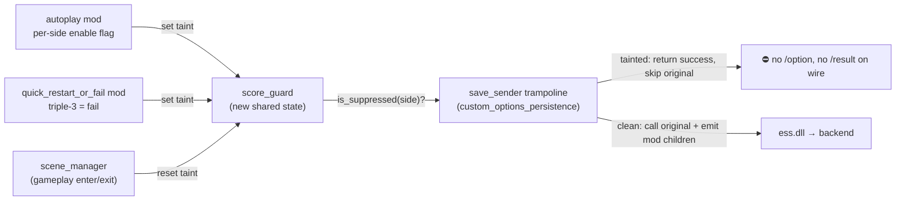
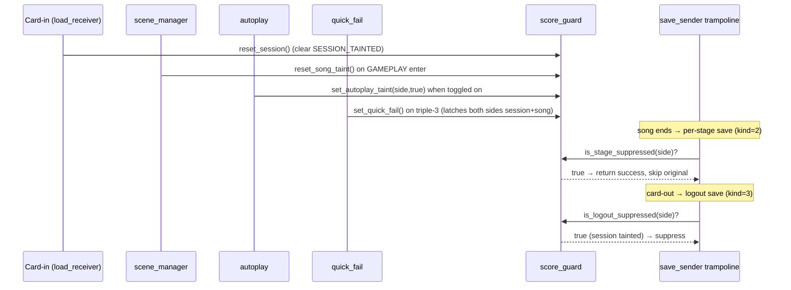

# Detailed Design: Suppress Score Submission

**Status:** Ready for implementation.
**Feature dir:** `.agents/planning/20260610-suppress-score-submission/`
**Type:** Rust-layer hook extension + small RE-validated suppression at an
already-owned ess.dll detour. No new game signatures required for the primary
path; one optional new detour deferred unless cabinet testing demands it.

---

## 1. Overview

Prevent a player's end-of-song score (and the rest of that side's profile save)
from reaching the eamuse backend when the play was **faked** (Autoplay enabled) or
**incomplete** (Quick Failure via triple-`3`). The behavior is **hard-baked** into
the existing `autoplay` and `quick_restart_or_fail` mods — there is no user toggle,
because the maintainer does not want fabricated or incomplete scores uploaded.

RE established (see `research/score-submission-re.md`) that the per-play score
travels through the **same ess.dll `sys_playerdata_save_sender` we already detour**
for custom-options persistence. The score lives in the request's `/result` block
(`score`, `exscore`, `clearkind`, `maxcombo`, `judge_*`, `calorie`, `ghost`, …),
emitted alongside the `/option` block in one per-side profile save. Therefore
suppression is a small, surgical addition at a chokepoint we already control:
**when the side being saved is tainted, the trampoline returns a pretend-success
without calling the original sender — nothing for that side reaches the wire.**



---

## 2. Detailed Requirements (consolidated from idea-honing.md)

| Ref | Requirement |
|-----|-------------|
| **R1** (Q1) | Suppress the **entire end-of-song server save** for a tainted side (score + play record). RE confirms this is the same chokepoint as score-only. |
| **R2** (Q2) | **Autoplay → per-player:** suppress only the side(s) that had Autoplay enabled. **Quick-Fail → both players:** triple-`3` fails out all active GamePlayActors, so it suppresses both sides. Net rule: suppress side X iff `autoplay_enabled[X] OR quick_fail_triggered`. |
| **R3** (Q3) | **Network upload only.** DDR has no local score persistence; the results screen is left untouched (player still sees their result; it just never uploads). |
| **R4** (Q4) | **Per-song taint resets** at song/chart start and on quick restart (triple-`1`). Autoplay's per-side flag is read at save time; quick-fail's flag is set when the gesture fires. |
| **R5** (Q5) | **Hard-baked** into `autoplay` + `quick_restart_or_fail` via a shared guard module. **No user-facing toggle.** The guard's suppression hook is the existing `save_sender` detour (already installed unconditionally when persistence runs). |
| **R6** (Q6) | **Asymmetric failure mode.** Autoplay **fails closed**: if the score-submission guard is not available (save hook not installed), Autoplay must refuse to enable. Quick-Fail **fails open**: it operates regardless; its taint flag is simply a no-op if the hook is absent. |
| **R7** (Q7) | **Silent + logged.** Every suppression decision (SUPPRESSED and allowed, with contributing flags) is logged via `log_info!`/`log_warn!`. No player-facing UI. |
| **R8** (Q8) | **Logout re-send:** the card-out save (`PlayerDataSaveLogoutRequest`) re-bundles all stages' results in one request. If **any** stage that session was tainted for a side, **suppress that side's logout save entirely.** Clean stages were already uploaded by their per-stage saves. Requires a **session-sticky per-side "any taint" flag** (reset on card-in / new session) in addition to the per-(side,stage) per-song taint. **The session-sticky flag is latched at the moment a per-stage save is actually suppressed** (not when a trigger is armed), so toggling Autoplay on/off in the menu without playing does not block the card-out save. Verified against cabinet ordering: the per-stage suppression always precedes the single card-out logout save. |

---

## 3. Architecture

### 3.1 New component: `services::score_guard`

A small, dependency-light state module — the single source of truth for "is this
side's save tainted right now?" It owns no detours (one-detour-per-target: the save
detour stays owned by `custom_options_persistence`). It is pure atomic state + a
readiness flag, safe to read from the ess save trampoline thread and to write from
the judge/render/input threads.

```rust
// services/score_guard.rs  (new)

/// True once the ess.dll save_sender detour is confirmed installed.
/// custom_options_persistence::init() sets this after a successful hook so
/// autoplay can fail-closed against it.
static HOOK_INSTALLED: AtomicBool = AtomicBool::new(false);

/// Per-(side) autoplay taint for the CURRENT stage. Read at per-stage save time.
/// Mirror of autoplay's own enable flag, kept here so the trampoline has one
/// taint authority and no cross-module read into autoplay internals.
static AUTOPLAY_TAINT: [AtomicBool; 2] = [AtomicBool::new(false), AtomicBool::new(false)];

/// Session-wide quick-fail taint (forces BOTH sides for the per-stage save of the
/// failed song). Set when triple-3 fires; reset on gameplay (re)entry.
static QUICK_FAIL_TAINT: AtomicBool = AtomicBool::new(false);

/// Session-sticky: any stage tainted (either trigger) since card-in, per side.
/// Gates LOGOUT-save suppression (R8). Reset on new session / card-in.
static SESSION_TAINTED: [AtomicBool; 2] = [AtomicBool::new(false), AtomicBool::new(false)];

// ── readiness (R6) ──
pub fn mark_hook_installed() { HOOK_INSTALLED.store(true, Release); }
pub fn is_available() -> bool { HOOK_INSTALLED.load(Acquire) }

// ── taint writers (called by the trigger mods / scene callbacks) ──
pub fn set_autoplay_taint(side: usize, on: bool); // autoplay on_change; latches session when on
pub fn set_quick_fail();                           // quick_fail::trigger_fail; latches both sides session
pub fn reset_song_taint();                         // gameplay (re)entry / quick restart
pub fn reset_session();                            // card-in / new session

// ── taint readers (called by the ess save_sender trampoline) ──
/// Per-stage save (kind=2): is THIS side tainted for the song just played?
pub fn is_stage_suppressed(side: usize) -> bool {
    QUICK_FAIL_TAINT.load(Acquire) || AUTOPLAY_TAINT[side].load(Acquire)
}
/// Logout save (kind=3): did ANY stage taint this side this session? (R8)
pub fn is_logout_suppressed(side: usize) -> bool { SESSION_TAINTED[side].load(Acquire) }
```

`set_autoplay_taint(side, true)` and `set_quick_fail()` also latch
`SESSION_TAINTED` (for R8). `reset_song_taint()` clears only `QUICK_FAIL_TAINT`
(autoplay is live-mirrored, so an honest replay reads clean); `reset_session()`
clears `SESSION_TAINTED[*]`.

> **Module placement:** `src/services/score_guard.rs`, `pub mod score_guard;` in
> `src/services/mod.rs`. It is game-system-adjacent state shared by two mods + one
> service trampoline, so `services/` is the correct layer (per CLAUDE.md rule 10).

### 3.2 Modified component: `custom_options_persistence` save trampoline

The existing `save_sender_trampoline` already derives `side` from
`*(job+0x10)+0x90`. We add a suppression check **before** calling the original, and
distinguish per-stage (kind=2) from logout (kind=3) saves.

**Distinguishing save kind:** the savedata carries `savekind` at `savedata+0x74`
(confirmed in the ess `save_sender` decompile: `"savekind", *(savedata+0x74)`).
gamemdx passes `kind` (1=First, 2=Stage, 3=Logout) into `ReflectSavePlayerData`,
which lands at this offset. **Confirm the enum values via a one-shot diagnostic log
at implementation** (cheap — the trampoline already reads savedata). Decision:

```rust
unsafe extern "C" fn save_sender_trampoline(job, kbin_ctx) -> u64 {
    let savedata = *(job.add(0x10) as *const *const u8);
    let side = read_playside(savedata);            // existing: *(savedata+0x90)
    let savekind = read_savekind(savedata);        // *(savedata+0x74) — diag-confirm enum

    let suppress = match savekind {
        STAGE  => score_guard::is_stage_suppressed(side),   // per-song taint
        LOGOUT => score_guard::is_logout_suppressed(side),  // session-sticky taint
        _      => false,                                    // FIRST/unknown: never suppress
    };

    if suppress {
        log_warn!("score_guard: side {} kind {} save SUPPRESSED (autoplay={}, quick_fail={}, session={})", ...);
        return 1;          // pretend-success; DO NOT call original → nothing on wire
    }
    log_debug!("score_guard: side {} kind {} save allowed", side, savekind);

    // ── unchanged existing behavior ──
    let result = original.call(job, kbin_ctx);
    // ... emit <mod_*> children + JSON cache as today ...
    result
}
```

- **Return value `1` (success):** the game's save state machine (`FUN_18001e390`
  sets per-side busy flag `0xf`; the save *receiver* clears it) treats nonzero as
  success. Returning success-without-original avoids retry/timeout churn. **Risk
  (R-A):** if the receiver only runs when the original sender emitted a request, the
  busy flag may not clear. Mitigation + validation in §7.
- **Custom-option children:** when suppressing, we also skip emitting `<mod_*>`
  children (correct — the whole save is gone). When not suppressing, behavior is
  byte-for-byte unchanged.
- **Independence from persistence gates:** suppression must run even if
  `persist_network`/`persist_json` are off, since the detour installs when *either*
  gate is on. If BOTH gates are off, the detour isn't installed → no suppression →
  Autoplay fails closed (R6). (Acceptable: persistence-off is a non-default config.)

### 3.3 Modified component: `custom_options_persistence::init()`

After the ess detours install successfully (`resolve_and_hook_ess()` returns true),
call `score_guard::mark_hook_installed()`. If the ess hook fails, leave it unset →
`is_available()` false → Autoplay fails closed (R6). Also add a
`score_guard::reset_session()` call at the top of `load_receiver_trampoline`
(card-in = new session boundary, R8).

### 3.4 Modified component: `autoplay` mod

- **Taint writer:** in `autoplay_on_change(side, val)`, also call
  `score_guard::set_autoplay_taint(side, val != 0)`.
- **Fail-closed gate (R6):** in `enable()`, before registering judge callbacks /
  the option, check `score_guard::is_available()`. If false, **refuse to enable**
  (log a warning, register nothing, leave inert). Init order guarantees
  `custom_options_persistence::init()` (lib.rs step 4i) runs before mod enable (step
  8), so the readiness flag is settled.
  - *Why enable()-gate not `required_signatures()`:* guard readiness is a runtime
    service state, not a resolved signature address; the `is_available()`-check idiom
    is the codebase-standard vehicle (mirrors autoplay's existing
    `custom_options::is_available()` check).

### 3.5 Modified component: `quick_restart_or_fail` mod

- **Taint writer:** in `trigger_fail()`, call `score_guard::set_quick_fail()`.
- **Quick restart resets song taint:** `trigger_restart()` calls
  `score_guard::reset_song_taint()` so a restarted-then-honest play saves (R4).
  (Does NOT clear session-sticky; per-song autoplay taint is live-read, so an honest
  replay is clean for the per-stage save anyway.)
- **Fail-open (R6):** no readiness gate. If the hook is absent, `set_quick_fail()`
  still runs but the (absent) trampoline means no effect; gameplay behavior
  unchanged.

### 3.6 Taint lifecycle wiring

- **`reset_song_taint()`** on **entering** GAMEPLAY (scene → 28) and on quick
  restart. `quick_restart_or_fail` already registers a `scene_manager` callback
  (currently clears gesture buffers on leaving GAMEPLAY); extend/parallel it to call
  `reset_song_taint()` on GAMEPLAY enter.
- **`reset_session()`** on card-in via `load_receiver_trampoline` (we own it; precise
  "new player session" signal). *Fallback if mistimed:* reset on transition into
  attract/title (scene_manager), which precedes any new card-in.



---

## 4. Components and Interfaces

### 4.1 `score_guard` public API (new)

| Fn | Caller | Purpose |
|----|--------|---------|
| `mark_hook_installed()` | custom_options_persistence::init | latch readiness after ess hook installs |
| `is_available() -> bool` | autoplay::enable | fail-closed gate |
| `set_autoplay_taint(side, on)` | autoplay::on_change | per-side autoplay taint (+latch session) |
| `set_quick_fail()` | quick_fail::trigger_fail | session quick-fail taint (+latch both sides session) |
| `reset_song_taint()` | quick_fail scene cb / trigger_restart | clear per-song quick-fail taint |
| `reset_session()` | load_receiver trampoline | clear session-sticky taint |
| `is_stage_suppressed(side) -> bool` | save trampoline (kind=2) | per-song decision |
| `is_logout_suppressed(side) -> bool` | save trampoline (kind=3) | logout decision |

### 4.2 Autoplay-state read path

**Chosen: `score_guard` mirror** updated from `autoplay_on_change`. Keeps the
trampoline dependency-free (reads only `score_guard`) and avoids a cross-module read
of autoplay's private static. Updated on every toggle, so "read at save time" (R4)
is satisfied by reading `AUTOPLAY_TAINT[side]` in the trampoline.

### 4.3 Save-kind / playside reads (ess savedata; side already proven)

| Field | Offset | Source of truth |
|-------|--------|-----------------|
| `playside` | `savedata + 0x90` | already used by existing trampoline (0=P1,1=P2) |
| `savekind` | `savedata + 0x74` | ess `save_sender` decompile emits `"savekind", *(savedata+0x74)`; enum 1/2/3 = First/Stage/Logout per `ReflectSavePlayerData(kind)` — **confirm enum values via one-shot diag log at impl** |

---

## 5. Data Models

`score_guard` state — all process-lifetime atomics, no heap, no FFI-crossing data:

```
HOOK_INSTALLED  : AtomicBool        // readiness (R6)
AUTOPLAY_TAINT  : [AtomicBool; 2]   // per-side autoplay, live-mirrored
QUICK_FAIL_TAINT: AtomicBool        // per-song, both-sides (R2)
SESSION_TAINTED : [AtomicBool; 2]   // session-sticky, gates logout (R8)
```

Ordering: writers `Release`, readers `Acquire` — matches `autoplay.rs` /
`judge_hook`. No `Mutex` (no multi-field invariant needing atomic update; latching
session alongside a stage write is two independent, order-insensitive stores).

Savekind enum (to confirm): `1=First, 2=Stage, 3=Logout` (from
`ReflectSavePlayerData` `param_2`). Constants in `custom_options_persistence` (the
only reader).

---

## 6. Error Handling & Graceful Degradation

- **ess hook not installed:** `is_available()` false → Autoplay refuses to enable
  (R6 fail-closed). Quick-Fail still works (R6 fail-open); its taint writes are
  harmless no-ops. No suppression occurs — consistent with project graceful
  degradation, and safe because the high-integrity risk (Autoplay) is disabled.
- **Unexpected `playside`/`savekind`:** trampoline logs a warning and **does not
  suppress** (fail-open on decode) — never block a save we can't positively classify
  (R6 already gated the high-risk trigger upstream).
- **Panics across FFI:** trampoline is `extern "C"`; added logic is panic-free
  (atomic loads, integer compares, `log_*`). No `unwrap`/indexing on the hot path
  (CLAUDE.md rule 1).
- **Thread safety:** taint writers run on input/scene/render threads; reader runs on
  the ess save thread. Atomics make this sound lock-free; no `Mutex` across any
  callback (rule 6).

---

## 7. Risks & Validation (no unit tests — cabinet deploy + logs)

| # | Risk | Mitigation / validation |
|---|------|-------------------------|
| **R-A** | Returning pretend-success without calling the original `save_sender` may leave gamemdx's per-side busy flag (`FUN_18001e390` sets `0xf`; save *receiver* clears) un-cleared → save state machine hangs / blocks card-out. | **Diagnostic deploy first:** build that logs savekind+side on every save_sender, suppresses, and observe whether card-out completes and the next play saves. If it hangs: fall back to letting the original run on a neutered request (clear `savedata+0xF0` so the sender's own guard skips `/option`+`/result`), OR clear the busy flag ourselves. Trace `FUN_18002CA00` (save receiver) if needed. |
| **R-B** | `savekind` enum at `savedata+0x74` assumed 1/2/3. | One-shot diag log of `savekind` correlated with observed save moments (after song vs. card-out) before trusting the kind→decision mapping. |
| **R-C** | Logout-suppression (R8) assumes per-stage (kind=2) is the authoritative score write, so dropping the logout delta for clean stages is harmless. | Cabinet check: clean song on P2, tainted on P1, card out (logout suppressed for P1), confirm P2 score persisted server-side. If only logout commits scores, escalate to per-stage surgical drop (hook `ReflectSavePlayerData` kind=3). |
| **R-D** | Quick-restart taint reset timing — a restarted honest play must save. | Validate: autoplay OFF, play, triple-1 restart, finish honestly → score saves. And autoplay ON, restart, finish → still suppressed (live-read). |
| **R-E** | Doubles/versus side indexing. | Validate P1-only autoplay in P1+P2 session suppresses only P1; quick-fail suppresses both. |

**Acceptance scenarios (cabinet):**
1. Autoplay ON (P1 only), P1+P2 carded → after song: P1 SUPPRESSED, P2 allowed (logs + server).
2. Quick-Fail (triple-3) in P1+P2 session → both sides' per-stage save SUPPRESSED.
3. Honest play, no triggers → save allowed; custom options still round-trip (regression).
4. Autoplay ON song 2 of 3, others honest → songs 1,3 allowed; song 2 suppressed; **card-out logout suppressed for that side** (R8); server shows songs 1 & 3.
5. ess hook fails to install → Autoplay refuses to enable (log); Quick-Fail still fails out.
6. Quick restart then honest finish → save allowed.

---

## 8. Appendices

### 8.1 Technology / approach choices

- **Suppress at the existing ess `save_sender` detour (chosen)** vs. a new gamemdx
  detour. Chosen because: we already own the only detour needed
  (one-detour-per-target preserved), the per-side handle is already derived, ess is
  frozen at 20260324 (cross-version robust), and it yields exactly R1's whole-save
  semantics. The gamemdx-side hook is reserved only for the R8 surgical-drop
  fallback (R-C).
- **`score_guard` as pure atomic state owning no detour.** Preserves
  one-detour-per-target; mirrors how `judge_hook` centralizes a shared concern.
  Avoids a second `GenericDetour` on `save_sender` (which would silently bypass —
  learnings / CLAUDE.md rule 5).
- **Live-read autoplay at save time** (R4) via a guard mirror updated on toggle —
  simplest robust model; mid-song menu toggling during play is not possible, so
  moot.

### 8.2 Key RE findings (full detail in research/score-submission-re.md)

- Score (`/result`) is emitted by ess `sys_playerdata_save_sender` (`+0x29E70`) —
  the function we already hook — alongside `/option`. Per-side (`savedata+0x90`),
  once per carded-in side.
- Save triggers: `SavePlayerDataActor` (`FUN_1800b4080` ctor / `FUN_1800b4230`
  onUpdate) → per-stage `FUN_18001e390` / logout `FUN_18001e5c0` → marshaller
  `ReflectSavePlayerData` (`FUN_180018580`, kind 1/2/3) → async → ess.
- **Logout (kind=3) re-marshals all up-to-5 stages' results** → R8's session-sticky
  suppression.
- The Quick-Fail `m_isDead` "already suppresses score" comment is **misleading** — a
  natural fail still uploads a failed `/result`; Quick-Fail genuinely needs this.

### 8.3 Alternatives considered & rejected

- **Standalone toggleable mod** — rejected per R5 (integrity; no opt-out).
- **All-or-nothing per-session suppression** (suppress both sides if either tainted)
  — rejected per R2 (autoplay must be per-side).
- **Per-stage surgical drop in logout** (R8 option c) — deferred; only if R-C shows
  logout is the authoritative commit. Adds a fragile gamemdx-side hook.
- **Blank the results screen** — rejected per R3 (network-only scope).
