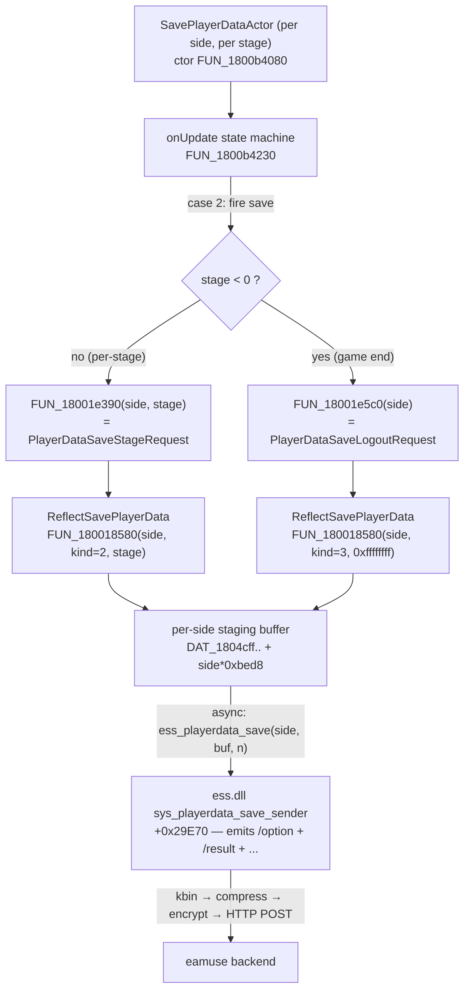

# Research: Score-Submission RE (gamemdx 20260526 + ess 20260324)

Reverse-engineering of the end-of-song server-save path, to answer the
load-bearing question: **where is the per-play score serialized/transmitted, and
does the existing `custom_options_persistence` hook sit on that path?**

**Binaries:** `gamemdx_20260526.dll` (current; Ghidra base `0x180000000`) +
`ess.dll` (20260324 — *still the current client-side ess; not updated for newer
gamemdx builds*, per maintainer). Addresses are file-relative.

**Verdict (TL;DR):** ✅ The per-play **score IS uploaded through the exact ess.dll
`sys_playerdata_save_sender` we already hook.** It emits the `/result` block
(`score`, `exscore`, `clearkind`, `maxcombo`, `judge_*`, `calorie`, `ghost`, …) as
part of the same per-side profile save. Suppressing that save for a side kills the
score upload (and the rest of that side's profile save) — exactly the Q1 "entire
end-of-song save" semantics, per-side as Q2 needs. **We already own the only
detour we need.** The remaining nuance is the **logout re-send** (see §4).

---

## 1. The save-trigger chain (gamemdx side)



### Key functions (gamemdx 20260526)

| Symbol | Addr | Role |
|---|---|---|
| `SavePlayerDataActor::ctor` | `FUN_1800b4080` | Built per-side (`+0x84`) + per-stage (`+0x88`; `<0` ⇒ GameEnd). Log: `"SavePlayerDataActor:%dP Stage%d"` / `"…GameEnd"`. |
| `SavePlayerDataActor::onUpdate` | `FUN_1800b4230` | State machine. **case 2** fires the save: `stage<0 → FUN_18001e5c0(side)` (logout) else `FUN_18001e390(side,stage)` (per-stage). |
| `PlayerDataSaveStageRequest` dispatch | `FUN_18001e390(side, stage)` | Guards on per-side busy flag `(&DAT_1806eb488)[side]`, then `ReflectSavePlayerData(side, 2, stage)`. |
| `PlayerDataSaveLogoutRequest` dispatch | `FUN_18001e5c0(side)` | `ReflectSavePlayerData(side, 3, -1)`, then loops **all 5 stages** logging playtimes. |
| `PlayerDataSaveFirstRequest` dispatch | (kind=1 path in Reflect) | First-join checkpoint; `ReflectSavePlayerData(side, 1, …)` writes mostly sentinels (`0xffffffff`) for the option/result fields. |
| `ReflectSavePlayerData` | `FUN_180018580(side, kind, stage)` | ~10KB marshaller. Fills the per-side staging buffer at `DAT_1804cff.. + side*0xbed8`. **Does NOT call ess itself** — an async poller later ships the buffer via `ess_playerdata_save`. |

### `ReflectSavePlayerData` per-side & per-kind structure (verified)

- **Per-side:** every write targets `&DAT_1804cffXX + side*0xbed8` (`uVar32 = side`,
  stride `0xbed8`). One side's marshal never touches the other side's buffer.
- **kind=1 (First):** option/result fields written as `0xffffffff` sentinels — no
  real score (it's the "I joined" checkpoint).
- **kind=2 (Stage):** marshals the **current** stage's `/result` (score) block from
  the GamePlayActor result struct into `DAT_1804d0b50 + side*0xbed8` (gated
  `param_2==2`, line ~716 of the decompile). This is the per-song score upload.
- **kind=3 (Logout):** re-iterates **all up-to-5 stages** and re-marshals each
  stage's `/result` block (line ~1023+). ⇒ **a tainted stage's score is re-sent at
  logout even if the per-stage save was suppressed.** (See §4.)

## 2. ess.dll `sys_playerdata_save_sender` (+0x29E70) — emits the score ✅

Decompiled on the loaded ess.dll. Signature matches our hook exactly:
`u64 fn(job, kbin_ctx)`; savedata = `*(job+0x10)`; playside read at savedata `+0x90`.

It emits, in one request, the named blocks (verified by extracting the string
literals passed to the `Ordinal_163` equivalent `XCnbrep70000a2`):

```
client_key, /retrycnt, /data{ refid, savekind, gamesession, country…,
  playside, …, /common{…}, /option{ 29 fields },
  /lastplay{…}, /filtersort{…}, /checkguide{…},
  /event[ … ], 
  /result{ stagenum, clearkind, SCORE, EXSCORE, maxcombo, fastcount, slowcount,
           judge_marv, judge_perf, judge_great, judge_good, judge_miss, judge_ok,
           judge_ng, calorie, ghostsize, ghost, bpm_*, chara_*, … },
  /measurement{…}, /recommended{…}, /league{…}, /brave{…}, /grade{…} }
```

**This is the score.** The `/result` block with `score`/`exscore`/`clearkind`/
`judge_*` is emitted by the very function we already detour for custom options.

- The whole emission is gated on `*(savedata + 0xF0) != 0` (per the 20260324
  research doc). For real play this is set.
- **Per-side:** save_sender is invoked **once per carded-in side**, with that side's
  savedata (`playside` at `+0x90`). Suppressing one call suppresses exactly that
  side — clean per-player behavior (Q2 ✓).

## 3. Where to suppress — chokepoint options

| Option | Where | Pros | Cons |
|---|---|---|---|
| **A. ess `save_sender` early-return (RECOMMENDED)** | extend the existing `custom_options_persistence` trampoline | We ALREADY own this detour (one-detour-per-target respected). Per-side handle already derived (`savedata+0x90`). Kills `/option`+`/result`+everything for the tainted side = exact Q1 semantics. Cross-version-robust (ess frozen at 20260324). | Suppresses the *entire* per-side save, not score-only — but that's exactly Q1's intent (Option B). |
| B. gamemdx `ReflectSavePlayerData` skip | new detour on `FUN_180018580` | Could suppress just `/result` (leave `/option`) | Bigger/fragile function; per-build (gamemdx changes); redundant — A already covers it; would need its own signature. |
| C. gamemdx save-trigger (`FUN_18001e390`/`5c0`) | new detour | Stops the request being enqueued at all | Two functions (stage+logout); per-build; no win over A. |

**Decision: Option A.** Suppress in the ess `save_sender` trampoline by returning
**without calling the original** when the current side is tainted. Returning a
"success" value (nonzero) is safest — it makes the game believe the save
succeeded, avoiding retry/timeout churn. (`FUN_18001e390` sets a per-side busy
flag `0xf` and waits for completion; the save *receiver* later clears it. Need to
confirm at implementation time that a suppressed save still lets that state
machine settle — see Open Items. Worst case we still call original but on a
neutered job; but the clean approach is skip-original + return success.)

### Per-side gating inside the trampoline (already have the handle)

```
savedata = *(job + 0x10)
playside = *(savedata + 0x90)   // 0 = P1, 1 = P2   (already in our trampoline)
if score_guard::is_suppressed(playside) {
    log "SUPPRESSED side N (autoplay=.., quick_fail=..)";
    return 1;   // pretend-success, skip original → no /option, no /result on wire
}
return original(job, kbin_ctx);   // then our custom-option children as today
```

## 4. ⚠️ The logout re-send (decision-relevant)

`PlayerDataSaveLogoutRequest` (`FUN_18001e5c0` → `ReflectSavePlayerData kind=3`)
re-marshals **all up-to-5 stages'** `/result` blocks into the logout save. So:

- Per-stage save (kind=2) for the tainted song is one upload.
- At card-out, the **logout save re-sends every stage's result again**, including
  the tainted stage.

**Implication:** suppression must be keyed so that BOTH the per-stage save AND the
logout save are suppressed for the tainted play. Two viable models:

- **(Pref) Suppress at the `save_sender` chokepoint by per-side taint that persists
  for the session** once set — but that would also suppress *clean* later stages of
  the same side (e.g. autoplay only on stage 2 of a 3-song set). ✗ too broad.
- **(Correct) Track taint per (side, stage)** and have the trampoline determine the
  stage being saved, suppressing only tainted stages. The save buffer carries
  `stagenum` (`/result`), and for kind=2 the stage is known; for kind=3 the logout
  re-send walks stages, so the trampoline would need to drop only tainted stages'
  result sub-blocks — which the all-or-nothing `save_sender` skip can't do at
  per-stage granularity (logout is one request for all stages).

**Resolution to settle in design (flag to maintainer):** The simplest correct
behavior that matches "the autoplayed/quick-failed *song* didn't happen":
1. **Per-stage save (kind=2):** suppress the whole per-side save when *that stage*
   is tainted (clean — the per-stage request only carries the one stage).
2. **Logout save (kind=3):** this re-sends all stages in one request. If ANY stage
   in the session was tainted, we cannot drop just that stage via the all-or-nothing
   `save_sender` skip. Options: (a) accept that logout re-send carries tainted
   stages → tainted score reaches server after all (defeats the feature); (b)
   suppress the whole logout save if any stage was tainted → also drops clean
   stages' final logout checkpoint (but those were already saved per-stage at kind=2,
   so the data loss is limited to logout-only deltas); (c) hook
   `ReflectSavePlayerData kind=3` to zero/skip only tainted stages' `/result`
   sub-blocks before the buffer ships.

   **Leaning:** (b) is the pragmatic match for the integrity goal and stays at the
   single ess chokepoint — *if a session contained any tainted stage, suppress the
   logout save for that side; clean stages already persisted via their kind=2 saves.*
   Verify on cabinet that kind=2 per-stage saves are indeed the authoritative score
   write and logout is a checkpoint/delta (research doc implies per-stage is the
   real score submit). If logout turns out to be the ONLY authoritative score write,
   we must use (c). **This is the one open RE/▲behavioral question to resolve in
   design or an early diagnostic deploy.**

   **DECISION (maintainer, Q8): (b) chosen.** Suppress the side's logout save
   entirely if ANY stage that session was tainted. Maintain a **session-sticky
   per-side "any tainted stage" flag** (set on first taint, reset on card-in/new
   session) that gates logout suppression, in addition to per-(side,stage) taint
   gating the per-stage save. Cabinet-validate that per-stage (kind=2) is the
   authoritative score write; fall back to (c) only if logout proves to be the sole
   commit.

## 5. The `m_isDead` / Quick-Fail "already suppresses score" claim — re-examined

`quick_restart_or_fail.rs::force_game_over` sets `m_isDead` (`+0x1E8`) and the
in-code comment claims DPS STEP_FINISH "suppresses score submission." Re-examined
against `FUN_1800b6670` (the per-side result-finalize that *constructs* the
SavePlayerDataActor):

- `FUN_1800b6670` builds the `SavePlayerDataActor` (calls `FUN_1800b4080`) for each
  side unconditionally once results are reached — i.e. **the save actor is created
  and the per-stage save still fires even on a failed/dead play.** A natural DDR
  fail uploads a `/result` with `clearkind=failed`, not *no* result.
- So the comment's "suppress score submission" most plausibly means "don't write a
  CLEARED lamp / full clear bonus", NOT "skip the network upload." **A quick-failed
  play still uploads a (failed) score today.** ⇒ Quick-Fail genuinely needs our new
  suppression; it does not get it for free from `m_isDead`. (Matches the learnings
  rule: re-verify inherited "suppresses X" claims — this one was misleading.)

## 6. Confirmations against the requirements

- **Q1 (suppress entire end-of-song save):** ✅ ess `save_sender` skip drops
  `/option`+`/result`+all blocks for that side — the whole save. Score-only vs.
  whole-save converge here (Option B == Option C), as predicted.
- **Q2 (per-player Autoplay; both-player Quick-Fail):** ✅ `save_sender` is per-side
  (`savedata+0x90`); suppress side X iff `autoplay[X] || quick_fail`. Quick-fail
  fails out all GamePlayActors (confirmed in `quick_restart_or_fail.rs`), so the
  quick_fail flag naturally forces both sides.
- **Q4 (taint resets per song; autoplay read at save time):** ✅ taint can be read
  at `save_sender` time. Reset on gameplay (re)entry / quick restart.
- **Q6 (autoplay fail-closed; quick-fail fail-open):** ✅ if the ess hook can't be
  installed, `score_guard::is_available()` is false → autoplay refuses to enable;
  quick-fail proceeds (its flag is a no-op without the hook).

## 6b. Cabinet test results (2026-06-10, 4-song session, gamemdx 20260526)

First live validation. Session: songs 1–2 honest, song 3 autoplay, song 4 quick-fail.

**Confirmed working:**
- **savekind (R-B):** per-stage = `2`, logout = `3` — matches design. ✅
- **Songs 1–2:** `save allowed`, full sender→receiver round-trip, **verified saved
  in backend DB**. ✅
- **Song 3 (autoplay) + song 4 (quick-fail):** per-stage save SUPPRESSED, score not
  sent. ✅
- **Logout (card-out):** SUPPRESSED (savekind=3). Game showed a "could not save
  playdata" popup, then logged out cleanly. ✅ (see R-A below)
- **R-A RESOLVED (favorably):** suppressing by skip-original + return-1 makes the
  game **retry the save 3× (~2s) then give up cleanly** (`EssCallAndWaitBase3
  PlayerDataSave::wait() : Success`, `ArkNetwork.Unlock() end`). The session did NOT
  hang — song 4's save fired normally after song 3's suppression, and card-out
  completed. The only player-visible cost is a ~2s delay + a "could not save" popup
  (arguably a useful signal that the faked/incomplete score wasn't saved). Accepted
  as-is (maintainer decision). No neutered-request / receiver hook needed.
- **R-C:** per-stage (kind=2) saves are authoritative (songs 1–2 present in backend
  after a session whose logout save was suppressed) → logout-delta suppression of
  clean stages is harmless. ✅

**Bug found + fixed — premature session-sticky latch:**
The first build latched `SESSION_TAINTED` inside `set_autoplay_taint(_, true)` and
`set_quick_fail()` — i.e. the moment a trigger was *armed*, not when a score was
actually suppressed. The log showed `logout_taint=true` on song 1 because autoplay
had been toggled on/off in the menu during setup before any real autoplayed song.
Harmless in this test (song 3 genuinely tainted the session anyway), but it means
**an honest session that merely toggled autoplay on then off would have its card-out
logout save wrongly suppressed** (needless "could not save" error, no actual tainted
data).

**Fix (maintainer-approved):** latch the session-sticky flag at the moment a
**per-stage save is actually suppressed** (new `score_guard::mark_session_tainted`,
called from the trampoline's suppress branch for `savekind == STAGE`), not in the
trigger writers. Ties "session tainted" to "a real score was suppressed."
Ordering holds: per-stage suppression always precedes the single card-out logout
save (verified in the log: song-3/4 stage-suppress at 17:49–17:52, logout at
17:52:49). `set_quick_fail()` likewise relies on the quick-failed per-stage save
being suppressed (and thus latching) — confirmed a quick-fail still fires a
`savekind=2` save before logout.

## 7. Open items to resolve in design / early deploy

1. **Logout re-send granularity (§4)** — pick model (b) vs (c). *Highest-value open
   question.* Recommend (b) + cabinet check that per-stage (kind=2) is the
   authoritative score write.
2. **Suppressed-save state settling** — confirm returning pretend-success (skip
   original) from `save_sender` lets `FUN_18001e390`'s per-side busy-flag
   (`0xf`→cleared by receiver) settle without hang/timeout. If the receiver only
   runs when the original sender ran, we may instead need to let the original run
   but on an emptied `/result`, or clear the busy flag ourselves. Diagnostic deploy.
3. **Stage identification in the trampoline** — for per-(side,stage) taint we read
   `stagenum` from the result block or track the active stage via the
   SavePlayerDataActor's `+0x88`. Confirm the cleanest source at impl time.
