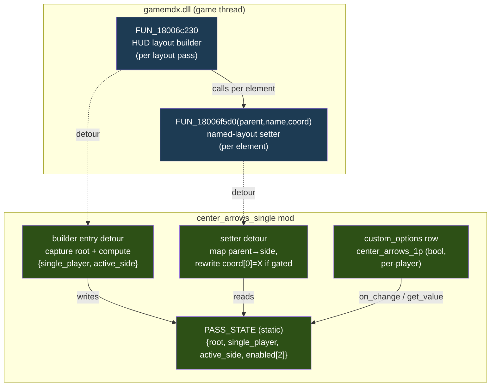

# Detailed Design — Center Arrows for Single Player

## Overview

A new mod (`center-arrows-single`) for the DDR World hook DLL that centers the
single-player playfield — the arrow receptors and the lane-relative readouts — when a
per-player in-game option is enabled and the session is single-player. It is the 64-bit
hook-based port of the 32-bit "center arrows" hex hack (RE'd in `docs/hex_edit_porting.md`,
Hack 2).

The mod installs **two detours** on the game's gameplay HUD layout builder:

1. An **entry hook** on the builder `FUN_18006c230` that, per layout pass, records the
   builder root and computes `{single_player, active_side}` from the per-side play-state.
2. A **setter hook** on the named-layout setter `FUN_18006f5d0(parent, name, coord)` that,
   for the active single-player side, rewrites the **X** coordinate (`coord[0]`) of the
   lane-relative element keys to the centered reference value.

The per-player ON/OFF option ("CENTER ARROWS (1P ONLY)") is registered through the existing
`custom_options` service and persisted like every other cosmetic toggle. Behaviour applies
on the next HUD layout build (passive); no live re-layout.

## Detailed Requirements (consolidated from idea-honing.md)

1. **Scope:** Center the lane **and** the lane-relative readouts — element keys
   `arrow_raw`, `arrow`, `freeze_judge`, `judge`, `combo`, `fast_slow`, `filter`,
   `score_compare`. Do **not** move `score` or `gauge`. `bpm`/`option` out of scope.
2. **Enable mechanism:** Per-player in-game option via `custom_options` (Mods tab), standard
   per-player persistence. **Hard-gated** so it applies **only** in single-player — never in
   2P/versus, regardless of the per-player setting.
3. **Which side:** Center the lone **active** playing side (P1 or P2) to screen center; the
   inactive side is untouched.
4. **Lane skin:** Prefer keeping the **single** lane skin, repositioned to center (R1
   Strategy A→B). Fallback: force the centered "double" lane skin (original behaviour).
5. **Centered X:** Hardcode **495** (layout-space X reference), as a single named constant.
   Applied to the element reference X; the engine's own `−laneWidth/2` math yields the final
   draw position. No Y change.
6. **Safety:** Graceful degradation — missing signatures/hooks → log + inert mod; never panic
   across FFI; never crash; other mods unaffected. No hard "skip whole mod" escalation.
7. **Liveness:** Apply at layout-build time via the passive setter hook; option read at build
   time; mid-song toggle applies on next layout rebuild.
8. **Option row:** Label "CENTER ARROWS (1P ONLY)" via `scripts/gen_option_labels.py`,
   boolean ON/OFF, default OFF, standard per-player persistence. Option id `center_arrows_1p`.
9. **Gating:** Single-player is the **only** gate; no special-mode exclusions.

## Architecture Overview



### Why two detours (different functions)

The setter `FUN_18006f5d0` receives only `parent` (= `builder_root + 0xE0 + side*0x48`),
`name`, and `coord`. From `parent` alone we cannot know the side index or whether the session
is single-player. The builder entry hook supplies that context. The builder calls the setter
**synchronously on the same thread**, so the entry hook can stash context in a `static` that
the setter hook reads within the same nested call stack — no cross-thread race. Hooking two
*different* functions does not violate "one detour per target function" (which is per
function); neither function is hooked elsewhere in the codebase today.

## Components and Interfaces

### New module: `src/mods/center_arrows_single.rs`

A single-file mod implementing the `Mod` trait (the feature is self-contained; no
subdirectory needed). Registered in `src/lib.rs` like the other mods.

#### Signatures (added to `src/core/signatures.rs`)

| Name | Targets | Notes |
|---|---|---|
| `hud_layout_builder` | `FUN_18006c230` prologue | entry hook; capture RCX = builder_root |
| `hud_layout_setter` | `FUN_18006f5d0` prologue | setter hook; (parent, name, coord) |

Patterns authored from each function's prologue, RIP-relative displacements wildcarded,
verified to match exactly one site on **both** 20260324 and 20260526 (per R3). Both declared
in `required_signatures()` — but see Error Handling: failure is graceful, not a hard skip.

#### State (module statics, `unsafe impl Send` not needed — accessed only on game thread)

```rust
struct PassState {
    builder_root: usize,     // RCX captured at builder entry
    single_player: bool,     // exactly one side active this pass
    active_side: u8,         // 0 or 1; valid only when single_player
}
static PASS_STATE: AtomicCell-like via static mut + addr_of  // see "thread model"
static OPTION_ENABLED: [AtomicBool; 2]   // mirrors custom_options value per side
static HOOKS_OK: AtomicBool              // both detours installed
```

(Use the project's established `static mut` + `std::ptr::addr_of!` + null/flag-guard idiom,
matching `premium_free`/`series_filter_scroll`. The state is only ever touched from the game
thread inside the nested builder→setter call, so no locking is required; the option-change
callback writes `OPTION_ENABLED` from the same game/options thread.)

#### Builder entry detour

```
fn builder_entry(this /*RCX = builder_root*/):
    state.builder_root = this
    s0 = *(i32*)(this + 0x84)      // P1-side play-state
    s1 = *(i32*)(this + 0x88)      // P2-side play-state
    active = [i for i in {0,1} if s[i] != 2]
    state.single_player = (active.len() == 1)
    state.active_side   = active[0] if single_player else 0xFF
    call original(this)
```

Read-only of game memory; calls original unconditionally. Panic-guarded.

#### Setter detour

```
fn setter(parent /*RCX*/, name /*RDX*/, coord /*R8*/):
    if HOOKS_OK and PASS_STATE.single_player:
        side = (parent - (state.builder_root + 0xE0)) / 0x48     // 0 or 1, else out-of-range
        if side == state.active_side
           and OPTION_ENABLED[side]
           and name_in_target_set(name):
              (*coord)[0] = CENTER_X      // 495, the X reference
    call original(parent, name, coord)
```

`name_in_target_set` compares the C-string at `name` against the 8 target keys
(`arrow_raw`, `arrow`, `freeze_judge`, `judge`, `combo`, `fast_slow`, `filter`,
`score_compare`). `score`/`gauge`/`bpm`/`option`/lane-name keys are left untouched. Bounds-
check the computed `side` (`0..=1` and exact stride alignment) before trusting it. Panic-
guarded; never allocates on this path.

#### Lane-skin handling (R1 — Strategy A CONFIRMED by static RE)

Static trace of the render/read side resolved this up-front (see research/r1). Every
per-element renderer reads its coord from the **same named map our setter writes**
(`perSideParent + 0x28`; reader `FUN_18006f290` / value-getter `FUN_18006f6b0`) and pushes
`coord[0]/coord[1]` into the element's AFP layer via the layer vtable `setPositionXY` (slot
**+0x38**) every build. Verified on `FUN_180065f10` (bpm), `FUN_18006a980` (filter), and
`FUN_180078b40` (arrow/shock-lane — anchors to `getCoord("arrow").x`). So the stored coord IS
the render-time source of truth.

- **Strategy A (ship):** rewrite `coord[0]` in the setter hook (above). Confirmed to move the
  receptors and all lane-relative elements. No AFP poke needed.
- **Residual cosmetic check (deploy only):** the one layer not observed re-reading a coord is
  the **static lane backdrop frame** (`%dp_lane_usr`, template-bound via `FUN_18021c170`). The
  32-bit hack centered via these same element X writes and shipped looking correct, so low
  risk. Deploy check narrows to "does the static lane frame look right?"
- **Strategy B (contingency — only if the static frame reads off-center):** additionally
  reposition the single lane AFP layer via `bm2d_api::set_position(layer_id, X, y)` (wrapper
  exists). Targeted, gated identically. Not implemented unless the deploy check fails.
- **Fallback (force-double):** last resort — intercept lane-name selection so the active 1P
  side uses `double_lane_usr` + `lane_..._double` (original hack's visual).

Element-centering logic is identical regardless; only the (now-unlikely) lane-frame treatment
would differ.

### Option registration (`custom_options`)

Mirrors `premium_free`:

```rust
let spec = RegisterSpec::bool_toggle("center_arrows_1p")
    .default_value(0)
    .on_change(on_change);   // writes OPTION_ENABLED[side]; per-player (no cross-sync)
custom_options::register_option(spec)?;
```

`on_change(side, value)` stores `value != 0` into `OPTION_ENABLED[side]`. Unlike
`premium_free` (global → cross-syncs the other side), this option is **genuinely per-player**
and does **not** mirror to the other side. Rationale: if two players are logged in, the
single-player gate suppresses centering regardless of either option value; if only one player
is logged in, that lone player's option governs and the active side (P1 or P2) is centered
either way. So per-side values never conflict and never need syncing. Persistence is the
framework default (network + JSON), no `no_persist`. Value is also read defensively at builder
time via `custom_options::get_value(side, "center_arrows_1p")` as the source of truth if the
static mirror is stale (belt-and-suspenders).

**Registration is gated on hook success.** The option row is registered **only if both
detours installed** (`HOOKS_OK`). An inert option row is worse than absent — it's harmful UX
(a toggle that does nothing). On signature/detour failure the mod logs a warning and registers
**nothing**, so the Mods tab simply doesn't show the row.

### Texture asset

Add to `scripts/gen_option_labels.py` `LABELS`:
`("center_arrows_1p", "CENTER ARROWS (1P ONLY)")`, run it to emit
`seop_item_center_arrows_1p.png`. Boolean reuses stock `seop_op_on/off` ribbons (R4).

### Wiring (`src/lib.rs`)
Add `Box::new(mods::center_arrows_single::CenterArrowsSingleMod::new())` to
`mods_to_register`, and `pub mod center_arrows_single;` to `src/mods/mod.rs`.

## Data Models

### Builder object (`FUN_18006c230` `param_1` = builder_root)
| Offset | Meaning |
|---|---|
| `+0x84` | P1-side play-state (i32): `2` = not playing; `0`/`1` = active sub-states |
| `+0x88` | P2-side play-state (i32) |
| `+0xE0 + side*0x48` | per-side layout parent (the `parent` passed to `FUN_18006f5d0`) |

### Setter coord payload (`FUN_18006f5d0` `coord` = R8, 6 × i32)
| Index | Meaning |
|---|---|
| `[0]` | **X** ← rewritten to `CENTER_X` (495) |
| `[1]` | Y (untouched) |
| `[2]`, `[3]` | (other) |
| `[4]`, `[5]` | scale X/Y (per 32-bit analysis) |

### Constants
- `CENTER_X: i32 = 495` — single named constant (Q5). Layout-space X reference.
- Target key set: `["arrow_raw","arrow","freeze_judge","judge","combo","fast_slow","filter","score_compare"]`.
- Field offsets `PLAY_STATE_BASE=0x84`, `PER_SIDE_PARENT_BASE=0xE0`, `PER_SIDE_STRIDE=0x48`.

## Error Handling

- **Signature resolution failure:** if either `hud_layout_builder` or `hud_layout_setter`
  doesn't resolve, log a warning, set `HOOKS_OK=false`, and **do not register the option row**
  (an inert toggle is harmful UX). The game and all other mods run normally. No panic.
  (Q6 graceful degradation; no hard skip of the whole mod registry, just this mod's effect.)
- **Detour install failure:** same posture — log, set `HOOKS_OK=false`, register nothing.
- **Ordering:** detours are installed/verified in `init()` (or at `enable()` before the
  `register_option` call); the option row is registered **only after** both detours are
  confirmed installed, so the row never appears unless it will actually work.
- **FFI safety:** both detour callbacks wrap their body in `std::panic::catch_unwind` (or are
  provably panic-free): no `unwrap`/`expect`/indexing-that-can-panic/`unreachable!`. Raw
  pointer reads are bounds/null-guarded; the computed `side` is range- and alignment-checked
  before use.
- **Partial application:** acceptable per Q6 (worst case cosmetic; player can toggle off). The
  setter hook simply no-ops centering when state is incomplete (`single_player=false`,
  `active_side` invalid, option off, or `name` not in set).
- **Allocator discipline:** the centering path performs no allocation and frees nothing — it
  mutates an existing `coord` in place and reads game memory. No allocator concerns.

## Testing Strategy

No unit harness (project standard); validation is deploy + observe (CLAUDE.md). Use the
**diagnostic-build-before-rewriting** discipline (project learnings):

1. **Detection diagnostic:** ship a build that logs, at builder entry, `{s0, s1,
   single_player, active_side}` once per pass. Verify in: 1P P1-side, 1P P2-side, 2P/versus.
   Confirms R2 field semantics and the single-player gate (2P must report `single_player=false`).
2. **Setter-key diagnostic:** log each `name` seen by the setter hook for the active side once,
   to confirm the 8 target keys appear and to catch any key-name drift between builds.
3. **Strategy A test:** enable the option (P1 single), enter gameplay; observe receptors +
   readouts centered. **Decision point:** does the single lane backdrop follow?
   - Yes → ship Strategy A.
   - No → implement Strategy B (AFP lane reposition), retest; if still wrong → force-double
     fallback.
4. **Side coverage:** repeat for P2-side single play (active_side=1) — receptors must center,
   not the empty P1 side.
5. **Gate coverage:** 2P/versus with the option on for one or both players → **no centering**
   (hard gate). Option off → stock layout.
6. **Persistence:** toggle on, card out/in → option restored (network + JSON path), same as
   other custom options.
7. **Cross-version:** smoke-test on both 20260324 and 20260526 (signatures + offsets).
8. **Build gate:** `cargo check --target x86_64-pc-windows-msvc` after each change; full
   `./build.sh` before each deploy.

## Appendices

### A. Technology / approach choices
- **Hook vs. byte-patch + code cave:** chosen hook approach (per the RE doc's recommendation).
  No code caves, no ABI-fragile inline patches; AOB-resolved, version-robust, matches project
  conventions. Trade-off: two detours instead of N byte writes — but far more maintainable and
  the only sane option given 64-bit register/stack differences.
- **Two-detour context passing via same-thread static:** simplest correct way to give the
  setter hook the side/single-player context. Alternative (reconstructing player-count from a
  global) rejected — less authoritative, more guessing.
- **Hardcoded `CENTER_X=495`:** accepted because the game is fixed-resolution (Q5). Defined as
  one named constant for trivial future tuning or derivation.

### B. Research findings (see research/ for full detail)
- **R1 (lane skin):** repositioning the single lane skin is feasible — it's an AFP layer with
  a settable position, and `bm2d_api::set_position` already wraps the setter. Staged A→B→
  fallback; A↔B decided by one cabinet test.
- **R2 (detection):** per-side play-state at `builder_root + 0x84 + side*4` (`==2` ⇒ inactive);
  single-player = exactly one active side; `parent → side` via `(parent − (root+0xE0))/0x48`.
- **R3 (hook + coords):** `FUN_18006f5d0(parent, name, coord)`, `coord[0]=X`, `[1]=Y`, 6
  dwords; `name` is a readable C-string. Standard 3-arg fastcall.
- **R4 (texture):** add one `LABELS` entry to `gen_option_labels.py`; boolean reuses stock
  on/off ribbons; id `center_arrows_1p` ↔ `seop_item_center_arrows_1p`.

### C. Alternative approaches considered
- **Byte-patch / code-cave port** of the 32-bit hack: rejected (ABI-fragile, no spare
  register for the cave trick in 64-bit, not version-robust).
- **Global toggle instead of per-player option:** rejected per Q2 (user wants per-player).
- **Force-double lane as the primary visual:** demoted to fallback per Q4 (user prefers the
  single lane skin repositioned).
- **Live mid-song re-centering:** rejected per Q7 (apply-at-build-time is sufficient).

### D. Key constraints
- Callbacks are `extern "C"` on the game thread → panic-safe, tight, no allocation.
- Single-player is a hard gate (never 2P), enforced from the builder's own per-side state.
- Fixed-resolution assumption underpins the hardcoded center X.
