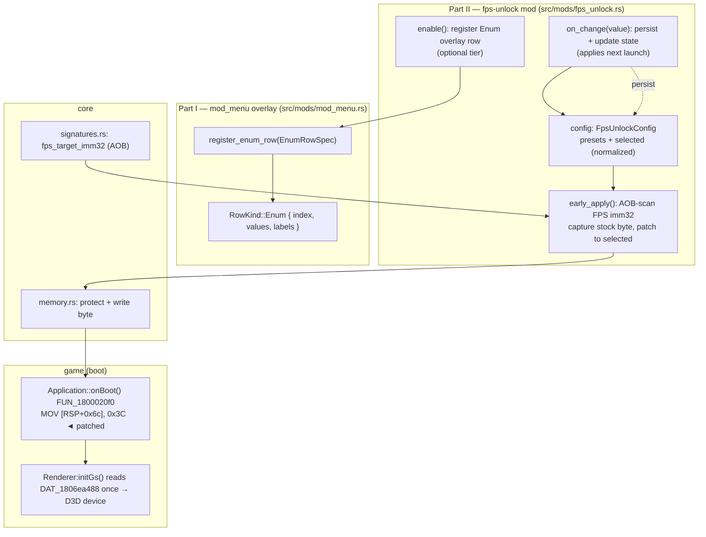

# Detailed Design — FPS Unlock

> Standalone design doc. Implements the FPS-unlock hack (Hack 5 of
> `docs/hex_edit_porting.md`) as a runtime hook-DLL mod. All RE re-verified fresh this
> session — see `../research/r1`–`r4` and the requirements in `../idea-honing.md`.

## Overview

DDR World's fullscreen display-refresh target ("FPS") is a single hardcoded immediate
(`0x3C` = 60) written during `Application::onBoot()`, latched into the Direct3D device at
boot, and **never re-read afterward**. This mod overrides that immediate with an
operator-chosen value (default presets 60/120/144/165/240/360, extensible via config) so
the game renders — and, because the engine is delta-time based, *plays* — at a higher
refresh rate. Gameplay arrow scroll is smooth and correct at the higher rate; RE + a live
test indicate World does **not** suffer the menu-animation speedup seen on older DDR
versions.

The feature has **two parts**:

- **Part I — reusable `Enum` overlay row** (`mod_menu` infra): add a `RowKind::Enum`
  labeled pick-list alongside the existing `Boolean`/`Scalar`. General-purpose; FPS is its
  first consumer.
- **Part II — the `fps-unlock` mod**: AOB-resolve the FPS immediate, byte-patch it during
  the `early_apply` boot phase to the configured value (capturing the stock value first for
  OFF-revert), read/persist a typed `fps_unlock` config section, and register an `Enum`
  overlay row to pick the value live (applies on next launch).

**Out of scope (decided at iteration checkpoint):** per-scene FPS auto-switching. RE shows
the value is consumed once at boot (a live change would require a D3D device reset), and
World shows no menu speedup, so per-scene switching is both infeasible via this lever and
unnecessary. If a real speedup is ever observed on the cabinet, it would be a separate
effort with a different (device-reset) mechanism.

## Detailed Requirements

Consolidated from `idea-honing.md` (Q1–Q9):

1. **Static cabinet-wide FPS value** (R: Q1). Milestone 1 ships static-only; Milestone 2
   (scene-aware) dropped entirely (Q1 phasing + RE r2/r3).
2. **Value model = enum of presets** (Q2/Q3): a real `Enum` overlay row, entries sourced
   from a config-defined list so operators can add oddball refresh rates.
3. **Config schema** `fps_unlock` (Q5): `presets: [i32]` (default `[60,120,144,165,240,360]`)
   + `selected: i32` (active value, stored **raw**, not an index).
4. **Normalization** (Q5): in-memory dedupe / drop-invalid / sort-ascending / ensure
   `selected ∈ presets` (auto-add). Fall back to defaults if the list ends up empty. Only
   `selected` is ever written back; the operator's `presets` array is left as authored (Q9).
5. **OFF / disabled behavior** (Q4): capture genuine stock at boot, revert to it on OFF;
   60 fallback if capture is somehow unavailable. Since apply is boot-time, "OFF" primarily
   means *don't patch* (game keeps stock 60). Runtime toggle persists and **applies on next
   launch** (Q4 — confirmed unavoidable by RE r2).
6. **Apply lever** (Q6 + RE r2): AOB-resolved **byte-patch** of the imm32, executed in the
   `early_apply` boot phase. (AOB ⇒ convention-compliant; not a hardcoded file offset.)
7. **Persistence** (Q9): on overlay change, immediately write `fps_unlock` back to
   `mod-config.json` (cabinet-wide; NOT the per-player `custom_options` paths).
8. **Two-tier graceful degradation** (Q7): apply lever load-bearing (self-disable if the
   AOB doesn't resolve); enum overlay row optional (config-only fallback).
9. **UX** (Q8): master toggle id `fps-unlock`; child enum row label `FPS TARGET`; neutral
   hint (`"Display refresh target."`); entries formatted `"<n>fps"` lowercase no-space;
   row hidden when the master toggle is OFF.

## Architecture Overview



Boot order (RE r2): our DLL is injected pre-`gamemdx`; `init()` polls for the module →
`resolve_all` → **`early_apply`** (our patch lands here) → … → game runs `onBoot` →
`initGs` reads the (now-patched) value into the D3D device.

## Components and Interfaces

### Part I — `mod_menu` `RowKind::Enum`

New variant (see `research/r4` for the full match-site list):

```rust
pub enum RowKind {
    Boolean { value: bool },
    Scalar  { value: i32, min: i32, max: i32, step_fine: i32, step_coarse: i32 },
    Enum    { index: usize, values: Vec<i32>, labels: Vec<String> },  // NEW
}

pub struct EnumRowSpec {
    pub key: String,
    pub label: String,
    pub hint: String,
    pub parent_row_key: Option<String>,   // gate visibility on a parent toggle (Q8.4)
    pub values: Vec<i32>,                 // raw values, caller-normalized (sorted asc, deduped)
    pub labels: Vec<String>,              // parallel display strings, e.g. "144fps"
    pub initial_value: i32,               // raw; resolved to an index (caller guarantees ∈ values)
    pub on_change: RowChangeCallback,     // Arc<dyn Fn(i32)+Send+Sync> — fired with values[index]
}

pub fn register_enum_row(spec: EnumRowSpec);   // mirrors register_scalar_row
```

Behavior:
- **Adjust** (`activate_selected`): Left/Right step `index` by ±1, **clamped at the ends**
  (matches `Scalar`'s clamp-at-bound; no wrap). On change, fire `on_change(values[index])`
  and mirror the new index into the row. Start-held "coarse" is a no-op for enum (could
  jump to first/last; default: ignore — single-step only).
- **Render** (`refresh_slots`): value column shows `labels[index]` in white.
- **Repeat**: generalize the hold-to-repeat gate (`selected_is_scalar`) to also cover
  `Enum`, so holding a direction cycles entries.
- **row_value / clone_row / set_row_value writer**: handle `Enum` (totality). `row_value`
  returns `values[index]` (enum unlikely to be a parent, but keep total).
- Existing `set_scalar_value`-style external mirror: add an analogous path if needed for the
  mod to reflect an externally-changed value into the row (likely unnecessary here, since
  the mod is the only writer — confirm during impl; do not add dead code).

This is additive and compiler-self-checking (exhaustive matches). No FFI/threads/allocator
surface.

### Part II — `fps-unlock` mod (`src/mods/fps_unlock.rs`)

Implements `Mod` + `early_apply`. Single-file (no subdirectory).

```rust
pub struct FpsUnlockMod {
    patch_site: Option<PatchSite>,   // resolved imm32 address + captured stock byte(s)
    applied: bool,                   // early_apply already patched (init/enable no-op the patch)
    config: FpsUnlockConfig,         // normalized presets + selected
    row_registered: bool,
}
```

- **`id()`** = `"fps-unlock"`, **`name()`** = `"FPS Unlock"`, **`required_signatures()`** =
  `&["fps_target_imm32"]` (load-bearing — ModRegistry skips the mod if unresolved).
- **`early_apply(ctx)`** (race-critical): AOB-scan via the `fps_target_imm32` signature →
  validate the expected stock byte (`0x3C`) → **capture stock** → if the mod is enabled in
  config, `memory::protect` + write the `selected` value (as the imm32) → set `applied`.
  If disabled in config, capture nothing / patch nothing (game keeps stock). Returns
  `false` only on a resolve/validation failure (logged; non-fatal to other mods).
- **`init`/`enable`**: `init` no-ops the patch (already done in `early_apply`); `enable`
  registers the `Enum` overlay row (optional tier) under the `fps-unlock` master toggle.
- **`disable`**: revert the patch to the captured stock byte (so a runtime toggle-off is
  reflected on disk via config and reverts on next launch; the in-memory revert is harmless
  since the value is already latched into the device — but we do it for symmetry + a
  future-proof "OFF means stock"). Remove the enum row (`remove_rows_for(&["fps-target"])`).
- **`is_active()`**: returns whether the patch site resolved (mirror timing-offsets'
  self-disable rendering, so a failed-to-resolve mod shows `[OFF]`).
- **`on_change(value)`** (enum row callback): clamp/validate `value ∈ presets`, update
  `config.selected`, **persist** the whole `fps_unlock` section, update the (already-applied
  or to-be-applied-next-boot) state. Emit a one-shot log noting "applies on next launch."

### `core/signatures.rs`

Add one signature entry:

```rust
SignatureDefinition {
    name: "fps_target_imm32",
    module: Module::Gamemdx,
    pattern: "C7 44 24 ?? 3C 00 00 00 75 08 C7 44 24 ?? 4B 00 00 00",
    // imm32 to patch is at match + 4 (the 0x3C). Store the match address; the mod
    // computes match+4. (Or add an `offset: 4` if the framework supports per-sig offset.)
}
```

Unique single match on all three loaded builds (r1). No derived address needed.

### `core/memory.rs`

Reuse existing `protect` + byte write (the pattern `song_limit_expansion` / `timer_freeze`
/ `premium_free` use). Patch is a 4-byte imm32 write (or a single low byte if value ≤ 255,
but write the full imm32 to support 360 = `0x168` > 255). **Write all 4 bytes** of the
immediate: `value as u32` little-endian at `match+4`.

## Data Models

### `FpsUnlockConfig` (typed section in `config.rs`)

```rust
#[derive(Deserialize, Clone, Debug)]
pub struct FpsUnlockConfig {
    #[serde(default = "default_fps_presets")]
    pub presets: Vec<i32>,
    #[serde(default = "default_fps_selected")]
    pub selected: i32,
}
fn default_fps_presets() -> Vec<i32> { vec![60, 120, 144, 165, 240, 360] }
fn default_fps_selected() -> i32 { 60 }   // stock — enabling the mod is a no-op until the operator picks a higher preset (decided 2026-06-28)
```

> **Default `selected` = 60 (stock), decided.** Enabling the mod changes nothing until the
> operator picks a higher preset — least-surprising; matches "capture stock, do nothing
> until told." (So the very common "mod on, selected==60" case patches `0x3C`→`0x3C`, a
> no-op write; harmless and keeps the apply path uniform. Optionally skip the write when
> `selected == stock` — minor.)

Add `pub fps_unlock: Option<FpsUnlockConfig>` to `ConfigFile` (mirrors `timing_offsets`).

**Normalization (applied in-memory at mod load, NOT written back to `presets`):**
1. Drop non-positive / absurd entries (clamp to a sane range, e.g. `[1, 1000]` — match the
   FPS domain; finalize bound in impl).
2. Dedupe.
3. Sort ascending.
4. If empty after the above → use `default_fps_presets()`.
5. If `selected ∉ presets` → insert it (auto-add, Q5.2), re-sort.
6. The resulting `(values, labels)` feed the enum row; `labels[i] = format!("{}fps", values[i])`.

**Persistence (`save_json_key`, Q9):** `save_json_key` overwrites the whole `fps_unlock`
object, so to leave `presets` as the operator authored it, write back
`{ "presets": <original-as-loaded presets>, "selected": <new value> }`. Keep the
**original** presets array (pre-normalization, as read from disk) for write-back so we don't
silently re-order the user's file; only `selected` changes. (If the section was absent, write
the defaults + selected.)

### `PatchSite`

```rust
struct PatchSite { imm_addr: *mut u8, stock: [u8; 4] }
unsafe impl Send for PatchSite {}
```
`stock` = the 4 immediate bytes captured before patching (for revert / OFF). Expected
`stock[0] == 0x3C`.

## Error Handling

- **AOB miss / wrong stock byte** → `early_apply` logs a warning, returns `false`, leaves
  `patch_site = None`. `required_signatures()` lists `fps_target_imm32`, so the registry
  skips the mod cleanly; `is_active()` returns false → overlay shows `[OFF]`.
- **Enum row registration failure / overlay unavailable** → logged; mod still applied the
  patch (config-only operation). (Tier-2 degradation, Q7.)
- **Config parse issues** → typed `Option<FpsUnlockConfig>` + `serde(default)` → falls back
  to defaults (same pattern as `timing_offsets`).
- **No panics across FFI:** `early_apply` runs on the init thread (not a hook callback), but
  keep it panic-free anyway (memory writes are checked). The enum `on_change` runs on the
  render/input thread — keep it non-blocking and panic-free (no lock held across a
  `run_on_render_thread`).
- **Boot-timing race (the one empirical risk, r2):** if `early_apply` loses the race to
  `onBoot`'s FPS line, the patch is observed not to take effect. Mitigation = diagnostic
  build (see Testing). Fallback ladder (r2): detour `FUN_1801eda10` (same deadline, only
  helps in a microsecond-wide window) → **last resort** on-disk patch (violates runtime-only
  philosophy; no ban/integrity risk on unofficial networks). Design the fallback only if the
  primary is empirically unreliable.

## Testing Strategy

No unit tests (project convention — live deploy + log/visual observation). Validation
gates per implementation step:

- **`cargo check --target x86_64-pc-windows-msvc`** after every change; `./build.sh` before
  each deploy.
- **Diagnostic deploy (the key checkpoint):** ship a build whose `early_apply` logs
  `fps-unlock: site @ <addr>, stock=0x3C, patched=<selected>`; on the cabinet confirm (a)
  the line appears at boot **before** the game's render init, and (b) the **actual refresh
  rate** changes (e.g. set 144 → observe 144 Hz / smoother scroll). This resolves the race
  question.
- **Menu-speedup observation (settles r3 empirically):** at the high FPS, confirm
  menu/selection animations run at normal wall-clock speed (expected: yes — no speedup).
  This is the final confirmation that Milestone 2 stays dropped.
- **OFF/disable:** toggle the mod off (config or overlay) → next launch renders stock 60.
- **Overlay enum:** open overlay (triple-0), enable FPS Unlock, see `FPS TARGET` row, cycle
  entries (`60fps`…`360fps`), confirm hidden when master OFF, value persists across restart.
- **Oddball preset:** add e.g. `100` to `presets` in config → appears in the picker.
- **Cross-version:** signature resolves on the operator's build (AOB confirmed on 3 builds
  in r1).

## Appendices

### A. Technology / approach choices

| Decision | Choice | Why |
|---|---|---|
| Apply lever | AOB byte-patch via `early_apply` | RE r2: value consumed once at boot; precedent `song_limit_expansion`; tiny, no FFI/alloc surface. Convention-compliant (AOB, not file offset). |
| vs. detour `FUN_1801eda10` | Rejected (primary) | Same boot deadline (r2), heavier, no extra capability (stock is readable from the imm32). Kept as fallback rung. |
| vs. on-disk patch | Last resort only | Violates runtime-only philosophy; only if in-memory race proven unreliable. No ban risk (unofficial nets). |
| Enum vs. Scalar-index emulation | Real `RowKind::Enum` | Q3: proper reusable infra; overlay was designed to grow Enum; small/low-risk (r4). |
| Selected stored as | Raw FPS value | Q5.1: avoids index ambiguity, survives presets edits. |
| Per-scene switching | Dropped | r2 (infeasible — consumed once) + r3 (no speedup on World). |

### B. Research findings (summary; full notes in `../research/`)

- **r1:** AOB `C7 44 24 ?? 3C 00 00 00 75 08 C7 44 24 ?? 4B 00 00 00` unique on builds
  20260324 / 20260526 / 20250805; imm32 (`0x3C`) at match+4; in `Application::onBoot()`.
- **r2:** value flows `onBoot` → `FUN_1801eda10` (writes global `DAT_1806ea488`) →
  `Renderer:initGs` (sole reader, boot, → D3D device). **Consumed once.** Corrected two
  prior-doc errors (offset +0x1C not +0x14; real consumer chain). Apply via `early_apply`;
  boot-timing is the one empirical risk; fallback ladder documented.
- **r3:** engine is delta-time based (`DAT_1806ea714`, ~100 readers, per-frame clamp);
  sampled animation path scales by dt. World shows no menu speedup (live test) → Milestone 2
  dropped.
- **r4:** `RowKind::Enum` is a small, compiler-self-checking addition (~6 match arms + a
  `register_enum_row` API), mirroring the existing `Scalar` row.

### C. Alternative approaches considered

- **Static byte patch only, no overlay** — rejected: maintainer wants live preset selection
  + config-defined list (Q2/Q3). Overlay is the optional tier; config-only still works.
- **Scalar (free 30–360) instead of enum** — rejected (Q2): enum-of-presets chosen, with
  config-extensible entries for oddball rates.
- **Per-scene auto-switch (the prior doc's recommendation)** — dropped (r2/r3): infeasible
  via this lever + unnecessary on World.

### D. Open items carried to implementation

1. **Boot-race confirmation** — the diagnostic deploy is the gate; fallback ladder ready.
2. ~~Default `selected`~~ — **RESOLVED: stock `60`** (mod-on is a no-op until the operator
   picks a higher preset). See Data Models.
3. **Enum cycle: clamp vs. wrap** — recommend clamp (matches Scalar); confirm in impl.
4. **`presets` sanity range** — finalize the valid FPS bound (e.g. `[1,1000]`) for
   normalization.
```
