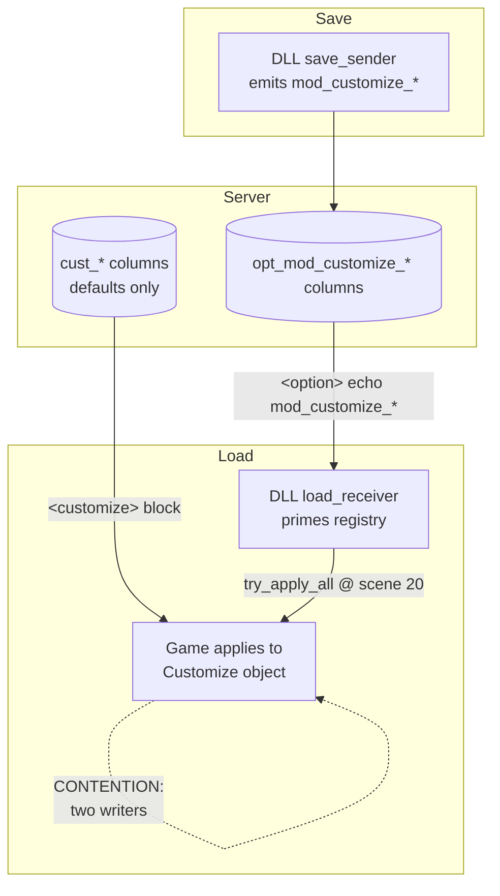
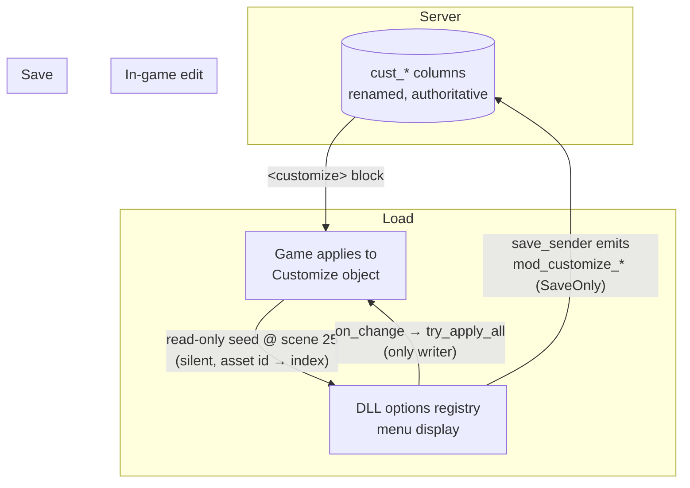

# Detailed Design — Native Customize Persistence (single source of truth)

## Overview

The WebUI Options mod lets players change cosmetic customizations
(appeal board, characters, backgrounds, lanes, lane covers, video size) in
game — selections that stock DDR World can only set via Konami's web portal.
The game receives these on card-in as a `<customize>` block of
`{category, key, pattern}` tuples in the `playerdata_load` response and applies
them to the `ddr::player::Customize` object; it **never sends them back** on
save (stock setups have no in-game editor).

Today the modpack persists in-game edits through a **second, parallel channel**:
the DLL injects `mod_customize_*` fields into the profile `<option>` block on
save, the server stores them in dedicated `opt_mod_customize_*` columns and
echoes them back in the `<option>` block on load, and the DLL re-applies them by
overwriting the `Customize` object in memory each scene-20 entry. This duplicates
data the game's own `<customize>` path already carries, and makes the DLL a
**second writer** that contends with any server (e.g. one with a real web UI)
that legitimately drives the native fields.

Now that the `(category, key, pattern)` → `Customize`-field mapping is fully
reverse-engineered (`docs/player_customization_system_research.md`), we collapse
to a **single source of truth**: the native profile fields. The DLL keeps only
the one direction the game lacks (game → server on save); everything else flows
through the game's own native load path.

This design spans two co-maintained repos:
- **ddr-world-universal-modpack** (the hook DLL) — implemented directly.
- **bemani-buddy** (the reference server) — implemented from the change set
  specified here (§7). A single agent owns execution of both after planning.

## Detailed Requirements

Consolidated from `idea-honing.md` (decisions D1–D7, findings F1–F2):

1. **Native fields are the single source of truth.** The server persists in-game
   selections into the native `cust_*` profile columns; the game's `<customize>`
   load path applies them. (D2)
2. **DLL stops network-loading customize values.** No reading `mod_customize_*`
   back from the server; no contention with the game's own load. (D2)
3. **DLL keeps sending customize values on save.** The game has no native save
   path for them, so the DLL's `mod_customize_*` save injection is retained. (D2)
4. **DLL menu state seeds from the game's `Customize` object at SONG_SELECT
   (scene 25) entry** — the earliest point the options modal can open. Seeding
   is **read-only** (never writes `Customize`) and happens on **every** scene-25
   entry (self-healing, idempotent). (D3, Q1, Q4)
5. **No savekind gating.** The game never saves before the first song completes,
   and reaching a song requires passing through song select, so the scene-25
   seed always precedes any save. (D4)
6. **JSON (offline) persistence is dropped for WebUI options.** They become
   network-save-only. Other mod options keep their full round-trip. (D5)
7. **A declarative `PersistMode` governs each option's persistence.** `Full`
   (default; network save + network load + JSON), `SaveOnly` (network save
   only), `None` (no persistence). (Q2, F2)
8. **Seeding uses a silent registry setter** that does not fire `on_change`
   (so an unknown asset id can never clobber `Customize`). (F1, Q4)
9. **Unknown asset id at seed → display index 0**, read-only (game keeps the
   server's value). Wide edge case (downgrade after playing newer assets); not
   otherwise solved. (Q4)
10. **bemani-buddy:** rename opaque `cust_<cat>_<pat>` columns to semantic names,
    drop the inert `cust_3_0`, drop `opt_mod_customize_*` columns + their load
    echo (keep `opt_mod_autoplay`), and write incoming `mod_customize_*` directly
    into the renamed native columns. (D7, Q3, Q5)
11. **No backward-compatibility layer.** Both repos ship together. (D6)

## Wire mapping (authoritative, from RE)

The game's dispatch (`docs/player_customization_system_research.md`) maps each
`(category, pattern)` to a `Customize` field. `key` is the value written (the
asset id). `pattern` is meaningful only for categories 2 and 3:

| (cat, pat) | Customize field | DLL option id | Server column (renamed) |
|:----------:|-----------------|---------------|-------------------------|
| (1, 0) | appeal_board | `customize_appeal_board` | `cust_appeal_board` |
| (2, 1) | character P1 | `customize_character_p1` | `cust_character_p1` |
| (2, 2) | character P2 | `customize_character_p2` | `cust_character_p2` |
| (3, 1) | background (result/special) | `customize_background` | `cust_background` |
| (3, 2) | background (gameplay) | `customize_background_gameplay` | `cust_background_gameplay` |
| (4, *) | lane_single | `customize_lane_single` | `cust_lane_single` |
| (5, *) | lane_double | `customize_lane_double` | `cust_lane_double` |
| (6, *) | lane_cover_single | `customize_lanecover_single` | `cust_lanecover_single` |
| (7, *) | lane_cover_double | `customize_lanecover_double` | `cust_lanecover_double` |
| (8, 0) | movie_size | `customize_movie_size` | `cust_movie_size` |
| (3, 0) | — (ignored by game) | — | *dropped* |

The DLL sends the **asset id** as the `mod_customize_*` value (its
`persist_save_transform` maps menu index → asset id), which is exactly the
game's `key`, so the server writes it verbatim into the native column — no
transform server-side.

## Architecture Overview

### Before (dual channel — two writers)



### After (single source of truth — one writer)



The `Customize` object has exactly one writer at steady state: the player's
own in-game edit. The server's stored value flows in through the game's native
path; the DLL only *reads* it to display the current selection.

## Components and Interfaces

### DLL — `services/custom_options` (framework)

**`PersistMode` enum** (new, in `api.rs`) replaces `RegisterSpec.persist: bool`
and the mirrored `registry` field:

```rust
pub enum PersistMode {
    Full,      // network save + network load + JSON cache (default; == old persist:true)
    SaveOnly,  // network save only; skipped by network load + JSON
    None,      // no persistence (== old persist:false)
}
```

- Builders (`bool_toggle`, `enum_values`, `scalar`) default to `Full`.
- Add builder setter `RegisterSpec::persist_mode(PersistMode)`.
- Old `persist: false` sites (if any) map to `None`.

**Silent setter** (new, in `mod.rs`):

```rust
/// Set an option's per-side value WITHOUT dispatching its on_change callback.
/// For non-user-driven state seeding (e.g. reading the game's own loaded
/// state) where firing on_change would cause an unwanted write-back.
pub fn set_value_silent(option_id: &str, player_side: u8, value: i32)
```

Implemented by mutating the registry value and **discarding** the callback
tuple `registry::set_value` returns (contrast `set_value`/`resolve_from_load`,
which dispatch it).

**Persistence gates** (choke points, per F2):
- `snapshot_for_save()` — filter `mode != None` (emits `Full` + `SaveOnly` on
  network save).
- `resolve_from_load()` — early-return when the option's `mode != Full`
  (single gate covering both network-load and the JSON-prime timer; makes
  `SaveOnly` ids inert on every load path).
- Add predicate `json_persisted(id) -> bool` (`mode == Full`) for the JSON
  writer to consult.

### DLL — `services/custom_options_persistence`

- `emit_network_children` — unchanged (consumes `snapshot_for_save`, which now
  yields `Full` + `SaveOnly`).
- `write_json_cache` — filter entries to `json_persisted(id)` (drops `SaveOnly`
  from the offline cache write).
- `json_load_once` / `apply_pending_loads` — unchanged; they funnel through
  `resolve_from_load`, which now self-gates on `Full`.

### DLL — `mods/webui_options`

- **Registration** (`enable()`): add `.persist_mode(PersistMode::SaveOnly)` to
  each option spec. Keep `save_transform` (index → asset id, for the save
  emit). Drop `load_transform` (no framework caller remains; the seed does its
  own reverse lookup). `on_change(on_value_changed)` unchanged.
- **Scene callback**: change from scene **20 → apply** to scene **25 → seed**.
  Remove the scene-20 `try_apply_all(0/1)` calls entirely.
- **New `seed_registry_from_game(side)`**: walk `player_work_table[side] →
  wrapper → PlayerWork + customize_offset` (same chain `try_apply_all` uses);
  for each category, read the `Customize` field at `customize_field_offset` as a
  u32 asset id, reverse-map to a menu index (`asset_ids.iter().position(id)
  .unwrap_or(0)`), and call `custom_options::set_value_silent(option_id, side,
  index)`. Null-guard the table/wrapper/player_work (no card → skip that side).
- **`try_apply_all`**: unchanged, now invoked **only** from `on_value_changed`
  (the single writer of `Customize`).

Preview overlays consume `custom_options::get_value(...)`; because the seed
populates the registry with the correct indices at scene-25 entry (before the
modal can open), previews resolve the right focused asset with no change.

### Server (bemani-buddy) — see §7 for the full change set.

## Data Models

### `PersistMode` (DLL) — see above.

### bemani-buddy column rename map

| Current column | New name | Default |
|----------------|----------|:-------:|
| `cust_1_0` | `cust_appeal_board` | 1 |
| `cust_2_1` | `cust_character_p1` | 1 |
| `cust_2_2` | `cust_character_p2` | 2 |
| `cust_3_1` | `cust_background` | 1 |
| `cust_3_2` | `cust_background_gameplay` | 1 |
| `cust_4_1` | `cust_lane_single` | 1 |
| `cust_5_1` | `cust_lane_double` | 1 |
| `cust_6_1` | `cust_lanecover_single` | 1 |
| `cust_7_1` | `cust_lanecover_double` | 1 |
| `cust_8_0` | `cust_movie_size` | 1 |
| `cust_3_0` | **dropped** (game ignores cat-3 pattern-0) | — |

### Dropped columns

The ten `opt_mod_customize_*` columns (migration `009`) and their protocol
load-echo fields. **`opt_mod_autoplay` is retained** (autoplay has no native
game field and keeps its full round-trip).

## Error Handling

All new DLL paths follow the crate's graceful-degradation rules:
- **Seed with no card / unresolved table**: `seed_registry_from_game` null-guards
  the player-work chain and skips a side that isn't carded in. WebUI Options
  already declares `player_work_table` + `customize_offset` as
  `required_signatures`, so the mod is skipped cleanly if they don't resolve.
- **Unknown asset id at seed**: index-0 fallback, read-only (game keeps its
  value). No panic, no clobber.
- **Silent setter on a poisoned registry lock**: no-op (mirrors `get_value`).
- **Scene callback**: runs inside `scene_manager`'s `catch_unwind` wrapper;
  the seed is panic-free (no unwrap/index-out-of-range — `position().unwrap_or(0)`
  and bounds-checked field reads).
- **Server save write-through**: only writes a `cust_*` column when the matching
  `mod_customize_*` child is present in the request (an un-hooked play or a web
  UI edit never clobbers the native column).

## Testing Strategy

No unit harness (in-process hook DLL); validation is `cargo check` + deploy +
log/behavior observation, per repo convention.

**DLL:**
1. `cargo check --target x86_64-pc-windows-msvc` after each step.
2. Deploy; card in on the maintainer's server (values stored in native
   columns). Confirm: cosmetics apply on card-in via the game's own load; the
   WebUI options modal shows the **current** selections (seed worked); changing
   a value applies immediately; card out → re-card → selection persists.
3. 2-player: both sides seed independently at scene 25.
4. Log checks: seed line per side at scene-25 entry; no scene-20 apply; save
   emits `mod_customize_*`; no `resolve_from_load` for customize ids.

**Server:**
1. `sqlx migrate run` on the local dev DB, then `cargo sqlx prepare --workspace`;
   `SQLX_OFFLINE=true cargo check --workspace` clean.
2. `grep -rn 'cust_[0-9]\|opt_mod_customize' crates/ migrations/` returns only
   the new migration's rename/drop clauses.
3. Round-trip: hooked client save writes the renamed native columns; next load
   emits them in `<customize>`; no `mod_customize_*` in the `<option>` echo.

## Appendices

### A. Technology / approach choices

- **`PersistMode` enum vs. booleans** (Q2): a single declarative knob at the
  registration site keeps the persistence service generic and avoids
  mod-specific coupling; chosen over two booleans (more knobs than use cases)
  and an id-skip-list in the service (couples service to a mod).
- **Seed at scene 25 vs. scene 20** (D3): scene 25 (SONG_SELECT) is the earliest
  point the modal can open and the point at which `PlayerWork`/`Customize` are
  fully populated; consolidating all sync there removes the scene-20 apply and
  its contention with the game's native load.
- **Read-only silent seed** (F1/Q4): guarantees the seed can never write
  `Customize`, so it cannot clobber a server value the local build can't map.
- **Reverse the data flow rather than keep dual channels**: the native path
  already carries the data end-to-end once the server write-throughs; the second
  channel was pure duplication and the source of two-writer contention.

### B. Alternatives considered / rejected

- **Keep `opt_mod_customize_*` as an override layer** (server prefers mod value
  over `cust_*` at load): retains duplicate storage and a convergence problem
  when a web UI later edits `cust_*`. Rejected — single source of truth is
  cleaner and the maintainer controls both ends.
- **Server-side clamping to known assets**: rejected — clamps belong in the
  game (ceilings grow every release); the server stores verbatim.
- **Once-per-session seed** (vs. every scene-25 entry): needs session tracking
  for no benefit; the seed is cheap and idempotent. Rejected.
- **Purge stale JSON `custom_options.{p1,p2}` customize keys** (Q3): inert and
  self-aging; a permanent purge routine for a closed-testing artifact isn't
  worth it. Rejected.

### C. Cross-repo coordination

DLL and server ship together (D6). The server change (native columns become
authoritative, echo removed) and the DLL change (stop network-loading, seed
from the game) are two halves of one flip; deploying only one half would either
reset cosmetics to defaults (server-only, old DLL) or fail to persist
(DLL-only, un-updated server). Both are executed together from this plan.
The RE research doc's "Server-Side Persistence Mapping" section is the contract
other operators follow to adopt the same server behavior.
