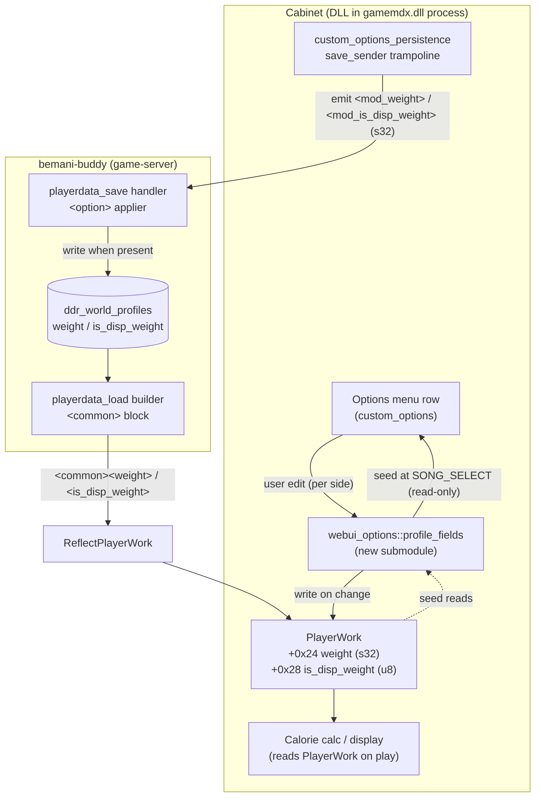
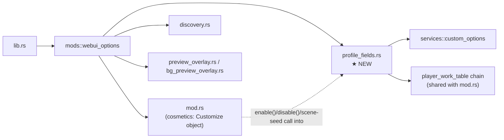

# Detailed Design — In-Game Weight & "Display Burned Calories" Options

## Overview

This feature adds two player-profile settings to the in-game options menu that
Konami's web UI normally owns exclusively:

- **DISPLAY BURNED CALORIES** (`is_disp_weight`) — an OFF/ON toggle.
- **WEIGHT** — the player's body weight in **kg**, fed into the game's calorie
  calculation, shown **only when the calorie toggle is ON** (parent/child).

It spans **two repositories that ship together as one change**:

1. **DLL** (`ddr-world-universal-modpack`) — a new self-contained submodule of the
   existing **WebUI Options** mod. It registers the two option rows, writes the
   chosen values into the game's `PlayerWork` object on edit, seeds the rows from
   `PlayerWork` at song-select, and (via the existing custom-options persistence
   layer) injects the values into `playerdata_save`.
2. **Backend** (`bemani-buddy`) — adds a save-path detection for the two injected
   fields, writing them to the **already-existing** native `weight` /
   `is_disp_weight` profile columns. The load path (which already emits both) and
   the DB schema are unchanged.

The design deliberately mirrors the existing cosmetic-customize feature
(`mod_customize_*`): the game's own profile load remains the single source of truth;
the DLL only adds the *save* direction the stock game lacks.

> **RE basis:** all memory offsets, the wire format, the reflect evidence, the
> calorie formula, and cross-version notes are in
> [`docs/calorie_weight_profile_research.md`](../../../docs/calorie_weight_profile_research.md).
> Backend change surface is in
> [`../research/backend-bemani-buddy.md`](../research/backend-bemani-buddy.md).

---

## Detailed Requirements

Consolidated from `idea-honing.md` (Q1–Q9):

**R1 — Placement.** Implement inside the existing `webui-options` mod as a
self-contained submodule under the same `webui-options` toggle. No new mod entry.

**R2 — WEIGHT row.** `Scalar`, integer, unit **kg** (no unit conversion anywhere —
read/written/sent as the same integer). Range **30..=200**, `step_fine = 1`,
`step_coarse = 10`. Hardcoded range (not config-driven).

**R3 — WEIGHT unset handling.** If the game returns `weight == 0`, seed the row to
**60**. Seeding is read-only w.r.t. game memory; game memory is written only on a
user edit.

**R4 — DISPLAY BURNED CALORIES row.** Modeled like other boolean options
(`bool_toggle`, OFF/ON via stock `seop_op_off`/`seop_op_on`). Default **OFF** when
the profile reads `0`.

**R5 — Parent/child.** The calorie toggle is the parent; the WEIGHT row is its
child, visible **only when the toggle is ON**, hidden otherwise. Achieved with the
existing `ShowWhen::Equals` mechanism (no framework changes).

**R6 — Apply timing.** Edits write `PlayerWork+0x24` (weight) / `+0x28`
(is_disp_weight) at song-select; effective on the **next play**. No live
mid-session toggle required.

**R7 — Per-player.** Both rows are per-side (P1 & P2), seeded/applied/saved
independently, mirroring `webui_options::{seed_registry_from_game, try_apply_all}`.

**R8 — Offsets.** Hardcode `WEIGHT_OFFSET = 0x24`, `IS_DISP_WEIGHT_OFFSET = 0x28`
(verified stable on 20260324/20260616); keep `player_work_table` runtime-derived.

**R9 — Persistence.** `PersistMode::SaveOnly` (network-save-only): emitted on
`playerdata_save`, never network-loaded, never JSON-cached. The framework emits
`<mod_{id}>` s32 children, so option ids `weight` / `is_disp_weight` produce wire
fields `mod_weight` / `mod_is_disp_weight`.

**R10 — Backend (ships together).** `bemani-buddy` detects `mod_weight` /
`mod_is_disp_weight` in the save `<option>` block and writes the native
`weight` / `is_disp_weight` columns ("only when present"). Declare the two fields
in the save-request schema. No migration; load/model/persistence already exist.

**R11 — Graceful degradation.** If `custom_options` is unavailable or the
player-work chain can't be resolved, the feature disables itself quietly (no crash),
consistent with the rest of the mod.

---

## Architecture Overview

### End-to-end data flow (both repos)



**Key invariant:** load is 100% game-native (server `<common>` → `ReflectPlayerWork`
→ `PlayerWork`). The DLL never network-loads these; it seeds its menu by *reading*
`PlayerWork`. The only new outbound path is save injection.

### DLL module placement



---

## Components and Interfaces

### 1. New DLL submodule: `src/mods/webui_options/profile_fields.rs`

Self-contained. Owns its two option ids, the PlayerWork offsets, and the
apply/seed logic. Public surface (called from `webui_options::mod.rs`):

```rust
// Called from WebUiOptionsMod::enable(), AFTER custom_options availability check.
// Registers the parent toggle then the child scalar. No-op if already registered.
pub fn register() ;

// Called from the existing SONG_SELECT (scene 25) callback, once per side (0,1).
// Read-only w.r.t. game memory: reads PlayerWork, set_value_silent into the menu.
pub fn seed(player_side: u8);

// (No explicit disable hook needed — options are torn down with the form; the
//  submodule holds no widgets/hooks of its own.)
```

Internal constants & ids:

```rust
const OPT_IS_DISP: &str = "is_disp_weight";  // parent  -> wire mod_is_disp_weight
const OPT_WEIGHT:  &str = "weight";          // child   -> wire mod_weight

const WEIGHT_OFFSET: usize        = 0x24;    // PlayerWork + 0x24, s32 (kg)
const IS_DISP_WEIGHT_OFFSET: usize = 0x28;   // PlayerWork + 0x28, u8/bool
const WEIGHT_MIN: i32 = 30;
const WEIGHT_MAX: i32 = 200;
const WEIGHT_DEFAULT_WHEN_UNSET: i32 = 60;   // seed value when profile reads 0
```

Registration (parent first — the framework validates the `ShowWhen` reference
synchronously):

```rust
pub fn register() {
    // Parent: OFF/ON toggle.
    let disp = RegisterSpec::bool_toggle(OPT_IS_DISP)
        .default_value(0)
        .on_change(on_is_disp_changed)
        .persist_mode(PersistMode::SaveOnly);
    let _ = custom_options::register_option(disp);

    // Child: weight scalar, visible only when parent == ON(1).
    let weight = RegisterSpec::scalar(OPT_WEIGHT, WEIGHT_MIN, WEIGHT_MAX, 1, ScalarFormat::Integer)
        .step_coarse(10)
        .default_value(WEIGHT_DEFAULT_WHEN_UNSET)
        .on_change(on_weight_changed)
        .show_when(ShowWhen::Equals { parent_id: OPT_IS_DISP.into(), value: 1 })
        .persist_mode(PersistMode::SaveOnly);
    let _ = custom_options::register_option(weight);
}
```

`on_change` handlers write the game object for the given side (same pointer chain
as `try_apply_all`):

```rust
fn on_weight_changed(side: u8, new_value: i32)  { write_field(side, WEIGHT_OFFSET,  new_value); }         // s32
fn on_is_disp_changed(side: u8, new_value: i32) { write_u8(side, IS_DISP_WEIGHT_OFFSET, new_value as u8); } // 0/1
```

`seed(side)` reverse of the above — read-only, `set_value_silent` (no on_change,
so no write-back loop), with the `0 → 60` substitution for weight:

```rust
pub fn seed(side: u8) {
    let Some(pw) = player_work(side) else { return };      // null-guarded chain
    let w = read_i32(pw, WEIGHT_OFFSET);
    let w_seed = if w == 0 { WEIGHT_DEFAULT_WHEN_UNSET } else { w.clamp(WEIGHT_MIN, WEIGHT_MAX) };
    custom_options::set_value_silent(OPT_WEIGHT, side, w_seed);

    let d = read_u8(pw, IS_DISP_WEIGHT_OFFSET) as i32;     // 0/1
    custom_options::set_value_silent(OPT_IS_DISP, side, if d != 0 { 1 } else { 0 });
}
```

> **PlayerWork chain helper** (`player_work(side)`) is identical to
> `webui_options::mod.rs`'s existing chain: `player_work_table[side]` → `*wrapper`
> = PlayerWork, all null-guarded. The submodule reuses the mod's resolved
> `player_work_table` (already required via `required_signatures()`), so **no new
> signature** is needed.

### 2. Integration into `webui_options/mod.rs`

Three small touch-points, no behavioral change to cosmetics:

- `enable()` — after the existing `custom_options::is_available()` guard and the
  cosmetic registration loop, call `profile_fields::register()`.
- The existing SONG_SELECT (scene 25) callback — in addition to
  `seed_registry_from_game(0/1)`, call `profile_fields::seed(0)` /
  `profile_fields::seed(1)`. One scene subscription, both concerns.
- `disable()` — nothing extra (submodule owns no widgets/hooks).

### 3. Save injection — no new code

`PersistMode::SaveOnly` + option ids `weight` / `is_disp_weight` are sufficient:
`custom_options_persistence::emit_network_children` already appends
`<mod_{id}>` s32 children under `<option>` on `playerdata_save` (gated by
`persist_network`). No `save_transform` is needed — the option value **is** the
wire value (kg integer; 0/1). Result on the wire:

```xml
<option>
  ...
  <mod_is_disp_weight __type="s32">1</mod_is_disp_weight>
  <mod_weight __type="s32">68</mod_weight>
</option>
```

### 4. Backend: `bemani-buddy`

**4a. Save-request schema** — `models/ddr_world/playdata_3.json`, in the **save**
`<option>` node (the one containing `mod_customize_*`, ~lines 375-384), add:

```json
"mod_weight": "s32?",
"mod_is_disp_weight": "s32?"
```
Regenerate codegen if the build requires it.

**4b. Save handler** — `crates/game-server/src/handlers/ddr_world/playdata.rs`, in
the `<option>` applier alongside the `mod_customize_*` block (~lines 663-672):

```rust
if let Some(v) = child_i32(option, "mod_weight")         { profile.weight = v; }
if let Some(v) = child_i32(option, "mod_is_disp_weight") { profile.is_disp_weight = v != 0; }
```
"Only when present" (via `if let Some`) so an un-hooked play never clobbers stored
values — identical policy to `mod_customize_*`.

**4c. No other backend change.** `ddr_world_profiles.weight` /
`is_disp_weight` columns exist (migration 003); the load builder already emits both
(`playdata.rs:292/294`); the DB model + MySQL UPDATE already persist them.

---

## Data Models

### PlayerWork header fields (gamemdx.dll, verified 20260324 & 20260616)

| Field | Offset | Type | Written by (game) | Read by (game) |
|-------|:------:|------|-------------------|----------------|
| `weight` | `PlayerWork + 0x24` | s32 (kg; `0` = unset) | `ReflectPlayerWork` | calorie calc `FUN_180053430` |
| `is_disp_weight` | `PlayerWork + 0x28` | u8/bool | `ReflectPlayerWork` | calorie display gate |

Pointer chain (same as customize): `player_work_table[side]` → `*wrapper` =
`PlayerWork`. `player_work_table` is derived at runtime (`player_work_table_anchor`).

### Wire fields (save `<option>` block)

| Wire field | kbin type | value | ← option id |
|------------|:---------:|-------|-------------|
| `mod_weight` | s32 | kg (30..200) | `weight` |
| `mod_is_disp_weight` | s32 | 0/1 | `is_disp_weight` |

### Native load fields (`<common>` block — unchanged, game-native)

| Field | kbin type | source column |
|-------|:---------:|---------------|
| `weight` | s32 | `ddr_world_profiles.weight` |
| `is_disp_weight` | bool | `ddr_world_profiles.is_disp_weight` |

### DB columns (bemani-buddy — already exist, migration 003)

| Column | SQL type | default |
|--------|----------|---------|
| `weight` | `INT NOT NULL` | `0` |
| `is_disp_weight` | `BOOLEAN NOT NULL` | `FALSE` |

### Option registry entries (DLL)

| id | UI | range/values | default | show_when | persist |
|----|----|--------------|:-------:|-----------|---------|
| `is_disp_weight` | `bool_toggle` | OFF/ON | 0 (OFF) | Always | SaveOnly |
| `weight` | `Scalar` int | 30..=200, fine 1 / coarse 10 | 60 | `Equals{is_disp_weight, 1}` | SaveOnly |

---

## Error Handling

- **Framework unavailable.** `register()` runs only after
  `custom_options::is_available()`; on failure the mod already logs and returns.
  `register_option` errors (e.g. `UnknownParent`) are logged WARN and skipped — a
  failed child registration must not abort the cosmetics.
- **Registration order.** Parent (`is_disp_weight`) is registered before the child
  (`weight`); otherwise the framework rejects the child with
  `RegisterError::UnknownParent`. Enforced by call order in `register()`.
- **Null player-work chain.** `player_work(side)` null-guards every hop
  (`player_work_table`, `wrapper`, `*wrapper`); a side not carded in is skipped
  silently in both `seed` and the `on_change` writers (mirrors existing code).
- **Seed is read-only.** `seed` never writes game memory and uses
  `set_value_silent` (no `on_change`), so it cannot loop or clobber a server-loaded
  value. The `0 → 60` substitution affects only the displayed menu value.
- **Bounds.** Weight writes are the framework-clamped menu value (30..200); `seed`
  clamps a read-back value into range before display. `is_disp_weight` writes are
  strictly `0`/`1`.
- **Offset stability.** Hardcoded `+0x24`/`+0x28` are verified across two builds; a
  future build that moves the PlayerWork header would require re-verification (see
  Alternatives for the signature-derived fallback). Consider a debug-build sanity
  read at init.
- **Backend absence guard.** `if let Some(v)` means a save without the fields leaves
  stored values untouched (un-hooked play / web-UI edit safe).

---

## Testing Strategy

Per `AGENTS.md`, the DLL has no unit tests — validation is live cabinet deploy + log
observation. The backend (`bemani-buddy`) does support Rust tests.

### DLL (live deploy + `OutputDebugStringA` logs)
1. **Rows render.** With `webui-options` on, the Mods tab shows **DISPLAY BURNED
   CALORIES**; the **WEIGHT** row appears only when it's ON and disappears when OFF
   — verified per side (P1 & P2 independently).
2. **Apply.** Editing WEIGHT logs + writes `PlayerWork+0x24`; toggling logs + writes
   `+0x28` (read-back confirms).
3. **Seed.** Re-entering SONG_SELECT seeds both rows from `PlayerWork`; a
   server-loaded weight shows; `weight==0` shows 60.
4. **Round-trip.** Card-out emits `mod_weight` / `mod_is_disp_weight` (packet log);
   next card-in shows the saved values after the native `<common>` load.
5. **Effect.** In-game calorie display reflects the toggle and tracks the set weight
   on the next play.
6. **Degradation.** With `custom_options` unavailable, no crash; rows simply absent.

### Backend (`bemani-buddy`)
- **Unit/integration:** a `playerdata_save` carrying `mod_weight=68` /
  `mod_is_disp_weight=1` updates the profile row; a following `playerdata_load`
  emits `<weight>68</weight>` / `<is_disp_weight>1</is_disp_weight>` in `<common>`.
- **Absence:** a save without the fields leaves the stored values unchanged.
- Reuse existing fixtures (e.g.
  `crates/ddr-score-proxy/tests/fixtures/playerdata_load_response.xml`).

### One-off manual calibration (pre-ship, non-blocking)
- Set a known weight via the web UI, read `PlayerWork+0x24` (Cheat Engine) to
  confirm the stored unit is plain kg (settles the RE unset-branch anomaly). If it
  turns out to be scaled, the only change is the range constants / a scale factor —
  localized to `profile_fields.rs`.

---

## Appendices

### A. Technology / design choices

- **Submodule under `webui-options` (R1).** One user toggle for all "web-UI-only"
  settings; reuses the mod's resolved `player_work_table`, its SONG_SELECT seed
  callback, and the custom-options save path. Con: broadens "WebUI Options" past the
  `Customize` object — accepted.
- **KG, no conversion (R2).** Chosen over an LB display to avoid lossy LB↔KG integer
  round-tripping (the profile stores integer kg); keeps read = write = wire.
- **`ShowWhen::Equals` parent/child (R5).** Reuses an existing framework capability
  (precedent: `power_user_statistics` `pacemaker_threshold`); **zero framework work**.
- **`SaveOnly` + `mod_{id}` naming (R9).** The framework's automatic
  `<mod_{id}>` emission means the wire field names fall out of the option ids for
  free — no bespoke save code, and the backend contract is a 1:1 name match.
- **Hardcoded offsets (R8).** Consistent with how the mod treats
  `customize_field_offset`; offsets verified stable on two builds.
- **Write native columns, no new DB columns (R10).** Directly follows the
  bemani-buddy migration 009→010 lesson (redundant `opt_mod_*` columns were added
  then dropped in favour of writing native columns).

### B. Research findings (summary)

- **Storage / consumer / formula:** `docs/calorie_weight_profile_research.md`
  (`weight`=+0x24, `is_disp_weight`=+0x28, `today_cal`=+0x30; reflect
  `FUN_180014850`/`FUN_180013c80`; calc `FUN_180053430`; full calorie formula §3.1).
- **Wire (ess.dll):** `<common>` `weight` (s32) / `is_disp_weight` (bool), parsed by
  `sys_playerdata_load_receiver`.
- **Backend:** columns + load + persistence already present; only save detection
  missing (`../research/backend-bemani-buddy.md`).
- **Framework:** `ShowWhen::Equals`, `bool_toggle`, `scalar().step_coarse()`,
  `PersistMode::SaveOnly`, `set_value_silent`, and `<mod_{id}>` save emission all
  exist and are exercised by shipping mods.

### C. Alternatives considered

- **Separate mod** (own `mod-config.json` toggle) — rejected (R1): duplicates the
  player-work chain + scene-seed plumbing for two rows.
- **LB display with LB↔KG conversion** — rejected (Q2 revision): integer-kg storage
  makes lb round-tripping drift ±1–2 lb on re-seed; not worth the complexity.
- **Signature-derived offsets** (decode `+0x24` from `FUN_180053430`'s
  `MOVD XMM0,[RDX+0x24]`, `is_disp = weight+4`) — deferred (R8): more machinery for
  offsets proven stable; kept as the documented fallback if a future build moves the
  PlayerWork header.
- **Config-driven weight range** — deferred (Q4): unnecessary now that the unit is
  fixed kg; trivially added later if an operator asks.
- **Live mid-session toggle of the calorie display** — out of scope (R6): matches
  the cosmetics' next-play apply model; the display consumer isn't hooked.
