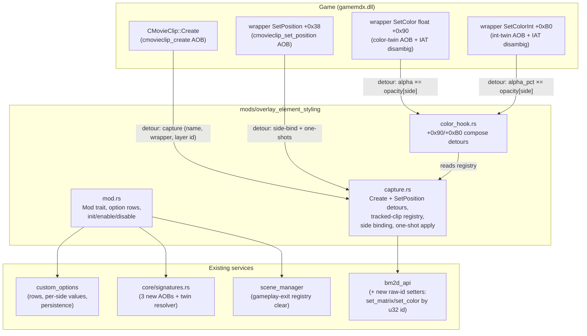

# Detailed Design — Overlay Element Styling (Per-Player Scale & Opacity)

Feature directory: `.agents/planning/20260712-overlay-element-styling/`
Authoritative RE reference: `docs/gameplay_overlay_elements_research.md`
(all binary facts cited below are proven there on both supported builds,
gamemdx 20260616 + 20260324).

## 1. Overview

A new mod, **`overlay-element-styling`**, gives each player two settings on the
game's native Options screen (Mods tab):

- **OVERLAY SCALE** — 25–150 %, default 100
- **OVERLAY OPACITY** — 0–100 %, default 100

Both apply uniformly to the dynamic feedback elements drawn over that player's
playfield during gameplay:

| Element group | AFP templates | Owner |
|---|---|---|
| Combo counter | `dance_combo_root1/2/3` | `ComboActor` |
| Judgement text | `dance_judge` | `NoteResultActor` |
| Freeze O.K./N.G. | `dance_judge_for_freeze` (×7 single / ×15 double) | `NoteResultActor` |
| FAST/SLOW | `dance_fast_slow` | `NoteResultActor` |
| Pacemaker score tracker | `dance_score_compare` | `NoteResultActor` |

**Explicitly excluded**: the receptor hit flashes (`dance_effect`) — never
touched.

Values take effect at the next song's start (elements are created per song;
the options screen is only reachable between songs). Settings persist with the
player profile (`PersistMode::Full`: network save/load + offline JSON cache).

## 2. Detailed Requirements

Consolidated from `idea-honing.md` (Q1–Q10):

1. **Per-player** settings, presented as rows on the native Options screen's
   Mods tab via the `custom_options` framework. (Q1)
2. **One shared pair of knobs** — a single scale row and a single opacity row
   covering all five element groups; no per-group knobs. (Q2)
3. **Scalar rows**: scale 25–150 (%), opacity 0–100 (%), both default 100,
   fine step 5, coarse step 25. 0 % opacity (fully hidden) is intentional and
   allowed. 150 % cap on scale is a deliberate decision. (Q3)
4. **Apply-at-song-start** semantics; no mid-song/live adjustment; no DLL
   overlay-menu integration. (Q4)
5. **`PersistMode::Full`** for both options (card-out network save, card-in
   load, `mod-config.json` `custom_options.{p1,p2}` offline cache). Wire value
   = the raw percentage (identity transform). (Q5)
6. **Two always-visible rows** — no parent toggle; defaults are identity. The
   mod's master enable/disable is the standard DLL mod registry. (Q6)
7. **Full versus support in v1** — per-side application in 2-player games via
   first-SetPosition x-binding. (Q7)
8. **Both multiplicative color entry points hooked**: wrapper SetColor float
   form (vtable +0x90) and int-percent form (+0xB0). (Q8)
9. **Two-tier graceful degradation** (Q9):
   - *Load-bearing* (mod self-disables, no rows registered): `cmovieclip_create`
     AOB/detour; libafp exports `afp_layer_set_matrix` + `afp_layer_set_color`;
     the +0x90 color AOB with successful IAT twin-disambiguation.
   - *Non-fatal* (log + degrade): +0xB0 int-variant hook (compose coverage is
     +0x90 in all observed paths); SetPosition side-binding detour (versus
     degrades to stock rendering; single/double still styled via
     active-side attribution).
10. **Identity** (Q10): mod id `overlay-element-styling`, name "Overlay Element
    Styling", option ids `overlay_scale` / `overlay_opacity`, labels
    `OVERLAY SCALE` / `OVERLAY OPACITY`, source at
    `src/mods/overlay_element_styling/`.

Non-requirements: receptor flash styling, per-group knobs, mid-song changes,
element repositioning, color tinting.

## 3. Architecture Overview

### 3.1 Mechanism recap (from the RE doc)

Every scoped element is a **BM2D CMovieClip pool wrapper** around an engine AFP
layer. Three engine facts make the design small:

1. **The template name crosses `CMovieClip::Create` as a C string in R8** —
   one cold-path detour identifies every element wrapper at creation, per song.
2. **The layer matrix has exactly one writer in gamemdx** (wrapper
   SetRotation, never called on these clips) and composes independently of the
   game's position writes → a **one-shot `afp_layer_set_matrix({s,0,0,s,0,0})`**
   is a complete scale implementation, anchored at the element's visual center.
3. **All multiplicative color writes flow through two wrapper vfuncs**
   (+0x90 float / +0xB0 int) → detouring them and multiplying the alpha
   argument composes opacity with the game's own alpha semantics (combo
   visibility gating 0/1, pacemaker negative-dim 0.5) instead of fighting them.

### 3.2 Component diagram



### 3.3 Runtime flow (one song)

```mermaid
sequenceDiagram
    participant Game
    participant Cap as capture.rs (detours)
    participant Col as color_hook.rs
    participant Opt as custom_options

    Note over Game: gameplay scene build (per song, game thread)
    Game->>Cap: Create(wrapper, pkg, "dance_judge", …)
    Cap->>Cap: original() → track {wrapper, layer_id, kind, side: Unbound}
    Game->>Cap: SetPosition(wrapper, x, y)   [first for this wrapper]
    Cap->>Cap: original() → bind side (x-threshold / active-side)
    Cap->>Opt: get_value(side, overlay_scale / overlay_opacity)
    Cap->>Game: one-shots: afp_layer_set_matrix(id,{s,0,0,s,0,0});<br/>afp_layer_set_color(id,1,1,1,op) [judge/freeze/fastslow/pacemaker only]
    Note over Game: gameplay (events, game thread)
    Game->>Col: SetColor(wrapper, a, r, g, b)  [combo gate / tint / pacemaker dim]
    Col->>Col: tracked? → a ×= opacity[side]
    Col->>Game: original(wrapper, a', r, g, b)
    Note over Game: song end / scene exit
    Game->>Cap: (scene_manager callback) clear registry
```

### 3.4 Why hooks live in the mod, not a service

Each detour target has exactly one consumer (this mod); per the codebase's
one-detour-per-target rule a shared dispatcher service is only warranted when a
second consumer appears (precedent: `fast_bootup` hooks
`CheckStepDataActor::update` from the mod). If a future mod needs
`CMovieClip::Create`, promote it to a dispatcher then.

## 4. Components and Interfaces

### 4.1 New signatures (`src/core/signatures.rs`)

Three AOB definitions plus one custom resolver, all verified on both builds
(RE doc §6, §8):

| Name | Pattern (see RE doc §6 for bytes) | Resolves | Multiplicity |
|---|---|---|---|
| `cmovieclip_create` | §6.1 | `CMovieClip::Create` | unique |
| `cmovieclip_set_color_float` | §6.2 | wrapper +0x90 **and** its acolor twin | exactly 2 — twin pair |
| `cmovieclip_set_color_int` | §6.3 | wrapper +0xB0 **and** its acolor twin | exactly 2 — twin pair |
| `cmovieclip_set_position` | §6.5 | wrapper +0x38 | unique |

**Twin disambiguation (mandatory — twin order flips between builds):** a
custom resolver (same pattern as the existing `find_judge_notes`) scans all
matches of each color pattern; for each match it decodes the `CALL [RIP+disp]`
IAT slot (via `scanner::decode_rip_relative` — float form: disp at match+0x21;
int form: at match+0x30), reads the loader-patched function pointer from the
slot, and compares it against `GetProcAddress("libafp-win64.dll",
"afp_layer_set_color")`. The ord-49 match is published as
`cmovieclip_set_color_*`; the resolver additionally asserts the sibling match
resolves to `afp_layer_set_acolor` (sanity check — mismatch → treat the whole
signature as unresolved). Resolution runs after libafp is loaded, which is
guaranteed at signature-resolve time (the DLL init waits for gamemdx, which
links libafp).

### 4.2 `bm2d_api` additions (raw-id, non-owning)

The existing AFP-layer wrapper set operates on mod-owned `AfpLayer` handles
with destroy-on-drop semantics. These layers are **game-owned** — wrapping
them in `AfpLayer` would be an ownership bug (drop would warn / tempt a
destroy). Add two raw-id functions to `bm2d_api` (resolved with the existing
named-export machinery; `afp_layer_set_matrix` is already resolved,
`afp_layer_set_color` is new):

```rust
/// Non-owning: set a game-owned layer's 2x3 matrix. Caller must know the id is live.
pub fn layer_set_scale_raw(layer_id: u32, sx: f32, sy: f32) -> bool
/// Non-owning: set a game-owned layer's multiplicative color transform.
pub fn layer_set_color_raw(layer_id: u32, r: f32, g: f32, b: f32, a: f32) -> bool
pub fn layer_color_available() -> bool   // afp_layer_set_color resolved
```

`afp_layer_set_color` joins the export-resolution list **non-fatally for
bm2d_api itself** (a miss must not take down the AFP-layer wrapper set that
bg-previews depend on); this mod treats a miss as load-bearing for *itself*
(Q9).

### 4.3 `capture.rs` — clip registry, side binding, one-shot application

**Registry.** A fixed-size table (64 slots — worst case is 2 sides × 21 clips)
in a `static mut` accessed via `addr_of!` (all writers/readers are on the game
thread: Create, SetPosition, SetColor detours, scene callback; the only
cross-thread data is the option values, mirrored into atomics — see §5).

```rust
#[derive(Clone, Copy, PartialEq)]
enum ElementKind { Combo, Judge, FreezeJudge, FastSlow, Pacemaker }

#[derive(Clone, Copy, PartialEq)]
enum Side { Unbound, P1, P2 }

struct TrackedClip {
    wrapper: *mut u8,     // pool wrapper ptr (identity key)
    layer_id: u32,        // wrapper+0x08 at capture time (validation)
    kind: ElementKind,
    side: Side,
    applied: bool,        // one-shots done
}
```

**Create detour** (`extern "C" fn(this, package, name, priority, mode)`,
5-arg MS-x64; `catch_unwind` + fall-through-to-original per the FFI-panic
rule; installed via `install_enabled`):

1. Call original first (wrapper/layer must exist).
2. If the mod is enabled and `name` matches — exact match `dance_judge`,
   `dance_judge_for_freeze`, `dance_fast_slow`, `dance_score_compare`, prefix
   match `dance_combo_root` (**exact-before-prefix so `dance_judge` never
   swallows `dance_judge_for_freeze`**; name read defensively: non-null,
   bounded strnlen) — insert `{wrapper, layer_id: *(wrapper+8), kind,
   Unbound, applied: false}`.
3. **Slot-reuse eviction**: any Create over a `wrapper` ptr already tracked
   (matching or not) first removes the stale entry.

**SetPosition detour** (`extern "C" fn(this, x: i32, y: i32)`):

1. Call original first.
2. Look up `this` in the registry; if untracked or already `applied`, return.
3. Bind side (§4.4), read that side's values, apply one-shots (§4.5), mark
   `applied`.

**Scene callback**: on scene change *away* from GAMEPLAY, clear the registry
(belt-and-braces alongside Create-time eviction; wrappers are destroyed by the
actors at song end).

### 4.4 Side binding

Executed at first SetPosition of a tracked clip:

- **Exactly one active side** (single or double): all clips belong to the
  active side. Active side is read the way existing per-player mods do (the
  `player_work_table` / player-context chain already used by
  `webui_options::seed_registry_from_game` and PUS — reuse the same
  signature-derived accessors; exact predicate finalized in implementation
  against that existing code).
- **Two active sides** (versus): `side = if x < X_SPLIT { P1 } else { P2 }`.
  `X_SPLIT` starts at 640 (playfield midline) — **cabinet-validate**; log each
  binding (`kind, x, side`) at debug level so the threshold can be confirmed
  from one versus play's log.
- **Fallback (SetPosition detour unavailable, Q9)**: versus renders stock; for
  a single active side, bind+apply directly in the Create detour (side is
  unambiguous there).

Double play is deliberately *not* x-discriminated (its elements sit near the
midline); it always takes the one-active-side path.

### 4.5 One-shot application (per clip, at bind time)

| Kind | Scale | Opacity |
|---|---|---|
| Combo | `layer_set_scale_raw(id, s, s)` | **compose-only** — no one-shot. The game's create-time `SetColor(a=0, …)` lands after capture, so every combo alpha write (including the initial hide) flows through the compose detour. A one-shot here would un-hide a 0-combo counter. |
| Judge / FreezeJudge / FastSlow | same | one-shot `layer_set_color_raw(id, 1,1,1, op)` — the game never colors these clips (RE §2.2), so it survives the whole song |
| Pacemaker | same | one-shot at bind (defines pre-first-event opacity) **plus** compose thereafter (game writes 1.0/0.5 per score event) |

Skip-identity optimization: if `scale == 100` skip the matrix write; if
`op == 100` skip the color one-shot (never skip *tracking*, so mid-session
option changes on later songs behave uniformly).

### 4.6 `color_hook.rs` — opacity compose detours

Two detours, same logic:

- **Float form** (+0x90): `extern "C" fn(this, a: f32, r: f32, g: f32, b: f32)`
  — **alpha is the FIRST float argument** (RE §3; XMM1). If `this` is tracked
  with a bound side: `a' = a * opacity[side]`; forward `(this, a', r, g, b)`.
  Untracked or unbound → forward unchanged.
- **Int form** (+0xB0): `extern "C" fn(this, a_pct: i32, r: f32, g: f32, b: f32)`
  — `a' = a_pct * opacity_pct[side] / 100` (integer, clamped ≥0). Also emit a
  one-shot debug log on first tracked hit (this path was never observed on
  these elements; a log confirms/refutes coverage assumptions on cabinet).

The array-form vfunc (+0x98) dispatches virtually into +0x90, so it is covered
by the float detour. Both detours must also multiply when the clip is tracked
but `!applied` yet (combo's create-time `SetColor(a=0)` arrives before the
first SetPosition): `0 × op = 0`, correct; use the *pending* side if unbound —
if no side can be determined yet, forward unchanged (the write in question is
the a=0 hide, which is opacity-invariant anyway).

### 4.7 `mod.rs` — Mod trait implementation

- `id`: `overlay-element-styling`; name "Overlay Element Styling";
  description per Q10.
- `required_signatures()`: `cmovieclip_create`, `cmovieclip_set_color_float`
  (the disambiguated ord-49 address). (`cmovieclip_set_color_int` and
  `cmovieclip_set_position` are used opportunistically — non-fatal.)
- `init()`: verify load-bearing set (signatures + `bm2d_api::layer_color_available`
  + `afp_layer_set_matrix` availability); stash addresses.
- `enable()`:
  1. Install Create detour (`install_enabled`, store-before-enable).
  2. Install +0x90 compose detour. Failure of either → uninstall anything
     installed, log, refuse enable (registry stays consistent).
  3. Install +0xB0 and SetPosition detours — failures logged, non-fatal.
  4. Register the two custom_options rows (§5). Row-registration failure →
     non-fatal in the sense that hooks stay armed but with default values
     (identity) — practically inert; log a warning.
  5. Register scene callback for registry clearing.
- `disable()`: unregister rows (`custom_options` handle), remove scene
  callback, disable detours via `HookManager::remove_all` semantics, clear
  registry, reset value atomics to 100.
- **Live-toggle semantics**: disabling mid-session leaves already-applied
  one-shots on the current song's clips (documented; next song is stock).
  Matches apply-at-song-start semantics (Q4).

### 4.8 Custom options registration

Two `RegisterSpec`s (both `PersistMode::Full`, wire value = raw percent,
identity transforms):

| id | label | UiKind | default |
|---|---|---|---|
| `overlay_scale` | `OVERLAY SCALE` | `Scalar { min: 25, max: 150, fine_step: 5, coarse_step: 25 }` | 100 |
| `overlay_opacity` | `OVERLAY OPACITY` | `Scalar { min: 0, max: 100, fine_step: 5, coarse_step: 25 }` | 100 |

`on_change(player, _old, new)`: store into the per-side atomics (§5). No
game-memory writes from `on_change` — values are consumed at the next song's
bind (Q4). Option label textures ride the existing custom_options label-atlas
generation (`asset_gen`); no new asset pipeline work.

## 5. Data Models

### 5.1 Shared state

```rust
// capture.rs
static mut REGISTRY: [TrackedClip; 64];      // game-thread only (see §4.3)
static REGISTRY_LEN: AtomicUsize;            // defensive publication

// mod.rs — cross-thread mirrors of the registry values (written by on_change
// on the render thread and by the persistence prime; read by detours)
static SCALE_PCT:   [AtomicI32; 2];          // per side, 25..=150, default 100
static OPACITY_PCT: [AtomicI32; 2];          // per side, 0..=100, default 100
static MOD_ENABLED: AtomicBool;
```

Detours read only the atomics + registry; `custom_options::get_value` is used
at bind time as the authoritative read (falls back to the atomic mirror if the
registry lock is unavailable — `get_value` is already poison-safe returning
`Option`).

### 5.2 Persistence footprint

No new `mod-config.json` schema. The two options appear automatically as
`custom_options.p1/p2.overlay_scale` / `.overlay_opacity` (wire = percent,
written by the existing card-out cache path) and as `mod_overlay_scale` /
`mod_overlay_opacity` kbin children on the network profile. The `mods` map
gains the standard `"overlay-element-styling": bool` toggle.

### 5.3 Constants

```rust
const NAME_EXACT: [(&str, ElementKind); 4] = [
    ("dance_judge",            Judge),
    ("dance_judge_for_freeze", FreezeJudge),
    ("dance_fast_slow",        FastSlow),
    ("dance_score_compare",    Pacemaker),
];
const NAME_PREFIX: [(&str, ElementKind); 1] = [("dance_combo_root", Combo)];
const X_SPLIT: i32 = 640;        // versus midline — cabinet-validate
const REGISTRY_CAP: usize = 64;  // 2 × 21 worst case, rounded up
```

## 6. Error Handling

- **Every detour body** wrapped in `catch_unwind(AssertUnwindSafe(..))`; on
  panic, fall through to the original call unchanged (never lose a game call).
  Detour handles installed via `core/hooks.rs::install_enabled`
  (store-before-enable — the boot-crash race class).
- **Signature failures** per Q9's two tiers (§4.7). The color-twin resolver
  treats *any* ambiguity (≠2 matches, IAT target matching neither export,
  sibling not resolving to acolor) as unresolved — misidentifying set_color
  vs set_acolor would silently write the wrong transform channel.
- **Name read safety** in the Create detour: null-check R8, bounded read
  (≤ 64 bytes), non-UTF8 → ignore clip.
- **Registry overflow**: drop new captures with a one-shot warn (styling
  degrades to partial for that song; never overwrite live entries).
- **Layer-id validation**: at bind time re-read `wrapper+0x08` and compare
  with the captured id; mismatch (slot recycled between Create and
  SetPosition — shouldn't happen intra-build) → evict, skip.
- **Untracked forwarding**: color detours forward unchanged for unknown
  wrappers — the hooks are engine-wide, correctness for other clips is
  non-negotiable.
- **Failure containment**: no allocation in detour bodies (fixed registry,
  no String work beyond stack-bounded name compare).

## 7. Testing Strategy

No unit-test infrastructure exists (validation = cabinet deploy + logs), so
testing is staged observable increments with targeted log lines:

1. **Signature stage**: boot log must show all four AOBs resolved + twin
   disambiguation result (`set_color=0x…, set_acolor=0x…`) on the cabinet's
   build. A second cabinet/build repeats this passively.
2. **Capture stage**: per-song debug log of captures
   (`kind × count, layer ids`) — expected counts: 3 combo, 1 judge, 7/15
   freeze, 0–1 fast_slow, 0–1 pacemaker (mode-dependent).
3. **Bind stage**: debug log `bind kind=… x=… side=…` — single, double, and
   versus plays; validates the `X_SPLIT` threshold empirically before trusting
   it.
4. **Scale**: set 50 % on P1 only; verify combo/judgement/freeze/fast-slow/
   pacemaker shrink about their centers on P1 while P2 is stock; verify
   scale persists across a full song (sole-matrix-writer assumption) and
   that 150 % renders acceptably.
5. **Opacity**: 0 % → all elements invisible but gameplay unaffected; 50 % →
   combo appears only ≥4 combo at half alpha (gating preserved); pacemaker
   negative-dim renders at 0.5 × op; judgement pop animation fades scale
   proportionally.
6. **Persistence round-trip**: set values, card out, card in → values return
   (network); repeat with server-less boot → JSON cache path.
7. **Degradation drills**: force-skip the SetPosition signature (config/dev
   patch) → versus stock, single styled; force-skip +0xB0 → confirm no
   visible opacity resets during play (watch for the int-path one-shot log).
8. **Regression sweep**: receptor flashes untouched; PUS pacemaker-swap
   coexists (different patch site, same handler — verify both active
   simultaneously); bg-preview / custom-options screens unaffected.

## 8. Appendices

### A. Technology / mechanism choices

| Decision | Chosen | Rejected alternatives |
|---|---|---|
| Element identification | Detour `CMovieClip::Create` (name in R8) | Pool scan by name (wrapper stores no template name — only the root-MC path `"/"`); hooking each actor's onCreate (N targets, version-fragile) |
| Scale | One-shot layer matrix at bind | Per-frame reassert (unneeded — sole-writer invariant); MC-level matrix (timeline-owned, would fight animation) |
| Opacity | Compose detour on wrapper SetColor (+0x90/+0xB0) + one-shots for never-colored clips | One-shot-only (clobbered per event on combo/pacemaker; breaks combo gating); additive `set_acolor` (zero-detour but subtractive — distorts fades and the 0.5 dim); hooking libafp `afp_layer_set_color` (engine-wide hot path) |
| Side binding | First-SetPosition x-threshold (versus) + active-side (single/double) | Creation order (fails 2P-only starts); layer group read-back (no getter); libafp-internal table walks (cross-module, fragile) |
| Hook placement | In-mod `GenericDetour`s via `install_enabled` | New dispatcher service (only one consumer today — YAGNI per one-detour-per-target guidance) |

### B. Key research findings (see `docs/gameplay_overlay_elements_research.md`)

- CMovieClip vtable layout identical across both builds; the color-twin
  **order flips** between builds → IAT disambiguation is mandatory, not
  defensive.
- `afp_layer_set_matrix` has exactly one gamemdx caller on both builds
  (SetRotation vfunc) — one-shot scale is stable.
- Wrapper SetColor argument order is `(this, a, r, g, b)` — alpha first.
- Game alpha semantics: combo hidden via `a=0` below 4 combo; pacemaker dimmed
  to `a=0.5` on negative delta; judge/freeze/fast-slow never colored.
- All four detour-target AOBs verified unique (or exactly-twin) on 20260616
  and 20260324.

### C. Open items deliberately deferred to cabinet validation

1. `X_SPLIT` exact value/unit for versus binding (instrumented via bind logs).
2. Whether the +0xB0 int color path ever fires on scoped elements (one-shot
   log will answer definitively).
3. Scalar step ergonomics (5/25) on the timed options screen.
4. Aesthetics of 150 % scale over the lane (cap already decided at 150).
