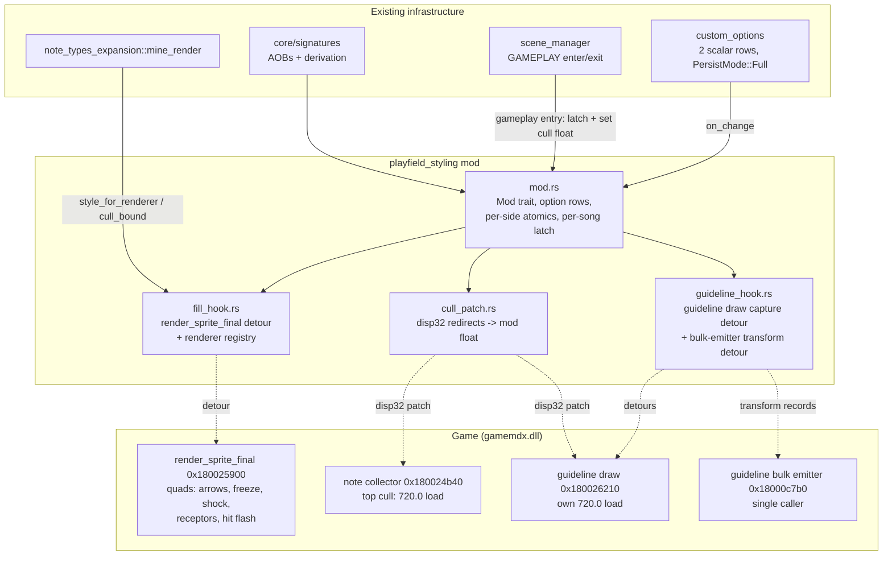

# Detailed Design — Playfield Styling (Arrow / Receptor Scale + Opacity)

Feature directory: `.agents/planning/20260716-arrow-receptor-styling/`
Companion research: `research/existing-code.md`, `research/arrow-render-re.md`
(all binary facts below are Ghidra-verified there; addresses file-relative to
`gamemdx.dll` @ 0x180000000, build 20260616 unless noted).

## 1. Overview

A new mod, **`playfield-styling`** ("Playfield Styling"), adds two per-player
options — **ARROW SCALE** (25–150%) and **ARROW OPACITY** (0–100%) — that
uniformly scale and fade the entire gameplay playfield rendering: scrolling
note arrows (normal / freeze / shock + electric overlay), the stationary
receptor row, the sprite-based receptor hit flash, the measure guideline, and
mines (when `note_types_expansion` is active). It is the playfield companion
to `overlay_element_styling` (which styles combo/judgement/pacemaker).

The playfield scales about the **lane center X and the receptor row Y**: the
receptor row shrinks in place, staying horizontally centered on the stock
lane; arrows converge toward the center line as they scroll. Purely visual —
zero effect on timing, judging, or scoring.

Mechanism summary (three legs):

1. **One detour on the shared per-quad sprite fill** (`render_sprite_final`,
   an existing repo signature, currently un-detoured). Every lane quad —
   arrows, freezes, shocks, receptors, hit flashes — flows through it via
   real `CALL`s with lane-relative `(x, y, w, h)` args and a color pointer.
   The detour scales the geometry and composes opacity into the color alpha.
2. **A 4-byte culling-window patch**: the note collector stops collecting at
   a 720.0f screen bound; at scale < 1 that causes arrows to pop in
   mid-screen. The bound is loaded by one `MOVSS xmm, [RIP+disp32]`
   instruction; the patch redirects `disp32` to a mod-owned float set to
   `720 / min(scale)` per song. Same technique on the guideline's own
   720-load.
3. **Two guideline detours**: the guideline draws through its own plain-
   sprite batch path (not the shared fill). A capture detour on the guideline
   draw (pre-scales the Y base so both scroll directions cull correctly) plus
   a transform detour on its private bulk emitter (single caller) scale and
   fade the line records in place.

## 2. Detailed Requirements (consolidated from idea-honing.md)

| # | Requirement |
|---|---|
| R1 | Scale anchor = lane center X + receptor row Y. Receptors shrink in place, horizontally centered on the stock lane center; arrow columns converge toward the center line. (A1) |
| R2 | All five element groups styled uniformly by the one pair: (1) scrolling notes incl. normal/freeze/shock + electric overlay, (2) receptor row, (3) sprite-based receptor hit flash, (4) mines via `mine_render` integration, (5) measure guideline. (A2) |
| R3 | Options mirror the overlay pair: `arrow_scale` 25–150% and `arrow_opacity` 0–100%, step 5 fine / 25 coarse, default 100, `PersistMode::Full`, labels "ARROW SCALE" / "ARROW OPACITY", rows on the Mods tab. (A3) |
| R4 | Values latch at gameplay entry — a song plays start-to-finish with one snapshot per side; changes take effect at the next song. (A4) |
| R5 | Purely visual: no effect on judge timing or scoring. HIDDEN/SUDDEN fade zones keep stock screen distances from the receptor (documented characteristic). Reverse scroll fully supported. (A5) |
| R6 | All-or-nothing enable gate: fill detour + cull patch (with byte verification) + guideline path must ALL install, else the mod self-disables and registers no option rows. Mine integration is same-crate. Coexists with `center_arrows_single` (anchor from live posX) and with `mine_render`'s existing `render_notes` detour (which this mod does not touch). (A6) |
| R7 | Versus: independent per-side values, simultaneously. Doubles: side-0 (P1) values, anchor = 8-panel lane center. Mod id `playfield-styling`, name "Playfield Styling". (A7) |
| R8 | Cabinet acceptance checklist (see §8 Testing Strategy). (A8) |

## 3. Architecture Overview



### Per-frame data flow (scale s < 1, side bound)

```mermaid
sequenceDiagram
    participant G as Game renderer
    participant C as Collector (patched)
    participant F as fill detour
    participant O as original fill

    Note over C: top cull now breaks at<br/>mod float = 720/min(s) instead of 720
    G->>C: collect notes (per pass)
    C-->>G: RenderNotes incl. far notes
    G->>F: fill(this, quad, x, y, w, h, uv, twist, color)
    F->>F: lookup/bind this -> (side, s, op, cx)
    F->>F: x' = cx + s*(x-cx); y' = s*y; w' = s*w; h' = s*h
    F->>F: color' = copy, alpha *= op
    F->>O: original(this, quad, x', y', w', h', uv, twist, &color')
    O-->>G: quad written (posX/posY, reverse, appearance applied inside)
```

Why this decomposition:

- The fill's `(x, y)` are **lane-relative** (x = 96·dir, y = scroll offset
  from the receptor row); the original adds the lane origin
  (`posX@this+0x30`, `posY@this+0x34`) and applies reverse mirroring and
  appearance alpha *after* our transform. Scaling `y` about 0 therefore
  anchors on the receptor row and commutes with reverse; substituting
  `x' = cx + s·(x−cx)` anchors on the lane center (R1) — and because the
  anchor derives from the live renderer, a lane shifted by
  `center_arrows_single` scales about its shifted center automatically (R6).
- Rotation (`twist`) is applied by the original about the quad center, which
  our transform relocates consistently — no angle change needed.
- Opacity composes into the `color` argument (copied to a local; the game's
  own appearance/miss/fade alphas multiply on top inside the original), so
  the game's alpha animations (shock-damage flash, game-over fade, freeze
  fades) are preserved (R5).

## 4. Components and Interfaces

New mod directory: `src/mods/playfield_styling/` — registered in
`src/mods/mod.rs` + `src/lib.rs` as id **`playfield-styling`**.

### 4.1 `mod.rs` — lifecycle, options, latch

Mirrors `overlay_element_styling::mod.rs`:

- **Options** (registered only after all hooks/patches install — R6):
  - `RegisterSpec::scalar("arrow_scale", 25, 150, 5, ScalarFormat::Integer)
    .step_coarse(25).default_value(100).on_change(on_scale_change)`
  - `RegisterSpec::scalar("arrow_opacity", 0, 100, 5, ScalarFormat::Integer)
    .step_coarse(25).default_value(100).on_change(on_opacity_change)`
  - `PersistMode::Full` (builder default) → network + JSON persistence for
    free. `Duplicate` on re-enable treated as success; enable-time reseed
    from `custom_options::get_value` (registration does not re-fire
    `on_change` on re-enable).
  - Label PNGs: add `("arrow_scale", "ARROW SCALE")`,
    `("arrow_opacity", "ARROW OPACITY")` to `scripts/gen_option_labels.py`.
- **Live values**: `SCALE_PCT: [AtomicI32; 2]`, `OPACITY_PCT: [AtomicI32; 2]`
  (seeded 100), written by `on_change`, read only at latch time.
- **Per-song latch** (R4): a `scene_manager::on_scene_change` callback on
  GAMEPLAY entry snapshots both sides into
  `LATCHED: [LatchedStyle; 2]` (render-thread statics), clears the renderer
  registry, and writes the cull float:
  `cull = 720.0 / min(scale_p1, scale_p2, 1.0)` (i.e. 720.0 whenever no side
  shrinks; up to 2880.0 at 25%). On GAMEPLAY exit: clear registry, log
  one-line capture stats. On mod disable: write 720.0 to the cull float
  (patches stay installed but become semantically stock — no repeated code
  patching), clear latch to identity.
- **`required_signatures()` returns `&[]`**; load-bearing checks live in
  `init`/`enable` with `is_active()` self-report (the
  `center_arrows_single` / `overlay_element_styling` precedent).

### 4.2 `fill_hook.rs` — the shared quad transform

- **Detour target**: `render_sprite_final` (existing signature, un-detoured).
  Fn type:
  `unsafe extern "C" fn(this: *mut u8, out: *mut u8, x: f32, y: f32, w: f32,
  h: f32, uv: *const f32, twist: f32, color: *const u8)`.
  Installed via `core::hooks::install_enabled` (store-before-enable),
  callback body panic-free (no unwrap/indexing), gated by `MOD_ENABLED` +
  per-song latch != identity for the bound side.
- **Renderer registry**: fixed 16-slot `static mut` array (render-thread
  only, `addr_of!` access, `REGISTRY_LEN` atomic early-out — the
  `overlay_element_styling::capture` discipline):
  `TrackedRenderer { this: *mut u8, side: u8, half_width: f32 }`.
  Bind on first sight of an unknown `this`:
  1. **Classify** by vtable: `[this]` must equal one of three vtable
     addresses resolved at init via RTTI walk (`screen::ArrowRenderer`,
     `screen::SpotRenderer`, `screen::JudgeEffectRenderer` — RTTI names
     verified present). Unknown vtable → forward unmodified, do not track.
  2. **Lane width**: read the mode field per class — ArrowRenderer `+0xB0`,
     SpotRenderer `+0x98` — mode 1 (double) → `half_width = 384.0`, else
     `192.0`. JudgeEffectRenderer has no verified mode field: it inherits its
     side's half_width from the ArrowRenderer/SpotRenderer already bound to
     that side (they always bind first in the frame's draw order; if none
     bound yet, defer binding to a later call).
  3. **Side**: single-active-side via the `player_array_anchor` presence
     read (ported helper); versus → `posX@this+0x30 < 640.0` → P1;
     doubles (mode 1) → side 0 (R7).
  - Registry cleared on GAMEPLAY enter/exit (renderers are per-song objects);
    slot-reuse eviction on pointer collision; overflow → one-shot warn +
    forward unmodified.
- **Transform** (only when bound and `(s, op) != (1.0, 1.0)`):
  `x' = cx + s*(x − cx)` with `cx = half_width`; `y' = s*y`; `w' = s*w`;
  `h' = s*h`; color: copy 4 bytes to a stack local, `a' = a·op` (round,
  clamp 0–255), pass the local's pointer. Call original with transformed
  args. UV and twist pass through untouched.
- **Public intra-crate API** (for mine integration):
  `pub fn style_for_renderer(this: *const u8) -> Option<StyleSnapshot>` and
  `pub fn cull_bound() -> f32` — lock-free reads of the registry/latch, used
  by `mine_render` inside its existing `render_notes` detour (same thread).

### 4.3 `cull_patch.rs` — collector + guideline window extension

- **Derivation** (no new AOBs):
  - Collector = first `CALL rel32` target inside `render_notes`
    (`scanner::scan_first_call_rel32`).
  - Cull site = scan the collector's first 0x100 bytes for
    `F3 44 0F 10 3D disp32` (`MOVSS XMM15, [RIP+disp]`) whose RIP target
    reads 720.0f. (Observed at collector+0xA6 on both 2026 builds, but the
    design scans rather than assumes the offset.)
  - Guideline cull site = same scan inside the guideline draw (§4.4) for
    `F3 44 0F 10 0D disp32` (XMM9 form) → 720.0f.
- **Mod-owned float**: a 4-byte slot RIP-reachable from both sites (int3
  alignment-padding cave near the functions, following the
  `real_speed_fix` cave precedent, or a near-VirtualAlloc fallback).
  Initialized to 720.0.
- **Patch**: rewrite each site's disp32 to point at the slot
  (`memory::protect` toggle; 4-byte write). Verification before patching:
  exact opcode bytes + original target value == 720.0f; any mismatch →
  init fails (R6). The patch is applied once per process at enable; disable
  writes 720.0 into the slot instead of unpatching.
- The shared-constant hazard is why the *instruction* is patched, never the
  720.0 constant itself (14 unrelated readers verified).

### 4.4 `guideline_hook.rs` — measure guideline styling (load-bearing, R2/R6)

The guideline draw (`FUN_180026210`-equivalent) does not use the shared fill;
it accumulates 0x14-byte records `{x, y, w, h, color}` (screen-space; `x` =
lane left `this+0x80`, `w` = numPanels·96, `h` = 3.0) and submits them in one
call to a bulk emitter (`FUN_18000c7b0`-equivalent) with **exactly one
caller**.

- **Resolution** (derived, cross-version robust):
  guideline draw = the `get_offset_y` xref whose callee set contains neither
  the collector nor the shared fill, verified by locating its bulk-emit
  callee: the `CALL` target whose body writes command tag `0x01` with
  `count*0x14` stride math. Verify the emitter's xref count == 1. Any
  ambiguity → init fails (R6).
- **Capture detour** (on the guideline draw): bind side once per song
  (posX@`+0x80` split / presence read / mode@`+0x78` doubles → side 0). If
  `s != 1.0`: save `Ybase@+0x84`, write `Ybase/s`, set a thread-synchronous
  pass state `(side, s, op)` (the `center_arrows_single` PASS_STATE
  pattern), call original, restore `+0x84`, clear pass state.
  The `Ybase/s` pre-scale makes the emitter-side `y' = s·y` **exact for both
  scroll directions** and lets both cull bounds (patched 720 normal; literal
  0.0 reverse) cover the extended window — derivation in research §8.
- **Transform detour** (on the bulk emitter): when pass state active, for
  each record: `cx = x + w/2`; `x' = cx − s·w/2`; `w' = s·w`; `y' = s·y`;
  `h' = s·h`; color MSB (alpha) `·= op`. Forward to original. Pass state
  inactive → forward untouched (defensive; single caller today).

### 4.5 Mine integration (`note_types_expansion::mine_render`)

Same-crate addition, active only when both mods are enabled:

- In the mine pass (inside its existing `render_notes` detour, which this
  mod does not otherwise touch): query
  `playfield_styling::style_for_renderer(renderer_this)`; if styled, apply
  the identical transform to each mine quad's `(x, y, w, h)` and multiply
  the emitted color alpha; replace the pass's hardcoded window checks
  (`fy > 720.0`, bottom margin) with `playfield_styling::cull_bound()`.
- No behavior change when `playfield-styling` is disabled or unbound
  (`style_for_renderer` returns `None` → stock path).

## 5. Data Models

```rust
// mod.rs
struct LatchedStyle { scale: f32, opacity: f32 }        // identity = 1.0/1.0
static LATCHED: [LatchedStyle; 2];                       // render-thread only
static SCALE_PCT: [AtomicI32; 2];                        // live option mirrors
static OPACITY_PCT: [AtomicI32; 2];
static MOD_ENABLED: AtomicBool;

// fill_hook.rs
#[derive(Clone, Copy)]
struct TrackedRenderer { this: *mut u8, side: u8, half_width: f32 }
static mut REGISTRY: [Option<TrackedRenderer>; 16];
static REGISTRY_LEN: AtomicUsize;                        // ==0 hot-path early-out
pub struct StyleSnapshot { pub scale: f32, pub opacity: f32, pub center_x: f32 }

// cull_patch.rs
struct CullPatch {
    float_slot: *mut f32,          // mod-owned 720/s value (init 720.0)
    sites: Vec<PatchedSite>,       // collector + guideline disp32 rewrites
}
struct PatchedSite { insn_addr: usize, original_disp32: i32 }
```

Game-side structures consumed (all Ghidra-verified, research §2/§8):
ArrowSprite base fields (`posX +0x30`, `posY +0x34`, appearance `+0x6C..+0x78`,
vbptr `+0x80`), ArrowRenderer `mode +0xB0`, SpotRenderer `mode +0x98`,
guideline object (`X +0x80`, `Y +0x84`, mode `+0x78`, color `+0x88..+0x8B`),
guideline record stride 0x14, quad record stride 0x34, collector record
stride 0x28. No game structs are allocated or freed by this mod (no
allocator-matching concerns).

Config: no new `mod-config.json` section. The mod toggle lives under `mods`
(`"playfield-styling"`); option values persist generically under
`custom_options.{p1,p2}` (JSON) and as `mod_arrow_scale` /
`mod_arrow_opacity` (network) via `PersistMode::Full`.

## 6. Error Handling

| Failure | Handling |
|---|---|
| Any signature/derivation miss (fill, collector, cull sites, guideline draw/emitter, vtables, presence anchor) | `init` fails → mod self-disables; **no option rows registered** (no inert UI); one WARN per missing item. (R6) |
| Cull-site byte verification mismatch (opcode or 720.0 target) | Init fails as above — never patch unverified bytes. |
| Emitter xref count != 1 | Init fails (the transform detour assumes a private caller). |
| Unknown vtable at fill time | Forward unmodified; never track. |
| Registry overflow / pointer collision | One-shot WARN + forward unmodified / slot-reuse eviction. |
| JudgeEffect binds before its side's width is known | Defer binding (retry next call); quad passes through unstyled for at most the first frames of a song. |
| Panic inside any detour callback | All callbacks wrapped `catch_unwind`; on panic → forward original args (identity behavior), one-shot ERROR log. |
| `custom_options` registration `Duplicate` on re-enable | Treated as success; values reseeded via `get_value`. |
| Mid-song disable via mod menu | Detours gate on `MOD_ENABLED` (instant identity); cull float set to 720.0; latch cleared — full stock behavior by the next frame, guaranteed stock by next song. |
| Scale=100 & opacity=100 (identity) | Fill/guideline callbacks call original with untouched args; cull float 720.0 — zero behavioral delta. |

Hot-path budget: the fill callback runs per quad (typically < 100/frame;
worst case a few hundred with the extended window — density-equivalent to the
stock 0.25× speed mod). Work per call: one ≤16-slot pointer scan + 4 float
mults. No locks, no allocation, no logging on the hot path.

## 7. Testing Strategy

No unit tests (repo-wide policy — validation is live deployment). Layers:

1. **`cargo check --target x86_64-pc-windows-msvc`** after each change.
2. **Diagnostic build first** (repo learning): one-shot INFO logs on — fill
   detour install, each patch site (address + original bytes), each renderer
   bind (`side / class / half_width / posX`), per-song latch values + cull
   float, guideline capture bind. Deploy, observe logs with the options at
   identity → confirm zero transforms fire; then at 50% → confirm binds and
   values.
3. **Cabinet acceptance (R8)**:
   - Scale 25/50/150% and opacity 50/0%: normal arrows, freeze
     (head/body/tail), shock + electric overlay, receptors + press
     animation, hit flash, guideline, mines.
   - No pop-in at screen bottom at 25% (cull extension); no regression at
     100% (identity path).
   - Versus: independent per-side values simultaneously; doubles: P1 values,
     8-panel anchor; reverse scroll correct (incl. guideline).
   - Judging unaffected: same song/steps score parity at 50% vs 100%.
   - Stress: lowest speed × 25% scale on a dense chart — no stutter or
     CommandList corruption.
   - Persistence: card-out/card-in round-trip of both values; rows visible
     on Mods tab; mod toggle off → stock next song.
4. **Cross-build check**: signature resolution + patch-site verification
   logs clean on the other cabinet build (20260324-lineage), relying on the
   scan-based derivations (no fixed offsets).

## 8. Appendices

### A. Technology / mechanism choices

| Choice | Rationale | Alternatives rejected |
|---|---|---|
| Detour the shared quad fill | Single un-detoured choke point with lane-relative args; covers 4 of 5 element groups; transform composes cleanly with reverse/appearance/rotation done inside the original | Per-renderer draw detours (5+ hooks, duplicated math); patching `get_offset_y` return (scales spacing but not quad size; shared by unrelated callers) |
| disp32 redirect for the cull bound | The 720.0 constant has 14 unrelated readers — instruction-level redirect isolates the change; 4-byte patch, verified before write; disable = write 720.0 to the slot (no unpatching) | Patching the constant (breaks unrelated readers); hooking the collector (its bound is a register loaded once; a detour can't change the comparison without reimplementing the loop) |
| Guideline capture + emitter transform | Emitter has exactly one caller → de-facto private hook; `Ybase/s` pre-scale makes `y' = s·y` exact for both scroll directions and satisfies both cull bounds without touching the literal-0.0 reverse compare | Reimplementing the guideline loop (large, fragile); patching the reverse 0.0 compare (no RIP-relative constant to redirect) |
| Per-song latch + shared cull float `720/min(s)` | Avoids extending `mine_render`'s existing `render_notes` detour into a dispatcher (one-detour-per-target); over-collection for the larger-scale side is harmless (GPU-clipped) and bounded by stock 0.25×-speed density | Live per-quad atomics + per-renderer cull floats (needs the render_notes dispatcher; more moving parts for no player-visible gain) |
| Vtable classification via RTTI walk | RTTI names for all three renderer classes verified in-binary; matches the repo's existing RTTI machinery; survives layout-neutral rebuilds | Name strings (none emitted at draw time); fixed mode-offset probing without class knowledge (undefined behavior risk on the wrong class) |

### B. Key research findings (details in `research/arrow-render-re.md`)

- `render_sprite_final` is reached by real `CALL`s from every lane renderer
  (verified caller set incl. SpotRenderer draw and JudgeEffectRenderer) —
  it is *not* fully inlined, and is currently un-detoured.
- The collector's top cull is a `MOVSS XMM15, [RIP+disp]` of 720.0 at
  collector+0xA6 on **both** 2026 builds; the collector is derivable as the
  first CALL inside `render_notes`.
- The guideline draw is derivable from `get_offset_y` xrefs on both builds;
  its bulk emitter has exactly one caller; records are 0x14-byte
  screen-space sprites.
- Scale-vs-cull analysis: only shrink (s<1) needs the top-window extension;
  bottom cull and all s>1 cases self-solve. Density worst case equals the
  stock 0.25× speed mod.
- Dead ends verified: the HUD layout map's scaleX/scaleY fields are ignored
  by the lane renderers; AFP-layer scaling doesn't apply (lane renderers are
  CommandList emitters, not movie clips).

### C. Known characteristics / limitations (accepted)

- HIDDEN/SUDDEN fade zones keep stock screen distances from the receptor
  row (fade thresholds evaluate on the scaled y) — accepted in A5.
- The BM2D `dance_effect` hit-flash clips (owned by `NoteResultActor`) are a
  separate system from the sprite hit flash and are out of scope here, as
  they were for `overlay_element_styling`.
- At non-identity scale, quads emitted for the larger-scale side in a
  mixed-scale versus match are over-collected and GPU-clipped — cosmetic
  non-issue, minor arena cost.
