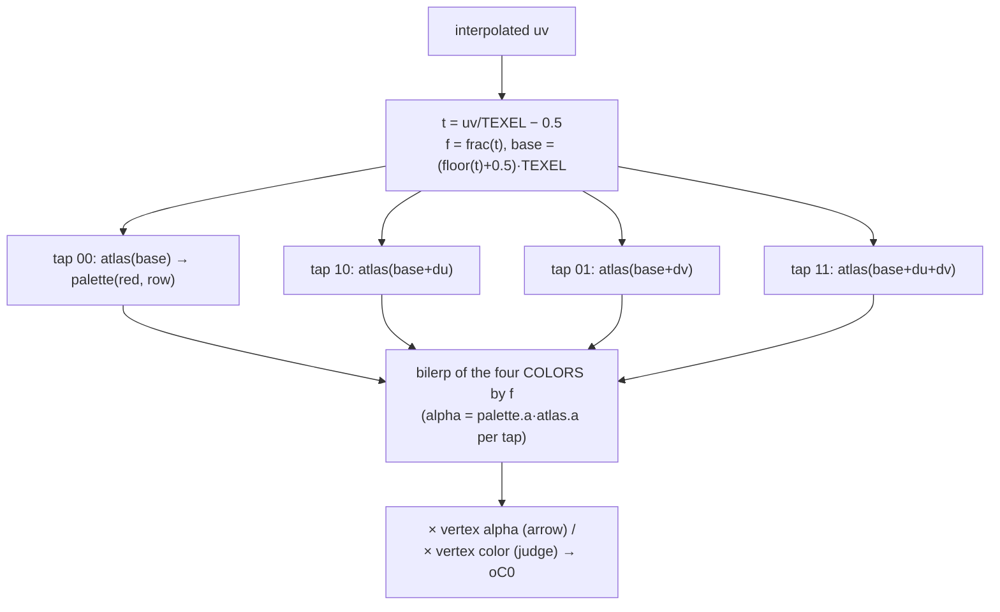

# Detailed Design — Shader Fixes (Index-Aware Bilinear Arrow/Judge Shaders)

Project: `.agents/planning/20260719-shader-injection/`
Date: 2026-07-19 · Status: draft for review

---

## 1. Overview

DDR World's gameplay lane art (arrows, receptors, freeze bodies, hit flashes,
shock effects) is **palette-indexed**: the pixel shaders read the atlas RED
channel as an index into a per-frame-animated palette texture. Point sampling
on the atlas is therefore load-bearing — hardware LINEAR filtering blends
palette *indices* and produces severe banding (cabinet-proven). Consequently,
when the playfield-styling / overlay-element-styling mods scale these
elements, the art shows nearest-texel staircase aliasing that **cannot** be
fixed with sampler state.

This feature replaces the two palette-family pixel shaders —
`gs_screencommand_arrow` and `gs_screencommand_judge` — with **index-aware
bilinear** variants: take 4 atlas taps at the texel centers surrounding the
sample point, palette-lookup **each tap**, and bilinearly blend the four
resulting **colors**. Color-space blending eliminates both the staircase and
the banding failure mode.

Delivery uses the already-cabinet-proven LayeredFS arc-overlay path — the
replacement `.gsp` files are pure `data_mods/` content. **No DLL code, no new
hooks, no config surface.**

Feasibility, container format, load path, and toolchain were all verified in
advance; see `docs/shader_replacement_research.md` and
`research/judge-and-toolchain.md`.

---

## 2. Detailed Requirements (consolidated from idea-honing.md)

1. **Scope (Q1):** Replace `gs_screencommand_arrow` and
   `gs_screencommand_judge`. No DLL-side shader framework this project.
2. **Texel size (Q2):** Hardcoded shader constants `du = 1/768`,
   `dv = 1/384`. Verified safe for every sheet either shader binds (§5.3).
3. **Toolchain (Q3):** HLSL source committed in-repo; built at-will via
   Docker + `vkd3d-compiler` (Fedora 42 package, native arm64); a Python
   script wraps bytecode into the GSPW container; final `.gsp` artifacts are
   **also committed** so cabinet deploys never require Docker.
4. **Verification (Q4):** Math collapse proof as the correctness gate plus a
   single cabinet visual spot-check at 100 %. Screenshot pixel-diff held in
   reserve.
5. **Packaging (Q5):** Own always-on mod folder `data_mods/shader_fixes/`.
   Escape hatch: delete the folder or `layeredfs.blocklist`.
6. **Filter (Q6):** Plain 4-tap bilinear, alpha blended per-tap. No
   sharpening tunable.
7. **Acceptance (Q7):**
   - 100 % scale: visually indistinguishable from stock.
   - Scaled (50 %/150 %): smooth edges, **no palette banding**.
   - No observable frame-rate regression on cabinet.
   - `scripts/build_shaders.sh` reproduces the committed `.gsp` bit-for-bit.
   - Docs updated (README, research doc, AGENTS.md).

---

## 3. Architecture Overview

```mermaid
flowchart LR
    subgraph repo [Repo build time]
        HLSL[shaders/src/*.hlsl] -->|docker: vkd3d-compiler 1.14<br/>hlsl → d3dbc ps_3_0 / vs_3_0| BC[bytecode blobs]
        BC -->|scripts/gsp_pack.py<br/>GSPW wrap + FNV-1 name hash| GSP[data_mods/shader_fixes/arc/shader_arc/<br/>data/shader/*.gsp  — committed]
    end
    subgraph cabinet [Cabinet runtime — existing infrastructure only]
        GSP -->|wholesale data_mods copy| MODS[data_mods/shader_fixes/]
        MODS -->|LayeredFS arc overlay<br/>handle_arc repack + cache| ARC[cached shader.arc]
        ARC -->|FileManager loader| GSPW[GSPW parser FUN_18025ee30]
        GSPW -->|memcpy, unvalidated| D3D[CreateVertexShader /<br/>CreatePixelShader]
        D3D --> DRAW[arrow / judge draws<br/>all play, styled and stock]
    end
```



Runtime data flow of one drawn pixel (replacement PS):



---

## 4. Components and Interfaces

### 4.1 `shaders/src/gs_screencommand_arrow.hlsl`

One file containing both entry points (`vs_main`, `ps_main`).

- **VS**: functionally identical re-implementation of the stock VS (position
  passthrough, `texcoord' = uv·c32.xy + c32.zw`, `color × c22`). Explicit
  register binds are **contractual** (the engine sets constants by register,
  not by name): `SamplerParameters : register(c32)`,
  `ScreenCommandBaseColor : register(c22)`. Input/output semantics identical
  to stock (`POSITION/TEXCOORD0/COLOR0`).
- **PS**: the index-aware bilinear filter:

```hlsl
sampler2D MaterialAtlas   : register(s0);
sampler2D MaterialPalette : register(s1);

static const float2 TEXEL = float2(1.0 / 768.0, 1.0 / 384.0);
// UV_BIAS = 0: VS-projected geometry under D3D9's pixel-center convention
// samples texel CENTERS at 1:1 (§6.2) → frac==0 → collapse to stock texel.
static const float2 UV_BIAS = float2(0.0, 0.0);

float4 tap(float2 uv, float row)
{
    float4 tex = tex2D(MaterialAtlas, uv);
    float4 c   = tex2D(MaterialPalette, float2(tex.r, row));
    c.a *= tex.a;                       // per-tap: palette.a × atlas.a
    return c;
}

float4 ps_main(PSIn i) : COLOR
{
    float2 t    = i.uv / TEXEL - 0.5 + UV_BIAS;
    float2 f    = frac(t);
    float2 base = (floor(t) + 0.5) * TEXEL;

    float4 c00 = tap(base,                      i.col.x);
    float4 c10 = tap(base + float2(TEXEL.x, 0), i.col.x);
    float4 c01 = tap(base + float2(0, TEXEL.y), i.col.x);
    float4 c11 = tap(base + TEXEL,              i.col.x);

    float4 c = lerp(lerp(c00, c10, f.x), lerp(c01, c11, f.x), f.y);
    c.a *= i.col.a;                     // vertex alpha once (stock contract)
    return c;
}
```

Stock output contract preserved: `rgb = palette.rgb` (vertex color rgb does
NOT multiply in the arrow PS), `a = palette.a × atlas.a × vColor.a`.

### 4.2 `shaders/src/gs_screencommand_judge.hlsl`

Same VS. PS differs from the arrow variant in exactly two stock-contract
ways (from the bytecode decode, `research/judge-and-toolchain.md` §1):

- Palette row V is the compile-time constant `0.15625` (not `vColor.x`).
- The blended palette color is multiplied by the **full vertex color**
  (`c.rgba × vColor.rgba`), not just alpha.

### 4.3 `scripts/gsp_pack.py`

Compiler-agnostic GSPW packer (works with vkd3d or fxc output):

```
gsp_pack.py --name gs_screencommand_arrow --vs vs.d3dbc --ps ps.d3dbc -o out.gsp
```

- Emits the stock header shape: magic `GSPW`, **FNV-1(name)** hash, table
  pointers 0x20/0x28/0x30, counts (1,1,1), zeroed program entry
  (vs_idx=0, ps_idx=0), VS/PS `{offset,size}` entries, blobs 16-byte aligned.
- **Self-verifies** before writing: re-parses its own output against the
  container rules validated across all 35 stock files; asserts VS blob starts
  `0xFFFE03xx` and PS `0xFFFF03xx`; asserts the name hash matches stock's
  (guards against typo'd shader names silently registering a new hash).

### 4.4 `scripts/build_shaders.sh`

- Builds (once, cached) a local Docker image `ddr-shader-build` from
  `fedora:42` + `vkd3d-compiler` + `python3`; **asserts
  `vkd3d-compiler --version` == the pinned version (1.14)** and fails loudly
  on drift (reproducibility guard).
- For each shader in the manifest (a table in the script:
  `name → hlsl file`):
  1. `vkd3d-compiler -x hlsl -b d3dbc -e vs_main --profile vs_3_0 …`
  2. `vkd3d-compiler -x hlsl -b d3dbc -e ps_main --profile ps_3_0 …`
  3. `gsp_pack.py` → `data_mods/shader_fixes/arc/shader_arc/data/shader/<name>.gsp`
- Prints sha256 of each output for the reproducibility check.
- Header comment documents the **Windows fxc golden path** (§8.1 note): the
  packer accepts fxc output unchanged
  (`fxc /T ps_3_0 /E ps_main /Fo ps.d3dbc file.hlsl`).

### 4.5 Mod folder (committed)

```
data_mods/shader_fixes/arc/shader_arc/data/shader/
├── gs_screencommand_arrow.gsp
└── gs_screencommand_judge.gsp
```

Entry paths inside `shader_arc/` must match the stock arc entry names
**exactly** (`data/shader/<name>.gsp`) — the overlay replaces by exact-name
BTreeMap key.

---

## 5. Data Models

### 5.1 GSPW container (authoritative record: `docs/shader_replacement_research.md` §2)

| off | size | field |
|-----|------|-------|
| 0x00 | 4 | magic `GSPW` |
| 0x04 | 4 | FNV-1(shader name) — lookup identity; MUST equal stock |
| 0x08 | 4 | 0 |
| 0x0C/0x10/0x14 | 4×3 | ptrs → program/VS/PS tables (0x20/0x28/0x30) |
| 0x18 | 1×3+1 | counts (1,1,1), pad |
| 0x20 | 8 | program entry (zeroed → vs 0, ps 0) |
| 0x28/0x30 | 8×2 | VS/PS `{u32 offset, u32 size}` |
| 0x40… | | blobs, 16-byte aligned |

### 5.2 Shader binding contract (register convention — engine does not read CTAB)

| Resource | Register | Set by |
|---|---|---|
| Atlas (`Material[0]`) | `s0` | gs texture-bind commands |
| Palette (`Material[1]`) | `s1` | gs texture-bind commands (256×16, point, rewritten per frame) |
| `SamplerParameters` | `c32` (VS) | engine, per draw |
| `ScreenCommandBaseColor` | `c22` (VS) | engine, per draw |
| VS inputs | `POSITION, TEXCOORD0, COLOR0` | vertex declaration |
| PS inputs | `TEXCOORD0` (uv), `COLOR0` (palette row in `.x` [arrow], tint [judge]; alpha in `.w`) | VS outputs |

### 5.3 Bound textures and the texel-constant safety argument

| Sheet | Dims | Sampler | Notes |
|---|---|---|---|
| `arrow%02d` (arrows/receptors/freeze; ALSO the judge renderer's sheet) | 768×192 | POINT/wrap | the aliasing that motivates this feature |
| `shock_effect00_{l,m,s}` (electric crackle) | 768×384 | LINEAR/clamp | exact match for TEXEL |
| `lane_notice00` | 192×384 | LINEAR/clamp | width 4× finer than assumed |

With `TEXEL=(1/768, 1/384)`: at 1:1, sample points sit at real-texel
positions; for exact-size axes the sub-texel fraction is 0 (4 taps collapse
to the stock tap); for finer-than-real axes both taps land inside the *same*
real texel (768 = 4·192, 384 = 2·192) → identical output either way. Float
slop is ≤ ~1 ulp on the blend weight → far below 8-bit quantization →
indistinguishable output. When scaled ≠ 1:1, the smaller sheets simply get a
narrower blend window (crisper, never banded). LINEAR-sampled sheets keep
their existing index-blend tolerance; taps at assumed-texel centers make the
shock sheet effectively index-aware too.

---

## 6. Error Handling & Risk

### 6.1 Build-time (fail loudly, before anything reaches the cabinet)
- `build_shaders.sh` asserts Docker availability, image build success, and
  the pinned vkd3d version.
- `gsp_pack.py` self-verifies output structure + blob version tokens + name
  hash (see §4.3); any mismatch aborts without writing.
- Committed-artifact drift: rebuilding and comparing sha256 is part of the
  acceptance run; version-drift failures instruct the maintainer to either
  reinstall the pinned image or intentionally bless new hashes.

### 6.2 Known risk 1 — 1:1 uv alignment: RESOLVED (live CE read + geometry, 2026-07-19)
Read from a frozen attract-mode gameplay frame's gs command buffers: `c32`
(`SamplerParameters`) = **(1, 1, 0, 0)** — identity, no half-texel fixup —
and the arrow-shader quads are integer-positioned (e.g. receptors pos
88..184 px) with edge-aligned uv rects (uv 0..0.125 = 0..96 texels over
96 px). That uv rect is the quad's EXTENT; the per-pixel sample points sit at
D3D9 pixel centers (k+0.5), which interpolate to texel-coordinate k+0.5 — a
texel **center**, not an edge. So the textbook `uv/TEXEL − 0.5` already
yields `frac==0` at 1:1 and `UV_BIAS = 0`. Confirmed two independent ways:
(1) stock POINT sampling is stable/crisp at 1:1 — edge-aligned samples would
seam-flicker under `floor()`; (2) the LINEAR-sampled shock/lane sheets are
crisp at 1:1 — edge samples would render permanently 50/50-blurred. The
100 % cabinet spot-check is the final confirmation; `UV_BIAS` remains the
one-line knob if any target ever samples off-center.

### 6.3 Known risk 2 — atlas cell-edge bleed at scale ≠ 1:1
At cell borders the outer taps can read the neighboring atlas cell (or wrap,
on the wrap-mode arrow sheet) — the same ±half-texel neighborhood hardware
LINEAR would read. The prior LINEAR experiment's recorded artifact was
palette banding (which this design eliminates), not edge fringes, and arrow
art carries visual margins; freeze-body tiling seams are the place to look.
**Detection:** 50 % scale cabinet check (seams/fringes at cell edges).
**Contingency:** documented follow-up (cell-rect-aware clamping needs
Option B-style VS forwarding; out of scope unless observed).

### 6.4 Runtime
No new runtime failure modes: LayeredFS serves the overlay or, absent the
folder, the stock arc (cache invalidation is automatic). A malformed `.gsp`
cannot occur past the packer's self-verify; worst case on unknown-future
game updates is the stock-shader behavior changing (see §6.5).

### 6.5 Game-update drift
The `.gsp` set was byte-identical across builds 20260324→20260616. If a
future update changes the stock shaders, the overlay silently keeps serving
ours (name-hash identity). Mitigation: the research doc records stock blob
hashes; a future update pass should re-diff `shader.arc` (one `unpack_arc.py`
+ `shasum` away).

### 6.6 Rollback
Delete `data_mods/shader_fixes/` (or blocklist it) → next boot repacks the
arc without overlays → stock shaders. No DLL interaction.

---

## 7. Testing Strategy

1. **Container validation (local, automated):** `gsp_pack.py` self-verify +
   the 35-file-validated parser rules; name-hash equality with stock.
2. **Bytecode validation (local):** disassemble our compiled blobs with
   `vkd3d-compiler -x d3dbc -b d3d-asm`; review the token stream against the
   design (this same tool independently reproduced the stock decode, so it
   is a trusted oracle).
3. **Math gate (Q4):** the §5.3 collapse argument is the correctness proof
   for 100 % scale — reviewed as part of this design.
4. **Cabinet pass (single deploy expected):**
   - 100 %: arrows/receptors/freeze/shock/judge text/hit flash visually
     identical to stock (risk 6.2 check).
   - 50 % and 150 % (playfield-styling) + overlay scale (judge family):
     smooth edges, no banding, no cell-edge fringes (risk 6.3 check),
     freeze-body seams clean.
   - Perf sanity: no visible stutter on a dense chart (risk §8.1 note).
5. **Reproducibility:** clean rebuild → sha256 match against committed
   `.gsp` (acceptance #4).

---

## 8. Appendices

### 8.1 Technology choices

**vkd3d-compiler (Docker, Fedora 42, v1.14) over fxc/wine:**
chosen for native arm64 Docker operation (no x86 emulation), no Windows
binaries, full HLSL→d3dbc(SM3) support, and a built-in d3dbc disassembler
used as a verification oracle. Validated end-to-end in research.

> **⚠ Codegen note / perf fallback (recorded by maintainer request):**
> vkd3d's d3dbc output is **unoptimized** — roughly 5–10× fxc's instruction
> count, dominated by redundant `mov`s. For this workload (a few thousand
> lane-art pixels per frame worst case) this is far below noise even on the
> low-end ~2015 integrated GPUs common in cabinets. **If a future shader (or
> cabinet observation) ever makes PS cost matter:** compile the identical
> HLSL with Microsoft fxc on any Windows machine —
> `fxc /T ps_3_0 /E ps_main /Fo ps.d3dbc gs_screencommand_arrow.hlsl` — and
> feed the output straight to `gsp_pack.py`; the packer is compiler-agnostic
> by design. This is the "golden path" build: optimal bytecode, Windows-only.

**Committed artifacts + at-will rebuild** (vs build-on-deploy): cabinet
deploys are wholesale `data_mods/` copies and must not depend on Docker.

### 8.2 Research findings summary

- Feasibility cabinet-proven 2026-07-19 (one-byte PoC): LayeredFS overlay →
  GSPW load → modified bytecode on GPU. No hooks, no DLL changes.
- GSPW container solved (35/35 files); engine memcpy's blobs unvalidated to
  CreateShader; identity = FNV-1 name hash; engine ignores CTAB.
- Boot order safe (hooks ~1 s before `shader.arc` opens).
- Stock arrow + judge shaders fully decoded; judge sheet = the arrow sheet
  (same FileManager entry, 768×192); all bound sheets' dims confirmed from
  install data — `TEXEL=(1/768,1/384)` safe for all (common-multiple
  collapse).
- Records: `docs/shader_replacement_research.md`,
  `research/feasibility.md`, `research/judge-and-toolchain.md`.

### 8.3 Alternative approaches considered

| Alternative | Why not |
|---|---|
| Sampler-state LINEAR (+UV inset) | Disproven on cabinet — blends palette indices → banding. Fully reverted; see `docs/playfield_styling_research.md` §7. |
| Hi-res replacement art | Content-scale effort per arrow skin; doesn't fix other skins; shader fix covers all skins at once. |
| Option B texel size (exact per-draw via c32 forwarding) | Needs c32 semantics confirmation + VS interpolator change; Option A proved fully safe for every bound sheet, so B is deferred until a non-{768,192}×{192,384} sheet appears. |
| Splicing the stock VS blob into our .gsp | Avoids re-compiling the VS but embeds stock-derived bytes in the repo and adds a build-time dependency on game data; re-compiling our own functionally-identical VS keeps the artifact 100 % self-authored. |
| DLL-side shader framework (toggle/validation) | Deferred (Q1) — zero-code delivery already works; revisit when more shader mods exist. |
