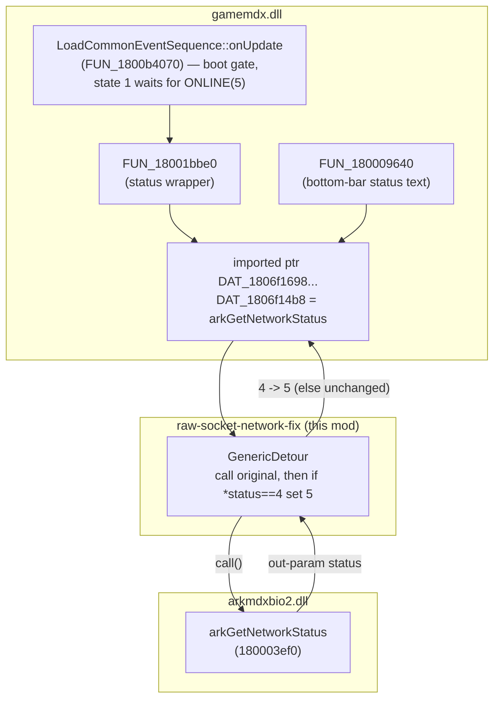
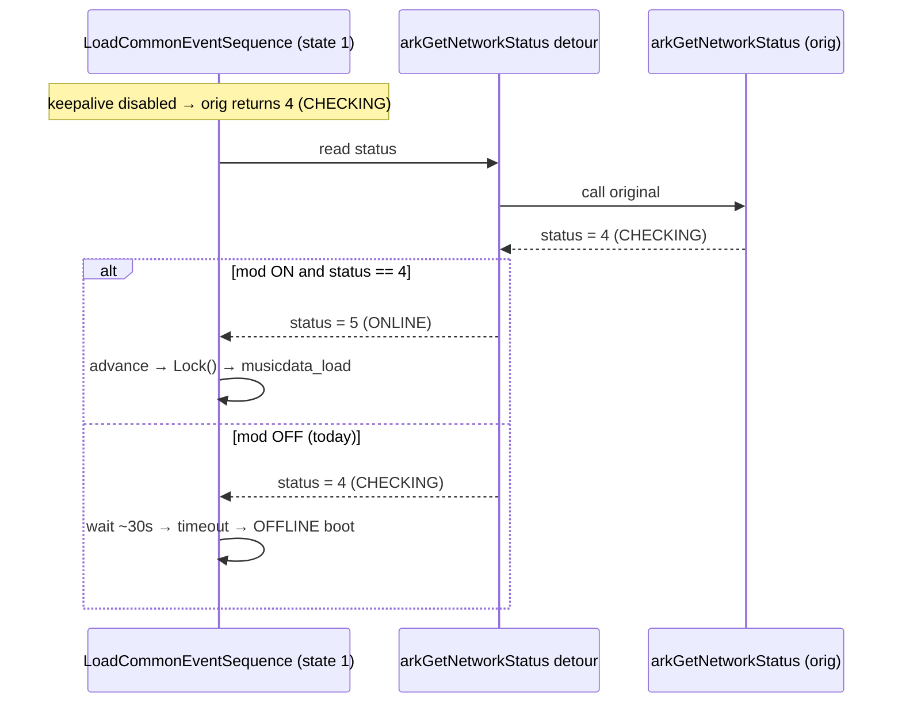

# Detailed Design — `raw-socket-network-fix` mod

## Overview

`raw-socket-network-fix` is a config-gated mod that lets DDR World boot into **ONLINE**
mode in environments where the AVS **keepalive / traceroute raw-ICMP sockets cannot be
created** (notably CrossOver/Wine on macOS). It installs a single `retour::GenericDetour`
on the `arkmdxbio2.dll` export **`arkGetNetworkStatus`** and rewrites its reported status
from **CHECKING (4) → ONLINE (5)**, leaving every other status value untouched. This
unblocks the boot network-check state machine (`LoadCommonEventSequence`) that otherwise
waits ~30 s and falls back to offline, and simultaneously corrects the on-screen bottom-bar
`CHECKING`/`ONLINE` text (both read the same value through this one export).

The mod is **default ON** (a normal `mods` entry — omitted key → enabled, like every other
mod; disable via `"raw-socket-network-fix": false`), **fail-open** (self-disables cleanly if
the export or detour can't be installed), and **surgical** (only 4→5; server-driven
MAINTENANCE/OFFLINE/LOCAL are preserved).

> Full originating investigation, evidence, and the confirmed gate mechanism are in
> `../rough-idea.md`. This document is standalone but that file is the RE record.

## Detailed Requirements

Consolidated from `../idea-honing.md` (Q1–Q5):

- **R1 — Activation:** A standard `mods` map entry, id **`raw-socket-network-fix`**,
  **default ON** (omitted key → enabled, matching every other mod; disable by setting
  `"raw-socket-network-fix": false` in config or via the mod menu). No auto-detect of the
  keepalive failure. When enabled it unconditionally applies the override.
- **R2 — Override scope:** Promote **CHECKING(4) → ONLINE(5)** only. Every other status
  value (LOCAL 0, OFFLINE 1, MAINTENANCE 2, blank 3, ONLINE 5, NOT AVAILABLE 7) passes
  through unchanged, so a genuine server-driven MAINTENANCE or a real offline state is
  still honored.
- **R3 — Hook point:** A single `GenericDetour` on `arkmdxbio2!arkGetNetworkStatus`
  (address via `GetProcAddress`, the same cross-DLL pattern `input_manager` uses for
  `arkMDX*`). The detour calls the original, then rewrites the status out-param. This one
  point fixes both the boot gate (`gamemdx FUN_18001bbe0` → `LoadCommonEventSequence`) and
  the status-bar text (`gamemdx FUN_180009640`), which both call through it.
- **R4 — Graceful degradation:** Fail-open. If `arkmdxbio2` / the export can't be resolved,
  or the detour fails to install, log a warning and self-disable (`is_active() == false`) —
  no fabricated state, no crash, game behaves exactly as today.
- **R5 — Success criteria / non-goals:** See Testing Strategy. Non-goals: making
  keepalive/traceroute genuinely work (raw ICMP under CrossOver is out of scope); forcing
  any state beyond the CHECKING→ONLINE gate (participation, matching, etc.).

## Architecture Overview

### Where the mod sits in the status-read path



### Boot gate before vs after



## Components and Interfaces

### New file: `src/mods/raw_socket_network_fix.rs`

A single-file mod modeled directly on `src/mods/timing_offsets.rs` (same detour/
self-disable/config-gate idioms). Structure:

- **Function type**
  ```rust
  // undefined8 arkGetNetworkStatus(int* status, undefined1* p2, undefined4* p3)
  // status written to *param_1; p2/p3 are secondary out-params (pass through).
  type GetNetworkStatusFn =
      unsafe extern "C" fn(*mut i32, *mut u8, *mut u32) -> u64;
  ```
- **State**
  ```rust
  static mut STATUS_HOOK: Option<GenericDetour<GetNetworkStatusFn>> = None;
  static ONE_SHOT_LOGGED: AtomicBool = AtomicBool::new(false); // log first 4→5 promotion once
  const CHECKING: i32 = 4;
  const ONLINE: i32 = 5;
  ```
- **Detour body** (panic-isolated, mirrors `input_manager`/`timing_offsets`):
  ```rust
  unsafe extern "C" fn status_detour(p1: *mut i32, p2: *mut u8, p3: *mut u32) -> u64 {
      let ret = if let Some(ref h) = *std::ptr::addr_of!(STATUS_HOOK) {
          h.call(p1, p2, p3)
      } else { 0 };
      let _ = std::panic::catch_unwind(|| {
          if !p1.is_null() && *p1 == CHECKING {
              *p1 = ONLINE;
              if !ONE_SHOT_LOGGED.swap(true, Ordering::AcqRel) {
                  log_info!("RawSocketNetworkFix: promoted network status CHECKING(4) -> ONLINE(5)");
              }
          }
      });
      ret
  }
  ```
  Order note: call the original **first** (it fills `*p1`), then inspect/rewrite — the same
  "call then adjust out-param" order the input-manager suppression detours use.
- **Export resolution** (in `init`, best-effort — mirrors `input_manager::resolve_exports`):
  ```rust
  let m = resolve_ark_module()?;                 // core::module_resolver
  let cname = CString::new("arkGetNetworkStatus").ok()?;
  let addr = GetProcAddress(m.handle, PCSTR(cname.as_ptr() as *const u8))?;
  self.target = Some(std::mem::transmute::<_, GetNetworkStatusFn>(addr));
  ```
- **Install** via `core::hooks::install_enabled(addr_of_mut!(STATUS_HOOK), target, status_detour)`.
- **`Mod` trait impl:**
  - `id() = "raw-socket-network-fix"`, `name() = "Raw Socket Network Fix"`,
    `description() = "Force ONLINE when AVS keepalive/raw-ICMP sockets are unavailable (e.g. CrossOver)"`.
  - `required_signatures() = &[]` (best-effort resolution in `init`, like `timing_offsets`).
  - `init(ctx)`: resolve the export address; if absent, log warn and remember `None` (still
    returns `true` so registration succeeds — self-disable happens at `enable`).
  - `enable()`: if target `None` → log warn, return (self-disabled). Else `install_enabled`;
    on install error log warn and return.
  - `disable()`: `take()` + `disable()` the detour (same teardown shape/race note as
    `timing_offsets::remove_hook`); reset `ONE_SHOT_LOGGED`.
  - `is_active()`: `unsafe { (*addr_of!(STATUS_HOOK)).is_some() }` — so a self-disabled mod
    shows OFF in the registry/mod-menu.

### Registration: `src/lib.rs`

Add to the `mods_to_register` vec (order not load-bearing for this mod):
```rust
Box::new(mods::raw_socket_network_fix::RawSocketNetworkFixMod::new()),
```
and `pub mod raw_socket_network_fix;` in `src/mods/mod.rs`.

### Config default: no shared-code change

The mod is **default ON** by relying on the existing `enable_with_config` behavior
(`config.get(&id).copied().unwrap_or(true)` — an absent key enables the mod, like every
other mod). Disable is via `"raw-socket-network-fix": false` in the `mods` map or the
mod-menu toggle. **No change to `src/mods/mod_trait.rs`** is required; registration in
`lib.rs` + `mods/mod.rs` is the only wiring outside the new mod file.

> An earlier draft proposed a `DEFAULT_OFF_MODS` list in `mod_trait.rs` to make this mod
> default OFF. That was dropped in design review (see `../idea-honing.md` Q3.5): default-ON
> keeps the diff to the new file + registration, and promote-4→5-only is benign on a healthy
> box (by the time the boot gate polls, the real status is already ONLINE, so the override
> only shortcuts the transient CHECKING).

## Data Models

- **Network status enum** (returned by `arkGetNetworkStatus`, consumed as `i32`):
  `0 = LOCAL MODE`, `1 = OFFLINE MODE`, `2 = MAINTENANCE`, `3 = (blank)`,
  `4 = CHECKING`, `5 = ONLINE`, `7 = NOT AVAILABLE`. The mod maps `4 → 5`; all others
  identity. (Enum semantics decoded from `gamemdx FUN_180009640`.)
- **`arkGetNetworkStatus` ABI:** `unsafe extern "C" fn(*mut i32, *mut u8, *mut u32) -> u64`
  (Microsoft x64). Only the first out-param (status) is read/modified; the other two are
  forwarded untouched. Return value is passed through (the original always returns 0).
- **Config:** no new config schema. Presence/absence of `"raw-socket-network-fix"` in the
  existing `mods` map controls it (default ON when omitted, via the existing
  `enable_with_config` behavior — set `false` to disable). Runtime toggle via the mod menu
  works like any other registry mod.

## Error Handling

- **Export unresolved / module missing** (`resolve_ark_module` or `GetProcAddress` fails):
  `init` logs a warning and stores `None`; `enable` self-disables (returns without
  installing). `is_active()` → false. Game unaffected. (R4)
- **Detour install failure** (`install_enabled` returns `Err`): logged; `enable` returns;
  `is_active()` → false.
- **Detour body:** wrapped in `catch_unwind`; a null status pointer is guarded
  (`!p1.is_null()`), so a malformed call can never panic across the FFI boundary or
  deref null. Original is always called (fail-safe passthrough) even if our adjust logic
  is skipped.
- **Disable race:** `disable()` `take()`+`disable()`s the detour on the operator thread
  while the game thread may be mid-call; identical to `timing_offsets::remove_hook` — the
  window is tiny (status is read at a handful of points, not per-frame at boot), and
  `call_original`-style access tolerates a `None`. Accepted, documented, not engineered
  around (matches pack precedent).

## Testing Strategy

No unit tests (pack convention); validation is live cabinet deploy + log/observation.

1. **CrossOver, mod ON (primary):** boot clears `CHECKING` without the ~30 s stall; log
   shows `ArkNetwork.Lock() start ... LoadCommonEventSequence::onUpdate` +
   `EssCallAndWaitBase3MusicDataLoad::request()`; `playdata_3.musicdata_load` (then
   playerdata/rivaldata) requests reach the server; bottom bar reads `ONLINE`;
   `RawSocketNetworkFix: promoted ... 4 -> 5` appears once. Card-in / profile save work.
2. **CrossOver, mod OFF (`"raw-socket-network-fix": false`) or unresolved:** unchanged
   (stuck CHECKING → offline). Confirms fail-open.
3. **Normal Windows box:** with mod OFF, no behavioral change (regression guard). With mod
   ON (the default), boot still reaches ONLINE — 4→5 only shortcuts the transient checking
   window; MAINTENANCE(2)/OFFLINE(1) untouched. (Residual note: if a healthy box is
   genuinely mid-handshake with the server slow, forcing 4→5 could let the boot gate
   advance early; in practice the handshake completes long before the gate polls, per the
   working-boot log timeline.)
4. **Readiness gates (pre-deploy):** `cargo check --target x86_64-pc-windows-msvc` clean →
   `cargo fmt` (whole crate) → `./build.sh` clean.

Known characteristic (documented, not a failure): the status is acted upon during
`LoadCommonEventSequence` at boot, so toggling the mod mid-session doesn't retroactively
reconnect — it takes effect on the **next boot**.

## Appendices

### A. Technology Choices

- **`retour::GenericDetour` on the arkmdxbio2 export** — chosen over (a) swapping the
  gamemdx imported pointer `DAT_1806f14b8` (needs locating a data global via signature;
  less common here) and (b) detouring only `gamemdx FUN_18001bbe0` (fixes boot but leaves
  the status bar showing CHECKING). The export detour is one point that fixes both, and it
  reuses the established cross-DLL `GetProcAddress` + `install_enabled` pattern
  (`input_manager`, `timing_offsets`), so no new infrastructure.
- **Promote-4→5 vs force-5** — promote-only keeps the blast radius minimal and preserves
  MAINTENANCE/offline semantics (R2).
- **Config-gated, default-ON** — a normal `mods` entry following the pack's omitted→enabled
  convention (disable via `false` / mod menu); no shared-registry change. Default-OFF via a
  `DEFAULT_OFF_MODS` list was considered and dropped (Q3.5) to keep the diff to the new file
  + registration. Promote-4→5-only is benign on a healthy box.

### B. Research Findings (condensed; full record in `../rough-idea.md`)

- Boot progression is gated by `LoadCommonEventSequence::onUpdate` (`gamemdx FUN_1800b4070`)
  state 1, which loops while `arkGetNetworkStatus()==4 (CHECKING)` and only advances to
  `Lock()`+`musicdata_load` on `==5 (ONLINE)`, else times out (~30 s) → offline. Proven in
  binary + both logs.
- `arkGetNetworkStatus` (`arkmdxbio2 180003ef0`) → ONLINE requires base `DAT_18014ae2c==5`
  (from `ess_ea3_get_status` → AVS `ea3_get_status()==3`) and secondary gate
  `DAT_180bd4158==3`; `arkSetNetworkIsBlack`(`DAT_180c436f8==1`) forces CHECKING. The
  bottom-bar text (`FUN_180009640`) reads the same value.
- Differentiator between working/non-working boots: the eamuse HTTP handshake is
  byte-identical and fully successful in both; the only substantive client-side failures
  unique to CrossOver are raw-socket ones — `keepalive: failed to create raw socket
  0x8008000d` → `KEEPALIVE IS DISABLE` and `traceroute: avs_net_socket 8008000d` →
  `TRACEROUTE IS DISABLE`. Hooking above AVS at `arkGetNetworkStatus` sidesteps the whole
  raw-socket dependency.
- Enable timing: the network check runs ~90 s into boot (well after DLL init), so enabling
  during normal mod init lands the detour comfortably before the gate.
- Infra confirmed by reading source: `core::hooks::install_enabled` +
  `retour::GenericDetour` work on any address incl. cross-DLL; `core::module_resolver::
  resolve_ark_module()` + `GetProcAddress(module.handle, name)` resolves arkmdxbio2 exports
  (  `input_manager::resolve_exports`); `timing_offsets.rs` is the single-file detour/
  self-disable template; `enable_with_config` defaults omitted mods ON — which is exactly
  the default-ON behavior R1 now wants (no `DEFAULT_OFF_MODS` needed).

### C. Alternative Approaches Considered (and rejected)

- **Make raw ICMP sockets work under CrossOver** (hook `avs_net_socket` to fall back to a
  DGRAM-ICMP socket, or run the bottle as root). Out of scope / high-risk / environment-
  invasive; the mod's goal is boot→online, which the status override achieves directly.
- **Auto-detect the keepalive-disabled condition and only then force ONLINE.** Safer in
  theory but needs a reliable in-process signal that keepalive was disabled (more RE into
  encrypted/stripped libavs). Rejected in favor of the explicit config toggle (Q1).
- **Force the base global `arkmdxbio2!DAT_18014ae2c = 5`.** Fragile — fights the network
  status-update thread and the `DAT_180bd4158` downgrade path; rejected.
- **Also hook `arkIsNetworkFree`.** Unnecessary: the non-working boot entered the state-1
  status wait and timed out, proving `arkIsNetworkFree` returned truthy in both boots — the
  status value is the sole divergence.
