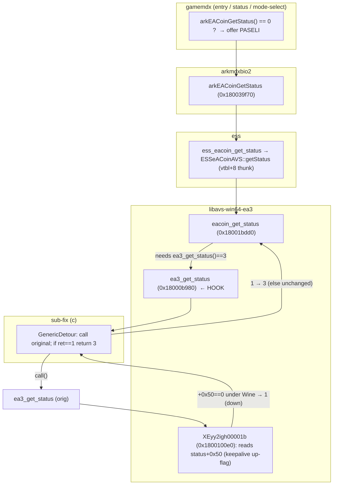

# Detailed Design — EACoin/PASELI online cascade (Non-Native OS Support sub-fix (c))

## Overview

Extend the existing **Non-Native OS Support** mod (`src/mods/non_native_os_support.rs`,
id `non-native-operating-system-support`) with a third independent sub-fix **(c)** that
lets **PASELI (EACoin)** work under CrossOver/Wine. It installs one
`retour::GenericDetour` on the libavs eamuse export **`ea3_get_status`** and promotes its
reported state **network-down (1) → online (3)**, leaving every other state unchanged.

This makes the AVS eamuse online state *appear online* at the point the whole eamuse layer
reads it, so the state cascades: `eacoin_get_status()` → available → the game offers
PASELI → per-card `eacoin.checkin` / `eacoin.consume` (HTTP xrpc, already working under
Wine) fire normally.

> Full RE record, evidence, and the confirmed mechanism are in `../rough-idea.md`.

## Requirements

- **R1 — Activation.** A sub-fix of the existing mod (no new `mods` id). Governed by the
  mod's existing config gate (`"non-native-operating-system-support"`, default ON via the
  pack's omitted-key-enables convention; disable via config or the mod menu). Installs
  independently of sub-fixes (a)/(b).
- **R2 — Override scope.** Promote **`ea3_get_status` return 1 → 3** only. Every other
  value passes through unchanged: `0` (booting), `2` (boot code not ok), `3` (online),
  `4` (maintenance — server-driven, must be preserved), `5` (runtime error). The two
  optional out-params are forwarded to the original untouched; only the **return value** is
  adjusted.
- **R3 — Hook point.** One `GenericDetour` on libavs-ea3 `ea3_get_status`
  (`XEyy2igh00000b`, 0x18000b980 on the 20260721 build), resolved by **AOB scan** of the
  `libavs-win64-ea3.dll` module (obfuscated export names / unstable ordinals rule out
  `GetProcAddress`). The detour calls the original, then remaps the return.
- **R4 — Graceful degradation.** Fail-open. If the libavs-ea3 module or the AOB can't be
  resolved, or the detour fails to install, log a warning and self-disable — no fabricated
  state, no crash, PASELI behaves exactly as today. Must never take sub-fix (a) or (b) down
  with it.
- **R5 — Non-goals.** Making keepalive / raw ICMP genuinely work (out of scope); forcing
  any state other than the network-down→online promotion; touching the per-card
  checkin/consume path (it already works over HTTP once the gate is satisfied).

## Architecture

### Where the hook sits in the PASELI gate



### Cascade (why one hook is enough)

1. `ea3_get_status()` now returns **3 (online)** instead of 1 (down).
2. `eacoin_get_status()` reaches its available branch → returns 0. (Its other guards are
   already satisfied under CrossOver: `DAT_180095868` eacoin-enabled from server config;
   `DAT_1800958f8` readiness armed locally by the eacoin worker thread once the module
   boots — **not** network-gated.)
3. gamemdx sees `arkEACoinGetStatus() == 0` everywhere → **offers PASELI**.
4. On card-in / payment the game queues `eacoin.checkin` / `eacoin.consume`; libavs's
   `eacoin_thread` sends them as **HTTP xrpc**, which works under Wine.

## Components

### `src/core/module_resolver.rs` — new resolver

```rust
const LIBAVS_EA3_DLL_NAMES: &[&str] = &["libavs-win64-ea3.dll"];

pub fn resolve_libavs_ea3_module() -> Option<GameModule> {
    for name in LIBAVS_EA3_DLL_NAMES {
        if let Some(m) = resolve_module(name) { return Some(m); }
    }
    None
}
```
Mirrors `resolve_ark_module()`; reuses the private `resolve_module()`
(`GetModuleHandleA` + `GetModuleInformation`). libavs is loaded long before our init
thread runs, so this resolves at `init` time.

### `src/mods/non_native_os_support.rs` — sub-fix (c)

- **Signature (module-local AOB, not the gamemdx `SignatureStore`):**
  ```rust
  const EA3_GET_STATUS_SIG: &str =
      "48 83 EC 58 49 89 C9 0F B7 05 ?? ?? ?? ?? 85 C0 74 15 33 C0 \
       48 8D 15 ?? ?? ?? ?? 48 89 15 ?? ?? ?? ?? 48 83 C4 58 C3";
  ```
  (Three RIP disp32s wildcarded. Distinctive prologue: the runtime-error early-return that
  reads `DAT_1800934f0`; strong ≥2-byte literal runs for the AC prefilter.)
- **ABI:** `ea3_get_status` takes two optional out-params in RCX/RDX and returns the state
  in EAX:
  ```rust
  // int ea3_get_status(uint* out_detail1 /*opt*/, uint* out_detail2 /*opt*/)
  type Ea3GetStatusFn = unsafe extern "C" fn(*mut u32, *mut u32) -> u32;
  const EA3_NETWORK_DOWN: u32 = 1;
  const EA3_ONLINE: u32 = 3;
  ```
- **State:** `static mut EA3_STATUS_HOOK: Option<GenericDetour<Ea3GetStatusFn>> = None;`
  plus a one-shot log latch `EA3_STATUS_ONE_SHOT: AtomicBool` (same idioms as sub-fix (a)).
- **Detour body:** call the original (forwarding both out-params), then promote:
  ```rust
  unsafe extern "C" fn ea3_status_detour(p1: *mut u32, p2: *mut u32) -> u32 {
      let ret = if let Some(ref h) = *std::ptr::addr_of!(EA3_STATUS_HOOK) {
          h.call(p1, p2)
      } else { return 0; };            // torn down mid-call: benign "booting"
      if ret == EA3_NETWORK_DOWN {
          let _ = std::panic::catch_unwind(|| {
              if !EA3_STATUS_ONE_SHOT.swap(true, Ordering::AcqRel) {
                  log_info!("NonNativeOsSupport: promoted AVS ea3 network status \
                             DOWN(1) -> ONLINE(3) (EACoin/PASELI cascade)");
              }
          });
          return EA3_ONLINE;
      }
      ret
  }
  ```
  No pointer dereference in our code (the original fills the out-params), so the only
  unwind risk is the log path — guarded by `catch_unwind`, matching the sibling detours.
- **Struct field:** `ea3_status_target: Option<Ea3GetStatusFn>`.
- **`init`:** `resolve_libavs_ea3_module()` → `scanner::scan_pattern(base, size, SIG)` →
  `transmute` the hit to `Ea3GetStatusFn`; log resolved address or a self-disable warning.
- **`enable`:** if target `Some`, `install_hook(addr_of_mut!(EA3_STATUS_HOOK), target,
  ea3_status_detour, "ea3-status")`; count toward `installed`.
- **`disable`:** `take()` + `disable()` the detour; reset the one-shot latch (extend the
  existing `remove_hooks()`).
- **`is_active`:** union in `EA3_STATUS_HOOK.is_some()`.

No change to the mod's `required_signatures()` (`&[]`) — sub-fix (c) resolves best-effort
in `init` and self-disables independently, exactly like (a)/(b).

## Error handling

- **Module/AOB unresolved:** `init` logs a warning, stores `None`; `enable` skips (a).
  `is_active()` unaffected by (c). Game/PASELI behave as today.
- **Detour install failure:** logged by the shared `install_hook`; (c) simply not counted.
- **Detour body:** no null-deref risk (out-params only forwarded); log guarded by
  `catch_unwind`; a torn-down slot returns a benign `0` (booting) rather than fabricating
  online — the tiny disable-race window matches the documented `remove_hooks()` note.
- **Independence:** (c) shares only the `install_hook`/`remove_hooks` helpers; a failure in
  (c) never affects (a)/(b) and vice-versa.

## Testing strategy

No unit tests (pack convention); validation is live CrossOver deploy + log/observation.

1. **CrossOver, mod ON (primary):** at the entry screen PASELI shows **available** (balance
   / offered as payment) instead of hidden/NOT-AVAILABLE; the one-shot log line
   `promoted AVS ea3 network status DOWN(1) -> ONLINE(3)` appears once.
2. **CrossOver, PASELI consume (end-to-end):** card in, select PASELI, confirm a real
   consume succeeds (server balance decrements). Validates the checkin/consume cascade over
   HTTP. *If* consume fails, fall back to the deeper `XEyy2igh00001b` network-up hook (see
   rough-idea Open Questions).
3. **CrossOver, mod OFF / (c) unresolved:** unchanged (PASELI unavailable). Confirms
   fail-open and that (a)/(b) are unaffected.
4. **Real Windows box:** with mod OFF, no change. With mod ON, `ea3_get_status` already
   returns 3 online (keepalive works) so the 1→3 promotion is a no-op; genuine
   maintenance(4)/offline stays intact. (Operators on real hardware should disable the mod
   regardless.)
5. **Readiness gates (pre-deploy):** `cargo check --target x86_64-pc-windows-msvc` clean →
   `cargo fmt` (whole crate) → `./build.sh` clean.

Known characteristic: `ea3_get_status` is polled continuously, so the promotion takes
effect immediately once installed (unlike sub-fix (a), which latches at the boot
network-check). Toggling the mod off restores the real state on the next poll.

## Appendix — key addresses (deployed 20260721 build)

| Symbol | Module | Addr |
|--------|--------|------|
| `arkEACoinGetStatus` | arkmdxbio2 | 0x180039f70 |
| arkmdx eacoin-enable gate `DAT_180d4cd14` | arkmdxbio2 | — |
| `ess_eacoin_get_status` | ess (20260324) | 0x18000ed50 |
| `ESSeACoinAVS::vftable` (+8 getStatus thunk 0x1800349f0) | ess | 0x18006b558 |
| `eacoin_get_status` (XEyy2igh00003d) | libavs-ea3 | 0x18001bdd0 |
| **`ea3_get_status` (XEyy2igh00000b, Ord.12) — HOOK** | libavs-ea3 | **0x18000b980** |
| network-up reader (XEyy2igh00001b, Ord.28) | libavs-ea3 | 0x1800100e0 |
| eacoin boot `ea3_eacoin_boot` | libavs-ea3 | 0x1800204c0 |
| eacoin worker thread | libavs-ea3 | 0x1800210b0 |
| EACoin readiness flag `DAT_1800958f8` (= &DAT_180095860+0x98) | libavs-ea3 | — |

Addresses are for orientation only; the code resolves `ea3_get_status` by AOB at runtime.
