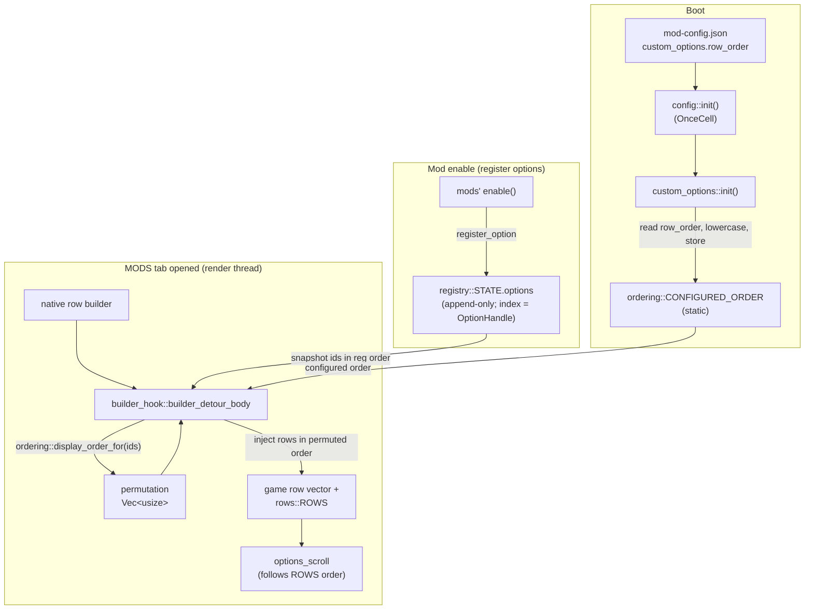

# Detailed Design — Custom Options Row Order

## Overview

Add an operator-authored `row_order` key under `custom_options` in `mod-config.json`: an
ordered array of option-row **ids** that controls the top-to-bottom order in which the
modpack's custom option rows are presented on the in-game **MODS tab** (the custom-options
framework's page 6).

Today, row order is an implicit side effect of **registration order** (the order mods
call `register_option`, which is fixed by mod-registration order in `lib.rs`). This
feature makes it a tunable value without changing that default: with no `row_order` (or an
empty one), behavior is byte-for-byte identical to today.

Rules (from the request):
- Ids listed in `row_order` appear first, in the listed order.
- Any registered option **not** listed falls to the **end**, keeping current registration
  order among themselves.
- Any listed string that matches **no** registered option is **logged once as a warning
  and ignored** — never fatal.

The change is deliberately surgical: it reorders a single in-memory snapshot at row-
injection time. It touches no game memory layout, installs no new hook, and preserves the
stability of `OptionHandle` indices.

## Detailed Requirements

Consolidated and finalized from `idea-honing.md` (all confirmed):

1. **Config field.** `custom_options.row_order` — optional JSON array of strings. Absent
   **or empty** ⇒ identity ordering (current registration order). Operator-authored only;
   the DLL never writes it (existing read-modify-write save paths preserve it).
2. **Ids.** Each string is a registered option's `RegisterSpec.id`. Matched
   **case-insensitively** (ASCII case-fold; no whitespace trimming).
3. **Scope.** Only the modpack's custom rows on the MODS tab (page 6). Native game option
   rows and the triple-0 overlay mod menu are unaffected.
4. **Unlisted options ⇒ end**, preserving current registration order among themselves.
5. **Unknown id ⇒ warn + ignore, never fatal.** Warning is emitted **once per process**
   (latched), soft-worded (it may be a typo *or* a disabled mod / absent asset), and lists
   the offending id(s).
6. **Duplicate id in the array ⇒ first occurrence wins**, later duplicates ignored
   silently (at most a `log_debug!`).
7. **No parent/child (`ShowWhen`) adjacency magic.** The array is honored literally;
   visibility is resolved independently by id, so a child ordered away from its parent
   still shows/hides correctly. Documented as a known characteristic.
8. **Cabinet-wide.** A single array applied identically to both player sides; sits
   directly under `custom_options` (sibling of `p1`/`p2`).
9. **Boot-time read.** Loaded once at boot; applied on every MODS-tab open that session.
   Editing the file requires a relaunch (consistent with all other config knobs). Not a
   live mod-menu row.
10. **Locus.** All logic in the `custom_options` service; the only behavioral change is
    the row-injection iteration order in `builder_hook`.

## Architecture Overview

The feature slots into the existing custom-options data path with one new leaf module
(`ordering`) and two small call-site edits (config read at `init`, permutation applied in
`builder_hook`).



Key invariant preserved: `registry::STATE.options` and `OptionHandle` indices are **never
reordered**. Only the *iteration order at injection* changes, and because `rows::ROWS` is
built in that same iteration, the scene-graph visual order and the scroll order stay
mutually consistent for free.

## Components and Interfaces

### 1. `src/mods/config.rs` — new config field

Add to `CustomOptionsConfig`:

```rust
/// Operator-defined display order for the modpack's custom option rows on the
/// MODS tab. Each entry is an option id (case-insensitive). Listed ids render
/// first in this order; any registered option not listed falls to the end
/// (keeping registration order); any entry matching no registered option is
/// logged once and ignored. Absent or empty => current registration order.
#[serde(default)]
pub row_order: Option<Vec<String>>,
```

No other changes here. All existing writers (`save_mod_states`,
`save_custom_options_values`, `save_json_key`, migration) already do read-modify-write on
the raw JSON and only touch named keys, so a hand-authored `row_order` survives every DLL
write untouched.

### 2. `src/services/custom_options/ordering.rs` — new leaf module

Owns the configured order and the permutation logic. Small and dependency-light.

```rust
use once_cell::sync::OnceCell;
use std::sync::atomic::{AtomicBool, Ordering};
use crate::log_warn;

/// Configured order, ids ASCII-lowercased at store time. Absent/empty => identity.
static CONFIGURED_ORDER: OnceCell<Vec<String>> = OnceCell::new();
/// Warn-once latch for unknown ids (this event would otherwise recur on every open).
static UNKNOWN_WARNED: AtomicBool = AtomicBool::new(false);

/// Store the operator's configured order (called once from custom_options::init).
/// Empty vec is stored as-is and later treated as identity.
pub(crate) fn set_configured_order(order: Vec<String>) {
    let lowered = order.iter().map(|s| s.to_ascii_lowercase()).collect();
    let _ = CONFIGURED_ORDER.set(lowered);
}

/// Compute the display permutation for `registered` (option ids in registration
/// order; index == OptionHandle). Returns indices into `registered` in display
/// order plus the list of configured ids that matched nothing.
///
/// Pure — no logging, no globals — so the ordering rules are reviewable in one place.
fn compute_order(registered: &[&str], configured: &[String]) -> (Vec<usize>, Vec<String>) {
    let n = registered.len();
    let mut placed = vec![false; n];
    let mut order = Vec::with_capacity(n);
    let mut unknown = Vec::new();

    for want in configured {
        // ids are unique in the registry; at most one match. eq_ignore_ascii_case
        // (want is already lowercased; registered ids are snake_case ASCII).
        match registered.iter().position(|id| id.eq_ignore_ascii_case(want)) {
            Some(idx) if !placed[idx] => {
                placed[idx] = true;
                order.push(idx);
            }
            Some(_) => { /* duplicate in configured -> first wins, ignore (Q6) */ }
            None => unknown.push(want.clone()), // Q5
        }
    }
    // Unlisted options -> end, in registration order (Q4).
    for (idx, done) in placed.iter().enumerate() {
        if !done {
            order.push(idx);
        }
    }
    (order, unknown)
}

/// Public entry used by builder_hook. Returns the permutation of 0..ids.len().
/// Identity fast-path when no order is configured. Warns once for unknown ids.
pub(crate) fn display_order_for(ids: &[&str]) -> Vec<usize> {
    let configured = match CONFIGURED_ORDER.get() {
        Some(c) if !c.is_empty() => c,
        _ => return (0..ids.len()).collect(),
    };
    let (order, mut unknown) = compute_order(ids, configured);
    if !unknown.is_empty() && !UNKNOWN_WARNED.swap(true, Ordering::AcqRel) {
        unknown.sort();
        unknown.dedup();
        log_warn!(
            "custom_options/row_order: ignoring {} id(s) with no registered option: {:?} \
             (a typo, or a disabled mod / asset not present this boot)",
            unknown.len(),
            unknown
        );
    }
    order
}
```

Registered in `mod.rs`: `pub mod ordering;`.

### 3. `src/services/custom_options/mod.rs` — read config at init

In `init()`, after the existing sub-inits (order relative to them doesn't matter — it
only stashes a string list):

```rust
// Row-order preference (operator-authored). Empty/absent => registration order.
let configured = crate::mods::config::get()
    .and_then(|c| c.custom_options.as_ref())
    .and_then(|c| c.row_order.clone())
    .unwrap_or_default();
ordering::set_configured_order(configured);
```

(`custom_options_persistence` already reads `crate::mods::config` at its init, so this
introduces no new layering dependency. Config is loaded well before service init.)

### 4. `src/services/custom_options/builder_hook.rs` — apply the permutation

The only behavioral edit. Immediately after the existing `handles` snapshot is built
(still in registration order, `handles[i].0 == OptionHandle(i)`), reorder it:

```rust
// Reorder per the operator's configured row_order (identity if unconfigured).
let handles: Vec<(OptionHandle, String, RowKindTag)> = {
    let ids: Vec<&str> = handles.iter().map(|(_, id, _)| id.as_str()).collect();
    let perm = super::ordering::display_order_for(&ids);
    perm.into_iter().map(|i| handles[i].clone()).collect()
};
```

The subsequent `clear_side` + per-handle allocate/register loop is unchanged; it now walks
`handles` in display order, so rows are `push_back`-ed into the game's row vector — and
pushed into `rows::ROWS` — in that order. `RowKindTag` is `Copy`; `OptionHandle` is `Copy`;
`String` clones cheaply (a handful of rows).

No changes are needed in `rows.rs`, `filter_hook.rs`, `dtor_hook.rs`, or `options_scroll`:
they all consume `ROWS`/row order as-is.

## Data Models

### Config (`CustomOptionsConfig`)

| Field (new) | Type | Serde | Meaning |
|-------------|------|-------|---------|
| `row_order` | `Option<Vec<String>>` | `#[serde(default)]` | Operator-defined MODS-tab row order (option ids, case-insensitive). `None`/empty ⇒ registration order. |

Example `mod-config.json`:

```jsonc
"custom_options": {
  "persist_network": true,
  "persist_json": true,
  "row_order": [
    "premium_free",
    "autoplay",
    "customize_background",
    "customize_lanecover_single",
    "arrow_scale",
    "arrow_opacity"
  ],
  "p1": {},
  "p2": {}
}
```

### In-memory (ordering module)

| Item | Type | Notes |
|------|------|-------|
| `CONFIGURED_ORDER` | `OnceCell<Vec<String>>` | Ids lowercased at store time. Set once at `init`. |
| `UNKNOWN_WARNED` | `AtomicBool` | Warn-once latch for unknown ids. |

No game-memory structures are introduced or changed.

## Error Handling

| Situation | Behavior |
|-----------|----------|
| `row_order` absent | `None` ⇒ identity ordering. Zero behavior change. |
| `row_order` empty array | Stored empty ⇒ identity fast-path in `display_order_for`. |
| Id matches no registered option (typo, disabled mod, absent asset) | Entry ignored; **one** WARN per process listing all such ids. Never fatal. (Q5) |
| Duplicate id in `row_order` | First occurrence placed; later ones ignored silently. (Q6) |
| Registered option not listed | Appended at the end in registration order. (Q4) |
| `row_order` present but wrong JSON type (e.g. a string, or array of numbers) | `CustomOptionsConfig` fails to deserialize ⇒ `config::init` falls back to whole-file defaults with an existing WARN. **This is the pre-existing behavior for any malformed key** and is out of scope to change here (see Alternatives). Operators author valid JSON. |
| `custom_options` service unavailable / registry poisoned | `builder_hook` already guards these paths; ordering is only invoked after a successful `handles` snapshot, so no new failure mode. |

Panic safety: `builder_detour_body` is already wrapped in `catch_unwind`; `compute_order`
performs only bounds-safe slice/`Vec` operations and cannot panic on any input.

## Testing Strategy

Consistent with repo convention (no unit-test harness; validation is live deploy + log
observation). The `compute_order` helper is written as a pure function so its rules are
reviewable at a glance.

Build gates (from AGENTS.md): `cargo check --target x86_64-pc-windows-msvc` → `cargo fmt`
(whole crate) → `./build.sh` clean.

Functional validation matrix (cabinet deploy, observe MODS tab + `[DDR-Hook]` log):

1. **No `row_order`** → rows appear in current (registration) order. Confirms zero-change
   default.
2. **Partial order** (e.g. `["arrow_scale","premium_free"]`) → those two lead in that
   order; every other registered option follows in registration order.
3. **Full order** → exact order honored, both P1 and P2 sides.
4. **Bogus id** (e.g. `["premium_free","not_a_real_option"]`) → premium_free leads, menu
   otherwise normal, exactly **one** WARN naming `not_a_real_option`.
5. **Duplicate id** → placed once, no misbehavior.
6. **Case variance** (e.g. `["Premium_Free"]`) → matches `premium_free`.
7. **Parent/child** (`["weight","is_disp_weight",...]`) → `weight` renders where listed;
   toggling `is_disp_weight` still shows/hides `weight` correctly.

## Appendices

### A. Technology / Approach Choices

- **Reorder the injection snapshot, not the registry.** The registry `Vec` and
  `OptionHandle` indices must stay stable (handles are indices held for the process
  lifetime). Reordering only the transient `handles` snapshot in `builder_hook` achieves
  the display reorder while keeping every other consumer correct, because `rows::ROWS` is
  built from that same iteration and the scroll driver follows `ROWS`.
- **Boot-time read into a static.** Matches every other config knob and avoids any
  per-frame config access; the value is a small immutable string list.
- **Pure `compute_order` + thin logging wrapper.** Isolates the ordering rules (reviewable,
  side-effect-free) from the warn-once logging.
- **Case-insensitive match via `eq_ignore_ascii_case`.** Ids are kbin-valid snake_case
  ASCII, so ASCII case-fold is sufficient and avoids Unicode-folding surprises.

### B. Research Findings (see `research/existing-mechanism.md`)

- Row display order == registration order, driven solely by the `handles` iteration in
  `builder_hook::builder_detour_body`; `rows::ROWS` and `options_scroll` follow it.
- `ShowWhen` visibility is resolved by id lookup, independent of order → reordering is
  functionally safe (Q7).
- `CustomOptionsConfig` already carries several optional `#[serde(default)]` tuning knobs;
  `row_order` is a natural sibling. All DLL write paths preserve unknown keys.
- A service reading `crate::mods::config` is established (`custom_options_persistence`).

### C. Alternatives Considered

- **Explicit per-mod priority integers at registration.** Rejected: requires touching
  every mod, isn't operator-tunable without recompiling, and doesn't match the "one config
  list" request.
- **Reorder the `registry::STATE.options` Vec directly.** Rejected: would invalidate
  `OptionHandle` indices held across the codebase.
- **A tolerant custom deserializer for `row_order`** (so a wrong-typed value degrades to
  `None` instead of triggering whole-file config fallback). Deferred: the whole-file
  fallback is the existing behavior for *any* malformed key; special-casing one field adds
  code for a narrow operator-error case. Can revisit if it proves annoying in practice.
- **Live editing via the overlay mod menu.** Rejected: it's a string list with no natural
  scalar/enum UI, and boot-time semantics match every other config knob.
