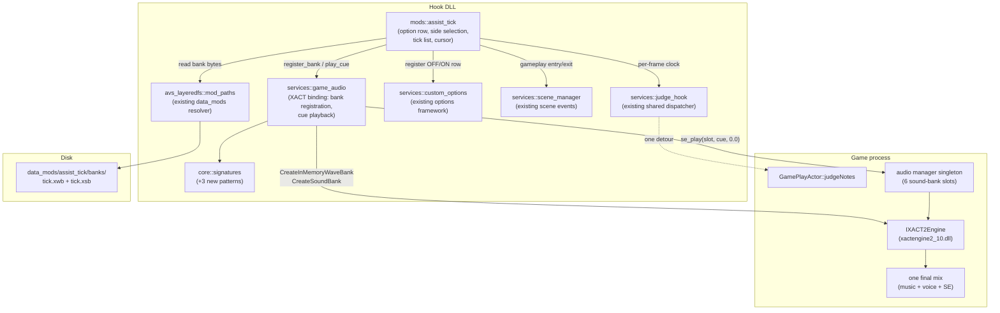

# Detailed Design — Assist Tick (DDR World hook DLL)

**Status: Approved 2026-07-25**
**Date:** 2026-07-25

---

## 1. Overview

Assist Tick plays a short clap sound at the exact moment each arrow in the chart is meant to be
stepped on, as an audible timing reference. It is the DDR World equivalent of StepMania's
assist tick / assist clap.

The feature is a new mod (`assist-tick`) plus one new service (`game_audio`) inside an existing
Rust hook DLL that is injected into the DanceDanceRevolution World arcade process by spice2x's
`-k` flag. It is enabled per player from a row on the in-game **MODS** options tab, and the
setting follows the player's e-amusement card.

Three properties define the design:

1. **The clap is played through the game's own audio engine**, not through a mod-owned audio
   output. DDR World's audio is Microsoft XACT 2 (`xactengine2_10.dll`), and *everything* — menu
   BGM, voice, all sound effects, and the song audio itself — passes through one engine instance
   and one final mix. A clap played there inherits the music's exact output latency; a
   self-hosted audio client would add an independent, device-dependent offset that cannot be
   measured from inside the process.
2. **Ticks are driven by chart time, not by judgment.** The game's judgment fires on player
   input (early or late) or on late-window expiry. Triggering off judgment would make the clap
   follow the player's mistakes — the opposite of a timing reference. The judge hook is used
   only as a per-frame clock.
3. **Exactly one tick stream per song**, centre-panned, following one side's chart. An arcade
   cabinet is a single shared stereo mix in one room, so there is no such thing as per-player
   audio isolation; two simultaneous tick streams would be heard by both players as noise.

---

## 2. Detailed Requirements

### 2.1 Functional

**FR-1 — Tick timing.** For each eligible note in the selected side's chart, a clap is played
once, as close as possible to that note's chart timestamp, independent of player input and
independent of whether the note is hit or missed.

**FR-2 — Eligible notes.** A note is eligible if and only if all of the following hold, given
the game's per-note record:

```
kind == 0                                            // taps only, incl. freeze heads
&& !(state[0..=3] all == 1 || state[4..=7] all == 1) // not a shock arrow
&& state[] has at least one non-zero entry           // note exists post-trim
&& music_count >= 0                                  // not a pre-chart auto-credited note
```

Notably `length[]` (per-panel freeze length) is **not** consulted. A freeze head is an ordinary
`kind == 0` tap that the player steps on, and the freeze *tail* is excluded by `kind` (it is
`kind == 2`). Reading `length[]` would break under the `FREEZE ARROW: OFF` player modifier,
which zeroes that array while leaving the steppable head in place.

Excluded, and why:
| Excluded | Represented as | Why no tick |
|---|---|---|
| Freeze tails | `kind == 2` | Not a step |
| THINOUT notes | `kind == 1` | Notes removed by the CUT or JUMP-OFF player modifiers; pre-judged, never stepped on |
| Shock arrows | `kind == 0`, all four panels of a side set to `1` | Must be *avoided*; a "step here" cue would be actively misleading |
| Mines | `kind == 20` (injected by this DLL's own note-types mod) | Must be avoided |
| Tempo / event markers | `kind < 0` | Not notes |

**FR-3 — One tick per row.** Multiple simultaneous panels (a jump) produce exactly one clap.
Timestamps are de-duplicated exactly, and additionally coalesced within a small window
(`COALESCE_MS`, default 4 ms) because charts authored at TPS 150 round to whole milliseconds and
can place two adjacent rows on the same or adjacent millisecond.

**FR-4 — One tick per frame maximum.** If more than one tick becomes due in a single frame (a
lag spike, or a burst tighter than the frame period), the cursor advances past all of them and
exactly one clap is played. Replaying the backlog would machine-gun stale ticks.

**FR-5 — Side selection.** Exactly one side's chart drives the ticks, chosen once per song:

| Session | Tick side |
|---|---|
| Single player, either cabinet side | that player's side — a solo player on the 2P side ticks the 2P chart |
| Two players, both enabled | **P1** |
| Two players, only one enabled | that side |
| Doubles | the single actor |

Selection is based on which sides are **actually in gameplay**, enumerated from the game's actor
tree — not on which sides hold an enabled option value, so that a stale persisted value on an
inactive side cannot hijack the tick.

**FR-6 — Panning.** Ticks are always centre-panned (`pan = 0.0`). Never side-panned.

**FR-7 — Option row.** A per-player `ASSIST TICK` row with values `OFF` / `ON` appears on the
MODS tab of the game's own options screen, defaulting to `OFF`. The value persists per player
via the existing custom-options persistence (network save/load plus offline JSON cache), i.e. it
follows the card.

**FR-8 — Latch semantics.** The per-side enable state is latched at gameplay entry. Changing the
option mid-session takes effect from the next song, consistent with how the playfield-styling
options in this codebase already behave.

**FR-9 — Custom sound.** The clap is StepMania's assist-tick sample, delivered as a pre-built
XACT wave bank + sound bank pair on disk. Replacing those two files replaces the sound, with no
rebuild.

**FR-10 — No score effect.** The mod has no interaction with score-submission suppression.
Assisted plays upload normally. (Recorded counter-argument: StepMania classifies assist clap as
an assist and disqualifies it from ranking, and this codebase does suppress uploads for Autoplay
and quick-fail. The decision is deliberate and revisitable; reversing it is local.)

**FR-11 — Restart handling.** A quick restart mid-song re-latches the side selection and rebuilds
the tick list.

### 2.2 Non-functional

**NFR-1 — No panics across FFI.** All hook-callback bodies must be panic-free; no `unwrap`,
`expect`, indexing, or slicing that can panic.

**NFR-2 — Hot-path budget.** The per-frame work must be O(1) — a single integer comparison
against the cursor position and, at most, one audio call. The judge callback runs once per frame
per side during gameplay.

**NFR-3 — No hardcoded addresses.** Every game address is resolved at runtime by byte-pattern
scan or by RIP-relative derivation from a scanned landmark.

**NFR-4 — Graceful degradation.** Any missing prerequisite disables only this mod, with one
warning line. No crash, no fallback audio path.

**NFR-5 — No new crate dependencies.**

**NFR-6 — No game data files modified.** The mod adds its own audio banks at runtime; it does not
patch, replace, or repack any shipped game asset.

**NFR-7 — Cross-version tolerance.** All resolution patterns are verified against multiple game
builds, and every layout assumption that can be checked at runtime is checked before use.

### 2.3 Assumptions

1. Redistributing the StepMania clap sample inside this repository is acceptable for a
   private-cabinet modpack. Provenance and attribution are recorded in the README.
2. The game's SE mute filter does not veto playback during gameplay for our bank id. This is
   evidenced by the game's own shock-arrow SE (which goes through the same filter on a different
   bank) being audible during gameplay, but is not proven for our bank id until a cabinet test.
   Mitigation is documented in §6.
3. The sound-bank slot array stride on the audio manager holds on the running build. This is
   verified at runtime rather than assumed (§4.3).

---

## 3. Architecture Overview

### 3.1 Component relationships



The mod owns *policy* (which notes, which side, when). The service owns the game-ABI surface
(vtable calls, the manager global, the slot table), keeping all `unsafe` XACT interaction in one
auditable file.

### 3.2 Why the game's audio engine

DDR World's audio subsystem, as observed in the game binary:

- The engine is COM-instantiated Microsoft XACT 2 (`xactengine2_10.dll`, shipped with the game;
  its own output backend is DirectSound, resolved dynamically). The game binary itself imports
  no audio API at all — no XAudio2, no DirectSound, no WASAPI, no ASIO.
- An in-house "audio manager" singleton wraps it and owns **six sound-bank slots**. A loaded
  bank file's basename selects its slot: `bgm_menu→0`, `se_system→1`, `se_normal→2`, `voice→3`,
  and *anything else* → `5` (the per-song bank). **Slot 4 is never produced by that mapping.**
- Sound effects are played by a small façade whose public entry point takes a bank id, an ASCII
  cue name, and a pan value, and returns a handle. Cue names are resolved by the sound bank at
  call time; there is no client-side hashing or id table, so adding a cue name costs nothing.
- `IXACT2Engine::DoWork()` is called exactly once per frame by the game's main loop, along with
  a reaper that destroys finished cues. We therefore do not need to pump the engine or reap our
  own cues.
- The game already plays a per-note SE from inside its judge loop (the shock-arrow hit sound,
  panned by the actor's own side). Assist tick is that same pattern with a different cue name,
  fired once per arrow instead of once per shock hit.

By registering our own sound bank into the unused slot and playing through the existing façade,
we inherit panning, the manager's 256-entry handle table, the per-frame cue reaper, and the
cabinet's SE volume category — for the cost of a single pointer write.

### 3.3 Runtime sequence

```mermaid
sequenceDiagram
    participant Init as DLL init thread
    participant Mod as assist_tick
    participant Scene as scene_manager
    participant Judge as judge_hook (game thread)
    participant GA as game_audio
    participant XACT as XACT engine

    Init->>GA: init(signatures) — resolve addresses ONLY, no game calls
    Init->>Mod: init(ctx) → enable()
    Mod->>Mod: register OFF/ON option row
    Mod->>Scene: subscribe to scene changes
    Mod->>Judge: register_pre(Normal, tick_clock)

    Note over Scene: player starts a song
    Scene-->>Mod: scene change → GAMEPLAY
    Mod->>Mod: latch per-side enables; mark "rebuild pending"

    Note over Judge: first judge dispatch of the song (game thread)
    Judge-->>Mod: tick_clock(actor, music_count)
    Mod->>GA: register_bank(bytes) [idempotent, first time only]
    GA->>XACT: CreateInMemoryWaveBank(xwb)
    GA->>XACT: CreateSoundBank(xsb)
    GA->>GA: claim free sound-bank slot on the manager
    Mod->>Mod: enumerate sibling actors → choose tick side
    Mod->>Mod: walk Results vector → build sorted tick list

    Note over Judge: every subsequent frame
    Judge-->>Mod: tick_clock(actor, music_count)
    Mod->>Mod: is times[cursor] due (with lead)? advance cursor
    Mod->>GA: play_cue("asti", 0.0)
    GA->>XACT: se_play(slot, "asti", 0.0)

    Scene-->>Mod: scene change → leaving GAMEPLAY
    Mod->>Mod: drop tick list + side latch
```

Bank creation happens on the **game thread at the first judge dispatch**, never on the DLL init
thread. This codebase has a documented crash class from calling game functions at init time
before their backing globals exist; the first judge dispatch is proof that gameplay state is
live.

---

## 4. Components and Interfaces

### 4.1 `services::game_audio` (new)

Owns all XACT interaction. Follows the established service shape in this codebase
(`Lazy<Mutex<Inner>>` singleton, `init()` at a fixed point in the DLL init sequence,
`is_available()` for consumers).

```rust
/// A mod-owned XACT bank pair, ready for registration.
pub struct BankRequest {
    /// Must byte-match the wave-bank name inside the XSB, case-sensitively.
    pub name: &'static str,
    pub xwb: Vec<u8>,
    pub xsb: Vec<u8>,
}

/// Opaque handle to a registered bank. `Copy` — registration is idempotent and
/// process-lifetime, so there is no release path and no ownership to enforce.
#[derive(Clone, Copy)]
pub struct BankHandle { slot: i32 }

/// Resolve addresses. No game functions are called. Safe on the init thread.
pub fn init(signatures: &SignatureStore) -> bool;

/// True when every address resolved and the expected XACT engine module is loaded.
pub fn is_available() -> bool;

/// Create the wave bank then the sound bank, and claim a free manager slot.
/// GAME THREAD ONLY. Idempotent per `name`: repeat calls return the existing handle.
pub fn register_bank(req: BankRequest) -> Option<BankHandle>;

/// Play a cue by name from a registered bank. GAME THREAD ONLY.
/// Returns false if the cue is unknown or the manager global is null.
pub fn play_cue(bank: BankHandle, cue: &CStr, pan: f32) -> bool;
```

**Address surface.** Three things are needed: the SE play entry point, the audio-manager global,
and the engine vtable indices.

- `se_play` and the manager global are resolved from byte patterns (§4.3). The manager global's
  absolute address **changes on every game build**, so it is derived by RIP-relative decode from
  a scanned landmark rather than scanned directly.
- The engine pointer is `*(void**)manager`.
- Engine vtable indices are properties of `xactengine2_10.dll`, not of the game binary, and are
  therefore stable across game builds as long as the shipped engine DLL does not change. Only
  indices the game itself calls are used:

  | Interface | Index | Method |
  |---|---|---|
  | `IXACT2Engine` | `+0x48` | `CreateSoundBank(pv, cb, flags, allocAttr, ppSB)` |
  | `IXACT2Engine` | `+0x50` | `CreateInMemoryWaveBank(pv, cb, flags, allocAttr, ppWB)` |
  | `IXACT2SoundBank` | `+0x00` | `GetCueIndex(PCSTR) -> u16` (`0xFFFF` = not found) |

  `IXACT2Cue`'s layout provably deviates from the public XACT 3 headers, so no index the game
  does not itself exercise is used anywhere in this design. The service additionally guards on
  `GetModuleHandleA("xactengine2_10.dll")` being non-null, so a cabinet shipping a different
  engine version declines instead of calling through mismatched indices.

  *(Amended 2026-07-26 during Step 2, maintainer-approved.)* That module check was originally
  specified here as part of `init()`. It cannot live there: the engine is COM-instantiated inside
  the game's `Application::onBoot`, which the boot log shows completing **after** the DLL's init
  thread finishes, so a boot-time check always fails and the service would be permanently
  disabled. It moved to `register_bank`, immediately before the first vtable dispatch it protects
  — which is also strictly tighter. Consequence: `is_available()` means "addresses resolved" and
  no longer pre-empts the wrong-engine case, so that case surfaces as one declined registration
  (one warning, mod silent) rather than as a mod that declines to init.

**`register_bank` procedure.**

1. Null-check the manager global. (The game's own `se_play` dereferences it unconditionally, so
   this check is ours to make.)
2. Sanity-check the slot layout: the slot array is 6 entries of stride `0x10`, each holding an
   `int file_id` and an `IXACT2SoundBank*`. Assert that the `se_normal` slot's bank pointer is
   non-null — proof that both the manager layout and normal boot completed.
3. **Compute** a free slot: bank pointer null *and* `file_id == -1`. Do not hard-code the index.
   If none is free, decline.
4. `CreateInMemoryWaveBank(xwb)` — **first**. The wave bank must exist before the sound bank is
   used, and its "prepared" notification fires synchronously inside this call, so no waiting is
   required.
5. `CreateSoundBank(xsb)`.
6. Write the returned `IXACT2SoundBank*` into the chosen slot's bank pointer. **Leave `file_id`
   at `-1`.** This is the load-bearing detail: the only code in the game that destroys a sound
   bank slot is a linear "find the slot whose `file_id` equals this file id" search that destroys
   nothing on no-match. A slot whose `file_id` stays `-1` can never be matched, so our bank
   survives every song load, song unload, and scene transition for the process lifetime.
7. **Leak the two byte buffers** (`Box::leak`). XACT does not copy an in-memory wave bank's data;
   the buffer must remain valid for the bank's lifetime, which here is the process lifetime.
   Corroborating evidence: the game keeps its own in-memory bank file records resident too.

**`play_cue`** null-checks the manager global and then calls the game's `se_play(slot, cue, pan)`,
which internally resolves the cue index, plays it, and registers the resulting cue into the
manager's handle table so the game's own per-frame reaper destroys it. Calling the public entry
(rather than the inner one) keeps the AVS lock semantics the game itself uses.

### 4.2 `mods::assist_tick` (new)

Standard `Mod` trait implementation.

| Lifecycle | Work |
|---|---|
| `init(ctx)` | Verify `game_audio::is_available()`, `judge_hook::is_available()`, `custom_options` availability. Load the two bank files from `data_mods/…/banks/` via the existing mod-path resolver and keep the bytes. Return `false` (mod skipped) if anything is missing. |
| `enable()` | Register the option row; subscribe to scene changes; register the judge pre-callback at `Normal` priority. |
| `disable()` | Unregister the judge and scene callbacks; clear per-side state. Registered banks are intentionally left in place (destroying an XACT bank that a live cue might reference is the deferred-destroy hazard this codebase has been bitten by elsewhere, and an idle bank costs nothing). |

**Option row.** The custom-options framework already provides a two-value OFF/ON enum row that
reuses the game's stock OFF/ON ribbon sprites, so no value-label art is needed — only the row's
own label texture (`176×16`, generated by the existing label-atlas script) and an entry in that
script's label list. Default `OFF`. Persistence mode: the framework default (network save +
network load + offline JSON cache).

Two framework behaviors to respect:
- The label atlas is flushed once at boot, so a freshly installed row has no label until the next
  launch. Expected, documented in the README.
- The option's change callback can fire on the DLL init thread and on a spawned
  persistence-priming thread, not only the render thread. It therefore only writes atomics.

**Scene callback.** On entry to the gameplay scene: read each side's current option value into a
per-side atomic, and set a `rebuild_pending` flag. On leaving: clear the tick list and the side
latch. Scene callbacks fire *before* the next scene is constructed, so no actor exists yet —
which is precisely why the list is built later, on the first judge tick.

**Judge callback — the clock.** Signature is fixed by the existing dispatcher:
`fn(actor: *mut u8, music_count: i32)`, invoked once per frame per side during gameplay, where
`music_count` is **milliseconds**. Body:

```
if rebuild_pending:
    ensure the audio bank is registered (idempotent, first song only)
    choose the tick side from the live actor set          (§4.2.1)
    if the chosen side is not enabled: mark this song inert; return
    build the tick list from this actor's Results vector  (§4.2.2)
    clear rebuild_pending
if this actor is not the chosen side: return
if music_count < last_music_count - REWIND_MS:           // belt-and-braces restart guard
    reseek the cursor by binary search
last_music_count = music_count
lead = adaptive_lead()                                    // §4.2.3
if cursor < len and times[cursor] <= music_count + lead:
    advance cursor past every due timestamp
    play_cue("asti", 0.0)                                 // exactly one, per FR-4
```

Note the callback is registered once and receives dispatches for *both* sides; the identity check
is a comparison against the latched side value, not a separate subscription.

#### 4.2.1 Choosing the tick side

The dispatched actor is the entry point into the game's actor tree:

```
dps        = *(actor + 0x08)          // parent DancePlaySequence
first      = *(dps   + 0x18)          // first child
next       = *(child + 0x10)          // sibling chain
is_actor   = *(child as **u8) == *(actor as **u8)   // same vtable as the dispatched actor
side       = *(i32*)(child + 0x84)
style      = *(i32*)(child + 0x88)    // 1 == DOUBLE
```

Walking the sibling chain and vtable-comparing against the dispatched actor's own vtable
enumerates the live gameplay actors without needing any additional signature. The engine itself
walks this exact chain one call earlier in the same frame (to broadcast a per-frame message), so
the list is provably populated at the first judge dispatch.

Selection then follows FR-5: a single actor means solo or doubles and that actor wins if its side
is enabled; two actors means prefer side 0 when both sides are enabled, otherwise the single
enabled side. If enumeration yields nothing (a layout change), fall back to the dispatched actor
itself if its own side is enabled — a degraded but sane result that still produces correct ticks
for the overwhelmingly common solo case.

Two constants here (`0x18` first-child, `0x10` next-sibling) duplicate constants already present
in the quick-restart mod, which walks the same chain from a different entry point. If a third
consumer appears, the walk should be hoisted into a shared helper; duplicating it twice is not yet
worth a new module.

#### 4.2.2 Building the tick list

The actor's Results vector is the whole chart for that side: one 0x40-byte record per note,
sorted, built in the same call that enters the play state — so it is complete at the first judge
tick. It **includes** shock arrows, freeze tails, THINOUT notes, and this DLL's own injected
mines, so FR-2's predicate must filter rather than assume.

```
(begin, end) = actor_results_range(actor)      // existing helper: actor+0xB0 / actor+0xB8
for each result entry:                          // existing helper: stride 0x40, note ptr at +0x00
    note = *(entry + 0x00)
    if eligible(note):                          // FR-2
        push note.music_count                   // note + 0x08, milliseconds
sort; dedup exactly; coalesce within COALESCE_MS
```

A typical chart yields on the order of a thousand `i32`s. Built once per song; never rebuilt
per frame.

#### 4.2.3 Lead compensation

Playback is frame-quantized: the game submits audio work once per frame and never uses a
scheduled start time, so a tick lands on the first frame at which it is detected. Firing when
`times[cursor] <= music_count` alone would make every tick systematically **late** by 0 to one
frame period.

The mod therefore applies a **half-frame lead**, so the error is centred at ±½ frame instead of
skewed late. The lead is derived adaptively from the observed `music_count` delta between judge
dispatches, clamped to a sane range, with a fixed fallback on the first frame. This makes the
compensation correct automatically at 60, 120, 144 or 240 Hz — this codebase ships an FPS-unlock
mod, so the frame period is not a constant.

The lead lives in one named place, so promoting it to an operator-tunable offset later is a
one-line addition rather than a refactor.

*(Amended 2026-07-26 during Step 3, maintainer-directed.)* That promotion happened: the
maintainer's listening pass found the claps landing 100–200 ms late while the measurement
logging showed them firing within ±6 ms of schedule in `music_count` domain — i.e. the clock is
right and the residual is the audio output chain's trigger-to-audible latency (XACT's
once-per-frame submit plus the backend mixing buffer; substantial under CrossOver/Wine's
DirectSound). The half-frame lead cannot see that latency — it only centres the *detection*
error. The horizon is therefore `music_count + lead + offset_ms`, where `offset_ms` comes from
the new `assist_tick` config section (§5.3) and is latched once per song. Positive = earlier;
default `0` (native hardware needs little or none). This is Appendix C row 1, promoted early
out of necessity; the overlay row for live adjustment remains deferred.

*(Further amended 2026-07-26, maintainer-directed.)* The overlay half followed the same day: the
offset is now read **per frame** from an atomic (not latched per song), seeded from the config at
enable and adjustable live from a mod-menu overlay child row ("Tick Latency Offset", nested under
the mod's master toggle, fine 1 ms / coarse 25 ms, bounds −250..500), which persists changes back
to the `assist_tick` config section via `save_json_key` — the `timing_offsets` precedent
throughout. Live rather than per-song-latched deliberately: this is a cabinet-wide operator
calibration knob tuned by ear mid-song, not a per-player option, so the per-song-latch convention
for player options does not apply. Appendix C row 1 is now fully promoted.

### 4.3 New signature patterns

Three additions to the central signature registry. All were verified to match uniquely on four
game builds (2026-07-21, 2026-06-16, 2026-04-21, 2026-03-24).

| Name | Purpose | Notes |
|---|---|---|
| `se_play` | The public "play a cue" entry point | Cross-checked by following its first `CALL rel32`, which must land on the inner play function |
| `se_play_inner_body` | Landmark for the audio-manager global | The global is decoded RIP-relative from within the match; it moves on every build, so this derivation — not a scan — is what keeps it version-agnostic. The pattern must include the vtable-call bytes, because the neighbouring "prepare" function is byte-identical for its first ~0x65 bytes |
| `bank_slot_of_file_loop` | Confirms the slot-mapping fallback constant | The immediate that encodes "unrecognised basename → slot 5" reads the same on all four builds; used as a boot-time assertion that the free-slot assumption still holds |

Derivation uses the existing scanner primitives (`decode_rip_relative`, `decode_call_rel32`,
`scan_first_call_rel32`) rather than inline decoding, per this codebase's convention.

The `se_play` ABI has one detail that would silently break a naive binding: it is
`(i32 bank_id, const char* cue, f32 pan)` in Microsoft x64, so the pan argument travels in
**XMM2**, not in a general-purpose register. The Rust declaration is
`unsafe extern "system" fn(i32, *const c_char, f32) -> u32`, which maps correctly.

### 4.4 Asset pipeline (offline, one time)

The clap ships as a pre-built XACT bank pair. Nothing about the format is computed at runtime.

```
data_mods/assist_tick/source/clap.ogg      # StepMania sample (Ogg Vorbis, mono 44.1 kHz, 0.213 s)
data_mods/assist_tick/banks/tick.xwb       # generated wave bank  (~5.5 KB)
data_mods/assist_tick/banks/tick.xsb       # generated sound bank (~330 B)
scripts/build_assist_tick_bank.sh          # documents and re-runs the conversion
```

This mirrors how this codebase already ships committed binary build products for its shader
feature: files under `data_mods/<mod>/`, read at runtime through the existing mod-path resolver,
with "files absent ⇒ feature degrades" behavior. Replacing `tick.xwb`/`tick.xsb` replaces the
sound with no rebuild.

Because the game runs from a local install directory (see §7.3), installing the asset is a
one-time copy of the `data_mods/assist_tick/` tree into that install's `data_mods/`, alongside
the trees the other mods already keep there.

**Format decisions, from the engine's own validator.**

- **Codec: MS-ADPCM (codec 2), mono, 44100 Hz.** Every wave entry in every DDR bank on disk is
  ADPCM; there is not one PCM entry anywhere. Raw PCM *is* structurally accepted by the
  validator, but that playback path is entirely unexercised on this cabinet, which is not a risk
  worth taking for a 0.2 s clap. Mono is proven in use: the game's own in-memory system SE bank
  has 11 of 13 entries mono, including the coin and card sounds.
- **Wave bank shape:** buffer (non-streaming) bank, `header_version` 42, entry-name element size
  64 (required by the validator even when no names are used), alignment 4. The validator
  additionally enforces exact segment offsets and that the file length minus the wave-data segment
  offset equals that segment's length exactly.
- **One entry, one cue.** *(Amended 2026-07-25.)* The research validated a two-entry bank because
  the pre-existing **song** sound-bank profile points its main cue at wave index 1. Since the SE
  profile is authored from scratch, it emits a single cue at wave index 0 instead, and the wave bank
  carries just the clap — removing a meaningless silent stub. Documented fallback if any validator
  rule objects to a single-entry bank: revert to the two-entry shape (silent stub at index 0, clap
  at index 1), which was generated and validated during research.
- **Sound bank:** the DDR sound-bank profile — one wave bank, simple cues, a 16-bucket cue-name
  hash table — with a CRC-16 over the file that the engine validates and **silently rejects** on
  mismatch (audio simply goes dark, with no error). This is why the bank is generated and
  validated offline rather than synthesized in-process.
- **Names must match case-sensitively.** The wave bank's internal name and the sound bank's
  wave-bank-name field must be byte-identical; the cue name is what `play_cue` passes.

**Cross-repo prerequisite.** The generator lives in a sibling tool (`ddr-chart-tools`) that
already implements the XWB writer, an MS-ADPCM encoder, an Ogg decoder, and a DDR sound-bank
writer including the engine-validated CRC-16 and cue-name hash. Its sound-bank writer currently
emits DDR's **song** profile: mix category 4/3 with a runtime-parameter curve attached. Gameplay
SEs instead use **category 6** with a bare sound entry and no curve. Emitting the song profile
would put the tick on the **music** bus and attach a parameter curve referencing global audio
state we never set — unpredictable rather than merely mis-bussed. The generator therefore needs a
small **additive** change: an SE-profile entry point alongside the existing song path. This is a
prerequisite step of the implementation plan, not part of this repository.

---

## 5. Data Models

### 5.1 Game structures consumed (read-only unless noted)

| Structure | Field | Offset | Type | Notes |
|---|---|---|---|---|
| `GamePlayActor` | parent sequence | `+0x08` | ptr | DancePlaySequence |
| | Results vector begin | `+0xB0` | ptr | |
| | Results vector end | `+0xB8` | ptr | |
| | play side | `+0x84` | i32 | 0 = P1 |
| | play style | `+0x88` | i32 | `1` = DOUBLE |
| Sequence node | first child | `+0x18` | ptr | |
| | next sibling | `+0x10` | ptr | |
| Result entry (stride `0x40`) | note pointer | `+0x00` | ptr | |
| Note record (stride `0x60`) | kind | `+0x00` | i8 | `0` tap, `1` THINOUT, `2` freeze tail, `20` injected mine, `<0` markers |
| | beat count | `+0x04` | i32 | |
| | music count | `+0x08` | i32 | **milliseconds** |
| | per-panel state | `+0x1C` | `[i32; 8]` | `1` = trigger; all four of a side = shock |
| | per-panel freeze length | `+0x3C` | `[i32; 8]` | deliberately unused (FR-2) |
| Audio manager | engine pointer | `+0x00` | ptr | `IXACT2Engine*` |
| | slot `n` file id | `+0x08 + n*0x10` | i32 | `-1` = empty; **never written by us** |
| | slot `n` sound bank | `+0x10 + n*0x10` | ptr | **the one field we write** |

Every offset above is either already in use elsewhere in this codebase or was read directly off
the game's disassembly. The two that gate correctness — the manager's slot stride and the free
slot's emptiness — are re-verified at runtime before the single write (§4.1).

### 5.2 Mod state

```rust
struct SideState {
    enabled: AtomicBool,   // latched at gameplay entry
}

struct SongState {
    tick_side: i32,             // -1 = none chosen / inert song
    times: Vec<i32>,            // sorted, deduped, coalesced note timestamps (ms)
    cursor: usize,
    last_music_count: i32,
    last_delta: i32,            // for the adaptive lead
    rebuild_pending: bool,
}
```

Per-side enables are atomics because the option's change callback is not render-thread-only. The
song state is touched only from the judge callback (game thread) and the scene callback, both of
which run on the game thread, so it lives behind the codebase's standard service mutex with no
lock held across any game call.

### 5.3 Configuration

**None.** The mod is gated solely by its entry in the existing `mods` enable map
(`"assist-tick": true|false`). No new config section, no new serde structures, no example-config
changes. The latency offset and volume controls were deliberately deferred.

*(Amended 2026-07-26 during Step 3, maintainer-directed — see §4.2.3.)* The latency offset was
un-deferred: a new operator-edited `assist_tick` config section with a single field,
`offset_ms: i32` (default `0`; positive = claps fire earlier), compensating the output chain's
trigger-to-audible latency, which the CrossOver install measured at 100–200 ms by ear. The DLL
never writes the section back. Volume control remains deferred.

---

## 6. Error Handling

Every failure disables only this mod's behavior. The judge dispatcher already wraps subscriber
callbacks in `catch_unwind`, but callback bodies are additionally written panic-free per NFR-1.

| Failure | Detected | Behavior |
|---|---|---|
| Signature unresolved | `game_audio::init` | Service unavailable; mod declines to init; one warning |
| Expected XACT engine module absent | `register_bank`, at first use | Decline registration; warn once; mod goes silent (a different engine version means unverified vtable indices). *Amended 2026-07-26: detected here rather than in `init` — see §4.1.* |
| Bank files missing or unreadable | `assist_tick::init` | Mod declines to init; one warning naming the expected path |
| Audio manager global null | before every game audio call | Skip the call; warn once |
| Manager slot layout check fails | `register_bank` | Decline registration; warn once; mod goes silent |
| No free sound-bank slot | `register_bank` | Decline; warn once. Would indicate a future build added a fifth named bank |
| Wave-bank or sound-bank creation fails | `register_bank` | Decline; warn once with the returned HRESULT |
| Cue name not found | `play_cue` | Returns false; warn **once** (not per tick) |
| Results vector empty, misaligned, or reversed | list build | Empty tick list; song is inert; no ticks, no crash |
| Actor enumeration yields nothing | side selection | Fall back to the dispatched actor's own side |
| SE mute filter vetoes playback | cabinet test only | Documented mitigation: switch to the inner play entry point, which skips the filter (at the cost of the AVS lock) |

Two deliberate non-behaviors:

- **Bank teardown.** Registered banks are never destroyed. Destroying an XACT bank while a cue
  may still reference it is a crash class this codebase has already been burned by in a different
  subsystem, and an idle bank costs one pointer plus two leaked buffers.
- **Handle-table pressure.** The manager's 256-entry cue handle table is shared with the whole
  game, and exhaustion *leaks* a cue rather than crashing. A 0.2 s clap occupies a handle for
  roughly a dozen frames, and ticks are at least a frame apart, so peak contribution is a handful
  of entries. Not mitigated, but measured during validation.

---

## 7. Testing Strategy

This codebase has no unit-test harness — it hooks a live game, and validation is by running it and
observing. The strategy is therefore: validate everything that *can* be validated offline before
the first run, then work a scripted matrix against a local install.

### 7.1 Offline (before the first run)

1. **Bank validity.** Round-trip the generated wave bank through the sibling tool's parser;
   compare every header field against both stock in-memory banks from the shipped game; check the
   generated files against a transcription of the engine's own validator rules. A malformed sound
   bank fails *silently* at runtime, so this gate matters more than usual.
2. **Sample integrity.** Decode the generated ADPCM back to PCM and compare against the source
   sample to confirm the transcode and encode chain.
3. **Predicate reasoning.** Hand-check the FR-2 predicate against the note kinds and shock test
   as read from the game's own classifiers.
4. Build gates: type check, formatter, release build.

### 7.2 Diagnostic build (first run)

Ship a build with one-shot informational logging before relying on any inferred behavior — an
established practice in this codebase, because a wrong theory costs hours and a diagnostic build
costs minutes. Log once per song: the chosen free slot; bank creation results; the enumerated
sibling actors with each one's side and style; the eligible-note count and the first few
timestamps; the observed frame delta. Log once ever: the first `play_cue` failure.

This closes the four questions that static analysis could not:
1. whether the sibling actor list holds **both** actors at the first judge dispatch
2. whether anything produces per-panel state values above 1 (which would affect the shock test)
3. doubles started from the P2 card reader
4. the real tick-coalescing window on TPS-150 charts

### 7.3 Test environment

Validation runs against a **local** game install under CrossOver, not a remote cabinet. The
install root is given by the `DDR_WORLD_INSTALL` environment variable and contains the hook DLL,
`data_mods/`, `mod-config.json`, and the launcher's `log.txt` (which is where this DLL's log lines
land). Installing a build is therefore two file copies into that directory — the DLL, and, once,
the `data_mods/assist_tick/` tree.

The repository already carries a scripted navigation harness for exactly this loop, driving the
running game over the launcher's API: launch, log in with the standard test card and pay a
session, reach song select, open and close the player options overlay, start a song, soft-restart,
shut down — with screenshots at each step. Assist-tick validation reuses it directly, which makes
most of the matrix below scriptable rather than hand-driven, and makes "toggle the row, start a
song, read the log" a single sequence.

Audible verification still requires a human listening pass — the matrix cases about *where* the
clap lands cannot be automated.

### 7.4 Behavior matrix

| Case | Expectation |
|---|---|
| Option OFF (both sides) | Silence; no behavior change anywhere |
| Solo P1 side, ON | Clap on every tap and freeze head, on the beat |
| **Solo P2 side, ON** | Same — ticks follow the P2 chart |
| 2P, both ON, same difficulty | One clap stream, aligned for both |
| 2P, both ON, different difficulties | One clap stream, aligned to P1 |
| 2P, only P2 ON | One clap stream, aligned to P2 |
| Doubles | Clap on every tap across all eight panels |
| Chart with jumps | Exactly one clap per row, not per panel |
| Chart with freezes | Clap on heads only, never on tails |
| Chart with shock arrows | **No** clap on shocks |
| Chart with mod-injected mines | **No** clap on mines |
| Deliberately missed notes | Ticks continue, on the beat |
| Quick restart mid-song | Ticks resume correctly from the top |
| Multiple songs in one session | Correct on every stage, no drift or leak |
| CUT / JUMP-OFF modifiers active | No clap on removed notes |
| FREEZE ARROW: OFF | Clap still on freeze heads |
| Option toggled mid-session | Takes effect next song |
| Bank files absent from `data_mods/` | One warning; game otherwise normal |
| Mod disabled at runtime from the overlay | Ticks stop immediately; no crash |
| Sound-effect volume changed in operator settings | Tick volume follows it (confirms the SE mix bus) |
| 60 fps vs FPS-unlocked | Tightness improves; no double or dropped ticks |

Score submission is checked once explicitly: a play with the option on must upload normally
(FR-10).

---

## Appendix A — Reference addresses (2026-07-21 build)

For orientation only. Nothing in this design hard-codes an address; all are resolved at runtime.
Addresses are file-relative to the game module's `0x180000000` image base.

| Symbol | Address |
|---|---|
| Audio manager global | `+0x6F2D60` *(moves every build — always derived, never scanned)* |
| `se_play` (bank id, cue, pan) | `+0x1AA6E0` |
| `se_play_inner` | `+0x1AB7A0` |
| Bank-slot mapper | `+0x1AA3C0` |
| Sound-bank create wrapper | `+0x1AAFA0` |
| Sound-bank slot destroyer | `+0x1AB3D0` |
| Per-frame cue reaper | `+0x1ABB30` |
| Main loop `DoWork` call | `+0x3020` |
| `GamePlayActor::judgeNotes` | `+0x5EC70` |
| `step::Note::isShock` | `+0x24530` |

## Appendix B — Alternatives considered

**Self-hosted audio output (XAudio2 from inside the process).** Investigated fully and it would
work: the game's engine uses DirectSound, which is shared-mode, so there is no device contention,
and no new crate dependency would be needed. With an always-fed source voice and additive mixing
into a ring buffer, placement accuracy of about one sample is achievable — better than the
frame-quantized native path. Rejected because it does not share the music's clock (adding an
independent, device-dependent offset to a timing-critical feature) and because our default
endpoint might not be the endpoint the game's engine selected — a silent failure that cannot be
detected in-process. Recorded because if frame quantization ever proves unacceptable, this is the
escalation of last resort.

**Replacing an existing sound effect's wave data via the DLL's file-replacement layer.** The two
in-memory SE banks do pass through the interceptable file path, so we could swap one stock SE's
audio for the clap and play that stock cue name. Rejected: it sacrifices a shipped sound effect
and repacks a 17.7 MB archive, where registering our own bank costs one pointer write and touches
no game asset.

**Deriving tick timestamps from the chart file.** Rejected: this codebase's chart-timing helper
has a suspected tick-rate normalization defect, and the game's own note records already carry
authoritative millisecond timestamps.

**Per-side panned tick streams.** Rejected on acoustics: a cabinet is one shared mix in one room,
so panning does not isolate players — it would give both players two interleaved streams whenever
the charts differ.

**Synthesizing the bank pair in-process from a WAV file.** Attractive for operator convenience
(drop in a `.wav`, no tooling) but rejected for v1: a malformed sound bank is rejected *silently*
by the engine, making it painful to debug on a cabinet, and the format code has no test harness
here. Offline generation is validated before it ever ships. Reasonable follow-up once the runtime
path is proven.

## Appendix C — Deliberately deferred

| Deferred | Cheapest future path |
|---|---|
| Operator latency offset | ~~The lead compensation is already a single named constant; promote it to config plus an overlay row~~ *(Fully promoted 2026-07-26 — config section during Step 3, overlay row + live per-frame read after Step 4; see §4.2.3/§5.3)* |
| Tick volume control | Author several cues at different levels in our own sound bank (it is ~330 bytes) and select by option value |
| Score-submission suppression for assisted plays | Mirror the Autoplay mod's per-side taint; also decide whether to fail closed |
| In-process bank synthesis from a WAV | Port the offline writers into the DLL once the runtime path is proven |
| Sharing the actor-tree walk with the quick-restart mod | Hoist into a shared helper when a third consumer appears |
