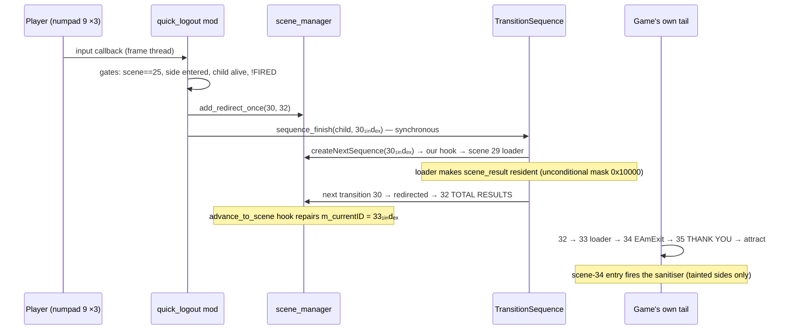
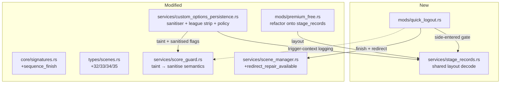

# Quick Logout — Detailed Design

Status: Approved 2026-07-27

## 1. Overview

Two coupled deliverables for the DDR World hook DLL:

1. **Quick Logout mod** (`quick-logout`): a triple-press of numpad **9** on either
   pinpad during music selection immediately ends the session through the game's
   own end-of-session tail — TOTAL RESULTS → e-amusement logout save → THANK YOU
   FOR PLAYING → attract. No confirmation step, no on-screen UI, no configuration.
   The player no longer has to play out the remaining stages to end a session —
   the motivating case being Premium Free, whose frozen stage counter otherwise
   keeps the session alive indefinitely.

2. **Logout-save sanitisation** (policy change in existing services): a session
   tainted by Autoplay or a Quick Failure currently has its entire card-out
   logout save (`savekind == 3`) suppressed — which also silently discards the
   profile/customize write-back that only that save carries. The new policy
   strips the *score content* from a tainted side's logout save (per-stage play
   records + Dan-course record + league accumulator) and lets the profile data
   through. Applies to **every** logout save, quick or natural.

The mod's entire game-side mechanism is one function call: the engine drives all
scene transitions with a single primitive, `agcs::Sequence::finish(this,
nextSceneId)`, and nothing in the end-of-session tail checks whether the session
ended legitimately. One new AOB signature; no new detours.

## 2. Detailed Requirements

### Functional

| # | Requirement |
|---|---|
| FR1 | Triple-press of numpad 9 (3 presses within 1.5 s, per side) during **plain music selection** (0-indexed scene 25) triggers the logout chain immediately. Either side may trigger; it ends the session for both. No confirmation, no prompt. |
| FR2 | The chain always includes TOTAL RESULTS: arm a one-shot scene redirect `30 → 32` (0-indexed), then call `finish(active_child, 30)` (**1-indexed** = the 0-idx 29 loader). Resulting chain: 29 loader (loads `scene_result`) → 32 TOTAL RESULTS → 33 loader → 34 `EAmExitRootSequence` (credit expire + logout save) → 35 THANK YOU → attract. |
| FR3 | Trigger gates: scene == 25, at least one side entered (`PlayerWork+0x4 != 0`), active child alive (tree flags `& 0x24 == 0`), and a per-session fired latch. No course-mode or event-mode gates (verified unnecessary — see Appendix A). |
| FR4 | Diagnostics: log the trigger context (sides entered, per-side taint), then log each subsequent scene transition with elapsed time. WARN if 0-idx 34 never appears before 35 (logout save skipped) or if 34 exits in < 500 ms (save likely no-oped). |
| FR5 | Sanitisation: on entry to 0-idx scene 34, for each side whose session is tainted, write `mcode = -1` into all five per-stage play records **and** the course record. On that side's `savekind == 3` send, additionally remove the `<league>` node from the request, then forward the save. |
| FR6 | Fail closed on score integrity: if the sanitiser could not arm (layout decode failed, scene hook unavailable, or the league-removal ordinal missing), a tainted side's logout save is suppressed outright (today's behaviour). |
| FR7 | Per-stage saves (`savekind == 2`) keep today's all-or-nothing suppression. Autoplay keeps failing closed on save-hook availability. Quick Logout itself writes no taint and no game state (the sanitiser's record wipes are the only writes, and only for tainted sides). |
| FR8 | On/off via `mods["quick-logout"]` in `mod-config.json` and the triple-0 overlay menu toggle. No config block, no per-player option row. |

### Assumptions

- **A1 (the one real unknown):** a forced entry into `EAmExitRootSequence`
  performs the logout save — i.e. ark's per-side entry flow advances to its
  GAMEMODE scene in response to `arkExpireCredit`/`arkEACoinExpire`. All static
  evidence supports it (the login sequence is structurally symmetric; the
  THANK-YOU sequence acks those ark scenes itself when e-amusement is off), but
  the flow lives in `arkmdxbio2.dll`. FR4's diagnostics exist to catch the
  silent-failure mode on the first cabinet test.
- **A2:** zero-stage `savekind == 3` payloads are already cabinet-proven — under
  Premium Free the frozen record is virginised every song-select entry, so
  natural logouts on this cabinet have been sending empty stage lists all along.
- **A3:** the backend is bemani-buddy (`crates/game-server/src/handlers/ddr_world/playdata.rs`),
  which ignores regular-song results in `savekind == 3` (already saved per-stage),
  consumes that result list only for Dan-course grades, stores `<league><current>`
  verbatim, and no-ops when `<league>` is absent. The design's sanitisation
  granularity is calibrated to exactly that consumption.

### Known, accepted limitations

- After a Premium Free session, TOTAL RESULTS will be empty or near-empty (the
  frozen record is virginised at every song-select entry; the row builder skips
  virgin records). Cosmetic.
- The 0-idx 29 loader emits one spurious POSEVT `"playmusic"` telemetry event.
  Harmless on a private backend.
- The cut out of song select has no shutter wipe — and must not be "fixed":
  TOTAL RESULTS' only exit gate waits for the shutter to reach *closed*, which
  its own `close(0)` request achieves only because the shutter is open on entry.
  **Never close the shutter before triggering.**
- A dan/grade extra-stage block in the logout marshal is not record-gated, but it
  can only fire after a class-9 (grade-check) extra stage — unreachable from a
  song-select logout and effectively unreachable on this cabinet. Documented,
  not handled.
- `<grade>` UI-cursor state (last window/mcode) passes through a sanitised save.
  It is cursor state, not score.

## 3. Architecture Overview

### Scene chain (all ids 0-indexed unless suffixed)



### Components



**Indexing convention (load-bearing):** `agcs::Sequence::finish` takes a
**1-indexed** scene id; `scene_manager`, `types::scenes`, and every log line are
**0-indexed**. The trigger mixes both within three lines. Every 1-indexed
constant in code carries a `_1IDX` suffix; the only two are
`POST_SONG_LOADER_1IDX = 30` (= 0-idx 29) and the value passed to `finish`.

## 4. Components and Interfaces

### 4.1 `core/signatures.rs` — one new signature

```rust
SignatureDefinition {
    name: "sequence_finish",
    pattern: "48 89 5C 24 08 48 89 74 24 10 57 48 83 EC 20 48 8B 59 08 48 8B F1 8B FA F6 43 20 20",
    description: "agcs::Sequence::finish(this, nextSceneId_1INDEXED) — sends msg 0x201 \
                  (advanceToScene on the TransitionSequence parent) then marks the subtree \
                  for destruction. Frees nothing; reaper runs next frame. Verified unique \
                  on 20260616 (0x18021DB90) and 20260721 (0x18021DF70).",
}
```

Type: `type SequenceFinishFn = unsafe extern "C" fn(*mut u8, i32);`

### 4.2 `types/scenes.rs` — constants

Add to `pub mod scene`: `FINAL_RESULTS = 32`, `FINAL_TO_THANKS_INTERSTITIAL = 33`,
`EAM_EXIT = 34`, `THANK_YOU = 35`. Add a comment (no rename) noting 29
`STAGE_RESULT` is actually the post-song LoadingSequence and 30 `RESULTS_DETAIL`
is the real ResultSequence — existing mods depend on the current names/values.

### 4.3 `services/stage_records.rs` — new shared layout helper (hoisted from premium_free)

Decodes the per-stage play-record layout once from the already-resolved
`stage_record_accessor` signature bytes (a tiny leaf accessor whose matched bytes
contain every constant as RIP disp32s / disp8s / imm32s):

| Constant | Source in matched bytes | Expected (2026 builds) |
|---|---|---|
| GameWork ptr-ptr global | +3 RIP disp32 | — |
| player_work_table | +16 RIP disp32 | must equal the derived `player_work_table` |
| course-mode field offset (GameWork) | +23 disp8 | 0x70 |
| **course record offset (PlayerWork)** | **+36 imm32** (course-branch `ADD RAX, imm32` — newly decoded) | 0x2D8 |
| record stride | +47 imm32 | 0x2B8 |
| record base offset (PlayerWork) | +55 imm32 | 0x590 |

API (all `Option`-returning, null-guarded, panic-free):

```rust
pub fn init(signatures: &SignatureStore, module: &GameModule) -> bool  // decode + validate
pub fn is_available() -> bool
pub fn game_work() -> Option<*mut u8>                 // **global, null-checked at both hops
pub fn player_work(side: usize) -> Option<*mut u8>    // table[side] -> wrapper -> PlayerWork
pub fn stage_record(side: usize, stage: usize) -> Option<*mut u8>  // stage 0..5
pub fn course_record(side: usize) -> Option<*mut u8>
pub fn course_field_offset() -> usize                 // for premium_free's course skip
```

Validation (fail closed, mirrors the existing premium_free checks): range-check
course offset `0x8..=0x7F`, stride `0x100..=0xFFF`, base `0x100..=0x1FFF`,
course-record offset `0x100..=0x1FFF`; both decoded globals inside the game
module; table must equal the independently derived `player_work_table`. Any
failure ⇒ `is_available() == false`.

`premium_free.rs` is refactored to consume this helper for the layout constants
(its INC-patch handling and stage-counter disp8 decode stay local — it owns that
patch site). Behaviour unchanged.

### 4.4 `services/score_guard.rs` — semantics update

The session-sticky flag no longer means "suppress the logout save"; it means
"this side's logout save needs sanitising". Changes:

```rust
// renamed (same storage, same latch/reset points):
pub fn logout_taint(side: usize) -> bool          // was is_logout_suppressed

// new: did the scene-34 sanitiser actually run for this side this session?
pub fn mark_logout_sanitised(side: usize)
pub fn was_logout_sanitised(side: usize) -> bool  // reset by reset_session()
```

Everything else (per-song taint, `mark_session_tainted` at actual-suppression
time, `is_stage_suppressed`, `reset_session` on card-in, autoplay's fail-closed
`is_available`) is unchanged.

### 4.5 `services/custom_options_persistence.rs` — sanitiser + policy

**Ordinal resolution:** add libavs **Ordinal 164** = `property_node_remove(node)`
(confirmed by decompile: null-guard logs `"%s: %s==NULL", "node_remove"` on the
`property` channel; unlinks the node from its parent chain and releases it) to
the existing numeric-ordinal resolver (162/163/175/176). Non-fatal on miss:
`LEAGUE_STRIP_AVAILABLE = false`.

**Record sanitiser** — registered as a `scene_manager::on_scene_change` callback
at the same point the save detours install:

```text
on (prev, next) where next == scene::EAM_EXIT (34):
  for side in 0..2:
    if score_guard::logout_taint(side):
      if stage_records::is_available():
        for stage in 0..5: write_i32(stage_record(side, stage), -1)   // mcode = -1
        write_i32(course_record(side), -1)
        score_guard::mark_logout_sanitised(side)
        log_info!("logout sanitiser: P{} records virginised (tainted session)")
      else:
        log_warn!("logout sanitiser unavailable — P{} logout save will be suppressed")
```

Timing: the scene hook fires inside `createNextSequence(34)`, strictly before
`EAmExitRootSequence::onSetup` and several frames before `SavePlayerDataActor`
marshals the records. TOTAL RESULTS (scene 32) has already rendered, so the
summary is unaffected. The records are dead state after this point regardless —
the next session start re-initialises them.

**`save_sender` policy** (the existing trampoline; `savekind` at `savedata+0x74`,
`playside` at `savedata+0x90`):

```text
savekind == 2 (per-stage): unchanged — suppress if is_stage_suppressed(side),
                            latch mark_session_tainted(side).
savekind == 3 (logout):
  if !logout_taint(side):            forward unchanged (as today).
  else if was_logout_sanitised(side) && LEAGUE_STRIP_AVAILABLE:
      node = find <data> → <league>; if found: property_node_remove(node)
      log_warn!("P{side} logout save SANITISED — scores stripped, profile forwarded")
      forward.
  else:
      log_warn!("P{side} logout save SUPPRESSED (sanitiser unavailable)")
      return pretend-success (today's behaviour).
```

The kbin mutation happens at the same point in the trampoline where the service
already mutates the request tree (the `mod_*` child injection), using the same
find-child ordinal.

Rationale for the league strip: the league score is a client-side accumulator
(`floor(score/1000) + exscore` per song) sourced from `PlayerWork`, not from the
stage records, so record-virginising does not cover it; the backend stores the
sent value verbatim but no-ops when the `<league>` node is absent, preserving
the pre-session score. Removing the node is the only mutation primitive needed.

### 4.6 `services/scene_manager.rs` — one new accessor

```rust
pub fn redirect_repair_available() -> bool   // AtomicBool set when the
                                             // advance_to_scene hook installed
```

Load-bearing for Quick Logout: without the `m_currentID` repair, a `30 → 32`
redirect leaves `TS+0x68 = 30₁ᵢₙdₑₓ`, and the tail after TOTAL RESULTS would run
`getNextID(0x1F) = 0x20` — the stage-bump Wait sequence back to song select —
instead of the logout. The mod refuses to enable if this returns false.

### 4.7 `mods/quick_logout.rs` — the mod

```rust
pub struct QuickLogoutMod { input_cb: Option<usize>, scene_cb: Option<usize> }
impl Mod for QuickLogoutMod {
    fn id(&self) -> &str { "quick-logout" }
    fn required_signatures(&self) -> &[&str] { &["sequence_finish", "player_work_table"] }
    // init: cache sequence_finish fn ptr + player_work_table.
    // enable: gate on scene_manager::is_available() && redirect_repair_available();
    //         register input callback + scene callback. disable: remove both.
}
```

Constants (offsets documented against the actor layout, same values
`quick_restart_or_fail` already ships): `ACTIVE_CHILD_OFFSET = 0x58` (the
TransitionSequence's current gosub child), tree-flags offset `0x20` with dead
mask `0x24`, `PLAYER_WORK_ENTERED_OFFSET = 0x4` (side-entered byte),
`POST_SONG_LOADER_1IDX = 30`.

**Input callback** (frame thread, panic-free):

1. `Pressed` + `button == NUM_9` + player P1/P2, else return.
2. If `scene_manager::current_scene() != scene::SONG_SELECT`, clear that side's
   gesture buffer and return.
3. Record into the per-side gesture buffer (3 presses / 1.5 s — the same
   `GestureBuffer` shape as quick-restart). Not triggered ⇒ return.
4. `try_trigger()`:
   - `FIRED` latch already set ⇒ return.
   - Session gate: any side with `stage_records::player_work(side)` non-null and
     `*(work + 0x4) != 0`. (Falls back to "pass" with a one-time WARN if
     `stage_records` is unavailable — the scene gate alone still holds.)
   - `ts = scene_manager::current_transition_sequence()?`;
     `child = *(ts + 0x58)`, non-null; `(*(u32*)(child + 0x20)) & 0x24 == 0`.
   - Log trigger context: entered sides, `score_guard::logout_taint(side)` per
     side (so a "profile won't fully save / will be sanitised" situation is
     visible in the log at the moment of trigger).
   - `scene_manager::add_redirect_once(scene::RESULTS_DETAIL /*30*/, scene::FINAL_RESULTS /*32*/)`
   - `sequence_finish(child, POST_SONG_LOADER_1IDX)` — synchronous; our scene
     hook runs re-entrantly during this call (verified deadlock-free: the input
     manager dispatches callbacks outside its lock; the mod holds no lock of its
     own across the call).
   - Set `FIRED`, stamp `TRIGGER_AT = Instant::now()`.

**Scene callback** (diagnostics + latch reset):

- While `FIRED`: log `quick-logout tail: {prev}→{next} (+{ms} ms)` for every
  transition. Track "seen 34" and its entry time. On `next == 35`: WARN if 34
  was never seen (`logout save skipped — eam offline or ark entry-flow failure`)
  or if 34 lasted < 500 ms (`EAmExit exited suspiciously fast — verify the save
  reached the backend`).
- On `next == scene::SONG_SELECT`: clear `FIRED` and all gesture buffers (new
  session or aborted chain — either way, re-arm).

**Gesture-collision note:** numpad 1/3 (quick-restart/fail) are gameplay-gated,
numpad 0 (mod menu) is scene-independent but a different key; 9 is free. The
matching/battle song-select variants (0-idx 47/49) never equal `SONG_SELECT`, so
the gesture is inert there by construction.

### 4.8 `lib.rs` wiring

- `services::stage_records::init(...)` immediately before
  `custom_options_persistence::init(...)` (the sanitiser consumes it).
- Register `QuickLogoutMod` in the mod registration block.

## 5. Data Models

### Per-stage play record (PlayerWork, decoded layout)

```
PlayerWork + 0x590 + stage*0x2B8   (stage 0..5)   — normal-play records
PlayerWork + 0x2D8                                 — course record (style == 10)
record + 0x00  : i32   mcode      (-1 = virgin — the marshal's skip key)
record + 0x268 : u64   end_time   (0 = never finished — second skip key)
```

The `savekind == 3` marshal walks `0 .. min(stage_counter+1, 5)` (or the single
course record when `PlayerWork+0x4C == 10`) and **skips any record with
`mcode == -1 || end_time == 0`** — both the stage-list body and the header
count/validity-bitmask derive from the same test, so `mcode = -1` alone yields a
consistent zero-stage payload. All other payload content (name, weight fields,
~29 customize getters, played-music tree, option/side-panel cursors, event
table) is sourced from `PlayerWork`/`Customize` — profile data the save exists
to carry.

### Mod state (all lock-free or leaf-locked)

```rust
static SEQUENCE_FINISH: AtomicPtr<u8>;             // resolved fn ptr
static FIRED: AtomicBool;                          // per-session trigger latch
static TRIGGER_AT: Mutex<Option<Instant>>;         // diagnostics epoch
static GESTURE: Mutex<[GestureBuffer; 2]>;         // per-side triple-9 buffers
static SEEN_34_AT: Mutex<Option<Instant>>;         // tail diagnostics
// score_guard additions:
static SANITISED: [AtomicBool; 2];                 // was_logout_sanitised
```

### Config

None. `mods["quick-logout"]` only (absent ⇒ enabled, like every registry mod).

## 6. Error Handling

Graceful-degradation matrix (every row logs exactly once at the stated level):

| Failure | Effect | Level |
|---|---|---|
| `sequence_finish` AOB missing | ModRegistry skips the mod entirely | WARN (registry) |
| `scene_manager` unavailable or `redirect_repair_available() == false` | mod refuses to enable (redirect would mis-route the tail into the stage-bump path) | WARN |
| `current_transition_sequence()` null / active child null / child dying (`flags & 0x24`) | trigger no-ops | WARN |
| `stage_records::init` decode/validation failure | sanitiser unarmed ⇒ tainted logout saves suppressed (FR6); premium_free also fails closed (as today); quick-logout trigger still works, session gate degrades to scene-gate-only | WARN |
| Ordinal 164 unresolved | league strip unavailable ⇒ tainted logout saves suppressed (FR6) | WARN |
| `<league>` node absent in a sanitised save | skip removal, forward | none (normal) |
| Scene 34 never observed after trigger | logout save did not run (assumption A1 failed) | **WARN — the key diagnostic** |
| Double trigger | impossible: `FIRED` latch + `current_scene()` leaves 25 synchronously inside `finish` + dead-child flag test | — |

Hook-path code (input callback, scene callbacks, save trampoline additions) is
panic-free by construction: no `unwrap`/`expect`/indexing, all pointer walks
null-guarded, side indices bounds-checked. The trigger path runs entirely on the
frame thread; `finish` frees nothing (the reaper runs next frame), so no
`run_on_render_thread` hop is needed or wanted.

## 7. Testing Strategy

No unit tests exist in this codebase; validation is live deployment. Build gates
before any cabinet handoff: `cargo check --target x86_64-pc-windows-msvc` clean →
`cargo fmt` (whole crate) → `./build.sh` clean.

Cabinet checklist, ordered by risk:

1. **Clean-session logout save (assumption A1).** Card in, play one song
   normally, triple-9 at song select. Expect: TOTAL RESULTS with one row → the
   LOGOUT window (scene 34) → THANK YOU → attract. Logs: trigger context, tail
   timings, no WARN. Backend: `savekind == 3` received; profile fields intact.
2. **Profile write-back round-trip.** Change a WebUI cosmetic + weight field
   during the session, quick logout, card back in: values must persist.
3. **Tainted-session sanitise.** Enable Autoplay, play one song, disable it,
   quick logout. Logs: sanitiser virginise lines + `SANITISED` save_sender line.
   Backend: profile updated, **no** new scores/Dan/league rows; play_count +1.
4. **Natural-logout sanitise (D21 scope).** Same taint, but end the session by
   playing out the stages. Same sanitise behaviour at the natural scene 34.
5. **2P asymmetric taint.** P1 autoplay, P2 clean: P1 sanitised, P2 forwarded
   untouched — both profiles saved.
6. **Double/held-press abuse.** Mash 9 during the transition; verify exactly one
   chain (latch) and clean re-arm at the next session's song select.
7. **PASELI session** (`PlayerWork+0x8 == 3`): verify scene 34's
   `arkEACoinExpire` path closes the session without hanging.
8. **Timing sanity across FPS presets** (the 1.5 s gesture window is wall-clock;
   just confirm at the operator's configured refresh).
9. **Modal check (R3, cosmetic):** does triple-9 fire while the song-select
   options modal is open? Record the answer in the research doc either way.

Post-validation: fold cabinet findings into `docs/quick_logout_research.md`
(which currently carries a "nothing cabinet-validated" banner), add the AGENTS.md
entry-point row and README operator section.

## Appendix A — Load-bearing RE findings (verified on gamemdx 20260721 / 20260616)

- **`agcs::Sequence::finish` (`0x18021DF70` / `0x18021DB90`)** sends message
  `0x201` to the parent TransitionSequence — whose handler is `advanceToScene`
  (construct next sequence, install as gosub child, update `m_currentID`) — then
  flags the calling subtree for destruction (`flags |= 4`). It frees nothing;
  the reaper runs once per frame from the main loop. Calling it from the frame
  thread is safe; the transition is synchronous.
- **Scene ids:** `finish`/`advanceToScene`/`m_currentID` are 1-indexed;
  `createNextSequence`'s switch is 0-indexed (`LEA EDI,[RDX-1]`). The hook DLL's
  scene tracking is 0-indexed throughout.
- **`TotalResultSequence` (0-idx 32) requires the `scene_result` BM2D package**
  and dereferences it without a null check. The package is *not resident* at
  song select (the loader into scene 25 unloads it). The **only** loader that
  loads it is 0-idx 29 — whose load mask is `0x10000` on the unconditional
  default path (`MOV R12D, 0x10000`) with a superset variant `0x30000` behind
  the extra-stage check. Hence FR2's route: `finish(child, 30₁ᵢₙdₑₓ)` + redirect
  `30 → 32`. A direct jump to 32 crashes; a manual async load request is not a
  substitute (only LoadingSequence waits on it).
- **`getNextID`** (the automatic tail): `0x21|0x39 → 0x22`; `0x22 → arkEamOff()
  ? 0x24 : 0x23` (scene 34 runs whenever e-amusement is live); `0x23 → 0x24`;
  `0x24 → 0x25 → attract`. Nothing in the tail checks session progress.
- **Course mode is safe unguarded:** TotalResultSequence's course fork
  (`GameWork+0x70 != 0`) never touches the package — it requests its own shutter
  close and waits in its exit state for shutter==closed, then `finish(0)`.
  **Event mode is safe unguarded:** the update reads the event field nowhere,
  and `getNextID` merges the event summary scene (`0x39`) into the same
  successor. (Also unreachable in practice: the trigger's scene gate.)
- **Shutter invariant:** TotalResult's exit gate waits for *closed*; entering
  from song select the shutter is *open*, which is exactly what makes its own
  close request effective. Pre-closing the shutter would soft-lock scene 32.
- **`EAmExitRootSequence` (0-idx 34)** expires the credit/PASELI per entered
  side in `onSetup` (gated only on `PlayerWork+0x4`/`+0x8`), builds the LOGOUT
  window, and creates `SavePlayerDataActor(side, stage = -1)` → per-side
  `savekind = 3` request. **No session-state gate of any kind.** A side that
  never entered stays at ark scene 0 and produces no save actor.
- **The `savekind == 3` marshal** (`ReflectSavePlayerData`, `0x180018E50`):
  stage-score emission is entirely record-sourced and skip-gated on
  `mcode != -1 && end_time != 0`; course sessions (`PlayerWork+0x4C == 10`)
  marshal the course record at `PlayerWork+0x2D8` instead of the array; the
  league block is a `PlayerWork` accumulator (not record-sourced) — hence the
  three-part sanitisation: array records, course record, `<league>` node.
- **libavs Ordinal 164 = `property_node_remove(node)`** (self-identifying log
  string), same numeric-ordinal family the persistence service already resolves
  (162 find-child, 163 add-child, 175 get-context, 176 read-value).

## Appendix B — Alternatives considered

- **No-summary variant** (`finish(child, 34₁ᵢₙdₑₓ)`, skipping TOTAL RESULTS):
  simpler and package-independent; rejected as a shipped mode (user decision) —
  the summary path subsumes its logout chain, so it also stopped being needed as
  a de-risking milestone.
- **"Make this my last stage"** (write the never-written final-stage override
  `GameWork+0x10 = GameWork+0xC`, letting the game end the session vanilla-style
  after the current song): zero-risk complement, out of scope; recorded as
  future work.
- **kbin packet surgery instead of record virginising** for the stage list:
  rejected — the records are the marshal's single source, the `mcode = -1` write
  is an already-cabinet-proven operation (premium_free performs it on the same
  records), and A2 shows zero-stage payloads are already routine.
- **Per-stage taint tracking** (strip only tainted stages from the logout save):
  rejected — clean stages were already uploaded by their own per-stage saves,
  and the backend ignores regular-song results in the logout payload anyway.
