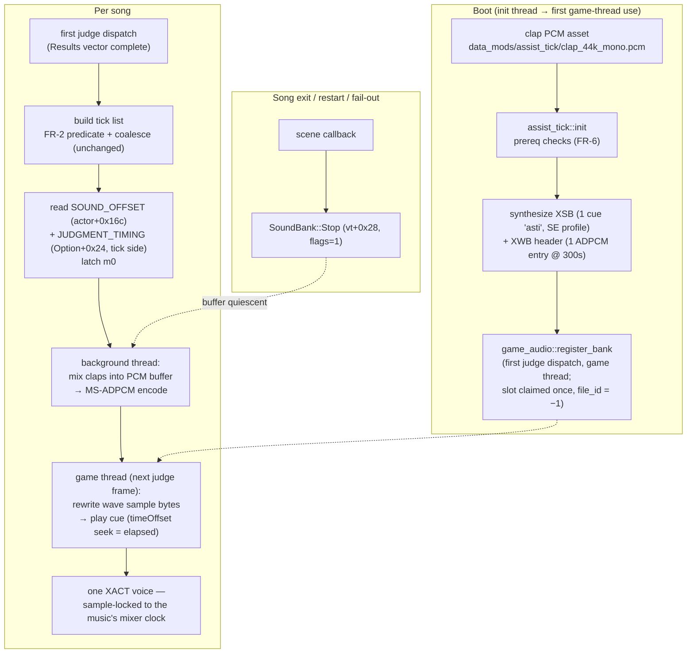

# Detailed Design — Assist Tick: Pre-Mixed Tick Track

**Status: Approved 2026-07-29 (maintainer)**

> **Amendment 2026-07-29 (approved, maintainer): `Play(timeOffset)` is NOT a seek — replaced
> by block-aligned content shifting.** Live Step-2 testing plus a deeper trace refuted the
> seek semantics this design assumed for late starts and rewind re-anchoring (FR-7/D9):
> `timeOffset` only fast-forwards the cue's *event* timeline
> (`Wave_ComputeScheduledStartMs`: `sched = now + event_time − timeOffset`), and an
> already-due wave starts at **sample 0** (`Sound_InsertWaveSortedOrStartNow` →
> `Wave_StartNow_NoSampleOffset`) — consistent with Appendix A's own "no sample-offset
> start" finding. Replacement mechanism: MS-ADPCM blocks are fully self-contained
> (128 samples = 2.90 ms each), so the rewrite copies `encoded[skip_bytes..]` into the
> segment head and silence-fills the tail — every clap shifts earlier by exactly the
> skipped blocks (≤ 1.45 ms rounding, one constant per song, inside the start-instant
> budget). `skip = mc_now − m0` at commit unifies normal start, late start, and rewind
> re-anchor into one code path (content already in the past shifts out of the track);
> `Play` is always called with `timeOffset = 0`. API: `rewrite_tick_wave(h, encoded,
> skip_bytes)` + `se_bank_synth::shift_bytes_for_ms`; `play_tick_track(h, cue)` has no
> seek parameter. A second amendment from the same session: the tick bank claims **no
> manager sound-bank slot**, and its internal name is **`astk`** (the shipped bank's
> `asti` cross-paired by the engine's global name matching). Everywhere below that reads
> "`timeOffset` seek", "slot rules", or "`asti`", this amendment governs.

## Overview

The Assist Tick mod plays a clap at each arrow's chart timestamp as an audible timing
reference. The shipped implementation triggers one engine cue per clap from a per-frame clock,
which stacks two quantizers — frame-boundary detection (±½ frame) and the XACT engine's
packet-grid cue starts (~±5 ms) — producing audible tick-to-tick jitter in 8th/16th bursts.

This feature replaces per-tick triggering with a **pre-mixed whole-song tick track**: at song
start the mod synthesizes one continuous mono waveform with every clap mixed in at its exact
sample position, wraps it in the game engine's own wave-bank format, and plays it **once** as a
single cue. Clap spacing becomes sample-exact by construction; the only residual error is one
constant per-song start offset. The clap is timed to the **judgement moment** — "the game thinks
you should have hit the arrow just now" — derived entirely from game state (no operator tuning
knob): the cabinet's declared audio latency (`SOUND_OFFSET`) plus the player's own per-side
JUDGMENT TIMING option.

Target binary: `gamemdx.dll` (DDR World), plus its shipped XACT engine `xactengine2_10.dll`.
All game addresses are resolved at runtime by AOB/RTTI (repo norm); the file-relative addresses
in this document are from builds 20260324/20260721 and serve as verification anchors only.

## Detailed Requirements

Consolidated from the accepted decision register (D1–D11, all Accepted 2026-07-29; readiness
confirmed 2026-07-29).

### Functional

- **FR-1 (D1):** Ticks are delivered by one pre-mixed, per-song tick track played as a single
  cue through the game's own XACT engine. The shipped per-tick `se_play` path is removed from
  the playback path.
- **FR-2 (D11):** Tick eligibility, coalescing, and side selection are unchanged from the
  shipped mod: `kind == 0` rows only, the engine's own 4-panel-TRG shock exclusion, live-panel
  guard, `music_count ≥ 0`, 4 ms coalescing, FR-5 side choice (solo → that side; versus → P1 or
  the only enabled side; doubles → the single actor), per-song enable latch at GAMEPLAY entry.
- **FR-3 (D2):** Each clap is audible at the judgement moment of its row. Track content
  position for note `t_i` (ms, chart/Results domain):

  ```
  content_ms(i) = t_i + JUDGMENT_TIMING(side) − SOUND_OFFSET − m0
  ```

  where `SOUND_OFFSET` is the per-song latched cabinet audio-latency declaration
  (`GamePlayActor+0x16c`), `JUDGMENT_TIMING(side)` is the tick side's per-player option
  (`ddr::player::Option+0x24`, ±100 ms), and `m0` is the raw music counter at track start.
  Alignment with the *heard* music follows automatically exactly when the cabinet's
  `SOUND_OFFSET` is calibrated; the imperative is judgement alignment.
- **FR-4 (D3):** No latency knob. The overlay row is removed; a persisted legacy
  `assist_tick.offset_ms` is ignored (never reinterpreted). Reserved contingency: a config-only
  trim key (new name, default 0, no UI) may be added later if listening reveals a residual
  fresh-start constant (~38 ms was measured for per-trigger claps on the CrossOver setup).
- **FR-5 (D4):** In versus with both sides enabled, the track follows P1's chart and P1's
  JUDGMENT TIMING (the FR-5 side-choice rule selects the actor; that actor's side supplies the
  option value).
- **FR-6 (D5):** No fallback playback path. Boot-time prerequisite failure ⇒ the mod fails
  `init()` and never appears. Per-song synthesis/playback failure ⇒ that song is silent, one
  WARN.
- **FR-7 (D9):** The track starts at the first judge dispatch of the song. A clock rewind
  beyond the shipped `REWIND_MS` guard re-anchors by stopping the cue and re-playing it with a
  `timeOffset` seek (never a rebuild).
- **FR-8 (D6):** Charts whose last tick exceeds the track capacity (300 s) get claps up to the
  cap; one WARN.

### Non-functional

- **NFR-1 (D10):** Synthesis (mix + encode) runs on a background thread; no file IO or bulk CPU
  on the judge dispatch or render paths. Engine calls (register/rewrite-commit/play/stop) happen
  on the game thread only.
- **NFR-2 (D6/D8):** Exactly one wave-bank/sound-bank pair for the process lifetime, registered
  once, never destroyed, `file_id` left at −1 (the immortal-bank rule). Per-song changes touch
  only the wave sample bytes.
- **NFR-3:** All logging through the repo's `log_*` macros; one-shot WARNs for per-song
  failures; a once-per-song INFO build line for diagnostics (mirrors the shipped mod).
- **NFR-4:** Fail-closed resolution: every new signature/derivation missing ⇒ mod disabled at
  init (FR-6), never a partial install.

### Assumptions

1. **JUDGMENT TIMING sign:** `+timing_music` shifts the ideal-step moment later (a FAST-biased
   player sets positive per the in-game help text). Implemented as one named constant/sign in
   `content_ms()`; validated by ear on the first cabinet listen; trivially reversible.
2. **ADPCM SNR (17.4 dB)** from the ported encoder is adequate for a clap (carried from the
   shipped feature's open item E).
3. **Stop→reap→rewrite race:** rewriting at the *next* song's build, seconds after an immediate
   Stop, is outside any engine read window. Double-buffering (two wave entries) is the
   documented fallback if testing disproves this.
4. **One long in-memory ADPCM entry (300 s)** is within engine limits (the format's fields are
   32-bit; the engine's own validator rules were replayed offline for the shipped banks and
   carry no duration cap relevant at this size).

## Architecture Overview



Division of responsibility:

| Layer | Owns |
|---|---|
| `services/game_audio` (extended) | The entire XACT game-ABI surface: existing register/play, **new** `stop_cue`, **new** fixed-capacity rewritable wave bank (`register_tick_bank`, `rewrite_tick_wave`, `play_tick_track`) |
| **new** `services/se_bank_synth` | Pure-CPU format work, no game ABI: MS-ADPCM encoder, XWB writer (fixed-header + sample-segment rewrite), XSB SE-profile writer, clap mixing (ports from the sibling `ddr-chart-tools`) |
| `mods/assist_tick` (reworked) | Policy: tick list (unchanged), offset reads, m0 anchor, background-synthesis orchestration, lifecycle (scene/judge wiring), option row (unchanged) |

## Components and Interfaces

### 1. `services/game_audio` — additions

The service keeps its existing contract (init on the DLL init thread resolves addresses only;
all engine calls game-thread-only; permanent failures latch one WARN).

```rust
/// Stop every instance of a cue in a registered bank. GAME THREAD ONLY.
/// flags=1 (immediate) always — vt+0x28 masks to &1 (XACT_FLAG_STOP_IMMEDIATE).
pub fn stop_cue(bank: BankHandle, cue: &CStr) -> bool;

/// Register the tick bank: an XSB (built once by se_bank_synth) plus an XWB whose single
/// ADPCM entry is declared at TICK_CAPACITY. The XWB buffer is retained by the engine
/// (never copied), so the returned handle carries a raw pointer to the sample segment
/// for later in-place rewrites. Idempotent per name, same slot rules as register_bank.
pub struct TickBankHandle { bank: BankHandle, sample_seg: *mut u8, sample_len: usize }
pub fn register_tick_bank(req: BankRequest) -> Option<TickBankHandle>;

/// Overwrite the wave's sample bytes. GAME THREAD ONLY, and only while no tick cue is
/// live (caller contract; guarded by the mod's play-handle state). `encoded` must be
/// exactly `sample_len` bytes (synth pads with encoded silence).
pub fn rewrite_tick_wave(h: &TickBankHandle, encoded: &[u8]) -> bool;

/// Play the tick cue with a millisecond seek (SoundBank::Play vt+0x20 timeOffset —
/// verified seek-into-cue semantics, ≥ 0). GAME THREAD ONLY.
pub fn play_tick_track(h: &TickBankHandle, cue: &CStr, seek_ms: u32) -> bool;
```

New signature work in `src/core/signatures.rs`: none for Stop/Play-with-offset — both are
vtable dispatches on objects `game_audio` already reaches (`SoundBank` vt+0x28 / vt+0x20 via
the existing manager-slot pointer). The vtable indices join the existing engine-module
presence gate (a different `xactengine2_10.dll` refuses to dispatch, FR-6/NFR-4).

Threading note: `play_tick_track` bypasses the game's `se_play` façade (which hardwires
timeOffset = 0) and dispatches `SoundBank::Play` directly. Every engine API takes the engine
critsec, and the façade's extra work (cue-handle table insert) is not needed because the mod
retains its own cue control via `stop_cue` by name.

### 2. `services/se_bank_synth` — new (pure CPU)

Ports from the sibling `ddr-chart-tools` (offline-proven by the shipped feature), namespaced
into this crate; no game ABI, callable from any thread:

```rust
pub const TICK_RATE_HZ: u32 = 44_100;
pub const TICK_CAPACITY_MS: u32 = 300_000;              // D6/R-D, maintainer-set

/// Build the one-cue SE-profile XSB (internal bank/cue name "asti"; mix category 6,
/// no RPC curve, wave index 0) and the fixed-header XWB (one ADPCM entry declared at
/// TICK_CAPACITY_MS). Returns (xsb_bytes, xwb_bytes, sample_seg_offset, sample_seg_len).
pub fn build_tick_containers() -> TickContainers;

/// Mix claps into a mono i16 buffer and MS-ADPCM-encode to exactly `sample_seg_len`
/// bytes (silence-padded tail). `content_ms` values < 0 are clipped at 0 with a count
/// returned (diagnostics); values ≥ TICK_CAPACITY_MS are dropped with a count (FR-8).
pub fn synthesize_track(clap_pcm: &[i16], content_ms: &[i32]) -> SynthResult;
```

Mixing is saturating i32→i16 add (claps overlap freely — the clap is ~214 ms). The encoder is
the sibling repo's `adpcm::encode` (block-based, predictor search); the XWB/XSB writers are its
`xwb`/`xsb::write_se` reduced to this fixed shape. The CRC and layout rules the engine's
validator enforces are the ones already replayed offline for the shipped banks.

### 3. `mods/assist_tick` — rework

Kept verbatim: option row (`assist_tick`, `PersistMode::Full`), scene wiring, enable latching,
`build_tick_list` (predicate + coalesce), side selection (sibling walk + FR-5 choice), degraded
mode, once-per-song diagnostics shape.

Removed: the per-frame cursor/adaptive-lead/`play_cue` clock, `TICK_OFFSET_MS`, the overlay
row, `active_config()`'s offset read (`assist_tick.offset_ms` becomes an ignored legacy key).

New per-song flow (replacing the clock):

```
first judge dispatch (rebuild_pending, as today)
  1. build tick list from the chosen actor (unchanged)
  2. read SOUND_OFFSET   = *(i32*)(chosen_actor + 0x16c)          // per-song latch
     read JUDGMENT_TIMING = Option+0x24 for the chosen side       // via the per-side
         ddr::player::Option object (same object the count function's +0x240 getter
         belongs to; resolved by a derived address, see below)
     latch m0 = this dispatch's music_count
  3. content_ms[i] = t_i + JUDGMENT_TIMING − SOUND_OFFSET − m0    // FR-3 (sign: assumption 1)
  4. spawn/queue background synthesis (steps: mix, encode)        // NFR-1
subsequent judge dispatches (per frame)
  - if synthesis result ready and not yet committed:
      ensure tick bank registered (first song only; idempotent)
      stop_cue (paranoia; no-op normally) → rewrite_tick_wave →
      play_tick_track(seek_ms = max(0, music_count − m0))         // late-start = seek (D9/D10)
  - rewind guard (music_count drop > REWIND_MS, kept):
      stop_cue → play_tick_track(seek_ms = music_count − m0)      // FR-7; no rebuild
scene exit / GAMEPLAY re-entry (quick restart) / fail-out
  - stop_cue (immediate), clear song state                        // D8
```

The judge dispatcher remains the per-frame driver (`Priority::Normal` pre-callback), but its
body shrinks to the commit/reseek state machine above — O(1), no audio call in the common
steady state.

**JUDGMENT TIMING resolution.** The per-side Option object is reached exactly as the game's
count function reaches it: `FUN_1801e7530(DAT_1806ebe50[side], 0)` → `side_ctx + 0xe0` (the
embedded `ddr::player::Option`). Two candidate mechanisms, in preference order:
1. Read `Option+0x24` directly off `side_ctx + 0xe0`, with `DAT_1806ebe50` resolved by a new
   derived address (RIP-decode from a matched instruction inside the count function — the same
   derivation style as `derive_game_audio_addresses`).
2. If derivation proves brittle across builds: fall back to reading the field at song build
   time via the `+0x240`-style virtual getter table (more moving parts; not preferred).
Missing derivation ⇒ mod disabled at init (NFR-4) — deliberate, per FR-6's no-degraded-modes
stance (unlike the shipped mod's optional-vtable degradations).

### 4. Config

`assist_tick` config section: `offset_ms` is **retired** — parsed-but-ignored with a one-shot
INFO naming it legacy. No new keys. (The D3/FR-4 contingency trim key is deliberately NOT
pre-added; adding an unused knob invites cargo-cult tuning.)

## Data Models

### Tick bank memory layout (process lifetime)

```
XSB bytes  (Box::leak, built once)     — 1 cue "asti" → wave index 0, SE profile
XWB bytes  (Box::leak, built once)     — header: 1 entry, ADPCM mono 44.1 kHz,
                                          duration = TICK_CAPACITY_MS  (IMMUTABLE)
           └── sample segment [sample_seg_offset .. +sample_seg_len]  (REWRITTEN per song)
```

Engine-side: manager slot `{file_id: −1, bank: IXACT2SoundBank*}` — the immortal-bank rule
(write only the pointer; the destroyer's linear `file_id` search can then never match).

### Per-song state (replaces the shipped `SongState` clock fields)

```rust
struct SongState {
    tick_side: i32,            // kept (diagnostics + option read)
    tick_actor: usize,         // kept (identity check)
    m0: i32,                   // music_count at anchor
    phase: Phase,              // Idle → Building → Ready(encoded) → Playing
    rebuild_pending: bool,     // kept
    last_music_count: i32,     // kept (rewind guard only)
    counts: SynthCounts,       // kept/extended diagnostics (list + clipped + dropped)
}
```

`Ready(encoded)` carries the encoded sample segment produced off-thread; handed to the game
thread via the existing mutex (no lock held across game calls — repo norm).

### Offset fields consumed (all verified, build 20260324 anchors)

| Value | Location | Latch |
|---|---|---|
| `SOUND_OFFSET` | `GamePlayActor + 0x16c` | per song (actor ctor) — read at song build |
| `JUDGMENT_TIMING` (`timing_music`) | per-side `ddr::player::Option + 0x24` (`side_ctx+0xe0`), ±100 | read at song build (options are locked during gameplay) |
| raw `music_count` | judge dispatch arg (unchanged) | per frame |

Deliberately NOT consumed: `INPUT_OFFSET`, `RENDER_OFFSET`, DISPLAY TIMING (`timing_disp`) —
all proven display-count-only (`dispMusicCount = mc + RENDER − INPUT − DISPLAY_TIMING`,
`FUN_18005f100`); they never shift the judgement moment.

## Error Handling

| Failure | When | Behavior |
|---|---|---|
| Clap PCM asset missing/short | `init()` | WARN, mod disabled (FR-6) |
| Signature/derivation missing (Option base, judge, scene, audio addrs) | `init()` | WARN, mod disabled |
| XACT module absent / slot gates fail / Create* HRESULT < 0 | first registration (game thread) | one WARN (latched), mod silent for the session — boot-time class, no retry |
| Synthesis panic/failure | per song (bg thread) | caught; one WARN; song silent (`phase = Idle`) |
| `play_tick_track`/`stop_cue` returns failure | per song | one WARN (latched per session), song silent; state cleared |
| Ticks beyond capacity | per song | claps up to 300 s, WARN with dropped count (FR-8) |
| `content_ms < 0` after shifts (early first note + large offsets) | per song | clap clipped to 0 (still audible, once); count on the build line |
| Rewind beyond guard | mid-song | stop + re-play with seek (FR-7); if the re-play fails, song silent + WARN |
| Legacy `offset_ms` present | boot | one INFO ("legacy key ignored") |

Everything is panic-free on game threads (the judge callback body keeps the shipped
catch-discipline); background-thread panics are caught at the thread boundary.

## Testing Strategy

The repo has no unit-test harness; validation is offline checks + live deployment + log
observation (repo norm), with the split: agent does builds/offline validation/log reading,
maintainer does all listening.

1. **Offline container validation (agent):** replay the engine-validator rules (the shipped
   feature's checker in `scripts/`/sibling repo) against a synthesized XSB/XWB pair dumped from
   a dev build; byte-compare the XSB against `ddr-chart-tools`' `write_se` output for the same
   parameters; assert the XWB sample segment offset/length math.
2. **Boot log (agent):** registration lines (slot computed, hr=0 twice, `file_id` −1), one-time
   container build line, no crash records.
3. **Per-song log (agent):** build line with `results/kept/…/clipped/dropped`, offsets read
   (`sound_offset`, `judgment_timing`, `m0`), synthesis duration ms, commit line (seek value).
4. **Listening matrix (maintainer):**
   - 16th-note burst chart: the jitter complaint — spacing should now be metronomic (the
     feature's acceptance test).
   - JUDGMENT TIMING ±100: claps shift by exactly that much (validates assumption 1's sign —
     if backwards, flip the named sign constant).
   - Quick restart mid-song, quick fail, natural finish, song exit during lead-in: no stuck
     audio, next song ticks normally (stop/rewrite lifecycle).
   - Versus (P2-only enabled; both enabled), doubles: side rules unchanged.
   - Optional calibration pass: raise `sound_offset` toward the CrossOver chain's real latency
     and confirm game-feel and claps converge together.
5. **Capacity edge (agent+maintainer):** a >300 s chart (or a temporarily lowered cap in a dev
   build) shows the truncation WARN and silent tail, no crash.

## Appendix A — Why the engine can't do this per-cue (RE summary)

Traced in `xactengine2_10.dll` (functions renamed in the shared Ghidra project):
`SoundBank::Play` (vt+0x20) → `Sound_Play` → per-wave scheduled start
(`Wave_ComputeScheduledStartMs`: `qpc_now_ms + XSB event time`) → time-sorted queue
(`Sound_InsertWaveSortedOrStartNow`) drained **only** by the engine's notify-thread pump
(`Sound_PumpUpdate_DrainScheduledWaves`), which the DirectSound render thread signals every
~10 ms packet; the started voice (`Wave_StartNow_NoSampleOffset`, `voice->Start(1,0,0,0)`)
carries **no sample offset**. `DoWork` (game thread, per frame) never starts waves. So
individually triggered cues quantize to the packet grid no matter how precisely they are
triggered; only content pre-mixed *inside* one voice is sample-exact. `Play`'s `timeOffset`
parameter is validated ≥ 0 and is seek-into-cue semantics — used here for late starts and
rewind re-anchoring. `SoundBank::Stop` (vt+0x28) masks flags to `&1` = immediate.

## Appendix B — Rejected alternatives

- **Precise trigger thread** (fire `se_play` from a high-resolution timer): removes only the
  frame-quantization stage; the ~10 ms packet grid floor remains audible on 16ths. Rejected.
- **Self-hosted audio path** (WASAPI/XAudio2 side channel): sample-accurate but off the game's
  mixer clock and output chain; reintroduces an unmeasurable device-dependent constant and
  departs from the repo's one-engine principle. Rejected (was also rejected by the shipped
  feature's research).
- **Per-song bank creation instead of rewrite-in-place:** leaks ~7 MB per song (banks are
  deliberately never destroyed — destroying one a live cue references is a known crash class).
  Rejected in favor of one fixed-capacity rewritable bank.
- **Keeping the per-tick path as a runtime fallback:** rejected by the maintainer (D5) — if
  pre-mixing can't initialize, the mod fails to load; a jittery fallback would mask defects.
