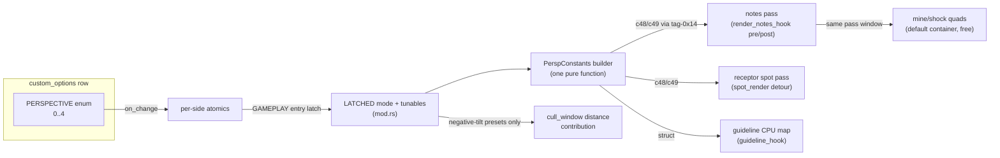

# Detailed Design: Perspective Expansion — Distant, Incoming, Space

Status: Approved 2026-07-31
Revised: 2026-08-04 (post-live-test, maintainer-directed): INCOMING and SPACE
were REMOVED after cabinet evaluation — not pleasant to play, and their
screen-center convergence exits the stock filter band in versus (the R5
limitation in practice). Their sections below are retained as designed-then-
removed record; `PerspConstants.cx` stays a free constant so re-adding them is
a preset-table change. Two additions from the same live pass: (1) a rigid
vertical realignment shift `ty` (c49.z), computed so the mapped receptor row
lands back at its stock screen height (exactly 0 for HALLWAY; ≈−57 px for
DISTANT at defaults) — consequence: DISTANT now maps content from beyond the
stock 720 px cull bound on screen, so the draw-distance contribution applies
to ANY latched preset (supersedes R7's "DISTANT contributes nothing"); (2) the
receptor HIT FLASH (an AFP clip, invisible to the perspective VS) now tracks
the mapped receptors for ALL presets: `pass_rewrite` publishes each side's
resolved `PerspConstants` per frame, and playfield_styling's `lane_hook`
composes the shared `map_point` (position + uniform component scale) after
its own playfield-scale step; the `note_result_setup` capture is
consumer-refcounted (`flash_acquire`/`flash_release`, the guideline_hook
pattern) and the perspective lane pass doubles as a pending-queue drain site,
so the correction works with playfield_styling config-disabled. ≈Identity for
HALLWAY (flash sits at the s=1 anchor row).

## Overview

The `player-perspective` mod ships with two presets: OVERHEAD (stock flat view) and
HALLWAY (a screen-space port of the StepMania/ITGMania perspective of the same name).
This feature adds the remaining three presets of the StepMania perspective family —
**DISTANT**, **INCOMING**, and **SPACE** — as new values on the existing per-player
PERSPECTIVE option row.

In the reference implementation (ITGMania `src/PlayerOptions.cpp`, offered verbatim by
the Simply Love theme), the whole family reduces to two axes:

| Preset | tilt | skew | Meaning |
|---|---|---|---|
| Overhead | 0 | 0 | flat |
| Hallway  | −1 | 0 | entrance end of the lane recedes; converges on the lane's own center |
| Distant  | +1 | 0 | receptor end recedes; converges on the lane's own center |
| Incoming | −1 | +1 | Hallway geometry, but converges on **screen center** |
| Space    | +1 | +1 | Distant geometry, but converges on **screen center** |

The shipped Hallway implementation is a screen-space hyperbolic map executed by a
single parameterized vertex-shader program (program 1 of the synthesized arrow/default
shader containers), driven entirely by per-pass constants. The accepted architecture
("one parameterized program + constant presets") anticipated exactly this extension:
all three new presets are **constant presets** against the same program. One minimal
VS extension is required — a base-zoom multiplier in the already-reserved `c49.y` —
because the positive-tilt presets (Distant/Space) need a zoom degree of freedom that
is provably not expressible in the existing constants (Appendix B). No new shader
programs, no container-geometry changes, no new signatures, no new detours.

## Detailed Requirements

R1. The PERSPECTIVE enum row gains three values, in Simply Love menu order:
    DISTANT = 2, INCOMING = 3, SPACE = 4 (appended after OVERHEAD = 0, HALLWAY = 1;
    persisted as raw i32 via the existing `PersistMode::Full` row — wire-compatible).
    No fractional-intensity variants (Simply Love exposes none).
R2. All rendered playfield elements agree per preset: note arrows, freeze bodies,
    shock/mine quads, receptors (spot pass), and guidelines all follow the same map.
R3. Geometry per preset (full math in §Data Models):
    - INCOMING = HALLWAY with convergence X moved from lane center toward screen
      center by `skew_strength`.
    - DISTANT = the same hyperbolic map with the anchor moved to mid-field, the
      direction sign flipped (field recedes toward/past the receptors), and a base
      zoom `z0` applied about the anchor.
    - SPACE = DISTANT with the INCOMING convergence-X rule.
R4. Under DISTANT/SPACE the visible field must be containable within the stock lane
    rectangle (the lane dressing — filter band, covers, danger, lane background — is
    affine-only AFP and stays stock rectangular). Default tunables are chosen so the
    entrance-edge scale ≈ 1.
R5. Known accepted limitation: under INCOMING/SPACE in versus (or single on a side
    lane), the far end of the skewed field shifts toward screen center and can exit
    the stock filter band horizontally (~125 px at default settings). SM avoids this
    only because its dressing rotates with the field. The `skew_strength` tunable
    lets an operator dial this back; doubles is automatically unaffected (lane
    center = screen center, so INCOMING ≡ HALLWAY and SPACE ≡ DISTANT — the same
    degeneracy SM has).
R6. Reverse scroll flips the geometry exactly as SM does: the effective direction is
    derived from the per-pass reverse flag already read from the renderer/guideline
    objects; presets keep their meaning relative to scroll direction.
R7. Cull-window contribution: the existing draw-distance contribution
    (`hallway_draw_distance`) applies when any side latches a **negative-tilt** preset
    (HALLWAY or INCOMING — they compress the approach region, so more content is
    visible). DISTANT/SPACE contribute nothing: their map expands the near field, so
    notes cross the screen edge continuously with the stock window (no pop-in);
    surplus contribution from the other player is harmless off-screen overdraw.
R8. Operator tunables (config `player_perspective` section; players only see the enum
    row): `distant_focal`, `distant_zoom`, `skew_strength`. INCOMING reuses
    `hallway_focal`; SPACE reuses the distant knobs. Existing keys unchanged.
R9. Existing behavior is preserved bit-for-bit where untouched: OVERHEAD stays
    zero-footprint (no emissions, no rewrites); HALLWAY renders identically (its
    base zoom is exactly 1.0, a lossless fp32 multiply); the SetShader rewrite still
    flips program 0→1 only, behind the mandatory `program_count >= 2` gate.
R10. All conventions of the shipped mod carry over: options latch at GAMEPLAY entry
    (apply next song), doubles follows P1, one detour per target, mid-song edits
    ignored.
R11. UI assets (value chips + focused-row preview panels) are fully text-based and
    generated by extending the existing label generator script — the same pipeline
    that produced the OVERHEAD/HALLWAY assets. No screenshots, no hand-made art.

Assumptions:
- The DDR lane's receptor row Y and lane center X are read per pass from the renderer
  object exactly as today; no new game-memory reads are required.
- The reserved constant `c49.y` is unused by the shipped perspective VS (verified in
  the shader source; it is documented as reserved), so old blobs simply ignore it.

## Architecture Overview

No new hooks, signatures, or containers. The change is confined to widening the
constant math inside the existing pipeline:



The one shader change: `vs_persp_main` (in both the arrow and default HLSL sources)
multiplies its scale by `c49.y`; the two perspective blobs are recompiled and
recommitted, and the container synthesis cache regenerates automatically from the
blob fingerprint. Program count and indices are untouched.

## Components and Interfaces

### 1. `src/mods/player_perspective/mod.rs`

- New constants `PERSP_DISTANT = 2`, `PERSP_INCOMING = 3`, `PERSP_SPACE = 4`; the two
  value clamps widen from `[OVERHEAD, HALLWAY]` to `[OVERHEAD, SPACE]`.
- `register_rows()` adds three `EnumValue::with_preview` entries:
  `(2, "seop_op_distant", "distant")`, `(3, "seop_op_incoming", "incoming")`,
  `(4, "seop_op_space", "space")`.
- `PerspParams` widens from `{k}` to the full latched preset:

  ```rust
  pub struct PerspParams {
      pub mode: i32,   // PERSP_HALLWAY..=PERSP_SPACE (never OVERHEAD)
      pub k: f32,      // focal length px (hallway_focal or distant_focal)
      pub z0: f32,     // base zoom about the anchor (1.0 for hallway/incoming)
      pub skew: f32,   // 0.0..=1.0 lerp of convergence X toward screen center
  }
  ```

- The GAMEPLAY latch stores mode + the resolved tunables per side; `latched_params`
  returns `Some` for any `mode != PERSP_OVERHEAD` (today it checks `mode == 1`).
- Cull contribution condition becomes "any side latched HALLWAY or INCOMING".
- New shared pure function (the single source of truth for R2):

  ```rust
  pub struct PerspConstants {
      pub anchor_y: f32, // c48.x — s=1 fixed point / Y convergence anchor
      pub cx: f32,       // c48.y — X convergence target
      pub k: f32,        // c48.z
      pub dir: f32,      // c48.w — effective sign (preset tilt ⊗ reverse flag)
      pub d_min: f32,    // c49.x — growth clamp (−0.5·k)
      pub z0: f32,       // c49.y — base zoom (1.0 = legacy behavior)
  }
  /// pos_y: receptor row Y; cx_lane: lane center X; y_dir: reverse flag ±1.
  pub fn compute_constants(p: &PerspParams, pos_y: f32, cx_lane: f32, y_dir: f32)
      -> PerspConstants;
  ```

  Consumed by the notes pass, the spot pass, and the guideline hook, each feeding its
  own per-pass `pos_y`/`cx_lane`/`y_dir` reads (unchanged from today).

### 2. `src/mods/player_perspective/pass_rewrite.rs`

- The pre-callback and the spot detour replace their inline hallway math with
  `compute_constants(...)` and emit `c48 = {anchor_y, cx, k, dir}`,
  `c49 = {d_min, z0, 0, 0}` through the existing tag-0x14 emitter. The post-callback
  SetShader rewrite is untouched (still 0→1, still gated).

### 3. `src/mods/playfield_styling/guideline_hook.rs`

- `PerspLine` (currently `{pos_y, k, y_dir}`) is replaced by carrying a
  `PerspConstants`, built at capture time via the same function. The bulk-emitter
  record transform applies the identical generalized map (playfield scale first, then
  perspective, as today):

  ```
  d  = max((y − anchor_y)·dir, d_min)
  s  = z0 · k/(k + d)
  y' = anchor_y + (y − anchor_y)·s ;  x' = cx + (x − cx)·s ;  w,h *= s
  ```

### 4. `shaders/src/gs_screencommand_arrow.hlsl` and `gs_screencommand_default.hlsl`

- `vs_persp_main` gains one instruction: `s *= PerspParams1.y` (c49.y), applied after
  the clamped hyperbolic scale, before position reconstruction and `w = 1/s`. The
  `w` output remains real and positive (`z0 > 0`, `k + d > 0` guaranteed by the
  clamp), so perspective-correct interpolation of freeze bodies is unchanged. The
  default-container copy keeps its stock-PS contract (`o3 = c23`) untouched.
- Rebuild via the shader build script (fxc 9.29 golden path); recommit the two
  perspective `.d3dbc` blobs under `data_mods/shader_fixes/blobs/`. Container
  synthesis regenerates from the blob fingerprint with no code changes.

### 5. `src/mods/config.rs`

`PlayerPerspectiveConfig` gains three keys (serde defaults; operator-edited only,
never written back):

| Key | Default | Meaning |
|---|---|---|
| `distant_focal` | 3000.0 | `k` for DISTANT/SPACE (receding toward the receptors) |
| `distant_zoom` | 0.9 | base zoom `z0` for DISTANT/SPACE |
| `skew_strength` | 1.0 | INCOMING/SPACE convergence-X lerp: 0 = lane center (no skew), 1 = screen center (SM-authentic) |

Config comments document the containment formula (entrance-edge scale
`≈ z0·k/(k − h)`, `h` = half the receptor→screen-edge span, ≈310 px) so the operator
can keep the field inside the stock rectangle when retuning.

### 6. `scripts/gen_option_labels.py`

- `RIBBONS` += `("distant", "DISTANT")`, `("incoming", "INCOMING")`,
  `("space", "SPACE")` — 132×24 teal text chips.
- `PREVIEWS` += three WIDE text-panel entries, body copy in the established voice:
  - distant: "Arrows shrink toward a vanishing point as they approach the STEP ZONE."
  - incoming: "Like HALLWAY, but the lane leans toward the center of the screen."
  - space: "Like DISTANT, but the lane leans toward the center of the screen."
  (final copy at implementation time; one or two lines each)
- Regenerate; commit **net-new PNGs only** and restore encoder churn on all
  pre-existing labels (known generator behavior).

## Data Models

### The generalized map (shader program 1 and the guideline CPU mirror)

With screen pixels `(x, y)` on the 1280×720 canvas:

```
d  = max((y − anchor_y)·dir, d_min)      // signed receding distance from the anchor
s  = z0 · k / (k + d)                    // hyperbolic scale, base-zoomed
x' = cx       + (x − cx)·s
y' = anchor_y + (y − anchor_y)·s
w  = 1/s                                 // real w → perspective-correct UVs
```

Constant registers (tag-0x14 record, per side per pass):

| reg | x | y | z | w |
|---|---|---|---|---|
| c48 | `anchor_y` | `cx` | `k` | `dir` |
| c49 | `d_min` | `z0` **(new)** | reserved | reserved |

### Per-preset constant derivation (`compute_constants`)

Inputs read per pass, unchanged from today: `pos_y` (receptor row Y), `cx_lane`
(lane center X), `y_dir` (reverse flag: +1 receptors-top / −1 receptors-bottom).
Let `entrance = 360 + 360·y_dir` (the screen edge the notes enter from) and
`W_c = 640` (screen center X).

| Preset | anchor_y | dir | k | z0 | cx | d_min |
|---|---|---|---|---|---|---|
| HALLWAY  | `pos_y` | `y_dir` | `hallway_focal` | 1.0 | `cx_lane` | `−0.5·k` |
| INCOMING | `pos_y` | `y_dir` | `hallway_focal` | 1.0 | `lerp(cx_lane, W_c, skew_strength)` | `−0.5·k` |
| DISTANT  | `(pos_y + entrance)/2` | `−y_dir` | `distant_focal` | `distant_zoom` | `cx_lane` | `−0.5·k` |
| SPACE    | `(pos_y + entrance)/2` | `−y_dir` | `distant_focal` | `distant_zoom` | `lerp(cx_lane, W_c, skew_strength)` | `−0.5·k` |

Properties (with the defaults, normal scroll, `pos_y ≈ 100`):

- DISTANT/SPACE anchor sits mid-field (`≈ 410`); the horizon is `k` px past the
  anchor in the receding direction (far off the top of the screen — missed notes
  shrink and drift off naturally, no special casing).
- Entrance-edge scale `z0·k/(k − h) = 0.9·3000/2690 ≈ 1.004` — the field is
  circumscribed by the stock lane rectangle (R4).
- Receptor-row scale `≈ 0.82`, displaced ≈57 px toward the horizon — matching the
  modest displacement of SM's own compensation (SM: 0.9 zoom + ≈30–75 px shift).
- The `d_min` clamp is direction-agnostic: it guards the `k + d → 0` blow-up on
  whichever side `d` goes negative (missed-note growth under HALLWAY/INCOMING;
  below-anchor growth under DISTANT/SPACE, where it never binds within the visible
  window at defaults but remains a hard safety bound on `w > 0`).
- HALLWAY row is byte-identical behavior to the shipped mod (`z0 = 1.0` multiplies
  losslessly; all other constants unchanged).
- Doubles: `cx_lane = 640 = W_c`, so the lerp is a no-op — INCOMING ≡ HALLWAY,
  SPACE ≡ DISTANT (R5).

## Error Handling

- **No new failure surface**: zero new signatures, detours, or container programs.
  The existing fail-closed install gate, the `program_count >= 2` SetShader gate, and
  the zero-footprint OVERHEAD early-returns are unchanged.
- **Old blobs / stale cache**: if the recompiled perspective blobs were somehow absent
  and stale containers served the pre-z0 VS, `c49.y` is simply ignored — DISTANT/
  SPACE would render un-zoomed (field overflows the lane rectangle horizontally by
  ~10–40%). Visual-only degrade, no crash; HALLWAY/INCOMING unaffected. The blob
  fingerprint cache makes this state unreachable in a normal deploy.
- **Config values**: focal lengths clamp to the existing `100..=100_000` range at
  latch time; `distant_zoom` clamps to `0.1..=1.0`; `skew_strength` to `0.0..=1.0`.
  Out-of-range JSON degrades to the clamped value, never to a panic.
- Per-pass planning stays inside the existing `catch_unwind` guards.

## Testing Strategy

Repo convention: no unit tests; validation is `cargo check` → `cargo fmt` →
`./build.sh` → cabinet deploy + log/visual observation. The verification matrix for
this feature:

| Check | Presets | Modes |
|---|---|---|
| Regression: pixel-identical rendering | OVERHEAD, HALLWAY | single, versus, doubles |
| Arrows + freeze bodies + shocks/mines follow the map | DISTANT, INCOMING, SPACE | single, versus, doubles |
| Receptors foreshorten/displace consistently with arrows | DISTANT, SPACE | single |
| Guidelines land exactly on same-offset arrows | all new | guidelines ON |
| Reverse scroll flips geometry correctly | all new | reverse |
| Field containment in stock lane rectangle | DISTANT, SPACE | filter band ON |
| Skew spill matches expectation; `skew_strength=0` removes it | INCOMING, SPACE | versus, filter ON |
| No note pop-in at the entrance edge | DISTANT, SPACE | stock cull (other side OVERHEAD) |
| Missed notes: clamped growth (neg-tilt) / shrink-off (pos-tilt) | all | deliberately missed |
| Doubles degeneracy (INCOMING≡HALLWAY, SPACE≡DISTANT) | INCOMING, SPACE | doubles |
| Persistence round-trip of values 2–4 | all new | card-in/out |
| Mixed sides (e.g. P1 HALLWAY / P2 DISTANT) | pairs | versus |

Defaults (`distant_focal`, `distant_zoom`, `skew_strength`) are expected to need a
live tuning pass, exactly as `hallway_focal` did.

## Appendix A — Reference math (ITGMania)

For the record, how the source engine realizes these presets (ITGMania
`src/Player.cpp:1764-1878`, `src/RageDisplay.cpp:498-532`): skew moves a perspective
camera's vanish point from the player's X toward screen center (FOV 45°, camera
distance ≈1.207·screen-width, off-axis frustum such that z=0 geometry is
pixel-identical to the ortho pass — skew alone is invisible); tilt rotates the
notefield actor ±30° about the mid-field pivot, with empirical compensation
`zoom *= 0.9` at full tilt and a y-offset of −45 px (positive tilt) / −20 px
(negative), both sign-flipped under reverse; draw distance grows ×1.5 at full tilt.
Simply Love (`metrics.ini:533-540`) offers exactly the five stock presets at level
1.0. The screen-space hyperbolic map used here is the projective-plane equivalent;
the mid-field pivot + 0.9 zoom of SM is what D3's "mid-field anchor + z0" mirrors.

## Appendix B — Why `z0` needs a new constant (and a VS recompile)

The existing VS realizes exactly the family of *pure anchored* projective maps
`y' = A + (y−A)·K/(K + (y−A)·W)` — three degrees of freedom, with the s=1 fixed
point pinned to the position anchor `A`. The desired positive-tilt map is "zoom by
`z0` about the anchor, then perspective": `y' = a + (y−a)·z0·k/(k + (y−a)·dir)`.
Equating the two as Möbius functions forces `(A−a)²·W = 0`, i.e. they coincide only
when `z0 = 1`. One *can* match the **scale profile** with a pure map anchored near
the entrance edge (`K = z0·k`, anchor shifted by `k(1−z0)`), but the position map
then pins receptors ~55 px farther from their stock position than the zoomed form —
losing the SM-like "receptors stay close to home" property that motivated D3. Hence
the fourth degree of freedom, `z0`, in the reserved `c49.y`: a one-instruction VS
change, no container or program-count impact, and old presets pass `1.0` for
bit-identical legacy behavior.
