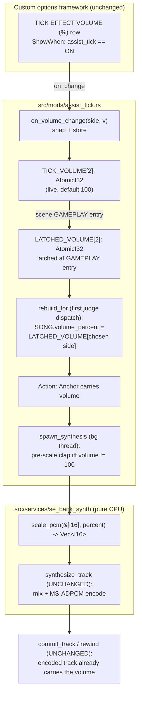

# Detailed Design: Assist Tick Volume Option

Status: Approved 2026-08-12 (including same-day revision: backend codegen scope, consolidated final validation)

## Overview

The Assist Tick mod (`src/mods/assist_tick.rs`) plays a short clap at each arrow's chart
timestamp during gameplay, pre-mixed into one continuous waveform per song and played
through the game's own audio engine. Today the mod exposes a single per-player boolean
option row (`assist_tick`, "ASSIST TICK") on the in-game MODS tab, and the clap is mixed
at the source asset's native level — there is no gain control anywhere in the pipeline.

This feature adds a per-player scalar child row — **TICK EFFECT VOLUME (%)**, option id
`assist_tick_volume` — shown only while the parent ASSIST TICK row is ON. It adjusts the
clap's amplitude from 25 % to 175 % (fine step 5, coarse step 10, default 100 = today's
unity level), with scroll semantics identical to the existing SONG PLAYBACK SPEED row.
The value persists with the player profile (network + offline JSON cache), is latched at
gameplay entry, and is baked into the per-song pre-mixed tick track — so a change applies
from the **next song**, consistent with every other assist-tick parameter.

No new hooks, no new engine surface, no framework changes: the custom-options framework
already supports predicate-driven child rows declaratively, and the volume is applied as
a pure-CPU pre-scale of the clap PCM on the existing per-song synthesis thread.

## Detailed Requirements

Consolidated from the accepted decision register (all 12 decisions accepted 2026-08-12).

| # | Requirement |
|---|-------------|
| R1 | A per-player scalar option row `assist_tick_volume`, label **TICK EFFECT VOLUME (%)**, appears on the MODS tab directly tied to the `assist_tick` parent: visible if and only if that side's ASSIST TICK value is ON (`ShowWhen::Equals { parent_id: "assist_tick", value: 1 }`), with same-frame appear/disappear when the parent is toggled (framework behavior). |
| R2 | Range 25–175, fine step 5, coarse step 10 (Start+Left/Right), default 100 — identical scroll semantics to the `song_speed` row. `ScalarFormat::Integer`: the row shows a bare number; the "%" unit lives in the label (house convention). |
| R3 | Volume is **linear amplitude**: each clap sample is scaled by `percent / 100` with i32 headroom, saturating to i16. Values above 100 % may soft-clip if the source clap nears full scale — accepted by design (the mixer already saturates on overlapping claps). |
| R4 | 100 % is exact unity: the identity path must not rescale, re-round, or otherwise perturb the samples — a default-valued row produces a byte-identical track to today's. |
| R5 | Exactly one tick track exists per song, following the FR-5 chosen side; the **chosen side's** volume value applies. In versus with both sides enabled, that is P1's volume (the same side whose chart, judgment timing, and sound offset already win). |
| R6 | Per-side volume is **latched at GAMEPLAY entry**, alongside the existing enable latch. Mid-session changes apply next song. Quick-restart's in-place song reset keeps the latch (same song, same latch); the rewind/commit paths reuse the already-encoded track, so volume is constant within a song by construction. |
| R7 | Persistence is `PersistMode::Full` (framework default): network save/load as wire field `mod_assist_tick_volume` plus the offline `custom_options.p1/p2` JSON cache. A `load_transform` sanitizes persisted values: clamp to 25–175, snap to the nearest 5. |
| R8 | Fail-open: if the scalar-row machinery is unavailable (`row_injection_available()` false) or child registration fails, the parent bool row still registers and ticks play at unity volume — exactly today's behavior — with one WARN. Re-enable `Duplicate` reseeds the live atomics from the registry (the duplicate path does not re-fire `on_change`). |
| R9 | `scripts/gen_option_labels.py` gains one `LABELS` entry (`("assist_tick_volume", "TICK EFFECT VOLUME (%)")`) and one WIDE `Preview` panel mirroring the song_speed panel's layout, with copy: "Adjusts the volume of the clap sound played by the assist tick during gameplay." / "Less than 100% makes the clap quieter. Greater than 100% makes it louder." Generated PNGs are committed under `data_mods/custom_options/select_music_option_lang_eng_v3_ifs/tex/`. |
| R10 | Companion backend change (bemani-buddy): a nullable per-option profile column `opt_mod_assist_tick_volume` round-tripped for wire field `mod_assist_tick_volume`, following the `mod_song_speed` precedent. Without it, network persistence of this one field is inert (server ignores the unknown child) and the offline JSON cache still works. |
| R11 | Docs: README `row_order` complete example + option-id list gain `assist_tick_volume` (after `assist_tick`); README Assist Tick feature row and AGENTS.md assist-tick entry mention the volume child. |

Assumptions:

- The floor of 25 % means the row cannot fully mute the tick; the parent toggle is the
  mute. (Accepted; matches the "identical to playback speed" specification.)
- The options screen is unreachable mid-song, so "latched at gameplay entry" and "applies
  next song" are equivalent from the player's point of view.

## Architecture Overview

The change threads one integer through the mod's existing per-song pipeline. No stage is
added; two stages (option registration, synthesis hand-off) are extended.



Design rationale for the application point: the alternative — a live XACT cue/bank volume —
has no existing API in `src/services/game_audio.rs` and would require new reverse
engineering of the engine's volume surface for no benefit (the row can't change mid-song
anyway). Pre-scaling the ~214 ms clap once per song on the synthesis thread is a few
thousand multiplies on a path that already mixes a whole-song buffer, keeps
`synthesize_track` byte-compatible with its host-validation harness, and makes volume a
per-song constant with zero per-frame cost.

## Components and Interfaces

### 1. `src/mods/assist_tick.rs` — option row, latch, and threading

**New constants** (beside `OPT_ID` at the top of the file):

```rust
const OPT_VOLUME_ID: &str = "assist_tick_volume";
const VOLUME_MIN: i32 = 25;
const VOLUME_MAX: i32 = 175;
const VOLUME_STEP: i32 = 5;
const VOLUME_COARSE: i32 = 10;
const VOLUME_DEFAULT: i32 = 100;
```

**New statics** (mirroring `ASSIST_TICK_ENABLED` / `LATCHED_ENABLED`):

```rust
static TICK_VOLUME: [AtomicI32; 2];      // live option values, init 100
static LATCHED_VOLUME: [AtomicI32; 2];   // per-song snapshot, init 100
```

**New helpers:**

```rust
/// Clamp to [VOLUME_MIN, VOLUME_MAX] and snap to the nearest VOLUME_STEP.
/// Used as the persistence load_transform and defensively in on_change.
fn normalize_volume(v: i32) -> i32;

/// on_change callback: store the normalized value in TICK_VOLUME[side].
fn on_volume_change(side: u8, new_value: i32);
```

(`normalize_volume` reproduces the `snap_rate_percent` math from
`src/services/song_rate/lifecycle.rs:90–95` as a private function — same constants today,
but deliberately not shared: the two options' ranges are semantically unrelated and must be
free to diverge.)

**Registration** — in `enable()`, immediately after the existing parent registration
`match` (both its `Ok` and `Duplicate` arms leave the parent registered, which
`ShowWhen` requires; on the parent's hard-failure arm the child is skipped — no parent, no
child):

```rust
if custom_options::row_injection_available() {
    let spec = RegisterSpec::scalar(
        OPT_VOLUME_ID, VOLUME_MIN, VOLUME_MAX, VOLUME_STEP, ScalarFormat::Integer,
    )
    .step_coarse(VOLUME_COARSE)
    .default_value(VOLUME_DEFAULT)
    .show_when(ShowWhen::Equals { parent_id: OPT_ID.into(), value: 1 })
    .persist_transform(|_id, v| v, |_id, v| normalize_volume(v))
    .on_change(on_volume_change);
    match custom_options::register_option(spec) {
        Ok(_) => { /* one INFO */ }
        Err(custom_options::RegisterError::Duplicate { .. }) => {
            // Re-enable: reseed the live atomics (duplicate does not re-fire on_change).
            for side in 0..2u8 {
                on_volume_change(
                    side,
                    custom_options::get_value(side, OPT_VOLUME_ID).unwrap_or(VOLUME_DEFAULT),
                );
            }
        }
        Err(e) => { /* one WARN; unity volume (R8) */ }
    }
} else {
    // Scalar machinery unavailable: parent-only, unity volume (R8). One WARN.
}
```

The parent row's registration is byte-for-byte unchanged. Nothing is added to `disable()`
for the child beyond resetting both `TICK_VOLUME`/`LATCHED_VOLUME` slots to
`VOLUME_DEFAULT` next to the existing enable-latch resets (the parent row is likewise left
registered today — there is no unregister API).

**Latch** — in `on_scene_change` (`src/mods/assist_tick.rs:338–354`), inside the existing
GAMEPLAY-entry loop that copies `ASSIST_TICK_ENABLED[side]` → `LATCHED_ENABLED[side]`, add
the parallel copy `TICK_VOLUME[side]` → `LATCHED_VOLUME[side]`. Same ordering guarantees:
the latch happens before the rebuild is armed, so the first judge dispatch sees one
consistent snapshot.

**Song build** — `rebuild_for` (`src/mods/assist_tick.rs:801–904`) reads
`LATCHED_VOLUME[chosen.side]` next to the existing `sound_offset` / `judgment_timing`
reads, stores it in `SONG.volume_percent`, and includes it in the existing one-per-song
"song build" INFO line.

**Synthesis hand-off** — `Action::Anchor` (`src/mods/assist_tick.rs:407–416`) gains the
volume field; `tick_clock`'s `Phase::AwaitAnchor` arm passes `song.volume_percent`;
`spawn_synthesis` (`src/mods/assist_tick.rs:502–594`) takes `volume_percent: i32` and,
inside the background-thread closure:

```rust
let synth = if volume_percent == VOLUME_DEFAULT {
    se_bank_synth::synthesize_track(&clap, &track_ms)          // identity: untouched (R4)
} else {
    let scaled = se_bank_synth::scale_pcm(&clap, volume_percent);
    se_bank_synth::synthesize_track(&scaled, &track_ms)
};
```

The "synthesis done" INFO line gains `volume={}%`.

### 2. `src/services/se_bank_synth/containers.rs` — pure gain helper

```rust
/// Scale mono PCM by a linear-amplitude percentage with i32 headroom,
/// saturating to i16. 100 returns an identical copy; callers should skip
/// the call entirely at 100 (the assist-tick identity path does).
pub fn scale_pcm(pcm: &[i16], percent: i32) -> Vec<i16> {
    pcm.iter()
        .map(|&s| ((s as i32 * percent) / 100).clamp(-32768, 32767) as i16)
        .collect()
}
```

`synthesize_track`, the encoder, and the container writers are untouched — the existing
host-validation harness (`scripts/validate_se_bank_synth.sh`) remains byte-identical.
Truncation toward zero (integer division) is deliberate: symmetric around zero and
inaudible at these gain levels.

### 3. `scripts/gen_option_labels.py` — label + preview

- `LABELS` (after the `("assist_tick", "ASSIST TICK")` entry at line 74):

  ```python
  ("assist_tick_volume", "TICK EFFECT VOLUME (%)"),
  ```

- `PREVIEWS` (after the `assist_tick`/`on` panel ending at line 257, keeping the
  parent's panels adjacent):

  ```python
  Preview(
      "assist_tick_volume",
      None,
      WIDE,
      [
          "Adjusts the volume of the clap sound played by the assist tick "
          "during gameplay.",
          "Less than 100% makes the clap quieter. Greater than 100% makes "
          "it louder.",
      ],
  ),
  ```

  `value=None` — a scalar row's single fallback panel, exactly like `song_speed`'s. No
  `RIBBONS` entry (scalar rows render their value through the game's native digit path).

- Rerun the script; commit the two new PNGs (`seop_item_assist_tick_volume.png`,
  `seop_image_assist_tick_volume.png`) under
  `data_mods/custom_options/select_music_option_lang_eng_v3_ifs/tex/`.

### 4. bemani-buddy (separate repository) — persistence column

Following the per-option precedent (commit `04ddbc2` "Adding the rest of the custom
options…" and the in-flight `mod_song_speed` working-tree change with migration
`012_ddr_world_song_speed.sql`). The protocol model JSON is the wire source of truth —
generated Rust is never hand-edited:

- `models/ddr_world/playdata_3.json`: add `"mod_assist_tick_volume": "s32?"` to **both**
  option blocks (the load-response shape and the save-request shape).
- Re-run the codegen tool (`cargo run -p codegen -- <input> <output-dir>`) to regenerate
  `crates/bemani-protocol/src/ddr_world/playdata_3.rs` (`@generated` — hand-editing is
  prohibited by that repo's conventions).
- New sqlx migration (next free number after `012`): nullable column
  `opt_mod_assist_tick_volume INT NULL DEFAULT NULL` on `ddr_world_profiles`, with the
  migration-008/011 convention comment (columns stay nullable — stock clients never send
  these fields, and echoing a default to an un-hooked game could crash it).
- `crates/db/src/models/ddr_world/profile.rs` (profile model field) and
  `crates/db/src/mysql/ddr_world/profile.rs` (query columns).
- `crates/game-server/src/handlers/ddr_world/playdata.rs`: load-path emission beside
  `mod_song_speed`, `None` in the fresh-profile default block, save-path
  `child_i32(option, "mod_assist_tick_volume")` capture — stored verbatim (the DLL owns
  the valid range).
- Regenerate the committed `.sqlx/` offline query cache (`sqlx migrate run` against a
  local DB, then the prepare step per that repo's AGENTS.md).

### 5. Documentation

- `README.md`: `row_order` complete example + the option-id bullet list gain
  `assist_tick_volume` after `assist_tick`; the Assist Tick feature row gains one
  sentence describing the volume child (visible when ASSIST TICK is ON, 25–175 %,
  applies next song, chosen side in versus).
- `AGENTS.md`: the Assist Tick entry in the Key Entry Points table gains a clause for the
  volume child row and the `scale_pcm` application point.

## Data Models

| Surface | Shape |
|---------|-------|
| Registry (in-memory) | `assist_tick_volume`: i32 in [25, 175], per side, default 100 |
| Network wire (kbin) | `<mod_assist_tick_volume>` s32 child under `/data/option`, emitted/parsed by the generic framework paths (`src/services/custom_options_persistence.rs`) |
| Offline JSON cache | `custom_options.p1/p2.assist_tick_volume: <i32>` in `mod-config.json`, generic framework path |
| bemani-buddy | nullable integer column `opt_mod_assist_tick_volume` on the DDR World profile row, stored verbatim |
| Per-song state | `SONG.volume_percent: i32` (reset to 100 by `clear()`); `Action::Anchor(.., volume_percent)`; latched statics `TICK_VOLUME`/`LATCHED_VOLUME: [AtomicI32; 2]` |

All persisted readers pass through `normalize_volume` (clamp + snap), so a hand-edited
JSON value of `137` becomes `135` and an out-of-range stale server value clamps into
[25, 175].

## Error Handling

| Failure | Handling |
|---------|----------|
| Parent bool registration fails outright | Existing behavior: mod silent. Child registration is skipped (its `ShowWhen` parent would be unknown — `RegisterError::UnknownParent` is avoided, not handled). |
| `row_injection_available()` false at enable | Child not registered; one WARN; ticks play at unity volume (R8). |
| Child registration returns `Duplicate` (mod re-enable) | Success path: reseed `TICK_VOLUME` from `custom_options::get_value` for both sides, mirroring the parent's existing duplicate handling. |
| Child registration fails otherwise | One WARN; unity volume (R8). Parent row unaffected. |
| Persisted value out of range / off-step | `load_transform` = `normalize_volume` (clamp + snap); `on_volume_change` normalizes again defensively. |
| Synthesis-time concerns | `scale_pcm` is total (no failure modes); saturation on >100 % gain is by design (R3). The existing `catch_unwind` around the synthesis closure covers it like all other per-song work. |
| Mid-song rewind / quick-restart in-place reset | Rewind reuses `song.encoded` (volume already baked). In-place reset re-arms the rebuild with latches intact — the re-synthesized track uses the same latched volume ("same song, same latch"). |

## Testing Strategy

This repository's validation is live deployment plus log observation (no unit tests); the
readiness gates are `cargo check` → `cargo fmt` (whole crate) → `./build.sh`. Per the
maintainer's direction, cabinet validation is **one consolidated end-to-end pass after all
implementation steps land** — individual steps are gated on the build gates only.

Final cabinet checklist:

1. **Row visibility** — with the mod enabled, ASSIST TICK OFF hides the volume row; toggling
   ON reveals it same-frame beneath the parent (and per side in versus). Label renders as
   "TICK EFFECT VOLUME (%)", preview panel shows the new copy.
2. **Scroll semantics** — Left/Right moves by 5, Start+Left/Right by 10, clamps at 25/175,
   default 100; row shows the bare number.
3. **Audibility** — play the same song at 25 / 100 / 175: claps audibly quieter / identical
   to pre-feature builds / louder. Verify the synthesis INFO line reports the latched
   `volume=` value each song.
4. **Chosen side (versus)** — both sides enabled with different volumes: P1's volume applies
   (log's `chosen_side` matches the applied volume). Solo on P2 side: P2's volume applies.
5. **Next-song latch** — change the volume at song select after a song: the change applies
   to the next song, and quick-restarting the current song keeps the old volume.
6. **Persistence** — card-out/card-in round-trip restores the value (bemani-buddy with the
   companion change); with `persist_network` off, the JSON cache path restores it; a
   hand-edited off-step JSON value snaps on load.
7. **Fail-open** — with the child registration forced to fail (or on a build where the
   scalar donor is unavailable), the parent still works at unity volume with one WARN.

Host-side: `scripts/validate_se_bank_synth.sh` must still pass unchanged (no existing
se_bank_synth path is modified; `scale_pcm` is additive).

## Appendix: Key Existing Code Referenced

| What | Where |
|------|-------|
| Parent bool registration | `src/mods/assist_tick.rs:1172–1198` |
| Enable/volume latch site | `src/mods/assist_tick.rs:338–354` (`on_scene_change`) |
| Song build (chosen side, per-song params) | `src/mods/assist_tick.rs:801–904` (`rebuild_for`) |
| Synthesis hand-off | `src/mods/assist_tick.rs:407–416` (`Action::Anchor`), `502–594` (`spawn_synthesis`) |
| Mixer (unchanged) | `src/services/se_bank_synth/containers.rs:96–131` (`synthesize_track`) |
| Child-row precedent | `src/mods/power_user_statistics/mod.rs:75–80` (`pacemaker_threshold`), `src/mods/webui_options/profile_fields.rs:130–138` (`weight`) |
| Scroll-semantics precedent | `src/mods/song_playback_speed.rs:101–145`; constants in `src/services/song_rate/lifecycle.rs:71–95` |
| ShowWhen mechanism | `src/services/custom_options/api.rs:158–164`; `src/services/custom_options/rows.rs:281–297, 2113–2129` |
| Generic persistence | `src/services/custom_options_persistence.rs:958–1024` (save), `1061–1167` (load) |
| Label/preview generator | `scripts/gen_option_labels.py` (`LABELS` line 69, `PREVIEWS` line 239; song_speed panel lines 423–431) |
| Backend precedent | bemani-buddy commit `04ddbc2` (12 options: model JSON → codegen → migration `011` → db model/queries → handler) and the uncommitted `mod_song_speed` working-tree change (migration `012_ddr_world_song_speed.sql`, same file set); repo conventions in bemani-buddy's `AGENTS.md` (model JSON is source of truth; never hand-edit `@generated`; `.sqlx/` cache regeneration) |
